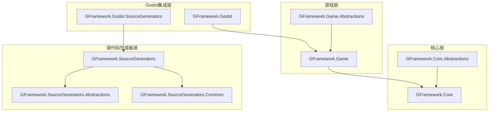
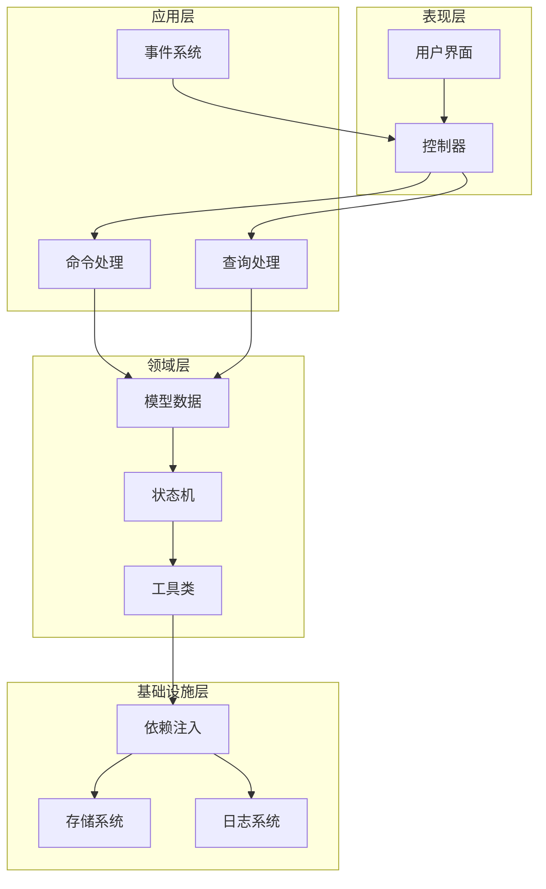
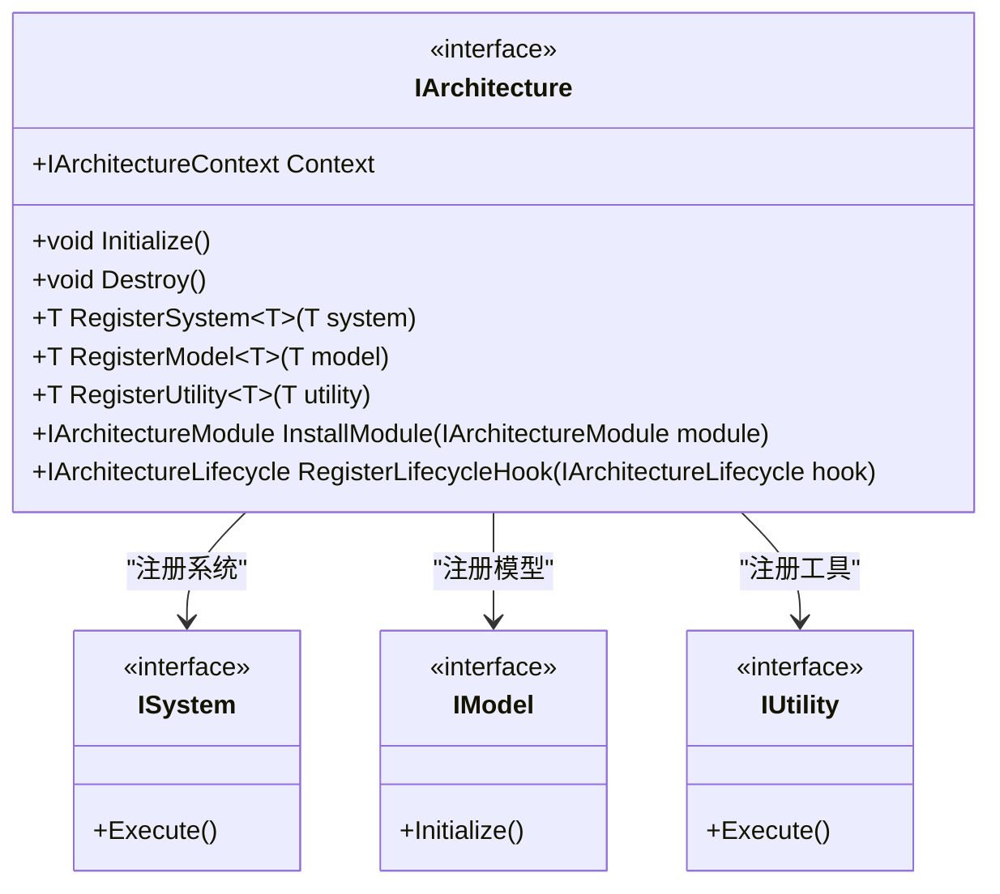
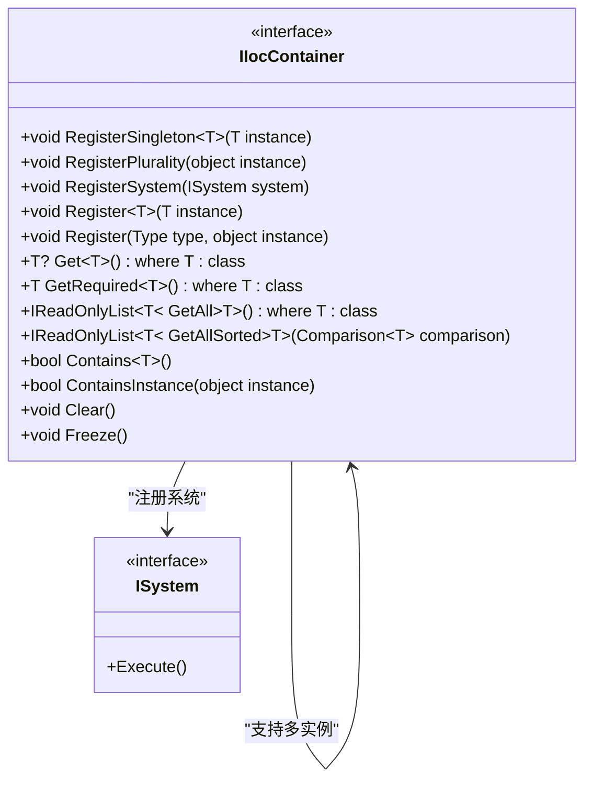
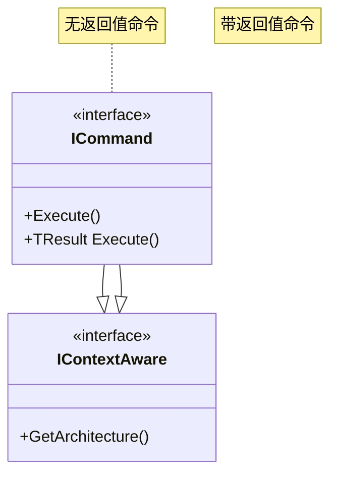
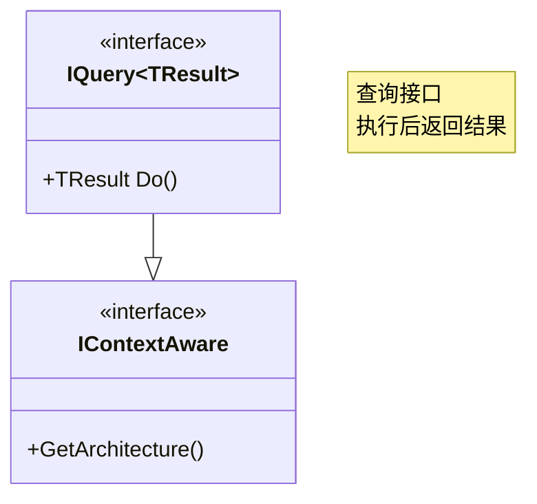
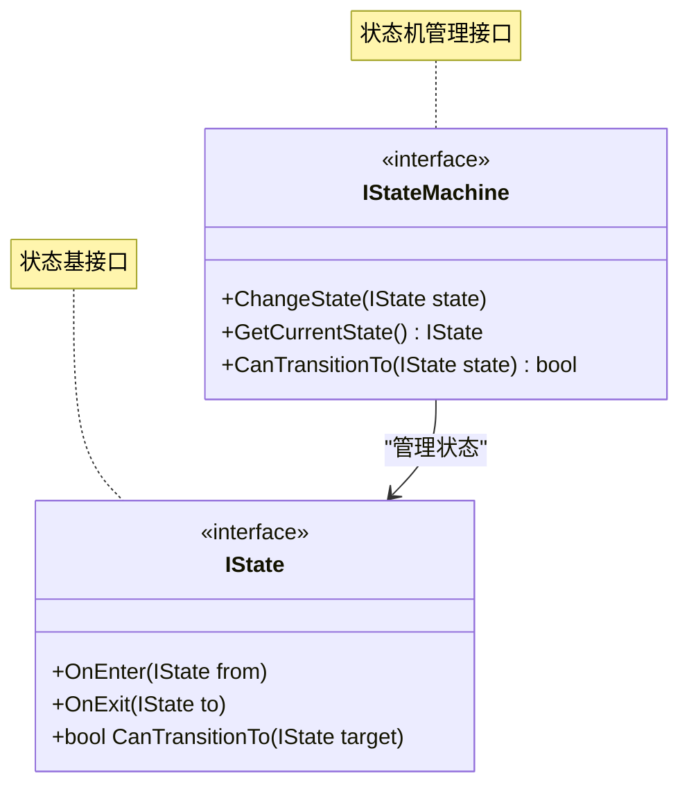
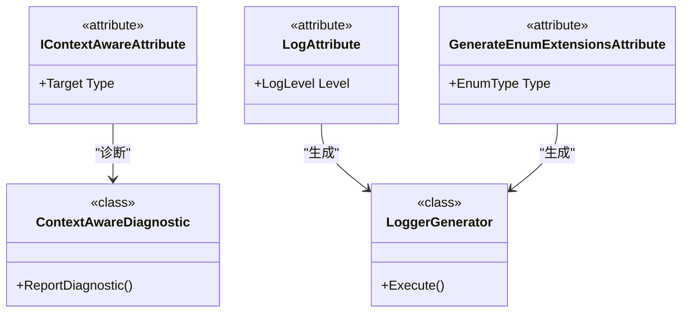
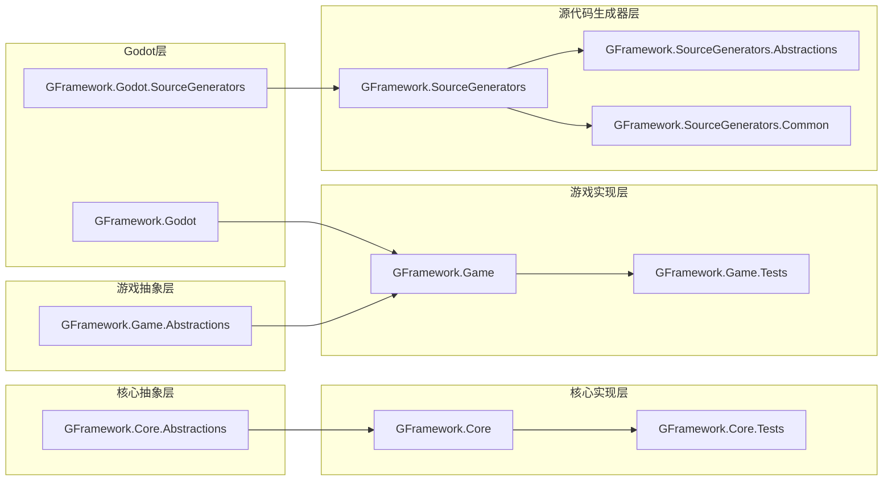

# API参考文档

<cite>
**本文档引用的文件**
- [GFramework.Core.csproj](file://GFramework.Core/GFramework.Core.csproj)
- [GFramework.Core.Abstractions.csproj](file://GFramework.Core.Abstractions/GFramework.Core.Abstractions.csproj)
- [GFramework.Game.csproj](file://GFramework.Game/GFramework.Game.csproj)
- [GFramework.Game.Abstractions.csproj](file://GFramework.Game.Abstractions/GFramework.Game.Abstractions.csproj)
- [GFramework.Godot.csproj](file://GFramework.Godot/GFramework.Godot.csproj)
- [GFramework.Godot.SourceGenerators.csproj](file://GFramework.Godot.SourceGenerators/GFramework.Godot.SourceGenerators.csproj)
- [GFramework.SourceGenerators.csproj](file://GFramework.SourceGenerators/GFramework.SourceGenerators.csproj)
- [GFramework.SourceGenerators.Abstractions.csproj](file://GFramework.SourceGenerators.Abstractions/GFramework.SourceGenerators.Abstractions.csproj)
- [IArchitecture.cs](file://GFramework.Core.Abstractions/architecture/IArchitecture.cs)
- [ICommand.cs](file://GFramework.Core.Abstractions/command/ICommand.cs)
- [IQuery.cs](file://GFramework.Core.Abstractions/query/IQuery.cs)
- [IEvent.cs](file://GFramework.Core.Abstractions/events/IEvent.cs)
- [ISystem.cs](file://GFramework.Core.Abstractions/system/ISystem.cs)
- [IModel.cs](file://GFramework.Core.Abstractions/model/IModel.cs)
- [IState.cs](file://GFramework.Core.Abstractions/state/IState.cs)
- [IIocContainer.cs](file://GFramework.Core.Abstractions/ioc/IIocContainer.cs)
</cite>

## 目录
1. [简介](#简介)
2. [项目结构](#项目结构)
3. [核心组件](#核心组件)
4. [架构概览](#架构概览)
5. [详细组件分析](#详细组件分析)
6. [依赖分析](#依赖分析)
7. [性能考虑](#性能考虑)
8. [故障排除指南](#故障排除指南)
9. [结论](#结论)
10. [附录](#附录)

## 简介
GFramework是一个基于.NET平台的游戏开发框架，专为Godot引擎设计。该框架提供了完整的架构模式实现，包括命令-查询职责分离(CQRS)、事件总线、依赖注入、状态机等核心功能。框架采用模块化设计，支持多目标框架(.NET 8.0、9.0、10.0)，并通过源代码生成器提供编译时优化。

## 项目结构
GFramework采用分层模块化架构，主要包含以下核心模块：

**图表来源**
- [GFramework.Core.csproj](file://GFramework.Core/GFramework.Core.csproj#L1-L13)
- [GFramework.Game.csproj](file://GFramework.Game/GFramework.Game.csproj#L1-L17)
- [GFramework.Godot.csproj](file://GFramework.Godot/GFramework.Godot.csproj#L1-L22)

**章节来源**
- [GFramework.Core.csproj](file://GFramework.Core/GFramework.Core.csproj#L1-L13)
- [GFramework.Core.Abstractions.csproj](file://GFramework.Core.Abstractions/GFramework.Core.Abstractions.csproj#L1-L29)
- [GFramework.Game.csproj](file://GFramework.Game/GFramework.Game.csproj#L1-L17)
- [GFramework.Game.Abstractions.csproj](file://GFramework.Game.Abstractions/GFramework.Game.Abstractions.csproj#L1-L31)

## 核心组件
GFramework的核心组件遵循清晰的接口分离原则，每个组件都有明确的职责边界：

### 架构接口体系
IArchitecture接口定义了整个框架的架构管理能力，包括系统、模型、工具的注册和获取，以及模块安装和生命周期钩子注册。

### 命令查询事件模式
框架实现了完整的CQRS模式，提供ICommand、IQuery、IEvent接口，支持同步和异步操作，以及带返回值的命令模式。

### 依赖注入容器
IIocContainer接口提供了完整的依赖注入功能，支持单例、多实例、系统实例等多种注册方式，以及类型安全的解析操作。

**章节来源**
- [IArchitecture.cs](file://GFramework.Core.Abstractions/architecture/IArchitecture.cs#L1-L68)
- [ICommand.cs](file://GFramework.Core.Abstractions/command/ICommand.cs#L1-L31)
- [IQuery.cs](file://GFramework.Core.Abstractions/query/IQuery.cs#L1-L16)
- [IEvent.cs](file://GFramework.Core.Abstractions/events/IEvent.cs#L1-L16)
- [IIocContainer.cs](file://GFramework.Core.Abstractions/ioc/IIocContainer.cs#L1-L116)

## 架构概览
GFramework采用分层架构设计，每层都有明确的职责分工：

**图表来源**
- [ISystem.cs](file://GFramework.Core.Abstractions/system/ISystem.cs#L1-L11)
- [IModel.cs](file://GFramework.Core.Abstractions/model/IModel.cs#L1-L10)
- [IState.cs](file://GFramework.Core.Abstractions/state/IState.cs#L1-L26)

## 详细组件分析

### Core API模块

#### IArchitecture接口详解
IArchitecture接口是整个框架的核心，负责管理架构的生命周期和组件注册。

**图表来源**
- [IArchitecture.cs](file://GFramework.Core.Abstractions/architecture/IArchitecture.cs#L11-L68)

**方法签名与行为**：
- Initialize(): 初始化架构组件，建立基础服务
- Destroy(): 清理架构资源，释放所有已注册组件
- RegisterSystem<T>(): 注册系统实例，支持泛型约束
- RegisterModel<T>(): 注册模型实例，提供数据管理能力
- RegisterUtility<T>(): 注册工具实例，提供辅助功能
- InstallModule(): 安装架构模块，扩展框架功能
- RegisterLifecycleHook(): 注册生命周期钩子，监听架构状态变化

**异常处理**：
- 架构销毁后继续操作会抛出InvalidOperationException
- 重复注册同一类型的服务会抛出InvalidOperationException

**使用示例路径**：
- [架构初始化示例](file://GFramework.Core.Tests/architecture/ArchitectureContextTests.cs)
- [系统注册示例](file://GFramework.Core.Tests/system/TestSystem.cs)

**章节来源**
- [IArchitecture.cs](file://GFramework.Core.Abstractions/architecture/IArchitecture.cs#L1-L68)

#### IIocContainer接口详解
IIocContainer提供了完整的依赖注入功能，支持多种注册和解析模式。

**图表来源**
- [IIocContainer.cs](file://GFramework.Core.Abstractions/ioc/IIocContainer.cs#L11-L116)

**注册方法**：
- RegisterSingleton<T>(): 单例注册，确保全局唯一实例
- RegisterPlurality(): 多接口注册，自动绑定到所有实现接口
- RegisterSystem(): 系统实例注册，特殊处理系统类型
- Register<T>(): 标准实例注册，支持泛型类型

**解析方法**：
- Get<T>(): 安全获取，不存在返回null
- GetRequired<T>(): 必需获取，不存在抛出异常
- GetAll<T>(): 获取所有实例，推荐用于接口/抽象类
- GetAllSorted<T>(): 获取并排序，系统调度专用

**实用方法**：
- Contains<T>(): 类型检查，验证实例是否存在
- ContainsInstance(): 实例检查，验证具体实例
- Clear(): 清空容器，重置所有注册
- Freeze(): 冻结容器，防止后续修改

**使用示例路径**：
- [依赖注入测试示例](file://GFramework.Core.Tests/ioc/IocContainerTests.cs)
- [系统注册示例](file://GFramework.Core.Tests/system/AsyncTestSystem.cs)

**章节来源**
- [IIocContainer.cs](file://GFramework.Core.Abstractions/ioc/IIocContainer.cs#L1-L116)

### Game API模块

#### 命令系统接口
命令系统实现了CQRS模式，提供统一的命令处理机制。

**图表来源**
- [ICommand.cs](file://GFramework.Core.Abstractions/command/ICommand.cs#L9-L31)

**接口特性**：
- 继承IContextAware，可访问架构上下文
- 支持泛型返回值，提供类型安全的结果
- 简化的执行接口，专注于业务逻辑

**使用场景**：
- 用户输入处理
- 游戏状态变更
- 数据持久化操作

**章节来源**
- [ICommand.cs](file://GFramework.Core.Abstractions/command/ICommand.cs#L1-L31)

#### 查询系统接口
查询系统提供数据检索能力，支持复杂查询操作。

**图表来源**
- [IQuery.cs](file://GFramework.Core.Abstractions/query/IQuery.cs#L9-L16)

**接口特性**：
- 泛型结果类型，提供强类型查询
- Do()方法执行查询操作
- 继承上下文感知能力

**使用场景**：
- 数据检索
- 状态查询
- 统计信息获取

**章节来源**
- [IQuery.cs](file://GFramework.Core.Abstractions/query/IQuery.cs#L1-L16)

### Godot API模块

#### 状态机接口
状态机接口定义了状态转换的核心逻辑。

**图表来源**
- [IState.cs](file://GFramework.Core.Abstractions/state/IState.cs#L6-L26)

**方法说明**：
- OnEnter(): 状态进入时调用，支持从其他状态转换
- OnExit(): 状态退出时调用，支持转换到新状态
- CanTransitionTo(): 判断状态转换可行性

**状态机特性**：
- 支持null参数，处理初始和结束状态
- 提供转换验证机制
- 灵活的状态管理

**章节来源**
- [IState.cs](file://GFramework.Core.Abstractions/state/IState.cs#L1-L26)

### Source Generators API模块

#### 源代码生成器接口
源代码生成器提供编译时代码生成能力，提升运行时性能。

**图表来源**
- [ContextAwareAttribute.cs](file://GFramework.SourceGenerators.Abstractions/rule/ContextAwareAttribute.cs)
- [LogAttribute.cs](file://GFramework.SourceGenerators.Abstractions/logging/LogAttribute.cs)
- [EnumExtensionsGenerator.cs](file://GFramework.SourceGenerators/enums/EnumExtensionsGenerator.cs)

**生成器类型**：
- ContextAwareGenerator: 上下文感知代码生成
- LoggerGenerator: 日志器代码生成
- EnumExtensionsGenerator: 枚举扩展方法生成

**诊断系统**：
- ContextAwareDiagnostic: 上下文感知诊断
- LoggerDiagnostic: 日志器诊断

**章节来源**
- [ContextAwareAttribute.cs](file://GFramework.SourceGenerators.Abstractions/rule/ContextAwareAttribute.cs)
- [LogAttribute.cs](file://GFramework.SourceGenerators.Abstractions/logging/LogAttribute.cs)
- [EnumExtensionsGenerator.cs](file://GFramework.SourceGenerators/enums/EnumExtensionsGenerator.cs)

## 依赖分析

**图表来源**
- [GFramework.Core.csproj](file://GFramework.Core/GFramework.Core.csproj#L9-L11)
- [GFramework.Game.csproj](file://GFramework.Game/GFramework.Game.csproj#L9-L12)
- [GFramework.Godot.csproj](file://GFramework.Godot/GFramework.Godot.csproj#L16-L20)

**依赖关系特点**：
- 采用单向依赖，避免循环引用
- 抽象层独立于实现层
- 源代码生成器独立部署
- 测试项目独立于核心项目

**章节来源**
- [GFramework.Core.csproj](file://GFramework.Core/GFramework.Core.csproj#L1-L13)
- [GFramework.Game.csproj](file://GFramework.Game/GFramework.Game.csproj#L1-L17)
- [GFramework.Godot.csproj](file://GFramework.Godot/GFramework.Godot.csproj#L1-L22)

## 性能考虑

### 内存管理
- 使用RegisterSingleton进行单例注册，减少内存分配
- 通过Freeze()冻结IoC容器，防止后续修改操作
- 合理使用GetAll()获取多个实例，避免重复解析

### 并发安全
- 架构初始化和销毁操作需要线程安全
- 事件注册和注销需要原子性操作
- 状态机转换需要互斥保护

### 编译时优化
- 源代码生成器在编译时生成优化代码
- 减少运行时反射调用
- 提供类型安全的API

## 故障排除指南

### 常见问题及解决方案

**架构未初始化错误**：
- 症状：调用架构方法时报错
- 解决方案：确保先调用Initialize()再使用架构功能

**依赖注入解析失败**：
- 症状：GetRequired<T>()抛出异常
- 解决方案：检查Register<T>()是否正确调用，确认实例已注册

**状态机转换异常**：
- 症状：CanTransitionTo()返回false
- 解决方案：检查状态转换逻辑，确保目标状态有效

**源代码生成器问题**：
- 症状：生成的代码不完整
- 解决方案：检查生成器配置，确认依赖项正确安装

**章节来源**
- [IIocContainer.cs](file://GFramework.Core.Abstractions/ioc/IIocContainer.cs#L69-L70)

## 结论
GFramework提供了一个完整、类型安全、高性能的游戏开发框架。通过清晰的接口分离、模块化设计和编译时优化，开发者可以构建可维护、可扩展的游戏应用。框架支持多目标框架，具有良好的向后兼容性，并通过源代码生成器提供额外的性能优势。

## 附录

### 版本兼容性
- 支持.NET 8.0、9.0、10.0
- Godot 4.5.1集成
- 源代码生成器基于.NET Standard 2.0

### 命名约定
- 接口以"I"开头（如IArchitecture）
- 抽象类以"Abstract"开头（如AbstractSystem）
- 实现类以具体名称（如CommandBus）
- 属性使用PascalCase命名

### 设计模式
- 依赖注入模式：通过IIocContainer实现
- 命令查询职责分离：通过ICommand和IQuery实现
- 观察者模式：通过IEvent实现
- 状态模式：通过IState实现
- 工厂模式：通过各种工厂接口实现

### 最佳实践
- 优先使用接口编程而非具体实现
- 合理使用单例模式管理全局状态
- 通过事件系统实现松耦合通信
- 使用状态机管理复杂的游戏状态
- 利用源代码生成器提升性能