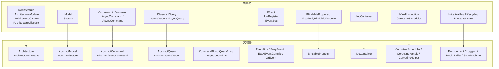
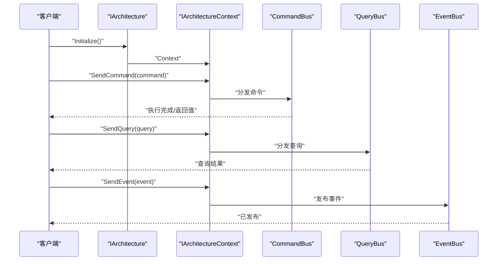
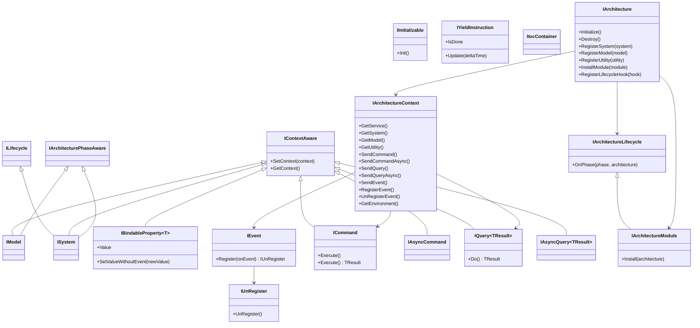

# Core API 参考

<cite>
**本文引用的文件**
- [IArchitecture.cs](file://GFramework.Core.Abstractions/architecture/IArchitecture.cs)
- [IArchitectureModule.cs](file://GFramework.Core.Abstractions/architecture/IArchitectureModule.cs)
- [IArchitectureContext.cs](file://GFramework.Core.Abstractions/architecture/IArchitectureContext.cs)
- [IArchitectureLifecycle.cs](file://GFramework.Core.Abstractions/architecture/IArchitectureLifecycle.cs)
- [IModel.cs](file://GFramework.Core.Abstractions/model/IModel.cs)
- [ISystem.cs](file://GFramework.Core.Abstractions/system/ISystem.cs)
- [ICommand.cs](file://GFramework.Core.Abstractions/command/ICommand.cs)
- [IQuery.cs](file://GFramework.Core.Abstractions/query/IQuery.cs)
- [IEvent.cs](file://GFramework.Core.Abstractions/events/IEvent.cs)
- [IUnRegister.cs](file://GFramework.Core.Abstractions/events/IUnRegister.cs)
- [IBindableProperty.cs](file://GFramework.Core.Abstractions/property/IBindableProperty.cs)
- [IIocContainer.cs](file://GFramework.Core.Abstractions/ioc/IIocContainer.cs)
- [IYieldInstruction.cs](file://GFramework.Core.Abstractions/coroutine/IYieldInstruction.cs)
- [IInitializable.cs](file://GFramework.Core.Abstractions/lifecycle/IInitializable.cs)
- [ILifecycle.cs](file://GFramework.Core.Abstractions/lifecycle/ILifecycle.cs)
- [IContextAware.cs](file://GFramework.Core.Abstractions/rule/IContextAware.cs)
- [Architecture.cs](file://GFramework.Core/architecture/Architecture.cs)
- [ArchitectureContext.cs](file://GFramework.Core/architecture/ArchitectureContext.cs)
- [CommandBus.cs](file://GFramework.Core/command/CommandBus.cs)
- [QueryBus.cs](file://GFramework.Core/query/QueryBus.cs)
- [AsyncQueryBus.cs](file://GFramework.Core/query/AsyncQueryBus.cs)
- [EventBus.cs](file://GFramework.Core/events/EventBus.cs)
- [EasyEvent.cs](file://GFramework.Core/events/EasyEvent.cs)
- [EasyEventGeneric.cs](file://GFramework.Core/events/EasyEventGeneric.cs)
- [IocContainer.cs](file://GFramework.Core/ioc/IocContainer.cs)
- [CoroutineScheduler.cs](file://GFramework.Core/coroutine/CoroutineScheduler.cs)
- [CoroutineHandle.cs](file://GFramework.Core/coroutine/CoroutineHandle.cs)
- [CoroutineHelper.cs](file://GFramework.Core/coroutine/CoroutineHelper.cs)
- [BindableProperty.cs](file://GFramework.Core/property/BindableProperty.cs)
- [AbstractModel.cs](file://GFramework.Core/model/AbstractModel.cs)
- [AbstractSystem.cs](file://GFramework.Core/system/AbstractSystem.cs)
- [AbstractCommand.cs](file://GFramework.Core/command/AbstractCommand.cs)
- [AbstractAsyncCommand.cs](file://GFramework.Core/command/AbstractAsyncCommand.cs)
- [AbstractQuery.cs](file://GFramework.Core/query/AbstractQuery.cs)
- [AbstractAsyncQuery.cs](file://GFramework.Core/query/AbstractAsyncQuery.cs)
- [DefaultEnvironment.cs](file://GFramework.Core/environment/DefaultEnvironment.cs)
- [EnvironmentBase.cs](file://GFramework.Core/environment/EnvironmentBase.cs)
- [ILogger.cs](file://GFramework.Core/logging/AbstractLogger.cs)
- [ConsoleLogger.cs](file://GFramework.Core/logging/ConsoleLogger.cs)
- [ConsoleLoggerFactory.cs](file://GFramework.Core/logging/ConsoleLoggerFactory.cs)
- [ConsoleLoggerFactoryProvider.cs](file://GFramework.Core/logging/ConsoleLoggerFactoryProvider.cs)
- [AbstractObjectPoolSystem.cs](file://GFramework.Core/pool/AbstractObjectPoolSystem.cs)
- [AbstractContextUtility.cs](file://GFramework.Core/utility/AbstractContextUtility.cs)
- [ContextAwareStateBase.cs](file://GFramework.Core/state/ContextAwareStateBase.cs)
- [StateChangedEvent.cs](file://GFramework.Core/state/StateChangedEvent.cs)
- [StateMachine.cs](file://GFramework.Core/state/StateMachine.cs)
- [StateMachineSystem.cs](file://GFramework.Core/state/StateMachineSystem.cs)
- [ArchitectureConfiguration.cs](file://GFramework.Core/architecture/ArchitectureConfiguration.cs)
- [ArchitectureConstants.cs](file://GFramework.Core/architecture/ArchitectureConstants.cs)
- [GameContext.cs](file://GFramework.Core/architecture/GameContext.cs)
- [ArchitectureServices.cs](file://GFramework.Core/architecture/ArchitectureServices.cs)
- [GFrameworkConstants.cs](file://GFramework.Core/constants/GFrameworkConstants.cs)
- [ContextAwareExtensions.cs](file://GFramework.Core/extensions/ContextAwareExtensions.cs)
- [ObjectExtensions.cs](file://GFramework.Core/extensions/ObjectExtensions.cs)
- [OrEventExtensions.cs](file://GFramework.Core/extensions/OrEventExtensions.cs)
- [UnRegisterListExtension.cs](file://GFramework.Core/extensions/UnRegisterListExtension.cs)
- [AbstractContextUtility.cs](file://GFramework.Core/utility/AbstractContextUtility.cs)
- [AbstractContextUtilityTests.cs](file://GFramework.Core.Tests/utility/AbstractContextUtilityTests.cs)
- [ArchitectureTestsBase.cs](file://GFramework.Core.Tests/tests/ArchitectureTestsBase.cs)
- [AsyncArchitectureTests.cs](file://GFramework.Core.Tests/tests/AsyncArchitectureTests.cs)
- [SyncArchitectureTests.cs](file://GFramework.Core.Tests/tests/SyncArchitectureTests.cs)
- [ArchitectureConfigurationTests.cs](file://GFramework.Core.Tests/architecture/ArchitectureConfigurationTests.cs)
- [ArchitectureContextTests.cs](file://GFramework.Core.Tests/architecture/ArchitectureContextTests.cs)
- [ArchitectureServicesTests.cs](file://GFramework.Core.Tests/architecture/ArchitectureServicesTests.cs)
- [GameContextTests.cs](file://GFramework.Core.Tests/architecture/GameContextTests.cs)
- [CommandBusTests.cs](file://GFramework.Core.Tests/command/CommandBusTests.cs)
- [AbstractAsyncCommandTests.cs](file://GFramework.Core.Tests/command/AbstractAsyncCommandTests.cs)
- [QueryBusTests.cs](file://GFramework.Core.Tests/query/QueryBusTests.cs)
- [AsyncQueryBusTests.cs](file://GFramework.Core.Tests/query/AsyncQueryBusTests.cs)
- [EventBusTests.cs](file://GFramework.Core.Tests/events/EventBusTests.cs)
- [EasyEventsTests.cs](file://GFramework.Core.Tests/events/EasyEventsTests.cs)
- [OrEventTests.cs](file://GFramework.Core.Tests/events/OrEventTests.cs)
- [BindablePropertyTests.cs](file://GFramework.Core.Tests/property/BindablePropertyTests.cs)
- [IocContainerTests.cs](file://GFramework.Core.Tests/ioc/IocContainerTests.cs)
- [CoroutineSchedulerTests.cs](file://GFramework.Core.Tests/coroutine/CoroutineSchedulerTests.cs)
- [CoroutineHandleTests.cs](file://GFramework.Core.Tests/coroutine/CoroutineHandleTests.cs)
- [CoroutineHelperTests.cs](file://GFramework.Core.Tests/coroutine/CoroutineHelperTests.cs)
- [CoroutineStateTests.cs](file://GFramework.Core.Tests/coroutine/CoroutineStateTests.cs)
- [YieldInstructionTests.cs](file://GFramework.Core.Tests/coroutine/YieldInstructionTests.cs)
- [EnvironmentTests.cs](file://GFramework.Core.Tests/environment/EnvironmentTests.cs)
- [ObjectExtensionsTests.cs](file://GFramework.Core.Tests/extensions/ObjectExtensionsTests.cs)
- [UnRegisterListExtensionTests.cs](file://GFramework.Core.Tests/extensions/UnRegisterListExtensionTests.cs)
- [GFramework.Core.csproj](file://GFramework.Core/GFramework.Core.csproj)
- [GFramework.Core.Abstractions.csproj](file://GFramework.Core.Abstractions/GFramework.Core.Abstractions.csproj)
- [README.md](file://GFramework.Core/README.md)
- [README.md](file://GFramework.Core.Abstractions/README.md)
</cite>

## 目录
1. [简介](#简介)
2. [项目结构](#项目结构)
3. [核心组件](#核心组件)
4. [架构总览](#架构总览)
5. [详细组件分析](#详细组件分析)
6. [依赖分析](#依赖分析)
7. [性能考量](#性能考量)
8. [故障排查指南](#故障排查指南)
9. [结论](#结论)
10. [附录](#附录)

## 简介
本文件为 GFramework.Core 模块的 Core API 参考，聚焦于核心抽象与实现，覆盖以下主题：
- 架构与模块：IArchitecture、IArchitectureModule、IArchitectureContext、IArchitectureLifecycle
- 数据模型与系统：IModel、ISystem
- 命令与查询：ICommand、IQuery、IAsyncCommand、IAsyncQuery、ICommandBus、IQueryBus、IAsyncQueryBus
- 事件系统：IEvent、IUnRegister、IEventBus、EasyEvent、EasyEventGeneric、OrEvent
- 属性绑定：IBindableProperty、IReadonlyBindableProperty
- 依赖注入：IIocContainer
- 协程调度：IYieldInstruction、CoroutineScheduler、CoroutineHandle、CoroutineHelper
- 生命周期与上下文：IInitializable、ILifecycle、IContextAware
- 其他基础设施：AbstractModel、AbstractSystem、AbstractCommand、AbstractAsyncCommand、AbstractQuery、AbstractAsyncQuery、Environment、Logging、Pool、Utility、StateMachine、Extensions

本参考文档提供接口方法签名、属性定义、使用示例路径、最佳实践、版本兼容性与废弃提示、性能建议与排错指引。

## 项目结构
GFramework.Core 采用“抽象层 + 实现层”的分层设计：
- GFramework.Core.Abstractions：定义所有核心接口与契约
- GFramework.Core：提供默认实现与运行时支持
- GFramework.Core.Tests：覆盖核心组件的行为测试

图表来源
- [IArchitecture.cs](file://GFramework.Core.Abstractions/architecture/IArchitecture.cs#L11-L68)
- [IArchitectureModule.cs](file://GFramework.Core.Abstractions/architecture/IArchitectureModule.cs#L7-L14)
- [IArchitectureContext.cs](file://GFramework.Core.Abstractions/architecture/IArchitectureContext.cs#L16-L123)
- [IModel.cs](file://GFramework.Core.Abstractions/model/IModel.cs#L10-L10)
- [ISystem.cs](file://GFramework.Core.Abstractions/system/ISystem.cs#L11-L11)
- [ICommand.cs](file://GFramework.Core.Abstractions/command/ICommand.cs#L9-L31)
- [IQuery.cs](file://GFramework.Core.Abstractions/query/IQuery.cs#L9-L16)
- [IEvent.cs](file://GFramework.Core.Abstractions/events/IEvent.cs#L8-L16)
- [IUnRegister.cs](file://GFramework.Core.Abstractions/events/IUnRegister.cs#L6-L12)
- [IBindableProperty.cs](file://GFramework.Core.Abstractions/property/IBindableProperty.cs#L7-L19)
- [IIocContainer.cs](file://GFramework.Core.Abstractions/ioc/IIocContainer.cs#L11-L116)
- [IYieldInstruction.cs](file://GFramework.Core.Abstractions/coroutine/IYieldInstruction.cs#L6-L18)
- [IInitializable.cs](file://GFramework.Core.Abstractions/lifecycle/IInitializable.cs#L6-L12)
- [ILifecycle.cs](file://GFramework.Core.Abstractions/lifecycle/ILifecycle.cs#L6-L6)
- [IContextAware.cs](file://GFramework.Core.Abstractions/rule/IContextAware.cs#L8-L21)

章节来源
- [GFramework.Core.csproj](file://GFramework.Core/GFramework.Core.csproj)
- [GFramework.Core.Abstractions.csproj](file://GFramework.Core.Abstractions/GFramework.Core.Abstractions.csproj)

## 核心组件
本节概述各核心接口与职责边界，并给出使用示例路径与最佳实践要点。

- 架构与模块
  - IArchitecture：负责生命周期管理、系统/模型/工具注册、模块安装、生命周期钩子注册
  - IArchitectureModule：模块安装到架构的标准接口
  - IArchitectureContext：统一的服务、系统、模型、工具访问入口，以及命令/查询/事件发送与注册
  - IArchitectureLifecycle：架构阶段回调

- 数据模型与系统
  - IModel：模型生命周期与上下文感知
  - ISystem：系统生命周期与上下文感知

- 命令与查询
  - ICommand / ICommand<TResult>：命令执行契约
  - IAsyncCommand / IAsyncCommand<TResult>：异步命令执行契约
  - IQuery / IQuery<TResult>：查询执行契约
  - IAsyncQuery / IAsyncQuery<TResult>：异步查询执行契约
  - ICommandBus / IQueryBus / IAsyncQueryBus：命令/查询分发总线

- 事件系统
  - IEvent：事件注册
  - IUnRegister：事件注销
  - IEventBus：事件总线
  - EasyEvent / EasyEventGeneric：轻量事件封装
  - OrEvent：事件组合

- 属性绑定
  - IBindableProperty / IReadonlyBindableProperty：可绑定属性读写与只读属性

- 依赖注入
  - IIocContainer：服务注册、解析、冻结与清空

- 协程调度
  - IYieldInstruction：等待指令
  - CoroutineScheduler：协程调度器
  - CoroutineHandle / CoroutineHelper：协程句柄与辅助

- 生命周期与上下文
  - IInitializable / ILifecycle：初始化与销毁
  - IContextAware：上下文注入与获取

章节来源
- [IArchitecture.cs](file://GFramework.Core.Abstractions/architecture/IArchitecture.cs#L11-L68)
- [IArchitectureModule.cs](file://GFramework.Core.Abstractions/architecture/IArchitectureModule.cs#L7-L14)
- [IArchitectureContext.cs](file://GFramework.Core.Abstractions/architecture/IArchitectureContext.cs#L16-L123)
- [IModel.cs](file://GFramework.Core.Abstractions/model/IModel.cs#L10-L10)
- [ISystem.cs](file://GFramework.Core.Abstractions/system/ISystem.cs#L11-L11)
- [ICommand.cs](file://GFramework.Core.Abstractions/command/ICommand.cs#L9-L31)
- [IQuery.cs](file://GFramework.Core.Abstractions/query/IQuery.cs#L9-L16)
- [IEvent.cs](file://GFramework.Core.Abstractions/events/IEvent.cs#L8-L16)
- [IUnRegister.cs](file://GFramework.Core.Abstractions/events/IUnRegister.cs#L6-L12)
- [IBindableProperty.cs](file://GFramework.Core.Abstractions/property/IBindableProperty.cs#L7-L19)
- [IIocContainer.cs](file://GFramework.Core.Abstractions/ioc/IIocContainer.cs#L11-L116)
- [IYieldInstruction.cs](file://GFramework.Core.Abstractions/coroutine/IYieldInstruction.cs#L6-L18)
- [IInitializable.cs](file://GFramework.Core.Abstractions/lifecycle/IInitializable.cs#L6-L12)
- [ILifecycle.cs](file://GFramework.Core.Abstractions/lifecycle/ILifecycle.cs#L6-L6)
- [IContextAware.cs](file://GFramework.Core.Abstractions/rule/IContextAware.cs#L8-L21)

## 架构总览
下图展示 IArchitecture 与 IArchitectureContext 的协作关系，以及命令/查询/事件的分发路径。

图表来源
- [IArchitecture.cs](file://GFramework.Core.Abstractions/architecture/IArchitecture.cs#L11-L68)
- [IArchitectureContext.cs](file://GFramework.Core.Abstractions/architecture/IArchitectureContext.cs#L16-L123)
- [CommandBus.cs](file://GFramework.Core/command/CommandBus.cs)
- [QueryBus.cs](file://GFramework.Core/query/QueryBus.cs)
- [EventBus.cs](file://GFramework.Core/events/EventBus.cs)

## 详细组件分析

### 架构与模块接口
- IArchitecture
  - 方法与职责
    - Initialize/Destroy：生命周期管理
    - RegisterSystem/RegisterModel/RegisterUtility：组件注册
    - InstallModule：模块安装
    - RegisterLifecycleHook：生命周期钩子注册
  - 使用示例路径
    - [ArchitectureTestsBase.cs](file://GFramework.Core.Tests/tests/ArchitectureTestsBase.cs)
    - [SyncArchitectureTests.cs](file://GFramework.Core.Tests/tests/SyncArchitectureTests.cs)
    - [AsyncArchitectureTests.cs](file://GFramework.Core.Tests/tests/AsyncArchitectureTests.cs)
  - 最佳实践
    - 在 Initialize 中完成一次性初始化，避免在运行期频繁注册
    - 使用 InstallModule 组织功能模块，确保生命周期钩子在正确阶段被调用
  - 性能考虑
    - 避免在热路径重复注册同一实例
    - 合理拆分模块，降低初始化成本

- IArchitectureModule
  - 方法与职责
    - Install(IArchitecture)：模块安装到目标架构
  - 使用示例路径
    - [IArchitectureModule.cs](file://GFramework.Core.Abstractions/architecture/IArchitectureModule.cs#L7-L14)
    - [AbstractModule.cs](file://GFramework.Game/architecture/AbstractModule.cs)

- IArchitectureContext
  - 方法与职责
    - GetService/GetSystem/GetModel/GetUtility：组件解析
    - SendCommand/SendCommandAsync：命令发送
    - SendQuery/SendQueryAsync：查询发送
    - SendEvent/RegisterEvent/UnRegisterEvent：事件发送与注册
    - GetEnvironment：环境访问
  - 使用示例路径
    - [IArchitectureContext.cs](file://GFramework.Core.Abstractions/architecture/IArchitectureContext.cs#L16-L123)
    - [ArchitectureContext.cs](file://GFramework.Core/architecture/ArchitectureContext.cs)

- IArchitectureLifecycle
  - 方法与职责
    - OnPhase(phase, architecture)：阶段回调
  - 使用示例路径
    - [IArchitectureLifecycle.cs](file://GFramework.Core.Abstractions/architecture/IArchitectureLifecycle.cs#L8-L16)

章节来源
- [IArchitecture.cs](file://GFramework.Core.Abstractions/architecture/IArchitecture.cs#L11-L68)
- [IArchitectureModule.cs](file://GFramework.Core.Abstractions/architecture/IArchitectureModule.cs#L7-L14)
- [IArchitectureContext.cs](file://GFramework.Core.Abstractions/architecture/IArchitectureContext.cs#L16-L123)
- [IArchitectureLifecycle.cs](file://GFramework.Core.Abstractions/architecture/IArchitectureLifecycle.cs#L8-L16)
- [Architecture.cs](file://GFramework.Core/architecture/Architecture.cs)
- [ArchitectureContext.cs](file://GFramework.Core/architecture/ArchitectureContext.cs)

### 数据模型与系统接口
- IModel
  - 继承与职责
    - IContextAware、IArchitecturePhaseAware、IInitializable：上下文感知、阶段感知、初始化
  - 使用示例路径
    - [IModel.cs](file://GFramework.Core.Abstractions/model/IModel.cs#L10-L10)
    - [AbstractModel.cs](file://GFramework.Core/model/AbstractModel.cs)

- ISystem
  - 继承与职责
    - IContextAware、IArchitecturePhaseAware、ILifecycle：上下文感知、阶段感知、完整生命周期
  - 使用示例路径
    - [ISystem.cs](file://GFramework.Core.Abstractions/system/ISystem.cs#L11-L11)
    - [AbstractSystem.cs](file://GFramework.Core/system/AbstractSystem.cs)

章节来源
- [IModel.cs](file://GFramework.Core.Abstractions/model/IModel.cs#L10-L10)
- [ISystem.cs](file://GFramework.Core.Abstractions/system/ISystem.cs#L11-L11)
- [AbstractModel.cs](file://GFramework.Core/model/AbstractModel.cs)
- [AbstractSystem.cs](file://GFramework.Core/system/AbstractSystem.cs)

### 命令与查询接口
- ICommand / ICommand<TResult>
  - Execute/Execute 返回值：命令执行契约
  - 使用示例路径
    - [ICommand.cs](file://GFramework.Core.Abstractions/command/ICommand.cs#L9-L31)
    - [AbstractCommand.cs](file://GFramework.Core/command/AbstractCommand.cs)
    - [AbstractAsyncCommand.cs](file://GFramework.Core/command/AbstractAsyncCommand.cs)

- IAsyncCommand / IAsyncCommand<TResult>
  - 异步命令执行契约
  - 使用示例路径
    - [ICommand.cs](file://GFramework.Core.Abstractions/command/ICommand.cs#L9-L31)

- IQuery / IQuery<TResult>
  - Do 返回值：查询执行契约
  - 使用示例路径
    - [IQuery.cs](file://GFramework.Core.Abstractions/query/IQuery.cs#L9-L16)
    - [AbstractQuery.cs](file://GFramework.Core/query/AbstractQuery.cs)
    - [AbstractAsyncQuery.cs](file://GFramework.Core/query/AbstractAsyncQuery.cs)

- IAsyncQuery / IAsyncQuery<TResult>
  - 异步查询执行契约
  - 使用示例路径
    - [IQuery.cs](file://GFramework.Core.Abstractions/query/IQuery.cs#L9-L16)

- ICommandBus / IQueryBus / IAsyncQueryBus
  - 分发与路由命令/查询
  - 使用示例路径
    - [CommandBus.cs](file://GFramework.Core/command/CommandBus.cs)
    - [QueryBus.cs](file://GFramework.Core/query/QueryBus.cs)
    - [AsyncQueryBus.cs](file://GFramework.Core/query/AsyncQueryBus.cs)

- 测试用例路径
  - [CommandBusTests.cs](file://GFramework.Core.Tests/command/CommandBusTests.cs)
  - [AbstractAsyncCommandTests.cs](file://GFramework.Core.Tests/command/AbstractAsyncCommandTests.cs)
  - [QueryBusTests.cs](file://GFramework.Core.Tests/query/QueryBusTests.cs)
  - [AsyncQueryBusTests.cs](file://GFramework.Core.Tests/query/AsyncQueryBusTests.cs)

章节来源
- [ICommand.cs](file://GFramework.Core.Abstractions/command/ICommand.cs#L9-L31)
- [IQuery.cs](file://GFramework.Core.Abstractions/query/IQuery.cs#L9-L16)
- [CommandBus.cs](file://GFramework.Core/command/CommandBus.cs)
- [QueryBus.cs](file://GFramework.Core/query/QueryBus.cs)
- [AsyncQueryBus.cs](file://GFramework.Core/query/AsyncQueryBus.cs)
- [AbstractCommand.cs](file://GFramework.Core/command/AbstractCommand.cs)
- [AbstractAsyncCommand.cs](file://GFramework.Core/command/AbstractAsyncCommand.cs)
- [AbstractQuery.cs](file://GFramework.Core/query/AbstractQuery.cs)
- [AbstractAsyncQuery.cs](file://GFramework.Core/query/AbstractAsyncQuery.cs)

### 事件系统接口
- IEvent
  - Register(Action)：事件注册，返回 IUnRegister
  - 使用示例路径
    - [IEvent.cs](file://GFramework.Core.Abstractions/events/IEvent.cs#L8-L16)

- IUnRegister
  - UnRegister()：注销事件
  - 使用示例路径
    - [IUnRegister.cs](file://GFramework.Core.Abstractions/events/IUnRegister.cs#L6-L12)

- IEventBus
  - 事件总线接口
  - 使用示例路径
    - [EventBus.cs](file://GFramework.Core/events/EventBus.cs)

- EasyEvent / EasyEventGeneric
  - 轻量事件封装
  - 使用示例路径
    - [EasyEvent.cs](file://GFramework.Core/events/EasyEvent.cs)
    - [EasyEventGeneric.cs](file://GFramework.Core/events/EasyEventGeneric.cs)

- OrEvent
  - 事件组合
  - 使用示例路径
    - [OrEvent.cs](file://GFramework.Core/events/OrEvent.cs)

- 测试用例路径
  - [EventBusTests.cs](file://GFramework.Core.Tests/events/EventBusTests.cs)
  - [EasyEventsTests.cs](file://GFramework.Core.Tests/events/EasyEventsTests.cs)
  - [OrEventTests.cs](file://GFramework.Core.Tests/events/OrEventTests.cs)

章节来源
- [IEvent.cs](file://GFramework.Core.Abstractions/events/IEvent.cs#L8-L16)
- [IUnRegister.cs](file://GFramework.Core.Abstractions/events/IUnRegister.cs#L6-L12)
- [EventBus.cs](file://GFramework.Core/events/EventBus.cs)
- [EasyEvent.cs](file://GFramework.Core/events/EasyEvent.cs)
- [EasyEventGeneric.cs](file://GFramework.Core/events/EasyEventGeneric.cs)
- [OrEvent.cs](file://GFramework.Core/events/OrEvent.cs)

### 属性绑定接口
- IBindableProperty<T>
  - Value：可读写属性
  - SetValueWithoutEvent(newValue)：静默设置值
  - 使用示例路径
    - [IBindableProperty.cs](file://GFramework.Core.Abstractions/property/IBindableProperty.cs#L7-L19)
    - [BindableProperty.cs](file://GFramework.Core/property/BindableProperty.cs)

- 测试用例路径
  - [BindablePropertyTests.cs](file://GFramework.Core.Tests/property/BindablePropertyTests.cs)

章节来源
- [IBindableProperty.cs](file://GFramework.Core.Abstractions/property/IBindableProperty.cs#L7-L19)
- [BindableProperty.cs](file://GFramework.Core/property/BindableProperty.cs)

### 依赖注入容器接口
- IIocContainer
  - Register/ RegisterSingleton/ RegisterPlurality/ RegisterSystem/ Register(Type, instance)
  - Get/ GetRequired/ GetAll/ GetAllSorted
  - Contains/ ContainsInstance/ Clear/ Freeze
  - 使用示例路径
    - [IIocContainer.cs](file://GFramework.Core.Abstractions/ioc/IIocContainer.cs#L11-L116)
    - [IocContainer.cs](file://GFramework.Core/ioc/IocContainer.cs)

- 测试用例路径
  - [IocContainerTests.cs](file://GFramework.Core.Tests/ioc/IocContainerTests.cs)

章节来源
- [IIocContainer.cs](file://GFramework.Core.Abstractions/ioc/IIocContainer.cs#L11-L116)
- [IocContainer.cs](file://GFramework.Core/ioc/IocContainer.cs)

### 协程调度接口
- IYieldInstruction
  - IsDone / Update(deltaTime)：等待指令状态与更新
  - 使用示例路径
    - [IYieldInstruction.cs](file://GFramework.Core.Abstractions/coroutine/IYieldInstruction.cs#L6-L18)

- CoroutineScheduler
  - 协程调度器
  - 使用示例路径
    - [CoroutineScheduler.cs](file://GFramework.Core/coroutine/CoroutineScheduler.cs)

- CoroutineHandle / CoroutineHelper
  - 协程句柄与辅助
  - 使用示例路径
    - [CoroutineHandle.cs](file://GFramework.Core/coroutine/CoroutineHandle.cs)
    - [CoroutineHelper.cs](file://GFramework.Core/coroutine/CoroutineHelper.cs)

- 测试用例路径
  - [CoroutineSchedulerTests.cs](file://GFramework.Core.Tests/coroutine/CoroutineSchedulerTests.cs)
  - [CoroutineHandleTests.cs](file://GFramework.Core.Tests/coroutine/CoroutineHandleTests.cs)
  - [CoroutineHelperTests.cs](file://GFramework.Core.Tests/coroutine/CoroutineHelperTests.cs)
  - [CoroutineStateTests.cs](file://GFramework.Core.Tests/coroutine/CoroutineStateTests.cs)
  - [YieldInstructionTests.cs](file://GFramework.Core.Tests/coroutine/YieldInstructionTests.cs)

章节来源
- [IYieldInstruction.cs](file://GFramework.Core.Abstractions/coroutine/IYieldInstruction.cs#L6-L18)
- [CoroutineScheduler.cs](file://GFramework.Core/coroutine/CoroutineScheduler.cs)
- [CoroutineHandle.cs](file://GFramework.Core/coroutine/CoroutineHandle.cs)
- [CoroutineHelper.cs](file://GFramework.Core/coroutine/CoroutineHelper.cs)

### 生命周期与上下文接口
- IInitializable
  - Init()：初始化
  - 使用示例路径
    - [IInitializable.cs](file://GFramework.Core.Abstractions/lifecycle/IInitializable.cs#L6-L12)

- ILifecycle
  - 组合 IInitializable 与 IDisposable
  - 使用示例路径
    - [ILifecycle.cs](file://GFramework.Core.Abstractions/lifecycle/ILifecycle.cs#L6-L6)

- IContextAware
  - SetContext/ GetContext：上下文注入与获取
  - 使用示例路径
    - [IContextAware.cs](file://GFramework.Core.Abstractions/rule/IContextAware.cs#L8-L21)

章节来源
- [IInitializable.cs](file://GFramework.Core.Abstractions/lifecycle/IInitializable.cs#L6-L12)
- [ILifecycle.cs](file://GFramework.Core.Abstractions/lifecycle/ILifecycle.cs#L6-L6)
- [IContextAware.cs](file://GFramework.Core.Abstractions/rule/IContextAware.cs#L8-L21)

### 其他基础设施
- Environment
  - DefaultEnvironment / EnvironmentBase：环境抽象
  - 使用示例路径
    - [DefaultEnvironment.cs](file://GFramework.Core/environment/DefaultEnvironment.cs)
    - [EnvironmentBase.cs](file://GFramework.Core/environment/EnvironmentBase.cs)
    - [EnvironmentTests.cs](file://GFramework.Core.Tests/environment/EnvironmentTests.cs)

- Logging
  - ILogger / ILoggerFactory / ILoggerFactoryProvider / LogLevel：日志抽象
  - 使用示例路径
    - [AbstractLogger.cs](file://GFramework.Core/logging/AbstractLogger.cs)
    - [ConsoleLogger.cs](file://GFramework.Core/logging/ConsoleLogger.cs)
    - [ConsoleLoggerFactory.cs](file://GFramework.Core/logging/ConsoleLoggerFactory.cs)
    - [ConsoleLoggerFactoryProvider.cs](file://GFramework.Core/logging/ConsoleLoggerFactoryProvider.cs)

- Pool
  - IObjectPoolSystem / IPoolableObject / AbstractObjectPoolSystem：对象池
  - 使用示例路径
    - [AbstractObjectPoolSystem.cs](file://GFramework.Core/pool/AbstractObjectPoolSystem.cs)

- Utility
  - IContextUtility / IUtility / AbstractContextUtility：工具抽象
  - 使用示例路径
    - [AbstractContextUtility.cs](file://GFramework.Core/utility/AbstractContextUtility.cs)
    - [AbstractContextUtilityTests.cs](file://GFramework.Core.Tests/utility/AbstractContextUtilityTests.cs)

- StateMachine
  - IState / IStateMachine / IStateMachineSystem / StateMachine / StateMachineSystem / ContextAwareStateBase / StateChangedEvent：状态机
  - 使用示例路径
    - [StateMachine.cs](file://GFramework.Core/state/StateMachine.cs)
    - [StateMachineSystem.cs](file://GFramework.Core/state/StateMachineSystem.cs)
    - [ContextAwareStateBase.cs](file://GFramework.Core/state/ContextAwareStateBase.cs)
    - [StateChangedEvent.cs](file://GFramework.Core/state/StateChangedEvent.cs)
    - [StateMachineSystemTests.cs](file://GFramework.Core.Tests/state/StateMachineSystemTests.cs)

- Extensions
  - ContextAwareExtensions / ObjectExtensions / OrEventExtensions / UnRegisterListExtension：扩展
  - 使用示例路径
    - [ContextAwareExtensions.cs](file://GFramework.Core/extensions/ContextAwareExtensions.cs)
    - [ObjectExtensions.cs](file://GFramework.Core/extensions/ObjectExtensions.cs)
    - [OrEventExtensions.cs](file://GFramework.Core/extensions/OrEventExtensions.cs)
    - [UnRegisterListExtension.cs](file://GFramework.Core/extensions/UnRegisterListExtension.cs)
    - [ObjectExtensionsTests.cs](file://GFramework.Core.Tests/extensions/ObjectExtensionsTests.cs)
    - [UnRegisterListExtensionTests.cs](file://GFramework.Core.Tests/extensions/UnRegisterListExtensionTests.cs)

章节来源
- [DefaultEnvironment.cs](file://GFramework.Core/environment/DefaultEnvironment.cs)
- [EnvironmentBase.cs](file://GFramework.Core/environment/EnvironmentBase.cs)
- [AbstractLogger.cs](file://GFramework.Core/logging/AbstractLogger.cs)
- [ConsoleLogger.cs](file://GFramework.Core/logging/ConsoleLogger.cs)
- [ConsoleLoggerFactory.cs](file://GFramework.Core/logging/ConsoleLoggerFactory.cs)
- [ConsoleLoggerFactoryProvider.cs](file://GFramework.Core/logging/ConsoleLoggerFactoryProvider.cs)
- [AbstractObjectPoolSystem.cs](file://GFramework.Core/pool/AbstractObjectPoolSystem.cs)
- [AbstractContextUtility.cs](file://GFramework.Core/utility/AbstractContextUtility.cs)
- [StateMachine.cs](file://GFramework.Core/state/StateMachine.cs)
- [StateMachineSystem.cs](file://GFramework.Core/state/StateMachineSystem.cs)
- [ContextAwareStateBase.cs](file://GFramework.Core/state/ContextAwareStateBase.cs)
- [StateChangedEvent.cs](file://GFramework.Core/state/StateChangedEvent.cs)
- [ContextAwareExtensions.cs](file://GFramework.Core/extensions/ContextAwareExtensions.cs)
- [ObjectExtensions.cs](file://GFramework.Core/extensions/ObjectExtensions.cs)
- [OrEventExtensions.cs](file://GFramework.Core/extensions/OrEventExtensions.cs)
- [UnRegisterListExtension.cs](file://GFramework.Core/extensions/UnRegisterListExtension.cs)

## 依赖分析
下图展示核心接口之间的继承与组合关系，帮助理解依赖耦合与职责划分。

图表来源
- [IContextAware.cs](file://GFramework.Core.Abstractions/rule/IContextAware.cs#L8-L21)
- [IInitializable.cs](file://GFramework.Core.Abstractions/lifecycle/IInitializable.cs#L6-L12)
- [ILifecycle.cs](file://GFramework.Core.Abstractions/lifecycle/ILifecycle.cs#L6-L6)
- [IModel.cs](file://GFramework.Core.Abstractions/model/IModel.cs#L10-L10)
- [ISystem.cs](file://GFramework.Core.Abstractions/system/ISystem.cs#L11-L11)
- [IBindableProperty.cs](file://GFramework.Core.Abstractions/property/IBindableProperty.cs#L7-L19)
- [IEvent.cs](file://GFramework.Core.Abstractions/events/IEvent.cs#L8-L16)
- [IUnRegister.cs](file://GFramework.Core.Abstractions/events/IUnRegister.cs#L6-L12)
- [ICommand.cs](file://GFramework.Core.Abstractions/command/ICommand.cs#L9-L31)
- [IQuery.cs](file://GFramework.Core.Abstractions/query/IQuery.cs#L9-L16)
- [IYieldInstruction.cs](file://GFramework.Core.Abstractions/coroutine/IYieldInstruction.cs#L6-L18)
- [IIocContainer.cs](file://GFramework.Core.Abstractions/ioc/IIocContainer.cs#L11-L116)
- [IArchitecture.cs](file://GFramework.Core.Abstractions/architecture/IArchitecture.cs#L11-L68)
- [IArchitectureContext.cs](file://GFramework.Core.Abstractions/architecture/IArchitectureContext.cs#L16-L123)
- [IArchitectureModule.cs](file://GFramework.Core.Abstractions/architecture/IArchitectureModule.cs#L7-L14)

## 性能考量
- 组件注册与解析
  - 使用 RegisterSystem/ RegisterSingleton 减少解析开销
  - 避免在热路径频繁调用 GetAllSorted，必要时缓存结果
- 事件系统
  - 合理使用 EasyEvent/EasyEventGeneric，避免过度嵌套
  - 记得在生命周期结束时调用 UnRegister，防止内存泄漏
- 协程调度
  - 使用 IYieldInstruction 的 Update 机制，避免阻塞主线程
  - 合理安排协程优先级，避免长帧卡顿
- 日志与调试
  - 在生产环境降低日志级别，避免高频 I/O
- 对象池
  - 使用 AbstractObjectPoolSystem 复用昂贵对象，减少 GC 压力

## 故障排查指南
- 命令/查询未执行
  - 检查是否正确注册到 CommandBus/QueryBus
  - 确认上下文解析是否成功
  - 参考测试用例定位问题
- 事件未触发
  - 确认 Register 返回的 IUnRegister 是否被释放
  - 检查事件类型与泛型匹配
- 协程不前进
  - 检查 IYieldInstruction.IsDone 与 Update 实现
  - 确认 CoroutineScheduler 正常运行
- 依赖注入异常
  - 检查 Register 与 Get 的类型一致性
  - 确认容器未被 Freeze

章节来源
- [CommandBusTests.cs](file://GFramework.Core.Tests/command/CommandBusTests.cs)
- [QueryBusTests.cs](file://GFramework.Core.Tests/query/QueryBusTests.cs)
- [EventBusTests.cs](file://GFramework.Core.Tests/events/EventBusTests.cs)
- [CoroutineSchedulerTests.cs](file://GFramework.Core.Tests/coroutine/CoroutineSchedulerTests.cs)
- [IocContainerTests.cs](file://GFramework.Core.Tests/ioc/IocContainerTests.cs)

## 结论
本参考文档系统梳理了 GFramework.Core 的核心接口与实现，提供了接口契约、使用示例路径、最佳实践与性能建议。建议在实际项目中遵循模块化与生命周期管理原则，合理使用事件与协程系统，并通过测试用例验证关键流程。

## 附录
- 版本兼容性与废弃提示
  - 本仓库未发现显式版本号或废弃标记，建议在升级前查看变更日志与测试覆盖情况
- 相关 README
  - [GFramework.Core README](file://GFramework.Core/README.md)
  - [GFramework.Core.Abstractions README](file://GFramework.Core.Abstractions/README.md)