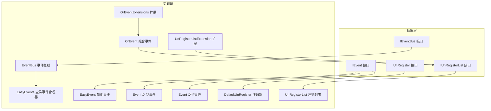
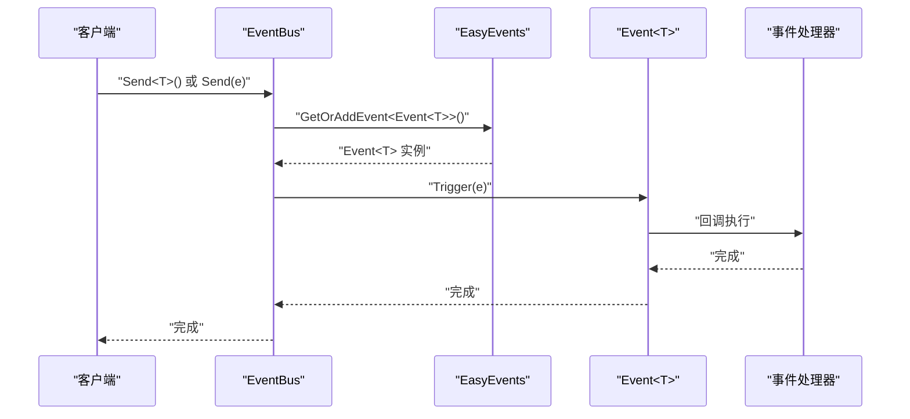
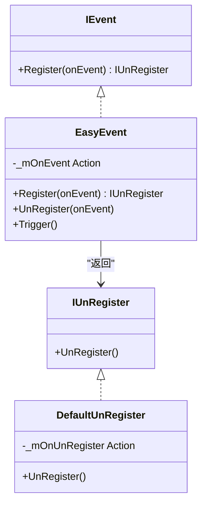
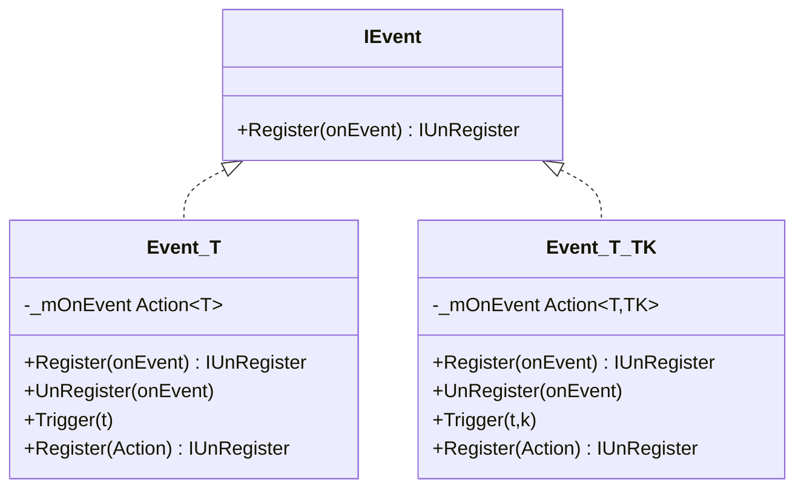
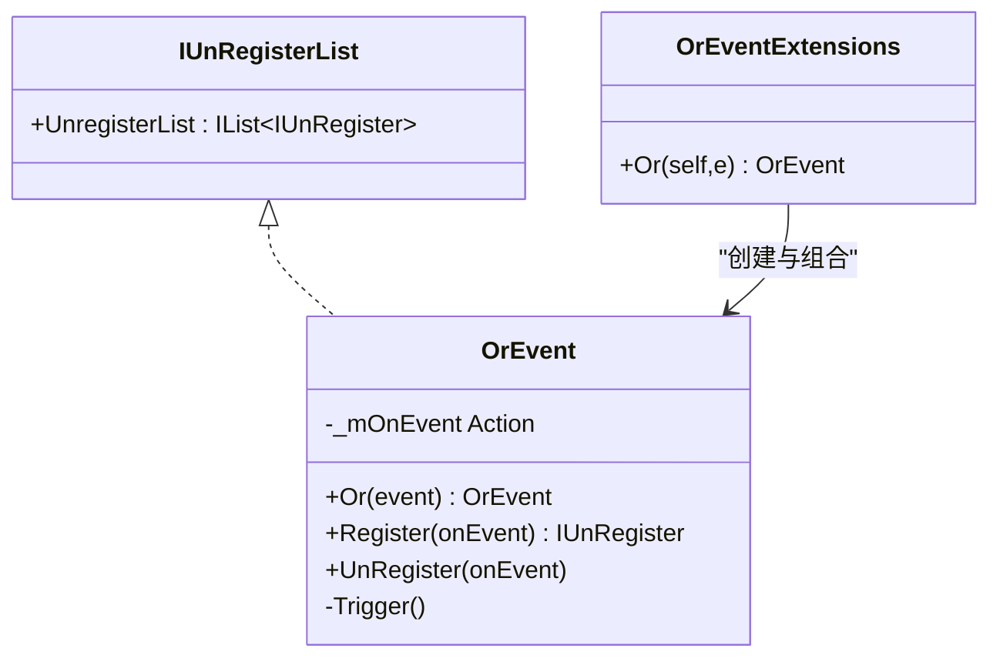
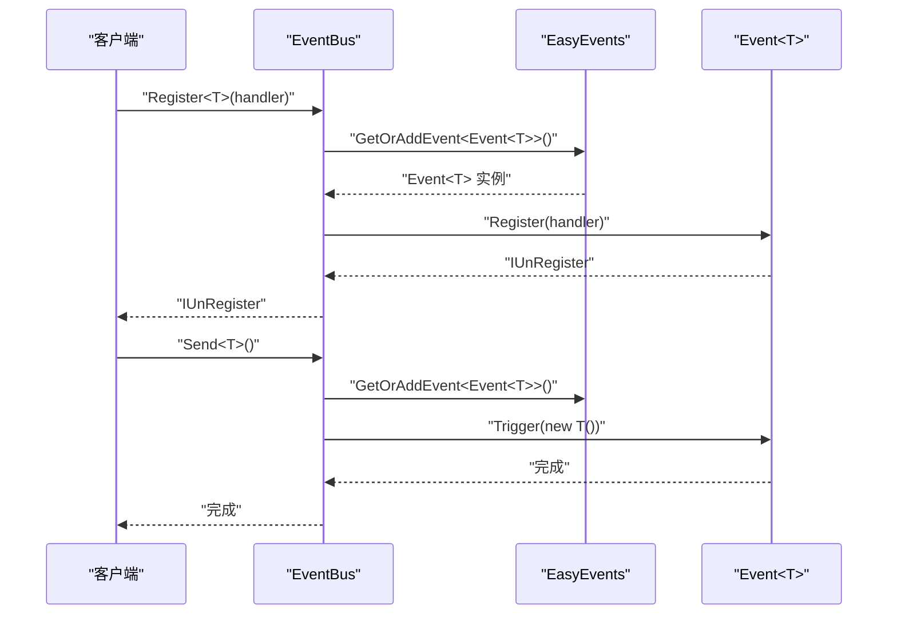
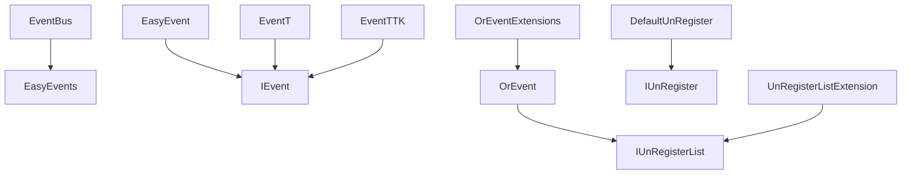

# 事件系统接口

<cite>
**本文档引用的文件**
- [IEvent.cs](file://GFramework.Core.Abstractions/events/IEvent.cs)
- [IEventBus.cs](file://GFramework.Core.Abstractions/events/IEventBus.cs)
- [IUnRegister.cs](file://GFramework.Core.Abstractions/events/IUnRegister.cs)
- [IUnRegisterList.cs](file://GFramework.Core.Abstractions/events/IUnRegisterList.cs)
- [EasyEvent.cs](file://GFramework.Core/events/EasyEvent.cs)
- [EasyEventGeneric.cs](file://GFramework.Core/events/EasyEventGeneric.cs)
- [OrEvent.cs](file://GFramework.Core/events/OrEvent.cs)
- [EventBus.cs](file://GFramework.Core/events/EventBus.cs)
- [DefaultUnRegister.cs](file://GFramework.Core/events/DefaultUnRegister.cs)
- [UnRegisterList.cs](file://GFramework.Core/events/UnRegisterList.cs)
- [EasyEvents.cs](file://GFramework.Core/events/EasyEvents.cs)
- [OrEventExtensions.cs](file://GFramework.Core/extensions/OrEventExtensions.cs)
- [UnRegisterListExtension.cs](file://GFramework.Core/extensions/UnRegisterListExtension.cs)
- [EventTests.cs](file://GFramework.Core.Tests/events/EventTests.cs)
- [EventBusTests.cs](file://GFramework.Core.Tests/events/EventBusTests.cs)
- [OrEventTests.cs](file://GFramework.Core.Tests/events/OrEventTests.cs)
- [UnRegisterTests.cs](file://GFramework.Core.Tests/events/UnRegisterTests.cs)
</cite>

## 目录
1. [简介](#简介)
2. [项目结构](#项目结构)
3. [核心组件](#核心组件)
4. [架构概览](#架构概览)
5. [详细组件分析](#详细组件分析)
6. [依赖分析](#依赖分析)
7. [性能考虑](#性能考虑)
8. [故障排除指南](#故障排除指南)
9. [结论](#结论)
10. [附录](#附录)

## 简介
本文件为 GFramework 事件系统接口的详细 API 参考文档，覆盖以下核心接口与实现：
- IEvent 事件接口：定义事件注册能力
- IEventBus 事件总线接口：提供事件发送、注册与注销
- IUnRegister 注销接口：提供注销能力
- IUnRegisterList 注销列表接口：统一管理多个注销对象
- EasyEvent 简化事件：无参事件的注册、注销与触发
- Event<T>/Event<T,TK> 泛型事件：支持一参与二参事件的注册、注销与触发
- OrEvent 组合事件：实现“或”逻辑组合，任一子事件触发即触发 OrEvent
- EventBus 事件总线：基于类型事件系统的事件分发中心
- EasyEvents 全局事件管理器：提供全局事件的注册与获取
- DefaultUnRegister/UnRegisterList：默认注销器与注销列表实现
- OrEventExtensions/UnRegisterListExtension：扩展方法，便于组合与批量注销

文档重点说明事件发布订阅机制、事件传播路径、事件过滤与优先级控制的 API 设计思路，并给出实际使用示例、性能优化建议与错误处理策略，同时讨论线程安全性与并发处理能力。

## 项目结构
事件系统相关代码分布在抽象层与具体实现层：
- 抽象层（Abstractions）：定义事件系统的核心接口，确保跨平台与解耦
- 实现层（Core）：提供具体事件实现、事件总线、注销器与扩展方法
- 测试层（Core.Tests）：验证事件系统的行为与边界条件

**图表来源**
- [IEvent.cs](file://GFramework.Core.Abstractions/events/IEvent.cs#L1-L16)
- [IEventBus.cs](file://GFramework.Core.Abstractions/events/IEventBus.cs#L1-L37)
- [IUnRegister.cs](file://GFramework.Core.Abstractions/events/IUnRegister.cs#L1-L12)
- [IUnRegisterList.cs](file://GFramework.Core.Abstractions/events/IUnRegisterList.cs#L1-L14)
- [EasyEvent.cs](file://GFramework.Core/events/EasyEvent.cs#L1-L39)
- [EasyEventGeneric.cs](file://GFramework.Core/events/EasyEventGeneric.cs#L1-L123)
- [OrEvent.cs](file://GFramework.Core/events/OrEvent.cs#L1-L57)
- [EventBus.cs](file://GFramework.Core/events/EventBus.cs#L1-L55)
- [EasyEvents.cs](file://GFramework.Core/events/EasyEvents.cs#L1-L85)
- [DefaultUnRegister.cs](file://GFramework.Core/events/DefaultUnRegister.cs#L1-L22)
- [UnRegisterList.cs](file://GFramework.Core/events/UnRegisterList.cs#L1-L37)
- [OrEventExtensions.cs](file://GFramework.Core/extensions/OrEventExtensions.cs#L1-L21)
- [UnRegisterListExtension.cs](file://GFramework.Core/extensions/UnRegisterListExtension.cs#L1-L32)

**章节来源**
- [IEvent.cs](file://GFramework.Core.Abstractions/events/IEvent.cs#L1-L16)
- [IEventBus.cs](file://GFramework.Core.Abstractions/events/IEventBus.cs#L1-L37)
- [IUnRegister.cs](file://GFramework.Core.Abstractions/events/IUnRegister.cs#L1-L12)
- [IUnRegisterList.cs](file://GFramework.Core.Abstractions/events/IUnRegisterList.cs#L1-L14)
- [EasyEvent.cs](file://GFramework.Core/events/EasyEvent.cs#L1-L39)
- [EasyEventGeneric.cs](file://GFramework.Core/events/EasyEventGeneric.cs#L1-L123)
- [OrEvent.cs](file://GFramework.Core/events/OrEvent.cs#L1-L57)
- [EventBus.cs](file://GFramework.Core/events/EventBus.cs#L1-L55)
- [EasyEvents.cs](file://GFramework.Core/events/EasyEvents.cs#L1-L85)
- [DefaultUnRegister.cs](file://GFramework.Core/events/DefaultUnRegister.cs#L1-L22)
- [UnRegisterList.cs](file://GFramework.Core/events/UnRegisterList.cs#L1-L37)
- [OrEventExtensions.cs](file://GFramework.Core/extensions/OrEventExtensions.cs#L1-L21)
- [UnRegisterListExtension.cs](file://GFramework.Core/extensions/UnRegisterListExtension.cs#L1-L32)

## 核心组件
本节概述事件系统的关键接口与实现职责：

- IEvent：定义事件注册能力，返回 IUnRegister 以便后续注销
- IEventBus：提供 Send/Register/UnRegister 三类操作，面向类型事件系统
- IUnRegister：提供注销动作，避免重复注销与内存泄漏
- IUnRegisterList：统一管理多个注销对象，支持批量注销
- EasyEvent：无参事件的注册、注销与触发
- Event<T>/Event<T,TK>：支持一参与二参事件的注册、注销与触发，显式实现 IEvent
- OrEvent：组合事件，任一子事件触发即触发 OrEvent，实现 IUnRegisterList
- EventBus：基于 EasyEvents 的事件总线，负责事件分发
- EasyEvents：全局事件管理器，按类型缓存事件实例
- DefaultUnRegister/UnRegisterList：默认注销器与注销列表实现
- OrEventExtensions/UnRegisterListExtension：扩展方法，增强组合与批量注销能力

**章节来源**
- [IEvent.cs](file://GFramework.Core.Abstractions/events/IEvent.cs#L1-L16)
- [IEventBus.cs](file://GFramework.Core.Abstractions/events/IEventBus.cs#L1-L37)
- [IUnRegister.cs](file://GFramework.Core.Abstractions/events/IUnRegister.cs#L1-L12)
- [IUnRegisterList.cs](file://GFramework.Core.Abstractions/events/IUnRegisterList.cs#L1-L14)
- [EasyEvent.cs](file://GFramework.Core/events/EasyEvent.cs#L1-L39)
- [EasyEventGeneric.cs](file://GFramework.Core/events/EasyEventGeneric.cs#L1-L123)
- [OrEvent.cs](file://GFramework.Core/events/OrEvent.cs#L1-L57)
- [EventBus.cs](file://GFramework.Core/events/EventBus.cs#L1-L55)
- [EasyEvents.cs](file://GFramework.Core/events/EasyEvents.cs#L1-L85)
- [DefaultUnRegister.cs](file://GFramework.Core/events/DefaultUnRegister.cs#L1-L22)
- [UnRegisterList.cs](file://GFramework.Core/events/UnRegisterList.cs#L1-L37)
- [OrEventExtensions.cs](file://GFramework.Core/extensions/OrEventExtensions.cs#L1-L21)
- [UnRegisterListExtension.cs](file://GFramework.Core/extensions/UnRegisterListExtension.cs#L1-L32)

## 架构概览
事件系统采用“接口抽象 + 类型事件 + 注销管理”的架构设计，核心流程如下：
- 事件注册：通过 IEvent.Register 返回 IUnRegister；或通过 IEventBus.Register 注册类型事件处理器
- 事件触发：EasyEvent/Event<T>/Event<T,TK> 提供 Trigger；EventBus.Send 触发类型事件
- 事件注销：IUnRegister.UnRegister 执行注销；IUnRegisterList.UnregisterList 支持批量注销
- 组合事件：OrEvent 将多个事件组合为“或”逻辑，任一子事件触发即触发 OrEvent

**图表来源**
- [EventBus.cs](file://GFramework.Core/events/EventBus.cs#L1-L55)
- [EasyEvents.cs](file://GFramework.Core/events/EasyEvents.cs#L1-L85)
- [EasyEventGeneric.cs](file://GFramework.Core/events/EasyEventGeneric.cs#L1-L123)

## 详细组件分析

### IEvent 接口
- 职责：定义事件注册能力，返回 IUnRegister 用于注销
- 关键方法：Register(Action onEvent) -> IUnRegister
- 使用场景：所有事件实现 IEvent，统一注册入口

**章节来源**
- [IEvent.cs](file://GFramework.Core.Abstractions/events/IEvent.cs#L1-L16)

### IEventBus 接口
- 职责：事件总线接口，提供 Send/Register/UnRegister
- 关键方法：
  - Send<T>()：自动创建事件实例并触发
  - Send<T>(T e)：发送指定事件实例
  - Register<T>(Action<T> onEvent) -> IUnRegister
  - UnRegister<T>(Action<T> onEvent)
- 约束：Send<T>() 要求 T 具有无参构造函数

**章节来源**
- [IEventBus.cs](file://GFramework.Core.Abstractions/events/IEventBus.cs#L1-L37)

### IUnRegister 与 IUnRegisterList 接口
- IUnRegister：提供 UnRegister() 执行注销
- IUnRegisterList：提供 IList<IUnRegister> UnregisterList，统一管理多个注销对象

**章节来源**
- [IUnRegister.cs](file://GFramework.Core.Abstractions/events/IUnRegister.cs#L1-L12)
- [IUnRegisterList.cs](file://GFramework.Core.Abstractions/events/IUnRegisterList.cs#L1-L14)

### EasyEvent 简化事件
- 特性：无参事件，支持多处理器注册与触发
- 关键方法：
  - Register(Action onEvent) -> IUnRegister
  - UnRegister(Action onEvent)
  - Trigger()
- 实现要点：内部维护 Action 委托链，使用默认注销器 DefaultUnRegister

**图表来源**
- [EasyEvent.cs](file://GFramework.Core/events/EasyEvent.cs#L1-L39)
- [DefaultUnRegister.cs](file://GFramework.Core/events/DefaultUnRegister.cs#L1-L22)

**章节来源**
- [EasyEvent.cs](file://GFramework.Core/events/EasyEvent.cs#L1-L39)
- [DefaultUnRegister.cs](file://GFramework.Core/events/DefaultUnRegister.cs#L1-L22)

### Event<T> 与 Event<T,TK> 泛型事件
- 特性：支持一参与二参事件，显式实现 IEvent 以兼容无参注册
- 关键方法：
  - Register(Action<T> onEvent) -> IUnRegister
  - UnRegister(Action<T> onEvent)
  - Trigger(T t)
  - 显式实现 IEvent.Register(Action onEvent)
- 实现要点：内部维护 Action<T>/Action<T,TK> 委托链，使用默认注销器

**图表来源**
- [EasyEventGeneric.cs](file://GFramework.Core/events/EasyEventGeneric.cs#L1-L123)

**章节来源**
- [EasyEventGeneric.cs](file://GFramework.Core/events/EasyEventGeneric.cs#L1-L123)

### OrEvent 组合事件
- 特性：实现 IUnRegisterList，将多个 IEvent 通过“或”逻辑组合
- 关键方法：
  - Or(IEvent @event) -> OrEvent（链式组合）
  - Register(Action onEvent) -> IUnRegister
  - UnRegister(Action onEvent)
  - 内部维护触发委托链
- 扩展：OrEventExtensions 提供 Or(this IEvent self, IEvent e) 快捷组合

**图表来源**
- [OrEvent.cs](file://GFramework.Core/events/OrEvent.cs#L1-L57)
- [OrEventExtensions.cs](file://GFramework.Core/extensions/OrEventExtensions.cs#L1-L21)

**章节来源**
- [OrEvent.cs](file://GFramework.Core/events/OrEvent.cs#L1-L57)
- [OrEventExtensions.cs](file://GFramework.Core/extensions/OrEventExtensions.cs#L1-L21)

### EventBus 事件总线
- 特性：基于类型事件系统，通过 EasyEvents 管理 Event<T> 实例
- 关键方法：
  - Send<T>()：自动创建 T 并触发
  - Send<T>(T e)：直接触发事件实例
  - Register<T>(Action<T> onEvent) -> IUnRegister
  - UnRegister<T>(Action<T> onEvent)
- 实现要点：内部持有 EasyEvents，按类型获取/创建 Event<T> 并触发

**图表来源**
- [EventBus.cs](file://GFramework.Core/events/EventBus.cs#L1-L55)
- [EasyEvents.cs](file://GFramework.Core/events/EasyEvents.cs#L1-L85)

**章节来源**
- [EventBus.cs](file://GFramework.Core/events/EventBus.cs#L1-L55)
- [EasyEvents.cs](file://GFramework.Core/events/EasyEvents.cs#L1-L85)

### EasyEvents 全局事件管理器
- 特性：全局单例，按类型缓存事件实例
- 关键方法：
  - Get<T>() / GetOrAdd<T>()：获取或创建事件实例
  - AddEvent<T>()：注册事件类型
  - GetEvent<T>() / GetOrAddEvent<T>()：获取事件实例
- 实现要点：内部使用字典保存 Type 到 IEvent 的映射

**章节来源**
- [EasyEvents.cs](file://GFramework.Core/events/EasyEvents.cs#L1-L85)

### DefaultUnRegister 与 UnRegisterList
- DefaultUnRegister：封装注销回调，执行后清理引用，避免重复执行
- UnRegisterList：管理 IUnRegister 列表，支持批量注销与清空

**章节来源**
- [DefaultUnRegister.cs](file://GFramework.Core/events/DefaultUnRegister.cs#L1-L22)
- [UnRegisterList.cs](file://GFramework.Core/events/UnRegisterList.cs#L1-L37)

### 扩展方法
- OrEventExtensions：提供 Or(this IEvent self, IEvent e) 快速组合 OrEvent
- UnRegisterListExtension：提供 AddToUnregisterList 与 UnRegisterAll 扩展

**章节来源**
- [OrEventExtensions.cs](file://GFramework.Core/extensions/OrEventExtensions.cs#L1-L21)
- [UnRegisterListExtension.cs](file://GFramework.Core/extensions/UnRegisterListExtension.cs#L1-L32)

## 依赖分析
事件系统组件之间的依赖关系如下：
- EventBus 依赖 EasyEvents 进行事件实例管理
- EasyEvent/Event<T>/Event<T,TK> 实现 IEvent，统一注册入口
- OrEvent 实现 IUnRegisterList，支持组合与批量注销
- DefaultUnRegister 实现 IUnRegister，提供注销能力
- 扩展方法增强组合与批量注销体验

**图表来源**
- [EventBus.cs](file://GFramework.Core/events/EventBus.cs#L1-L55)
- [EasyEvents.cs](file://GFramework.Core/events/EasyEvents.cs#L1-L85)
- [EasyEvent.cs](file://GFramework.Core/events/EasyEvent.cs#L1-L39)
- [EasyEventGeneric.cs](file://GFramework.Core/events/EasyEventGeneric.cs#L1-L123)
- [OrEvent.cs](file://GFramework.Core/events/OrEvent.cs#L1-L57)
- [DefaultUnRegister.cs](file://GFramework.Core/events/DefaultUnRegister.cs#L1-L22)
- [UnRegisterList.cs](file://GFramework.Core/events/UnRegisterList.cs#L1-L37)
- [OrEventExtensions.cs](file://GFramework.Core/extensions/OrEventExtensions.cs#L1-L21)
- [UnRegisterListExtension.cs](file://GFramework.Core/extensions/UnRegisterListExtension.cs#L1-L32)

**章节来源**
- [EventBus.cs](file://GFramework.Core/events/EventBus.cs#L1-L55)
- [EasyEvents.cs](file://GFramework.Core/events/EasyEvents.cs#L1-L85)
- [EasyEvent.cs](file://GFramework.Core/events/EasyEvent.cs#L1-L39)
- [EasyEventGeneric.cs](file://GFramework.Core/events/EasyEventGeneric.cs#L1-L123)
- [OrEvent.cs](file://GFramework.Core/events/OrEvent.cs#L1-L57)
- [DefaultUnRegister.cs](file://GFramework.Core/events/DefaultUnRegister.cs#L1-L22)
- [UnRegisterList.cs](file://GFramework.Core/events/UnRegisterList.cs#L1-L37)
- [OrEventExtensions.cs](file://GFramework.Core/extensions/OrEventExtensions.cs#L1-L21)
- [UnRegisterListExtension.cs](file://GFramework.Core/extensions/UnRegisterListExtension.cs#L1-L32)

## 性能考虑
- 委托链开销：事件处理器以委托链形式存储，触发时依次调用。建议：
  - 控制单事件处理器数量，避免过长委托链
  - 对高频事件采用批处理或延迟触发策略
- 字典查找：EasyEvents 使用 Type 到 IEvent 的字典映射，平均 O(1) 查找；注意：
  - 避免动态创建大量事件类型，减少字典增长
  - 合理复用事件类型，降低内存占用
- 批量注销：UnRegisterList 支持一次性注销多个处理器，建议：
  - 在对象生命周期结束时统一调用 UnRegisterAll
  - 使用扩展方法 AddToUnregisterList 自动收集注销项
- 线程安全：当前实现未内置锁保护，建议：
  - 在多线程场景下，外部加锁或使用线程安全的事件总线包装
  - 避免在事件回调中修改注册表（添加/删除处理器）

[本节为通用性能建议，不直接分析具体文件]

## 故障排除指南
- 注销无效或重复执行
  - 检查 DefaultUnRegister 是否正确执行并清理回调引用
  - 确保每次注册返回的 IUnRegister 仅调用一次 UnRegister
- 处理器未被调用
  - 确认事件类型与处理器签名一致
  - 对于 EventBus，确认 Send<T>() 与 Register<T>() 使用相同类型
- OrEvent 不触发
  - 确认已通过 Or(event) 正确组合子事件
  - 检查子事件是否已注册处理器
- 批量注销未生效
  - 确认 IUnRegisterList.UnregisterList 中包含正确的 IUnRegister 对象
  - 使用扩展方法 UnRegisterAll 验证注销流程

**章节来源**
- [DefaultUnRegister.cs](file://GFramework.Core/events/DefaultUnRegister.cs#L1-L22)
- [UnRegisterList.cs](file://GFramework.Core/events/UnRegisterList.cs#L1-L37)
- [UnRegisterTests.cs](file://GFramework.Core.Tests/events/UnRegisterTests.cs#L1-L114)
- [OrEventTests.cs](file://GFramework.Core.Tests/events/OrEventTests.cs#L1-L104)
- [EventBusTests.cs](file://GFramework.Core.Tests/events/EventBusTests.cs#L1-L85)
- [EventTests.cs](file://GFramework.Core.Tests/events/EventTests.cs#L1-L164)

## 结论
GFramework 事件系统通过清晰的接口抽象与简洁的实现，提供了灵活的事件发布订阅机制。IEvent/IEventBus/IUnRegister/IUnRegisterList 四大接口构成事件系统骨架，EasyEvent/Event<T>/Event<T,TK>/OrEvent/EventBus 等实现满足从简单到复杂的多种场景。配合 EasyEvents 全局管理与扩展方法，开发者可以高效地构建事件驱动架构。在性能与并发方面，建议关注委托链长度、字典查找与线程安全问题，并通过批量注销与合理的事件类型设计提升系统稳定性。

[本节为总结性内容，不直接分析具体文件]

## 附录

### API 一览表
- IEvent
  - Register(Action onEvent) -> IUnRegister
- IEventBus
  - Send<T>()（要求 T 无参构造）
  - Send<T>(T e)
  - Register<T>(Action<T> onEvent) -> IUnRegister
  - UnRegister<T>(Action<T> onEvent)
- IUnRegister
  - UnRegister()
- IUnRegisterList
  - UnregisterList : IList<IUnRegister>
- EasyEvent
  - Register(Action onEvent) -> IUnRegister
  - UnRegister(Action onEvent)
  - Trigger()
- Event<T>/Event<T,TK>
  - Register(Action<T/onEvent>) -> IUnRegister
  - UnRegister(Action<T/onEvent>)
  - Trigger(...)
  - 显式实现 IEvent.Register(Action onEvent)
- OrEvent
  - Or(IEvent event) -> OrEvent
  - Register(Action onEvent) -> IUnRegister
  - UnRegister(Action onEvent)
- EventBus
  - Send<T>() / Send<T>(T e)
  - Register<T>(Action<T> onEvent) -> IUnRegister
  - UnRegister<T>(Action<T> onEvent)
- EasyEvents
  - Get<T>() / GetOrAdd<T>()
  - AddEvent<T>()
  - GetEvent<T>() / GetOrAddEvent<T>()
- DefaultUnRegister
  - UnRegister()
- UnRegisterList
  - Add(IUnRegister)
  - UnRegisterAll()
- 扩展方法
  - OrEventExtensions.Or(self, e)
  - UnRegisterListExtension.AddToUnregisterList(self, list)
  - UnRegisterListExtension.UnRegisterAll(self)

**章节来源**
- [IEvent.cs](file://GFramework.Core.Abstractions/events/IEvent.cs#L1-L16)
- [IEventBus.cs](file://GFramework.Core.Abstractions/events/IEventBus.cs#L1-L37)
- [IUnRegister.cs](file://GFramework.Core.Abstractions/events/IUnRegister.cs#L1-L12)
- [IUnRegisterList.cs](file://GFramework.Core.Abstractions/events/IUnRegisterList.cs#L1-L14)
- [EasyEvent.cs](file://GFramework.Core/events/EasyEvent.cs#L1-L39)
- [EasyEventGeneric.cs](file://GFramework.Core/events/EasyEventGeneric.cs#L1-L123)
- [OrEvent.cs](file://GFramework.Core/events/OrEvent.cs#L1-L57)
- [EventBus.cs](file://GFramework.Core/events/EventBus.cs#L1-L55)
- [EasyEvents.cs](file://GFramework.Core/events/EasyEvents.cs#L1-L85)
- [DefaultUnRegister.cs](file://GFramework.Core/events/DefaultUnRegister.cs#L1-L22)
- [UnRegisterList.cs](file://GFramework.Core/events/UnRegisterList.cs#L1-L37)
- [OrEventExtensions.cs](file://GFramework.Core/extensions/OrEventExtensions.cs#L1-L21)
- [UnRegisterListExtension.cs](file://GFramework.Core/extensions/UnRegisterListExtension.cs#L1-L32)

### 实际使用示例（步骤说明）
- 简单事件（无参）
  - 注册：调用 EasyEvent.Register(Action onEvent) 获取 IUnRegister
  - 触发：调用 EasyEvent.Trigger()
  - 注销：调用 IUnRegister.UnRegister()
- 泛型事件（一参/二参）
  - 注册：调用 Event<T>.Register(Action<T> onEvent) 或 Event<T,TK>.Register(Action<T,TK> onEvent)
  - 触发：调用 Trigger(...) 传入对应参数
  - 注销：调用 UnRegister(Action<T/onEvent>)
- 事件总线（类型事件）
  - 注册：EventBus.Register<T>(Action<T> onEvent)
  - 发送：EventBus.Send<T>() 或 EventBus.Send(e)
  - 注销：EventBus.UnRegister<T>(Action<T> onEvent)
- 组合事件（或逻辑）
  - 组合：new OrEvent().Or(eventA).Or(eventB)
  - 注册：OrEvent.Register(Action onEvent)
  - 触发：任一子事件触发即触发 OrEvent
  - 注销：OrEvent.UnRegister(Action onEvent)
- 批量注销
  - 收集：IUnRegister.AddToUnregisterList(list)
  - 清理：IUnRegisterList.UnRegisterAll()

**章节来源**
- [EventTests.cs](file://GFramework.Core.Tests/events/EventTests.cs#L1-L164)
- [EventBusTests.cs](file://GFramework.Core.Tests/events/EventBusTests.cs#L1-L85)
- [OrEventTests.cs](file://GFramework.Core.Tests/events/OrEventTests.cs#L1-L104)
- [UnRegisterTests.cs](file://GFramework.Core.Tests/events/UnRegisterTests.cs#L1-L114)
- [UnRegisterListExtension.cs](file://GFramework.Core/extensions/UnRegisterListExtension.cs#L1-L32)
- [OrEventExtensions.cs](file://GFramework.Core/extensions/OrEventExtensions.cs#L1-L21)

### 线程安全性与并发处理
- 当前实现未内置锁保护，事件注册/注销与触发可能非线程安全
- 建议：
  - 在多线程场景下，外部加锁或使用线程安全的事件总线包装
  - 避免在事件回调中修改注册表（添加/删除处理器）
  - 对高频事件采用异步处理或队列缓冲

[本节为通用指导，不直接分析具体文件]