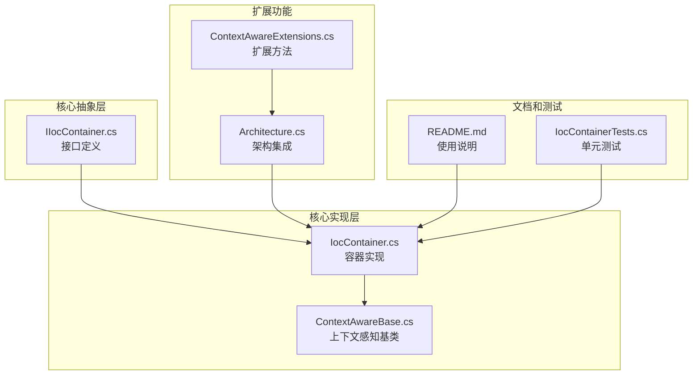
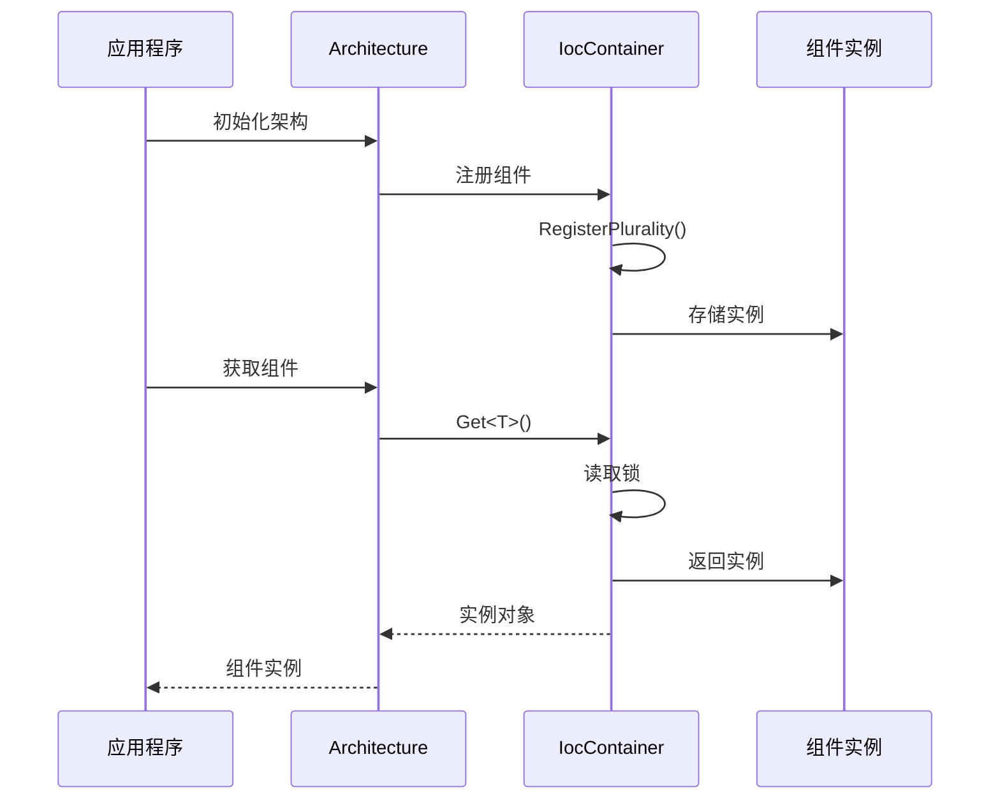
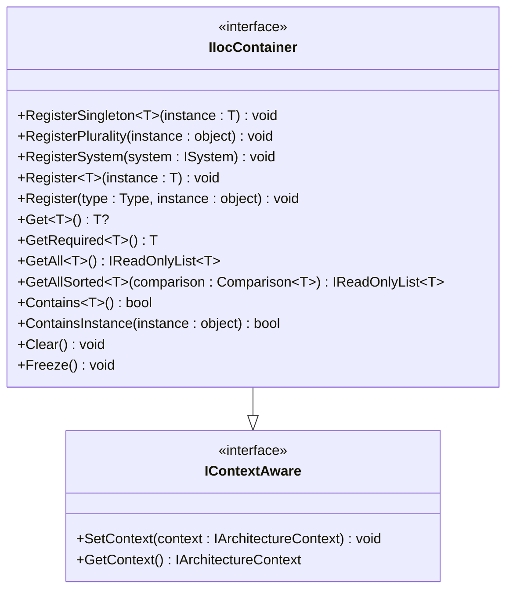
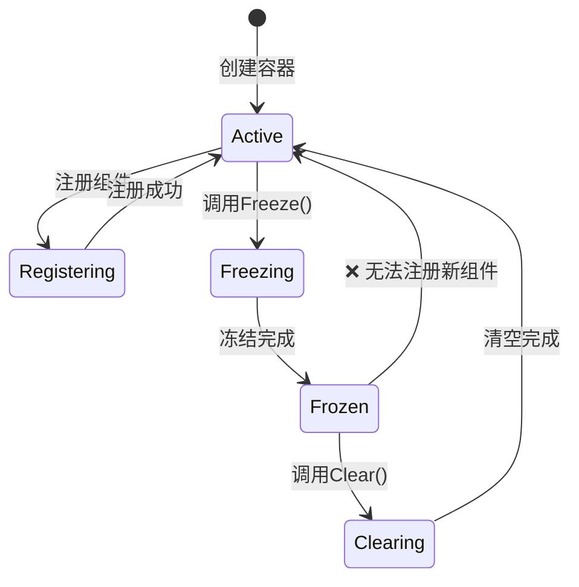
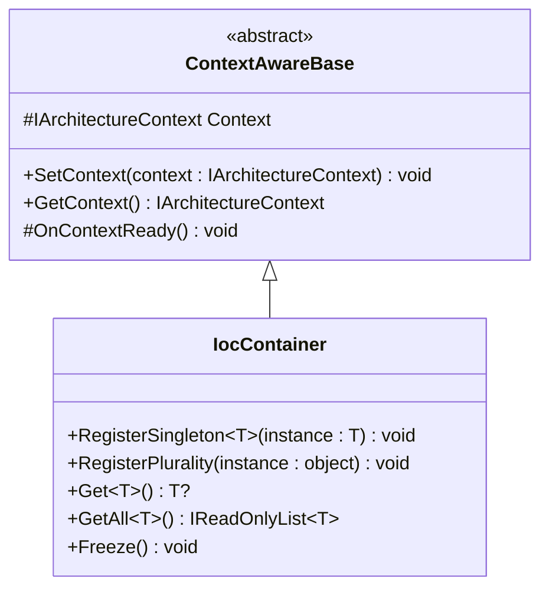
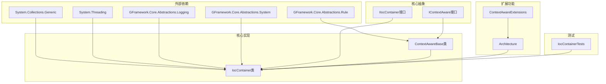

# 依赖注入接口

<cite>
**本文档引用的文件**
- [IIocContainer.cs](file://GFramework.Core.Abstractions/ioc/IIocContainer.cs)
- [IocContainer.cs](file://GFramework.Core/ioc/IocContainer.cs)
- [README.md](file://GFramework.Core/ioc/README.md)
- [IocContainerTests.cs](file://GFramework.Core.Tests/ioc/IocContainerTests.cs)
- [Architecture.cs](file://GFramework.Core/architecture/Architecture.cs)
- [ContextAwareBase.cs](file://GFramework.Core/rule/ContextAwareBase.cs)
- [ContextAwareExtensions.cs](file://GFramework.Core/extensions/ContextAwareExtensions.cs)
</cite>

## 目录
1. [简介](#简介)
2. [项目结构](#项目结构)
3. [核心组件](#核心组件)
4. [架构概览](#架构概览)
5. [详细组件分析](#详细组件分析)
6. [依赖关系分析](#依赖关系分析)
7. [性能考虑](#性能考虑)
8. [故障排除指南](#故障排除指南)
9. [结论](#结论)
10. [附录](#附录)

## 简介
GFramework依赖注入接口提供了一个轻量级的控制反转容器，用于管理框架中各种组件的注册和获取。该容器实现了类型安全的依赖管理，支持多线程环境下的安全操作，并提供了容器冻结保护机制。通过依赖注入，可以实现组件间的解耦，便于测试和维护。

## 项目结构
GFramework的依赖注入系统主要分布在以下目录中：



**图表来源**
- [IIocContainer.cs](file://GFramework.Core.Abstractions/ioc/IIocContainer.cs#L1-L116)
- [IocContainer.cs](file://GFramework.Core/ioc/IocContainer.cs#L1-L373)
- [Architecture.cs](file://GFramework.Core/architecture/Architecture.cs#L1-L569)

**章节来源**
- [IIocContainer.cs](file://GFramework.Core.Abstractions/ioc/IIocContainer.cs#L1-L116)
- [IocContainer.cs](file://GFramework.Core/ioc/IocContainer.cs#L1-L373)
- [README.md](file://GFramework.Core/ioc/README.md#L1-L681)

## 核心组件
GFramework依赖注入系统的核心组件包括接口定义、容器实现和相关扩展功能。

### IIocContainer接口
IIocContainer接口定义了依赖注入容器的基本操作规范，包括注册、获取和管理功能。

**主要功能区域：**
- **注册方法区**：提供多种注册方式（单例、多实例、系统实例等）
- **获取方法区**：支持单个实例获取、必需实例获取、全部实例获取和排序获取
- **实用方法区**：包含容器状态检查、实例检查、清空和冻结功能

**章节来源**
- [IIocContainer.cs](file://GFramework.Core.Abstractions/ioc/IIocContainer.cs#L11-L116)

### IocContainer实现类
IocContainer类实现了IIocContainer接口，提供了完整的依赖注入容器功能。

**核心特性：**
- **线程安全**：使用ReaderWriterLockSlim确保多线程环境下的安全操作
- **类型安全**：基于泛型实现，编译时类型检查
- **多实例支持**：每个类型可以注册多个实例
- **容器冻结**：防止初始化后意外修改容器内容

**章节来源**
- [IocContainer.cs](file://GFramework.Core/ioc/IocContainer.cs#L12-L373)

## 架构概览
GFramework的依赖注入系统深度集成到架构框架中，作为核心组件管理所有系统、模型和工具。



**图表来源**
- [Architecture.cs](file://GFramework.Core/architecture/Architecture.cs#L423-L437)
- [IocContainer.cs](file://GFramework.Core/ioc/IocContainer.cs#L105-L158)

**章节来源**
- [Architecture.cs](file://GFramework.Core/architecture/Architecture.cs#L72-L72)
- [Architecture.cs](file://GFramework.Core/architecture/Architecture.cs#L423-L437)

## 详细组件分析

### IIocContainer接口设计
IIocContainer接口采用职责分离的设计原则，将依赖注入容器的操作分为三个主要区域：



**图表来源**
- [IIocContainer.cs](file://GFramework.Core.Abstractions/ioc/IIocContainer.cs#L11-L116)

**章节来源**
- [IIocContainer.cs](file://GFramework.Core.Abstractions/ioc/IIocContainer.cs#L8-L116)

### IocContainer实现细节
IocContainer类提供了完整的依赖注入容器实现，包含以下关键组件：

#### 数据结构设计
容器使用双重索引结构来实现高效的查找和管理：

```mermaid
graph LR
subgraph "内部数据结构"
Objects[HashSet<object><br/>存储所有实例]
TypeIndex[Dictionary<Type, HashSet<object>><br/>类型索引映射]
Lock[ReaderWriterLockSlim<br/>读写锁]
Frozen[volatile bool<br/>冻结标志]
end
subgraph "注册流程"
Input[输入实例] --> WriteLock[写锁]
WriteLock --> RegisterInternal[RegisterInternal]
RegisterInternal --> AddToObjects[添加到对象集合]
RegisterInternal --> AddToTypeIndex[添加到类型索引]
AddToTypeIndex --> Unlock[解锁]
end
subgraph "获取流程"
GetCall[Get<T>()调用] --> ReadLock[读锁]
ReadLock --> Lookup[类型查找]
Lookup --> Return[返回实例或null]
Return --> ReleaseLock[释放锁]
end
```

**图表来源**
- [IocContainer.cs](file://GFramework.Core/ioc/IocContainer.cs#L41-L47)
- [IocContainer.cs](file://GFramework.Core/ioc/IocContainer.cs#L130-L148)

#### 注册机制分析
IocContainer支持多种注册方式，每种方式都有特定的使用场景：

**单例注册（RegisterSingleton）**
- 确保每个类型只有一个实例
- 适用于全局唯一的服务或配置对象
- 重复注册会抛出InvalidOperationException

**多实例注册（RegisterPlurality）**
- 将实例注册到其实现的所有接口和具体类型上
- 适用于策略模式或多实现场景
- 自动处理接口和具体类型的双向绑定

**系统注册（RegisterSystem）**
- 专门用于注册系统组件
- 自动调用RegisterPlurality进行多类型绑定
- 适用于架构中的系统组件管理

**章节来源**
- [IocContainer.cs](file://GFramework.Core/ioc/IocContainer.cs#L69-L158)
- [README.md](file://GFramework.Core/ioc/README.md#L24-L88)

### 生命周期管理
IocContainer实现了基本的生命周期管理功能，主要包括：

#### 容器冻结机制
容器冻结是IocContainer的一个重要特性，用于防止在初始化后意外修改容器内容：



**图表来源**
- [IocContainer.cs](file://GFramework.Core/ioc/IocContainer.cs#L357-L370)

#### 线程安全机制
容器使用ReaderWriterLockSlim实现高效的读写锁机制：

**读操作（Get系列方法）：**
- 使用读锁，允许多个线程并发执行
- 适合高频读取场景
- 性能最优的读取路径

**写操作（Register系列方法）：**
- 使用写锁，独占访问
- 防止并发修改冲突
- 确保数据一致性

**章节来源**
- [IocContainer.cs](file://GFramework.Core/ioc/IocContainer.cs#L21-L21)
- [IocContainer.cs](file://GFramework.Core/ioc/IocContainer.cs#L213-L229)

### 获取机制分析
IocContainer提供了灵活的实例获取机制，支持不同的使用场景：

#### 单个实例获取（Get<T>）
- 返回指定类型的第一个实例
- 如果未找到返回null
- 适合确定性场景

#### 必需实例获取（GetRequired<T>）
- 确保返回唯一实例
- 未找到或找到多个实例时抛出异常
- 适合强约束场景

#### 全部实例获取（GetAll<T>）
- 返回指定类型的所有实例
- 适合多实现场景
- 返回快照列表，不影响容器状态

#### 排序实例获取（GetAllSorted<T>）
- 获取并排序实例列表
- 适用于需要特定顺序的场景
- 支持自定义比较器

**章节来源**
- [IocContainer.cs](file://GFramework.Core/ioc/IocContainer.cs#L211-L294)

### 上下文感知集成
IocContainer继承自ContextAwareBase，实现了上下文感知功能：



**图表来源**
- [ContextAwareBase.cs](file://GFramework.Core/rule/ContextAwareBase.cs#L10-L43)
- [IocContainer.cs](file://GFramework.Core/ioc/IocContainer.cs#L12-L12)

**章节来源**
- [ContextAwareBase.cs](file://GFramework.Core/rule/ContextAwareBase.cs#L10-L43)
- [IocContainer.cs](file://GFramework.Core/ioc/IocContainer.cs#L56-L60)

## 依赖关系分析

### 组件间依赖关系
GFramework依赖注入系统各组件之间的依赖关系如下：



**图表来源**
- [IocContainer.cs](file://GFramework.Core/ioc/IocContainer.cs#L1-L6)
- [IIocContainer.cs](file://GFramework.Core.Abstractions/ioc/IIocContainer.cs#L1-L4)
- [ContextAwareBase.cs](file://GFramework.Core/rule/ContextAwareBase.cs#L1-L4)

### 架构集成点
IocContainer在GFramework架构中的集成点包括：

**架构初始化阶段：**
- 在InitializeInternalAsync中创建和配置容器
- 注册环境对象到容器
- 冻结容器防止后续修改

**组件注册阶段：**
- RegisterSystem/RegisterModel/RegisterUtility方法中使用容器
- 自动调用RegisterPlurality进行多类型绑定
- 处理组件的生命周期管理

**组件获取阶段：**
- 通过扩展方法间接使用容器
- 支持类型安全的组件获取
- 提供便利的API访问

**章节来源**
- [Architecture.cs](file://GFramework.Core/architecture/Architecture.cs#L534-L566)
- [Architecture.cs](file://GFramework.Core/architecture/Architecture.cs#L423-L483)

## 性能考虑

### 数据结构性能分析
IocContainer使用双重索引结构来实现高效的查找和管理：

**时间复杂度：**
- 注册操作：O(1) 平均情况
- 获取单个实例：O(1) 查找 + O(1) 访问
- 获取所有实例：O(k) k为实例数量
- 类型检查：O(1) 查找

**空间复杂度：**
- 对象存储：O(n) n为实例总数
- 类型索引：O(n*m) m为平均每个类型关联的实例数

### 线程安全性能
容器的线程安全机制在保证数据一致性的同时尽量减少性能开销：

**读写锁优势：**
- 读操作允许多线程并发执行
- 写操作独占锁，防止竞争
- 适合读多写少的场景

**锁粒度控制：**
- 读锁范围最小化
- 写锁范围最小化
- 避免长时间持有锁

### 内存管理
IocContainer的内存管理策略：

**实例生命周期：**
- 容器持有实例引用，不会自动释放
- 需要手动调用Clear或依赖架构销毁
- 避免内存泄漏的关键在于正确管理实例生命周期

**垃圾回收考虑：**
- 容器本身占用内存很小
- 主要内存消耗来自存储的实例
- 建议及时清理不再使用的实例

## 故障排除指南

### 常见问题诊断

#### 容器冻结相关问题
**问题现象：** 调用Register方法时抛出InvalidOperationException
**原因分析：** 容器已被冻结，无法进行新的注册
**解决方案：** 
- 在架构初始化完成前进行所有注册
- 避免在运行时动态注册组件
- 使用条件注册检查容器状态

#### 单例注册冲突
**问题现象：** RegisterSingleton方法抛出InvalidOperationException
**原因分析：** 该类型已存在单例实例
**解决方案：**
- 检查是否重复注册同一类型
- 使用Register方法而非RegisterSingleton
- 确认单例注册的唯一性需求

#### 实例获取异常
**问题现象：** GetRequired方法抛出InvalidOperationException
**原因分析：** 未找到实例或找到多个实例
**解决方案：**
- 使用Get方法获取可空实例
- 使用GetAll方法获取所有实例
- 检查注册过程中的类型绑定

### 调试技巧
**使用Contains方法检查实例状态：**
```csharp
// 检查实例是否存在
if (container.Contains<IMyService>())
{
    // 安全获取实例
    var service = container.Get<IMyService>();
}
```

**利用日志输出进行调试：**
- 容器会在关键操作时输出调试信息
- 通过日志追踪注册和获取流程
- 检查异常发生的具体位置

**章节来源**
- [IocContainer.cs](file://GFramework.Core/ioc/IocContainer.cs#L78-L97)
- [IocContainer.cs](file://GFramework.Core/ioc/IocContainer.cs#L245-L258)

## 结论
GFramework依赖注入接口提供了一个设计简洁、功能完备的轻量级容器实现。其核心优势包括：

**设计优势：**
- 类型安全的API设计，编译时检查错误
- 线程安全的实现，支持并发访问
- 简洁的接口设计，易于理解和使用

**架构优势：**
- 深度集成到GFramework架构中
- 支持多实例和多类型绑定
- 提供容器冻结保护机制

**使用建议：**
- 在架构初始化阶段完成所有组件注册
- 使用接口类型进行注册和获取
- 合理使用容器冻结功能
- 注意内存管理和实例生命周期

虽然GFramework的IocContainer不支持自动依赖注入和复杂的生命周期管理，但其简单直接的设计使其非常适合GFramework的整体架构理念，为开发者提供了清晰、可控的依赖管理方案。

## 附录

### API参考表

#### 注册方法
| 方法名 | 参数 | 返回值 | 描述 |
|--------|------|--------|------|
| RegisterSingleton<T> | instance: T | void | 注册单例实例 |
| RegisterPlurality | instance: object | void | 注册多实例到所有类型 |
| RegisterSystem | system: ISystem | void | 注册系统实例 |
| Register<T> | instance: T | void | 注册指定类型实例 |
| Register | type: Type, instance: object | void | 注册指定类型实例 |

#### 获取方法
| 方法名 | 参数 | 返回值 | 描述 |
|--------|------|--------|------|
| Get<T> | 无 | T? | 获取单个实例 |
| GetRequired<T> | 无 | T | 获取必需实例 |
| GetAll<T> | 无 | IReadOnlyList<T> | 获取所有实例 |
| GetAllSorted<T> | comparison: Comparison<T> | IReadOnlyList<T> | 获取排序后的实例 |

#### 实用方法
| 方法名 | 参数 | 返回值 | 描述 |
|--------|------|--------|------|
| Contains<T> | 无 | bool | 检查类型是否存在 |
| ContainsInstance | instance: object | bool | 检查实例是否存在 |
| Clear | 无 | void | 清空所有实例 |
| Freeze | 无 | void | 冻结容器 |

### 最佳实践清单
- 在架构初始化完成前完成所有组件注册
- 使用接口类型进行注册，避免具体类型耦合
- 避免在运行时频繁注册组件
- 合理使用容器冻结功能保护配置
- 注意内存管理，及时清理不再使用的实例
- 使用扩展方法简化组件获取流程