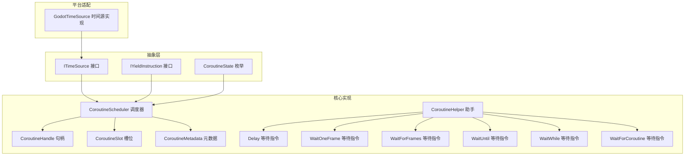
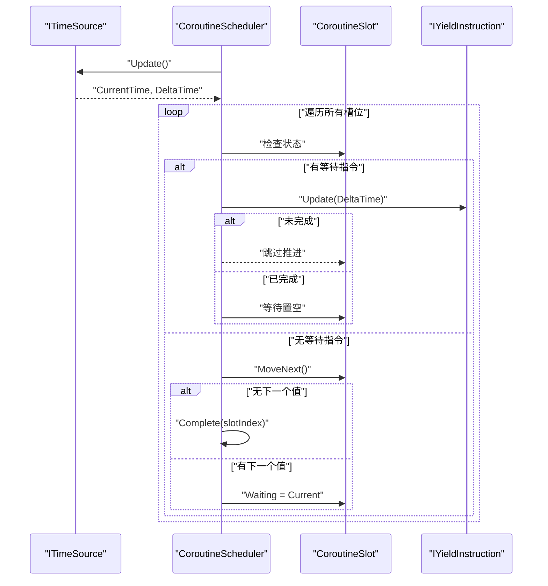
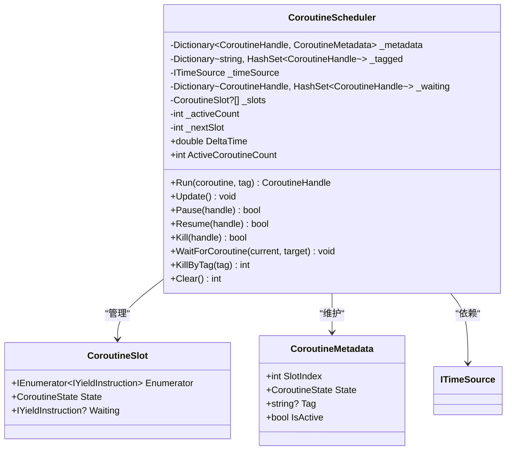
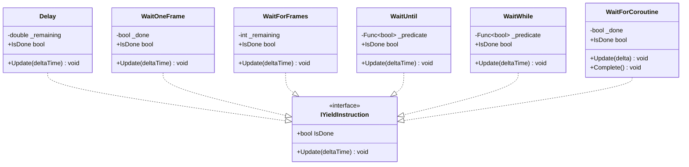
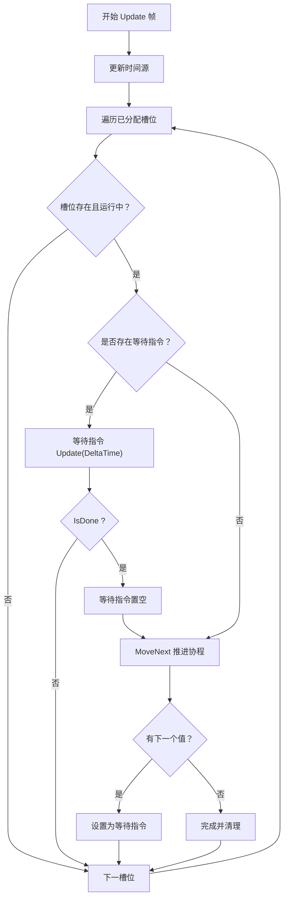
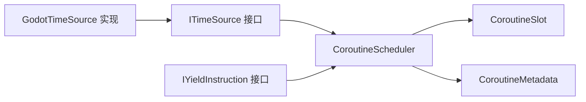

# 协程接口

<cite>
**本文引用的文件**
- [ITimeSource.cs](file://GFramework.Core.Abstractions/coroutine/ITimeSource.cs)
- [IYieldInstruction.cs](file://GFramework.Core.Abstractions/coroutine/IYieldInstruction.cs)
- [CoroutineState.cs](file://GFramework.Core.Abstractions/coroutine/CoroutineState.cs)
- [CoroutineHandle.cs](file://GFramework.Core/coroutine/CoroutineHandle.cs)
- [CoroutineHelper.cs](file://GFramework.Core/coroutine/CoroutineHelper.cs)
- [CoroutineScheduler.cs](file://GFramework.Core/coroutine/CoroutineScheduler.cs)
- [CoroutineSlot.cs](file://GFramework.Core/coroutine/CoroutineSlot.cs)
- [CoroutineMetadata.cs](file://GFramework.Core/coroutine/CoroutineMetadata.cs)
- [Delay.cs](file://GFramework.Core/coroutine/Delay.cs)
- [WaitOneFrame.cs](file://GFramework.Core/coroutine/WaitOneFrame.cs)
- [WaitForFrames.cs](file://GFramework.Core/coroutine/WaitForFrames.cs)
- [WaitUntil.cs](file://GFramework.Core/coroutine/WaitUntil.cs)
- [WaitWhile.cs](file://GFramework.Core/coroutine/WaitWhile.cs)
- [WaitForCoroutine.cs](file://GFramework.Core/coroutine/WaitForCoroutine.cs)
- [GodotTimeSource.cs](file://GFramework.Godot/coroutine/GodotTimeSource.cs)
</cite>

## 目录
1. [简介](#简介)
2. [项目结构](#项目结构)
3. [核心组件](#核心组件)
4. [架构总览](#架构总览)
5. [详细组件分析](#详细组件分析)
6. [依赖关系分析](#依赖关系分析)
7. [性能考量](#性能考量)
8. [故障排查指南](#故障排查指南)
9. [结论](#结论)
10. [附录](#附录)

## 简介
本文件为 GFramework 协程系统的 API 参考文档，覆盖以下核心接口与类：
- ITimeSource 时间源接口：提供当前时间与帧时间增量，并负责每帧更新
- IYieldInstruction 协程等待指令接口：定义协程等待行为的统一协议
- CoroutineScheduler 协程调度器：管理协程生命周期、推进执行、暂停/恢复/终止、按标签清理、等待其他协程
- CoroutineHandle 协程句柄：唯一标识协程实例，支持有效性判断与相等性比较
- CoroutineHelper 协程助手：提供常用等待指令与重复调用的便捷工厂方法
- 等待指令实现：Delay、WaitOneFrame、WaitForFrames、WaitUntil、WaitWhile、WaitForCoroutine
- GodotTimeSource：Godot 引擎的时间源实现

文档重点阐述协程执行机制、yield 指令实现、帧率控制、延迟等待、条件等待、状态管理、链式调用、取消与清理、性能优化、异步编程实践、与同步代码交互、调试技巧，以及在游戏开发中的应用场景与性能优势。

## 项目结构
协程相关代码分布在三个层次：
- 抽象层（Core.Abstractions）：定义时间源与等待指令的接口契约
- 核心实现（Core）：调度器、句柄、等待指令、元数据与槽位等具体实现
- 平台适配（Godot）：GodotTimeSource 提供引擎时间源的具体实现

图表来源
- [ITimeSource.cs](file://GFramework.Core.Abstractions/coroutine/ITimeSource.cs#L1-L22)
- [IYieldInstruction.cs](file://GFramework.Core.Abstractions/coroutine/IYieldInstruction.cs#L1-L18)
- [CoroutineState.cs](file://GFramework.Core.Abstractions/coroutine/CoroutineState.cs#L1-L32)
- [CoroutineScheduler.cs](file://GFramework.Core/coroutine/CoroutineScheduler.cs#L1-L392)
- [CoroutineSlot.cs](file://GFramework.Core/coroutine/CoroutineSlot.cs#L1-L24)
- [CoroutineMetadata.cs](file://GFramework.Core/coroutine/CoroutineMetadata.cs#L1-L32)
- [CoroutineHandle.cs](file://GFramework.Core/coroutine/CoroutineHandle.cs#L1-L94)
- [CoroutineHelper.cs](file://GFramework.Core/coroutine/CoroutineHelper.cs#L1-L101)
- [Delay.cs](file://GFramework.Core/coroutine/Delay.cs#L1-L29)
- [WaitOneFrame.cs](file://GFramework.Core/coroutine/WaitOneFrame.cs#L1-L26)
- [WaitForFrames.cs](file://GFramework.Core/coroutine/WaitForFrames.cs#L1-L29)
- [WaitUntil.cs](file://GFramework.Core/coroutine/WaitUntil.cs#L1-L26)
- [WaitWhile.cs](file://GFramework.Core/coroutine/WaitWhile.cs#L1-L26)
- [WaitForCoroutine.cs](file://GFramework.Core/coroutine/WaitForCoroutine.cs#L1-L29)
- [GodotTimeSource.cs](file://GFramework.Godot/coroutine/GodotTimeSource.cs#L1-L44)

章节来源
- [ITimeSource.cs](file://GFramework.Core.Abstractions/coroutine/ITimeSource.cs#L1-L22)
- [IYieldInstruction.cs](file://GFramework.Core.Abstractions/coroutine/IYieldInstruction.cs#L1-L18)
- [CoroutineState.cs](file://GFramework.Core.Abstractions/coroutine/CoroutineState.cs#L1-L32)
- [CoroutineScheduler.cs](file://GFramework.Core/coroutine/CoroutineScheduler.cs#L1-L392)
- [CoroutineSlot.cs](file://GFramework.Core/coroutine/CoroutineSlot.cs#L1-L24)
- [CoroutineMetadata.cs](file://GFramework.Core/coroutine/CoroutineMetadata.cs#L1-L32)
- [CoroutineHandle.cs](file://GFramework.Core/coroutine/CoroutineHandle.cs#L1-L94)
- [CoroutineHelper.cs](file://GFramework.Core/coroutine/CoroutineHelper.cs#L1-L101)
- [Delay.cs](file://GFramework.Core/coroutine/Delay.cs#L1-L29)
- [WaitOneFrame.cs](file://GFramework.Core/coroutine/WaitOneFrame.cs#L1-L26)
- [WaitForFrames.cs](file://GFramework.Core/coroutine/WaitForFrames.cs#L1-L29)
- [WaitUntil.cs](file://GFramework.Core/coroutine/WaitUntil.cs#L1-L26)
- [WaitWhile.cs](file://GFramework.Core/coroutine/WaitWhile.cs#L1-L26)
- [WaitForCoroutine.cs](file://GFramework.Core/coroutine/WaitForCoroutine.cs#L1-L29)
- [GodotTimeSource.cs](file://GFramework.Godot/coroutine/GodotTimeSource.cs#L1-L44)

## 核心组件
- ITimeSource：提供 CurrentTime、DeltaTime 与 Update，驱动调度器按帧推进
- IYieldInstruction：定义 IsDone 与 Update(deltaTime)，作为协程等待的统一协议
- CoroutineScheduler：持有时间源、协程槽位数组、元数据字典、标签集合、等待映射；提供 Run、Update、Pause、Resume、Kill、WaitForCoroutine、KillByTag、Clear 等
- CoroutineHandle：基于实例 ID 与内部索引生成稳定句柄，支持有效性判断与相等性比较
- CoroutineHelper：提供 WaitForSeconds、WaitForOneFrame、WaitForFrames、WaitUntil、WaitWhile、DelayedCall、RepeatCall、RepeatCallForever 等工厂方法
- 等待指令：Delay（秒级）、WaitOneFrame（单帧）、WaitForFrames（多帧）、WaitUntil（条件为真）、WaitWhile（条件为假）、WaitForCoroutine（等待另一协程）

章节来源
- [ITimeSource.cs](file://GFramework.Core.Abstractions/coroutine/ITimeSource.cs#L1-L22)
- [IYieldInstruction.cs](file://GFramework.Core.Abstractions/coroutine/IYieldInstruction.cs#L1-L18)
- [CoroutineScheduler.cs](file://GFramework.Core/coroutine/CoroutineScheduler.cs#L1-L392)
- [CoroutineHandle.cs](file://GFramework.Core/coroutine/CoroutineHandle.cs#L1-L94)
- [CoroutineHelper.cs](file://GFramework.Core/coroutine/CoroutineHelper.cs#L1-L101)
- [Delay.cs](file://GFramework.Core/coroutine/Delay.cs#L1-L29)
- [WaitOneFrame.cs](file://GFramework.Core/coroutine/WaitOneFrame.cs#L1-L26)
- [WaitForFrames.cs](file://GFramework.Core/coroutine/WaitForFrames.cs#L1-L29)
- [WaitUntil.cs](file://GFramework.Core/coroutine/WaitUntil.cs#L1-L26)
- [WaitWhile.cs](file://GFramework.Core/coroutine/WaitWhile.cs#L1-L26)
- [WaitForCoroutine.cs](file://GFramework.Core/coroutine/WaitForCoroutine.cs#L1-L29)

## 架构总览
协程系统采用“调度器驱动 + 等待指令解耦”的架构：
- 调度器在每帧调用时间源 Update，读取 DeltaTime
- 对每个运行中的协程槽位：
  - 若存在等待指令，则先 Update 等待指令，若未完成则跳过推进
  - 否则 MoveNext 推进协程，若无下一个值则标记完成；若有下一个值则将其设为当前等待指令
- 错误捕获后完成该协程并输出错误日志
- 支持暂停/恢复、等待其他协程、按标签批量终止、清空全部协程

图表来源
- [CoroutineScheduler.cs](file://GFramework.Core/coroutine/CoroutineScheduler.cs#L82-L121)
- [CoroutineSlot.cs](file://GFramework.Core/coroutine/CoroutineSlot.cs#L1-L24)
- [IYieldInstruction.cs](file://GFramework.Core.Abstractions/coroutine/IYieldInstruction.cs#L1-L18)
- [ITimeSource.cs](file://GFramework.Core.Abstractions/coroutine/ITimeSource.cs#L1-L22)

## 详细组件分析

### ITimeSource 时间源接口
- 职责：提供当前累计时间 CurrentTime、帧时间增量 DeltaTime，以及每帧调用的 Update
- 使用场景：调度器依赖它获取 DeltaTime 并推进等待指令与协程
- 平台实现：GodotTimeSource 通过外部函数委托获取增量时间并累加累计时间

章节来源
- [ITimeSource.cs](file://GFramework.Core.Abstractions/coroutine/ITimeSource.cs#L1-L22)
- [GodotTimeSource.cs](file://GFramework.Godot/coroutine/GodotTimeSource.cs#L1-L44)

### IYieldInstruction 等待指令接口
- 职责：定义 IsDone 与 Update(deltaTime) 两个核心能力
- 作用：协程在每次推进时返回一个等待指令，调度器在每帧调用其 Update，直到 IsDone 为真才继续推进

章节来源
- [IYieldInstruction.cs](file://GFramework.Core.Abstractions/coroutine/IYieldInstruction.cs#L1-L18)

### CoroutineScheduler 协程调度器
- 关键字段与结构
  - 时间源 ITimeSource
  - 协程槽位数组 CoroutineSlot?[]，按需扩容
  - 元数据字典 Dictionary<CoroutineHandle, CoroutineMetadata>
  - 标签到句柄集合的映射 Dictionary<string, HashSet<CoroutineHandle>>
  - 等待映射 Dictionary<CoroutineHandle, HashSet<CoroutineHandle>>
  - 活跃协程计数与下一个可用槽位索引
- 核心方法
  - Run：创建句柄、分配槽位、预热推进、记录元数据与标签
  - Update：遍历槽位，处理等待指令与推进协程，异常时完成并输出错误
  - Pause/Resume/Kill：修改状态并同步元数据
  - WaitForCoroutine：使当前协程进入 Held 状态并登记等待者
  - KillByTag/Clear：按标签批量终止或清空全部协程
- 性能特性
  - 槽位数组动态扩容（倍增）
  - 每帧仅遍历已分配的槽位，避免无效扫描
  - 元数据与标签集合支持快速查询与清理

图表来源
- [CoroutineScheduler.cs](file://GFramework.Core/coroutine/CoroutineScheduler.cs#L1-L392)
- [CoroutineSlot.cs](file://GFramework.Core/coroutine/CoroutineSlot.cs#L1-L24)
- [CoroutineMetadata.cs](file://GFramework.Core/coroutine/CoroutineMetadata.cs#L1-L32)

章节来源
- [CoroutineScheduler.cs](file://GFramework.Core/coroutine/CoroutineScheduler.cs#L1-L392)
- [CoroutineSlot.cs](file://GFramework.Core/coroutine/CoroutineSlot.cs#L1-L24)
- [CoroutineMetadata.cs](file://GFramework.Core/coroutine/CoroutineMetadata.cs#L1-L32)

### CoroutineHandle 协程句柄
- 设计要点：通过实例 ID 与内部索引组合生成稳定句柄，低 4 位为键（Key），键为 0 视为无效
- 用途：唯一标识协程，支持相等性比较与哈希计算，便于调度器快速定位与比较
- 注意：预留空间常量与索引数组确保不同实例 ID 的槽位互不冲突

章节来源
- [CoroutineHandle.cs](file://GFramework.Core/coroutine/CoroutineHandle.cs#L1-L94)

### CoroutineHelper 协程助手
- 工厂方法：提供 WaitForSeconds、WaitForOneFrame、WaitForFrames、WaitUntil、WaitWhile
- 控制流：DelayedCall、RepeatCall、RepeatCallForever 返回可直接交由调度器执行的协程枚举器
- 价值：简化常见等待与重复调用模式，提升开发效率

章节来源
- [CoroutineHelper.cs](file://GFramework.Core/coroutine/CoroutineHelper.cs#L1-L101)

### 等待指令实现
- Delay：按秒递减剩余时间，完成条件为剩余时间小于等于 0
- WaitOneFrame：首次 Update 即标记完成
- WaitForFrames：按帧递减剩余帧数，完成条件为剩余帧数小于等于 0
- WaitUntil：基于用户提供的谓词函数，完成条件为谓词返回 true
- WaitWhile：基于用户提供的谓词函数，完成条件为谓词首次返回 false
- WaitForCoroutine：内部用于等待另一协程完成，完成后由调度器标记完成

图表来源
- [IYieldInstruction.cs](file://GFramework.Core.Abstractions/coroutine/IYieldInstruction.cs#L1-L18)
- [Delay.cs](file://GFramework.Core/coroutine/Delay.cs#L1-L29)
- [WaitOneFrame.cs](file://GFramework.Core/coroutine/WaitOneFrame.cs#L1-L26)
- [WaitForFrames.cs](file://GFramework.Core/coroutine/WaitForFrames.cs#L1-L29)
- [WaitUntil.cs](file://GFramework.Core/coroutine/WaitUntil.cs#L1-L26)
- [WaitWhile.cs](file://GFramework.Core/coroutine/WaitWhile.cs#L1-L26)
- [WaitForCoroutine.cs](file://GFramework.Core/coroutine/WaitForCoroutine.cs#L1-L29)

章节来源
- [Delay.cs](file://GFramework.Core/coroutine/Delay.cs#L1-L29)
- [WaitOneFrame.cs](file://GFramework.Core/coroutine/WaitOneFrame.cs#L1-L26)
- [WaitForFrames.cs](file://GFramework.Core/coroutine/WaitForFrames.cs#L1-L29)
- [WaitUntil.cs](file://GFramework.Core/coroutine/WaitUntil.cs#L1-L26)
- [WaitWhile.cs](file://GFramework.Core/coroutine/WaitWhile.cs#L1-L26)
- [WaitForCoroutine.cs](file://GFramework.Core/coroutine/WaitForCoroutine.cs#L1-L29)

### 协程执行机制与流程图
- 协程推进：调度器每帧对运行中的槽位调用 MoveNext，若返回 false 则完成；若返回 true 则把当前值作为等待指令
- 等待指令：每帧 Update，直到 IsDone 为真
- 错误处理：推进或预热过程中抛出异常，记录错误并完成该协程
- 完成清理：移除标签、从等待映射中唤醒等待者、释放槽位

图表来源
- [CoroutineScheduler.cs](file://GFramework.Core/coroutine/CoroutineScheduler.cs#L82-L121)
- [CoroutineSlot.cs](file://GFramework.Core/coroutine/CoroutineSlot.cs#L1-L24)
- [IYieldInstruction.cs](file://GFramework.Core.Abstractions/coroutine/IYieldInstruction.cs#L1-L18)

章节来源
- [CoroutineScheduler.cs](file://GFramework.Core/coroutine/CoroutineScheduler.cs#L82-L121)

### 协程状态管理与链式调用
- 状态枚举：Running、Paused、Held、Completed、Cancelled
- 链式等待：WaitForCoroutine 使当前协程进入 Held 状态，等待目标协程完成后自动恢复
- 标签管理：Run 时可附加 tag，支持 KillByTag 批量终止，Clear 清空全部协程

章节来源
- [CoroutineState.cs](file://GFramework.Core.Abstractions/coroutine/CoroutineState.cs#L1-L32)
- [CoroutineScheduler.cs](file://GFramework.Core/coroutine/CoroutineScheduler.cs#L188-L254)

### 协程取消与清理
- Kill：立即完成指定协程并唤醒其等待者
- KillByTag：按标签批量终止协程
- Clear：清空所有协程、元数据、标签与等待映射
- 错误路径：OnError 输出异常并完成协程，避免异常传播影响调度器

章节来源
- [CoroutineScheduler.cs](file://GFramework.Core/coroutine/CoroutineScheduler.cs#L132-L254)

### 协程与同步代码的交互
- 通过 CoroutineHelper 的工厂方法返回的协程枚举器，可与同步逻辑无缝衔接
- DelayedCall、RepeatCall、RepeatCallForever 提供一次性与周期性的动作调度
- WaitForCoroutine 可在协程中等待另一个协程完成后再继续

章节来源
- [CoroutineHelper.cs](file://GFramework.Core/coroutine/CoroutineHelper.cs#L65-L100)
- [WaitForCoroutine.cs](file://GFramework.Core/coroutine/WaitForCoroutine.cs#L1-L29)

### 协程调试技巧
- 使用标签（tag）对协程分组，便于按类别观察与终止
- 在等待指令 Update 中加入断点，观察 IsDone 条件变化
- 捕获异常并记录堆栈，结合句柄与标签定位问题协程
- 通过 ActiveCoroutineCount 与 DeltaTime 监控协程负载与帧时间

章节来源
- [CoroutineScheduler.cs](file://GFramework.Core/coroutine/CoroutineScheduler.cs#L28-L33)
- [CoroutineScheduler.cs](file://GFramework.Core/coroutine/CoroutineScheduler.cs#L341-L345)

## 依赖关系分析
- 抽象接口（Core.Abstractions）被核心实现（Core）与平台适配（Godot）共同依赖
- 调度器依赖 ITimeSource 与 IYieldInstruction，内部使用 CoroutineSlot 与 CoroutineMetadata
- 等待指令实现均遵循 IYieldInstruction，彼此独立，便于扩展与替换
- GodotTimeSource 实现 ITimeSource，向调度器提供引擎帧时间

图表来源
- [ITimeSource.cs](file://GFramework.Core.Abstractions/coroutine/ITimeSource.cs#L1-L22)
- [IYieldInstruction.cs](file://GFramework.Core.Abstractions/coroutine/IYieldInstruction.cs#L1-L18)
- [CoroutineScheduler.cs](file://GFramework.Core/coroutine/CoroutineScheduler.cs#L1-L392)
- [CoroutineSlot.cs](file://GFramework.Core/coroutine/CoroutineSlot.cs#L1-L24)
- [CoroutineMetadata.cs](file://GFramework.Core/coroutine/CoroutineMetadata.cs#L1-L32)
- [GodotTimeSource.cs](file://GFramework.Godot/coroutine/GodotTimeSource.cs#L1-L44)

章节来源
- [ITimeSource.cs](file://GFramework.Core.Abstractions/coroutine/ITimeSource.cs#L1-L22)
- [IYieldInstruction.cs](file://GFramework.Core.Abstractions/coroutine/IYieldInstruction.cs#L1-L18)
- [CoroutineScheduler.cs](file://GFramework.Core/coroutine/CoroutineScheduler.cs#L1-L392)
- [GodotTimeSource.cs](file://GFramework.Godot/coroutine/GodotTimeSource.cs#L1-L44)

## 性能考量
- 槽位数组动态扩容：按需倍增，降低频繁分配成本
- 每帧只遍历已分配槽位，避免无效扫描
- 等待指令 Update 为轻量操作，减少调度器开销
- 标签与等待映射使用 HashSet，支持快速查找与去重
- 错误路径直接完成协程，避免异常传播导致的额外开销

[本节为通用性能建议，无需特定文件引用]

## 故障排查指南
- 协程未推进：检查是否正确返回等待指令；确认 Update 是否被调用
- 协程卡住：检查等待指令 IsDone 条件是否永远不满足；核对谓词函数或剩余计数
- 异常中断：查看错误输出与完成回调；定位具体协程句柄与标签
- 资源泄漏：确认 KillByTag 与 Clear 的调用时机；确保标签与等待映射被正确清理

章节来源
- [CoroutineScheduler.cs](file://GFramework.Core/coroutine/CoroutineScheduler.cs#L341-L345)
- [CoroutineScheduler.cs](file://GFramework.Core/coroutine/CoroutineScheduler.cs#L241-L254)

## 结论
GFramework 协程系统通过清晰的接口契约与高效的调度器实现，提供了灵活而高性能的异步控制流。借助 ITimeSource 与 IYieldInstruction 的解耦设计，开发者可以轻松扩展等待指令与时间源实现；通过句柄、标签与等待映射，协程的生命周期管理变得直观可控。在游戏开发中，该系统适用于动画过渡、UI 流程、事件序列、资源加载与状态机等场景，能够显著提升代码可读性与可维护性。

[本节为总结性内容，无需特定文件引用]

## 附录
- 实际使用示例（步骤说明）
  - 创建时间源：使用 GodotTimeSource 包装引擎帧时间
  - 创建调度器：传入时间源与实例 ID、初始容量
  - 编写协程：使用 CoroutineHelper 的工厂方法返回等待指令
  - 运行协程：调用调度器 Run 并传入协程枚举器与可选标签
  - 每帧推进：在游戏循环中调用调度器 Update
  - 控制协程：根据需要 Pause/Resume/Kill 或按标签 KillByTag/Clear
  - 等待链路：在协程中调用 WaitForCoroutine 等待另一个协程完成
- 协程与同步代码交互
  - 使用 DelayedCall 在延迟后执行动作
  - 使用 RepeatCall/RepeatCallForever 周期性执行任务
  - 在同步逻辑中保存句柄，以便后续暂停、恢复或终止
- 协程调试技巧
  - 为协程设置标签，便于分组观察
  - 在等待指令 Update 中设置断点，观察 IsDone 条件
  - 记录异常并定位问题协程，及时完成清理

[本节为概念性内容，无需特定文件引用]