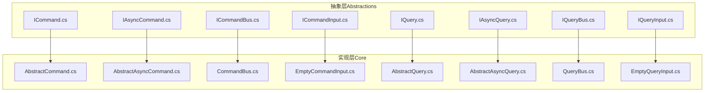
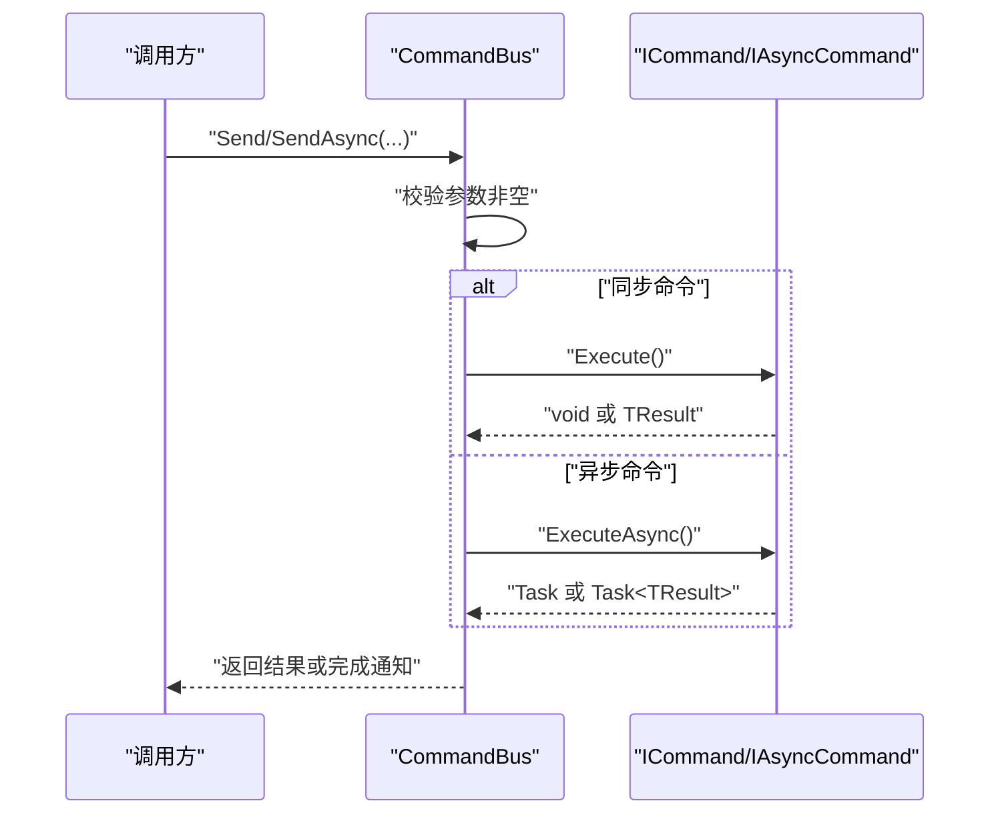
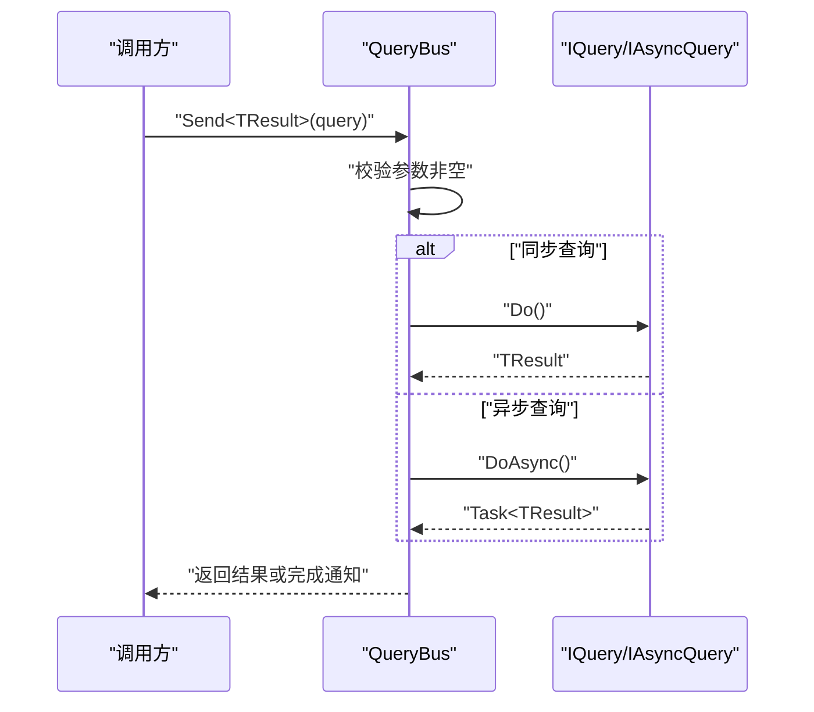
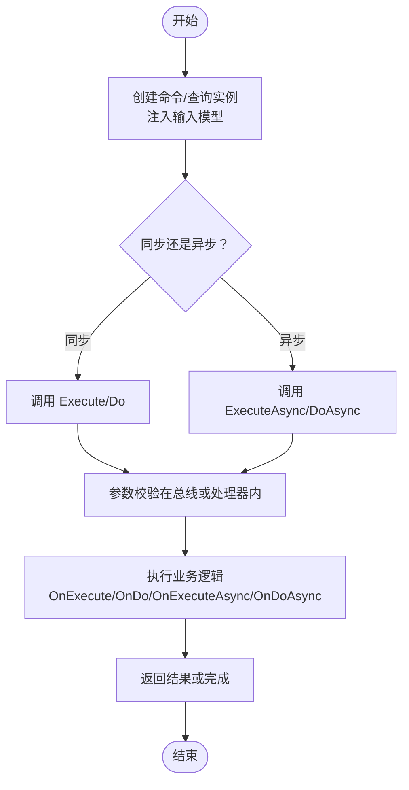
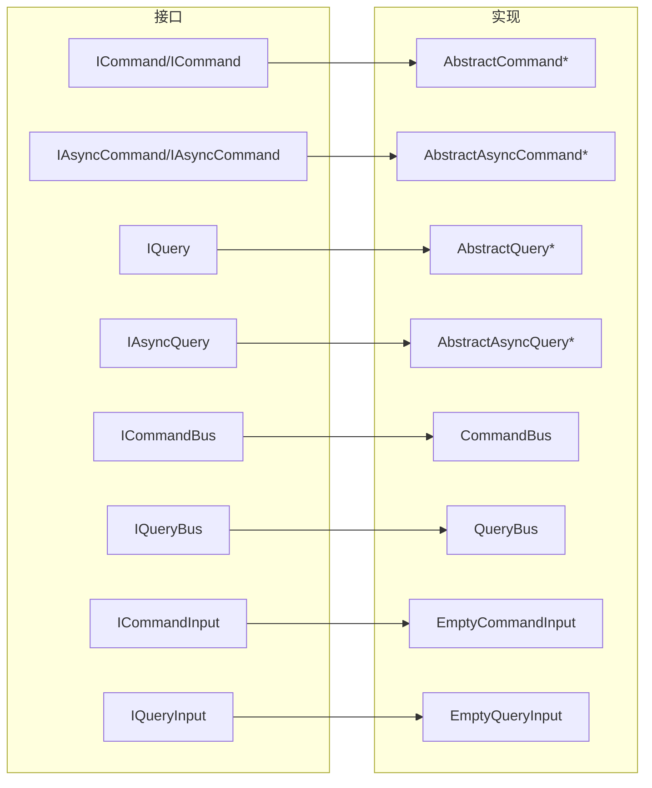

# 命令查询接口

<cite>
**本文引用的文件**
- [ICommand.cs](file://GFramework.Core.Abstractions/command/ICommand.cs)
- [IAsyncCommand.cs](file://GFramework.Core.Abstractions/command/IAsyncCommand.cs)
- [ICommandBus.cs](file://GFramework.Core.Abstractions/command/ICommandBus.cs)
- [ICommandInput.cs](file://GFramework.Core.Abstractions/command/ICommandInput.cs)
- [EmptyCommandInput.cs](file://GFramework.Core/command/EmptyCommandInput.cs)
- [AbstractCommand.cs](file://GFramework.Core/command/AbstractCommand.cs)
- [AbstractAsyncCommand.cs](file://GFramework.Core/command/AbstractAsyncCommand.cs)
- [CommandBus.cs](file://GFramework.Core/command/CommandBus.cs)
- [IQuery.cs](file://GFramework.Core.Abstractions/query/IQuery.cs)
- [IAsyncQuery.cs](file://GFramework.Core.Abstractions/query/IAsyncQuery.cs)
- [IQueryBus.cs](file://GFramework.Core.Abstractions/query/IQueryBus.cs)
- [IQueryInput.cs](file://GFramework.Core.Abstractions/query/IQueryInput.cs)
- [EmptyQueryInput.cs](file://GFramework.Core/query/EmptyQueryInput.cs)
- [AbstractQuery.cs](file://GFramework.Core/query/AbstractQuery.cs)
- [AbstractAsyncQuery.cs](file://GFramework.Core/query/AbstractAsyncQuery.cs)
- [QueryBus.cs](file://GFramework.Core/query/QueryBus.cs)
</cite>

## 目录
1. [简介](#简介)
2. [项目结构](#项目结构)
3. [核心组件](#核心组件)
4. [架构概览](#架构概览)
5. [详细组件分析](#详细组件分析)
6. [依赖关系分析](#依赖关系分析)
7. [性能考虑](#性能考虑)
8. [故障排除指南](#故障排除指南)
9. [结论](#结论)
10. [附录](#附录)

## 简介
本文件为 GFramework 的命令与查询（CQRS）接口提供完整的 API 参考与实践指南。内容覆盖 ICommand/IAsyncCommand 命令接口族、ICommandBus 命令总线、IQuery/IAsyncQuery 查询接口族、IQueryBus 查询总线，以及输入模型 EmptyCommandInput/EmptyQueryInput。文档重点阐述职责分离、处理器实现、异步机制、生命周期管理、参数校验、结果处理与异常处理，并给出可测试性与解耦优势、实际应用示例、性能优化技巧与最佳实践。

## 项目结构
围绕命令与查询的接口与实现分布在两个命名空间：
- 抽象层（Abstractions）：定义 CQRS 接口契约与输入标记接口
- 实现层（Core）：提供抽象基类与默认总线实现

图表来源
- [ICommand.cs](file://GFramework.Core.Abstractions/command/ICommand.cs#L1-L31)
- [IAsyncCommand.cs](file://GFramework.Core.Abstractions/command/IAsyncCommand.cs#L1-L29)
- [ICommandBus.cs](file://GFramework.Core.Abstractions/command/ICommandBus.cs#L1-L37)
- [ICommandInput.cs](file://GFramework.Core.Abstractions/command/ICommandInput.cs#L1-L7)
- [AbstractCommand.cs](file://GFramework.Core/command/AbstractCommand.cs#L1-L53)
- [AbstractAsyncCommand.cs](file://GFramework.Core/command/AbstractAsyncCommand.cs#L1-L53)
- [CommandBus.cs](file://GFramework.Core/command/CommandBus.cs#L1-L62)
- [EmptyCommandInput.cs](file://GFramework.Core/command/EmptyCommandInput.cs#L1-L13)
- [IQuery.cs](file://GFramework.Core.Abstractions/query/IQuery.cs#L1-L16)
- [IAsyncQuery.cs](file://GFramework.Core.Abstractions/query/IAsyncQuery.cs#L1-L16)
- [IQueryBus.cs](file://GFramework.Core.Abstractions/query/IQueryBus.cs#L1-L15)
- [IQueryInput.cs](file://GFramework.Core.Abstractions/query/IQueryInput.cs#L1-L6)
- [AbstractQuery.cs](file://GFramework.Core/query/AbstractQuery.cs#L1-L29)
- [AbstractAsyncQuery.cs](file://GFramework.Core/query/AbstractAsyncQuery.cs#L1-L32)
- [QueryBus.cs](file://GFramework.Core/query/QueryBus.cs#L1-L23)
- [EmptyQueryInput.cs](file://GFramework.Core/query/EmptyQueryInput.cs#L1-L11)

章节来源
- [ICommand.cs](file://GFramework.Core.Abstractions/command/ICommand.cs#L1-L31)
- [IAsyncCommand.cs](file://GFramework.Core.Abstractions/command/IAsyncCommand.cs#L1-L29)
- [ICommandBus.cs](file://GFramework.Core.Abstractions/command/ICommandBus.cs#L1-L37)
- [IQuery.cs](file://GFramework.Core.Abstractions/query/IQuery.cs#L1-L16)
- [IAsyncQuery.cs](file://GFramework.Core.Abstractions/query/IAsyncQuery.cs#L1-L16)
- [IQueryBus.cs](file://GFramework.Core.Abstractions/query/IQueryBus.cs#L1-L15)

## 核心组件
- 命令接口族
  - ICommand/ICommand<TResult>：同步命令，支持无返回值或返回值两种形式
  - IAsyncCommand/IAsyncCommand<TResult>：异步命令，支持无返回值或返回值两种形式
  - 输入契约：ICommandInput；空输入：EmptyCommandInput
  - 总线：ICommandBus；默认实现：CommandBus
- 查询接口族
  - IQuery<TResult>：同步查询
  - IAsyncQuery<TResult>：异步查询
  - 输入契约：IQueryInput；空输入：EmptyQueryInput
  - 总线：IQueryBus；默认实现：QueryBus
- 抽象基类
  - AbstractCommand/AbstractCommand<TInput,TResult>：为同步命令提供上下文感知与输入注入
  - AbstractAsyncCommand/AbstractAsyncCommand<TInput,TResult>：为异步命令提供上下文感知与输入注入
  - AbstractQuery/AbstractAsyncQuery：为查询提供上下文感知与输入注入

章节来源
- [ICommand.cs](file://GFramework.Core.Abstractions/command/ICommand.cs#L1-L31)
- [IAsyncCommand.cs](file://GFramework.Core.Abstractions/command/IAsyncCommand.cs#L1-L29)
- [ICommandBus.cs](file://GFramework.Core.Abstractions/command/ICommandBus.cs#L1-L37)
- [ICommandInput.cs](file://GFramework.Core.Abstractions/command/ICommandInput.cs#L1-L7)
- [EmptyCommandInput.cs](file://GFramework.Core/command/EmptyCommandInput.cs#L1-L13)
- [AbstractCommand.cs](file://GFramework.Core/command/AbstractCommand.cs#L1-L53)
- [AbstractAsyncCommand.cs](file://GFramework.Core/command/AbstractAsyncCommand.cs#L1-L53)
- [CommandBus.cs](file://GFramework.Core/command/CommandBus.cs#L1-L62)
- [IQuery.cs](file://GFramework.Core.Abstractions/query/IQuery.cs#L1-L16)
- [IAsyncQuery.cs](file://GFramework.Core.Abstractions/query/IAsyncQuery.cs#L1-L16)
- [IQueryBus.cs](file://GFramework.Core.Abstractions/query/IQueryBus.cs#L1-L15)
- [IQueryInput.cs](file://GFramework.Core.Abstractions/query/IQueryInput.cs#L1-L6)
- [EmptyQueryInput.cs](file://GFramework.Core/query/EmptyQueryInput.cs#L1-L11)
- [AbstractQuery.cs](file://GFramework.Core/query/AbstractQuery.cs#L1-L29)
- [AbstractAsyncQuery.cs](file://GFramework.Core/query/AbstractAsyncQuery.cs#L1-L32)
- [QueryBus.cs](file://GFramework.Core/query/QueryBus.cs#L1-L23)

## 架构概览
CQRS 将“命令”（写操作，改变状态）与“查询”（读操作，不改变状态）分离，通过独立的接口与总线进行路由与执行。命令与查询均通过输入模型传递参数，抽象基类统一提供上下文感知能力，便于访问架构、系统、模型、工具与事件设施。

```mermaid
classDiagram
%% 接口层
class ICommand {
+Execute() void
}
class ICommand_TResult {
+Execute() TResult
}
class IAsyncCommand {
+ExecuteAsync() Task
}
class IAsyncCommand_TResult {
+ExecuteAsync() Task~TResult~
}
class IQuery_TResult {
+Do() TResult
}
class IAsyncQuery_TResult {
+DoAsync() Task~TResult~
}
class ICommandBus {
+Send(command) void
+Send~TResult~(command) TResult
+SendAsync(command) Task
+SendAsync~TResult~(command) Task~TResult~
}
class IQueryBus {
+Send~TResult~(query) TResult
}
class ICommandInput
class IQueryInput
%% 实现层
class AbstractCommand_TInput {
-OnExecute(input) void
}
class AbstractCommand_TInput_TResult {
-OnExecute(input) TResult
}
class AbstractAsyncCommand_TInput {
-OnExecuteAsync(input) Task
}
class AbstractAsyncCommand_TInput_TResult {
-OnExecuteAsync(input) Task~TResult~
}
class CommandBus
class AbstractQuery_TInput_TResult {
-OnDo(input) TResult
}
class AbstractAsyncQuery_TInput_TResult {
-OnDoAsync(input) Task~TResult~
}
class QueryBus
%% 关系
ICommand <|.. AbstractCommand_TInput
ICommand_TResult <|.. AbstractCommand_TInput_TResult
IAsyncCommand <|.. AbstractAsyncCommand_TInput
IAsyncCommand_TResult <|.. AbstractAsyncCommand_TInput_TResult
IQuery_TResult <|.. AbstractQuery_TInput_TResult
IAsyncQuery_TResult <|.. AbstractAsyncQuery_TInput_TResult
ICommandBus <|.. CommandBus
IQueryBus <|.. QueryBus
ICommandInput <|.. EmptyCommandInput
IQueryInput <|.. EmptyQueryInput
```

图表来源
- [ICommand.cs](file://GFramework.Core.Abstractions/command/ICommand.cs#L1-L31)
- [IAsyncCommand.cs](file://GFramework.Core.Abstractions/command/IAsyncCommand.cs#L1-L29)
- [ICommandBus.cs](file://GFramework.Core.Abstractions/command/ICommandBus.cs#L1-L37)
- [ICommandInput.cs](file://GFramework.Core.Abstractions/command/ICommandInput.cs#L1-L7)
- [EmptyCommandInput.cs](file://GFramework.Core/command/EmptyCommandInput.cs#L1-L13)
- [AbstractCommand.cs](file://GFramework.Core/command/AbstractCommand.cs#L1-L53)
- [AbstractAsyncCommand.cs](file://GFramework.Core/command/AbstractAsyncCommand.cs#L1-L53)
- [CommandBus.cs](file://GFramework.Core/command/CommandBus.cs#L1-L62)
- [IQuery.cs](file://GFramework.Core.Abstractions/query/IQuery.cs#L1-L16)
- [IAsyncQuery.cs](file://GFramework.Core.Abstractions/query/IAsyncQuery.cs#L1-L16)
- [IQueryBus.cs](file://GFramework.Core.Abstractions/query/IQueryBus.cs#L1-L15)
- [IQueryInput.cs](file://GFramework.Core.Abstractions/query/IQueryInput.cs#L1-L6)
- [EmptyQueryInput.cs](file://GFramework.Core/query/EmptyQueryInput.cs#L1-L11)
- [AbstractQuery.cs](file://GFramework.Core/query/AbstractQuery.cs#L1-L29)
- [AbstractAsyncQuery.cs](file://GFramework.Core/query/AbstractAsyncQuery.cs#L1-L32)
- [QueryBus.cs](file://GFramework.Core/query/QueryBus.cs#L1-L23)

## 详细组件分析

### 命令接口与总线
- 同步命令
  - ICommand：无返回值命令，核心方法为 Execute
  - ICommand<TResult>：带返回值命令，核心方法为 Execute 返回 TResult
  - 输入契约：ICommandInput；空输入：EmptyCommandInput
- 异步命令
  - IAsyncCommand：无返回值异步命令，核心方法为 ExecuteAsync 返回 Task
  - IAsyncCommand<TResult>：带返回值异步命令，核心方法为 ExecuteAsync 返回 Task<TResult>
- 命令总线
  - ICommandBus：提供 Send/SendAsync 及泛型 Send<TResult>/SendAsync<TResult> 方法
  - 默认实现 CommandBus：直接调用命令的 Execute/ExecuteAsync，内部对 null 参数进行校验

图表来源
- [ICommandBus.cs](file://GFramework.Core.Abstractions/command/ICommandBus.cs#L1-L37)
- [CommandBus.cs](file://GFramework.Core/command/CommandBus.cs#L1-L62)
- [ICommand.cs](file://GFramework.Core.Abstractions/command/ICommand.cs#L1-L31)
- [IAsyncCommand.cs](file://GFramework.Core.Abstractions/command/IAsyncCommand.cs#L1-L29)

章节来源
- [ICommand.cs](file://GFramework.Core.Abstractions/command/ICommand.cs#L1-L31)
- [IAsyncCommand.cs](file://GFramework.Core.Abstractions/command/IAsyncCommand.cs#L1-L29)
- [ICommandBus.cs](file://GFramework.Core.Abstractions/command/ICommandBus.cs#L1-L37)
- [CommandBus.cs](file://GFramework.Core/command/CommandBus.cs#L1-L62)
- [ICommandInput.cs](file://GFramework.Core.Abstractions/command/ICommandInput.cs#L1-L7)
- [EmptyCommandInput.cs](file://GFramework.Core/command/EmptyCommandInput.cs#L1-L13)

### 查询接口与总线
- 同步查询
  - IQuery<TResult>：核心方法为 Do 返回 TResult
- 异步查询
  - IAsyncQuery<TResult>：核心方法为 DoAsync 返回 Task<TResult>
- 查询总线
  - IQueryBus：提供 Send<TResult>(IQuery<TResult>) 返回 TResult
  - 默认实现 QueryBus：直接调用查询的 Do/DoAsync，内部对 null 参数进行校验

图表来源
- [IQueryBus.cs](file://GFramework.Core.Abstractions/query/IQueryBus.cs#L1-L15)
- [QueryBus.cs](file://GFramework.Core/query/QueryBus.cs#L1-L23)
- [IQuery.cs](file://GFramework.Core.Abstractions/query/IQuery.cs#L1-L16)
- [IAsyncQuery.cs](file://GFramework.Core.Abstractions/query/IAsyncQuery.cs#L1-L16)

章节来源
- [IQuery.cs](file://GFramework.Core.Abstractions/query/IQuery.cs#L1-L16)
- [IAsyncQuery.cs](file://GFramework.Core.Abstractions/query/IAsyncQuery.cs#L1-L16)
- [IQueryBus.cs](file://GFramework.Core.Abstractions/query/IQueryBus.cs#L1-L15)
- [QueryBus.cs](file://GFramework.Core/query/QueryBus.cs#L1-L23)
- [IQueryInput.cs](file://GFramework.Core.Abstractions/query/IQueryInput.cs#L1-L6)
- [EmptyQueryInput.cs](file://GFramework.Core/query/EmptyQueryInput.cs#L1-L11)

### 抽象基类与生命周期
- 抽象命令
  - AbstractCommand<TInput>：实现 ICommand，入口调用受保护的 OnExecute(TInput)
  - AbstractCommand<TInput,TResult>：实现 ICommand<TResult>，入口返回 OnExecute(TInput)
- 抽象异步命令
  - AbstractAsyncCommand<TInput>：实现 IAsyncCommand，入口调用受保护的 OnExecuteAsync(TInput)
  - AbstractAsyncCommand<TInput,TResult>：实现 IAsyncCommand<TResult>，入口返回 OnExecuteAsync(TInput)
- 抽象查询
  - AbstractQuery<TInput,TResult>：实现 IQuery<TResult>，入口返回 OnDo(TInput)
- 抽象异步查询
  - AbstractAsyncQuery<TInput,TResult>：实现 IAsyncQuery<TResult>，入口返回 OnDoAsync(TInput)
- 生命周期要点
  - 所有抽象基类均继承自上下文感知基类，具备访问架构、系统、模型、工具与事件的能力
  - 处理器实现应聚焦于 OnExecute/OnExecuteAsync/OnDo/OnDoAsync 中的具体业务逻辑

图表来源
- [AbstractCommand.cs](file://GFramework.Core/command/AbstractCommand.cs#L1-L53)
- [AbstractAsyncCommand.cs](file://GFramework.Core/command/AbstractAsyncCommand.cs#L1-L53)
- [AbstractQuery.cs](file://GFramework.Core/query/AbstractQuery.cs#L1-L29)
- [AbstractAsyncQuery.cs](file://GFramework.Core/query/AbstractAsyncQuery.cs#L1-L32)

章节来源
- [AbstractCommand.cs](file://GFramework.Core/command/AbstractCommand.cs#L1-L53)
- [AbstractAsyncCommand.cs](file://GFramework.Core/command/AbstractAsyncCommand.cs#L1-L53)
- [AbstractQuery.cs](file://GFramework.Core/query/AbstractQuery.cs#L1-L29)
- [AbstractAsyncQuery.cs](file://GFramework.Core/query/AbstractAsyncQuery.cs#L1-L32)

### 输入模型设计
- 命令输入
  - ICommandInput：命令输入标记接口
  - EmptyCommandInput：无参命令的空输入实现
- 查询输入
  - IQueryInput：查询输入标记接口
  - EmptyQueryInput：无参查询的空输入实现
- 设计建议
  - 将命令/查询的输入参数封装为强类型输入对象，便于参数校验与文档化
  - 对于无需输入的场景，使用对应的空输入实现以保持接口一致性

章节来源
- [ICommandInput.cs](file://GFramework.Core.Abstractions/command/ICommandInput.cs#L1-L7)
- [EmptyCommandInput.cs](file://GFramework.Core/command/EmptyCommandInput.cs#L1-L13)
- [IQueryInput.cs](file://GFramework.Core.Abstractions/query/IQueryInput.cs#L1-L6)
- [EmptyQueryInput.cs](file://GFramework.Core/query/EmptyQueryInput.cs#L1-L11)

### 异步处理机制
- 异步命令
  - IAsyncCommand/IAsyncCommand<TResult>：通过 Task/Task<TResult> 支持异步执行
  - AbstractAsyncCommand 提供统一的异步入口与受保护的 OnExecuteAsync
- 异步查询
  - IAsyncQuery<TResult>：通过 Task<TResult> 支持异步查询
  - AbstractAsyncQuery 提供统一的异步入口与受保护的 OnDoAsync
- 总线异步转发
  - CommandBus/IQueryBus 的 SendAsync/SendAsync<TResult> 直接返回底层命令/查询的 Task/Task<TResult>

章节来源
- [IAsyncCommand.cs](file://GFramework.Core.Abstractions/command/IAsyncCommand.cs#L1-L29)
- [AbstractAsyncCommand.cs](file://GFramework.Core/command/AbstractAsyncCommand.cs#L1-L53)
- [IAsyncQuery.cs](file://GFramework.Core.Abstractions/query/IAsyncQuery.cs#L1-L16)
- [AbstractAsyncQuery.cs](file://GFramework.Core/query/AbstractAsyncQuery.cs#L1-L32)
- [CommandBus.cs](file://GFramework.Core/command/CommandBus.cs#L1-L62)
- [QueryBus.cs](file://GFramework.Core/query/QueryBus.cs#L1-L23)

### 参数验证与异常处理
- 总线层校验
  - CommandBus/QueryBus 在 Send/SendAsync/Send<TResult> 调用前对命令/查询对象进行 null 校验
- 处理器层建议
  - 在 OnExecute/OnExecuteAsync/OnDo/OnDoAsync 内对输入参数进行业务规则校验
  - 对外部资源（网络、存储）调用时捕获并转换为领域异常，避免泄露底层细节
- 结果处理
  - 同步命令/查询直接返回 TResult
  - 异步命令/查询返回 Task/Task<TResult>，调用方可 await 并处理异常

章节来源
- [CommandBus.cs](file://GFramework.Core/command/CommandBus.cs#L1-L62)
- [QueryBus.cs](file://GFramework.Core/query/QueryBus.cs#L1-L23)
- [AbstractCommand.cs](file://GFramework.Core/command/AbstractCommand.cs#L1-L53)
- [AbstractAsyncCommand.cs](file://GFramework.Core/command/AbstractAsyncCommand.cs#L1-L53)
- [AbstractQuery.cs](file://GFramework.Core/query/AbstractQuery.cs#L1-L29)
- [AbstractAsyncQuery.cs](file://GFramework.Core/query/AbstractAsyncQuery.cs#L1-L32)

### 生命周期管理
- 上下文感知
  - 所有抽象基类继承自上下文感知基类，可在处理器中访问架构、系统、模型、工具与事件设施
- 生命周期阶段
  - 创建：构造函数注入输入模型
  - 分发：通过 ICommandBus/IQueryBus 路由到处理器
  - 执行：在 OnExecute/OnExecuteAsync/OnDo/OnDoAsync 中完成业务逻辑
  - 清理：遵循所在平台的资源释放策略（如 IDisposable）

章节来源
- [AbstractCommand.cs](file://GFramework.Core/command/AbstractCommand.cs#L1-L53)
- [AbstractAsyncCommand.cs](file://GFramework.Core/command/AbstractAsyncCommand.cs#L1-L53)
- [AbstractQuery.cs](file://GFramework.Core/query/AbstractQuery.cs#L1-L29)
- [AbstractAsyncQuery.cs](file://GFramework.Core/query/AbstractAsyncQuery.cs#L1-L32)

### 实际应用示例（流程示意）
- 下单命令（同步）
  - 输入：订单创建输入模型
  - 处理：在 OnExecute 中校验库存、生成订单号、持久化
  - 结果：返回订单标识
- 获取用户信息（异步）
  - 输入：用户标识
  - 处理：在 OnDoAsync 中从缓存/数据库异步加载
  - 结果：返回用户信息对象

（以上为概念性示例，具体实现请参考对应抽象基类与总线的调用方式）

## 依赖关系分析
- 接口到实现
  - ICommand/ICommand<TResult> → AbstractCommand/AbstractCommand<TInput,TResult>
  - IAsyncCommand/IAsyncCommand<TResult> → AbstractAsyncCommand/AbstractAsyncCommand<TInput,TResult>
  - IQuery<TResult> → AbstractQuery<TInput,TResult>
  - IAsyncQuery<TResult> → AbstractAsyncQuery<TInput,TResult>
- 总线到接口
  - ICommandBus → ICommand/ICommand<TResult>/IAsyncCommand/IAsyncCommand<TResult>
  - IQueryBus → IQuery<TResult>/IAsyncQuery<TResult>
- 输入模型
  - ICommandInput/EmptyCommandInput 与命令输入绑定
  - IQueryInput/EmptyQueryInput 与查询输入绑定

图表来源
- [ICommand.cs](file://GFramework.Core.Abstractions/command/ICommand.cs#L1-L31)
- [IAsyncCommand.cs](file://GFramework.Core.Abstractions/command/IAsyncCommand.cs#L1-L29)
- [IQuery.cs](file://GFramework.Core.Abstractions/query/IQuery.cs#L1-L16)
- [IAsyncQuery.cs](file://GFramework.Core.Abstractions/query/IAsyncQuery.cs#L1-L16)
- [ICommandBus.cs](file://GFramework.Core.Abstractions/command/ICommandBus.cs#L1-L37)
- [IQueryBus.cs](file://GFramework.Core.Abstractions/query/IQueryBus.cs#L1-L15)
- [AbstractCommand.cs](file://GFramework.Core/command/AbstractCommand.cs#L1-L53)
- [AbstractAsyncCommand.cs](file://GFramework.Core/command/AbstractAsyncCommand.cs#L1-L53)
- [AbstractQuery.cs](file://GFramework.Core/query/AbstractQuery.cs#L1-L29)
- [AbstractAsyncQuery.cs](file://GFramework.Core/query/AbstractAsyncQuery.cs#L1-L32)
- [CommandBus.cs](file://GFramework.Core/command/CommandBus.cs#L1-L62)
- [QueryBus.cs](file://GFramework.Core/query/QueryBus.cs#L1-L23)
- [ICommandInput.cs](file://GFramework.Core.Abstractions/command/ICommandInput.cs#L1-L7)
- [EmptyCommandInput.cs](file://GFramework.Core/command/EmptyCommandInput.cs#L1-L13)
- [IQueryInput.cs](file://GFramework.Core.Abstractions/query/IQueryInput.cs#L1-L6)
- [EmptyQueryInput.cs](file://GFramework.Core/query/EmptyQueryInput.cs#L1-L11)

章节来源
- [ICommandBus.cs](file://GFramework.Core.Abstractions/command/ICommandBus.cs#L1-L37)
- [CommandBus.cs](file://GFramework.Core/command/CommandBus.cs#L1-L62)
- [IQueryBus.cs](file://GFramework.Core.Abstractions/query/IQueryBus.cs#L1-L15)
- [QueryBus.cs](file://GFramework.Core/query/QueryBus.cs#L1-L23)

## 性能考虑
- 异步优先：对于 IO 密集型操作（网络、磁盘、序列化），优先使用 IAsyncCommand/IAsyncQuery 与 AbstractAsyncCommand/AbstractAsyncQuery，避免阻塞主线程
- 避免过度拆分：将小而简单的命令/查询直接在处理器内实现，减少总线调用开销
- 输入校验前置：在总线或处理器早期进行参数校验，尽早失败，减少无效计算
- 结果复用：对昂贵的查询结果进行缓存（结合架构缓存设施），降低重复计算
- 并发控制：对可能产生竞态的命令进行幂等设计或加锁策略

## 故障排除指南
- 常见错误
  - 参数为空：总线在 Send/SendAsync 前进行 null 校验，若出现空引用异常，请检查调用方是否正确传入命令/查询对象
  - 类型不匹配：确保 Send<TResult> 与命令/查询声明的 TResult 一致
  - 异常传播：异步命令/查询的异常会在 Task/Task<TResult> 中传播，调用方需 await 并捕获
- 调试建议
  - 在处理器的 OnExecute/OnExecuteAsync/OnDo/OnDoAsync 中添加日志与断点
  - 使用最小输入模型复现问题，逐步增加复杂度
  - 对比同步与异步版本的行为差异，确认是否为异步调度导致的时序问题

章节来源
- [CommandBus.cs](file://GFramework.Core/command/CommandBus.cs#L1-L62)
- [QueryBus.cs](file://GFramework.Core/query/QueryBus.cs#L1-L23)

## 结论
GFramework 的命令与查询接口通过清晰的职责分离、统一的输入模型与上下文感知能力，提供了高内聚、低耦合的 CQRS 实践路径。借助抽象基类与默认总线实现，开发者可以快速构建稳定、可测试且易于扩展的命令/查询系统。配合异步机制与性能优化策略，可在复杂业务场景中获得良好的吞吐与响应表现。

## 附录
- 最佳实践清单
  - 明确区分命令与查询：只读用查询，写入用命令
  - 输入模型强类型化：将参数封装为输入对象，便于校验与文档
  - 处理器单一职责：每个命令/查询只做一件事
  - 异步化 IO 操作：使用异步接口与基类
  - 幂等设计：对关键命令进行幂等处理，提升可靠性
  - 可测试性：通过接口与抽象基类隔离实现，便于单元测试与模拟
  - 解耦优势：总线与处理器解耦，便于模块化与团队协作