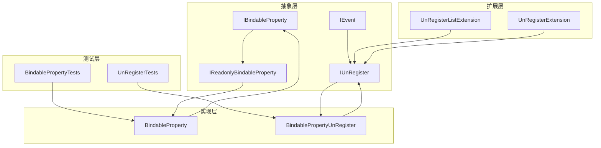
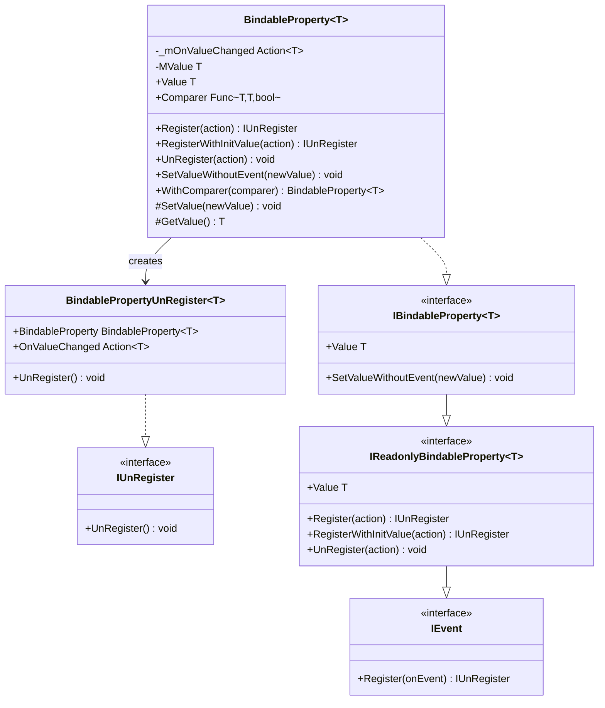
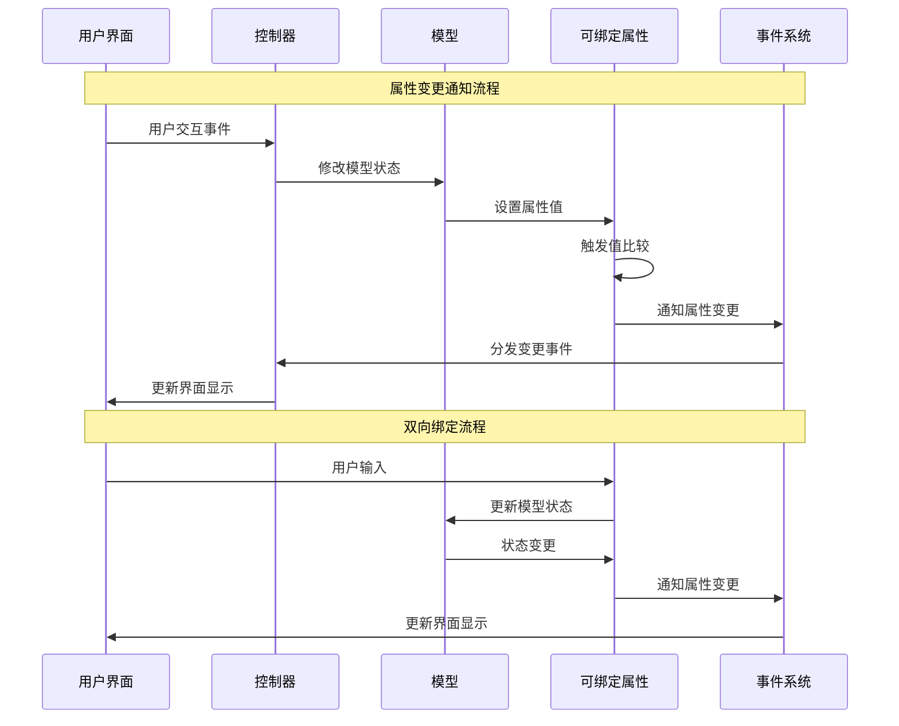
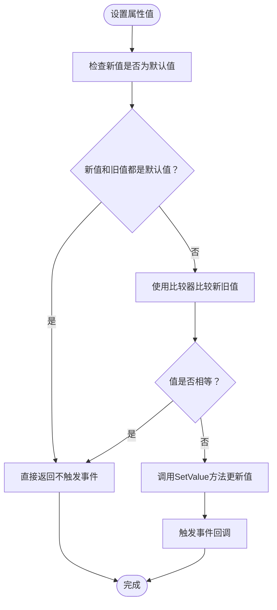
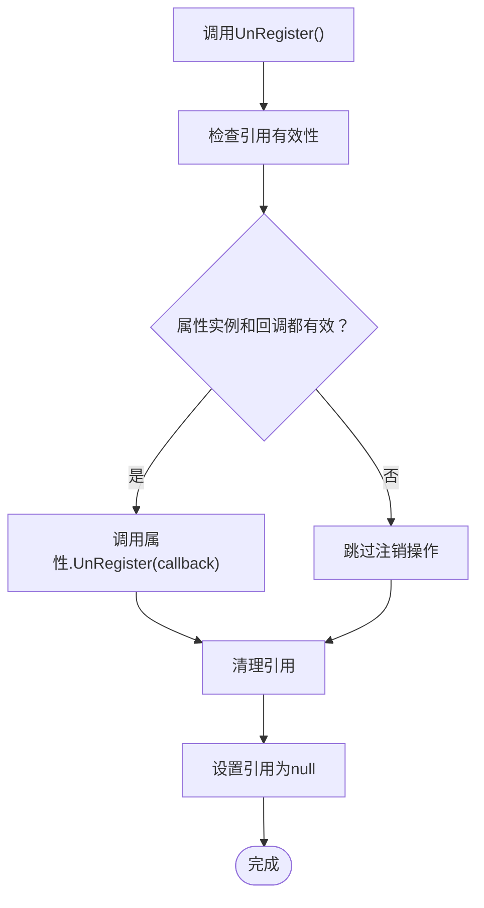
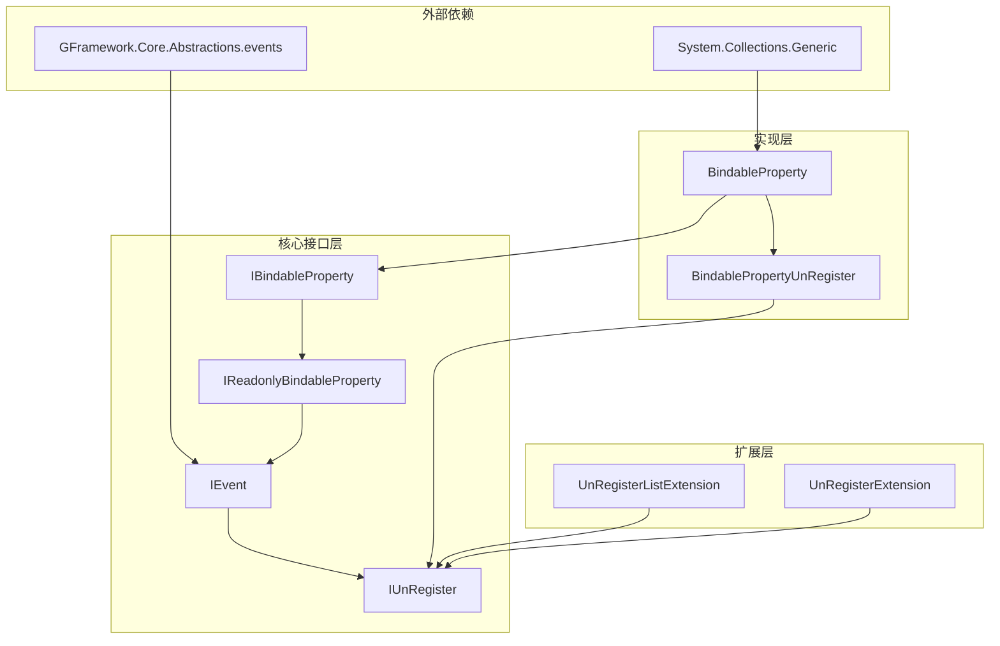

# 属性绑定接口

<cite>
**本文档引用的文件**
- [IBindableProperty.cs](file://GFramework.Core.Abstractions/property/IBindableProperty.cs)
- [IReadonlyBindableProperty.cs](file://GFramework.Core.Abstractions/property/IReadonlyBindableProperty.cs)
- [BindableProperty.cs](file://GFramework.Core/property/BindableProperty.cs)
- [BindablePropertyUnRegister.cs](file://GFramework.Core/property/BindablePropertyUnRegister.cs)
- [IUnRegister.cs](file://GFramework.Core.Abstractions/events/IUnRegister.cs)
- [IEvent.cs](file://GFramework.Core.Abstractions/events/IEvent.cs)
- [UnRegisterListExtension.cs](file://GFramework.Core/extensions/UnRegisterListExtension.cs)
- [UnRegisterExtension.cs](file://GFramework.Godot/extensions/UnRegisterExtension.cs)
- [BindablePropertyTests.cs](file://GFramework.Core.Tests/property/BindablePropertyTests.cs)
- [UnRegisterTests.cs](file://GFramework.Core.Tests/events/UnRegisterTests.cs)
- [README.md](file://GFramework.Core/property/README.md)
</cite>

## 目录
1. [简介](#简介)
2. [项目结构](#项目结构)
3. [核心组件](#核心组件)
4. [架构概览](#架构概览)
5. [详细组件分析](#详细组件分析)
6. [依赖关系分析](#依赖关系分析)
7. [性能考虑](#性能考虑)
8. [故障排除指南](#故障排除指南)
9. [结论](#结论)
10. [附录](#附录)

## 简介

GFramework属性绑定接口是实现数据绑定和响应式编程的核心组件。它提供了可绑定属性的完整解决方案，支持属性变更通知、双向绑定、属性验证、值转换、绑定生命周期管理等功能。该接口体系采用MVVM模式设计，为用户界面开发提供了强大的数据绑定能力。

属性绑定接口主要包含以下核心概念：
- **可绑定属性接口**：提供可读写的属性绑定功能
- **只读可绑定属性接口**：提供属性值的读取和变更监听功能
- **属性实现类**：完整的可绑定属性实现
- **注销机制**：完善的生命周期管理

## 项目结构

属性绑定相关的代码分布在以下目录中：

**图表来源**
- [IBindableProperty.cs](file://GFramework.Core.Abstractions/property/IBindableProperty.cs#L1-L19)
- [IReadonlyBindableProperty.cs](file://GFramework.Core.Abstractions/property/IReadonlyBindableProperty.cs#L1-L36)
- [BindableProperty.cs](file://GFramework.Core/property/BindableProperty.cs#L1-L135)

**章节来源**
- [IBindableProperty.cs](file://GFramework.Core.Abstractions/property/IBindableProperty.cs#L1-L19)
- [IReadonlyBindableProperty.cs](file://GFramework.Core.Abstractions/property/IReadonlyBindableProperty.cs#L1-L36)

## 核心组件

### 接口层次结构

属性绑定接口采用清晰的层次设计：

**图表来源**
- [IBindableProperty.cs](file://GFramework.Core.Abstractions/property/IBindableProperty.cs#L1-L19)
- [IReadonlyBindableProperty.cs](file://GFramework.Core.Abstractions/property/IReadonlyBindableProperty.cs#L1-L36)
- [BindableProperty.cs](file://GFramework.Core/property/BindableProperty.cs#L1-L135)
- [BindablePropertyUnRegister.cs](file://GFramework.Core/property/BindablePropertyUnRegister.cs#L1-L39)

### 核心接口定义

#### IReadonlyBindableProperty<T> 接口
只读可绑定属性接口，提供属性值的读取和变更监听功能：

**关键成员：**
- `Value`: 获取属性的当前值
- `Register(action)`: 注册属性值变更回调
- `RegisterWithInitValue(action)`: 注册监听并立即执行一次初始值回调
- `UnRegister(action)`: 取消注册属性值变更回调

#### IBindableProperty<T> 接口
可绑定属性接口，继承自只读接口，增加了修改能力：

**关键成员：**
- `Value`: 可读写的属性值
- `SetValueWithoutEvent(newValue)`: 设置属性值但不触发事件通知

**章节来源**
- [IReadonlyBindableProperty.cs](file://GFramework.Core.Abstractions/property/IReadonlyBindableProperty.cs#L1-L36)
- [IBindableProperty.cs](file://GFramework.Core.Abstractions/property/IBindableProperty.cs#L1-L19)

## 架构概览

属性绑定系统的整体架构采用分层设计，确保了良好的可扩展性和可维护性：

**图表来源**
- [BindableProperty.cs](file://GFramework.Core/property/BindableProperty.cs#L24-L41)
- [IEvent.cs](file://GFramework.Core.Abstractions/events/IEvent.cs#L1-L16)

## 详细组件分析

### BindableProperty<T> 实现类

BindableProperty<T> 是属性绑定系统的核心实现类，提供了完整的属性绑定功能：

#### 核心功能特性

**值变更检测机制：**
- 使用 `EqualityComparer<T>.Default.Equals()` 进行精确比较
- 支持自定义比较器配置
- 避免不必要的事件触发

**事件处理系统：**
- 支持多处理器注册
- 提供立即触发和延迟触发两种模式
- 完善的事件生命周期管理

**值设置策略：**
- 标准设置：触发事件通知
- 无事件设置：直接更新值不触发事件
- 自定义比较器：控制值相等判断逻辑

#### 关键实现细节

**图表来源**
- [BindableProperty.cs](file://GFramework.Core/property/BindableProperty.cs#L28-L40)

#### 注册机制实现

**标准注册流程：**
1. 注册事件处理器到内部委托链
2. 返回 BindablePropertyUnRegister 实例
3. 支持后续注销操作

**带初始值注册：**
1. 立即调用回调函数传递当前值
2. 然后按标准流程注册处理器
3. 适用于UI绑定场景

**章节来源**
- [BindableProperty.cs](file://GFramework.Core/property/BindableProperty.cs#L1-L135)

### BindablePropertyUnRegister<T> 注销机制

BindablePropertyUnRegister<T> 提供了完整的属性绑定生命周期管理：

#### 注销流程设计

**图表来源**
- [BindablePropertyUnRegister.cs](file://GFramework.Core/property/BindablePropertyUnRegister.cs#L27-L38)

#### 安全性保障

- **空引用检查**：防止空引用异常
- **引用清理**：确保内存安全
- **幂等性**：支持重复调用

**章节来源**
- [BindablePropertyUnRegister.cs](file://GFramework.Core/property/BindablePropertyUnRegister.cs#L1-L39)

### 扩展方法支持

属性绑定系统提供了丰富的扩展方法来简化常用操作：

#### UnRegisterList 扩展

**批量管理功能：**
- `AddToUnregisterList(unRegisterList)`: 将可注销对象添加到列表
- `UnRegisterAll()`: 批量注销所有对象并清空列表

**使用场景：**
- 复杂控制器的批量资源管理
- 场景切换时的统一清理
- 多个属性绑定的集中管理

#### Godot 集成扩展

**节点生命周期集成：**
- `UnRegisterWhenNodeExitTree(node)`: 节点退出场景树时自动注销
- 自动内存管理和资源清理

**章节来源**
- [UnRegisterListExtension.cs](file://GFramework.Core/extensions/UnRegisterListExtension.cs#L1-L32)
- [UnRegisterExtension.cs](file://GFramework.Godot/extensions/UnRegisterExtension.cs#L1-L23)

## 依赖关系分析

属性绑定系统的依赖关系体现了清晰的分层架构：

**图表来源**
- [BindableProperty.cs](file://GFramework.Core/property/BindableProperty.cs#L1-L2)
- [IReadonlyBindableProperty.cs](file://GFramework.Core.Abstractions/property/IReadonlyBindableProperty.cs#L1-L2)

### 组件耦合度分析

**低耦合设计：**
- 接口与实现分离，便于替换和测试
- 扩展方法独立存在，不影响核心功能
- 事件系统解耦，支持多种事件源

**内聚性评估：**
- 单一职责原则：每个类专注于特定功能
- 方法粒度适中：既不过于粗略也不过于细碎
- 接口设计合理：职责明确且易于理解

**潜在循环依赖：**
- 通过接口抽象避免了循环依赖
- 注销器仅持有弱引用，防止内存泄漏

**章节来源**
- [IEvent.cs](file://GFramework.Core.Abstractions/events/IEvent.cs#L1-L16)
- [IUnRegister.cs](file://GFramework.Core.Abstractions/events/IUnRegister.cs#L1-L12)

## 性能考虑

属性绑定系统在设计时充分考虑了性能优化：

### 值比较优化

**默认比较策略：**
- 使用 `EqualityComparer<T>.Default.Equals()` 进行高效比较
- 针对不同类型的优化实现
- 避免装箱拆箱操作

**自定义比较器优势：**
- 减少不必要的事件触发
- 支持浮点数精度控制
- 优化复杂对象的比较逻辑

### 内存管理

**引用清理机制：**
- 注销时自动清理引用，防止内存泄漏
- 支持弱引用模式
- 及时释放事件处理器

**批量操作优化：**
- `SetValueWithoutEvent` 支持批量更新
- 减少事件触发次数
- 提高批量操作性能

### 并发安全性

**线程安全考虑：**
- 事件回调的线程安全执行
- 值访问的原子性保证
- 避免竞态条件

## 故障排除指南

### 常见问题诊断

**问题1：事件未触发**
- 检查值是否真正发生变化
- 验证比较器设置是否正确
- 确认事件处理器已正确注册

**问题2：内存泄漏**
- 确保所有注册的处理器都被正确注销
- 使用 `UnRegisterList` 进行批量管理
- 检查是否存在循环引用

**问题3：性能问题**
- 评估事件触发频率
- 考虑使用 `SetValueWithoutEvent` 进行批量更新
- 优化自定义比较器逻辑

### 调试技巧

**单元测试验证：**
- 使用提供的测试用例验证基本功能
- 编写针对性的集成测试
- 监控内存使用情况

**日志记录：**
- 记录属性变更历史
- 监控事件处理器数量
- 跟踪注销操作执行情况

**章节来源**
- [BindablePropertyTests.cs](file://GFramework.Core.Tests/property/BindablePropertyTests.cs#L1-L186)
- [UnRegisterTests.cs](file://GFramework.Core.Tests/events/UnRegisterTests.cs#L1-L114)

## 结论

GFramework属性绑定接口提供了一个完整、高效、易用的数据绑定解决方案。其设计遵循了面向对象的最佳实践，具有以下显著优势：

**技术优势：**
- 清晰的接口层次设计
- 完善的生命周期管理
- 高效的性能表现
- 良好的扩展性

**应用场景：**
- MVVM模式的完美支持
- 用户界面数据绑定
- 状态管理系统
- 事件驱动架构

**最佳实践建议：**
- 在模型层使用可绑定属性
- 通过只读接口对外暴露
- 及时进行资源清理
- 使用适当的比较器策略

该接口体系为游戏开发和应用程序开发提供了强大的数据绑定能力，是构建现代、响应式用户界面的理想选择。

## 附录

### API 参考速查表

**IReadonlyBindableProperty<T> 关键方法：**
- `Value`: 获取当前值
- `Register(action)`: 注册变更监听
- `RegisterWithInitValue(action)`: 注册并立即触发
- `UnRegister(action)`: 取消注册

**IBindableProperty<T> 关键方法：**
- `Value`: 设置和获取值
- `SetValueWithoutEvent(newValue)`: 无事件设置

**BindableProperty<T> 特有功能：**
- `Comparer`: 自定义比较器
- `WithComparer(comparer)`: 设置比较器
- `ToString()`: 字符串表示

**注销相关：**
- `IUnRegister.UnRegister()`: 执行注销
- `UnRegisterListExtension`: 批量管理
- `UnRegisterExtension`: 节点生命周期集成

### 使用示例路径

**基础使用示例：**
- [基础属性绑定示例](file://GFramework.Core/property/README.md#L49-L69)

**高级功能示例：**
- [自定义比较器示例](file://GFramework.Core/property/README.md#L81-L87)

**MVVM 应用示例：**
- [UI 数据绑定示例](file://GFramework.Core/property/README.md#L135-L171)
- [双向绑定示例](file://GFramework.Core/property/README.md#L175-L202)

**性能优化示例：**
- [批量更新示例](file://GFramework.Core/property/README.md#L282-L294)
- [自定义比较器优化](file://GFramework.Core/property/README.md#L296-L302)