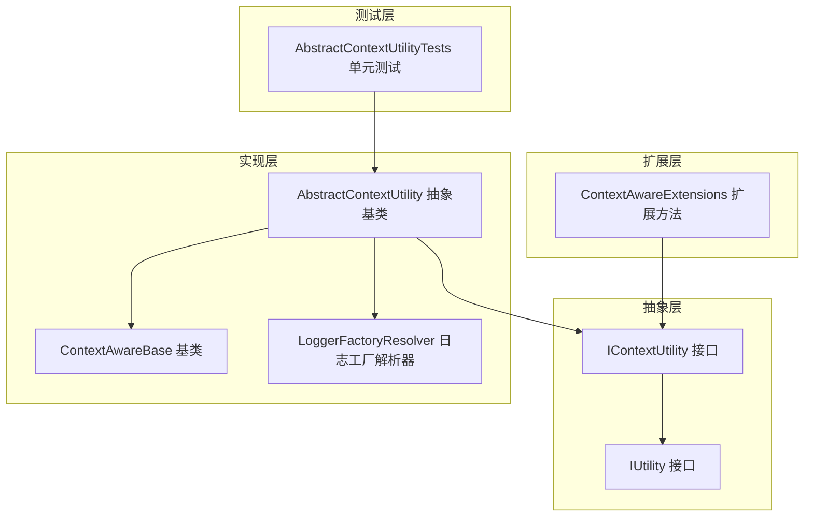
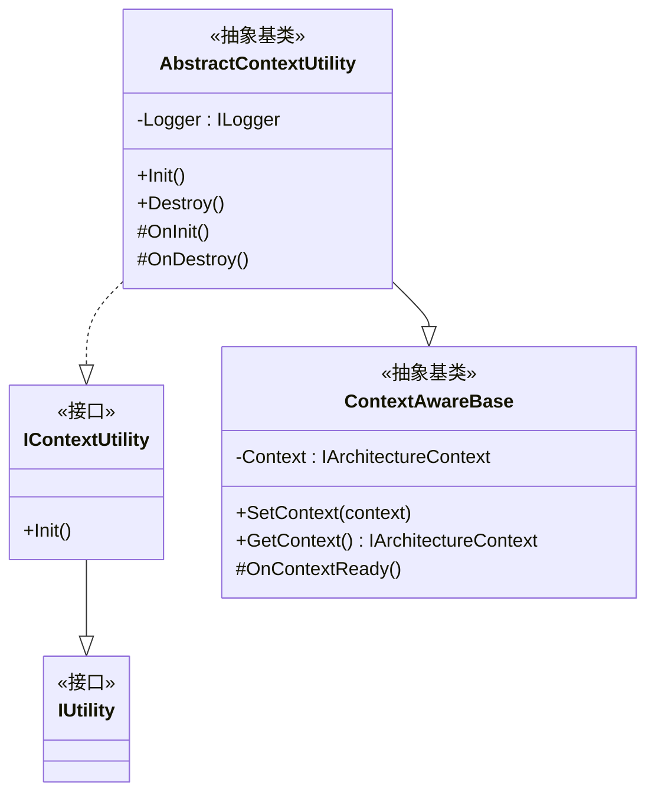
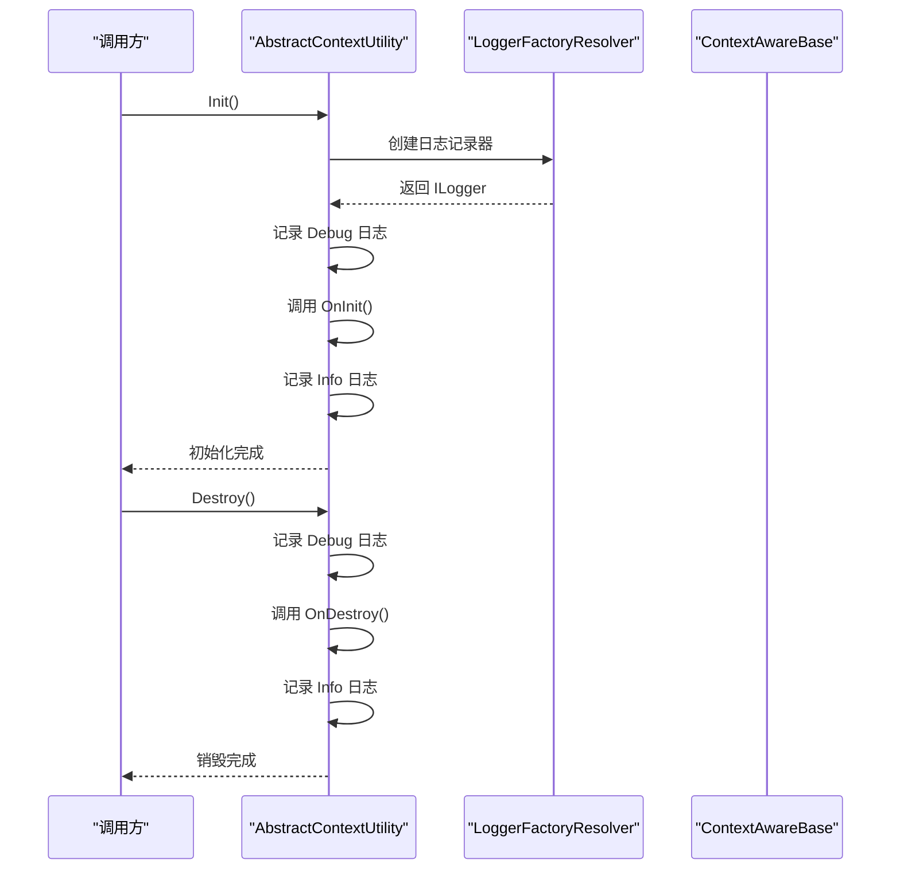
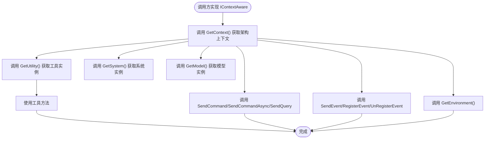
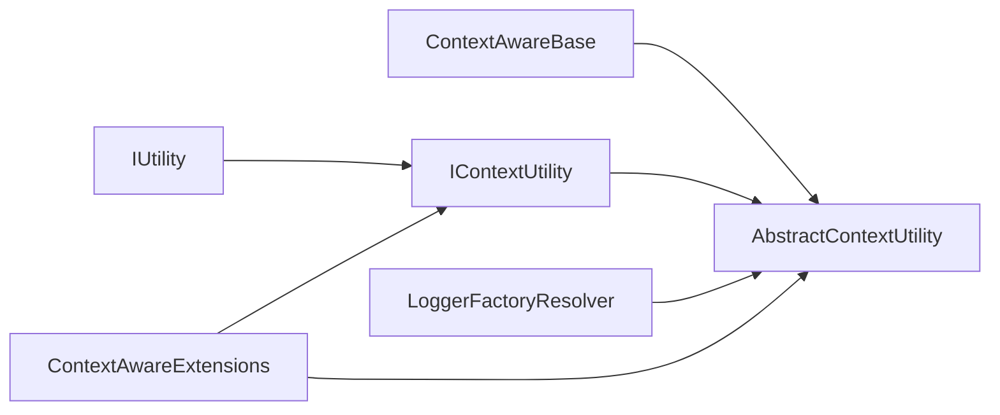

# 工具接口

<cite>
**本文引用的文件**
- [IContextUtility.cs](file://GFramework.Core.Abstractions/utility/IContextUtility.cs)
- [IUtility.cs](file://GFramework.Core.Abstractions/utility/IUtility.cs)
- [AbstractContextUtility.cs](file://GFramework.Core/utility/AbstractContextUtility.cs)
- [ContextAwareBase.cs](file://GFramework.Core/rule/ContextAwareBase.cs)
- [LoggerFactoryResolver.cs](file://GFramework.Core/logging/LoggerFactoryResolver.cs)
- [ContextAwareExtensions.cs](file://GFramework.Core/extensions/ContextAwareExtensions.cs)
- [AbstractContextUtilityTests.cs](file://GFramework.Core.Tests/utility/AbstractContextUtilityTests.cs)
- [README.md（Core Utility）](file://GFramework.Core/utility/README.md)
- [README.md（Abstractions）](file://GFramework.Core.Abstractions/README.md)
- [README.md（Core）](file://GFramework.Core/README.md)
</cite>

## 目录
1. [简介](#简介)
2. [项目结构](#项目结构)
3. [核心组件](#核心组件)
4. [架构概览](#架构概览)
5. [详细组件分析](#详细组件分析)
6. [依赖分析](#依赖分析)
7. [性能考虑](#性能考虑)
8. [故障排查指南](#故障排查指南)
9. [结论](#结论)
10. [附录](#附录)

## 简介
本文件为 GFramework 工具接口的详细 API 参考文档，聚焦于以下核心接口与基类：
- IUtility：通用工具接口，作为所有工具类的标记契约
- IContextUtility：上下文工具接口，具备上下文感知能力与生命周期管理
- AbstractContextUtility：抽象上下文工具基类，提供统一的初始化与销毁流程、日志记录与上下文接入能力

文档将从设计原则、职责划分、上下文感知能力、通用功能封装、扩展机制、使用场景与最佳实践等方面进行系统阐述，并给出架构中的角色定位与常见设计模式的应用。

## 项目结构
围绕工具接口与基类，相关代码分布在如下模块：
- 抽象层（GFramework.Core.Abstractions）：定义 IUtility、IContextUtility 等接口契约
- 实现层（GFramework.Core）：提供 AbstractContextUtility 抽象基类及其实现示例
- 扩展层（GFramework.Core.Extensions）：提供上下文感知扩展方法，便于在任意 IContextAware 对象上便捷获取工具
- 测试层（GFramework.Core.Tests）：验证工具生命周期、上下文接入与日志初始化等行为

图表来源
- [IContextUtility.cs](file://GFramework.Core.Abstractions/utility/IContextUtility.cs#L1-L10)
- [IUtility.cs](file://GFramework.Core.Abstractions/utility/IUtility.cs#L1-L7)
- [AbstractContextUtility.cs](file://GFramework.Core/utility/AbstractContextUtility.cs#L1-L55)
- [ContextAwareBase.cs](file://GFramework.Core/rule/ContextAwareBase.cs#L1-L43)
- [LoggerFactoryResolver.cs](file://GFramework.Core/logging/LoggerFactoryResolver.cs#L1-L26)
- [ContextAwareExtensions.cs](file://GFramework.Core/extensions/ContextAwareExtensions.cs#L1-L231)
- [AbstractContextUtilityTests.cs](file://GFramework.Core.Tests/utility/AbstractContextUtilityTests.cs#L1-L295)

章节来源
- [README.md（Core）](file://GFramework.Core/README.md#L1-L508)
- [README.md（Abstractions）](file://GFramework.Core.Abstractions/README.md#L1-L522)

## 核心组件
- IUtility：标记接口，作为所有工具类的契约根，不包含任何成员定义，用于标识“无状态、纯函数式”的工具能力
- IContextUtility：继承 IUtility，增加上下文感知能力与生命周期管理（Init/Destroy），适用于需要访问架构上下文或进行初始化/销毁的工具
- AbstractContextUtility：实现 IContextUtility，提供统一的初始化流程（创建日志记录器、调用 OnInit、记录日志）、销毁流程（调用 OnDestroy）、以及上下文接入能力（继承自 ContextAwareBase）

章节来源
- [IUtility.cs](file://GFramework.Core.Abstractions/utility/IUtility.cs#L1-L7)
- [IContextUtility.cs](file://GFramework.Core.Abstractions/utility/IContextUtility.cs#L1-L10)
- [AbstractContextUtility.cs](file://GFramework.Core/utility/AbstractContextUtility.cs#L1-L55)
- [ContextAwareBase.cs](file://GFramework.Core/rule/ContextAwareBase.cs#L1-L43)

## 架构概览
工具接口在 GFramework 架构中的定位与职责：
- 分层职责：Utility 层负责无状态的通用工具方法，System 层负责有状态的业务逻辑；二者通过上下文感知扩展方法进行协作
- 上下文接入：通过 ContextAwareBase 与 ContextAwareExtensions，任意实现 IContextAware 的组件均可便捷获取工具实例
- 生命周期：IContextUtility 定义了 Init/Destroy 生命周期，AbstractContextUtility 提供默认实现，便于工具类进行初始化与清理

图表来源
- [IContextUtility.cs](file://GFramework.Core.Abstractions/utility/IContextUtility.cs#L1-L10)
- [IUtility.cs](file://GFramework.Core.Abstractions/utility/IUtility.cs#L1-L7)
- [ContextAwareBase.cs](file://GFramework.Core/rule/ContextAwareBase.cs#L1-L43)
- [AbstractContextUtility.cs](file://GFramework.Core/utility/AbstractContextUtility.cs#L1-L55)

## 详细组件分析

### IUtility 接口
- 角色：工具类的标记接口，作为所有工具类的契约根
- 设计原则：无状态、纯函数式、可复用
- 使用场景：定义纯工具方法（如数学、字符串、随机、序列化等）
- 最佳实践：
  - 保持无状态，避免持有业务数据
  - 相同输入产生相同输出，便于测试
  - 单一职责，每个工具专注一类功能

章节来源
- [IUtility.cs](file://GFramework.Core.Abstractions/utility/IUtility.cs#L1-L7)
- [README.md（Core Utility）](file://GFramework.Core/utility/README.md#L10-L21)

### IContextUtility 接口
- 角色：具备上下文感知能力的工具接口，扩展 IUtility
- 关键能力：
  - Init：初始化上下文工具
  - 与 IContextAware、ILifecycle 的组合，形成上下文感知与生命周期管理
- 设计原则：在需要访问架构上下文或进行初始化/销毁时使用
- 使用场景：需要访问模型、系统、事件总线、环境等架构服务的工具

章节来源
- [IContextUtility.cs](file://GFramework.Core.Abstractions/utility/IContextUtility.cs#L1-L10)
- [README.md（Abstractions）](file://GFramework.Core.Abstractions/README.md#L347-L352)

### AbstractContextUtility 抽象基类
- 角色：提供上下文工具的通用实现
- 核心流程：
  - Init：创建日志记录器、记录 Debug/Info 日志、调用 OnInit、记录初始化完成
  - Destroy：记录 Debug/Info 日志、调用 OnDestroy
  - 上下文接入：继承自 ContextAwareBase，可通过 GetContext 获取架构上下文
- 设计原则：模板方法模式，子类仅需实现 OnInit/OnDestroy
- 最佳实践：
  - 在 OnInit 中进行一次性初始化（如缓存、订阅事件、获取服务）
  - 在 OnDestroy 中释放资源、取消订阅、清理缓存
  - 通过 ContextAwareExtensions 获取工具、系统、模型、事件总线等

图表来源
- [AbstractContextUtility.cs](file://GFramework.Core/utility/AbstractContextUtility.cs#L19-L42)
- [LoggerFactoryResolver.cs](file://GFramework.Core/logging/LoggerFactoryResolver.cs#L8-L26)
- [ContextAwareBase.cs](file://GFramework.Core/rule/ContextAwareBase.cs#L10-L43)

章节来源
- [AbstractContextUtility.cs](file://GFramework.Core/utility/AbstractContextUtility.cs#L1-L55)
- [LoggerFactoryResolver.cs](file://GFramework.Core/logging/LoggerFactoryResolver.cs#L1-L26)
- [ContextAwareBase.cs](file://GFramework.Core/rule/ContextAwareBase.cs#L1-L43)

### ContextAwareBase 基类
- 角色：为需要上下文感知的类提供基础实现
- 关键能力：
  - SetContext/GetContext：设置与获取架构上下文
  - OnContextReady：上下文就绪时的虚方法，子类可重写
- 设计原则：通过基类统一上下文接入，减少重复代码

章节来源
- [ContextAwareBase.cs](file://GFramework.Core/rule/ContextAwareBase.cs#L1-L43)

### ContextAwareExtensions 扩展方法
- 角色：为 IContextAware 对象提供便捷访问工具、系统、模型、事件总线、查询总线、命令总线、环境等的能力
- 关键方法：
  - GetUtility<TUtility>：获取工具实例
  - GetSystem/GetModel：获取系统/模型
  - SendCommand/SendCommandAsync/SendQuery：发送命令/异步命令/查询
  - SendEvent/RegisterEvent/UnRegisterEvent：发送事件与事件注册/注销
  - GetEnvironment：获取环境对象
- 设计原则：通过扩展方法简化跨层调用，降低耦合

图表来源
- [ContextAwareExtensions.cs](file://GFramework.Core/extensions/ContextAwareExtensions.cs#L15-L231)

章节来源
- [ContextAwareExtensions.cs](file://GFramework.Core/extensions/ContextAwareExtensions.cs#L1-L231)

### 测试验证（AbstractContextUtilityTests）
- 验证点：
  - 实现 IContextUtility 接口
  - Init 调用 OnInit 并设置 Logger
  - Destroy 调用 OnDestroy
  - 上下文感知 SetContext/GetContext
  - 生命周期完整性与多次初始化/销毁
- 设计原则：通过单元测试保障工具生命周期与上下文接入的正确性

章节来源
- [AbstractContextUtilityTests.cs](file://GFramework.Core.Tests/utility/AbstractContextUtilityTests.cs#L1-L295)

## 依赖分析
- 接口依赖：
  - IContextUtility 继承 IUtility，同时组合 IContextAware 与 ILifecycle
  - AbstractContextUtility 继承 ContextAwareBase 并实现 IContextUtility
- 运行时依赖：
  - 日志：通过 LoggerFactoryResolver.Provider 创建 ILogger
  - 上下文：通过 ContextAwareBase 提供的 SetContext/GetContext 访问架构上下文
  - 扩展：通过 ContextAwareExtensions 提供的 GetUtility 等方法访问工具

图表来源
- [IContextUtility.cs](file://GFramework.Core.Abstractions/utility/IContextUtility.cs#L1-L10)
- [IUtility.cs](file://GFramework.Core.Abstractions/utility/IUtility.cs#L1-L7)
- [AbstractContextUtility.cs](file://GFramework.Core/utility/AbstractContextUtility.cs#L1-L55)
- [ContextAwareBase.cs](file://GFramework.Core/rule/ContextAwareBase.cs#L1-L43)
- [LoggerFactoryResolver.cs](file://GFramework.Core/logging/LoggerFactoryResolver.cs#L1-L26)
- [ContextAwareExtensions.cs](file://GFramework.Core/extensions/ContextAwareExtensions.cs#L1-L231)

章节来源
- [README.md（Abstractions）](file://GFramework.Core.Abstractions/README.md#L353-L395)

## 性能考虑
- 无状态与纯函数：IUtility 工具应保持无状态与纯函数特性，便于缓存与并发安全
- 对象复用与缓存：
  - 对于昂贵计算，可在工具内部维护缓存（如路径查找缓存）
  - 复用临时集合，避免频繁分配
- 日志开销：合理设置日志级别，避免在热路径中产生过多日志
- 生命周期管理：在 AbstractContextUtility 的 OnInit/OnDestroy 中进行一次性初始化与资源回收，避免重复开销

章节来源
- [README.md（Core Utility）](file://GFramework.Core/utility/README.md#L542-L605)

## 故障排查指南
- 工具未初始化：确认已调用 Init，且 OnInit 中未抛出异常
- 上下文为空：确认已通过 SetContext 设置架构上下文，或使用 ContextAwareExtensions 的 GetContext 获取
- 日志未输出：检查 LoggerFactoryResolver.Provider 是否正确设置，以及日志级别配置
- 生命周期异常：确保在 Destroy 中释放资源并在后续生命周期中重新初始化时正确重建

章节来源
- [AbstractContextUtility.cs](file://GFramework.Core/utility/AbstractContextUtility.cs#L19-L42)
- [LoggerFactoryResolver.cs](file://GFramework.Core/logging/LoggerFactoryResolver.cs#L8-L26)
- [ContextAwareExtensions.cs](file://GFramework.Core/extensions/ContextAwareExtensions.cs#L21-L35)

## 结论
- IUtility/IContextUtility/IContextUtility 形成了清晰的工具类契约与实现层次
- AbstractContextUtility 通过模板方法模式统一了工具类的生命周期与上下文接入
- ContextAwareExtensions 降低了跨层调用的复杂度，提升了工具类的可用性
- 在 GFramework 架构中，工具类承担无状态、可复用的通用能力，与系统层形成互补

## 附录
- 使用场景与最佳实践：
  - IUtility：数学、字符串、随机、序列化等纯工具方法
  - IContextUtility：需要访问架构上下文或进行初始化/销毁的工具
  - 工具复用策略：通过架构注册与 GetUtility 获取，避免硬编码依赖
  - 性能优化建议：缓存计算结果、对象复用、合理设置日志级别

章节来源
- [README.md（Core Utility）](file://GFramework.Core/utility/README.md#L446-L541)
- [README.md（Core）](file://GFramework.Core/README.md#L347-L445)