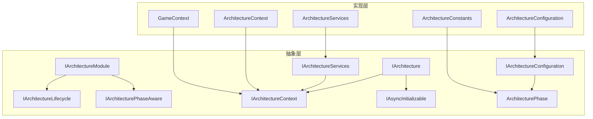
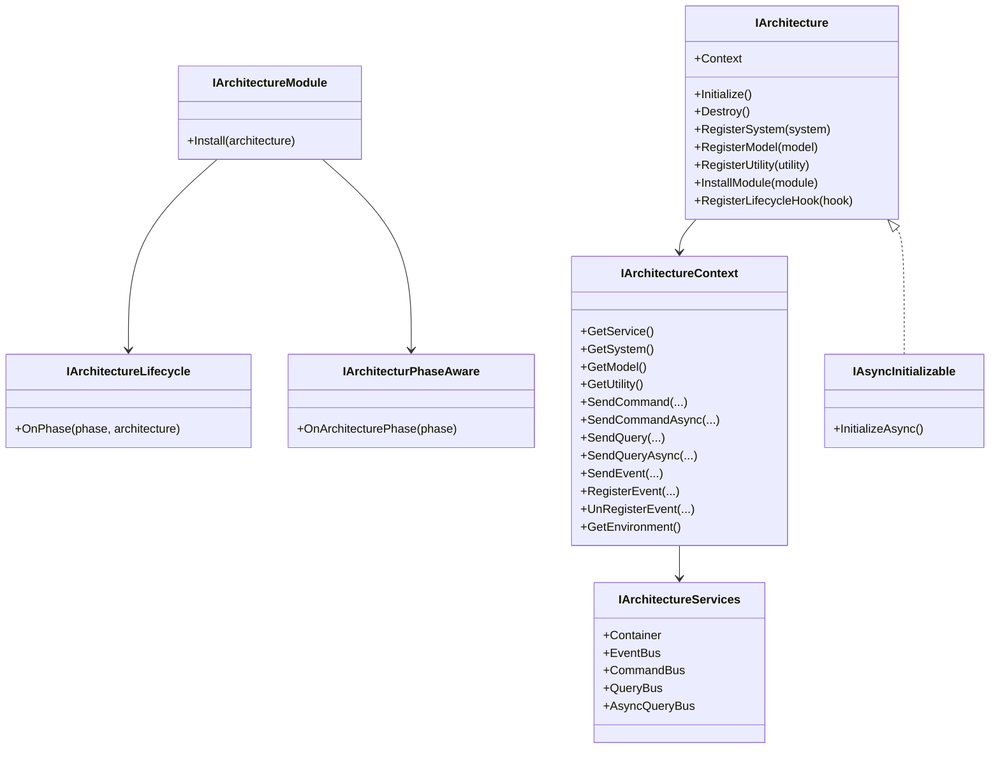
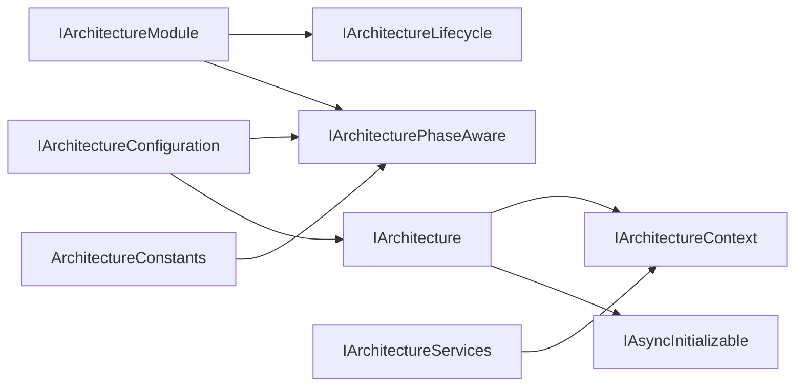
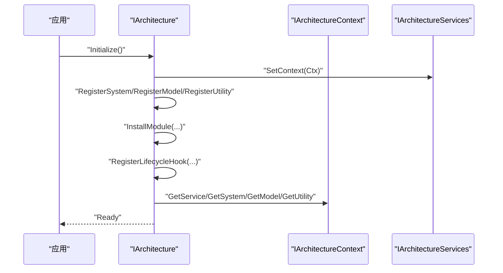
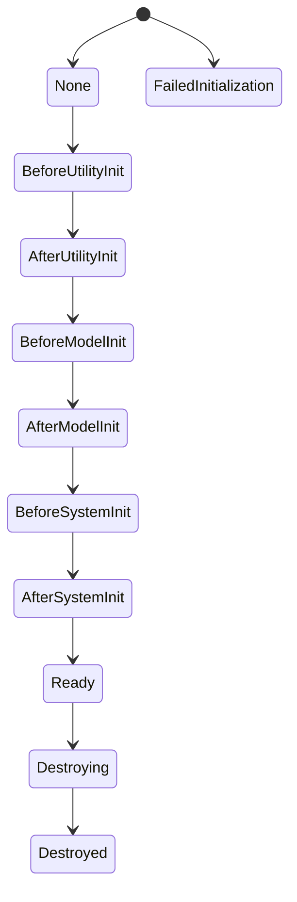

# 架构接口

<cite>
**本文引用的文件**
- [IArchitecture.cs](file://GFramework.Core.Abstractions/architecture/IArchitecture.cs)
- [IArchitectureModule.cs](file://GFramework.Core.Abstractions/architecture/IArchitectureModule.cs)
- [IArchitectureLifecycle.cs](file://GFramework.Core.Abstractions/architecture/IArchitectureLifecycle.cs)
- [IArchitecturePhaseAware.cs](file://GFramework.Core.Abstractions/architecture/IArchitecturePhaseAware.cs)
- [IArchitectureConfiguration.cs](file://GFramework.Core.Abstractions/architecture/IArchitectureConfiguration.cs)
- [IArchitectureContext.cs](file://GFramework.Core.Abstractions/architecture/IArchitectureContext.cs)
- [IArchitectureServices.cs](file://GFramework.Core.Abstractions/architecture/IArchitectureServices.cs)
- [IAsyncInitializable.cs](file://GFramework.Core.Abstractions/architecture/IAsyncInitializable.cs)
- [ArchitectureConstants.cs](file://GFramework.Core/architecture/ArchitectureConstants.cs)
- [ArchitectureConfiguration.cs](file://GFramework.Core/architecture/ArchitectureConfiguration.cs)
- [ArchitectureContext.cs](file://GFramework.Core/architecture/ArchitectureContext.cs)
- [ArchitectureServices.cs](file://GFramework.Core/architecture/ArchitectureServices.cs)
- [GameContext.cs](file://GFramework.Core/architecture/GameContext.cs)
- [ArchitecturePhase.cs](file://GFramework.Core.Abstractions/enums/ArchitecturePhase.cs)
- [TestArchitectureBase.cs](file://GFramework.Core.Tests/architecture/TestArchitectureBase.cs)
- [SyncTestArchitecture.cs](file://GFramework.Core.Tests/architecture/SyncTestArchitecture.cs)
- [AsyncTestArchitecture.cs](file://GFramework.Core.Tests/architecture/AsyncTestArchitecture.cs)
</cite>

## 目录
1. [简介](#简介)
2. [项目结构](#项目结构)
3. [核心组件](#核心组件)
4. [架构总览](#架构总览)
5. [详细组件分析](#详细组件分析)
6. [依赖分析](#依赖分析)
7. [性能考量](#性能考量)
8. [故障排查指南](#故障排查指南)
9. [结论](#结论)
10. [附录](#附录)

## 简介
本文件为 GFramework 的架构接口 API 参考文档，聚焦于 IAchitecture 主接口、IArchitectureModule 模块接口、IArchitectureLifecycle 生命周期接口、IArchitecturePhaseAware 阶段感知接口等核心架构接口。文档覆盖架构初始化流程、模块安装与卸载机制、生命周期钩子方法、阶段切换处理、架构配置选项、上下文管理、服务注册机制，并提供扩展点、自定义模块开发与生命周期管理的最佳实践与性能建议。

## 项目结构
GFramework 将“抽象层”与“实现层”清晰分离：
- 抽象层（Abstractions）：定义架构接口、枚举、属性等契约，确保平台无关性与可替换性。
- 实现层（Core）：提供默认实现（如 ArchitectureContext、ArchitectureServices、ArchitectureConfiguration），并包含常量与上下文管理工具。

图表来源
- [IArchitecture.cs](file://GFramework.Core.Abstractions/architecture/IArchitecture.cs#L11-L68)
- [IArchitectureModule.cs](file://GFramework.Core.Abstractions/architecture/IArchitectureModule.cs#L7-L14)
- [IArchitectureLifecycle.cs](file://GFramework.Core.Abstractions/architecture/IArchitectureLifecycle.cs#L8-L16)
- [IArchitecturePhaseAware.cs](file://GFramework.Core.Abstractions/architecture/IArchitecturePhaseAware.cs#L8-L15)
- [IArchitectureConfiguration.cs](file://GFramework.Core.Abstractions/architecture/IArchitectureConfiguration.cs#L8-L19)
- [IArchitectureContext.cs](file://GFramework.Core.Abstractions/architecture/IArchitectureContext.cs#L16-L123)
- [IArchitectureServices.cs](file://GFramework.Core.Abstractions/architecture/IArchitectureServices.cs#L12-L40)
- [IAsyncInitializable.cs](file://GFramework.Core.Abstractions/architecture/IAsyncInitializable.cs#L8-L15)
- [ArchitectureConstants.cs](file://GFramework.Core/architecture/ArchitectureConstants.cs#L9-L54)
- [ArchitectureConfiguration.cs](file://GFramework.Core/architecture/ArchitectureConfiguration.cs#L12-L35)
- [ArchitectureContext.cs](file://GFramework.Core/architecture/ArchitectureContext.cs#L16-L225)
- [ArchitectureServices.cs](file://GFramework.Core/architecture/ArchitectureServices.cs#L17-L106)
- [GameContext.cs](file://GFramework.Core/architecture/GameContext.cs#L9-L111)
- [ArchitecturePhase.cs](file://GFramework.Core.Abstractions/enums/ArchitecturePhase.cs#L10-L66)

章节来源
- [IArchitecture.cs](file://GFramework.Core.Abstractions/architecture/IArchitecture.cs#L11-L68)
- [ArchitectureConstants.cs](file://GFramework.Core/architecture/ArchitectureConstants.cs#L9-L54)
- [ArchitectureConfiguration.cs](file://GFramework.Core/architecture/ArchitectureConfiguration.cs#L12-L35)
- [ArchitectureContext.cs](file://GFramework.Core/architecture/ArchitectureContext.cs#L16-L225)
- [ArchitectureServices.cs](file://GFramework.Core/architecture/ArchitectureServices.cs#L17-L106)
- [GameContext.cs](file://GFramework.Core/architecture/GameContext.cs#L9-L111)
- [ArchitecturePhase.cs](file://GFramework.Core.Abstractions/enums/ArchitecturePhase.cs#L10-L66)

## 核心组件
本节概述核心接口与职责边界，帮助快速定位 API 使用场景。

- IArchitecture：主架构接口，负责生命周期管理、系统/模型/工具注册、模块安装、生命周期钩子注册，继承异步初始化能力。
- IArchitectureModule：模块接口，统一模块安装到架构的标准入口，同时具备生命周期与阶段感知能力。
- IArchitectureLifecycle：生命周期钩子接口，按阶段回调通知。
- IArchitecturePhaseAware：阶段感知接口，接收架构阶段变更通知。
- IArchitectureConfiguration：架构配置接口，提供日志与架构选项配置。
- IArchitectureContext：架构上下文接口，统一访问服务、系统、模型、工具，以及命令/查询/事件总线。
- IArchitectureServices：架构服务接口，提供 IOC 容器、事件总线、命令/查询总线等核心服务。
- IAsyncInitializable：异步初始化接口，用于需要异步初始化的组件。
- ArchitecturePhase：架构阶段枚举，定义线性阶段序列与转换规则。

章节来源
- [IArchitecture.cs](file://GFramework.Core.Abstractions/architecture/IArchitecture.cs#L11-L68)
- [IArchitectureModule.cs](file://GFramework.Core.Abstractions/architecture/IArchitectureModule.cs#L7-L14)
- [IArchitectureLifecycle.cs](file://GFramework.Core.Abstractions/architecture/IArchitectureLifecycle.cs#L8-L16)
- [IArchitecturePhaseAware.cs](file://GFramework.Core.Abstractions/architecture/IArchitecturePhaseAware.cs#L8-L15)
- [IArchitectureConfiguration.cs](file://GFramework.Core.Abstractions/architecture/IArchitectureConfiguration.cs#L8-L19)
- [IArchitectureContext.cs](file://GFramework.Core.Abstractions/architecture/IArchitectureContext.cs#L16-L123)
- [IArchitectureServices.cs](file://GFramework.Core.Abstractions/architecture/IArchitectureServices.cs#L12-L40)
- [IAsyncInitializable.cs](file://GFramework.Core.Abstractions/architecture/IAsyncInitializable.cs#L8-L15)
- [ArchitecturePhase.cs](file://GFramework.Core.Abstractions/enums/ArchitecturePhase.cs#L10-L66)

## 架构总览
下图展示架构接口与实现之间的交互关系，以及初始化与阶段流转的关键路径。

图表来源
- [IArchitecture.cs](file://GFramework.Core.Abstractions/architecture/IArchitecture.cs#L11-L68)
- [IArchitectureModule.cs](file://GFramework.Core.Abstractions/architecture/IArchitectureModule.cs#L7-L14)
- [IArchitectureLifecycle.cs](file://GFramework.Core.Abstractions/architecture/IArchitectureLifecycle.cs#L8-L16)
- [IArchitecturePhaseAware.cs](file://GFramework.Core.Abstractions/architecture/IArchitecturePhaseAware.cs#L8-L15)
- [IArchitectureContext.cs](file://GFramework.Core.Abstractions/architecture/IArchitectureContext.cs#L16-L123)
- [IArchitectureServices.cs](file://GFramework.Core.Abstractions/architecture/IArchitectureServices.cs#L12-L40)
- [IAsyncInitializable.cs](file://GFramework.Core.Abstractions/architecture/IAsyncInitializable.cs#L8-L15)

## 详细组件分析

### IArchitecture 接口
- 职责
  - 生命周期管理：Initialize、Destroy。
  - 组件注册：RegisterSystem、RegisterModel、RegisterUtility。
  - 模块管理：InstallModule。
  - 生命周期钩子：RegisterLifecycleHook。
  - 上下文访问：Context 属性。
- 设计要点
  - 继承 IAsyncInitializable，支持异步初始化。
  - 通过 Context 统一访问系统、模型、工具与总线。
- 使用建议
  - 在 Initialize 中完成组件注册与依赖装配；在 Destroy 中释放资源。
  - 优先使用泛型注册方法以获得编译期约束。

章节来源
- [IArchitecture.cs](file://GFramework.Core.Abstractions/architecture/IArchitecture.cs#L11-L68)

### IArchitectureModule 接口
- 职责
  - Install：将模块安装到目标架构。
  - 生命周期与阶段感知：继承 IArchitectureLifecycle 与 IArchitecturePhaseAware。
- 设计要点
  - 模块化是扩展架构的主要方式，遵循“安装即生效”的约定。
- 最佳实践
  - 在 Install 中仅做必要注册，避免阻塞或副作用。
  - 通过阶段感知在合适时机执行初始化逻辑。

章节来源
- [IArchitectureModule.cs](file://GFramework.Core.Abstractions/architecture/IArchitectureModule.cs#L7-L14)

### IArchitectureLifecycle 与 IArchitecturePhaseAware
- IArchitectureLifecycle
  - OnPhase(phase, architecture)：在架构进入指定阶段时被调用。
- IArchitecturePhaseAware
  - OnArchitecturePhase(phase)：模块或组件在架构阶段变化时收到通知。
- 设计要点
  - 二者均基于 ArchitecturePhase 枚举，保证阶段语义一致。
- 使用建议
  - 在 OnPhase 中执行跨组件的协调逻辑；在 OnArchitecturePhase 中执行组件内部的阶段处理。

章节来源
- [IArchitectureLifecycle.cs](file://GFramework.Core.Abstractions/architecture/IArchitectureLifecycle.cs#L8-L16)
- [IArchitecturePhaseAware.cs](file://GFramework.Core.Abstractions/architecture/IArchitecturePhaseAware.cs#L8-L15)
- [ArchitecturePhase.cs](file://GFramework.Core.Abstractions/enums/ArchitecturePhase.cs#L10-L66)

### IArchitectureConfiguration
- 职责
  - LoggerProperties：日志工厂与最小日志级别等。
  - ArchitectureProperties：架构行为选项（如延迟注册策略、严格阶段校验）。
- 默认实现
  - ArchitectureConfiguration 提供默认日志与架构选项配置。
- 使用建议
  - 在应用启动时尽早设置配置，避免后续修改导致的行为不一致。

章节来源
- [IArchitectureConfiguration.cs](file://GFramework.Core.Abstractions/architecture/IArchitectureConfiguration.cs#L8-L19)
- [ArchitectureConfiguration.cs](file://GFramework.Core/architecture/ArchitectureConfiguration.cs#L12-L35)

### IArchitectureContext 与 ArchitectureContext
- IArchitectureContext
  - 统一服务获取：GetService、GetSystem、GetModel、GetUtility。
  - 通信总线：SendCommand/SendCommandAsync、SendQuery/SendQueryAsync、SendEvent/RegisterEvent/UnRegisterEvent。
  - 环境访问：GetEnvironment。
- ArchitectureContext
  - 基于 IOC 容器缓存服务实例，减少重复解析。
  - 对命令/查询/事件总线进行懒加载与空检查。
- 设计要点
  - 通过缓存提升服务获取性能；通过空检查保障健壮性。
- 使用建议
  - 优先使用 Context 获取组件，避免直接依赖具体实现。
  - 在缺失必要总线时，应明确抛出异常以便快速定位问题。

章节来源
- [IArchitectureContext.cs](file://GFramework.Core.Abstractions/architecture/IArchitectureContext.cs#L16-L123)
- [ArchitectureContext.cs](file://GFramework.Core/architecture/ArchitectureContext.cs#L16-L225)

### IArchitectureServices 与 ArchitectureServices
- IArchitectureServices
  - Container、EventBus、CommandBus、QueryBus、AsyncQueryBus。
- ArchitectureServices
  - 默认实现：创建并注册核心服务到 IOC 容器。
  - SetContext/GetContext：将上下文与容器关联。
- 设计要点
  - 服务集中注册，便于统一管理与替换。
- 使用建议
  - 在架构初始化早期完成服务注册，确保后续组件可正常解析。

章节来源
- [IArchitectureServices.cs](file://GFramework.Core.Abstractions/architecture/IArchitectureServices.cs#L12-L40)
- [ArchitectureServices.cs](file://GFramework.Core/architecture/ArchitectureServices.cs#L17-L106)

### IAsyncInitializable
- 职责
  - InitializeAsync：用于需要异步初始化的组件或服务。
- 设计要点
  - 与 IArchitecture 的同步 Initialize 协同，支持混合初始化策略。
- 使用建议
  - 异步初始化应避免长时间阻塞主线程，合理拆分任务。

章节来源
- [IAsyncInitializable.cs](file://GFramework.Core.Abstractions/architecture/IAsyncInitializable.cs#L8-L15)

### ArchitecturePhase 与 ArchitectureConstants
- ArchitecturePhase
  - 定义线性阶段序列：None → BeforeUtilityInit → AfterUtilityInit → BeforeModelInit → AfterModelInit → BeforeSystemInit → AfterSystemInit → Ready → Destroying → Destroyed。
  - 支持失败路径：FailedInitialization。
- ArchitectureConstants
  - PhaseOrder：阶段线性顺序。
  - PhaseTransitions：阶段间有效转换映射。
- 设计要点
  - 严格的线性状态机，保证初始化顺序与幂等性。
- 使用建议
  - 遵循阶段顺序，避免跳过或逆序转换。

章节来源
- [ArchitecturePhase.cs](file://GFramework.Core.Abstractions/enums/ArchitecturePhase.cs#L10-L66)
- [ArchitectureConstants.cs](file://GFramework.Core/architecture/ArchitectureConstants.cs#L9-L54)

### GameContext：多架构上下文管理
- 职责
  - 维护架构类型到上下文的并发字典映射。
  - 提供绑定、获取、尝试获取、解绑与清空等操作。
- 设计要点
  - 线程安全的并发字典，支持多架构场景。
- 使用建议
  - 在应用中区分不同架构类型，避免上下文冲突。

章节来源
- [GameContext.cs](file://GFramework.Core/architecture/GameContext.cs#L9-L111)

## 依赖分析
架构接口之间的依赖关系如下：

图表来源
- [IArchitecture.cs](file://GFramework.Core.Abstractions/architecture/IArchitecture.cs#L11-L68)
- [IArchitectureModule.cs](file://GFramework.Core.Abstractions/architecture/IArchitectureModule.cs#L7-L14)
- [IArchitectureLifecycle.cs](file://GFramework.Core.Abstractions/architecture/IArchitectureLifecycle.cs#L8-L16)
- [IArchitecturePhaseAware.cs](file://GFramework.Core.Abstractions/architecture/IArchitecturePhaseAware.cs#L8-L15)
- [IArchitectureConfiguration.cs](file://GFramework.Core.Abstractions/architecture/IArchitectureConfiguration.cs#L8-L19)
- [IArchitectureContext.cs](file://GFramework.Core.Abstractions/architecture/IArchitectureContext.cs#L16-L123)
- [IArchitectureServices.cs](file://GFramework.Core.Abstractions/architecture/IArchitectureServices.cs#L12-L40)
- [ArchitectureConstants.cs](file://GFramework.Core/architecture/ArchitectureConstants.cs#L9-L54)

## 性能考量
- 服务缓存
  - ArchitectureContext 对 IOC 解析结果进行缓存，减少重复解析开销。
- 懒加载
  - 命令/查询/事件总线按需解析，避免不必要的初始化。
- 并发安全
  - GameContext 使用并发字典，支持多架构并行场景。
- 阶段转换
  - 严格线性状态机减少分支判断与回溯成本。
- 建议
  - 避免在阶段回调中执行重任务；将耗时操作异步化或分帧处理。

[本节为通用指导，无需特定文件引用]

## 故障排查指南
- 缺少总线或环境
  - 现象：调用 Context 的命令/查询/事件相关方法时报错。
  - 原因：对应总线未注册或环境未提供。
  - 处理：在架构初始化阶段确保注册必要服务；检查 ArchitectureServices 的注册流程。
- 阶段转换异常
  - 现象：阶段跳转不符合预期。
  - 原因：违反线性状态机规则或未正确触发阶段推进。
  - 处理：核对 ArchitectureConstants 的转换映射；确认阶段推进逻辑。
- 多架构上下文冲突
  - 现象：获取上下文时抛出“已存在/未找到”异常。
  - 原因：重复绑定或类型不匹配。
  - 处理：使用 GameContext 的 TryGet 或明确的类型键进行绑定与获取。

章节来源
- [ArchitectureContext.cs](file://GFramework.Core/architecture/ArchitectureContext.cs#L51-L71)
- [ArchitectureContext.cs](file://GFramework.Core/architecture/ArchitectureContext.cs#L115-L160)
- [ArchitectureContext.cs](file://GFramework.Core/architecture/ArchitectureContext.cs#L166-L212)
- [ArchitectureContext.cs](file://GFramework.Core/architecture/ArchitectureContext.cs#L218-L222)
- [ArchitectureConstants.cs](file://GFramework.Core/architecture/ArchitectureConstants.cs#L38-L54)
- [GameContext.cs](file://GFramework.Core/architecture/GameContext.cs#L27-L32)
- [GameContext.cs](file://GFramework.Core/architecture/GameContext.cs#L49-L57)
- [GameContext.cs](file://GFramework.Core/architecture/GameContext.cs#L66-L73)
- [GameContext.cs](file://GFramework.Core/architecture/GameContext.cs#L81-L92)

## 结论
GFramework 的架构接口通过清晰的契约与默认实现，提供了可扩展、可维护且高性能的架构基础。IArchitecture 作为主入口，结合模块化、生命周期钩子与阶段感知机制，能够支撑复杂游戏项目的演进需求。建议在实际项目中遵循阶段线性规则、善用上下文与服务注册、合理拆分异步初始化任务，并通过测试架构基类验证生命周期与事件链路。

[本节为总结性内容，无需特定文件引用]

## 附录

### 架构初始化流程（序列图）

图表来源
- [IArchitecture.cs](file://GFramework.Core.Abstractions/architecture/IArchitecture.cs#L24-L68)
- [IArchitectureContext.cs](file://GFramework.Core.Abstractions/architecture/IArchitectureContext.cs#L26-L41)
- [IArchitectureServices.cs](file://GFramework.Core.Abstractions/architecture/IArchitectureServices.cs#L92-L96)

### 阶段切换流程（状态图）

图表来源
- [ArchitectureConstants.cs](file://GFramework.Core/architecture/ArchitectureConstants.cs#L17-L53)
- [ArchitecturePhase.cs](file://GFramework.Core.Abstractions/enums/ArchitecturePhase.cs#L10-L66)

### 自定义模块开发示例（步骤说明）
- 实现 IArchitectureModule
  - 在 Install 中注册系统/模型/工具，或订阅事件。
- 在架构中安装模块
  - 调用 IArchitecture.InstallModule(module) 完成安装。
- 阶段感知与生命周期钩子
  - 若需要在阶段变化时执行逻辑，实现 IArchitecturePhaseAware 或 IArchitectureLifecycle 并注册到架构。

章节来源
- [IArchitectureModule.cs](file://GFramework.Core.Abstractions/architecture/IArchitectureModule.cs#L7-L14)
- [IArchitecture.cs](file://GFramework.Core.Abstractions/architecture/IArchitecture.cs#L60-L67)
- [IArchitectureLifecycle.cs](file://GFramework.Core.Abstractions/architecture/IArchitectureLifecycle.cs#L8-L16)
- [IArchitecturePhaseAware.cs](file://GFramework.Core.Abstractions/architecture/IArchitecturePhaseAware.cs#L8-L15)

### 生命周期管理与测试基类
- 测试架构基类 TestArchitectureBase
  - 提供阶段历史记录、就绪事件监听、注册后钩子等能力。
- 同步/异步测试架构
  - SyncTestArchitecture：注册同步模型与系统。
  - AsyncTestArchitecture：注册异步模型与系统。
- 使用建议
  - 借助测试基类验证阶段顺序与事件链路；在真实架构中复用相同模式。

章节来源
- [TestArchitectureBase.cs](file://GFramework.Core.Tests/architecture/TestArchitectureBase.cs#L10-L58)
- [SyncTestArchitecture.cs](file://GFramework.Core.Tests/architecture/SyncTestArchitecture.cs#L9-L20)
- [AsyncTestArchitecture.cs](file://GFramework.Core.Tests/architecture/AsyncTestArchitecture.cs#L9-L22)