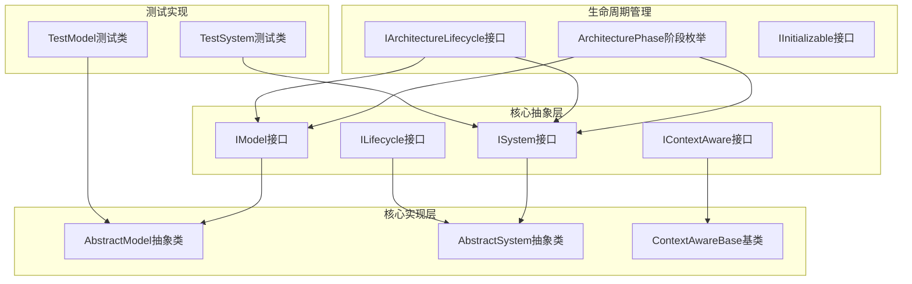
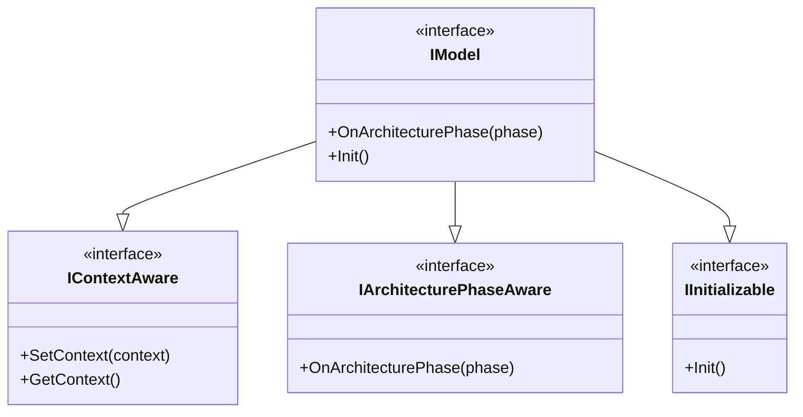
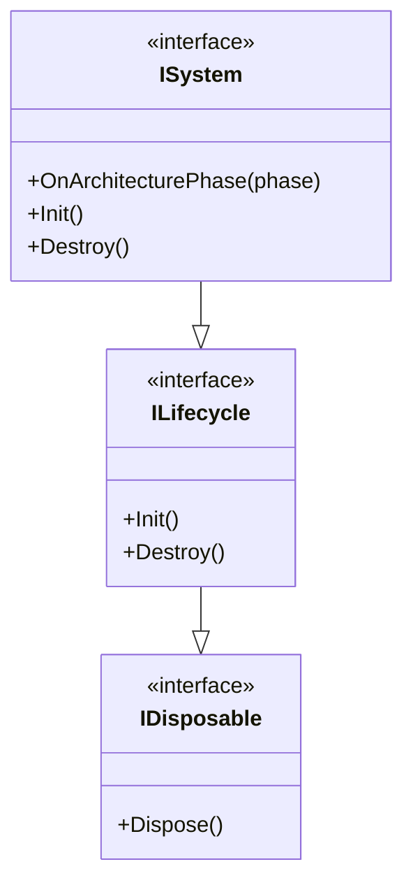
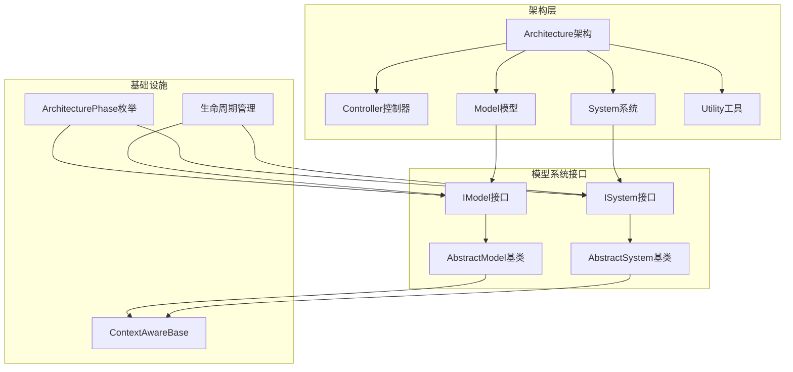
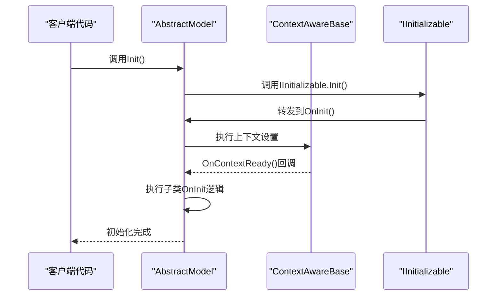
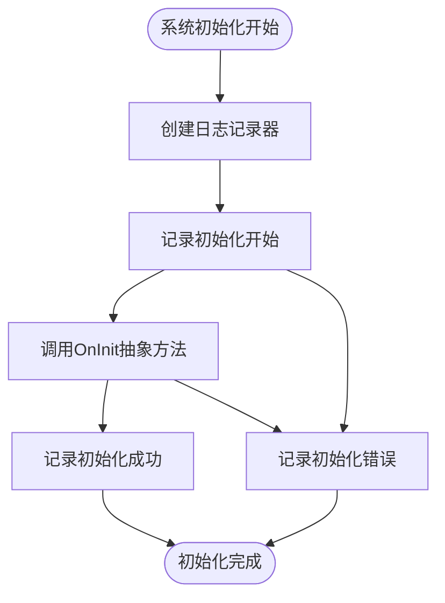
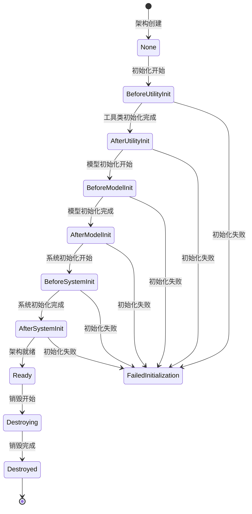
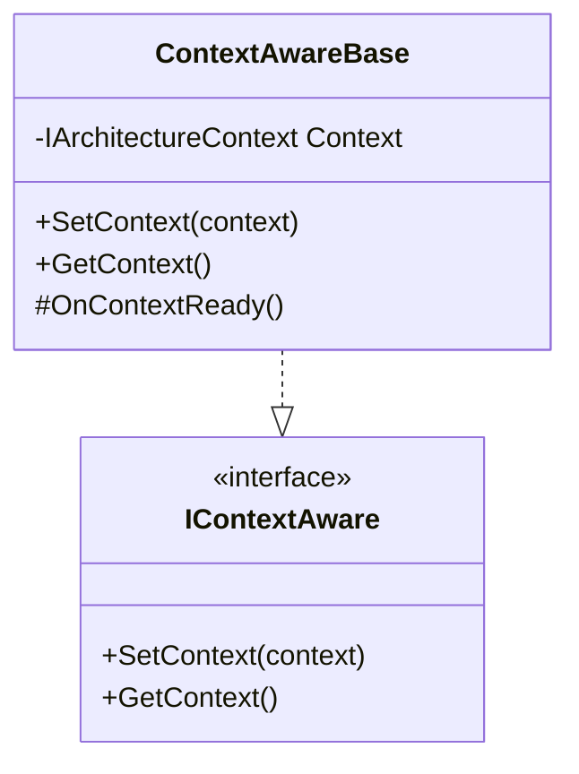
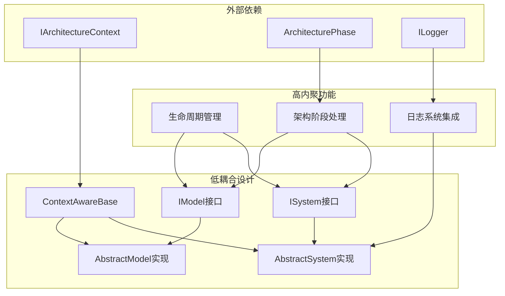

# 模型系统接口

<cite>
**本文档引用的文件**
- [IModel.cs](file://GFramework.Core.Abstractions/model/IModel.cs)
- [AbstractModel.cs](file://GFramework.Core/model/AbstractModel.cs)
- [ISystem.cs](file://GFramework.Core.Abstractions/system/ISystem.cs)
- [AbstractSystem.cs](file://GFramework.Core/system/AbstractSystem.cs)
- [ContextAwareBase.cs](file://GFramework.Core/rule/ContextAwareBase.cs)
- [ArchitecturePhase.cs](file://GFramework.Core.Abstractions/enums/ArchitecturePhase.cs)
- [IArchitectureLifecycle.cs](file://GFramework.Core.Abstractions/architecture/IArchitectureLifecycle.cs)
- [ILifecycle.cs](file://GFramework.Core.Abstractions/lifecycle/ILifecycle.cs)
- [IInitializable.cs](file://GFramework.Core.Abstractions/lifecycle/IInitializable.cs)
- [GFramework.Core README.md](file://GFramework.Core/README.md)
- [Logging README.md](file://GFramework.Core/logging/README.md)
- [TestModel.cs](file://GFramework.Core.Tests/model/TestModel.cs)
- [TestSystem.cs](file://GFramework.Core.Tests/system/TestSystem.cs)
</cite>

## 目录
1. [简介](#简介)
2. [项目结构](#项目结构)
3. [核心组件](#核心组件)
4. [架构概览](#架构概览)
5. [详细组件分析](#详细组件分析)
6. [依赖关系分析](#依赖关系分析)
7. [性能考虑](#性能考虑)
8. [故障排除指南](#故障排除指南)
9. [结论](#结论)
10. [附录](#附录)

## 简介

GFramework模型系统接口是游戏开发架构中的核心组件，负责定义和实现数据模型与业务系统的标准化接口。本文档深入分析IModel数据模型接口、ISystem业务系统接口、AbstractModel抽象模型基类、AbstractSystem抽象系统基类等核心组件，详细说明模型数据管理、系统业务逻辑、组件生命周期、状态管理、数据持久化等功能。

该框架采用CQRS、MVC和事件驱动的设计模式，提供清晰的分层架构，包括Model（数据层）、System（业务逻辑层）、Controller（控制层）、Utility（工具层）等组件，通过接口契约实现松耦合的组件通信。

## 项目结构

GFramework模型系统接口位于以下核心目录中：



**图表来源**
- [IModel.cs](file://GFramework.Core.Abstractions/model/IModel.cs#L1-L10)
- [ISystem.cs](file://GFramework.Core.Abstractions/system/ISystem.cs#L1-L11)
- [AbstractModel.cs](file://GFramework.Core/model/AbstractModel.cs#L1-L34)
- [AbstractSystem.cs](file://GFramework.Core/system/AbstractSystem.cs#L1-L62)

**章节来源**
- [GFramework.Core README.md](file://GFramework.Core/README.md#L1-L508)

## 核心组件

### IModel接口设计

IModel接口定义了数据模型的基本行为和功能，继承了三个核心接口：

- **IContextAware**：提供架构上下文感知能力
- **IArchitecturePhaseAware**：支持架构阶段事件处理
- **IInitializable**：实现组件初始化能力



**图表来源**
- [IModel.cs](file://GFramework.Core.Abstractions/model/IModel.cs#L1-L10)

### AbstractModel抽象基类

AbstractModel作为IModel接口的具体实现，提供了模型的基础架构支持：

- **初始化机制**：通过IInitializable接口实现标准初始化流程
- **上下文感知**：继承自ContextAwareBase基类，具备架构上下文访问能力
- **阶段处理**：提供可重写的架构阶段事件处理方法
- **抽象初始化**：定义子类必须实现的OnInit抽象方法

**章节来源**
- [AbstractModel.cs](file://GFramework.Core/model/AbstractModel.cs#L1-L34)

### ISystem接口设计

ISystem接口定义了业务系统的基本行为和功能：

- **多接口继承**：同时继承IContextAware、IArchitecturePhaseAware、ILifecycle接口
- **生命周期管理**：提供完整的初始化和销毁能力
- **上下文集成**：支持架构上下文的获取和设置



**图表来源**
- [ISystem.cs](file://GFramework.Core.Abstractions/system/ISystem.cs#L1-L11)

### AbstractSystem抽象基类

AbstractSystem提供了系统接口的完整实现，包含以下核心功能：

- **日志集成**：内置ILogger支持，提供详细的系统生命周期日志
- **初始化流程**：标准的Init方法实现，包含日志记录和抽象初始化调用
- **销毁流程**：完整的Destroy方法实现，确保资源正确清理
- **上下文管理**：继承ContextAwareBase基类，支持架构上下文访问

**章节来源**
- [AbstractSystem.cs](file://GFramework.Core/system/AbstractSystem.cs#L1-L62)

## 架构概览

GFramework模型系统接口在整个架构中扮演着关键角色，负责数据层和业务逻辑层的标准化：



**图表来源**
- [GFramework.Core README.md](file://GFramework.Core/README.md#L73-L108)
- [ContextAwareBase.cs](file://GFramework.Core/rule/ContextAwareBase.cs#L1-L43)

## 详细组件分析

### 模型数据管理

#### IModel接口分析

IModel接口的设计体现了游戏开发中对数据模型的严格要求：

**接口职责分离**
- **数据存储**：专注于游戏状态的存储和管理
- **上下文感知**：能够感知和响应架构上下文的变化
- **生命周期管理**：支持组件的初始化和清理

**架构阶段集成**
- 通过IArchitecturePhaseAware接口，模型能够响应架构的不同阶段
- 支持在初始化前后进行特定的数据处理逻辑

**章节来源**
- [IModel.cs](file://GFramework.Core.Abstractions/model/IModel.cs#L1-L10)

#### AbstractModel实现分析

AbstractModel提供了模型的基础实现框架：

**初始化流程**


**图表来源**
- [AbstractModel.cs](file://GFramework.Core/model/AbstractModel.cs#L16-L19)

**架构阶段处理**
- 提供可重写的OnArchitecturePhase方法
- 支持在不同架构阶段执行特定的模型逻辑
- 便于实现数据预加载、后处理等场景

**章节来源**
- [AbstractModel.cs](file://GFramework.Core/model/AbstractModel.cs#L25-L34)

### 系统业务逻辑

#### ISystem接口设计原则

ISystem接口体现了业务系统的核心设计原则：

**生命周期完整性**
- 继承ILifecycle接口，确保完整的生命周期管理
- 支持初始化和销毁的标准化流程
- 便于资源的正确分配和回收

**上下文集成**
- 通过IContextAware接口集成架构上下文
- 支持跨组件的通信和协作
- 提供统一的依赖注入机制

**架构感知**
- 实现IArchitecturePhaseAware接口
- 能够响应架构状态变化
- 支持阶段化的业务逻辑执行

**章节来源**
- [ISystem.cs](file://GFramework.Core.Abstractions/system/ISystem.cs#L1-L11)

#### AbstractSystem实现详解

AbstractSystem提供了系统的基础实现框架：

**日志系统集成**
- 内置ILogger支持，提供详细的系统生命周期日志
- 自动记录初始化和销毁过程
- 支持不同级别的日志输出

**初始化流程**


**图表来源**
- [AbstractSystem.cs](file://GFramework.Core/system/AbstractSystem.cs#L20-L29)

**销毁流程**
- 提供可重写的OnDestroy虚方法
- 确保资源的正确清理和释放
- 支持子类的自定义销毁逻辑

**章节来源**
- [AbstractSystem.cs](file://GFramework.Core/system/AbstractSystem.cs#L34-L62)

### 组件生命周期管理

#### ArchitecturePhase阶段枚举

架构阶段枚举定义了系统架构的完整生命周期：

**初始化阶段序列**
- **None**：初始状态，表示未定义的阶段
- **BeforeUtilityInit**：工具类初始化之前
- **AfterUtilityInit**：工具类初始化之后
- **BeforeModelInit**：模型初始化之前
- **AfterModelInit**：模型初始化之后
- **BeforeSystemInit**：系统初始化之前
- **AfterSystemInit**：系统初始化之后
- **Ready**：就绪阶段，完成冻结和事件处理后的最终状态

**销毁阶段序列**
- **Destroying**：正在销毁中（暂不使用）
- **Destroyed**：已销毁（暂不使用）
- **FailedInitialization**：初始化失败（暂不使用）

**章节来源**
- [ArchitecturePhase.cs](file://GFramework.Core.Abstractions/enums/ArchitecturePhase.cs#L1-L66)

#### 生命周期管理机制



**图表来源**
- [ArchitecturePhase.cs](file://GFramework.Core.Abstractions/enums/ArchitecturePhase.cs#L10-L66)

### 组件间通信

#### 上下文感知机制

ContextAwareBase基类提供了统一的上下文感知能力：

**上下文管理**
- 提供SetContext和GetContext方法
- 自动处理架构上下文的获取和设置
- 支持延迟初始化和上下文准备就绪回调

**接口实现**


**图表来源**
- [ContextAwareBase.cs](file://GFramework.Core/rule/ContextAwareBase.cs#L10-L43)

**章节来源**
- [ContextAwareBase.cs](file://GFramework.Core/rule/ContextAwareBase.cs#L1-L43)

## 依赖关系分析

### 组件耦合度分析



**图表来源**
- [IModel.cs](file://GFramework.Core.Abstractions/model/IModel.cs#L1-L10)
- [ISystem.cs](file://GFramework.Core.Abstractions/system/ISystem.cs#L1-L11)
- [ContextAwareBase.cs](file://GFramework.Core/rule/ContextAwareBase.cs#L1-L43)

### 依赖注入模式

框架采用依赖注入模式实现组件间的松耦合：

**接口隔离原则**
- 每个组件只依赖于抽象接口
- 通过IoC容器管理组件的创建和生命周期
- 支持组件的替换和扩展

**组合优于继承**
- 通过接口组合获得所需能力
- 避免复杂的继承层次结构
- 提高代码的灵活性和可维护性

**章节来源**
- [GFramework.Core README.md](file://GFramework.Core/README.md#L468-L481)

## 性能考虑

### 生命周期优化策略

**初始化性能优化**
- 使用单例模式管理日志记录器实例
- 避免在OnInit方法中执行耗时操作
- 合理使用异步初始化机制

**内存管理优化**
- 及时清理事件订阅和回调引用
- 使用弱引用避免循环引用
- 合理管理大型数据结构的生命周期

**并发安全考虑**
- 确保模型数据的线程安全性
- 使用适当的同步机制保护共享资源
- 避免在事件处理中执行阻塞操作

### 数据流优化

**事件驱动优化**
- 使用事件过滤减少不必要的处理
- 合理组织事件订阅和取消订阅
- 避免事件风暴和级联更新

**状态管理优化**
- 实现增量更新机制
- 使用脏标记优化状态比较
- 合理使用缓存机制

## 故障排除指南

### 常见问题诊断

**初始化失败排查**
1. 检查架构上下文是否正确设置
2. 验证组件依赖关系是否完整
3. 确认初始化顺序是否符合要求

**内存泄漏检测**
- 使用UnRegisterList统一管理事件订阅
- 检查是否存在循环引用
- 确认资源是否正确释放

**性能问题定位**
- 分析日志输出识别性能瓶颈
- 使用性能分析工具监控内存使用
- 检查是否存在不必要的对象创建

### 调试技巧

**日志配置**
- 设置合适的日志级别进行调试
- 使用结构化日志记录关键信息
- 实现自定义日志处理器进行特殊需求

**单元测试**
- 编写针对模型和系统的单元测试
- 使用模拟对象隔离外部依赖
- 测试边界条件和异常情况

**章节来源**
- [Logging README.md](file://GFramework.Core/logging/README.md#L300-L364)

## 结论

GFramework模型系统接口通过精心设计的接口契约和抽象基类，为游戏开发提供了强大而灵活的架构基础。其核心特点包括：

**设计优势**
- 清晰的分层架构和职责分离
- 松耦合的组件通信机制
- 完整的生命周期管理
- 灵活的扩展和定制能力

**适用场景**
- 复杂游戏项目的架构设计
- 需要高度模块化的系统开发
- 对性能和可维护性要求较高的项目

**最佳实践**
- 严格遵循接口设计原则
- 合理使用生命周期管理机制
- 注重组件间的解耦和通信
- 建立完善的测试和调试体系

通过合理运用这些接口和基类，开发者可以构建出高质量、可维护、高性能的游戏架构。

## 附录

### 实际使用示例

#### 模型实现示例

```csharp
// 基础模型实现
public class PlayerModel : AbstractModel
{
    public BindableProperty<int> Health { get; } = new(100);
    
    protected override void OnInit()
    {
        // 初始化逻辑
        Health.Register(value => OnHealthChanged(value));
    }
    
    private void OnHealthChanged(int value)
    {
        // 健康值变化处理
    }
}
```

#### 系统实现示例

```csharp
// 业务系统实现
public class CombatSystem : AbstractSystem
{
    protected override void OnInit()
    {
        // 注册事件监听
        this.RegisterEvent<AttackEvent>(OnAttack);
    }
    
    private void OnAttack(AttackEvent e)
    {
        // 处理攻击逻辑
        var player = this.GetModel<PlayerModel>();
        player.Health.Value -= e.Damage;
    }
}
```

### 扩展机制

**自定义模型扩展**
- 继承AbstractModel实现特定业务逻辑
- 重写OnArchitecturePhase处理架构阶段变化
- 实现自定义的初始化和清理逻辑

**自定义系统扩展**
- 继承AbstractSystem实现业务处理逻辑
- 利用内置日志系统记录系统状态
- 实现事件驱动的业务流程

**架构集成**
- 通过IArchitecture接口管理组件注册
- 利用架构阶段机制实现有序初始化
- 支持动态组件加载和卸载