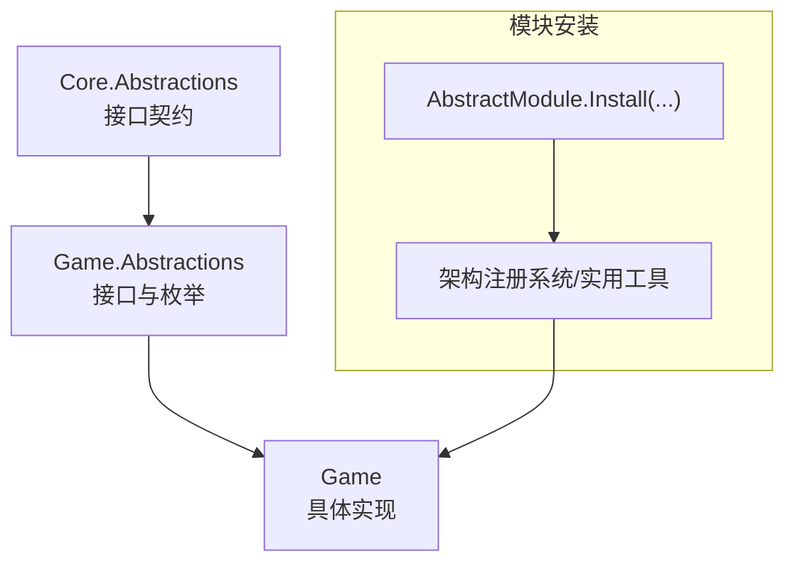
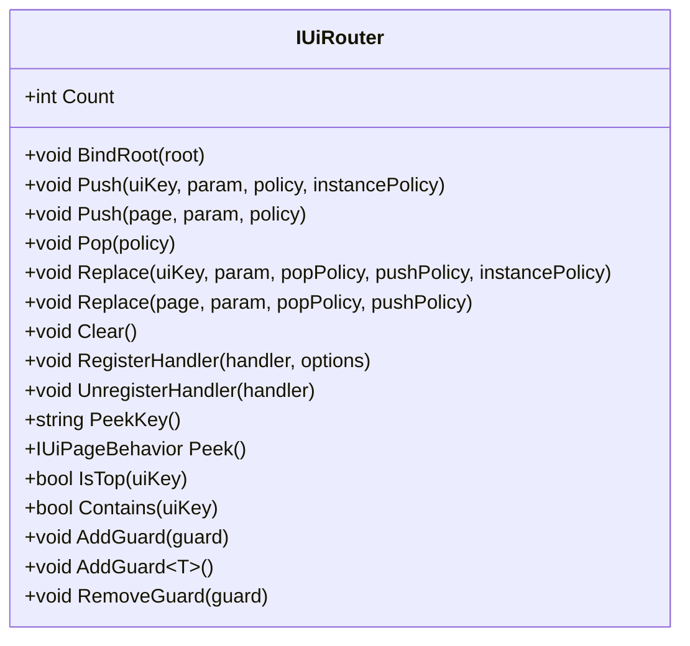
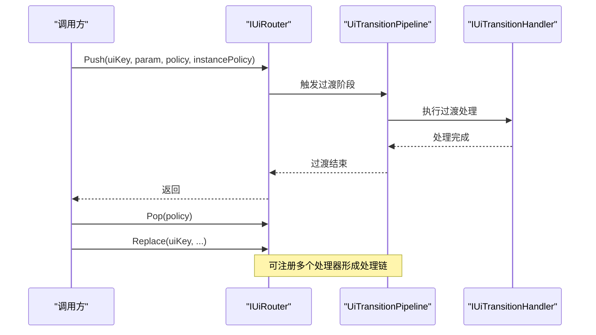
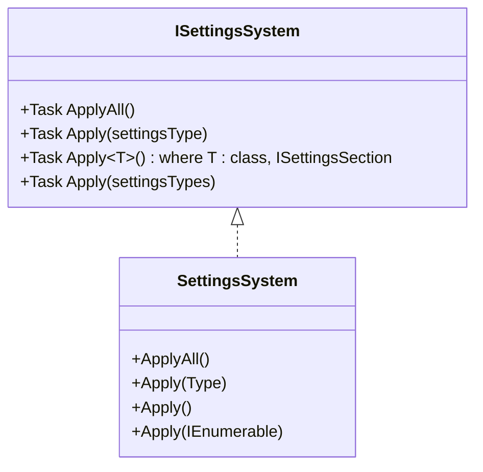
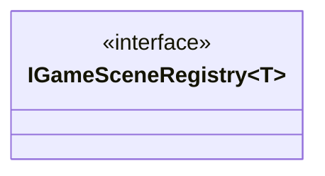
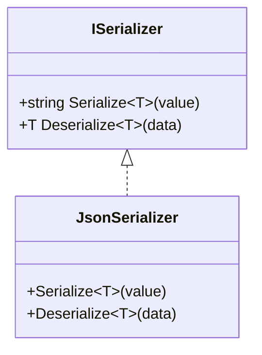
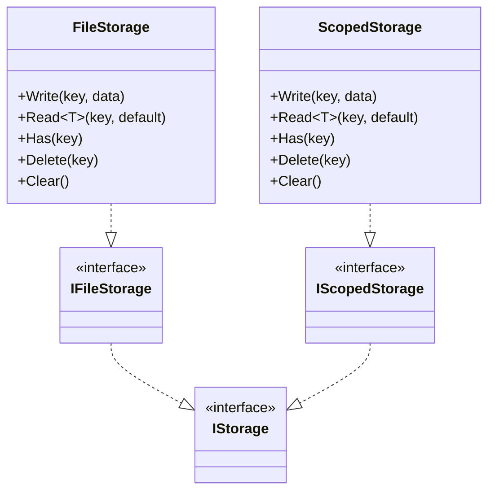
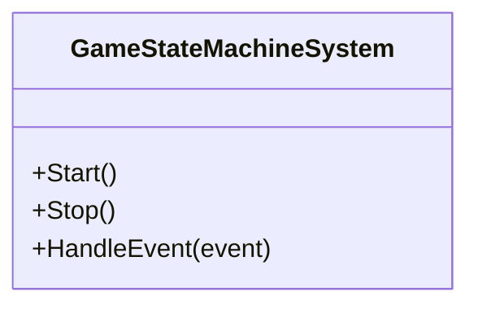
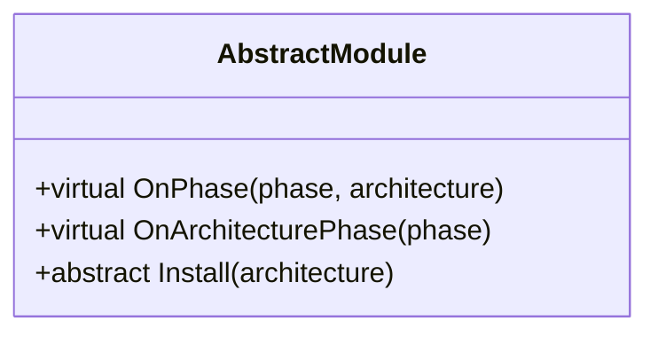
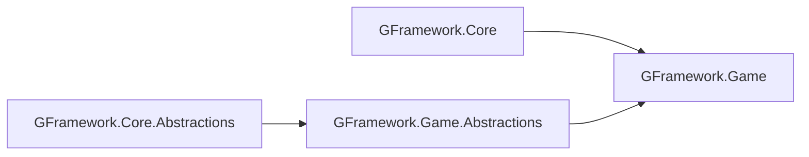

# Game API 参考

<cite>
**本文引用的文件**
- [GFramework.Game.csproj](file://GFramework.Game/GFramework.Game.csproj)
- [AbstractModule.cs](file://GFramework.Game/architecture/AbstractModule.cs)
- [README.md](file://GFramework.Game/README.md)
- [IUiRouter.cs](file://GFramework.Game.Abstractions/ui/IUiRouter.cs)
- [ISettingsSystem.cs](file://GFramework.Game.Abstractions/setting/ISettingsSystem.cs)
- [IGameSceneRegistry.cs](file://GFramework.Game.Abstractions/scene/IGameSceneRegistry.cs)
- [ISerializer.cs](file://GFramework.Game.Abstractions/serializer/ISerializer.cs)
- [IFileStorage.cs](file://GFramework.Game.Abstractions/storage/IFileStorage.cs)
- [IScopedStorage.cs](file://GFramework.Game.Abstractions/storage/IScopedStorage.cs)
- [GameStateMachineSystem.cs](file://GFramework.Game/state/GameStateMachineSystem.cs)
- [FileStorage.cs](file://GFramework.Game/storage/FileStorage.cs)
- [ScopedStorage.cs](file://GFramework.Game/storage/ScopedStorage.cs)
- [UiRouterBase.cs](file://GFramework.Game/ui/UiRouterBase.cs)
- [UiTransitionPipeline.cs](file://GFramework.Game/ui/UiTransitionPipeline.cs)
- [LoggingTransitionHandler.cs](file://GFramework.Game/ui/handler/LoggingTransitionHandler.cs)
- [UiTransitionHandlerBase.cs](file://GFramework.Game/ui/handler/UiTransitionHandlerBase.cs)
- [SettingsSystem.cs](file://GFramework.Game/setting/SettingsSystem.cs)
- [SettingsPersistence.cs](file://GFramework.Game/setting/SettingsPersistence.cs)
- [SettingsModel.cs](file://GFramework.Game/setting/SettingsModel.cs)
- [SettingsAllLoadedEvent.cs](file://GFramework.Game/setting/events/SettingsAllLoadedEvent.cs)
- [SettingsAppliedEvent.cs](file://GFramework.Game/setting/events/SettingsAppliedEvent.cs)
- [SettingsApplyingEvent.cs](file://GFramework.Game/setting/events/SettingsApplyingEvent.cs)
- [SettingsBatchChangedEvent.cs](file://GFramework.Game/setting/events/SettingsBatchChangedEvent.cs)
- [SettingsBatchSavedEvent.cs](file://GFramework.Game/setting/events/SettingsBatchSavedEvent.cs)
- [SettingsChangedEvent.cs](file://GFramework.Game/setting/events/SettingsChangedEvent.cs)
- [SettingsDeletedEvent.cs](file://GFramework.Game/setting/events/SettingsDeletedEvent.cs)
- [SettingsLoadedEvent.cs](file://GFramework.Game/setting/events/SettingsLoadedEvent.cs)
- [SettingsResetAllEvent.cs](file://GFramework.Game/setting/events/SettingsResetAllEvent.cs)
- [SettingsResetEvent.cs](file://GFramework.Game/setting/events/SettingsResetEvent.cs)
- [SettingsSavedEvent.cs](file://GFramework.Game/setting/events/SettingsSavedEvent.cs)
- [JsonSerializer.cs](file://GFramework.Game/serializer/JsonSerializer.cs)
- [GFramework.Game.Abstractions.csproj](file://GFramework.Game.Abstractions/GFramework.Game.Abstractions.csproj)
</cite>

## 目录
1. [简介](#简介)
2. [项目结构](#项目结构)
3. [核心组件](#核心组件)
4. [架构总览](#架构总览)
5. [详细组件分析](#详细组件分析)
6. [依赖分析](#依赖分析)
7. [性能考虑](#性能考虑)
8. [故障排除指南](#故障排除指南)
9. [结论](#结论)
10. [附录](#附录)

## 简介
本文件为 GFramework.Game 模块的完整 API 参考，聚焦游戏开发中的 UI 路由、设置系统、场景注册、序列化与存储等核心能力。文档覆盖接口定义、实现要点、数据流与控制流、扩展机制以及与 Core 模块的交互关系，并提供最佳实践与性能优化建议。

## 项目结构
GFramework.Game 采用“抽象层 + 实现层”的分层设计：
- 抽象层（Game.Abstractions）：定义跨平台的接口与枚举，确保与 Core.Abstractions 解耦
- 实现层（Game）：提供具体实现（如 UI 路由、设置系统、存储、序列化等），并引用 Core 与 Abstractions

图表来源
- [IUiRouter.cs](file://GFramework.Game.Abstractions/ui/IUiRouter.cs#L1-L138)
- [ISettingsSystem.cs](file://GFramework.Game.Abstractions/setting/ISettingsSystem.cs#L1-L32)
- [IGameSceneRegistry.cs](file://GFramework.Game.Abstractions/scene/IGameSceneRegistry.cs#L1-L9)
- [ISerializer.cs](file://GFramework.Game.Abstractions/serializer/ISerializer.cs#L1-L25)
- [IFileStorage.cs](file://GFramework.Game.Abstractions/storage/IFileStorage.cs#L1-L9)
- [IScopedStorage.cs](file://GFramework.Game.Abstractions/storage/IScopedStorage.cs#L1-L8)
- [AbstractModule.cs](file://GFramework.Game/architecture/AbstractModule.cs#L1-L33)
- [UiRouterBase.cs](file://GFramework.Game/ui/UiRouterBase.cs)
- [UiTransitionPipeline.cs](file://GFramework.Game/ui/UiTransitionPipeline.cs)
- [LoggingTransitionHandler.cs](file://GFramework.Game/ui/handler/LoggingTransitionHandler.cs)
- [UiTransitionHandlerBase.cs](file://GFramework.Game/ui/handler/UiTransitionHandlerBase.cs)
- [SettingsSystem.cs](file://GFramework.Game/setting/SettingsSystem.cs)
- [SettingsPersistence.cs](file://GFramework.Game/setting/SettingsPersistence.cs)
- [SettingsModel.cs](file://GFramework.Game/setting/SettingsModel.cs)
- [FileStorage.cs](file://GFramework.Game/storage/FileStorage.cs)
- [ScopedStorage.cs](file://GFramework.Game/storage/ScopedStorage.cs)
- [JsonSerializer.cs](file://GFramework.Game/serializer/JsonSerializer.cs)

章节来源
- [GFramework.Game.csproj](file://GFramework.Game/GFramework.Game.csproj#L1-L17)
- [GFramework.Game.Abstractions.csproj](file://GFramework.Game.Abstractions/GFramework.Game.Abstractions.csproj#L1-L31)

## 核心组件
- UI 路由接口 IUiRouter：提供 UI 页面的入栈、出栈、替换、守卫、过渡处理等能力
- 设置系统接口 ISettingsSystem：提供设置的批量应用与异步应用能力
- 场景注册接口 IGameSceneRegistry：提供键值到场景对象的注册与查询
- 序列化接口 ISerializer：提供通用的序列化与反序列化能力
- 存储接口族：IStorage 基础接口，IFileStorage/IFileStorage 用于文件与作用域存储
- 模块基类 AbstractModule：提供模块生命周期钩子与安装入口

章节来源
- [IUiRouter.cs](file://GFramework.Game.Abstractions/ui/IUiRouter.cs#L1-L138)
- [ISettingsSystem.cs](file://GFramework.Game.Abstractions/setting/ISettingsSystem.cs#L1-L32)
- [IGameSceneRegistry.cs](file://GFramework.Game.Abstractions/scene/IGameSceneRegistry.cs#L1-L9)
- [ISerializer.cs](file://GFramework.Game.Abstractions/serializer/ISerializer.cs#L1-L25)
- [IFileStorage.cs](file://GFramework.Game.Abstractions/storage/IFileStorage.cs#L1-L9)
- [IScopedStorage.cs](file://GFramework.Game.Abstractions/storage/IScopedStorage.cs#L1-L8)
- [AbstractModule.cs](file://GFramework.Game/architecture/AbstractModule.cs#L1-L33)

## 架构总览
下图展示 Game 模块与 Core 抽象层的交互关系，以及模块安装、事件与系统之间的协作：

图表来源
- [AbstractModule.cs](file://GFramework.Game/architecture/AbstractModule.cs#L1-L33)
- [GFramework.Game.csproj](file://GFramework.Game/GFramework.Game.csproj#L9-L12)
- [GFramework.Game.Abstractions.csproj](file://GFramework.Game.Abstractions/GFramework.Game.Abstractions.csproj#L13-L15)

## 详细组件分析

### UI 路由系统（IUiRouter）
IUiRouter 提供 UI 页面的导航与过渡管理，支持策略化入栈/出栈、守卫注册、过渡处理器注册等。

- 关键能力
  - 入栈/出栈/替换：Push、Pop、Replace，支持策略参数（独占/覆盖、复用/销毁）
  - 栈操作：Count、Peek、PeekKey、Contains、IsTop、Clear
  - 处理器：RegisterHandler、UnregisterHandler
  - 守卫：AddGuard/AddGuard<T>/RemoveGuard
- 设计要点
  - 通过 IUiRoot 绑定 UI 根节点
  - 支持基于 uiKey 或已存在页面实例的路由
  - 与过渡管道（UiTransitionPipeline）配合，实现可插拔的过渡处理链

图表来源
- [IUiRouter.cs](file://GFramework.Game.Abstractions/ui/IUiRouter.cs#L1-L138)

章节来源
- [IUiRouter.cs](file://GFramework.Game.Abstractions/ui/IUiRouter.cs#L1-L138)

#### UI 路由调用序列（Push/Pop/Replace）

图表来源
- [IUiRouter.cs](file://GFramework.Game.Abstractions/ui/IUiRouter.cs#L29-L76)
- [UiTransitionPipeline.cs](file://GFramework.Game/ui/UiTransitionPipeline.cs)
- [LoggingTransitionHandler.cs](file://GFramework.Game/ui/handler/LoggingTransitionHandler.cs)
- [UiTransitionHandlerBase.cs](file://GFramework.Game/ui/handler/UiTransitionHandlerBase.cs)

### 设置系统（ISettingsSystem）
ISettingsSystem 提供设置的批量应用与异步应用能力，常与 SettingsModel/SettingsPersistence 协作完成读取、变更、持久化与应用。

- 关键能力
  - ApplyAll：应用全部可应用设置
  - Apply(Type)/Apply<T>()：按类型应用设置
  - Apply(IEnumerable<Type>)：批量应用
- 事件体系
  - SettingsApplyingEvent、SettingsAppliedEvent、SettingsChangedEvent、SettingsBatchChangedEvent、SettingsSavedEvent、SettingsBatchSavedEvent、SettingsLoadedEvent、SettingsAllLoadedEvent、SettingsResetEvent、SettingsResetAllEvent、SettingsDeletedEvent

图表来源
- [ISettingsSystem.cs](file://GFramework.Game.Abstractions/setting/ISettingsSystem.cs#L1-L32)
- [SettingsSystem.cs](file://GFramework.Game/setting/SettingsSystem.cs)

章节来源
- [ISettingsSystem.cs](file://GFramework.Game.Abstractions/setting/ISettingsSystem.cs#L1-L32)
- [SettingsSystem.cs](file://GFramework.Game/setting/SettingsSystem.cs)
- [SettingsModel.cs](file://GFramework.Game/setting/SettingsModel.cs)
- [SettingsPersistence.cs](file://GFramework.Game/setting/SettingsPersistence.cs)
- [SettingsAllLoadedEvent.cs](file://GFramework.Game/setting/events/SettingsAllLoadedEvent.cs)
- [SettingsAppliedEvent.cs](file://GFramework.Game/setting/events/SettingsAppliedEvent.cs)
- [SettingsApplyingEvent.cs](file://GFramework.Game/setting/events/SettingsApplyingEvent.cs)
- [SettingsBatchChangedEvent.cs](file://GFramework.Game/setting/events/SettingsBatchChangedEvent.cs)
- [SettingsBatchSavedEvent.cs](file://GFramework.Game/setting/events/SettingsBatchSavedEvent.cs)
- [SettingsChangedEvent.cs](file://GFramework.Game/setting/events/SettingsChangedEvent.cs)
- [SettingsDeletedEvent.cs](file://GFramework.Game/setting/events/SettingsDeletedEvent.cs)
- [SettingsLoadedEvent.cs](file://GFramework.Game/setting/events/SettingsLoadedEvent.cs)
- [SettingsResetAllEvent.cs](file://GFramework.Game/setting/events/SettingsResetAllEvent.cs)
- [SettingsResetEvent.cs](file://GFramework.Game/setting/events/SettingsResetEvent.cs)
- [SettingsSavedEvent.cs](file://GFramework.Game/setting/events/SettingsSavedEvent.cs)

### 场景注册接口（IGameSceneRegistry）
IGameSceneRegistry 为游戏场景提供键值到场景对象的注册与查询能力，便于集中管理场景资源。

图表来源
- [IGameSceneRegistry.cs](file://GFramework.Game.Abstractions/scene/IGameSceneRegistry.cs#L1-L9)

章节来源
- [IGameSceneRegistry.cs](file://GFramework.Game.Abstractions/scene/IGameSceneRegistry.cs#L1-L9)

### 序列化器接口（ISerializer）
ISerializer 提供通用的序列化与反序列化能力，常用于设置、存档等数据的持久化。

图表来源
- [ISerializer.cs](file://GFramework.Game.Abstractions/serializer/ISerializer.cs#L1-L25)
- [JsonSerializer.cs](file://GFramework.Game/serializer/JsonSerializer.cs)

章节来源
- [ISerializer.cs](file://GFramework.Game.Abstractions/serializer/ISerializer.cs#L1-L25)
- [JsonSerializer.cs](file://GFramework.Game/serializer/JsonSerializer.cs)

### 存储系统（IStorage/IFileStorage/IScopedStorage）
存储系统提供分层与文件存储能力，支持作用域隔离与缓存包装。

- IStorage：基础存储接口
- IFileStorage：文件存储专用接口
- IScopedStorage：作用域存储接口
- FileStorage：文件系统存储实现
- ScopedStorage：基于作用域的存储包装器

图表来源
- [IFileStorage.cs](file://GFramework.Game.Abstractions/storage/IFileStorage.cs#L1-L9)
- [IScopedStorage.cs](file://GFramework.Game.Abstractions/storage/IScopedStorage.cs#L1-L8)
- [FileStorage.cs](file://GFramework.Game/storage/FileStorage.cs)
- [ScopedStorage.cs](file://GFramework.Game/storage/ScopedStorage.cs)

章节来源
- [IFileStorage.cs](file://GFramework.Game.Abstractions/storage/IFileStorage.cs#L1-L9)
- [IScopedStorage.cs](file://GFramework.Game.Abstractions/storage/IScopedStorage.cs#L1-L8)
- [FileStorage.cs](file://GFramework.Game/storage/FileStorage.cs)
- [ScopedStorage.cs](file://GFramework.Game/storage/ScopedStorage.cs)

### 游戏状态机系统（GameStateMachineSystem）
GameStateMachineSystem 提供游戏状态机系统能力，与 Core 的 IStateMachineSystem/IState 协作，实现游戏状态的建模与流转。

图表来源
- [GameStateMachineSystem.cs](file://GFramework.Game/state/GameStateMachineSystem.cs)

章节来源
- [GameStateMachineSystem.cs](file://GFramework.Game/state/GameStateMachineSystem.cs)

### 模块系统（AbstractModule）
AbstractModule 为模块安装与生命周期提供统一入口，支持在不同架构阶段执行操作。

图表来源
- [AbstractModule.cs](file://GFramework.Game/architecture/AbstractModule.cs#L1-L33)

章节来源
- [AbstractModule.cs](file://GFramework.Game/architecture/AbstractModule.cs#L1-L33)
- [README.md](file://GFramework.Game/README.md#L56-L234)

## 依赖分析
- 项目引用关系
  - GFramework.Game 依赖 GFramework.Core 与 GFramework.Game.Abstractions
  - GFramework.Game.Abstractions 依赖 GFramework.Core.Abstractions
- 接口与实现解耦
  - Game.Abstractions 定义接口，Game 实现具体逻辑，保证与平台无关性
- 外部依赖
  - Newtonsoft.Json 用于序列化

图表来源
- [GFramework.Game.csproj](file://GFramework.Game/GFramework.Game.csproj#L9-L12)
- [GFramework.Game.Abstractions.csproj](file://GFramework.Game.Abstractions/GFramework.Game.Abstractions.csproj#L13-L15)

章节来源
- [GFramework.Game.csproj](file://GFramework.Game/GFramework.Game.csproj#L1-L17)
- [GFramework.Game.Abstractions.csproj](file://GFramework.Game.Abstractions/GFramework.Game.Abstractions.csproj#L1-L31)

## 性能考虑
- UI 路由
  - 合理使用实例策略（复用 vs 销毁）以平衡内存与渲染开销
  - 过渡处理器链应避免阻塞主线程，必要时采用异步处理
- 设置系统
  - 批量应用设置时注意事件风暴，可通过批处理事件减少频繁刷新
  - 应用设置前后使用事件（如 Applying/ Applied）进行节流
- 存储
  - 使用 ScopedStorage 进行命名空间隔离，避免键冲突
  - 对热点数据可引入缓存层（如缓存包装器）降低磁盘访问频率
- 序列化
  - 使用 ISerializer 进行统一序列化，避免重复创建序列化器实例
  - 对大对象采用增量写入与压缩策略（如启用压缩）

## 故障排除指南
- UI 路由
  - 若页面无法显示，检查是否正确绑定 IUiRoot 并确认 uiKey 对应的页面已注册
  - 若过渡异常，检查已注册的过渡处理器顺序与实现
- 设置系统
  - 若设置未生效，确认已调用 ApplyAll/Apply 并等待异步完成
  - 若事件未触发，检查事件订阅与派发逻辑
- 存储
  - 若读取失败，检查键是否存在（Has）与默认值设置
  - 若路径错误，确认 IFileStorage 的实现与文件系统权限
- 模块
  - 若模块未生效，检查 Install 是否被调用以及生命周期钩子是否正确注册

## 结论
GFramework.Game 通过清晰的抽象层与丰富的实现，为游戏开发提供了 UI 路由、设置系统、场景注册、序列化与存储等核心能力。依托模块化架构与事件驱动机制，开发者可以快速构建可维护、可扩展的游戏系统，并与 Core 模块无缝集成。

## 附录
- 使用示例与集成指南
  - 模块安装与生命周期：参考模块示例与生命周期钩子
  - UI 路由：参考 IUiRouter 的 Push/Pop/Replace 与守卫注册
  - 设置系统：参考 ISettingsSystem 的 ApplyAll/Apply 与事件体系
  - 存储：参考 IStorage/IFileStorage/IScopedStorage 的使用方式
  - 序列化：参考 ISerializer 的 Serialize/Deserialize

章节来源
- [README.md](file://GFramework.Game/README.md#L56-L800)