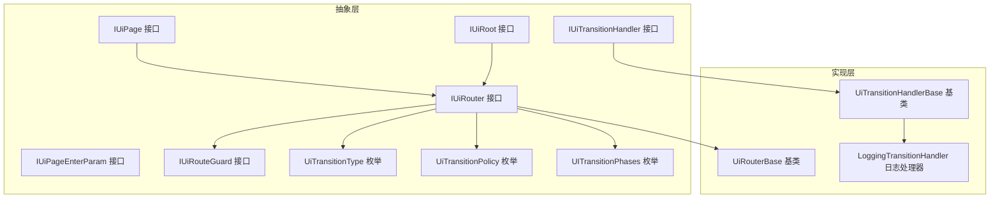
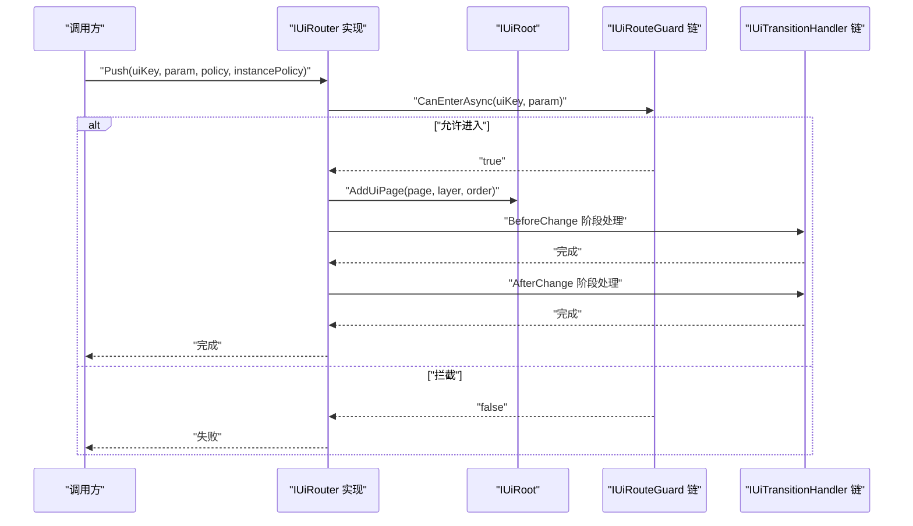
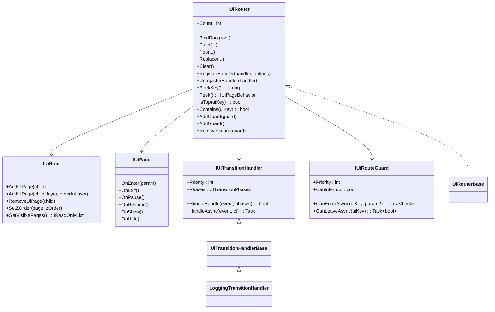

# UI 系统 API

<cite>
**本文引用的文件**
- [IUiRouter.cs](file://GFramework.Game.Abstractions/ui/IUiRouter.cs)
- [IUiPage.cs](file://GFramework.Game.Abstractions/ui/IUiPage.cs)
- [IUiRoot.cs](file://GFramework.Game.Abstractions/ui/IUiRoot.cs)
- [IUiPageEnterParam.cs](file://GFramework.Game.Abstractions/ui/IUiPageEnterParam.cs)
- [IUiTransitionHandler.cs](file://GFramework.Game.Abstractions/ui/IUiTransitionHandler.cs)
- [IUiRouteGuard.cs](file://GFramework.Game.Abstractions/ui/IUiRouteGuard.cs)
- [UiTransitionType.cs](file://GFramework.Game.Abstractions/enums/UiTransitionType.cs)
- [UiTransitionPolicy.cs](file://GFramework.Game.Abstractions/enums/UiTransitionPolicy.cs)
- [UITransitionPhases.cs](file://GFramework.Game.Abstractions/enums/UITransitionPhases.cs)
- [UiRouterBase.cs](file://GFramework.Game/ui/UiRouterBase.cs)
- [UiTransitionHandlerBase.cs](file://GFramework.Game/ui/handler/UiTransitionHandlerBase.cs)
- [LoggingTransitionHandler.cs](file://GFramework.Game/ui/handler/LoggingTransitionHandler.cs)
</cite>

## 目录
1. [简介](#简介)
2. [项目结构](#项目结构)
3. [核心组件](#核心组件)
4. [架构总览](#架构总览)
5. [详细组件分析](#详细组件分析)
6. [依赖关系分析](#依赖关系分析)
7. [性能考量](#性能考量)
8. [故障排查指南](#故障排查指南)
9. [结论](#结论)
10. [附录](#附录)

## 简介
本文件为 GFramework.UI 系统的 API 参考文档，聚焦于 UI 路由与页面生命周期管理。内容覆盖：
- UI 路由器接口（IUiRouter）的核心导航与守卫能力
- 基类实现（UiRouterBase）的职责与扩展点
- 页面进入参数（IUiPageEnterParam）的使用方式
- UI 过渡管道（UiTransitionPipeline）的配置项与阶段
- 过渡处理器（UiTransitionHandlerBase）扩展机制与日志处理器
- UI 页面接口（IUiPage）、UI 根节点接口（IUiRoot）的 API 说明
- 常见用例的代码示例路径（以源码路径代替具体代码）

## 项目结构
UI 相关抽象位于 GFramework.Game.Abstractions，具体实现位于 GFramework.Game；枚举类型集中于 GFramework.Game.Abstractions/enums。

图表来源
- [IUiRouter.cs](file://GFramework.Game.Abstractions/ui/IUiRouter.cs#L1-L138)
- [IUiPage.cs](file://GFramework.Game.Abstractions/ui/IUiPage.cs#L1-L39)
- [IUiRoot.cs](file://GFramework.Game.Abstractions/ui/IUiRoot.cs#L1-L43)
- [IUiPageEnterParam.cs](file://GFramework.Game.Abstractions/ui/IUiPageEnterParam.cs#L1-L7)
- [IUiTransitionHandler.cs](file://GFramework.Game.Abstractions/ui/IUiTransitionHandler.cs#L1-L39)
- [IUiRouteGuard.cs](file://GFramework.Game.Abstractions/ui/IUiRouteGuard.cs#L1-L37)
- [UiTransitionType.cs](file://GFramework.Game.Abstractions/enums/UiTransitionType.cs#L1-L27)
- [UiTransitionPolicy.cs](file://GFramework.Game.Abstractions/enums/UiTransitionPolicy.cs#L1-L18)
- [UITransitionPhases.cs](file://GFramework.Game.Abstractions/enums/UITransitionPhases.cs#L1-L27)
- [UiRouterBase.cs](file://GFramework.Game/ui/UiRouterBase.cs)
- [UiTransitionHandlerBase.cs](file://GFramework.Game/ui/handler/UiTransitionHandlerBase.cs)
- [LoggingTransitionHandler.cs](file://GFramework.Game/ui/handler/LoggingTransitionHandler.cs)

章节来源
- [IUiRouter.cs](file://GFramework.Game.Abstractions/ui/IUiRouter.cs#L1-L138)
- [UiTransitionType.cs](file://GFramework.Game.Abstractions/enums/UiTransitionType.cs#L1-L27)
- [UiTransitionPolicy.cs](file://GFramework.Game.Abstractions/enums/UiTransitionPolicy.cs#L1-L18)
- [UITransitionPhases.cs](file://GFramework.Game.Abstractions/enums/UITransitionPhases.cs#L1-L27)

## 核心组件
- IUiRouter：统一的 UI 导航入口，负责页面压栈、弹栈、替换、清空、根节点绑定、守卫注册、过渡处理器注册等。
- IUiPage：页面生命周期回调，涵盖进入、退出、暂停、恢复、显示、隐藏。
- IUiRoot：UI 根容器，负责页面挂载、层级与 Z-Order 控制、可见页面查询。
- IUiPageEnterParam：页面进入参数载体接口，用于携带导航参数。
- IUiTransitionHandler：过渡处理器接口，支持阶段过滤、优先级、异步处理。
- IUiRouteGuard：路由守卫接口，支持进入/离开校验与中断策略。
- 枚举体系：UiTransitionType（Push/Pop/Replace/Clear）、UiTransitionPolicy（Exclusive/Overlay）、UITransitionPhases（BeforeChange/AfterChange/All）。

章节来源
- [IUiRouter.cs](file://GFramework.Game.Abstractions/ui/IUiRouter.cs#L1-L138)
- [IUiPage.cs](file://GFramework.Game.Abstractions/ui/IUiPage.cs#L1-L39)
- [IUiRoot.cs](file://GFramework.Game.Abstractions/ui/IUiRoot.cs#L1-L43)
- [IUiPageEnterParam.cs](file://GFramework.Game.Abstractions/ui/IUiPageEnterParam.cs#L1-L7)
- [IUiTransitionHandler.cs](file://GFramework.Game.Abstractions/ui/IUiTransitionHandler.cs#L1-L39)
- [IUiRouteGuard.cs](file://GFramework.Game.Abstractions/ui/IUiRouteGuard.cs#L1-L37)
- [UiTransitionType.cs](file://GFramework.Game.Abstractions/enums/UiTransitionType.cs#L1-L27)
- [UiTransitionPolicy.cs](file://GFramework.Game.Abstractions/enums/UiTransitionPolicy.cs#L1-L18)
- [UITransitionPhases.cs](file://GFramework.Game.Abstractions/enums/UITransitionPhases.cs#L1-L27)

## 架构总览
UI 路由通过 IUiRouter 协调页面行为（IUiPageBehavior），由 IUiRoot 提供容器能力。过渡事件通过 IUiTransitionHandler 的链式处理，守卫通过 IUiRouteGuard 在路由决策阶段介入。UiRouterBase 作为默认实现，封装了页面栈、根节点绑定、过渡策略与处理器注册等通用逻辑。

图表来源
- [IUiRouter.cs](file://GFramework.Game.Abstractions/ui/IUiRouter.cs#L22-L41)
- [IUiRouteGuard.cs](file://GFramework.Game.Abstractions/ui/IUiRouteGuard.cs#L23-L28)
- [IUiTransitionHandler.cs](file://GFramework.Game.Abstractions/ui/IUiTransitionHandler.cs#L32-L38)
- [IUiRoot.cs](file://GFramework.Game.Abstractions/ui/IUiRoot.cs#L11-L23)

## 详细组件分析

### IUiRouter：UI 路由器接口
- 栈管理
  - Count：当前栈深
  - PeekKey/Peek/IsTop/Contains：栈顶查询与存在性判断
- 导航操作
  - Push(string uiKey, ...)：按标识符压栈
  - Push(IUiPageBehavior, ...)：按已有页面行为压栈
  - Pop(...)：弹栈，支持销毁策略
  - Replace(...)：替换全部页面（两种重载）
  - Clear()：清空
- 根节点与容器
  - BindRoot(root)：绑定 UI 根节点
- 守卫机制
  - AddGuard(guard)/AddGuard<T>()：注册路由守卫
  - RemoveGuard(guard)：移除守卫
- 过渡处理器
  - RegisterHandler(handler, options?)
  - UnregisterHandler(handler)

章节来源
- [IUiRouter.cs](file://GFramework.Game.Abstractions/ui/IUiRouter.cs#L11-L137)

### IUiPage：页面生命周期接口
- OnEnter(param?)：进入时调用，参数可选
- OnExit()：退出时调用
- OnPause()：暂停时调用
- OnResume()：恢复时调用
- OnShow()：显示时调用
- OnHide()：隐藏时调用

章节来源
- [IUiPage.cs](file://GFramework.Game.Abstractions/ui/IUiPage.cs#L7-L39)

### IUiRoot：UI 根节点接口
- AddUiPage(child)
- AddUiPage(child, layer, orderInLayer)
- RemoveUiPage(child)
- SetZOrder(page, zOrder)
- GetVisiblePages()：返回当前显示页面列表

章节来源
- [IUiRoot.cs](file://GFramework.Game.Abstractions/ui/IUiRoot.cs#L9-L43)

### IUiPageEnterParam：页面进入参数接口
- 用途：承载页面跳转时的参数数据结构
- 说明：接口本身不定义字段，具体实现由业务定义

章节来源
- [IUiPageEnterParam.cs](file://GFramework.Game.Abstractions/ui/IUiPageEnterParam.cs#L1-L7)

### IUiTransitionHandler：过渡处理器接口
- Priority：优先级（数值越小越先执行）
- Phases：适用阶段（UITransitionPhases）
- ShouldHandle(event, phases)：条件过滤
- HandleAsync(event, cancellationToken)：异步处理

章节来源
- [IUiTransitionHandler.cs](file://GFramework.Game.Abstractions/ui/IUiTransitionHandler.cs#L10-L39)

### IUiRouteGuard：路由守卫接口
- Priority、CanInterrupt
- CanEnterAsync(uiKey, param?)：进入校验
- CanLeaveAsync(uiKey)：离开校验

章节来源
- [IUiRouteGuard.cs](file://GFramework.Game.Abstractions/ui/IUiRouteGuard.cs#L9-L36)

### 枚举：UiTransitionType、UiTransitionPolicy、UITransitionPhases
- UiTransitionType：Push、Pop、Replace、Clear
- UiTransitionPolicy：Exclusive（独占，下层 Pause+Hide）、Overlay（覆盖，仅 Pause）
- UITransitionPhases：BeforeChange（可阻塞）、AfterChange（不可阻塞）、All（两者皆执行）

章节来源
- [UiTransitionType.cs](file://GFramework.Game.Abstractions/enums/UiTransitionType.cs#L6-L27)
- [UiTransitionPolicy.cs](file://GFramework.Game.Abstractions/enums/UiTransitionPolicy.cs#L7-L18)
- [UITransitionPhases.cs](file://GFramework.Game.Abstractions/enums/UITransitionPhases.cs#L9-L27)

### UiRouterBase：基类实现要点
- 职责概览
  - 维护页面栈与当前顶层页面
  - 绑定 IUiRoot 并在 Push/Pop/Replace/Clear 时协调根节点
  - 应用 UiTransitionPolicy 与 UiInstancePolicy
  - 触发过渡事件并在 BeforeChange/AfterChange 阶段调度处理器
  - 执行守卫链路（可中断）
- 关键流程
  - Push：校验守卫 -> 创建/复用页面 -> 添加到根节点 -> BeforeChange -> AfterChange
  - Pop/Replace/Clear：清理与替换策略 -> BeforeChange -> AfterChange
- 扩展点
  - 通过 RegisterHandler/UnregisterHandler 注入自定义处理器
  - 通过 AddGuard/RemoveGuard 注入业务守卫

章节来源
- [UiRouterBase.cs](file://GFramework.Game/ui/UiRouterBase.cs)

### UiTransitionHandlerBase：过渡处理器基类
- 作用：提供 IUiTransitionHandler 的便捷实现基类
- 用法：继承后实现 ShouldHandle 与 HandleAsync，并设置 Priority 与 Phases
- 与 LoggingTransitionHandler 的关系：后者是内置的日志记录处理器，可直接注册使用

章节来源
- [UiTransitionHandlerBase.cs](file://GFramework.Game/ui/handler/UiTransitionHandlerBase.cs)
- [LoggingTransitionHandler.cs](file://GFramework.Game/ui/handler/LoggingTransitionHandler.cs)

## 依赖关系分析
- IUiRouter 依赖 IUiRoot、IUiPage、IUiRouteGuard、IUiTransitionHandler、UiTransitionType/Policy/Phases
- UiRouterBase 实现 IUiRouter，并组合上述依赖
- LoggingTransitionHandler 实现 IUiTransitionHandler，常用于 AfterChange 阶段记录日志

图表来源
- [IUiRouter.cs](file://GFramework.Game.Abstractions/ui/IUiRouter.cs#L9-L137)
- [IUiRoot.cs](file://GFramework.Game.Abstractions/ui/IUiRoot.cs#L9-L43)
- [IUiPage.cs](file://GFramework.Game.Abstractions/ui/IUiPage.cs#L7-L39)
- [IUiTransitionHandler.cs](file://GFramework.Game.Abstractions/ui/IUiTransitionHandler.cs#L10-L39)
- [IUiRouteGuard.cs](file://GFramework.Game.Abstractions/ui/IUiRouteGuard.cs#L9-L36)
- [UiRouterBase.cs](file://GFramework.Game/ui/UiRouterBase.cs)
- [UiTransitionHandlerBase.cs](file://GFramework.Game/ui/handler/UiTransitionHandlerBase.cs)
- [LoggingTransitionHandler.cs](file://GFramework.Game/ui/handler/LoggingTransitionHandler.cs)

## 性能考量
- 页面实例策略（UiInstancePolicy）：合理选择 Reuse 可降低频繁创建/销毁成本
- 过渡策略（UiTransitionPolicy）：Overlay 在多层页面时减少隐藏/显示开销，但需注意资源占用
- 处理器优先级：将高频/轻量处理器置于高位，避免阻塞关键路径
- 守卫链长度：控制守卫数量与复杂度，必要时采用异步快速通道

## 故障排查指南
- 守卫拦截导致无法进入页面
  - 检查 CanEnterAsync 返回值与 CanInterrupt 设置
  - 示例路径：[IUiRouteGuard.cs](file://GFramework.Game.Abstractions/ui/IUiRouteGuard.cs#L23-L28)
- 过渡卡顿或异常
  - 分离 BeforeChange 中的阻塞逻辑与 AfterChange 中的非阻塞逻辑
  - 示例路径：[UITransitionPhases.cs](file://GFramework.Game.Abstractions/enums/UITransitionPhases.cs#L15-L21)
- 页面未正确显示/隐藏
  - 校验 UiTransitionPolicy 与 IUiRoot 的 AddUiPage/SetZOrder 调用
  - 示例路径：[IUiRoot.cs](file://GFramework.Game.Abstractions/ui/IUiRoot.cs#L11-L36)
- 日志缺失
  - 确认已注册 LoggingTransitionHandler 或自定义处理器
  - 示例路径：[LoggingTransitionHandler.cs](file://GFramework.Game/ui/handler/LoggingTransitionHandler.cs)

章节来源
- [IUiRouteGuard.cs](file://GFramework.Game.Abstractions/ui/IUiRouteGuard.cs#L11-L36)
- [UITransitionPhases.cs](file://GFramework.Game.Abstractions/enums/UITransitionPhases.cs#L8-L27)
- [IUiRoot.cs](file://GFramework.Game.Abstractions/ui/IUiRoot.cs#L11-L36)
- [LoggingTransitionHandler.cs](file://GFramework.Game/ui/handler/LoggingTransitionHandler.cs)

## 结论
GFramework.UI 通过清晰的接口分层与可插拔的处理器/守卫机制，提供了高扩展性的 UI 路由与页面生命周期管理方案。开发者可通过 IUiRouter 统一编排页面导航，借助 IUiTransitionHandler 与 IUiRouteGuard 实现业务解耦与可观测性增强。

## 附录

### 常见用例与示例路径
- 实现页面导航（Push/Pop/Replace/Clear）
  - 示例路径：[IUiRouter.cs](file://GFramework.Game.Abstractions/ui/IUiRouter.cs#L22-L80)
- 自定义过渡效果（注册处理器）
  - 示例路径：[IUiTransitionHandler.cs](file://GFramework.Game.Abstractions/ui/IUiTransitionHandler.cs#L24-L38)
  - 示例路径：[UiTransitionHandlerBase.cs](file://GFramework.Game/ui/handler/UiTransitionHandlerBase.cs)
- 使用页面进入参数
  - 示例路径：[IUiPageEnterParam.cs](file://GFramework.Game.Abstractions/ui/IUiPageEnterParam.cs#L1-L7)
  - 示例路径：[IUiRouter.cs](file://GFramework.Game.Abstractions/ui/IUiRouter.cs#L26-L30)
- 处理页面生命周期
  - 示例路径：[IUiPage.cs](file://GFramework.Game.Abstractions/ui/IUiPage.cs#L9-L38)
- 绑定 UI 根节点与层级控制
  - 示例路径：[IUiRoot.cs](file://GFramework.Game.Abstractions/ui/IUiRoot.cs#L11-L36)
- 注册路由守卫
  - 示例路径：[IUiRouteGuard.cs](file://GFramework.Game.Abstractions/ui/IUiRouteGuard.cs#L16-L20)
  - 示例路径：[IUiRouter.cs](file://GFramework.Game.Abstractions/ui/IUiRouter.cs#L118-L135)
- 日志记录处理器
  - 示例路径：[LoggingTransitionHandler.cs](file://GFramework.Game/ui/handler/LoggingTransitionHandler.cs)