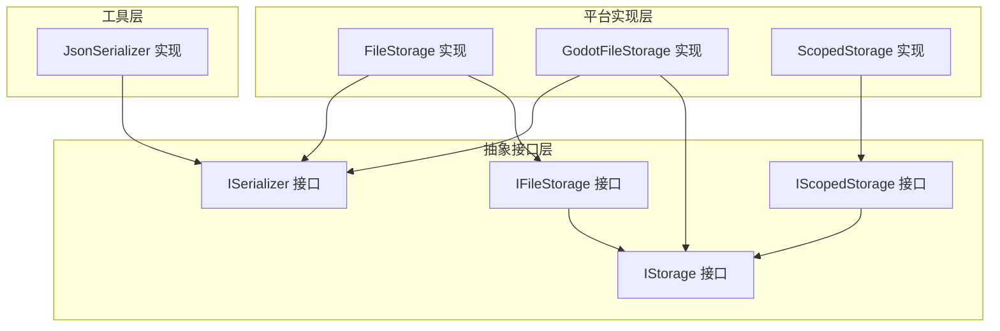
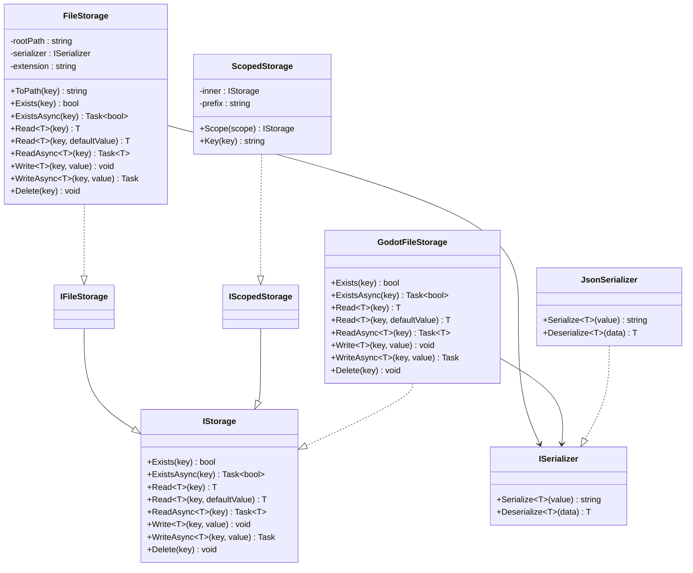
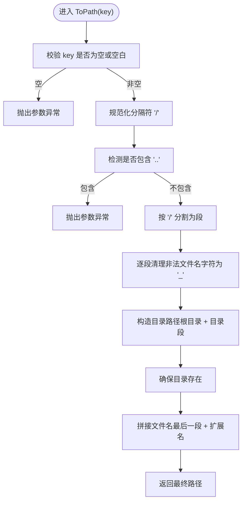
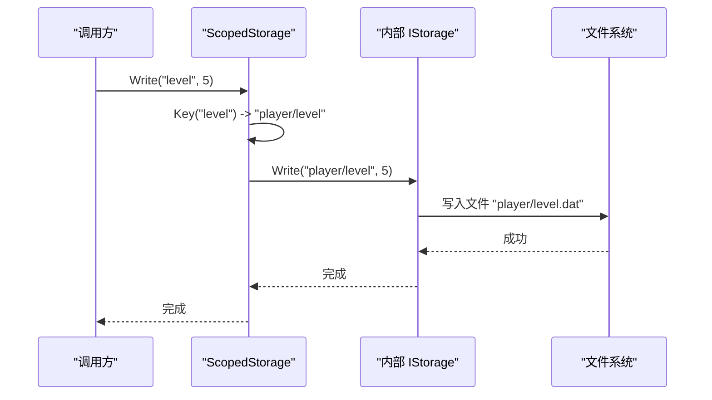
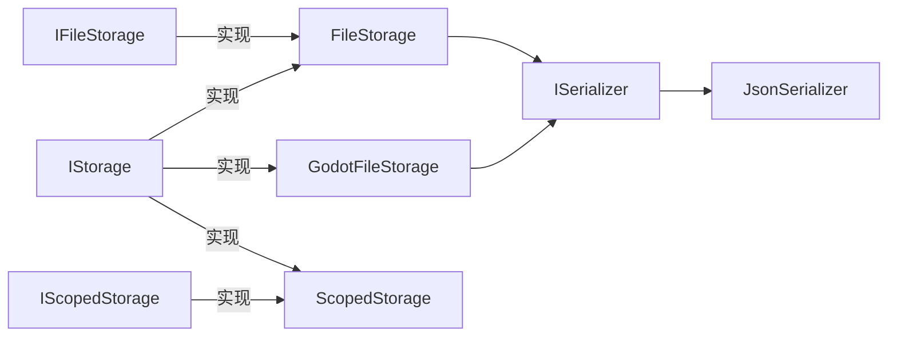

# 存储系统 API

<cite>
**本文引用的文件列表**
- [IStorage.cs](file://GFramework.Core.Abstractions/storage/IStorage.cs)
- [IFileStorage.cs](file://GFramework.Game.Abstractions/storage/IFileStorage.cs)
- [IScopedStorage.cs](file://GFramework.Game.Abstractions/storage/IScopedStorage.cs)
- [FileStorage.cs](file://GFramework.Game/storage/FileStorage.cs)
- [ScopedStorage.cs](file://GFramework.Game/storage/ScopedStorage.cs)
- [ISerializer.cs](file://GFramework.Game.Abstractions/serializer/ISerializer.cs)
- [JsonSerializer.cs](file://GFramework.Game/serializer/JsonSerializer.cs)
- [GodotFileStorage.cs](file://GFramework.Godot/storage/GodotFileStorage.cs)
- [ReadMe.md](file://GFramework.Game/storage/ReadMe.md)
</cite>

## 目录
1. [简介](#简介)
2. [项目结构](#项目结构)
3. [核心组件](#核心组件)
4. [架构总览](#架构总览)
5. [组件详解](#组件详解)
6. [依赖关系分析](#依赖关系分析)
7. [性能考量](#性能考量)
8. [故障排查指南](#故障排查指南)
9. [结论](#结论)
10. [附录](#附录)

## 简介
本文件为 GFramework.Storage 系统的完整 API 参考文档，覆盖以下主题：
- 基础存储接口 IStorage 的设计理念与扩展机制
- 文件存储接口 IFileStorage 的方法与使用要点
- 作用域存储接口 IScopedStorage 的命名空间隔离与批量操作能力
- FileStorage 的具体实现细节（文件路径管理、权限控制、错误处理）
- ScopedStorage 的作用域概念与典型使用场景（临时数据、会话数据）
- 序列化器接口 ISerializer 的配合使用，提供数据持久化完整方案
- 常见存储需求的实践示例（配置文件、用户数据、游戏进度）

## 项目结构
GFramework.Storage 系统由“抽象接口层 + 平台实现层 + 工具层”组成：
- 抽象接口层：定义跨平台统一的存储契约（IStorage、IFileStorage、IScopedStorage）
- 平台实现层：提供具体实现（FileStorage、GodotFileStorage、ScopedStorage）
- 工具层：序列化器（ISerializer、JsonSerializer）

图表来源
- [IStorage.cs](file://GFramework.Core.Abstractions/storage/IStorage.cs#L1-L72)
- [IFileStorage.cs](file://GFramework.Game.Abstractions/storage/IFileStorage.cs#L1-L9)
- [IScopedStorage.cs](file://GFramework.Game.Abstractions/storage/IScopedStorage.cs#L1-L8)
- [FileStorage.cs](file://GFramework.Game/storage/FileStorage.cs#L1-L258)
- [GodotFileStorage.cs](file://GFramework.Godot/storage/GodotFileStorage.cs#L1-L291)
- [ScopedStorage.cs](file://GFramework.Game/storage/ScopedStorage.cs#L1-L99)
- [ISerializer.cs](file://GFramework.Game.Abstractions/serializer/ISerializer.cs#L1-L25)
- [JsonSerializer.cs](file://GFramework.Game/serializer/JsonSerializer.cs#L1-L29)

章节来源
- [IStorage.cs](file://GFramework.Core.Abstractions/storage/IStorage.cs#L1-L72)
- [IFileStorage.cs](file://GFramework.Game.Abstractions/storage/IFileStorage.cs#L1-L9)
- [IScopedStorage.cs](file://GFramework.Game.Abstractions/storage/IScopedStorage.cs#L1-L8)
- [FileStorage.cs](file://GFramework.Game/storage/FileStorage.cs#L1-L258)
- [GodotFileStorage.cs](file://GFramework.Godot/storage/GodotFileStorage.cs#L1-L291)
- [ScopedStorage.cs](file://GFramework.Game/storage/ScopedStorage.cs#L1-L99)
- [ISerializer.cs](file://GFramework.Game.Abstractions/serializer/ISerializer.cs#L1-L25)
- [JsonSerializer.cs](file://GFramework.Game/serializer/JsonSerializer.cs#L1-L29)

## 核心组件
- IStorage：定义通用的键值存储操作（读、写、异步读、异步写、存在性检查、删除）。它是所有存储实现的基础契约。
- IFileStorage：面向文件系统的存储接口，继承自 IStorage，强调文件持久化语义。
- IScopedStorage：作用域存储接口，继承自 IStorage，提供命名空间隔离与分组能力。
- ISerializer：序列化器接口，提供对象与字符串之间的双向转换，支撑数据持久化。

章节来源
- [IStorage.cs](file://GFramework.Core.Abstractions/storage/IStorage.cs#L1-L72)
- [IFileStorage.cs](file://GFramework.Game.Abstractions/storage/IFileStorage.cs#L1-L9)
- [IScopedStorage.cs](file://GFramework.Game.Abstractions/storage/IScopedStorage.cs#L1-L8)
- [ISerializer.cs](file://GFramework.Game.Abstractions/serializer/ISerializer.cs#L1-L25)

## 架构总览
存储系统采用“接口 + 多实现”的分层设计：
- 抽象层定义统一契约，屏蔽平台差异
- 具体实现分别适配 .NET 文件系统与 Godot 平台
- 通过组合序列化器实现数据格式无关性

图表来源
- [IStorage.cs](file://GFramework.Core.Abstractions/storage/IStorage.cs#L1-L72)
- [IFileStorage.cs](file://GFramework.Game.Abstractions/storage/IFileStorage.cs#L1-L9)
- [IScopedStorage.cs](file://GFramework.Game.Abstractions/storage/IScopedStorage.cs#L1-L8)
- [FileStorage.cs](file://GFramework.Game/storage/FileStorage.cs#L1-L258)
- [GodotFileStorage.cs](file://GFramework.Godot/storage/GodotFileStorage.cs#L1-L291)
- [ScopedStorage.cs](file://GFramework.Game/storage/ScopedStorage.cs#L1-L99)
- [ISerializer.cs](file://GFramework.Game.Abstractions/serializer/ISerializer.cs#L1-L25)
- [JsonSerializer.cs](file://GFramework.Game/serializer/JsonSerializer.cs#L1-L29)

## 组件详解

### IStorage 接口
- 设计理念
  - 提供跨平台、跨实现的一致性 API
  - 明确区分同步与异步操作，便于在不同运行时（.NET、Godot）中高效使用
  - 支持默认值读取，降低调用侧的健壮性开销
- 关键方法
  - 存在性检查：Exists、ExistsAsync
  - 读取：Read、Read(string key, T defaultValue)、ReadAsync
  - 写入：Write、WriteAsync
  - 删除：Delete
- 扩展机制
  - 通过继承 IStorage 可以实现不同介质（文件、内存、网络）的存储
  - 通过组合 ISerializer 实现数据格式无关的持久化

章节来源
- [IStorage.cs](file://GFramework.Core.Abstractions/storage/IStorage.cs#L1-L72)

### IFileStorage 接口
- 定义：面向文件系统的存储契约，继承自 IStorage
- 作用：约束文件存储的语义与行为，确保实现遵循文件路径、扩展名、编码等约定

章节来源
- [IFileStorage.cs](file://GFramework.Game.Abstractions/storage/IFileStorage.cs#L1-L9)

### IScopedStorage 接口
- 定义：作用域存储接口，继承自 IStorage
- 作用：提供命名空间隔离与分组能力，常用于临时数据、会话数据、模块化数据的逻辑分组

章节来源
- [IScopedStorage.cs](file://GFramework.Game.Abstractions/storage/IScopedStorage.cs#L1-L8)

### FileStorage（.NET 文件系统实现）
- 职责
  - 基于本地文件系统实现 IFileStorage
  - 将键映射为文件路径，使用序列化器进行数据持久化
- 关键特性
  - 路径管理：键中“/”作为目录分隔符；自动清理非法字符；防止路径遍历（禁止“..”）
  - 线程安全：按键粒度的锁，提升并发性能
  - 编码与扩展：UTF-8 文本读写，默认扩展名“.dat”
  - 错误处理：键不存在时读取抛出异常；提供默认值读取避免异常
- 主要方法
  - Exists/ExistsAsync：检查文件是否存在
  - Read/Read(string key, T defaultValue)/ReadAsync：读取并反序列化
  - Write/WriteAsync：序列化并写入
  - Delete：删除对应文件
  - ToPath：键到路径的映射与校验

图表来源
- [FileStorage.cs](file://GFramework.Game/storage/FileStorage.cs#L72-L103)

章节来源
- [FileStorage.cs](file://GFramework.Game/storage/FileStorage.cs#L1-L258)

### ScopedStorage（作用域存储）
- 职责
  - 为所有键添加前缀，实现命名空间隔离与逻辑分组
  - 透明包装内部 IStorage 实现，保持同步/异步一致性
- 关键特性
  - 前缀拼接：Key(key) 将 prefix 与 key 组合为“prefix/key”
  - 嵌套作用域：Scope(scope) 返回新的 ScopedStorage，形成多级前缀
  - 与底层共享物理存储：不同作用域写入到不同子路径，不产生重复数据
- 典型使用场景
  - 临时数据存储：为每帧/每关卡生成唯一作用域
  - 会话数据管理：按会话 ID 或玩家 ID 划分作用域
  - 模块化数据：将不同模块的数据隔离在各自作用域内

图表来源
- [ScopedStorage.cs](file://GFramework.Game/storage/ScopedStorage.cs#L63-L80)
- [FileStorage.cs](file://GFramework.Game/storage/FileStorage.cs#L221-L231)

章节来源
- [ScopedStorage.cs](file://GFramework.Game/storage/ScopedStorage.cs#L1-L99)

### ISerializer 与 JsonSerializer
- ISerializer
  - 提供泛型 Serialize/Deserialize，解耦存储介质与数据格式
- JsonSerializer
  - 基于 JSON.NET 实现，支持复杂对象序列化与反序列化
  - 反序列化失败时抛出参数异常，便于上层捕获与处理

章节来源
- [ISerializer.cs](file://GFramework.Game.Abstractions/serializer/ISerializer.cs#L1-L25)
- [JsonSerializer.cs](file://GFramework.Game/serializer/JsonSerializer.cs#L1-L29)

### GodotFileStorage（Godot 平台实现）
- 职责
  - 适配 Godot 的虚拟路径系统（res://、user://）与文件系统路径
  - 保持与 FileStorage 一致的 API 语义
- 关键特性
  - 路径识别：自动判断 Godot 路径并使用 FileAccess/DirAccess
  - 线程安全：按键粒度锁，避免并发写入冲突
  - 默认值读取：与 FileStorage 一致的行为
- 与 FileStorage 的差异
  - 支持 Godot 虚拟路径
  - 删除操作在 GodotFileStorage 中已实现（FileStorage 中未实现 Delete）

章节来源
- [GodotFileStorage.cs](file://GFramework.Godot/storage/GodotFileStorage.cs#L1-L291)

## 依赖关系分析
- 接口依赖
  - IFileStorage、IScopedStorage 均继承自 IStorage，确保统一的 API 表面
- 实现依赖
  - FileStorage、GodotFileStorage 直接实现 IStorage
  - ScopedStorage 包装任意 IStorage 实现，形成装饰器模式
  - FileStorage、GodotFileStorage 依赖 ISerializer 进行数据序列化
- 外部依赖
  - GodotFileStorage 依赖 Godot.FileAccess/DirAccess
  - JsonSerializer 依赖 Newtonsoft.Json

图表来源
- [IStorage.cs](file://GFramework.Core.Abstractions/storage/IStorage.cs#L1-L72)
- [IFileStorage.cs](file://GFramework.Game.Abstractions/storage/IFileStorage.cs#L1-L9)
- [IScopedStorage.cs](file://GFramework.Game.Abstractions/storage/IScopedStorage.cs#L1-L8)
- [FileStorage.cs](file://GFramework.Game/storage/FileStorage.cs#L1-L258)
- [GodotFileStorage.cs](file://GFramework.Godot/storage/GodotFileStorage.cs#L1-L291)
- [ScopedStorage.cs](file://GFramework.Game/storage/ScopedStorage.cs#L1-L99)
- [ISerializer.cs](file://GFramework.Game.Abstractions/serializer/ISerializer.cs#L1-L25)
- [JsonSerializer.cs](file://GFramework.Game/serializer/JsonSerializer.cs#L1-L29)

章节来源
- [IStorage.cs](file://GFramework.Core.Abstractions/storage/IStorage.cs#L1-L72)
- [FileStorage.cs](file://GFramework.Game/storage/FileStorage.cs#L1-L258)
- [GodotFileStorage.cs](file://GFramework.Godot/storage/GodotFileStorage.cs#L1-L291)
- [ScopedStorage.cs](file://GFramework.Game/storage/ScopedStorage.cs#L1-L99)
- [ISerializer.cs](file://GFramework.Game.Abstractions/serializer/ISerializer.cs#L1-L25)
- [JsonSerializer.cs](file://GFramework.Game/serializer/JsonSerializer.cs#L1-L29)

## 性能考量
- 线程安全与锁粒度
  - FileStorage、GodotFileStorage、ScopedStorage 均采用按键粒度的锁，减少锁竞争，提升并发吞吐
- IO 模式
  - FileStorage 的异步读写仍使用锁保护，避免竞态；异步 IO 与锁共存时需注意避免长时间持有锁
- 序列化成本
  - JsonSerializer 适合复杂对象；若追求极致性能，可考虑二进制序列化器
- 路径解析
  - ToPath/ToAbsolutePath 会进行字符串处理与目录创建，建议在高频路径上避免频繁键变换

[本节为通用性能建议，无需特定文件来源]

## 故障排查指南
- 常见异常与处理
  - 键为空或包含“..”：抛出参数异常，检查键构造逻辑
  - 读取不存在的键：FileStorage 的 Read<T>(string key) 抛出文件未找到异常；建议使用 Read<T>(string key, T defaultValue)
  - 路径非法字符：自动清理为“_”，确保键命名规范
  - 权限不足：确认存储目录具备读写权限
- 调试建议
  - 使用 ScopedStorage 为不同模块划分作用域，便于定位问题
  - 记录键到路径的映射，结合日志定位文件位置
  - 在 Godot 平台使用 user:// 路径进行用户数据持久化，避免 res:// 只读限制

章节来源
- [FileStorage.cs](file://GFramework.Game/storage/FileStorage.cs#L72-L103)
- [FileStorage.cs](file://GFramework.Game/storage/FileStorage.cs#L144-L156)
- [GodotFileStorage.cs](file://GFramework.Godot/storage/GodotFileStorage.cs#L85-L114)

## 结论
GFramework.Storage 系统通过清晰的接口分层与多平台实现，提供了统一、可扩展、可组合的数据持久化方案。借助 ScopedStorage 的作用域隔离与 ISerializer 的格式无关性，开发者可以快速构建配置文件、用户数据、游戏进度等常见存储需求，并在 .NET 与 Godot 平台上获得一致的开发体验。

[本节为总结性内容，无需特定文件来源]

## 附录

### API 参考速查表
- IStorage
  - Exists、ExistsAsync：检查键是否存在
  - Read、Read(string key, T defaultValue)、ReadAsync：读取值
  - Write、WriteAsync：写入值
  - Delete：删除键
- IFileStorage：继承 IStorage，面向文件系统
- IScopedStorage：继承 IStorage，提供作用域前缀
- ISerializer：Serialize、Deserialize

章节来源
- [IStorage.cs](file://GFramework.Core.Abstractions/storage/IStorage.cs#L1-L72)
- [IFileStorage.cs](file://GFramework.Game.Abstractions/storage/IFileStorage.cs#L1-L9)
- [IScopedStorage.cs](file://GFramework.Game.Abstractions/storage/IScopedStorage.cs#L1-L8)
- [ISerializer.cs](file://GFramework.Game.Abstractions/serializer/ISerializer.cs#L1-L25)

### 实践示例（路径指引）
- 基础文件存储
  - 参考：[FileStorage 使用示例](file://GFramework.Game/storage/ReadMe.md#L24-L58)
- 作用域存储
  - 参考：[ScopedStorage 使用示例](file://GFramework.Game/storage/ReadMe.md#L78-L98)
  - 参考：[组合使用示例](file://GFramework.Game/storage/ReadMe.md#L100-L121)
- Godot 平台
  - 参考：[GodotFileStorage 使用示例](file://GFramework.Godot/storage/README.md#L96-L133)

章节来源
- [ReadMe.md](file://GFramework.Game/storage/ReadMe.md#L1-L135)
- [GodotFileStorage.cs](file://GFramework.Godot/storage/GodotFileStorage.cs#L1-L291)