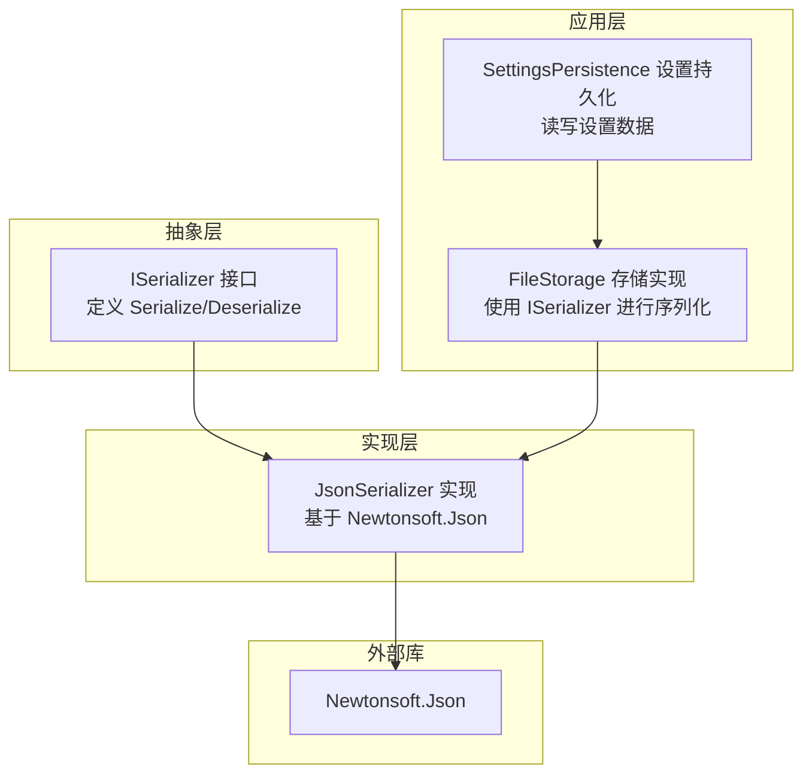
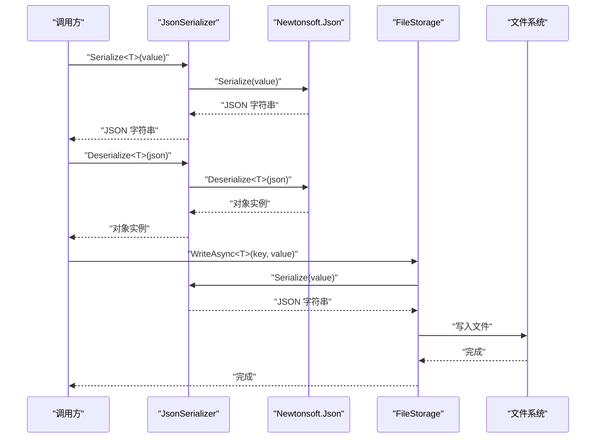
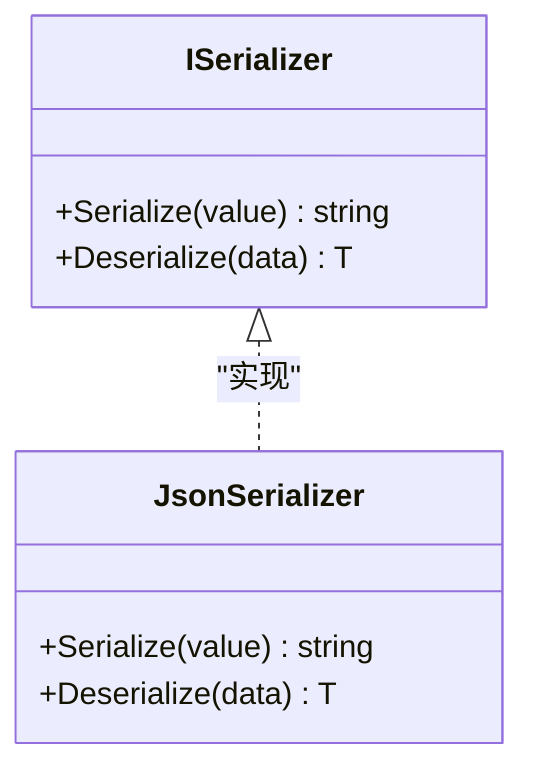
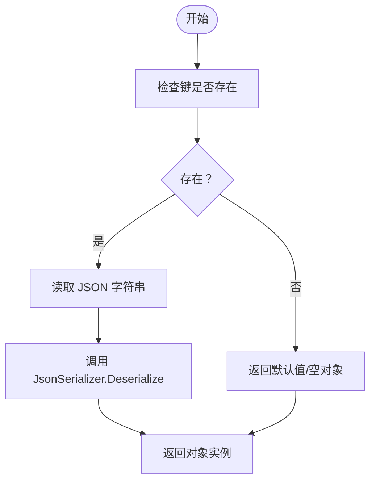
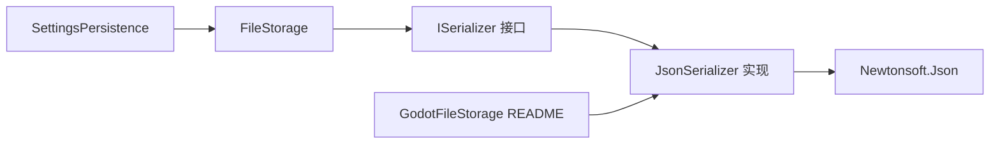

# 序列化 API

<cite>
**本文引用的文件**
- [ISerializer.cs](file://GFramework.Game.Abstractions/serializer/ISerializer.cs)
- [JsonSerializer.cs](file://GFramework.Game/serializer/JsonSerializer.cs)
- [README.md（GFramework.Game）](file://GFramework.Game/README.md)
- [README.md（API 参考 - Game）](file://docs/api-reference/game-api.md)
- [FileStorage.cs](file://GFramework.Game/storage/FileStorage.cs)
- [ISettingsPersistence.cs](file://GFramework.Game.Abstractions/setting/ISettingsPersistence.cs)
- [SettingsPersistence.cs](file://GFramework.Game/setting/SettingsPersistence.cs)
- [GodotFileStorage README](file://GFramework.Godot/storage/README.md)
</cite>

## 目录
1. [简介](#简介)
2. [项目结构](#项目结构)
3. [核心组件](#核心组件)
4. [架构总览](#架构总览)
5. [组件详解](#组件详解)
6. [依赖关系分析](#依赖关系分析)
7. [性能与内存优化](#性能与内存优化)
8. [故障排查指南](#故障排查指南)
9. [结论](#结论)
10. [附录](#附录)

## 简介
本文件为 GFramework.Serializer 模块的详细 API 参考文档，聚焦于序列化器接口 ISerializer 与具体实现 JsonSerializer 的能力说明、配置要点、类型处理、错误处理、性能与内存优化建议，以及在设置系统、存储系统、网络通信与缓存系统中的使用范式与最佳实践。文档同时给出与存储系统的集成方式与常见问题排查思路，帮助开发者在游戏开发场景中做出合适的选择与优化。

## 项目结构
围绕序列化能力，相关代码分布在以下位置：
- 抽象接口：GFramework.Game.Abstractions/serializer/ISerializer.cs
- 具体实现：GFramework.Game/serializer/JsonSerializer.cs
- 使用示例与高级特性：GFramework.Game/README.md、docs/api-reference/game-api.md
- 与存储系统的集成：GFramework.Game/storage/FileStorage.cs、GFramework.Godot/storage/README.md
- 设置系统的持久化：GFramework.Game.Abstractions/setting/ISettingsPersistence.cs、GFramework.Game/setting/SettingsPersistence.cs

图表来源
- [ISerializer.cs](file://GFramework.Game.Abstractions/serializer/ISerializer.cs#L1-L25)
- [JsonSerializer.cs](file://GFramework.Game/serializer/JsonSerializer.cs#L1-L29)
- [FileStorage.cs](file://GFramework.Game/storage/FileStorage.cs#L234-L258)
- [ISettingsPersistence.cs](file://GFramework.Game.Abstractions/setting/ISettingsPersistence.cs#L1-L43)
- [SettingsPersistence.cs](file://GFramework.Game/setting/SettingsPersistence.cs#L1-L39)

章节来源
- [ISerializer.cs](file://GFramework.Game.Abstractions/serializer/ISerializer.cs#L1-L25)
- [JsonSerializer.cs](file://GFramework.Game/serializer/JsonSerializer.cs#L1-L29)
- [README.md（GFramework.Game）](file://GFramework.Game/README.md#L50-L55)
- [README.md（API 参考 - Game）](file://docs/api-reference/game-api.md#L503-L533)

## 核心组件
- ISerializer 接口：定义泛型 Serialize<T>(T) 与 Deserialize<T>(string) 两个核心方法，作为序列化器的统一契约。
- JsonSerializer 实现：基于 Newtonsoft.Json 提供 JSON 序列化与反序列化能力，并对反序列化失败进行显式错误处理。

章节来源
- [ISerializer.cs](file://GFramework.Game.Abstractions/serializer/ISerializer.cs#L8-L25)
- [JsonSerializer.cs](file://GFramework.Game/serializer/JsonSerializer.cs#L9-L29)

## 架构总览
下图展示了序列化器在系统中的角色与调用链路，以及与存储系统的协作方式。

图表来源
- [JsonSerializer.cs](file://GFramework.Game/serializer/JsonSerializer.cs#L17-L28)
- [FileStorage.cs](file://GFramework.Game/storage/FileStorage.cs#L240-L255)

## 组件详解

### ISerializer 接口
- 方法
  - Serialize<T>(T value): 将任意类型对象序列化为字符串。
  - Deserialize<T>(string data): 将字符串反序列化为指定类型对象。
- 设计意图
  - 以最小接口暴露序列化能力，便于替换底层实现（如切换到二进制或压缩序列化）。
  - 通过泛型约束保证类型安全与易用性。

章节来源
- [ISerializer.cs](file://GFramework.Game.Abstractions/serializer/ISerializer.cs#L8-L25)

### JsonSerializer 实现
- 能力概览
  - 基于 Newtonsoft.Json 的标准序列化与反序列化。
  - 对反序列化结果为空的情况抛出异常，明确失败语义。
- 关键行为
  - Serialize<T>(T): 直接委托给 JsonConvert.SerializeObject。
  - Deserialize<T>(string): 委托 JsonConvert.DeserializeObject<T>，若结果为 null 则抛出异常。

图表来源
- [ISerializer.cs](file://GFramework.Game.Abstractions/serializer/ISerializer.cs#L8-L25)
- [JsonSerializer.cs](file://GFramework.Game/serializer/JsonSerializer.cs#L9-L29)

章节来源
- [JsonSerializer.cs](file://GFramework.Game/serializer/JsonSerializer.cs#L9-L29)

### 类型信息与自定义转换器
- 类型信息处理
  - README 中演示了通过 JsonSerializerSettings.TypeNameHandling.Auto 保留类型信息，便于跨语言或跨版本反序列化时恢复精确类型。
- 自定义转换器
  - README 展示了针对 Vector2、Color、Godot Resource 的自定义 JsonConverter，覆盖 WriteJson/ReadJson 以满足游戏特定类型序列化需求。
- 版本化序列化
  - README 提供了 VersionedData 与 VersionedSerializer 的示例，通过在 JSON 中嵌入版本号与类型名，实现数据迁移与向后兼容。

章节来源
- [README.md（GFramework.Game）](file://GFramework.Game/README.md#L652-L703)
- [README.md（GFramework.Game）](file://GFramework.Game/README.md#L779-L857)

### 错误处理与健壮性
- 反序列化失败
  - JsonSerializer 在反序列化结果为 null 时抛出异常，调用方应捕获并决定回退策略（如使用默认值或重新初始化）。
- 建议
  - 在上层封装统一的 DeserializeWithErrorHandling<T>(string) 方法，返回 Result<T> 或 Tuple<bool, T>，避免异常风暴。
  - 对于外部输入（网络/文件），先进行格式校验与白名单检查，再进行反序列化。

章节来源
- [JsonSerializer.cs](file://GFramework.Game/serializer/JsonSerializer.cs#L27-L28)

### 与存储系统的集成
- FileStorage 的序列化流程
  - WriteAsync<T>(string, T) 中，先通过 ISerializer.Serialize(value) 得到 JSON 字符串，再写入文件。
  - 该流程体现了“序列化器”与“存储实现”的解耦：存储实现仅依赖 ISerializer 接口。
- GodotFileStorage 示例
  - Godot 存储 README 明确指出需要传入一个序列化器实例（如 JsonSerializer）来构造存储实现，从而实现 JSON 序列化与文件读写。

图表来源
- [FileStorage.cs](file://GFramework.Game/storage/FileStorage.cs#L240-L255)
- [GodotFileStorage README](file://GFramework.Godot/storage/README.md#L100-L117)

章节来源
- [FileStorage.cs](file://GFramework.Game/storage/FileStorage.cs#L234-L258)
- [GodotFileStorage README](file://GFramework.Godot/storage/README.md#L63-L133)

### 设置系统的数据持久化
- ISettingsPersistence 与 SettingsPersistence
  - 通过异步 LoadAsync/SaveAsync 等方法，结合存储系统实现设置数据的加载与保存。
  - 在加载成功后发送事件（如 SettingsLoadedEvent），便于订阅者响应数据变更。
- 与序列化器的关系
  - SettingsPersistence 依赖 IStorage，IStorage 内部使用 ISerializer 进行序列化，因此设置数据的持久化天然受益于序列化器的类型安全与错误处理。

章节来源
- [ISettingsPersistence.cs](file://GFramework.Game.Abstractions/setting/ISettingsPersistence.cs#L12-L43)
- [SettingsPersistence.cs](file://GFramework.Game/setting/SettingsPersistence.cs#L12-L39)

### 网络通信与缓存系统的使用场景
- 网络通信
  - 将对象序列化为 JSON 字符串后通过网络发送；接收端反序列化为对象。建议在网络层增加压缩（见性能章节）与版本控制（见版本化序列化示例）。
- 缓存系统
  - 将对象序列化为 JSON 字节流存入缓存（如内存缓存或分布式缓存），读取时反序列化。可结合缓存层（如 CachedStorage）提升命中率与性能。

章节来源
- [README.md（GFramework.Game）](file://GFramework.Game/README.md#L550-L647)
- [README.md（GFramework.Game）](file://GFramework.Game/README.md#L1226-L1274)

## 依赖关系分析
- JsonSerializer 依赖 Newtonsoft.Json 进行序列化与反序列化。
- FileStorage 依赖 ISerializer 进行对象到字符串的转换，再写入文件系统。
- SettingsPersistence 依赖 IStorage，间接依赖 ISerializer。
- GodotFileStorage README 明确要求传入序列化器实例以构造存储实现。

图表来源
- [JsonSerializer.cs](file://GFramework.Game/serializer/JsonSerializer.cs#L1-L2)
- [FileStorage.cs](file://GFramework.Game/storage/FileStorage.cs#L240-L255)
- [SettingsPersistence.cs](file://GFramework.Game/setting/SettingsPersistence.cs#L14-L35)
- [GodotFileStorage README](file://GFramework.Godot/storage/README.md#L100-L117)

章节来源
- [JsonSerializer.cs](file://GFramework.Game/serializer/JsonSerializer.cs#L1-L2)
- [README.md（GFramework.Game）](file://GFramework.Game/README.md#L1379-L1398)

## 性能与内存优化
- 格式选择
  - JSON：可读性好，适合调试与配置；二进制（如 MessagePack）体积更小、解析更快；压缩可进一步降低体积但增加 CPU 开销。
- 压缩与异步
  - 对大对象或频繁写入场景，可采用压缩序列化；对高频读写场景优先考虑异步 API，避免阻塞主线程。
- 自定义序列化逻辑
  - 使用 [JsonIgnore]/[JsonProperty] 控制字段；通过 ShouldSerializeXxx 条件序列化；使用 [OnDeserialized] 初始化默认值。
- 版本控制与迁移
  - 在 JSON 中嵌入版本号与类型名，实现平滑迁移，避免因字段变更导致的反序列化失败。
- 缓存与批量操作
  - 结合缓存层（如 CachedStorage）减少重复序列化与 IO；对批量写入使用异步并行，提升吞吐量。

章节来源
- [README.md（GFramework.Game）](file://GFramework.Game/README.md#L1226-L1274)
- [README.md（GFramework.Game）](file://GFramework.Game/README.md#L550-L647)
- [README.md（API 参考 - Game）](file://docs/api-reference/game-api.md#L515-L533)

## 故障排查指南
- 反序列化失败
  - 现象：Deserialize 返回 null 并抛出异常。
  - 排查：确认 JSON 格式正确、字段名匹配、类型信息完整（必要时启用 TypeNameHandling.Auto）、无循环引用导致栈溢出。
- 类型不匹配
  - 现象：反序列化为基类或未知类型。
  - 排查：确保 JSON 中包含类型信息（TypeNameHandling.Auto），或在上层显式指定目标类型。
- 性能瓶颈
  - 现象：序列化/反序列化耗时长。
  - 排查：评估是否需要压缩、是否可改用二进制格式、是否可引入缓存、是否可批量异步处理。
- 存储写入失败
  - 现象：WriteAsync 失败或锁冲突。
  - 排查：检查文件路径权限、并发写入策略、锁粒度与顺序，避免死锁。

章节来源
- [JsonSerializer.cs](file://GFramework.Game/serializer/JsonSerializer.cs#L27-L28)
- [FileStorage.cs](file://GFramework.Game/storage/FileStorage.cs#L240-L255)

## 结论
GFramework.Serializer 通过 ISerializer 抽象与 JsonSerializer 实现，为游戏开发提供了简洁、类型安全且易于扩展的序列化能力。结合存储系统与设置系统，可在数据持久化、网络传输与缓存场景中高效工作。通过合理选择序列化格式、引入压缩与版本控制、使用自定义转换器与缓存策略，开发者可以在可维护性与性能之间取得良好平衡。

## 附录
- 常用 API 速查
  - ISerializer.Serialize<T>(T)
  - ISerializer.Deserialize<T>(string)
  - JsonSerializer（可选传入 JsonSerializerSettings）
  - FileStorage.WriteAsync<T>(string, T)
  - SettingsPersistence.LoadAsync<T>() / SaveAsync<T>(T)
- 最佳实践清单
  - 为外部输入增加校验与白名单。
  - 对大对象启用压缩或二进制格式。
  - 使用自定义转换器处理游戏特有类型。
  - 通过版本化序列化保障向后兼容。
  - 使用缓存与批量异步提升性能。