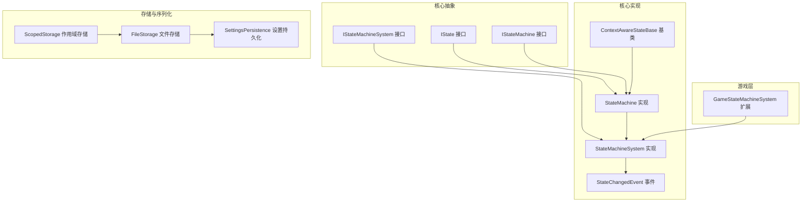
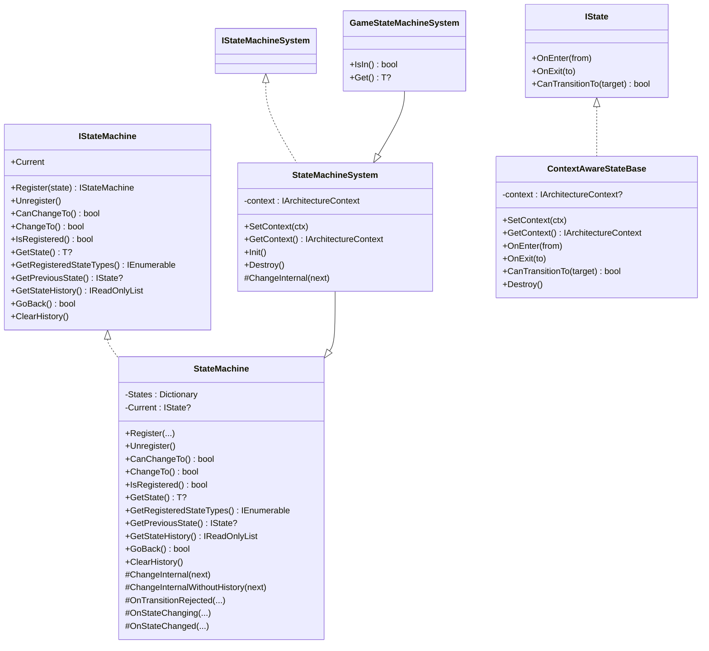
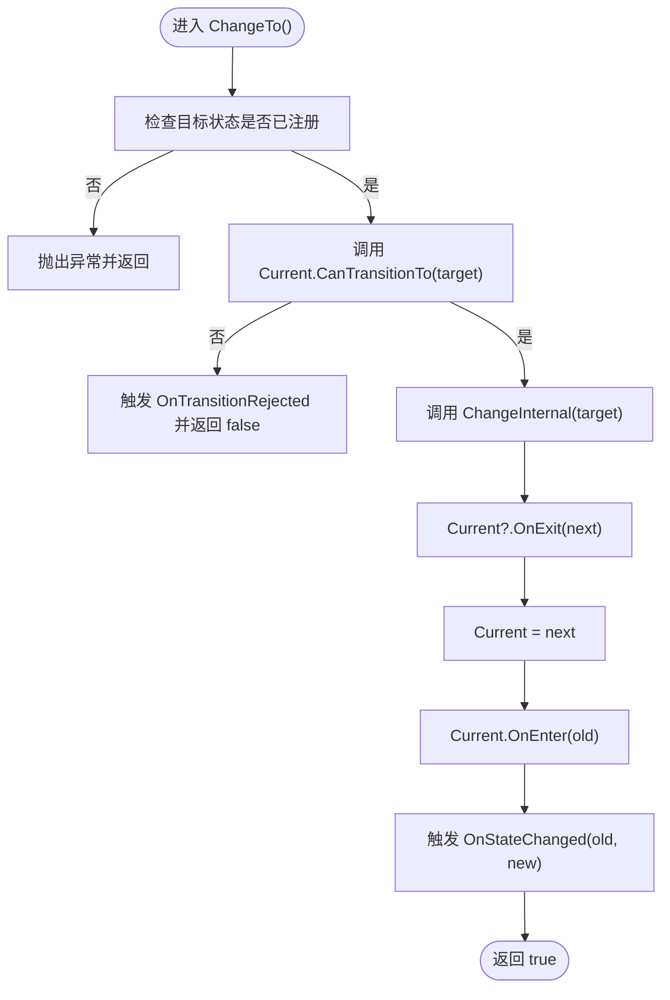
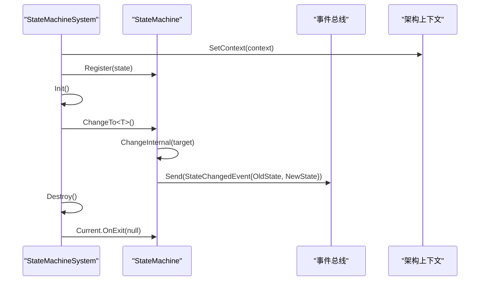
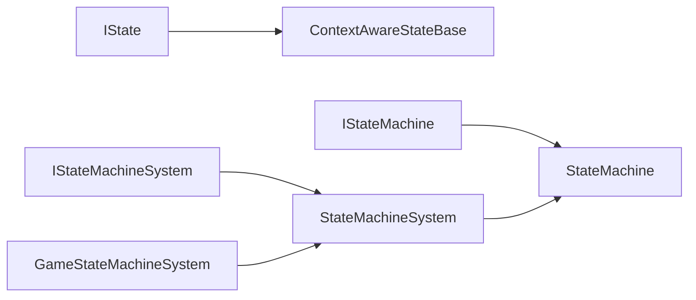
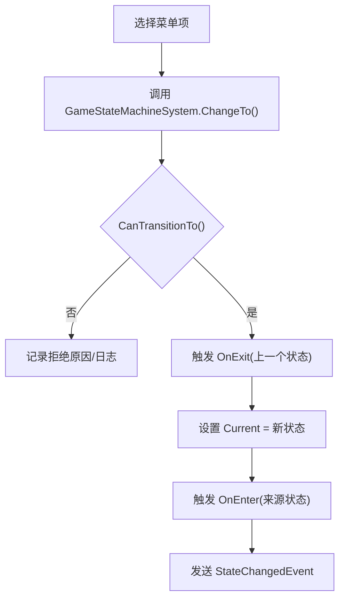

# 状态管理 API

<cite>
**本文引用的文件**
- [IStateMachineSystem.cs](file://GFramework.Core.Abstractions/state/IStateMachineSystem.cs)
- [IStateMachine.cs](file://GFramework.Core.Abstractions/state/IStateMachine.cs)
- [IState.cs](file://GFramework.Core.Abstractions/state/IState.cs)
- [StateMachineSystem.cs](file://GFramework.Core/state/StateMachineSystem.cs)
- [StateMachine.cs](file://GFramework.Core/state/StateMachine.cs)
- [ContextAwareStateBase.cs](file://GFramework.Core/state/ContextAwareStateBase.cs)
- [StateChangedEvent.cs](file://GFramework.Core/state/StateChangedEvent.cs)
- [GameStateMachineSystem.cs](file://GFramework.Game/state/GameStateMachineSystem.cs)
- [AbstractSystem.cs](file://GFramework.Core/system/AbstractSystem.cs)
- [FileStorage.cs](file://GFramework.Game/storage/FileStorage.cs)
- [ScopedStorage.cs](file://GFramework.Game/storage/ScopedStorage.cs)
- [SettingsPersistence.cs](file://GFramework.Game/setting/SettingsPersistence.cs)
- [StateMachineTests.cs](file://GFramework.Core.Tests/state/StateMachineTests.cs)
- [StateMachineSystemTests.cs](file://GFramework.Core.Tests/state/StateMachineSystemTests.cs)
- [StateTests.cs](file://GFramework.Core.Tests/state/StateTests.cs)
</cite>

## 目录
1. [简介](#简介)
2. [项目结构](#项目结构)
3. [核心组件](#核心组件)
4. [架构总览](#架构总览)
5. [详细组件分析](#详细组件分析)
6. [依赖关系分析](#依赖关系分析)
7. [性能考量](#性能考量)
8. [故障排查指南](#故障排查指南)
9. [结论](#结论)
10. [附录](#附录)

## 简介
本文件为 GFramework.State 状态管理系统提供详细的 API 参考与实现说明，覆盖以下主题：
- IStateMachineSystem、IStateMachine、IState 的接口定义与职责边界
- 状态机的创建、启动、停止与状态转换流程
- 状态生命周期回调 OnEnter/OnExit/CanTransitionTo 的语义与最佳实践
- GameStateMachineSystem 的具体实现与扩展能力
- 状态持久化 API 与最佳实践（结合存储与序列化）
- 常见游戏状态示例：主菜单、游戏中、暂停等的实现思路与调用方式

## 项目结构
状态管理相关代码分布在以下模块：
- 核心抽象层：定义状态机与状态接口
- 核心实现层：提供通用状态机与上下文感知状态基类
- 游戏层：提供游戏专用的状态机系统扩展
- 测试层：验证状态机与系统的行为一致性
- 存储与序列化：提供状态持久化基础设施

**图表来源**
- [IState.cs](file://GFramework.Core.Abstractions/state/IState.cs#L1-L26)
- [IStateMachine.cs](file://GFramework.Core.Abstractions/state/IStateMachine.cs#L1-L84)
- [IStateMachineSystem.cs](file://GFramework.Core.Abstractions/state/IStateMachineSystem.cs#L1-L9)
- [StateMachine.cs](file://GFramework.Core/state/StateMachine.cs#L1-L276)
- [StateMachineSystem.cs](file://GFramework.Core/state/StateMachineSystem.cs#L1-L96)
- [ContextAwareStateBase.cs](file://GFramework.Core/state/ContextAwareStateBase.cs#L1-L74)
- [StateChangedEvent.cs](file://GFramework.Core/state/StateChangedEvent.cs#L1-L19)
- [GameStateMachineSystem.cs](file://GFramework.Game/state/GameStateMachineSystem.cs#L1-L26)
- [FileStorage.cs](file://GFramework.Game/storage/FileStorage.cs#L1-L258)
- [ScopedStorage.cs](file://GFramework.Game/storage/ScopedStorage.cs#L1-L99)
- [SettingsPersistence.cs](file://GFramework.Game/setting/SettingsPersistence.cs#L1-L39)

**章节来源**
- [IStateMachineSystem.cs](file://GFramework.Core.Abstractions/state/IStateMachineSystem.cs#L1-L9)
- [IStateMachine.cs](file://GFramework.Core.Abstractions/state/IStateMachine.cs#L1-L84)
- [IState.cs](file://GFramework.Core.Abstractions/state/IState.cs#L1-L26)
- [StateMachineSystem.cs](file://GFramework.Core/state/StateMachineSystem.cs#L1-L96)
- [StateMachine.cs](file://GFramework.Core/state/StateMachine.cs#L1-L276)
- [ContextAwareStateBase.cs](file://GFramework.Core/state/ContextAwareStateBase.cs#L1-L74)
- [StateChangedEvent.cs](file://GFramework.Core/state/StateChangedEvent.cs#L1-L19)
- [GameStateMachineSystem.cs](file://GFramework.Game/state/GameStateMachineSystem.cs#L1-L26)
- [AbstractSystem.cs](file://GFramework.Core/system/AbstractSystem.cs#L1-L62)
- [FileStorage.cs](file://GFramework.Game/storage/FileStorage.cs#L1-L258)
- [ScopedStorage.cs](file://GFramework.Game/storage/ScopedStorage.cs#L1-L99)
- [SettingsPersistence.cs](file://GFramework.Game/setting/SettingsPersistence.cs#L1-L39)

## 核心组件
- IState：定义状态生命周期回调与转换判定
  - OnEnter(from)：进入状态时调用，from 为来源状态或 null
  - OnExit(to)：退出状态时调用，to 为目标状态或 null
  - CanTransitionTo(target)：判断是否允许转换到目标状态
- IStateMachine：状态机管理接口
  - Current：当前激活状态
  - Register/Unregister：注册与注销状态
  - CanChangeTo/ChangeTo：条件检查与状态切换
  - IsRegistered/GetState/GetRegisteredStateTypes：状态查询
  - GetPreviousState/GetStateHistory/GoBack/ClearHistory：历史管理
- IStateMachineSystem：继承 ISystem 与 IStateMachine，提供系统生命周期与上下文感知能力
- StateMachine：IStateMachine 的通用实现
- StateMachineSystem：IStateMachineSystem 的通用实现，支持上下文注入、事件通知与资源清理
- ContextAwareStateBase：IState/IContextAware/IDisposable 的基类，提供默认回调与上下文访问
- GameStateMachineSystem：游戏层扩展，提供 IsIn<T>() 与 Get<T>()

**章节来源**
- [IState.cs](file://GFramework.Core.Abstractions/state/IState.cs#L1-L26)
- [IStateMachine.cs](file://GFramework.Core.Abstractions/state/IStateMachine.cs#L1-L84)
- [IStateMachineSystem.cs](file://GFramework.Core.Abstractions/state/IStateMachineSystem.cs#L1-L9)
- [StateMachine.cs](file://GFramework.Core/state/StateMachine.cs#L1-L276)
- [StateMachineSystem.cs](file://GFramework.Core/state/StateMachineSystem.cs#L1-L96)
- [ContextAwareStateBase.cs](file://GFramework.Core/state/ContextAwareStateBase.cs#L1-L74)
- [GameStateMachineSystem.cs](file://GFramework.Game/state/GameStateMachineSystem.cs#L1-L26)

## 架构总览
状态机系统通过接口与实现分离，确保核心逻辑可复用、可测试；游戏层通过扩展提供领域增强。

**图表来源**
- [IState.cs](file://GFramework.Core.Abstractions/state/IState.cs#L1-L26)
- [IStateMachine.cs](file://GFramework.Core.Abstractions/state/IStateMachine.cs#L1-L84)
- [IStateMachineSystem.cs](file://GFramework.Core.Abstractions/state/IStateMachineSystem.cs#L1-L9)
- [StateMachine.cs](file://GFramework.Core/state/StateMachine.cs#L1-L276)
- [StateMachineSystem.cs](file://GFramework.Core/state/StateMachineSystem.cs#L1-L96)
- [ContextAwareStateBase.cs](file://GFramework.Core/state/ContextAwareStateBase.cs#L1-L74)
- [GameStateMachineSystem.cs](file://GFramework.Game/state/GameStateMachineSystem.cs#L1-L26)

## 详细组件分析

### IStateMachineSystem 接口
- 继承 ISystem 与 IStateMachine，提供系统生命周期钩子与状态机能力
- 适合在架构上下文中统一管理状态机的初始化、销毁与阶段事件

**章节来源**
- [IStateMachineSystem.cs](file://GFramework.Core.Abstractions/state/IStateMachineSystem.cs#L1-L9)
- [AbstractSystem.cs](file://GFramework.Core/system/AbstractSystem.cs#L1-L62)

### IStateMachine 接口
- 状态查询与管理：Register/Unregister、IsRegistered、GetState、GetRegisteredStateTypes
- 状态切换：CanChangeTo/ChangeTo
- 历史管理：GetPreviousState/GetStateHistory/GoBack/ClearHistory
- 返回值约定：ChangeTo 成功返回 true，失败返回 false；CanChangeTo 仅做条件判断，不触发切换

**章节来源**
- [IStateMachine.cs](file://GFramework.Core.Abstractions/state/IStateMachine.cs#L1-L84)

### IState 接口
- OnEnter/OnExit：携带来源/目标状态，便于跨状态传递上下文
- CanTransitionTo：可按业务规则限制转换，如“只有在特定条件下才允许进入某状态”

**章节来源**
- [IState.cs](file://GFramework.Core.Abstractions/state/IState.cs#L1-L26)

### StateMachine 实现
- 状态注册与注销：线程安全的字典存储，注销时若当前状态被注销则先触发 OnExit 并清空 Current
- 切换流程：先校验目标状态是否注册，再调用当前状态 CanTransitionTo，最终调用 ChangeInternal
- 历史记录：采用栈结构维护，支持 GoBack 回退；最大历史长度受构造参数控制
- 回调扩展点：OnTransitionRejected/OnStateChanging/OnStateChanged，便于日志、事件与调试

**图表来源**
- [StateMachine.cs](file://GFramework.Core/state/StateMachine.cs#L87-L106)
- [StateMachine.cs](file://GFramework.Core/state/StateMachine.cs#L210-L248)

**章节来源**
- [StateMachine.cs](file://GFramework.Core/state/StateMachine.cs#L1-L276)

### StateMachineSystem 实现
- 上下文注入：Init 遍历已注册状态，为实现 IContextAware 的状态设置上下文
- 生命周期：OnArchitecturePhase 提供阶段事件入口；Destroy 退出当前状态并清理实现 IDisposable 的状态
- 事件通知：重写 ChangeInternal，在切换完成后发送 StateChangedEvent

**图表来源**
- [StateMachineSystem.cs](file://GFramework.Core/state/StateMachineSystem.cs#L25-L95)
- [StateChangedEvent.cs](file://GFramework.Core/state/StateChangedEvent.cs#L1-L19)

**章节来源**
- [StateMachineSystem.cs](file://GFramework.Core/state/StateMachineSystem.cs#L1-L96)

### ContextAwareStateBase 基类
- 提供 SetContext/GetContext，便于状态访问架构服务
- 默认 OnEnter/OnExit/CanTransitionTo 均为空实现或返回 true，子类可按需覆写
- 支持 Destroy 资源清理

**章节来源**
- [ContextAwareStateBase.cs](file://GFramework.Core/state/ContextAwareStateBase.cs#L1-L74)

### GameStateMachineSystem 扩展
- IsIn<T>()：快速判断当前状态类型
- Get<T>()：类型安全地获取当前状态实例

**章节来源**
- [GameStateMachineSystem.cs](file://GFramework.Game/state/GameStateMachineSystem.cs#L1-L26)

## 依赖关系分析
- StateMachineSystem 继承 StateMachine 并实现 IStateMachineSystem，组合了系统生命周期与状态机能力
- ContextAwareStateBase 同时实现 IState 与 IContextAware/IDisposable，便于在系统中自动注入上下文
- GameStateMachineSystem 继承 StateMachineSystem，提供游戏层便捷查询

**图表来源**
- [IState.cs](file://GFramework.Core.Abstractions/state/IState.cs#L1-L26)
- [IStateMachine.cs](file://GFramework.Core.Abstractions/state/IStateMachine.cs#L1-L84)
- [IStateMachineSystem.cs](file://GFramework.Core.Abstractions/state/IStateMachineSystem.cs#L1-L9)
- [StateMachine.cs](file://GFramework.Core/state/StateMachine.cs#L1-L276)
- [StateMachineSystem.cs](file://GFramework.Core/state/StateMachineSystem.cs#L1-L96)
- [GameStateMachineSystem.cs](file://GFramework.Game/state/GameStateMachineSystem.cs#L1-L26)

**章节来源**
- [StateMachineSystem.cs](file://GFramework.Core/state/StateMachineSystem.cs#L1-L96)
- [StateMachine.cs](file://GFramework.Core/state/StateMachine.cs#L1-L276)
- [ContextAwareStateBase.cs](file://GFramework.Core/state/ContextAwareStateBase.cs#L1-L74)
- [GameStateMachineSystem.cs](file://GFramework.Game/state/GameStateMachineSystem.cs#L1-L26)

## 性能考量
- 状态切换为 O(1) 操作（字典查找 + 栈操作），历史记录上限受 maxHistorySize 控制
- 线程安全：内部使用锁保护状态字典与历史栈，避免并发冲突
- 事件通知：切换后发送事件，注意事件订阅方的处理成本
- 上下文注入：Init 对实现 IContextAware 的状态逐一设置上下文，建议仅在必要时注册上下文感知状态

[本节为通用指导，无需列出具体文件来源]

## 故障排查指南
- 未注册状态切换：ChangeTo<T>() 会在目标状态未注册时抛出异常；请先调用 Register 注册
- 转换被拒绝：当前状态 CanTransitionTo 返回 false 时，ChangeTo 返回 false；可通过 OnTransitionRejected 扩展日志
- 注销活跃状态：注销当前激活状态会触发 OnExit 并清空 Current；确认业务逻辑不会依赖已注销状态
- 历史回退：GoBack 会弹出历史栈并切换到上一状态；若上一状态已被注销，将递归查找更早的历史状态

**章节来源**
- [StateMachineTests.cs](file://GFramework.Core.Tests/state/StateMachineTests.cs#L129-L135)
- [StateMachineTests.cs](file://GFramework.Core.Tests/state/StateMachineTests.cs#L164-L195)
- [StateMachine.cs](file://GFramework.Core/state/StateMachine.cs#L41-L67)
- [StateMachine.cs](file://GFramework.Core/state/StateMachine.cs#L156-L175)

## 结论
GFramework.State 通过清晰的接口分层与可扩展的实现，提供了稳定、可测试且易于集成的状态管理方案。结合 GameStateMachineSystem 的游戏层增强与存储/序列化基础设施，可满足从简单状态切换到复杂持久化场景的需求。

[本节为总结性内容，无需列出具体文件来源]

## 附录

### API 参考速查
- 状态机接口 IStateMachine
  - 注册/注销：Register/Unregister<T>()
  - 查询：IsRegistered<T>(), GetState<T>(), GetRegisteredStateTypes()
  - 切换：CanChangeTo<T>(), ChangeTo<T>()
  - 历史：GetPreviousState(), GetStateHistory(), GoBack(), ClearHistory()
- 状态接口 IState
  - OnEnter(from), OnExit(to), CanTransitionTo(target)
- 系统接口 IStateMachineSystem
  - 继承 ISystem 与 IStateMachine，具备 Init/Destroy/OnArchitecturePhase 能力

**章节来源**
- [IStateMachine.cs](file://GFramework.Core.Abstractions/state/IStateMachine.cs#L1-L84)
- [IState.cs](file://GFramework.Core.Abstractions/state/IState.cs#L1-L26)
- [IStateMachineSystem.cs](file://GFramework.Core.Abstractions/state/IStateMachineSystem.cs#L1-L9)

### 状态持久化 API 与最佳实践
- 存储抽象
  - IStorage/IFileStorage/IScopedStorage：提供键值存储、作用域封装与文件系统适配
  - FileStorage：基于文件的线程安全存储，支持同步/异步读写与键名校验
  - ScopedStorage：为键添加前缀，便于模块化隔离
- 序列化
  - 与 ISerializer 配合使用，实现对象与文本的双向转换
- 设置持久化
  - SettingsPersistence：异步加载/保存设置数据，支持事件通知
- 最佳实践
  - 使用 ScopedStorage 为不同模块划分命名空间
  - 对大对象采用压缩序列化，减少 IO 开销
  - 在状态切换前后进行快照/恢复，确保一致性
  - 对关键存档增加校验与回滚策略

**章节来源**
- [FileStorage.cs](file://GFramework.Game/storage/FileStorage.cs#L1-L258)
- [ScopedStorage.cs](file://GFramework.Game/storage/ScopedStorage.cs#L1-L99)
- [SettingsPersistence.cs](file://GFramework.Game/setting/SettingsPersistence.cs#L1-L39)

### 常见游戏状态实现示例（思路与调用）
- 主菜单状态
  - 定义 IState 或继承 ContextAwareStateBase
  - OnEnter：初始化 UI、加载资源、播放背景音乐
  - OnExit：清理 UI、停止音效
  - CanTransitionTo：仅允许切换到“开始游戏”或“设置”等状态
  - 使用 GameStateMachineSystem.IsIn<MenuState>() 判断当前状态
- 游戏中状态
  - OnEnter：创建玩家、加载关卡、启动游戏循环
  - OnExit：暂停游戏循环、清理实体
  - CanTransitionTo：允许切换到“暂停”、“结算”、“主菜单”
- 暂停状态
  - OnEnter：暂停计时、显示暂停界面
  - OnExit：恢复计时、隐藏界面
  - CanTransitionTo：允许回到“游戏中”或“主菜单”

调用流程示意（概念图）：

[本图为概念流程，不直接映射具体源码，故无图表来源]