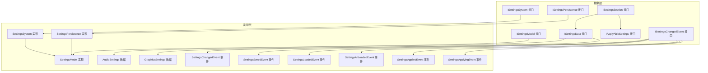
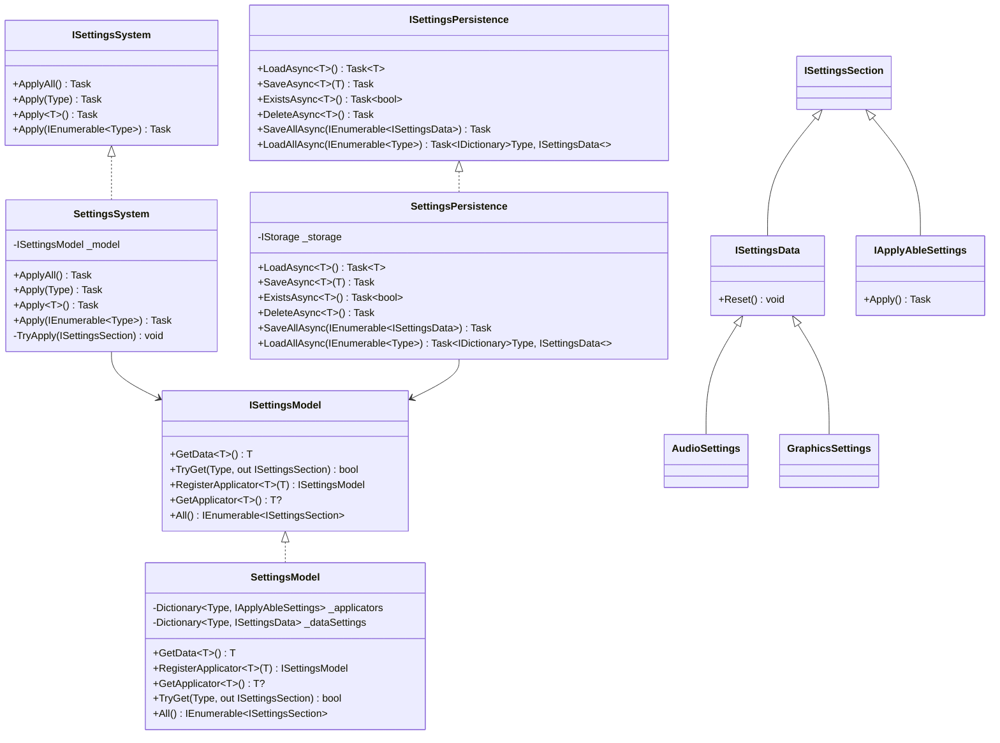
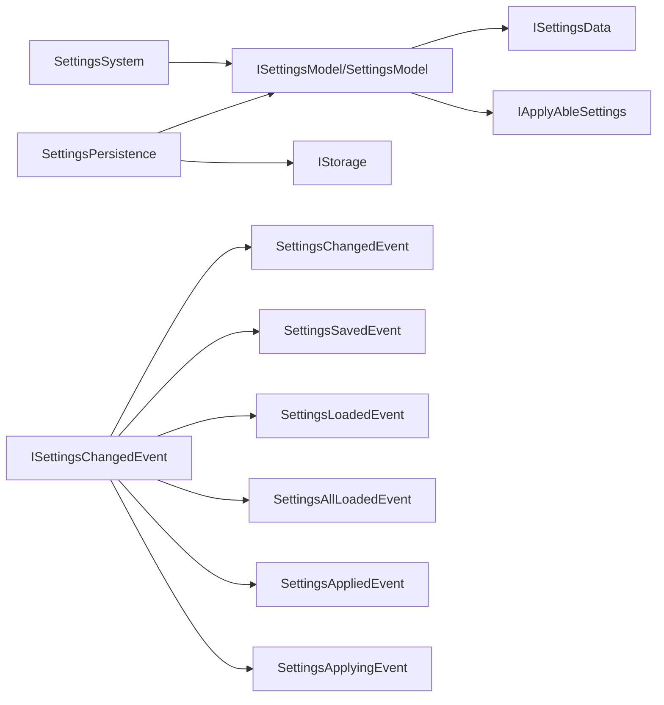

# 设置系统 API

<cite>
**本文引用的文件**
- [ISettingsSystem.cs](file://GFramework.Game.Abstractions/setting/ISettingsSystem.cs)
- [SettingsSystem.cs](file://GFramework.Game/setting/SettingsSystem.cs)
- [ISettingsModel.cs](file://GFramework.Game.Abstractions/setting/ISettingsModel.cs)
- [SettingsModel.cs](file://GFramework.Game/setting/SettingsModel.cs)
- [ISettingsPersistence.cs](file://GFramework.Game.Abstractions/setting/ISettingsPersistence.cs)
- [SettingsPersistence.cs](file://GFramework.Game/setting/SettingsPersistence.cs)
- [ISettingsData.cs](file://GFramework.Game.Abstractions/setting/ISettingsData.cs)
- [ISettingsSection.cs](file://GFramework.Game.Abstractions/setting/ISettingsSection.cs)
- [IApplyAbleSettings.cs](file://GFramework.Game.Abstractions/setting/IApplyAbleSettings.cs)
- [AudioSettings.cs](file://GFramework.Game.Abstractions/setting/AudioSettings.cs)
- [GraphicsSettings.cs](file://GFramework.Game.Abstractions/setting/GraphicsSettings.cs)
- [ISettingsChangedEvent.cs](file://GFramework.Game.Abstractions/setting/ISettingsChangedEvent.cs)
- [SettingsChangedEvent.cs](file://GFramework.Game/setting/events/SettingsChangedEvent.cs)
- [SettingsSavedEvent.cs](file://GFramework.Game/setting/events/SettingsSavedEvent.cs)
- [SettingsLoadedEvent.cs](file://GFramework.Game/setting/events/SettingsLoadedEvent.cs)
- [SettingsAllLoadedEvent.cs](file://GFramework.Game/setting/events/SettingsAllLoadedEvent.cs)
- [SettingsAppliedEvent.cs](file://GFramework.Game/setting/events/SettingsAppliedEvent.cs)
- [SettingsApplyingEvent.cs](file://GFramework.Game/setting/events/SettingsApplyingEvent.cs)
</cite>

## 目录
1. [简介](#简介)
2. [项目结构](#项目结构)
3. [核心组件](#核心组件)
4. [架构总览](#架构总览)
5. [详细组件分析](#详细组件分析)
6. [依赖关系分析](#依赖关系分析)
7. [性能考虑](#性能考虑)
8. [故障排查指南](#故障排查指南)
9. [结论](#结论)
10. [附录：完整 API 参考](#附录完整-api-参考)

## 简介
本文件为 GFramework.Settings 系统的完整 API 参考文档，覆盖以下主题：
- 设置系统接口 ISettingsSystem 的核心方法：应用设置（ApplyAll/Apply/ApplyAsync）。
- 设置模型 ISettingsModel 的数据结构与访问模式：GetData、TryGet、RegisterApplicator、GetApplicator、All。
- 设置持久化 ISettingsPersistence 的存储机制：LoadAsync、SaveAsync、ExistsAsync、DeleteAsync、SaveAllAsync、LoadAllAsync。
- 设置事件系统：设置变更事件 ISettingsChangedEvent 及其实现（SettingsChangedEvent、SettingsSavedEvent、SettingsLoadedEvent、SettingsAllLoadedEvent、SettingsAppliedEvent、SettingsApplyingEvent）的触发时机与使用方式。
- 设置数据接口 ISettingsData 与设置分区接口 ISettingsSection 的职责边界。
- 具体设置类型：音频设置 AudioSettings、图形设置 GraphicsSettings 的 API 说明。
- 常见场景示例：创建自定义设置、实现设置验证、处理设置同步。

## 项目结构
设置系统由“抽象层”和“实现层”组成：
- 抽象层（GFramework.Game.Abstractions）定义接口与数据契约，确保跨平台/引擎解耦。
- 实现层（GFramework.Game）提供具体实现：SettingsSystem、SettingsModel、SettingsPersistence，以及事件与具体设置类型。

图表来源
- [ISettingsSystem.cs](file://GFramework.Game.Abstractions/setting/ISettingsSystem.cs#L1-L32)
- [SettingsSystem.cs](file://GFramework.Game/setting/SettingsSystem.cs#L1-L99)
- [ISettingsModel.cs](file://GFramework.Game.Abstractions/setting/ISettingsModel.cs#L1-L47)
- [SettingsModel.cs](file://GFramework.Game/setting/SettingsModel.cs#L1-L103)
- [ISettingsPersistence.cs](file://GFramework.Game.Abstractions/setting/ISettingsPersistence.cs#L1-L43)
- [SettingsPersistence.cs](file://GFramework.Game/setting/SettingsPersistence.cs#L1-L141)
- [ISettingsData.cs](file://GFramework.Game.Abstractions/setting/ISettingsData.cs#L1-L12)
- [ISettingsSection.cs](file://GFramework.Game.Abstractions/setting/ISettingsSection.cs#L1-L7)
- [IApplyAbleSettings.cs](file://GFramework.Game.Abstractions/setting/IApplyAbleSettings.cs#L1-L14)
- [AudioSettings.cs](file://GFramework.Game.Abstractions/setting/AudioSettings.cs#L1-L32)
- [GraphicsSettings.cs](file://GFramework.Game.Abstractions/setting/GraphicsSettings.cs#L1-L32)
- [ISettingsChangedEvent.cs](file://GFramework.Game.Abstractions/setting/ISettingsChangedEvent.cs#L1-L25)
- [SettingsChangedEvent.cs](file://GFramework.Game/setting/events/SettingsChangedEvent.cs#L1-L32)
- [SettingsSavedEvent.cs](file://GFramework.Game/setting/events/SettingsSavedEvent.cs#L1-L31)
- [SettingsLoadedEvent.cs](file://GFramework.Game/setting/events/SettingsLoadedEvent.cs#L1-L31)
- [SettingsAllLoadedEvent.cs](file://GFramework.Game/setting/events/SettingsAllLoadedEvent.cs#L1-L30)
- [SettingsAppliedEvent.cs](file://GFramework.Game/setting/events/SettingsAppliedEvent.cs#L1-L41)
- [SettingsApplyingEvent.cs](file://GFramework.Game/setting/events/SettingsApplyingEvent.cs#L1-L31)

章节来源
- [ISettingsSystem.cs](file://GFramework.Game.Abstractions/setting/ISettingsSystem.cs#L1-L32)
- [SettingsSystem.cs](file://GFramework.Game/setting/SettingsSystem.cs#L1-L99)
- [ISettingsModel.cs](file://GFramework.Game.Abstractions/setting/ISettingsModel.cs#L1-L47)
- [SettingsModel.cs](file://GFramework.Game/setting/SettingsModel.cs#L1-L103)
- [ISettingsPersistence.cs](file://GFramework.Game.Abstractions/setting/ISettingsPersistence.cs#L1-L43)
- [SettingsPersistence.cs](file://GFramework.Game/setting/SettingsPersistence.cs#L1-L141)
- [ISettingsData.cs](file://GFramework.Game.Abstractions/setting/ISettingsData.cs#L1-L12)
- [ISettingsSection.cs](file://GFramework.Game.Abstractions/setting/ISettingsSection.cs#L1-L7)
- [IApplyAbleSettings.cs](file://GFramework.Game.Abstractions/setting/IApplyAbleSettings.cs#L1-L14)
- [AudioSettings.cs](file://GFramework.Game.Abstractions/setting/AudioSettings.cs#L1-L32)
- [GraphicsSettings.cs](file://GFramework.Game.Abstractions/setting/GraphicsSettings.cs#L1-L32)
- [ISettingsChangedEvent.cs](file://GFramework.Game.Abstractions/setting/ISettingsChangedEvent.cs#L1-L25)
- [SettingsChangedEvent.cs](file://GFramework.Game/setting/events/SettingsChangedEvent.cs#L1-L32)
- [SettingsSavedEvent.cs](file://GFramework.Game/setting/events/SettingsSavedEvent.cs#L1-L31)
- [SettingsLoadedEvent.cs](file://GFramework.Game/setting/events/SettingsLoadedEvent.cs#L1-L31)
- [SettingsAllLoadedEvent.cs](file://GFramework.Game/setting/events/SettingsAllLoadedEvent.cs#L1-L30)
- [SettingsAppliedEvent.cs](file://GFramework.Game/setting/events/SettingsAppliedEvent.cs#L1-L41)
- [SettingsApplyingEvent.cs](file://GFramework.Game/setting/events/SettingsApplyingEvent.cs#L1-L31)

## 核心组件
- ISettingsSystem：提供应用设置的统一入口，支持按类型或批量应用。
- ISettingsModel：集中管理设置数据与可应用设置，提供获取、注册、遍历能力。
- ISettingsPersistence：封装异步持久化操作，屏蔽存储细节。
- ISettingsData/ISettingsSection/IApplyAbleSettings：定义设置的数据契约与可应用行为。
- 具体设置类型：AudioSettings、GraphicsSettings 提供常用配置项与默认值。

章节来源
- [ISettingsSystem.cs](file://GFramework.Game.Abstractions/setting/ISettingsSystem.cs#L1-L32)
- [SettingsSystem.cs](file://GFramework.Game/setting/SettingsSystem.cs#L1-L99)
- [ISettingsModel.cs](file://GFramework.Game.Abstractions/setting/ISettingsModel.cs#L1-L47)
- [SettingsModel.cs](file://GFramework.Game/setting/SettingsModel.cs#L1-L103)
- [ISettingsPersistence.cs](file://GFramework.Game.Abstractions/setting/ISettingsPersistence.cs#L1-L43)
- [SettingsPersistence.cs](file://GFramework.Game/setting/SettingsPersistence.cs#L1-L141)
- [ISettingsData.cs](file://GFramework.Game.Abstractions/setting/ISettingsData.cs#L1-L12)
- [ISettingsSection.cs](file://GFramework.Game.Abstractions/setting/ISettingsSection.cs#L1-L7)
- [IApplyAbleSettings.cs](file://GFramework.Game.Abstractions/setting/IApplyAbleSettings.cs#L1-L14)
- [AudioSettings.cs](file://GFramework.Game.Abstractions/setting/AudioSettings.cs#L1-L32)
- [GraphicsSettings.cs](file://GFramework.Game.Abstractions/setting/GraphicsSettings.cs#L1-L32)

## 架构总览
设置系统采用“接口隔离 + 分层实现”的设计，通过事件总线解耦各模块，支持异步持久化与批量应用。

图表来源
- [ISettingsSystem.cs](file://GFramework.Game.Abstractions/setting/ISettingsSystem.cs#L1-L32)
- [SettingsSystem.cs](file://GFramework.Game/setting/SettingsSystem.cs#L1-L99)
- [ISettingsModel.cs](file://GFramework.Game.Abstractions/setting/ISettingsModel.cs#L1-L47)
- [SettingsModel.cs](file://GFramework.Game/setting/SettingsModel.cs#L1-L103)
- [ISettingsPersistence.cs](file://GFramework.Game.Abstractions/setting/ISettingsPersistence.cs#L1-L43)
- [SettingsPersistence.cs](file://GFramework.Game/setting/SettingsPersistence.cs#L1-L141)
- [ISettingsData.cs](file://GFramework.Game.Abstractions/setting/ISettingsData.cs#L1-L12)
- [ISettingsSection.cs](file://GFramework.Game.Abstractions/setting/ISettingsSection.cs#L1-L7)
- [IApplyAbleSettings.cs](file://GFramework.Game.Abstractions/setting/IApplyAbleSettings.cs#L1-L14)
- [AudioSettings.cs](file://GFramework.Game.Abstractions/setting/AudioSettings.cs#L1-L32)
- [GraphicsSettings.cs](file://GFramework.Game.Abstractions/setting/GraphicsSettings.cs#L1-L32)

## 详细组件分析

### ISettingsSystem：设置应用接口
- ApplyAll：遍历模型中所有设置节，尝试应用可应用设置，并发出应用开始/完成事件。
- Apply(Type)/Apply<T>()：按单个类型应用；若未注册则直接返回。
- Apply(IEnumerable<Type>)：去重后批量应用，提升效率。
- 内部机制：通过模型查询设置节，若实现 IApplyAbleSettings 则调用 Apply 并发送事件；异常时发送失败事件并抛出。

章节来源
- [ISettingsSystem.cs](file://GFramework.Game.Abstractions/setting/ISettingsSystem.cs#L1-L32)
- [SettingsSystem.cs](file://GFramework.Game/setting/SettingsSystem.cs#L1-L99)

### SettingsSystem：设置应用实现
- 依赖注入：OnInit 中获取 ISettingsModel。
- 事件驱动：在应用前发送 SettingsApplyingEvent，成功发送 SettingsAppliedEvent(true)，失败发送 SettingsAppliedEvent(false, ex)。
- 错误处理：捕获异常并重新抛出，保证上层可观测性。

章节来源
- [SettingsSystem.cs](file://GFramework.Game/setting/SettingsSystem.cs#L1-L99)

### ISettingsModel：设置模型接口
- GetData<T>()：自动创建并缓存 ISettingsData 实例，支持 Reset 默认值。
- TryGet：优先从数据设置字典查找，再从可应用设置字典查找。
- RegisterApplicator/GetApplicator：显式注册可应用设置，便于系统应用阶段统一处理。
- All：合并数据设置与可应用设置，提供遍历能力。

章节来源
- [ISettingsModel.cs](file://GFramework.Game.Abstractions/setting/ISettingsModel.cs#L1-L47)
- [SettingsModel.cs](file://GFramework.Game/setting/SettingsModel.cs#L1-L103)

### SettingsModel：设置模型实现
- 字典缓存：分别维护 ISettingsData 与 IApplyAbleSettings 的映射，避免重复实例化。
- TryGet 查找顺序：先数据设置，后可应用设置，确保语义正确。
- All 合并：将两类设置统一暴露为 ISettingsSection 集合。

章节来源
- [SettingsModel.cs](file://GFramework.Game/setting/SettingsModel.cs#L1-L103)

### ISettingsPersistence：设置持久化接口
- LoadAsync<T>()：若存储存在则读取并发送 SettingsLoadedEvent，否则创建新实例并发送事件。
- SaveAsync<T>()：写入存储并发送 SettingsSavedEvent。
- ExistsAsync<T>()：检查键是否存在。
- DeleteAsync<T>()：删除键并发送 SettingsDeletedEvent。
- SaveAllAsync：批量写入所有 ISettingsData。
- LoadAllAsync：按已知类型集合批量读取，聚合为字典并发送 SettingsAllLoadedEvent。

章节来源
- [ISettingsPersistence.cs](file://GFramework.Game.Abstractions/setting/ISettingsPersistence.cs#L1-L43)
- [SettingsPersistence.cs](file://GFramework.Game/setting/SettingsPersistence.cs#L1-L141)

### SettingsPersistence：设置持久化实现
- 存储键命名：统一使用 "Settings_{TypeName}"。
- 反射辅助：LoadAllAsync 中通过反射调用 IStorage.ReadAsync<T>，保证类型安全。
- 事件发布：在每次读写/删除/批量操作后及时发出相应事件。

章节来源
- [SettingsPersistence.cs](file://GFramework.Game/setting/SettingsPersistence.cs#L1-L141)

### ISettingsData 与 ISettingsSection
- ISettingsSection：设置节的最小契约，不携带行为。
- ISettingsData：继承 ISettingsSection，提供 Reset() 以恢复默认值。
- IApplyAbleSettings：继承 ISettingsSection，提供 Apply() 异步应用到系统。

章节来源
- [ISettingsSection.cs](file://GFramework.Game.Abstractions/setting/ISettingsSection.cs#L1-L7)
- [ISettingsData.cs](file://GFramework.Game.Abstractions/setting/ISettingsData.cs#L1-L12)
- [IApplyAbleSettings.cs](file://GFramework.Game.Abstractions/setting/IApplyAbleSettings.cs#L1-L14)

### 具体设置类型：AudioSettings 与 GraphicsSettings
- AudioSettings：主音量、背景音乐音量、音效音量，默认值合理化，Reset 恢复默认。
- GraphicsSettings：全屏、分辨率宽高，默认值合理化，Reset 恢复默认。
- 均实现 ISettingsData，可被持久化与重置。

章节来源
- [AudioSettings.cs](file://GFramework.Game.Abstractions/setting/AudioSettings.cs#L1-L32)
- [GraphicsSettings.cs](file://GFramework.Game.Abstractions/setting/GraphicsSettings.cs#L1-L32)

### 设置事件系统
- ISettingsChangedEvent：事件基接口，包含 SettingsType、Settings、ChangedAt。
- SettingsChangedEvent<T>：通用设置变更事件，携带类型化设置与时间戳。
- SettingsSavedEvent<T>：保存完成事件。
- SettingsLoadedEvent<T>：加载完成事件（含首次创建）。
- SettingsAllLoadedEvent：批量加载完成事件。
- SettingsAppliedEvent<T>：应用完成事件，包含成功标志与异常。
- SettingsApplyingEvent<T>：应用开始事件。

事件触发时机与使用建议：
- 加载：LoadAsync<T>() 成功读取或新建时分别触发 SettingsLoadedEvent<T>。
- 保存：SaveAsync<T>() 成功写入后触发 SettingsSavedEvent<T>。
- 删除：DeleteAsync<T>() 成功删除后触发 SettingsDeletedEvent。
- 批量：SaveAllAsync/LloadAllAsync 分别触发 SettingsBatchSavedEvent 与 SettingsAllLoadedEvent。
- 应用：SettingsSystem 在 TryApply 前后分别触发 SettingsApplyingEvent<T> 与 SettingsAppliedEvent<T>。

章节来源
- [ISettingsChangedEvent.cs](file://GFramework.Game.Abstractions/setting/ISettingsChangedEvent.cs#L1-L25)
- [SettingsChangedEvent.cs](file://GFramework.Game/setting/events/SettingsChangedEvent.cs#L1-L32)
- [SettingsSavedEvent.cs](file://GFramework.Game/setting/events/SettingsSavedEvent.cs#L1-L31)
- [SettingsLoadedEvent.cs](file://GFramework.Game/setting/events/SettingsLoadedEvent.cs#L1-L31)
- [SettingsAllLoadedEvent.cs](file://GFramework.Game/setting/events/SettingsAllLoadedEvent.cs#L1-L30)
- [SettingsAppliedEvent.cs](file://GFramework.Game/setting/events/SettingsAppliedEvent.cs#L1-L41)
- [SettingsApplyingEvent.cs](file://GFramework.Game/setting/events/SettingsApplyingEvent.cs#L1-L31)

## 依赖关系分析
- SettingsSystem 依赖 ISettingsModel；SettingsPersistence 依赖 ISettingsModel 与 IStorage。
- SettingsModel 维护两类设置的内部字典，对外统一暴露 ISettingsSection。
- 事件系统通过 ISettingsChangedEvent 作为多态基类，实现松耦合。

图表来源
- [SettingsSystem.cs](file://GFramework.Game/setting/SettingsSystem.cs#L1-L99)
- [SettingsModel.cs](file://GFramework.Game/setting/SettingsModel.cs#L1-L103)
- [SettingsPersistence.cs](file://GFramework.Game/setting/SettingsPersistence.cs#L1-L141)
- [ISettingsChangedEvent.cs](file://GFramework.Game.Abstractions/setting/ISettingsChangedEvent.cs#L1-L25)
- [SettingsChangedEvent.cs](file://GFramework.Game/setting/events/SettingsChangedEvent.cs#L1-L32)
- [SettingsSavedEvent.cs](file://GFramework.Game/setting/events/SettingsSavedEvent.cs#L1-L31)
- [SettingsLoadedEvent.cs](file://GFramework.Game/setting/events/SettingsLoadedEvent.cs#L1-L31)
- [SettingsAllLoadedEvent.cs](file://GFramework.Game/setting/events/SettingsAllLoadedEvent.cs#L1-L30)
- [SettingsAppliedEvent.cs](file://GFramework.Game/setting/events/SettingsAppliedEvent.cs#L1-L41)
- [SettingsApplyingEvent.cs](file://GFramework.Game/setting/events/SettingsApplyingEvent.cs#L1-L31)

## 性能考虑
- 批量应用：SettingsSystem.Apply(IEnumerable<Type>) 对类型进行去重，减少重复查找与应用开销。
- 缓存策略：SettingsModel 对 ISettingsData 与 IApplyAbleSettings 进行字典缓存，避免重复实例化。
- 异步 I/O：SettingsPersistence 使用异步读写，避免阻塞主线程；LoadAllAsync 通过反射调用泛型方法，注意仅在启动或加载阶段使用。
- 事件风暴：大量设置同时保存/加载时，建议聚合事件或限流，避免 UI 或日志系统过载。

## 故障排查指南
- 应用失败：检查 SettingsAppliedEvent 是否携带异常；确认 IApplyAbleSettings.Apply 实现幂等与异常处理。
- 未生效：确认设置类型已在 SettingsModel 中注册（RegisterApplicator），或通过 GetData 自动创建的数据是否被系统应用。
- 持久化异常：核对存储键命名规则（Settings_{TypeName}）与序列化兼容性；检查 IStorage 实现。
- 事件未触发：确认事件总线可用，且系统在关键路径（加载/保存/应用）中调用了 SendEvent。

章节来源
- [SettingsSystem.cs](file://GFramework.Game/setting/SettingsSystem.cs#L1-L99)
- [SettingsPersistence.cs](file://GFramework.Game/setting/SettingsPersistence.cs#L1-L141)
- [SettingsModel.cs](file://GFramework.Game/setting/SettingsModel.cs#L1-L103)

## 结论
GFramework.Settings 通过清晰的接口分层与事件驱动，提供了可扩展、可测试、可持久化的设置管理方案。开发者可通过 ISettingsData 快速声明配置项，通过 IApplyAbleSettings 将配置应用到系统，借助 ISettingsPersistence 实现跨会话的持久化，并通过事件系统实现可观测与解耦。

## 附录：完整 API 参考

### ISettingsSystem
- ApplyAll() → Task：应用所有可应用设置。
- Apply(Type) → Task：按类型应用设置。
- Apply<T>() → Task：泛型版本按类型应用。
- Apply(IEnumerable<Type>) → Task：批量应用多个类型。

章节来源
- [ISettingsSystem.cs](file://GFramework.Game.Abstractions/setting/ISettingsSystem.cs#L1-L32)
- [SettingsSystem.cs](file://GFramework.Game/setting/SettingsSystem.cs#L1-L99)

### ISettingsModel
- GetData<T>() → T：获取或创建 ISettingsData 实例。
- TryGet(Type, out ISettingsSection) → bool：按类型查找设置节。
- RegisterApplicator<T>(T) → ISettingsModel：注册可应用设置。
- GetApplicator<T>() → T?：获取已注册可应用设置。
- All() → IEnumerable<ISettingsSection>：获取全部设置节。

章节来源
- [ISettingsModel.cs](file://GFramework.Game.Abstractions/setting/ISettingsModel.cs#L1-L47)
- [SettingsModel.cs](file://GFramework.Game/setting/SettingsModel.cs#L1-L103)

### ISettingsPersistence
- LoadAsync<T>() → Task<T>：异步加载指定类型设置。
- SaveAsync<T>(T) → Task：异步保存设置。
- ExistsAsync<T>() → Task<bool>：检查设置是否存在。
- DeleteAsync<T>() → Task：异步删除设置。
- SaveAllAsync(IEnumerable<ISettingsData>) → Task：批量保存。
- LoadAllAsync(IEnumerable<Type>) → Task<IDictionary<Type, ISettingsData>>：批量加载。

章节来源
- [ISettingsPersistence.cs](file://GFramework.Game.Abstractions/setting/ISettingsPersistence.cs#L1-L43)
- [SettingsPersistence.cs](file://GFramework.Game/setting/SettingsPersistence.cs#L1-L141)

### ISettingsData 与 ISettingsSection
- ISettingsSection：设置节契约。
- ISettingsData：继承 ISettingsSection，提供 Reset()。

章节来源
- [ISettingsSection.cs](file://GFramework.Game.Abstractions/setting/ISettingsSection.cs#L1-L7)
- [ISettingsData.cs](file://GFramework.Game.Abstractions/setting/ISettingsData.cs#L1-L12)

### IApplyAbleSettings
- Apply() → Task：将设置应用到系统。

章节来源
- [IApplyAbleSettings.cs](file://GFramework.Game.Abstractions/setting/IApplyAbleSettings.cs#L1-L14)

### 具体设置类型
- AudioSettings：主音量、BGM 音量、SFX 音量，默认值与 Reset。
- GraphicsSettings：全屏、分辨率宽高，默认值与 Reset。

章节来源
- [AudioSettings.cs](file://GFramework.Game.Abstractions/setting/AudioSettings.cs#L1-L32)
- [GraphicsSettings.cs](file://GFramework.Game.Abstractions/setting/GraphicsSettings.cs#L1-L32)

### 设置事件
- ISettingsChangedEvent：SettingsType、Settings、ChangedAt。
- SettingsChangedEvent<T>：通用变更事件。
- SettingsSavedEvent<T>：保存完成事件。
- SettingsLoadedEvent<T>：加载完成事件。
- SettingsAllLoadedEvent：批量加载完成事件。
- SettingsAppliedEvent<T>：应用完成事件（含成功/失败与异常）。
- SettingsApplyingEvent<T>：应用开始事件。

章节来源
- [ISettingsChangedEvent.cs](file://GFramework.Game.Abstractions/setting/ISettingsChangedEvent.cs#L1-L25)
- [SettingsChangedEvent.cs](file://GFramework.Game/setting/events/SettingsChangedEvent.cs#L1-L32)
- [SettingsSavedEvent.cs](file://GFramework.Game/setting/events/SettingsSavedEvent.cs#L1-L31)
- [SettingsLoadedEvent.cs](file://GFramework.Game/setting/events/SettingsLoadedEvent.cs#L1-L31)
- [SettingsAllLoadedEvent.cs](file://GFramework.Game/setting/events/SettingsAllLoadedEvent.cs#L1-L30)
- [SettingsAppliedEvent.cs](file://GFramework.Game/setting/events/SettingsAppliedEvent.cs#L1-L41)
- [SettingsApplyingEvent.cs](file://GFramework.Game/setting/events/SettingsApplyingEvent.cs#L1-L31)

### 常见场景示例（步骤说明）
- 创建自定义设置
  - 定义一个实现 ISettingsData 的类，提供字段与 Reset()。
  - 在系统初始化时通过 SettingsModel.GetData<T>() 获取实例，或在需要时注册为可应用设置。
  - 参考路径：[ISettingsData.cs](file://GFramework.Game.Abstractions/setting/ISettingsData.cs#L1-L12)，[SettingsModel.cs](file://GFramework.Game/setting/SettingsModel.cs#L1-L103)
- 实现设置验证
  - 在设置赋值处添加范围校验（如音量 0~1），并在失败时记录日志或回滚。
  - 参考路径：[AudioSettings.cs](file://GFramework.Game.Abstractions/setting/AudioSettings.cs#L1-L32)
- 处理设置同步
  - 使用 SettingsPersistence.SaveAsync<T>() 保存，监听 SettingsSavedEvent<T> 确认完成。
  - 参考路径：[ISettingsPersistence.cs](file://GFramework.Game.Abstractions/setting/ISettingsPersistence.cs#L1-L43)，[SettingsPersistence.cs](file://GFramework.Game/setting/SettingsPersistence.cs#L1-L141)，[SettingsSavedEvent.cs](file://GFramework.Game/setting/events/SettingsSavedEvent.cs#L1-L31)
- 应用设置到系统
  - 将设置实现 IApplyAbleSettings 并在 SettingsSystem.Apply* 调用时自动应用。
  - 参考路径：[IApplyAbleSettings.cs](file://GFramework.Game.Abstractions/setting/IApplyAbleSettings.cs#L1-L14)，[SettingsSystem.cs](file://GFramework.Game/setting/SettingsSystem.cs#L1-L99)