# Godot API 参考

<cite>
**本文档引用的文件**
- [GFramework.Godot.csproj](file://GFramework.Godot/GFramework.Godot.csproj)
- [README.md](file://GFramework.Godot/README.md)
- [IGodotModule.cs](file://GFramework.Godot/architecture/IGodotModule.cs)
- [AbstractGodotModule.cs](file://GFramework.Godot/architecture/AbstractGodotModule.cs)
- [AbstractArchitecture.cs](file://GFramework.Godot/architecture/AbstractArchitecture.cs)
- [ArchitectureAnchor.cs](file://GFramework.Godot/architecture/ArchitectureAnchor.cs)
- [NodeExtensions.cs](file://GFramework.Godot/extensions/NodeExtensions.cs)
- [SignalBuilder.cs](file://GFramework.Godot/extensions/signal/SignalBuilder.cs)
- [SignalFluentExtensions.cs](file://GFramework.Godot/extensions/signal/SignalFluentExtensions.cs)
- [AbstractNodePoolSystem.cs](file://GFramework.Godot/pool/AbstractNodePoolSystem.cs)
- [IPoolableNode.cs](file://GFramework.Godot/pool/IPoolableNode.cs)
- [IGodotSceneRegistry.cs](file://GFramework.Godot/scene/IGodotSceneRegistry.cs)
- [GodotSceneRegistry.cs](file://GFramework.Godot/scene/GodotSceneRegistry.cs)
- [IGodotUiRegistry.cs](file://GFramework.Godot/ui/IGodotUiRegistry.cs)
- [GodotUiRegistry.cs](file://GFramework.Godot/ui/GodotUiRegistry.cs)
- [GodotUiFactory.cs](file://GFramework.Godot/ui/GodotUiFactory.cs)
- [GodotFileStorage.cs](file://GFramework.Godot/storage/GodotFileStorage.cs)
- [GodotLogger.cs](file://GFramework.Godot/logging/GodotLogger.cs)
- [GodotLoggerFactory.cs](file://GFramework.Godot/logging/GodotLoggerFactory.cs)
</cite>

## 目录
1. [简介](#简介)
2. [项目结构](#项目结构)
3. [核心组件](#核心组件)
4. [架构总览](#架构总览)
5. [详细组件分析](#详细组件分析)
6. [依赖分析](#依赖分析)
7. [性能考虑](#性能考虑)
8. [故障排查指南](#故障排查指南)
9. [结论](#结论)
10. [附录](#附录)

## 简介
本文件为 GFramework.Godot 模块的详细 API 参考，覆盖与 Godot 引擎集成的接口与类，包括架构集成接口（IArchitecture、IGodotModule）、节点扩展接口（NodeExtensions、SignalBuilder）、场景注册接口（IGodotSceneRegistry）、UI 注册接口（IGodotUiRegistry）、文件存储接口（IFileStorage）等。文档还详细说明 Godot 特有的扩展方法、信号处理机制、资源池化系统、UI 工厂接口、Godot 生命周期绑定、节点管理、场景管理的 API 文档，并提供 Godot 项目集成的完整指南与最佳实践，以及与 Unity 或其他游戏引擎的差异与迁移注意事项，最后包含 Godot 特有的性能优化与调试技巧。

## 项目结构
GFramework.Godot 作为 Godot 特定实现，主要包含以下模块：
- architecture：Godot 架构集成与模块系统
- extensions：节点扩展与信号流畅 API
- pool：节点对象池系统
- scene：场景注册表
- ui：UI 注册表与 UI 工厂
- storage：Godot 文件存储
- logging：Godot 日志系统

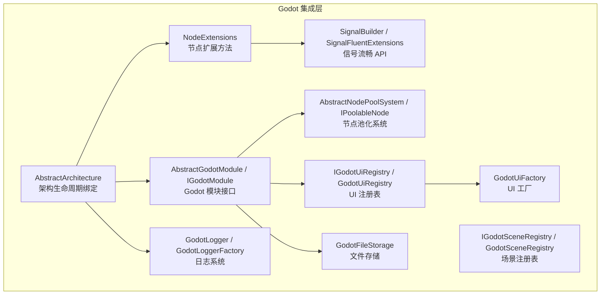

图表来源
- [AbstractArchitecture.cs](file://GFramework.Godot/architecture/AbstractArchitecture.cs#L14-L140)
- [AbstractGodotModule.cs](file://GFramework.Godot/architecture/AbstractGodotModule.cs#L11-L55)
- [NodeExtensions.cs](file://GFramework.Godot/extensions/NodeExtensions.cs#L8-L259)
- [SignalBuilder.cs](file://GFramework.Godot/extensions/signal/SignalBuilder.cs#L10-L65)
- [AbstractNodePoolSystem.cs](file://GFramework.Godot/pool/AbstractNodePoolSystem.cs#L11-L32)
- [IGodotSceneRegistry.cs](file://GFramework.Godot/scene/IGodotSceneRegistry.cs#L1-L9)
- [GodotSceneRegistry.cs](file://GFramework.Godot/scene/GodotSceneRegistry.cs#L11-L12)
- [IGodotUiRegistry.cs](file://GFramework.Godot/ui/IGodotUiRegistry.cs#L1-L10)
- [GodotUiRegistry.cs](file://GFramework.Godot/ui/GodotUiRegistry.cs#L11-L12)
- [GodotUiFactory.cs](file://GFramework.Godot/ui/GodotUiFactory.cs#L16-L463)
- [GodotFileStorage.cs](file://GFramework.Godot/storage/GodotFileStorage.cs#L15-L291)
- [GodotLogger.cs](file://GFramework.Godot/logging/GodotLogger.cs#L10-L42)
- [GodotLoggerFactory.cs](file://GFramework.Godot/logging/GodotLoggerFactory.cs#L8-L19)

章节来源
- [GFramework.Godot.csproj](file://GFramework.Godot/GFramework.Godot.csproj#L1-L22)
- [README.md](file://GFramework.Godot/README.md#L1-L893)

## 核心组件
本节概览 GFramework.Godot 的核心接口与类，重点说明与 Godot 引擎交互的关键能力。

- 架构集成接口
  - IGodotModule：定义 Godot 模块的节点引用、附加/分离回调与安装方法
  - AbstractGodotModule：模块抽象基类，提供阶段回调与安装/附加/分离的默认实现
  - AbstractArchitecture：将架构与 Godot 生命周期绑定，创建架构锚点节点，安装模块并统一销毁
  - ArchitectureAnchor：架构锚点节点，提供退出场景树时的回调绑定与清理

- 节点扩展与信号
  - NodeExtensions：提供节点安全释放、等待就绪、节点查找与验证、输入处理、树遍历、延迟调用等扩展方法
  - SignalBuilder / SignalFluentExtensions：流畅的信号连接 API，支持链式调用、一次性连接、立即调用与生命周期绑定

- 资源与 UI
  - IGodotSceneRegistry / GodotSceneRegistry：基于键值的场景注册表，管理 PackedScene 资源
  - IGodotUiRegistry / GodotUiRegistry：基于键值的 UI 注册表，管理 PackedScene 资源
  - GodotUiFactory：UI 页面实例创建与缓存/池化管理，支持预加载、LRU/LFU 淘汰策略、命中率统计

- 资源池化
  - AbstractNodePoolSystem：基于场景实例化的节点池系统，继承通用对象池并实现节点特化创建
  - IPoolableNode：可池化节点接口，提供 Node 转换能力

- 文件存储
  - GodotFileStorage：支持 res://、user:// 与普通文件路径的文件存储，提供线程安全（按 key 锁）、序列化读写与存在性检查

- 日志系统
  - GodotLogger / GodotLoggerFactory：与 Godot 日志系统集成的日志记录器与工厂，按级别输出到控制台

章节来源
- [IGodotModule.cs](file://GFramework.Godot/architecture/IGodotModule.cs#L10-L27)
- [AbstractGodotModule.cs](file://GFramework.Godot/architecture/AbstractGodotModule.cs#L11-L55)
- [AbstractArchitecture.cs](file://GFramework.Godot/architecture/AbstractArchitecture.cs#L14-L140)
- [ArchitectureAnchor.cs](file://GFramework.Godot/architecture/ArchitectureAnchor.cs#L9-L35)
- [NodeExtensions.cs](file://GFramework.Godot/extensions/NodeExtensions.cs#L8-L259)
- [SignalBuilder.cs](file://GFramework.Godot/extensions/signal/SignalBuilder.cs#L10-L65)
- [SignalFluentExtensions.cs](file://GFramework.Godot/extensions/signal/SignalFluentExtensions.cs#L8-L22)
- [IGodotSceneRegistry.cs](file://GFramework.Godot/scene/IGodotSceneRegistry.cs#L1-L9)
- [GodotSceneRegistry.cs](file://GFramework.Godot/scene/GodotSceneRegistry.cs#L11-L12)
- [IGodotUiRegistry.cs](file://GFramework.Godot/ui/IGodotUiRegistry.cs#L1-L10)
- [GodotUiRegistry.cs](file://GFramework.Godot/ui/GodotUiRegistry.cs#L11-L12)
- [GodotUiFactory.cs](file://GFramework.Godot/ui/GodotUiFactory.cs#L16-L463)
- [AbstractNodePoolSystem.cs](file://GFramework.Godot/pool/AbstractNodePoolSystem.cs#L11-L32)
- [IPoolableNode.cs](file://GFramework.Godot/pool/IPoolableNode.cs#L10-L17)
- [GodotFileStorage.cs](file://GFramework.Godot/storage/GodotFileStorage.cs#L15-L291)
- [GodotLogger.cs](file://GFramework.Godot/logging/GodotLogger.cs#L10-L42)
- [GodotLoggerFactory.cs](file://GFramework.Godot/logging/GodotLoggerFactory.cs#L8-L19)

## 架构总览
GFramework.Godot 的架构通过 AbstractArchitecture 将框架生命周期与 Godot 场景树绑定，创建唯一的架构锚点节点，安装模块并将模块节点作为锚点子节点，实现与 Godot 生命周期的无缝衔接。模块通过 IGodotModule 接口声明自身节点与生命周期回调，支持阶段驱动的初始化与清理。

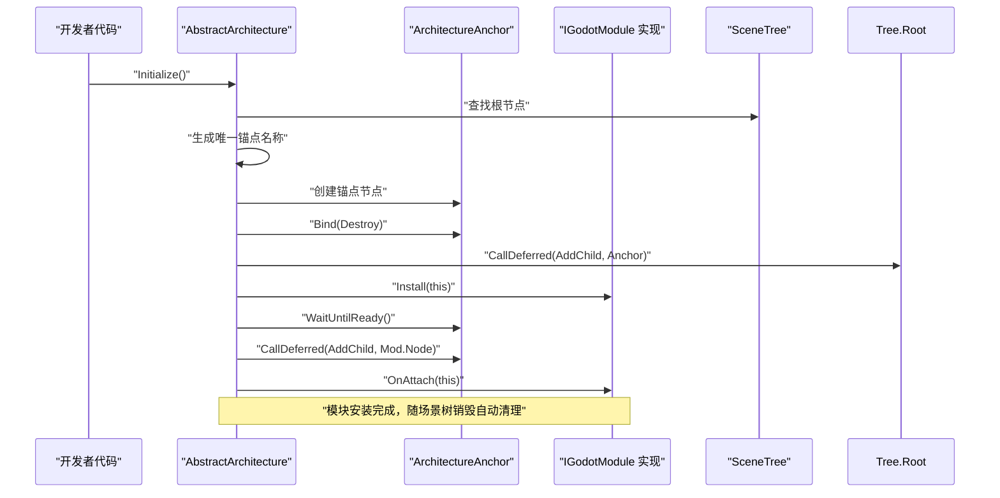

图表来源
- [AbstractArchitecture.cs](file://GFramework.Godot/architecture/AbstractArchitecture.cs#L56-L119)
- [ArchitectureAnchor.cs](file://GFramework.Godot/architecture/ArchitectureAnchor.cs#L17-L34)

章节来源
- [AbstractArchitecture.cs](file://GFramework.Godot/architecture/AbstractArchitecture.cs#L14-L140)
- [ArchitectureAnchor.cs](file://GFramework.Godot/architecture/ArchitectureAnchor.cs#L9-L35)

## 详细组件分析

### 架构集成接口（IArchitecture、IGodotModule）
- IGodotModule
  - Node：模块关联的 Godot 节点
  - OnAttach(Architecture)：模块附加到架构时调用
  - OnDetach()：模块从架构分离时调用
- AbstractGodotModule
  - Install(Architecture)：安装模块到架构
  - OnPhase(phase, architecture) / OnArchitecturePhase(phase)：阶段回调
  - OnAttach / OnDetach 默认空实现，便于按需覆写

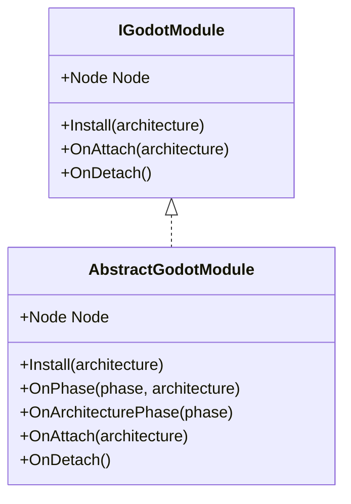

图表来源
- [IGodotModule.cs](file://GFramework.Godot/architecture/IGodotModule.cs#L10-L27)
- [AbstractGodotModule.cs](file://GFramework.Godot/architecture/AbstractGodotModule.cs#L11-L55)

章节来源
- [IGodotModule.cs](file://GFramework.Godot/architecture/IGodotModule.cs#L1-L27)
- [AbstractGodotModule.cs](file://GFramework.Godot/architecture/AbstractGodotModule.cs#L1-L55)

### 节点扩展接口（NodeExtensions）
NodeExtensions 提供大量安全、便捷的节点操作扩展，覆盖节点释放、等待就绪、节点查找与验证、输入处理、树遍历、延迟调用与类型转换等。

- 节点释放与等待
  - QueueFreeX(node) / FreeX(node)：安全释放，带空值与有效性检查
  - WaitUntilReady(node)：未在场景树内时等待 Ready 信号
- 节点验证与查找
  - IsValidNode(node) / IsInvalidNode(node)：组合检查节点有效性
  - FindChildX<T>(node, name, recursive)：安全递归查找子节点
- 输入与场景树控制
  - SetInputAsHandled(node)：标记输入已处理
  - DisableInput(node) / EnableInput(node)：控制 GUI 输入
  - Paused(node, paused)：设置场景树暂停状态
- 场景树操作
  - AddChildX(parent, child)：异步添加子节点并等待就绪
  - GetParentX<T>(node) / GetRootNodeX(node)：安全获取父节点与根节点
  - ForEachChild<T>(node, action)：按类型遍历子节点
- 调试与辅助
  - LogNodePath(node) / PrintTreeX(node, indent)：打印节点路径与树结构
  - SafeCallDeferred(node, method)：安全延迟调用
  - OfType<T>(node)：类型转换并抛出异常

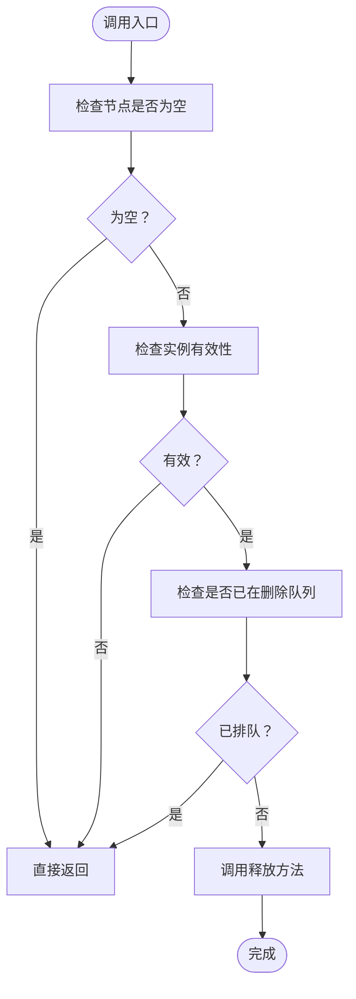

图表来源
- [NodeExtensions.cs](file://GFramework.Godot/extensions/NodeExtensions.cs#L14-L46)

章节来源
- [NodeExtensions.cs](file://GFramework.Godot/extensions/NodeExtensions.cs#L8-L259)

### 信号处理机制（SignalBuilder、SignalFluentExtensions）
SignalBuilder 提供流畅的信号连接 API，支持：
- WithFlags(flags)：设置连接标志
- To(callable, flags?)：连接信号到可调用对象
- ToAndCall(callable, flags?, args)：连接后立即调用
- End()：显式结束，返回目标对象

SignalFluentExtensions 为 GodotObject 提供 Signal(object, signal) 扩展，快速创建 SignalBuilder。

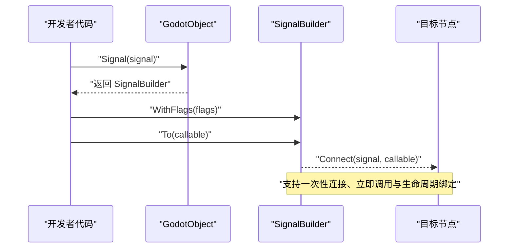

图表来源
- [SignalFluentExtensions.cs](file://GFramework.Godot/extensions/signal/SignalFluentExtensions.cs#L16-L22)
- [SignalBuilder.cs](file://GFramework.Godot/extensions/signal/SignalBuilder.cs#L19-L55)

章节来源
- [SignalFluentExtensions.cs](file://GFramework.Godot/extensions/signal/SignalFluentExtensions.cs#L1-L22)
- [SignalBuilder.cs](file://GFramework.Godot/extensions/signal/SignalBuilder.cs#L1-L65)

### 资源池化系统（AbstractNodePoolSystem、IPoolableNode）
AbstractNodePoolSystem 为 Godot 节点对象池系统，继承通用对象池并实现基于场景实例化的创建逻辑；IPoolableNode 定义可池化节点的 Node 转换能力。

- 关键点
  - LoadScene(key)：抽象方法，用于加载 PackedScene
  - Create(key)：基于场景实例化节点
  - 与 Godot 节点生命周期配合，支持可见性切换、父节点移除与延迟释放

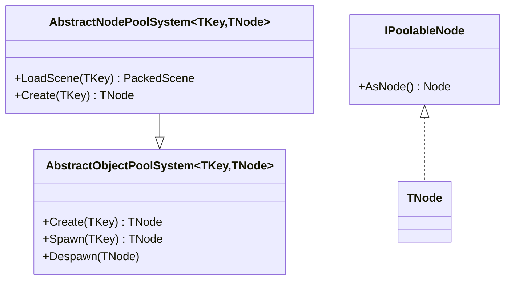

图表来源
- [AbstractNodePoolSystem.cs](file://GFramework.Godot/pool/AbstractNodePoolSystem.cs#L11-L32)
- [IPoolableNode.cs](file://GFramework.Godot/pool/IPoolableNode.cs#L10-L17)

章节来源
- [AbstractNodePoolSystem.cs](file://GFramework.Godot/pool/AbstractNodePoolSystem.cs#L1-L32)
- [IPoolableNode.cs](file://GFramework.Godot/pool/IPoolableNode.cs#L1-L17)

### 场景注册接口（IGodotSceneRegistry、GodotSceneRegistry）
- IGodotSceneRegistry：基于键值的场景注册表接口，值类型为 PackedScene
- GodotSceneRegistry：继承键值注册表基类，使用字符串键与 PackedScene 值进行存储与访问

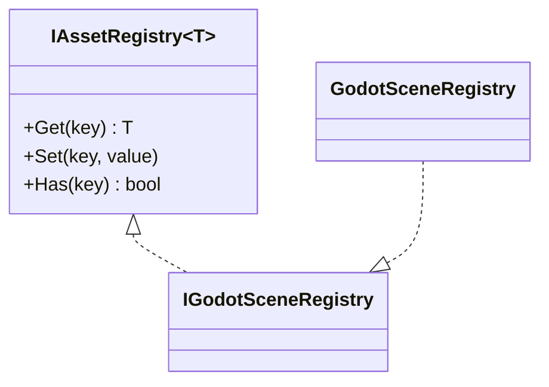

图表来源
- [IGodotSceneRegistry.cs](file://GFramework.Godot/scene/IGodotSceneRegistry.cs#L1-L9)
- [GodotSceneRegistry.cs](file://GFramework.Godot/scene/GodotSceneRegistry.cs#L11-L12)

章节来源
- [IGodotSceneRegistry.cs](file://GFramework.Godot/scene/IGodotSceneRegistry.cs#L1-L9)
- [GodotSceneRegistry.cs](file://GFramework.Godot/scene/GodotSceneRegistry.cs#L1-L12)

### UI 注册与工厂（IGodotUiRegistry、GodotUiRegistry、GodotUiFactory）
- IGodotUiRegistry / GodotUiRegistry：基于键值的 UI 注册表，值类型为 PackedScene
- GodotUiFactory：UI 页面实例创建与缓存/池化管理
  - GetOrCreate(uiKey, policy)：根据策略创建或复用实例
  - Create(uiKey)：直接创建新实例
  - Preload(uiKey, count) / PreloadBatch(uiKeys)：批量预加载隐藏实例
  - Recycle(page)：回收实例到缓存池，更新统计与访问追踪
  - SetCacheConfig(uiKey, config) / GetCacheConfig(uiKey) / RemoveCacheConfig(uiKey)：缓存配置管理
  - ClearCache(uiKey) / ClearAllCache()：清理指定或全部缓存
  - HasCached(uiKey)：检查是否有缓存实例
  - GetCacheStatistics()：获取缓存命中率等统计信息
  - 淘汰策略：LRU（按访问时间）与 LFU（按访问次数），支持最大缓存大小与淘汰策略配置

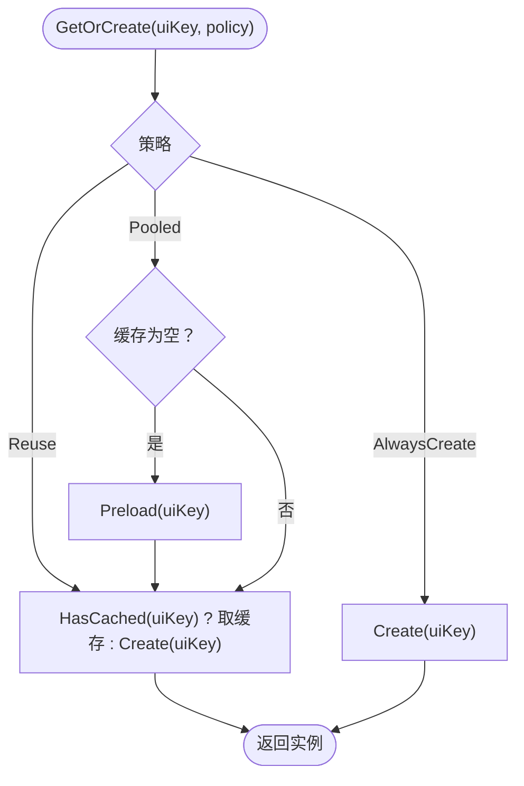

图表来源
- [GodotUiFactory.cs](file://GFramework.Godot/ui/GodotUiFactory.cs#L67-L75)
- [GodotUiFactory.cs](file://GFramework.Godot/ui/GodotUiFactory.cs#L253-L288)

章节来源
- [IGodotUiRegistry.cs](file://GFramework.Godot/ui/IGodotUiRegistry.cs#L1-L10)
- [GodotUiRegistry.cs](file://GFramework.Godot/ui/GodotUiRegistry.cs#L11-L12)
- [GodotUiFactory.cs](file://GFramework.Godot/ui/GodotUiFactory.cs#L16-L463)

### 文件存储接口（GodotFileStorage）
GodotFileStorage 实现 IStorage，支持：
- Delete(key)：删除文件（支持 res:// 与 user:// 虚拟路径与普通文件系统路径）
- Exists(key) / ExistsAsync(key)：检查文件是否存在
- Read<T>(key) / Read<T>(key, defaultValue) / ReadAsync<T>(key)：读取并反序列化
- Write<T>(key, value) / WriteAsync<T>(key, value)：序列化并写入
- 线程安全：按绝对路径生成 keyLock，每个 key 对应独立锁
- 路径处理：清理非法字符、规范化路径、Godot 虚拟路径与本地文件系统路径分别处理

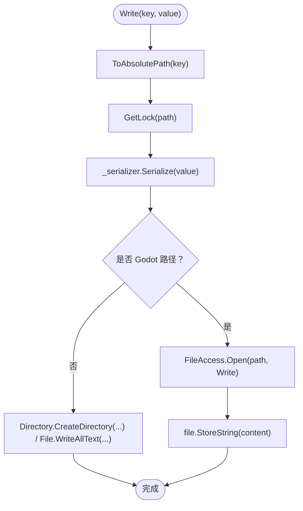

图表来源
- [GodotFileStorage.cs](file://GFramework.Godot/storage/GodotFileStorage.cs#L256-L276)
- [GodotFileStorage.cs](file://GFramework.Godot/storage/GodotFileStorage.cs#L85-L114)

章节来源
- [GodotFileStorage.cs](file://GFramework.Godot/storage/GodotFileStorage.cs#L15-L291)

### 日志系统（GodotLogger、GodotLoggerFactory）
- GodotLogger：继承抽象日志器，按级别输出到 GD.Print、GD.PrintErr、GD.PushWarning、GD.PushError
- GodotLoggerFactory：创建 GodotLogger 实例，支持最小日志级别配置

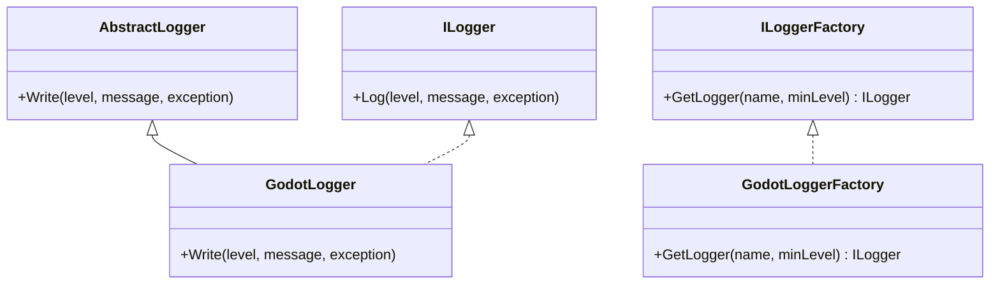

图表来源
- [GodotLogger.cs](file://GFramework.Godot/logging/GodotLogger.cs#L10-L42)
- [GodotLoggerFactory.cs](file://GFramework.Godot/logging/GodotLoggerFactory.cs#L8-L19)

章节来源
- [GodotLogger.cs](file://GFramework.Godot/logging/GodotLogger.cs#L1-L42)
- [GodotLoggerFactory.cs](file://GFramework.Godot/logging/GodotLoggerFactory.cs#L1-L19)

## 依赖分析
GFramework.Godot 通过项目引用与接口契约与其他模块协作：
- 项目引用
  - GFramework.Game：游戏层实现与抽象
  - GFramework.Game.Abstractions：游戏抽象接口
  - GFramework.Core.Abstractions：核心抽象接口
- 关键依赖关系
  - AbstractArchitecture 依赖 Godot SceneTree 与 ArchitectureAnchor
  - GodotUiFactory 依赖 IGodotUiRegistry 与 IUiPageBehaviorProvider
  - GodotFileStorage 依赖 ISerializer 与 Godot 文件访问 API
  - 日志系统依赖 Godot 日志输出 API

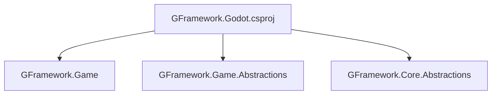

图表来源
- [GFramework.Godot.csproj](file://GFramework.Godot/GFramework.Godot.csproj#L16-L20)

章节来源
- [GFramework.Godot.csproj](file://GFramework.Godot/GFramework.Godot.csproj#L1-L22)

## 性能考虑
- 节点池化
  - 使用 AbstractNodePoolSystem 与 IPoolableNode 管理高频创建/销毁的节点，减少 GC 压力与卡顿
  - 预加载隐藏实例，降低 UI 切换与特效触发时的瞬时开销
- 缓存与淘汰
  - GodotUiFactory 支持 LRU/LFU 淘汰策略，结合最大缓存大小限制内存占用
  - 命中率统计帮助评估缓存效果，指导预加载数量与策略调整
- 文件存储
  - 按 key 锁保证并发安全，避免竞态；合理拆分 key，降低锁竞争
  - 读写采用 UTF-8 文本序列化，注意大文件与频繁 IO 的异步化
- 信号与事件
  - 使用 SignalBuilder 进行一次性连接与生命周期绑定，避免泄漏
  - 事件订阅建议在节点退出时自动解绑，减少内存泄漏风险

## 故障排查指南
- 节点释放与生命周期
  - 使用 QueueFreeX / FreeX 替代直接释放，避免在当前帧释放导致的异常
  - 确保节点在场景树内再进行操作，使用 WaitUntilReady 等待就绪
- 信号连接泄漏
  - 使用 SignalBuilder 链式 API 并在节点退出时自动解绑
  - 避免直接 += 事件订阅，推荐框架事件系统与自动清理扩展
- UI 缓存问题
  - 检查缓存配置与淘汰策略是否合理，必要时清理缓存或调整最大容量
  - 使用 GetCacheStatistics 观察命中率，定位缓存不足或过度缓存
- 文件存储错误
  - 检查路径合法性与 Godot 虚拟路径支持，避免 '..' 与空键
  - 注意并发写入时的锁竞争，必要时合并写入或使用异步接口
- 日志输出
  - 确认日志级别与工厂配置，避免过多低级别日志影响性能

章节来源
- [NodeExtensions.cs](file://GFramework.Godot/extensions/NodeExtensions.cs#L14-L46)
- [SignalBuilder.cs](file://GFramework.Godot/extensions/signal/SignalBuilder.cs#L19-L55)
- [GodotUiFactory.cs](file://GFramework.Godot/ui/GodotUiFactory.cs#L193-L201)
- [GodotFileStorage.cs](file://GFramework.Godot/storage/GodotFileStorage.cs#L85-L114)
- [GodotLogger.cs](file://GFramework.Godot/logging/GodotLogger.cs#L14-L41)

## 结论
GFramework.Godot 通过清晰的接口与强大的扩展能力，实现了与 Godot 引擎的深度集成。架构生命周期绑定、节点扩展、信号流畅 API、资源池化、UI 工厂、文件存储与日志系统共同构成了一套高效、安全、可维护的开发体系。遵循本文档的最佳实践与性能建议，可显著提升开发效率与运行性能。

## 附录
- 与 Unity 的差异与迁移注意事项
  - 生命周期绑定：Godot 通过 SceneTree 与节点生命周期绑定，Unity 通过 MonoBehaviour 生命周期与协程管理；迁移时需将 Unity 的 Start/Awake 映射到 Godot 的 _Ready/_EnterTree 等
  - 信号与事件：Godot 使用 Connect/Disconnect 与 Signal 属性，Unity 使用 C# 事件或 UnityEvent；迁移时建议统一使用框架事件系统并配合自动清理扩展
  - 节点管理：Godot 的节点树与父子关系管理更为严格，迁移时需确保节点释放与场景树一致性
  - 资源加载：Godot 使用 GD.Load 与 PackedScene，Unity 使用 Addressables/Resource 系统；迁移时统一使用注册表与工厂模式
  - 日志：Godot 使用 GD.Print 系列，Unity 使用 UnityLog 或第三方日志库；迁移时统一使用框架日志工厂
- Godot 特有性能优化与调试技巧
  - 使用延迟调用（CallDeferred）避免在渲染帧中执行昂贵操作
  - 合理使用信号一次性连接（ConnectFlags.OneShot）减少回调开销
  - UI 预加载与缓存策略结合 LRU/LFU，平衡内存与性能
  - 文件存储采用 UTF-8 文本序列化，注意大文件异步读写
  - 使用节点树打印与路径日志辅助调试场景树问题