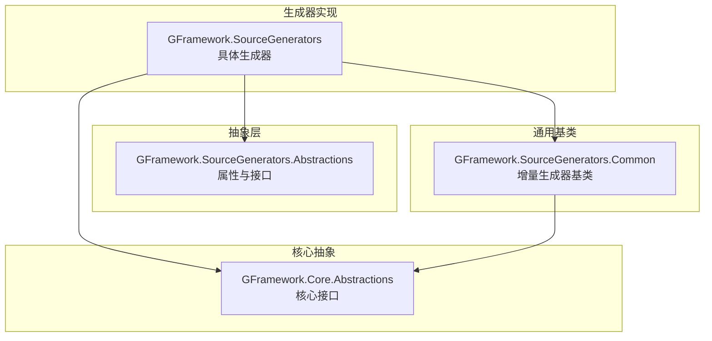
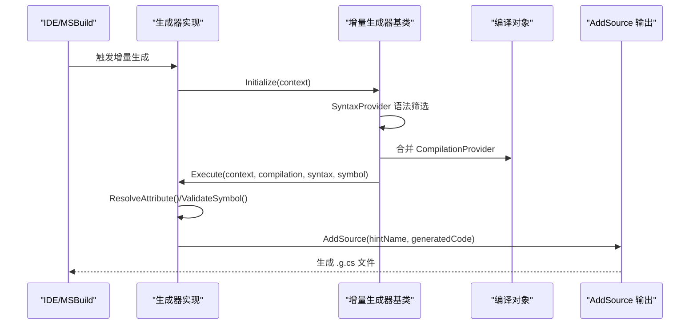
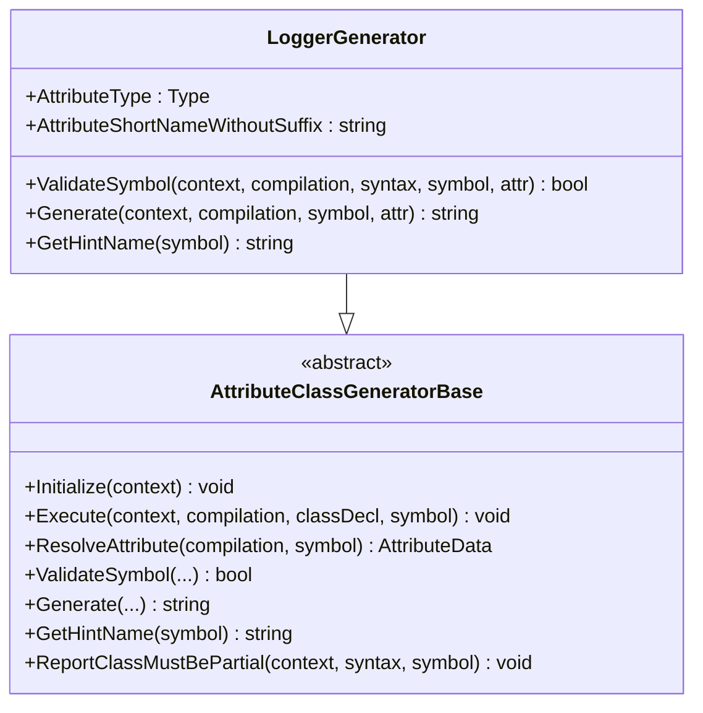
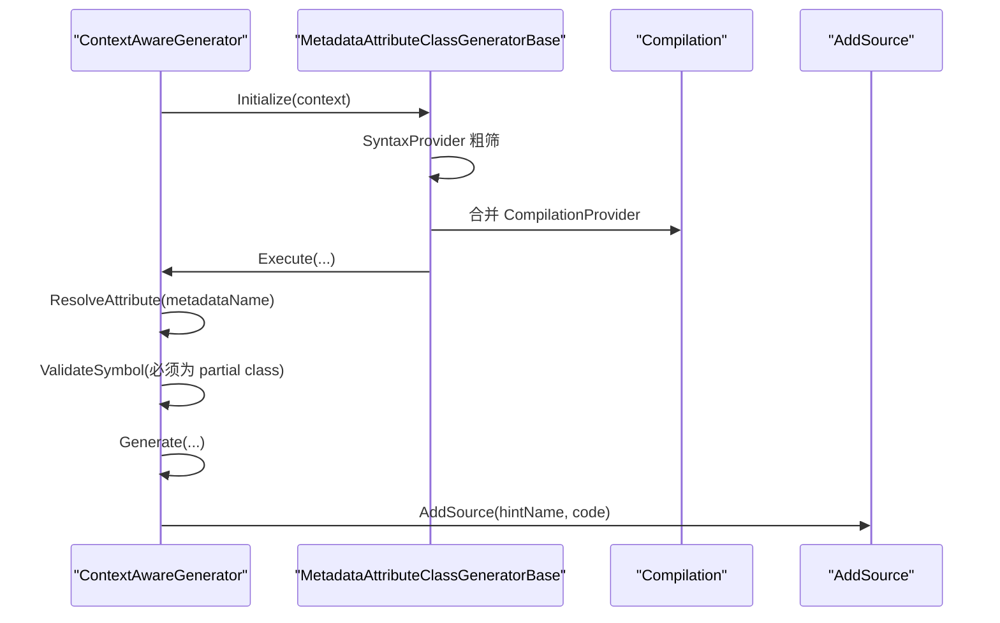
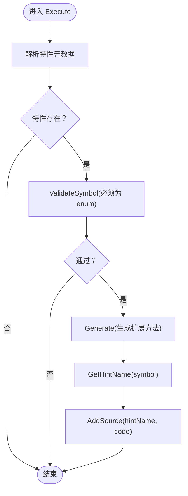
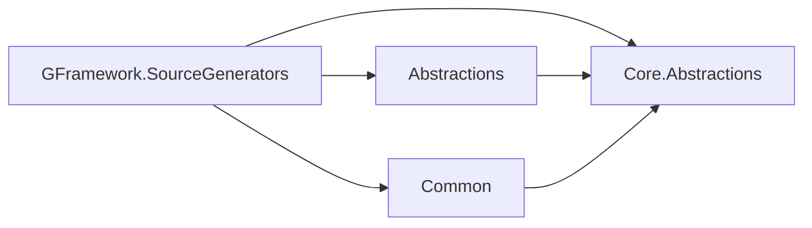

# 源代码生成器 API 参考

<cite>
**本文档引用的文件**
- [GFramework.SourceGenerators.csproj](file://GFramework.SourceGenerators/GFramework.SourceGenerators.csproj)
- [Directory.Build.props](file://GFramework.SourceGenerators.Abstractions/Directory.Build.props)
- [GFramework.SourceGenerators.Abstractions.csproj](file://GFramework.SourceGenerators.Abstractions/GFramework.SourceGenerators.Abstractions.csproj)
- [Directory.Build.props](file://GFramework.SourceGenerators.Common/Directory.Build.props)
- [GFramework.SourceGenerators.Common.csproj](file://GFramework.SourceGenerators.Common/GFramework.SourceGenerators.Common.csproj)
- [LoggerGenerator.cs](file://GFramework.SourceGenerators/logging/LoggerGenerator.cs)
- [ContextAwareGenerator.cs](file://GFramework.SourceGenerators/rule/ContextAwareGenerator.cs)
- [EnumExtensionsGenerator.cs](file://GFramework.SourceGenerators/enums/EnumExtensionsGenerator.cs)
- [ContextAwareDiagnostic.cs](file://GFramework.SourceGenerators/diagnostics/ContextAwareDiagnostic.cs)
- [LoggerDiagnostic.cs](file://GFramework.SourceGenerators/diagnostics/LoggerDiagnostic.cs)
- [LogAttribute.cs](file://GFramework.SourceGenerators.Abstractions/logging/LogAttribute.cs)
- [ContextAwareAttribute.cs](file://GFramework.SourceGenerators.Abstractions/rule/ContextAwareAttribute.cs)
- [GenerateEnumExtensionsAttribute.cs](file://GFramework.SourceGenerators.Abstractions/enums/GenerateEnumExtensionsAttribute.cs)
- [AttributeClassGeneratorBase.cs](file://GFramework.SourceGenerators.Common/generator/AttributeClassGeneratorBase.cs)
- [AttributeEnumGeneratorBase.cs](file://GFramework.SourceGenerators.Common/generator/AttributeEnumGeneratorBase.cs)
</cite>

## 目录
1. [简介](#简介)
2. [项目结构](#项目结构)
3. [核心组件](#核心组件)
4. [架构总览](#架构总览)
5. [详细组件分析](#详细组件分析)
6. [依赖关系分析](#依赖关系分析)
7. [性能考量](#性能考量)
8. [故障排查指南](#故障排查指南)
9. [结论](#结论)
10. [附录](#附录)

## 简介
本文件为 GFramework 源代码生成器模块的完整 API 参考，覆盖以下生成器类与抽象层接口：
- 生成器类：LoggerGenerator、ContextAwareGenerator、EnumExtensionsGenerator
- 抽象层接口与属性：IContextAware、ILogAttribute（通过 LogAttribute 实现）
- 基础生成器抽象：AttributeClassGeneratorBase、AttributeEnumGeneratorBase
- 诊断系统：ContextAwareDiagnostic、LoggerDiagnostic
- 配置与使用：输入参数、输出格式、生命周期、错误处理与诊断、增量编译支持、IDE 集成与开发体验、测试与调试

## 项目结构
源代码生成器模块由三个子项目组成：
- GFramework.SourceGenerators：具体生成器实现与诊断
- GFramework.SourceGenerators.Abstractions：生成器使用的公共属性与接口定义
- GFramework.SourceGenerators.Common：通用生成器基类与工具

图表来源
- [GFramework.SourceGenerators.csproj](file://GFramework.SourceGenerators/GFramework.SourceGenerators.csproj#L29-L34)
- [GFramework.SourceGenerators.Abstractions.csproj](file://GFramework.SourceGenerators.Abstractions/GFramework.SourceGenerators.Abstractions.csproj#L17-L19)
- [GFramework.SourceGenerators.Common.csproj](file://GFramework.SourceGenerators.Common/GFramework.SourceGenerators.Common.csproj#L18-L24)

章节来源
- [GFramework.SourceGenerators.csproj](file://GFramework.SourceGenerators/GFramework.SourceGenerators.csproj#L1-L64)
- [GFramework.SourceGenerators.Abstractions.csproj](file://GFramework.SourceGenerators.Abstractions/GFramework.SourceGenerators.Abstractions.csproj#L1-L31)
- [GFramework.SourceGenerators.Common.csproj](file://GFramework.SourceGenerators.Common/GFramework.SourceGenerators.Common.csproj#L1-L39)

## 核心组件
- LoggerGenerator：为带 LogAttribute 的类生成日志记录器字段
- ContextAwareGenerator：为带 ContextAwareAttribute 的类生成 IContextAware 接口实现
- EnumExtensionsGenerator：为带 GenerateEnumExtensionsAttribute 的枚举生成扩展方法
- AttributeClassGeneratorBase：基于类属性的增量生成器基类
- AttributeEnumGeneratorBase：基于枚举属性的增量生成器基类
- LogAttribute、ContextAwareAttribute、GenerateEnumExtensionsAttribute：生成器使用的属性
- ContextAwareDiagnostic、LoggerDiagnostic：诊断规则定义

章节来源
- [LoggerGenerator.cs](file://GFramework.SourceGenerators/logging/LoggerGenerator.cs#L12-L103)
- [ContextAwareGenerator.cs](file://GFramework.SourceGenerators/rule/ContextAwareGenerator.cs#L13-L234)
- [EnumExtensionsGenerator.cs](file://GFramework.SourceGenerators/enums/EnumExtensionsGenerator.cs#L11-L114)
- [AttributeClassGeneratorBase.cs](file://GFramework.SourceGenerators.Common/generator/AttributeClassGeneratorBase.cs#L9-L175)
- [AttributeEnumGeneratorBase.cs](file://GFramework.SourceGenerators.Common/generator/AttributeEnumGeneratorBase.cs#L7-L104)
- [LogAttribute.cs](file://GFramework.SourceGenerators.Abstractions/logging/LogAttribute.cs#L6-L40)
- [ContextAwareAttribute.cs](file://GFramework.SourceGenerators.Abstractions/rule/ContextAwareAttribute.cs#L5-L11)
- [GenerateEnumExtensionsAttribute.cs](file://GFramework.SourceGenerators.Abstractions/enums/GenerateEnumExtensionsAttribute.cs#L5-L20)
- [ContextAwareDiagnostic.cs](file://GFramework.SourceGenerators/diagnostics/ContextAwareDiagnostic.cs#L5-L21)
- [LoggerDiagnostic.cs](file://GFramework.SourceGenerators/diagnostics/LoggerDiagnostic.cs#L5-L21)

## 架构总览
生成器采用增量生成（IIncrementalGenerator）模式，通过 SyntaxProvider 在语法树层面进行粗筛，再结合语义模型进行细筛与验证，最后生成源代码。

图表来源
- [AttributeClassGeneratorBase.cs](file://GFramework.SourceGenerators.Common/generator/AttributeClassGeneratorBase.cs#L23-L48)
- [AttributeEnumGeneratorBase.cs](file://GFramework.SourceGenerators.Common/generator/AttributeEnumGeneratorBase.cs#L21-L57)
- [LoggerGenerator.cs](file://GFramework.SourceGenerators/logging/LoggerGenerator.cs#L51-L113)
- [ContextAwareGenerator.cs](file://GFramework.SourceGenerators/rule/ContextAwareGenerator.cs#L78-L112)
- [EnumExtensionsGenerator.cs](file://GFramework.SourceGenerators/enums/EnumExtensionsGenerator.cs#L57-L103)

## 详细组件分析

### LoggerGenerator（日志生成器）
- 功能：为标注 LogAttribute 的类生成日志记录器字段
- 输入参数（属性成员）：
  - Name：日志分类名（默认使用类名）
  - FieldName：生成字段名（默认 "Logger"）
  - IsStatic：是否生成 static 字段（默认 true）
  - AccessModifier：访问修饰符（默认 "private"）
- 输出格式：partial 类中注入 readonly ILogger 字段，使用 LoggerFactoryResolver.Provider.CreateLogger(...)
- 生命周期与流程：
  - 语法筛选：类声明含 "Log"
  - 语义解析：ResolveAttribute 返回 LogAttribute
  - 校验：类需为 partial
  - 生成：构造命名空间、类声明、字段声明与初始化
- 错误处理与诊断：通过 CommonDiagnostics.Trace 记录执行轨迹；若类非 partial，报告诊断

图表来源
- [LoggerGenerator.cs](file://GFramework.SourceGenerators/logging/LoggerGenerator.cs#L15-L103)
- [AttributeClassGeneratorBase.cs](file://GFramework.SourceGenerators.Common/generator/AttributeClassGeneratorBase.cs#L12-L175)

章节来源
- [LoggerGenerator.cs](file://GFramework.SourceGenerators/logging/LoggerGenerator.cs#L12-L103)
- [AttributeClassGeneratorBase.cs](file://GFramework.SourceGenerators.Common/generator/AttributeClassGeneratorBase.cs#L23-L175)

### ContextAwareGenerator（上下文感知生成器）
- 功能：为标注 ContextAwareAttribute 的类生成 IContextAware 接口实现
- 输入参数（属性）：无（通过特性元数据名识别）
- 输出格式：partial class 实现 IContextAware，包含 Context 属性与显式接口实现
- 生命周期与流程：
  - 语法筛选：类声明含 "ContextAware"
  - 元数据解析：通过 AttributeMetadataName 定位特性
  - 校验：类必须为 partial 且为 class
  - 生成：生成 Context 属性（懒加载，首次使用时从 GameContext 获取），显式实现接口方法
- 错误处理与诊断：对非 class 或非 partial 的类报告诊断

图表来源
- [ContextAwareGenerator.cs](file://GFramework.SourceGenerators/rule/ContextAwareGenerator.cs#L17-L122)
- [AttributeClassGeneratorBase.cs](file://GFramework.SourceGenerators.Common/generator/AttributeClassGeneratorBase.cs#L23-L48)

章节来源
- [ContextAwareGenerator.cs](file://GFramework.SourceGenerators/rule/ContextAwareGenerator.cs#L13-L234)
- [ContextAwareDiagnostic.cs](file://GFramework.SourceGenerators/diagnostics/ContextAwareDiagnostic.cs#L8-L21)

### EnumExtensionsGenerator（枚举扩展生成器）
- 功能：为标注 GenerateEnumExtensionsAttribute 的枚举生成扩展方法
- 输入参数（属性成员）：
  - GenerateIsMethods：是否为每个枚举项生成 IsXXX 方法（默认 true）
  - GenerateIsInMethod：是否生成 IsIn(params T[]) 方法（默认 true）
- 输出格式：partial static class 枚举名Extensions，包含 IsXXX 与 IsIn 方法
- 生命周期与流程：
  - 语法筛选：枚举声明含 "GenerateEnumExtensions"
  - 元数据解析：通过 AttributeMetadataName 定位特性
  - 校验：必须为 enum
  - 生成：遍历枚举项生成 IsXXX 方法；生成 IsIn 方法

图表来源
- [EnumExtensionsGenerator.cs](file://GFramework.SourceGenerators/enums/EnumExtensionsGenerator.cs#L25-L114)
- [AttributeEnumGeneratorBase.cs](file://GFramework.SourceGenerators.Common/generator/AttributeEnumGeneratorBase.cs#L21-L104)

章节来源
- [EnumExtensionsGenerator.cs](file://GFramework.SourceGenerators/enums/EnumExtensionsGenerator.cs#L11-L114)
- [GenerateEnumExtensionsAttribute.cs](file://GFramework.SourceGenerators.Abstractions/enums/GenerateEnumExtensionsAttribute.cs#L5-L20)

### 抽象层与基础生成器

#### AttributeClassGeneratorBase（类属性生成器基类）
- 职责：封装类属性生成器的通用逻辑（语法筛选、合并编译信息、执行流程、诊断与输出）
- 关键方法：
  - Initialize：注册 SyntaxProvider 与 CompilationProvider，组合后触发 Execute
  - Execute：解析特性、校验 partial、调用 ValidateSymbol 与 Generate、AddSource
  - ResolveAttribute：由子类实现，定位目标 AttributeData
  - ValidateSymbol：默认通过，子类可重写添加约束
  - Generate：由子类实现，返回生成的源代码
  - GetHintName：默认返回 "{TypeName}.g.cs"，子类可定制
  - ReportClassMustBePartial：报告类必须为 partial 的诊断

章节来源
- [AttributeClassGeneratorBase.cs](file://GFramework.SourceGenerators.Common/generator/AttributeClassGeneratorBase.cs#L9-L175)

#### AttributeEnumGeneratorBase（枚举属性生成器基类）
- 职责：封装枚举属性生成器的通用逻辑（语法筛选、合并编译信息、执行流程、输出）
- 关键方法：
  - Initialize：注册 SyntaxProvider（针对 EnumDeclarationSyntax）、合并 CompilationProvider，组合后触发 Execute
  - Execute：解析特性、ValidateSymbol、Generate、AddSource
  - ResolveAttribute：由子类实现
  - ValidateSymbol：由子类实现
  - Generate：由子类实现
  - GetHintName：默认返回 "{EnumName}.g.cs"

章节来源
- [AttributeEnumGeneratorBase.cs](file://GFramework.SourceGenerators.Common/generator/AttributeEnumGeneratorBase.cs#L7-L104)

### 诊断系统
- ContextAwareDiagnostic：定义 ContextAwareAttribute 仅能应用于类的诊断规则
- LoggerDiagnostic：定义 LogAttribute 无效或无法生成 Logger 的诊断规则（Warning）

章节来源
- [ContextAwareDiagnostic.cs](file://GFramework.SourceGenerators/diagnostics/ContextAwareDiagnostic.cs#L8-L21)
- [LoggerDiagnostic.cs](file://GFramework.SourceGenerators/diagnostics/LoggerDiagnostic.cs#L8-L21)

## 依赖关系分析
- GFramework.SourceGenerators 依赖：
  - GFramework.SourceGenerators.Abstractions（属性与接口）
  - GFramework.SourceGenerators.Common（增量生成器基类）
  - GFramework.Core.Abstractions（核心接口）
- 项目打包与分发：
  - 生成器本体与 Abstractions/Common 的 DLL 作为 analyzers/dotnet/cs 发布
  - Abstractions/Common 的 DLL/Xml 文档发布到 lib/netstandard2.0

图表来源
- [GFramework.SourceGenerators.csproj](file://GFramework.SourceGenerators/GFramework.SourceGenerators.csproj#L29-L55)
- [GFramework.SourceGenerators.Abstractions.csproj](file://GFramework.SourceGenerators.Abstractions/GFramework.SourceGenerators.Abstractions.csproj#L17-L19)
- [GFramework.SourceGenerators.Common.csproj](file://GFramework.SourceGenerators.Common/GFramework.SourceGenerators.Common.csproj#L18-L24)

章节来源
- [GFramework.SourceGenerators.csproj](file://GFramework.SourceGenerators/GFramework.SourceGenerators.csproj#L1-L64)
- [GFramework.SourceGenerators.Abstractions.csproj](file://GFramework.SourceGenerators.Abstractions/GFramework.SourceGenerators.Abstractions.csproj#L1-L31)
- [GFramework.SourceGenerators.Common.csproj](file://GFramework.SourceGenerators.Common/GFramework.SourceGenerators.Common.csproj#L1-L39)

## 性能考量
- 增量编译支持：生成器实现 IIncrementalGenerator，通过 SyntaxProvider 与 CompilationProvider 组合，仅在受影响的语法节点变化时触发
- 语法粗筛：使用 Contains(AttributeShortNameWithoutSuffix) 在语法层面快速过滤候选节点，降低语义解析成本
- 语义校验：在 Execute 中尽早失败（如非 partial、非 class、非 enum），减少无效生成
- 输出控制：通过 GetHintName 控制生成文件名，避免重复与冲突

章节来源
- [AttributeClassGeneratorBase.cs](file://GFramework.SourceGenerators.Common/generator/AttributeClassGeneratorBase.cs#L23-L48)
- [AttributeEnumGeneratorBase.cs](file://GFramework.SourceGenerators.Common/generator/AttributeEnumGeneratorBase.cs#L21-L57)
- [ContextAwareGenerator.cs](file://GFramework.SourceGenerators/rule/ContextAwareGenerator.cs#L46-L67)

## 故障排查指南
- 常见问题与诊断
  - 类必须为 partial：当类未声明为 partial 时，报告诊断并终止生成
  - ContextAware 仅适用于类：当特性应用于非 class 时，报告诊断
  - LogAttribute 无效：当属性配置不当或环境不满足时，报告 Warning
- 调试建议
  - 使用 CommonDiagnostics.Trace 输出执行轨迹，定位问题阶段
  - 在本地启用 EmitCompilerGeneratedFiles 并查看 Generated 目录中的生成文件
  - 逐步注释掉复杂逻辑，缩小问题范围
- 修复步骤
  - 确保被标注的类声明为 partial
  - 确保 ContextAwareAttribute 应用于 class
  - 检查 LogAttribute 的参数与命名空间引用

章节来源
- [AttributeClassGeneratorBase.cs](file://GFramework.SourceGenerators.Common/generator/AttributeClassGeneratorBase.cs#L90-L175)
- [ContextAwareGenerator.cs](file://GFramework.SourceGenerators/rule/ContextAwareGenerator.cs#L46-L67)
- [ContextAwareDiagnostic.cs](file://GFramework.SourceGenerators/diagnostics/ContextAwareDiagnostic.cs#L13-L20)
- [LoggerDiagnostic.cs](file://GFramework.SourceGenerators/diagnostics/LoggerDiagnostic.cs#L13-L20)

## 结论
GFramework 源代码生成器模块通过统一的增量生成框架与抽象基类，实现了对日志、上下文感知与枚举扩展的自动化生成。其设计强调：
- 清晰的职责分离：具体生成器专注业务生成逻辑，基类负责通用流程
- 强健的诊断体系：在关键阶段报告错误与警告，提升开发体验
- 良好的扩展性：新增生成器只需继承对应基类并实现必要方法
- 性能与增量编译：通过语法粗筛与语义校验，最小化生成开销

## 附录

### 生成器使用方法与配置选项

- LoggerGenerator
  - 应用位置：类上
  - 属性：LogAttribute
  - 参数：
    - Name：日志分类名（默认使用类名）
    - FieldName：生成字段名（默认 "Logger"）
    - IsStatic：是否生成 static 字段（默认 true）
    - AccessModifier：访问修饰符（默认 "private"）
  - 输出：partial 类中注入 readonly ILogger 字段
  - 示例路径：[LoggerGenerator.cs](file://GFramework.SourceGenerators/logging/LoggerGenerator.cs#L12-L103)，[LogAttribute.cs](file://GFramework.SourceGenerators.Abstractions/logging/LogAttribute.cs#L6-L40)

- ContextAwareGenerator
  - 应用位置：类上
  - 属性：ContextAwareAttribute
  - 输出：实现 IContextAware 的显式接口实现与 Context 属性（懒加载）
  - 示例路径：[ContextAwareGenerator.cs](file://GFramework.SourceGenerators/rule/ContextAwareGenerator.cs#L13-L234)，[ContextAwareAttribute.cs](file://GFramework.SourceGenerators.Abstractions/rule/ContextAwareAttribute.cs#L5-L11)

- EnumExtensionsGenerator
  - 应用位置：枚举上
  - 属性：GenerateEnumExtensionsAttribute
  - 参数：
    - GenerateIsMethods：是否生成 IsXXX 方法（默认 true）
    - GenerateIsInMethod：是否生成 IsIn(params T[]) 方法（默认 true）
  - 输出：partial static class 枚举名Extensions，包含扩展方法
  - 示例路径：[EnumExtensionsGenerator.cs](file://GFramework.SourceGenerators/enums/EnumExtensionsGenerator.cs#L11-L114)，[GenerateEnumExtensionsAttribute.cs](file://GFramework.SourceGenerators.Abstractions/enums/GenerateEnumExtensionsAttribute.cs#L5-L20)

### 自定义生成器开发指南
- 继承基类
  - 类属性生成器：继承 AttributeClassGeneratorBase，实现 ResolveAttribute、ValidateSymbol、Generate、GetHintName
  - 枚举属性生成器：继承 AttributeEnumGeneratorBase，实现 ResolveAttribute、ValidateSymbol、Generate、GetHintName
- 语法筛选
  - 在 Initialize 中使用 SyntaxProvider，利用 AttributeShortNameWithoutSuffix 进行语法粗筛
- 语义校验
  - 在 ValidateSymbol 中进行强约束（如 partial、class、enum 等）
- 生成与输出
  - 在 Generate 中拼接源代码，使用 AddSource 输出
- 诊断与日志
  - 使用 CommonDiagnostics.Trace 记录执行轨迹
  - 使用 context.ReportDiagnostic 报告诊断

章节来源
- [AttributeClassGeneratorBase.cs](file://GFramework.SourceGenerators.Common/generator/AttributeClassGeneratorBase.cs#L23-L175)
- [AttributeEnumGeneratorBase.cs](file://GFramework.SourceGenerators.Common/generator/AttributeEnumGeneratorBase.cs#L21-L104)

### 与 IDE 集成与开发体验优化
- 包装为 Analyzer：生成器以 analyzers/dotnet/cs 形式分发，无需运行时依赖
- 调试生成代码：启用 EmitCompilerGeneratedFiles 并查看 Generated 目录
- 文档与 Polyfill：启用 GenerateDocumentationFile 与 Meziantou.Polyfill，提升编辑器体验

章节来源
- [GFramework.SourceGenerators.csproj](file://GFramework.SourceGenerators/GFramework.SourceGenerators.csproj#L14-L18)
- [GFramework.SourceGenerators.Abstractions.csproj](file://GFramework.SourceGenerators.Abstractions/GFramework.SourceGenerators.Abstractions.csproj#L7-L11)
- [GFramework.SourceGenerators.Common.csproj](file://GFramework.SourceGenerators.Common/GFramework.SourceGenerators.Common.csproj#L7-L12)

### 测试方法与调试技巧
- 快照测试：通过 Snapshot 测试验证生成结果一致性
- 单元测试：针对生成器的输入参数与输出格式编写断言
- 调试技巧：
  - 使用 CommonDiagnostics.Trace 输出执行阶段
  - 在本地启用 EmitCompilerGeneratedFiles 查看生成文件
  - 分步注释复杂逻辑，定位问题点

章节来源
- [AttributeClassGeneratorBase.cs](file://GFramework.SourceGenerators.Common/generator/AttributeClassGeneratorBase.cs#L74-L113)
- [GFramework.SourceGenerators.csproj](file://GFramework.SourceGenerators/GFramework.SourceGenerators.csproj#L14-L18)