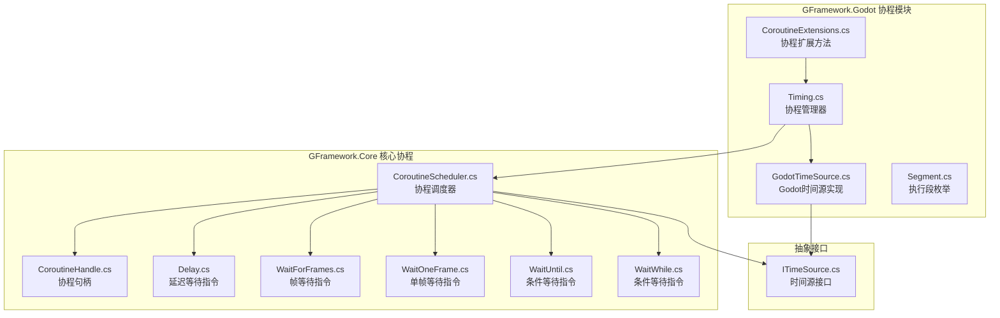
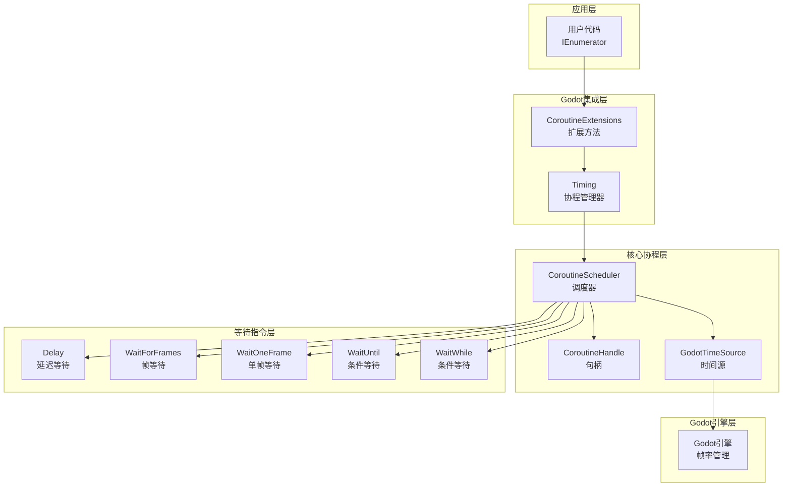
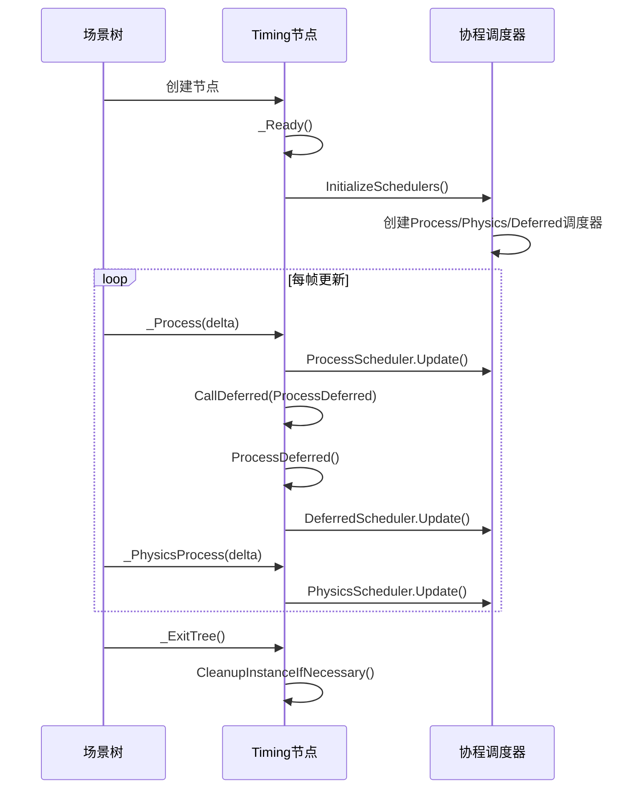
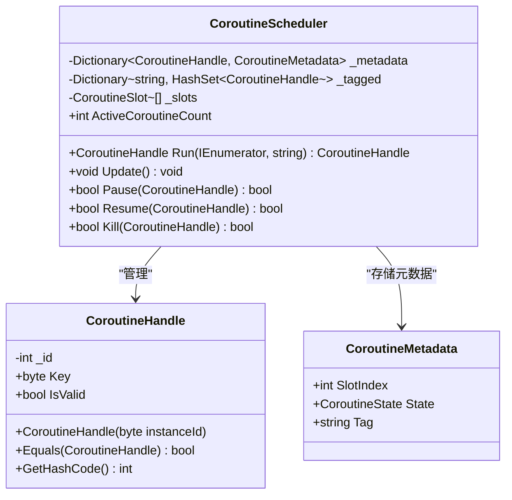
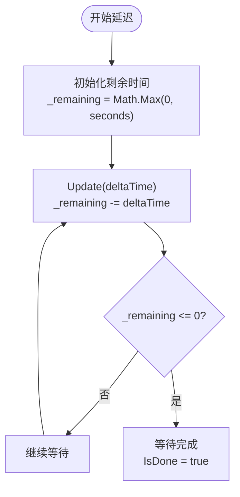
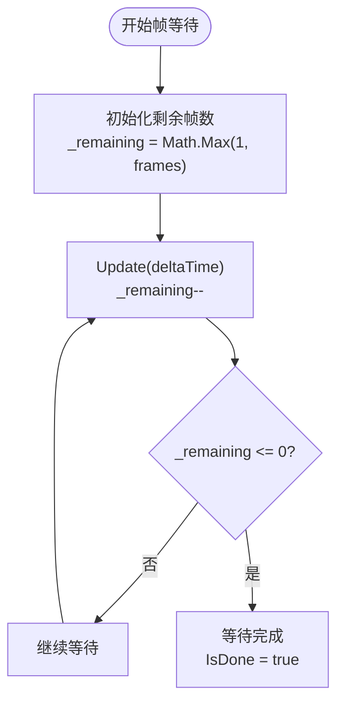
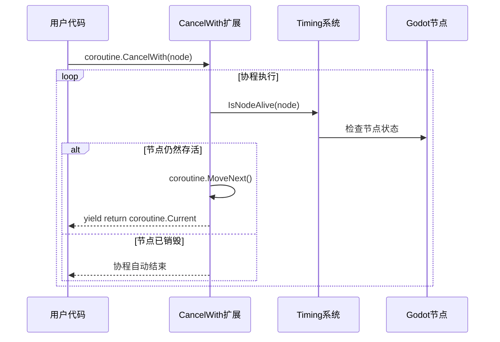
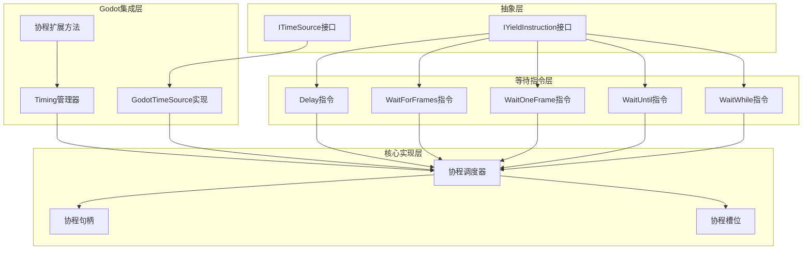

# Godot协程集成

<cite>
**本文档引用的文件**
- [CoroutineExtensions.cs](file://GFramework.Godot/coroutine/CoroutineExtensions.cs)
- [GodotTimeSource.cs](file://GFramework.Godot/coroutine/GodotTimeSource.cs)
- [Segment.cs](file://GFramework.Godot/coroutine/Segment.cs)
- [Timing.cs](file://GFramework.Godot/coroutine/Timing.cs)
- [ITimeSource.cs](file://GFramework.Core.Abstractions/coroutine/ITimeSource.cs)
- [CoroutineScheduler.cs](file://GFramework.Core/coroutine/CoroutineScheduler.cs)
- [Delay.cs](file://GFramework.Core/coroutine/Delay.cs)
- [WaitForFrames.cs](file://GFramework.Core/coroutine/WaitForFrames.cs)
- [WaitOneFrame.cs](file://GFramework.Core/coroutine/WaitOneFrame.cs)
- [WaitUntil.cs](file://GFramework.Core/coroutine/WaitUntil.cs)
- [WaitWhile.cs](file://GFramework.Core/coroutine/WaitWhile.cs)
- [CoroutineHandle.cs](file://GFramework.Core/coroutine/CoroutineHandle.cs)
- [CoroutineSchedulerTests.cs](file://GFramework.Core.Tests/coroutine/CoroutineSchedulerTests.cs)
- [YieldInstructionTests.cs](file://GFramework.Core.Tests/coroutine/YieldInstructionTests.cs)
</cite>

## 目录
1. [简介](#简介)
2. [项目结构](#项目结构)
3. [核心组件](#核心组件)
4. [架构概览](#架构概览)
5. [详细组件分析](#详细组件分析)
6. [依赖关系分析](#依赖关系分析)
7. [性能考虑](#性能考虑)
8. [故障排除指南](#故障排除指南)
9. [结论](#结论)
10. [附录](#附录)

## 简介

GFramework的Godot协程集成为Godot引擎提供了强大的异步编程能力。该集成通过CoroutineExtensions将GFramework的核心协程系统与Godot的场景树和节点生命周期无缝连接，实现了基于帧率和时间管理机制的精确协程调度。

本系统的核心特性包括：
- **多段执行支持**：支持Process、PhysicsProcess和DeferredProcess三种执行段
- **节点生命周期集成**：协程能够自动响应节点的创建和销毁
- **精确时间测量**：基于Godot引擎的帧率和时间管理机制
- **性能监控**：内置活跃协程数量统计和调试信息
- **灵活的等待指令**：支持延迟、帧等待、条件等待等多种等待类型

## 项目结构

GFramework的Godot协程集成位于GFramework.Godot项目中，主要包含以下关键文件：



**图表来源**
- [CoroutineExtensions.cs](file://GFramework.Godot/coroutine/CoroutineExtensions.cs#L1-L66)
- [GodotTimeSource.cs](file://GFramework.Godot/coroutine/GodotTimeSource.cs#L1-L44)
- [Segment.cs](file://GFramework.Godot/coroutine/Segment.cs#L1-L22)
- [Timing.cs](file://GFramework.Godot/coroutine/Timing.cs#L1-L518)

**章节来源**
- [CoroutineExtensions.cs](file://GFramework.Godot/coroutine/CoroutineExtensions.cs#L1-L66)
- [GodotTimeSource.cs](file://GFramework.Godot/coroutine/GodotTimeSource.cs#L1-L44)
- [Segment.cs](file://GFramework.Godot/coroutine/Segment.cs#L1-L22)
- [Timing.cs](file://GFramework.Godot/coroutine/Timing.cs#L1-L518)

## 核心组件

### 协程扩展方法 (CoroutineExtensions)

CoroutineExtensions提供了简洁的API来启动和管理协程，主要包含以下功能：

1. **RunCoroutine扩展方法**：启动协程并在指定执行段中运行
2. **CancelWith扩展方法**：让协程在节点销毁时自动取消
3. **多节点取消支持**：支持同时监控多个节点的状态

### Godot时间源实现 (GodotTimeSource)

GodotTimeSource实现了ITimeSource接口，为协程系统提供基于Godot引擎的时间信息：

- **CurrentTime属性**：当前累计时间
- **DeltaTime属性**：上一帧的时间增量
- **Update方法**：更新时间源状态
- **Reset方法**：重置时间源到初始状态

### 执行段枚举 (Segment)

定义了协程执行的不同时间段：

- **Process**：普通处理阶段
- **PhysicsProcess**：物理处理阶段  
- **DeferredProcess**：延迟处理阶段

### 协程管理器 (Timing)

Timing是Godot协程系统的核心，继承自Node类，提供完整的协程生命周期管理：

- **单例模式**：确保全局唯一的协程管理器
- **多调度器支持**：为不同执行段维护独立的调度器
- **生命周期集成**：与Godot节点生命周期完全同步
- **调试信息**：提供活跃协程数量统计

**章节来源**
- [CoroutineExtensions.cs](file://GFramework.Godot/coroutine/CoroutineExtensions.cs#L7-L66)
- [GodotTimeSource.cs](file://GFramework.Godot/coroutine/GodotTimeSource.cs#L5-L44)
- [Segment.cs](file://GFramework.Godot/coroutine/Segment.cs#L3-L22)
- [Timing.cs](file://GFramework.Godot/coroutine/Timing.cs#L8-L16)

## 架构概览

GFramework的Godot协程集成采用分层架构设计，实现了清晰的关注点分离：



**图表来源**
- [Timing.cs](file://GFramework.Godot/coroutine/Timing.cs#L12-L27)
- [CoroutineScheduler.cs](file://GFramework.Core/coroutine/CoroutineScheduler.cs#L11-L14)
- [GodotTimeSource.cs](file://GFramework.Godot/coroutine/GodotTimeSource.cs#L9-L44)

该架构的关键优势：
- **解耦设计**：各层职责明确，便于维护和扩展
- **性能优化**：使用固定大小数组和池化技术减少GC压力
- **线程安全**：通过Godot的单线程模型保证协程执行的安全性
- **资源管理**：自动管理协程生命周期，防止内存泄漏

## 详细组件分析

### Timing协程管理器

Timing类是整个协程系统的核心，负责协调所有协程的执行：

#### 生命周期管理



**图表来源**
- [Timing.cs](file://GFramework.Godot/coroutine/Timing.cs#L105-L165)

#### 协程执行策略

Timing实现了三种不同的执行策略：

1. **Process段**：每帧常规处理，适合UI动画和一般逻辑
2. **PhysicsProcess段**：物理更新循环，适合与物理引擎同步的操作
3. **DeferredProcess段**：当前帧结束后延迟执行，避免帧内竞争

#### 协程句柄系统



**图表来源**
- [CoroutineHandle.cs](file://GFramework.Core/coroutine/CoroutineHandle.cs#L7-L94)
- [CoroutineScheduler.cs](file://GFramework.Core/coroutine/CoroutineScheduler.cs#L11-L77)

**章节来源**
- [Timing.cs](file://GFramework.Godot/coroutine/Timing.cs#L12-L247)
- [CoroutineHandle.cs](file://GFramework.Core/coroutine/CoroutineHandle.cs#L7-L94)
- [CoroutineScheduler.cs](file://GFramework.Core/coroutine/CoroutineScheduler.cs#L11-L200)

### 等待指令系统

GFramework提供了多种等待指令来满足不同的协程需求：

#### 延迟等待指令 (Delay)

Delay指令是最基础的等待类型，基于时间进行等待：



**图表来源**
- [Delay.cs](file://GFramework.Core/coroutine/Delay.cs#L9-L29)

#### 帧等待指令 (WaitForFrames)

WaitForFrames指令等待指定数量的帧数：



**图表来源**
- [WaitForFrames.cs](file://GFramework.Core/coroutine/WaitForFrames.cs#L9-L29)

#### 条件等待指令

条件等待指令基于布尔条件进行等待：

- **WaitUntil**：等待条件变为true
- **WaitWhile**：等待条件变为false

**章节来源**
- [Delay.cs](file://GFramework.Core/coroutine/Delay.cs#L5-L29)
- [WaitForFrames.cs](file://GFramework.Core/coroutine/WaitForFrames.cs#L5-L29)
- [WaitOneFrame.cs](file://GFramework.Core/coroutine/WaitOneFrame.cs#L5-L26)
- [WaitUntil.cs](file://GFramework.Core/coroutine/WaitUntil.cs#L5-L26)
- [WaitWhile.cs](file://GFramework.Core/coroutine/WaitWhile.cs#L5-L26)

### 协程扩展方法

CoroutineExtensions提供了便捷的方法来集成Godot的节点生命周期：

#### 自动取消机制



**图表来源**
- [CoroutineExtensions.cs](file://GFramework.Godot/coroutine/CoroutineExtensions.cs#L23-L54)

**章节来源**
- [CoroutineExtensions.cs](file://GFramework.Godot/coroutine/CoroutineExtensions.cs#L7-L66)

## 依赖关系分析

GFramework的协程系统采用了清晰的依赖层次结构：



**图表来源**
- [ITimeSource.cs](file://GFramework.Core.Abstractions/coroutine/ITimeSource.cs#L6-L22)
- [GodotTimeSource.cs](file://GFramework.Godot/coroutine/GodotTimeSource.cs#L9-L44)
- [Timing.cs](file://GFramework.Godot/coroutine/Timing.cs#L12-L27)
- [CoroutineScheduler.cs](file://GFramework.Core/coroutine/CoroutineScheduler.cs#L11-L24)

**章节来源**
- [ITimeSource.cs](file://GFramework.Core.Abstractions/coroutine/ITimeSource.cs#L1-L22)
- [GodotTimeSource.cs](file://GFramework.Godot/coroutine/GodotTimeSource.cs#L1-L44)
- [Timing.cs](file://GFramework.Godot/coroutine/Timing.cs#L1-L518)
- [CoroutineScheduler.cs](file://GFramework.Core/coroutine/CoroutineScheduler.cs#L1-L200)

## 性能考虑

### 内存管理优化

GFramework协程系统采用了多项内存优化技术：

1. **固定大小数组**：使用预分配的数组而不是动态集合，减少GC压力
2. **对象池化**：复用协程槽位和元数据对象
3. **轻量级句柄**：CoroutineHandle使用结构体设计，避免额外的内存分配
4. **延迟初始化**：只在需要时创建调度器和时间源

### 执行效率优化

1. **直接索引访问**：通过槽位数组直接访问协程，避免字典查找开销
2. **批量更新**：每帧统一更新所有协程，减少方法调用次数
3. **早期退出**：跳过非运行状态的协程，提高更新效率
4. **异常处理优化**：最小化try-catch块的范围，减少异常开销

### 资源限制

系统实现了严格的资源限制来防止内存泄漏：

- **最大实例数量**：最多支持15个Timing实例
- **活跃协程限制**：每个调度器都有初始容量限制
- **自动清理**：节点销毁时自动清理相关协程

**章节来源**
- [CoroutineScheduler.cs](file://GFramework.Core/coroutine/CoroutineScheduler.cs#L11-L77)
- [Timing.cs](file://GFramework.Godot/coroutine/Timing.cs#L204-L223)

## 故障排除指南

### 常见问题及解决方案

#### 协程未执行问题

**症状**：协程启动但没有执行任何代码

**可能原因**：
1. Timing实例未正确初始化
2. 协程句柄无效
3. 调度器未正确配置

**解决方案**：
- 确保Timing节点存在于场景树中
- 检查协程句柄的IsValid属性
- 验证调度器的初始化状态

#### 协程无法停止问题

**症状**：协程无法被暂停或终止

**可能原因**：
1. 协程句柄不正确
2. 协程已执行完毕
3. 协程在错误的实例上运行

**解决方案**：
- 使用正确的协程句柄进行控制
- 检查协程的ActiveCoroutineCount
- 确认协程在预期的实例上运行

#### 内存泄漏问题

**症状**：应用内存持续增长

**可能原因**：
1. 协程未正确清理
2. 节点生命周期管理不当
3. 大量活跃协程

**解决方案**：
- 确保所有协程在节点销毁时自动清理
- 使用CancelWith扩展方法
- 监控活跃协程数量

### 调试技巧

1. **活跃协程监控**：使用Timing类的调试属性监控协程数量
2. **日志记录**：在关键节点添加日志输出
3. **单元测试**：编写针对协程行为的测试用例

**章节来源**
- [Timing.cs](file://GFramework.Godot/coroutine/Timing.cs#L80-L97)
- [CoroutineSchedulerTests.cs](file://GFramework.Core.Tests/coroutine/CoroutineSchedulerTests.cs#L24-L200)
- [YieldInstructionTests.cs](file://GFramework.Core.Tests/coroutine/YieldInstructionTests.cs#L18-L200)

## 结论

GFramework的Godot协程集成为开发者提供了一个强大而高效的异步编程框架。通过将GFramework的核心协程系统与Godot的场景树和节点生命周期深度集成，该系统实现了：

- **无缝集成**：与Godot引擎的帧率和时间管理机制完美配合
- **灵活执行**：支持多种执行段和等待指令
- **性能优化**：采用多项优化技术确保高效执行
- **易于使用**：提供简洁的API和丰富的扩展方法
- **可靠稳定**：完善的错误处理和资源管理机制

该系统特别适合需要复杂异步逻辑的游戏开发场景，如UI动画、游戏流程控制、网络请求处理等。通过遵循最佳实践和合理使用提供的工具，开发者可以构建高性能、可维护的协程驱动应用。

## 附录

### 使用示例

#### 基本协程启动

```csharp
// 在Process段启动协程
IEnumerator<IYieldInstruction> myCoroutine = MyCoroutineMethod();
CoroutineHandle handle = coroutine.RunCoroutine(Segment.Process);

// 在PhysicsProcess段启动协程
CoroutineHandle physicsHandle = coroutine.RunCoroutine(Segment.PhysicsProcess);
```

#### 自动取消协程

```csharp
// 协程在节点销毁时自动取消
IEnumerator<IYieldInstruction> cancellableCoroutine = 
    someCoroutine.CancelWith(this);

// 监控多个节点
IEnumerator<IYieldInstruction> multiNodeCoroutine = 
    someCoroutine.CancelWith(node1, node2, node3);
```

#### 延迟调用

```csharp
// 延迟执行动作
Timing.CallDelayed(2.0, () => Console.WriteLine("2秒后执行"));

// 带取消条件的延迟调用
Timing.CallDelayed(1.0, () => DoSomething(), targetNode);
```

### 最佳实践

1. **合理选择执行段**：根据协程的性质选择合适的执行段
2. **及时清理资源**：确保协程在不需要时能够正确清理
3. **监控性能**：定期检查活跃协程数量和内存使用情况
4. **错误处理**：为协程添加适当的异常处理机制
5. **测试验证**：编写单元测试验证协程的行为正确性