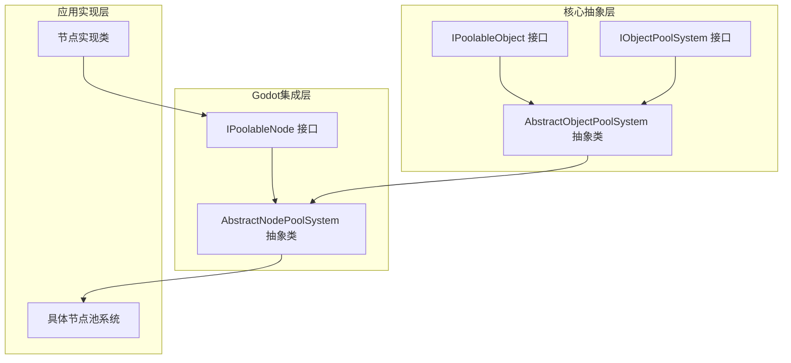
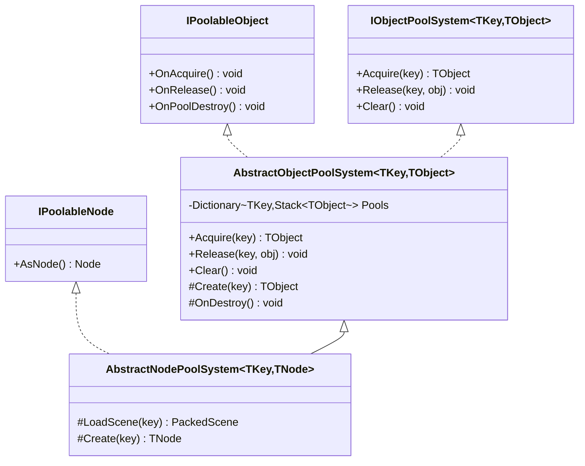
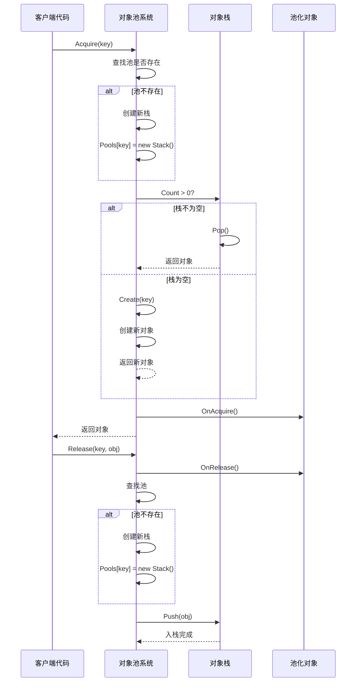
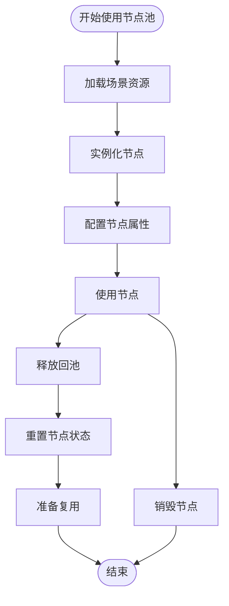
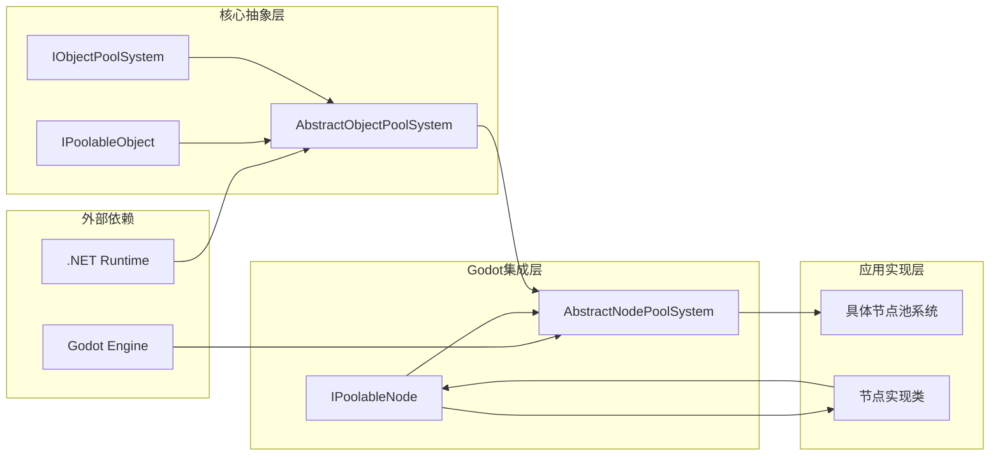
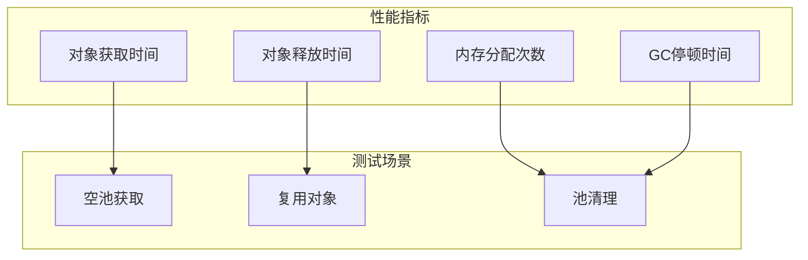

# Godot对象池系统

<cite>
**本文档引用的文件**
- [AbstractNodePoolSystem.cs](file://GFramework.Godot/pool/AbstractNodePoolSystem.cs)
- [IPoolableNode.cs](file://GFramework.Godot/pool/IPoolableNode.cs)
- [AbstractObjectPoolSystem.cs](file://GFramework.Core/pool/AbstractObjectPoolSystem.cs)
- [IObjectPoolSystem.cs](file://GFramework.Core.Abstractions/pool/IObjectPoolSystem.cs)
- [IPoolableObject.cs](file://GFramework.Core.Abstractions/pool/IPoolableObject.cs)
- [README.md](file://GFramework.Godot/README.md)
- [ObjectPoolTests.cs](file://GFramework.Core.Tests/pool/ObjectPoolTests.cs)
</cite>

## 目录
1. [简介](#简介)
2. [项目结构](#项目结构)
3. [核心组件](#核心组件)
4. [架构概览](#架构概览)
5. [详细组件分析](#详细组件分析)
6. [依赖关系分析](#依赖关系分析)
7. [性能考虑](#性能考虑)
8. [故障排除指南](#故障排除指南)
9. [结论](#结论)
10. [附录](#附录)

## 简介

Godot对象池系统是GFramework框架中用于高效管理Godot节点对象的核心组件。该系统通过复用对象实例来减少垃圾回收压力，提升应用程序性能，特别适用于需要频繁创建和销毁节点的游戏场景。

系统采用泛型设计，支持多种节点类型和键值管理，提供了完整的生命周期管理机制，包括对象的创建、获取、释放和销毁过程。

## 项目结构

GFramework对象池系统采用分层架构设计，主要包含以下核心模块：



**图表来源**
- [AbstractNodePoolSystem.cs](file://GFramework.Godot/pool/AbstractNodePoolSystem.cs#L1-L32)
- [AbstractObjectPoolSystem.cs](file://GFramework.Core/pool/AbstractObjectPoolSystem.cs#L1-L86)

**章节来源**
- [AbstractNodePoolSystem.cs](file://GFramework.Godot/pool/AbstractNodePoolSystem.cs#L1-L32)
- [AbstractObjectPoolSystem.cs](file://GFramework.Core/pool/AbstractObjectPoolSystem.cs#L1-L86)

## 核心组件

### IPoolableObject 接口

IPoolableObject是所有可池化对象的基础接口，定义了对象在对象池中的三个关键生命周期方法：

- **OnAcquire()**: 对象从池中获取时调用，用于初始化或重置对象状态
- **OnRelease()**: 对象被释放回池中时调用，用于清理或重置对象状态
- **OnPoolDestroy()**: 对象池被销毁时调用，用于执行最终清理

### IObjectPoolSystem 接口

IObjectPoolSystem定义了对象池系统的基本操作接口，支持泛型键值管理：

- **Acquire(key)**: 从指定键的对象池中获取一个对象
- **Release(key, obj)**: 将对象释放回指定键的对象池中
- **Clear()**: 清空所有对象池，销毁所有池中的对象

### IPoolableNode 接口

IPoolableNode专门用于Godot节点的池化管理，继承自IPoolableObject接口：

- **AsNode()**: 将当前对象转换为Node类型，便于场景树管理

**章节来源**
- [IPoolableObject.cs](file://GFramework.Core.Abstractions/pool/IPoolableObject.cs#L1-L22)
- [IObjectPoolSystem.cs](file://GFramework.Core.Abstractions/pool/IObjectPoolSystem.cs#L1-L30)
- [IPoolableNode.cs](file://GFramework.Godot/pool/IPoolableNode.cs#L1-L17)

## 架构概览

对象池系统采用分层设计，通过抽象基类提供通用功能，Godot特定实现提供节点管理能力。



**图表来源**
- [AbstractObjectPoolSystem.cs](file://GFramework.Core/pool/AbstractObjectPoolSystem.cs#L11-L86)
- [AbstractNodePoolSystem.cs](file://GFramework.Godot/pool/AbstractNodePoolSystem.cs#L11-L32)

## 详细组件分析

### AbstractObjectPoolSystem 分析

AbstractObjectPoolSystem是对象池系统的核心抽象类，提供了完整的对象池管理功能：

#### 核心数据结构

系统使用字典存储多个对象池，键为池标识，值为对应类型的对象栈：
- **Pools**: Dictionary<TKey, Stack<TObject>> - 存储所有对象池
- **Stack<TObject>**: LIFO（后进先出）管理，实现高效的对象复用

#### 生命周期管理流程



**图表来源**
- [AbstractObjectPoolSystem.cs](file://GFramework.Core/pool/AbstractObjectPoolSystem.cs#L24-L56)

#### 关键方法实现

**Acquire方法**:
- 检查对象池是否存在，不存在则创建新池
- 从栈顶获取对象，如果栈为空则调用Create方法创建新对象
- 调用对象的OnAcquire()方法进行初始化
- 返回获取到的对象

**Release方法**:
- 调用对象的OnRelease()方法进行清理
- 确保对象池存在，不存在则创建新池
- 将对象推入栈中进行复用

**Clear方法**:
- 遍历所有池中的对象，调用OnPoolDestroy()进行最终清理
- 清空所有池容器

**章节来源**
- [AbstractObjectPoolSystem.cs](file://GFramework.Core/pool/AbstractObjectPoolSystem.cs#L24-L86)

### AbstractNodePoolSystem 分析

AbstractNodePoolSystem专门用于Godot节点的池化管理，继承自AbstractObjectPoolSystem：

#### Godot集成特性

**LoadScene方法**:
- 抽象方法，子类必须实现具体的场景加载逻辑
- 支持基于键值的场景选择和加载

**Create方法重写**:
- 调用LoadScene方法加载场景
- 使用PackedScene.Instantiate<T>()创建节点实例
- 确保返回类型为Node且实现IPoolableNode接口

#### 节点管理优势



**图表来源**
- [AbstractNodePoolSystem.cs](file://GFramework.Godot/pool/AbstractNodePoolSystem.cs#L28-L31)

**章节来源**
- [AbstractNodePoolSystem.cs](file://GFramework.Godot/pool/AbstractNodePoolSystem.cs#L11-L32)

### IPoolableNode 接口分析

IPoolableNode接口为Godot节点提供了专门的池化支持：

#### 接口设计原则

**继承关系**:
- 继承自IPoolableObject，确保基础生命周期管理
- 添加AsNode()方法，提供Node类型转换能力

**应用场景**:
- UI元素池化管理
- 游戏特效节点管理
- 粒子系统节点管理
- 场景切换时的节点复用

**章节来源**
- [IPoolableNode.cs](file://GFramework.Godot/pool/IPoolableNode.cs#L1-L17)

## 依赖关系分析

对象池系统采用松耦合设计，通过接口和抽象类实现高度的可扩展性。



**图表来源**
- [AbstractNodePoolSystem.cs](file://GFramework.Godot/pool/AbstractNodePoolSystem.cs#L1-L3)
- [AbstractObjectPoolSystem.cs](file://GFramework.Core/pool/AbstractObjectPoolSystem.cs#L1-L3)

### 组件耦合度分析

**低耦合设计**:
- 接口隔离：通过IPoolableObject和IObjectPoolSystem实现功能隔离
- 抽象继承：通过AbstractObjectPoolSystem和AbstractNodePoolSystem提供通用实现
- 泛型约束：通过泛型参数实现类型安全和代码复用

**潜在循环依赖**:
- 系统设计避免了循环依赖，各层职责明确
- 接口层不依赖具体实现，实现层依赖接口层

**外部依赖管理**:
- 仅依赖Godot引擎的Node类和PackedScene类
- 依赖.NET标准库的集合类型

**章节来源**
- [AbstractObjectPoolSystem.cs](file://GFramework.Core/pool/AbstractObjectPoolSystem.cs#L1-L13)
- [AbstractNodePoolSystem.cs](file://GFramework.Godot/pool/AbstractNodePoolSystem.cs#L1-L15)

## 性能考虑

### 内存管理优化

**垃圾回收压力减少**:
- 对象复用避免频繁的内存分配和回收
- 减少GC停顿时间，提升游戏流畅度
- 特别适用于高频创建销毁的节点场景

**内存占用控制**:
- 可通过Clear方法主动清理所有池化对象
- 系统销毁时自动清理，防止内存泄漏
- 支持池大小限制，避免过度占用内存

### 性能基准测试

基于单元测试验证的性能特征：



**测试验证结果**:
- 空池获取：首次创建新对象，包含场景加载开销
- 复用对象：从栈顶获取，O(1)时间复杂度
- 池清理：遍历所有对象执行销毁回调

**章节来源**
- [ObjectPoolTests.cs](file://GFramework.Core.Tests/pool/ObjectPoolTests.cs#L30-L121)

### 最佳实践建议

**预分配策略**:
- 在系统初始化时预创建常用对象
- 根据游戏场景需求设置合理的初始容量
- 避免运行时频繁的场景加载

**生命周期管理**:
- 确保所有对象都正确释放回池中
- 在系统销毁时调用Clear方法
- 实现适当的对象状态重置逻辑

## 故障排除指南

### 常见问题诊断

**对象未正确释放**:
- 检查是否遗漏了Release调用
- 确认对象池键值的一致性
- 验证对象的OnRelease实现

**内存泄漏排查**:
- 使用Clear方法清理所有池化对象
- 检查对象池系统是否正确继承AbstractSystem
- 确认系统销毁时机

**性能问题定位**:
- 分析场景加载时间开销
- 监控对象池大小变化
- 检查对象状态重置的完整性

### 调试技巧

**生命周期跟踪**:
- 在OnAcquire和OnRelease中添加日志
- 监控池大小变化和对象使用频率
- 使用单元测试验证基本行为

**性能监控**:
- 测量对象获取和释放的时间开销
- 监控GC活动和内存使用情况
- 分析场景加载对性能的影响

**章节来源**
- [ObjectPoolTests.cs](file://GFramework.Core.Tests/pool/ObjectPoolTests.cs#L1-L200)

## 结论

Godot对象池系统通过精心设计的分层架构和泛型接口，为Godot游戏开发提供了高效的对象管理解决方案。系统的主要优势包括：

**技术优势**:
- 类型安全的泛型设计
- 完整的生命周期管理
- 松耦合的架构设计
- 高效的内存管理

**性能优势**:
- 显著减少GC压力
- 提升对象获取速度
- 降低内存分配开销
- 支持大规模节点管理

**实用性优势**:
- 简洁的API设计
- 灵活的配置选项
- 完善的测试覆盖
- 良好的扩展性

该系统特别适用于需要频繁创建和销毁节点的游戏场景，如子弹管理、粒子系统、UI元素等，能够显著提升游戏性能和响应速度。

## 附录

### 使用示例

#### 基本节点池实现

```csharp
public class BulletPoolSystem : AbstractNodePoolSystem<string, Bullet>
{
    protected override PackedScene LoadScene(string key)
    {
        return GD.Load<PackedScene>($"res://scenes/{key}.tscn");
    }
}
```

#### 节点状态管理

```csharp
public class Bullet : Node, IPoolableNode
{
    public Node AsNode() => this;
    
    public void OnAcquire()
    {
        Visible = true;
        Position = Vector3.Zero;
    }
    
    public void OnRelease()
    {
        Visible = false;
        Position = Vector3.Zero;
    }
    
    public void OnPoolDestroy() { }
}
```

### 配置建议

**初始容量设置**:
- 根据游戏场景需求预估常用对象数量
- 考虑场景切换时的峰值需求
- 避免过小导致频繁创建，过大造成内存浪费

**性能调优**:
- 监控对象池使用率和命中率
- 根据实际使用情况调整预分配数量
- 定期清理长时间未使用的对象池