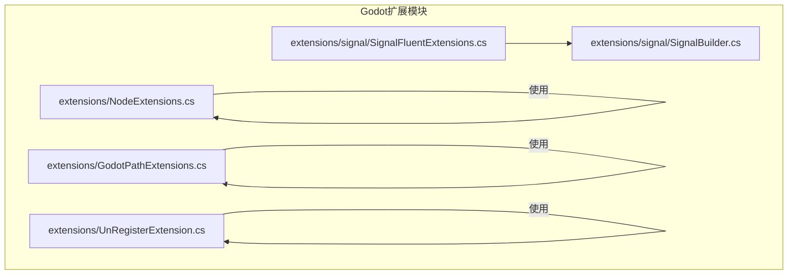
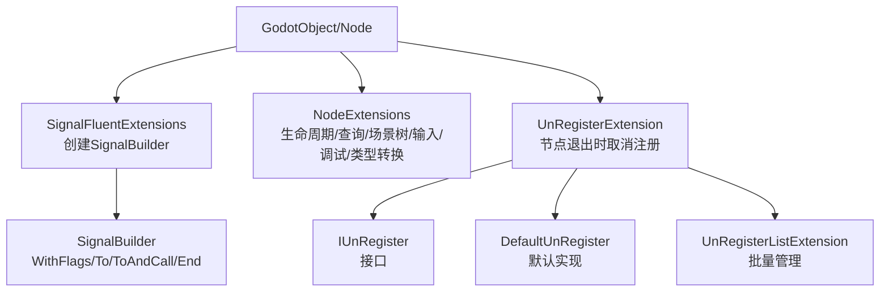
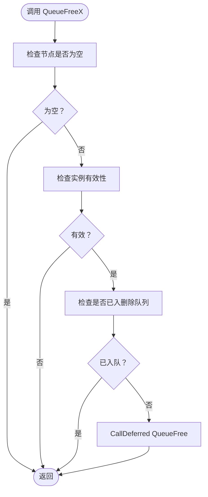
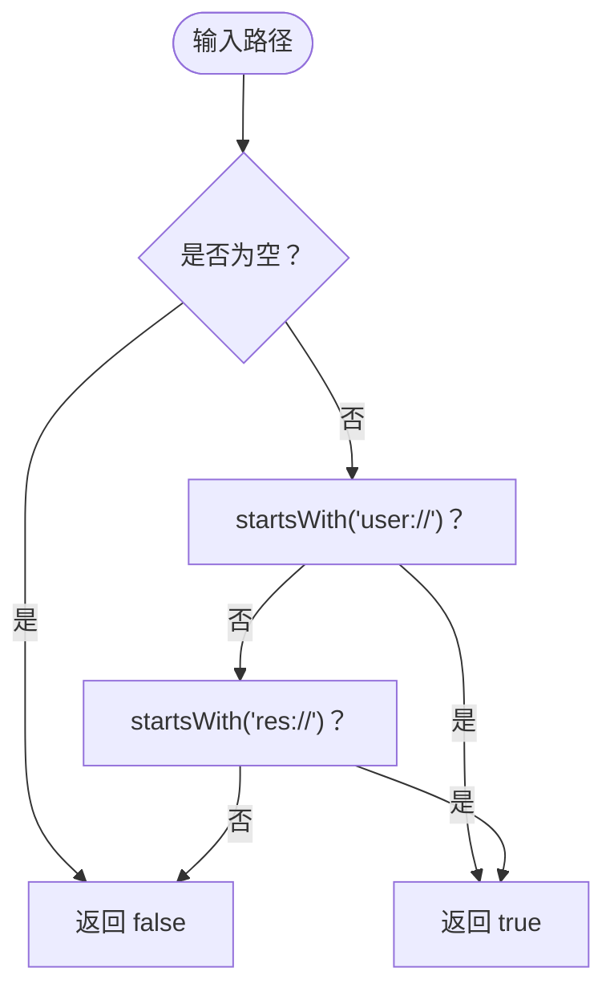
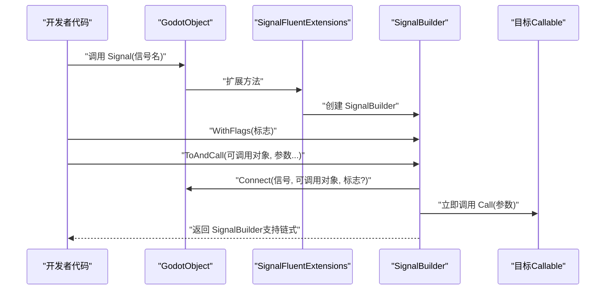
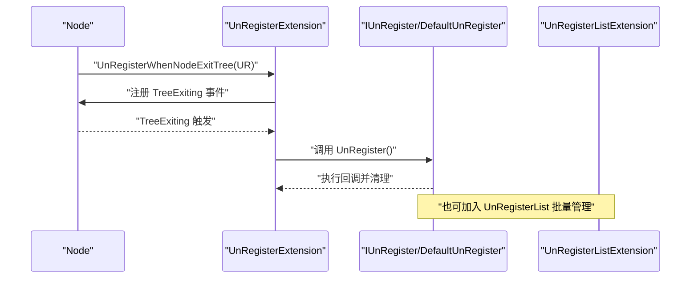
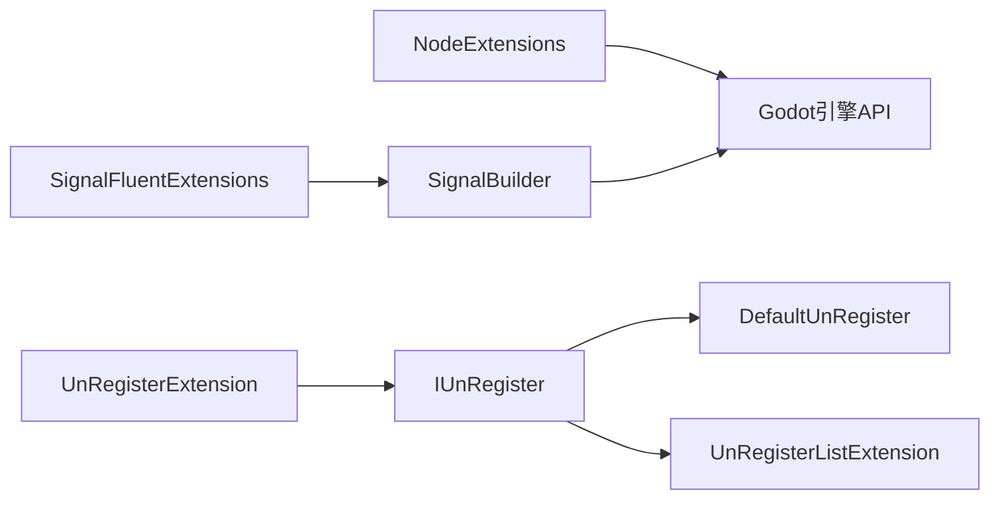

# Godot扩展功能

<cite>
**本文引用的文件**
- [NodeExtensions.cs](file://GFramework.Godot/extensions/NodeExtensions.cs)
- [GodotPathExtensions.cs](file://GFramework.Godot/extensions/GodotPathExtensions.cs)
- [SignalBuilder.cs](file://GFramework.Godot/extensions/signal/SignalBuilder.cs)
- [SignalFluentExtensions.cs](file://GFramework.Godot/extensions/signal/SignalFluentExtensions.cs)
- [UnRegisterExtension.cs](file://GFramework.Godot/extensions/UnRegisterExtension.cs)
- [README.md（Godot扩展模块）](file://GFramework.Godot/extensions/README.md)
- [README.md（信号连接系统）](file://GFramework.Godot/extensions/signal/README.md)
- [DefaultUnRegister.cs](file://GFramework.Core/events/DefaultUnRegister.cs)
- [UnRegisterListExtension.cs](file://GFramework.Core/extensions/UnRegisterListExtension.cs)
- [IUnRegister.cs](file://GFramework.Core.Abstractions/events/IUnRegister.cs)
- [godot-api.md](file://docs/api-reference/godot-api.md)
</cite>

## 目录
1. [简介](#简介)
2. [项目结构](#项目结构)
3. [核心组件](#核心组件)
4. [架构总览](#架构总览)
5. [详细组件分析](#详细组件分析)
6. [依赖分析](#依赖分析)
7. [性能考虑](#性能考虑)
8. [故障排查指南](#故障排查指南)
9. [结论](#结论)
10. [附录](#附录)

## 简介
本文件面向Godot扩展功能，系统化梳理并说明以下能力：
- NodeExtensions：节点生命周期、查找、父子关系、场景树控制、输入控制、调试工具与类型转换等扩展方法。
- GodotPathExtensions：Godot虚拟路径（res://、user://）识别与判断。
- SignalBuilder与SignalFluentExtensions：基于流畅API的信号连接构建器，支持连接标志、连接后立即调用、链式调用与显式结束。
- UnRegisterExtension：在节点退出场景树时自动取消注册监听器，配合事件生命周期管理。

文档提供架构图、序列图、流程图与最佳实践，帮助开发者高效、安全地使用这些扩展。

## 项目结构
Godot扩展模块位于GFramework.Godot工程下，核心文件组织如下：
- extensions/NodeExtensions.cs：节点操作扩展
- extensions/GodotPathExtensions.cs：路径判断扩展
- extensions/signal/SignalBuilder.cs：信号连接构建器
- extensions/signal/SignalFluentExtensions.cs：信号流畅API入口
- extensions/UnRegisterExtension.cs：事件生命周期扩展
- extensions/README.md：模块概览与示例
- extensions/signal/README.md：信号系统详细文档

**图表来源**
- [NodeExtensions.cs](file://GFramework.Godot/extensions/NodeExtensions.cs#L1-L259)
- [GodotPathExtensions.cs](file://GFramework.Godot/extensions/GodotPathExtensions.cs#L1-L22)
- [SignalFluentExtensions.cs](file://GFramework.Godot/extensions/signal/SignalFluentExtensions.cs#L1-L22)
- [SignalBuilder.cs](file://GFramework.Godot/extensions/signal/SignalBuilder.cs#L1-L65)
- [UnRegisterExtension.cs](file://GFramework.Godot/extensions/UnRegisterExtension.cs#L1-L23)

**章节来源**
- [README.md（Godot扩展模块）](file://GFramework.Godot/extensions/README.md#L1-L335)

## 核心组件
- 节点扩展（NodeExtensions）：提供安全释放、等待就绪、有效性检查、父子关系、场景树控制、输入控制、调试工具与类型转换等方法。
- 路径扩展（GodotPathExtensions）：提供res://与user://路径识别。
- 信号扩展（SignalFluentExtensions + SignalBuilder）：提供流畅的信号连接API，支持标志、立即调用与链式调用。
- 事件生命周期扩展（UnRegisterExtension）：在节点退出场景树时自动取消注册监听器。

**章节来源**
- [NodeExtensions.cs](file://GFramework.Godot/extensions/NodeExtensions.cs#L1-L259)
- [GodotPathExtensions.cs](file://GFramework.Godot/extensions/GodotPathExtensions.cs#L1-L22)
- [SignalFluentExtensions.cs](file://GFramework.Godot/extensions/signal/SignalFluentExtensions.cs#L1-L22)
- [SignalBuilder.cs](file://GFramework.Godot/extensions/signal/SignalBuilder.cs#L1-L65)
- [UnRegisterExtension.cs](file://GFramework.Godot/extensions/UnRegisterExtension.cs#L1-L23)

## 架构总览
扩展模块围绕Godot对象与场景树展开，形成“扩展方法层 → 构建器层 → 生命周期管理”的分层架构。

**图表来源**
- [SignalFluentExtensions.cs](file://GFramework.Godot/extensions/signal/SignalFluentExtensions.cs#L1-L22)
- [SignalBuilder.cs](file://GFramework.Godot/extensions/signal/SignalBuilder.cs#L1-L65)
- [NodeExtensions.cs](file://GFramework.Godot/extensions/NodeExtensions.cs#L1-L259)
- [UnRegisterExtension.cs](file://GFramework.Godot/extensions/UnRegisterExtension.cs#L1-L23)
- [DefaultUnRegister.cs](file://GFramework.Core/events/DefaultUnRegister.cs#L1-L22)
- [UnRegisterListExtension.cs](file://GFramework.Core/extensions/UnRegisterListExtension.cs#L1-L32)
- [IUnRegister.cs](file://GFramework.Core.Abstractions/events/IUnRegister.cs)

## 详细组件分析

### 节点扩展（NodeExtensions）
- 安全释放：QueueFreeX（延迟）、FreeX（立即），均包含空引用与有效性检查，避免重复入队与非法释放。
- 等待就绪：WaitUntilReady，若不在场景树内则等待Ready信号。
- 有效性检查：IsValidNode/IsInvalidNode，统一三要素（非空、实例有效、已在场景树）。
- 输入控制：SetInputAsHandled、DisableInput/EnableInput。
- 场景树控制：Paused、GetRootNodeX、AddChildX（异步等待子节点就绪）。
- 查询与遍历：FindChildX、GetParentX、ForEachChild、GetOrCreateNode。
- 调试与类型转换：LogNodePath、PrintTreeX、SafeCallDeferred、OfType。
- 复杂度与性能：查找与遍历依赖Godot内部实现；安全检查为O(1)；GetOrCreateNode按需创建，避免重复查找。

**图表来源**
- [NodeExtensions.cs](file://GFramework.Godot/extensions/NodeExtensions.cs#L14-L46)

**章节来源**
- [NodeExtensions.cs](file://GFramework.Godot/extensions/NodeExtensions.cs#L1-L259)

### 路径扩展（GodotPathExtensions）
- IsUserPath：判断user://路径。
- IsResPath：判断res://路径。
- IsGodotPath：综合判断是否为Godot虚拟路径。

**图表来源**
- [GodotPathExtensions.cs](file://GFramework.Godot/extensions/GodotPathExtensions.cs#L1-L22)

**章节来源**
- [GodotPathExtensions.cs](file://GFramework.Godot/extensions/GodotPathExtensions.cs#L1-L22)

### 信号扩展（SignalFluentExtensions + SignalBuilder）
- SignalFluentExtensions：为GodotObject提供Signal扩展方法，创建SignalBuilder。
- SignalBuilder：支持WithFlags（连接标志）、To（连接到可调用对象）、ToAndCall（连接并立即调用）、End（返回原始对象）。
- 连接标志常用值：Deferred、OneShot、ConnectPersisted、ReferenceCounted。
- 与原生API对比：流畅API减少样板代码，性能与原生API相当。

**图表来源**
- [SignalFluentExtensions.cs](file://GFramework.Godot/extensions/signal/SignalFluentExtensions.cs#L1-L22)
- [SignalBuilder.cs](file://GFramework.Godot/extensions/signal/SignalBuilder.cs#L1-L65)

**章节来源**
- [SignalFluentExtensions.cs](file://GFramework.Godot/extensions/signal/SignalFluentExtensions.cs#L1-L22)
- [SignalBuilder.cs](file://GFramework.Godot/extensions/signal/SignalBuilder.cs#L1-L65)
- [README.md（信号连接系统）](file://GFramework.Godot/extensions/signal/README.md#L1-L427)

### 事件生命周期扩展（UnRegisterExtension）
- UnRegisterWhenNodeExitTree：在节点TreeExiting时自动调用IUnRegister.UnRegister，避免手动管理导致的内存泄漏。
- 与DefaultUnRegister配合：DefaultUnRegister封装回调，执行后清理引用。
- 与UnRegisterListExtension配合：可将多个IUnRegister批量加入列表，统一清理。

**图表来源**
- [UnRegisterExtension.cs](file://GFramework.Godot/extensions/UnRegisterExtension.cs#L1-L23)
- [DefaultUnRegister.cs](file://GFramework.Core/events/DefaultUnRegister.cs#L1-L22)
- [UnRegisterListExtension.cs](file://GFramework.Core/extensions/UnRegisterListExtension.cs#L1-L32)
- [IUnRegister.cs](file://GFramework.Core.Abstractions/events/IUnRegister.cs)

**章节来源**
- [UnRegisterExtension.cs](file://GFramework.Godot/extensions/UnRegisterExtension.cs#L1-L23)
- [DefaultUnRegister.cs](file://GFramework.Core/events/DefaultUnRegister.cs#L1-L22)
- [UnRegisterListExtension.cs](file://GFramework.Core/extensions/UnRegisterListExtension.cs#L1-L32)

## 依赖分析
- NodeExtensions依赖Godot引擎的Node/SceneTree/Callable/Variant等API，提供安全封装与便利方法。
- SignalFluentExtensions依赖SignalBuilder，后者依赖GodotObject.ConnectFlags与Callable。
- UnRegisterExtension依赖IUnRegister接口与Godot Node的TreeExiting事件。
- DefaultUnRegister与UnRegisterListExtension属于Core层，提供事件生命周期管理基础设施。

**图表来源**
- [NodeExtensions.cs](file://GFramework.Godot/extensions/NodeExtensions.cs#L1-L259)
- [SignalFluentExtensions.cs](file://GFramework.Godot/extensions/signal/SignalFluentExtensions.cs#L1-L22)
- [SignalBuilder.cs](file://GFramework.Godot/extensions/signal/SignalBuilder.cs#L1-L65)
- [UnRegisterExtension.cs](file://GFramework.Godot/extensions/UnRegisterExtension.cs#L1-L23)
- [DefaultUnRegister.cs](file://GFramework.Core/events/DefaultUnRegister.cs#L1-L22)
- [UnRegisterListExtension.cs](file://GFramework.Core/extensions/UnRegisterListExtension.cs#L1-L32)
- [IUnRegister.cs](file://GFramework.Core.Abstractions/events/IUnRegister.cs)

**章节来源**
- [README.md（Godot扩展模块）](file://GFramework.Godot/extensions/README.md#L1-L335)

## 性能考虑
- NodeExtensions：避免在热路径中重复查找节点；QueueFreeX延迟释放避免帧内状态冲突；WaitUntilReady仅在需要时等待。
- SignalBuilder：轻量级对象，创建成本低；与原生API性能相当，主要开销在链式调用与可调用对象调用。
- UnRegisterExtension：事件订阅与取消注册为O(1)操作；批量管理可减少多次遍历。

[本节为通用性能指导，无需具体文件引用]

## 故障排查指南
- 节点释放异常
  - 症状：直接调用QueueFree导致错误或重复释放。
  - 处理：改用QueueFreeX，内部已做空引用与有效性检查。
  - 参考：[NodeExtensions.cs](file://GFramework.Godot/extensions/NodeExtensions.cs#L14-L46)
- 节点未就绪导致逻辑错误
  - 症状：子节点尚未初始化即访问。
  - 处理：使用AddChildX或WaitUntilReady等待Ready信号。
  - 参考：[NodeExtensions.cs](file://GFramework.Godot/extensions/NodeExtensions.cs#L52-L55)、[NodeExtensions.cs](file://GFramework.Godot/extensions/NodeExtensions.cs#L147-L151)
- 信号未触发或触发时机不当
  - 症状：UI事件嵌套调用引发状态不一致。
  - 处理：使用WithFlags(Deferred)延迟调用；必要时使用ToAndCall立即触发但后续仍连接。
  - 参考：[SignalBuilder.cs](file://GFramework.Godot/extensions/signal/SignalBuilder.cs#L19-L55)、[README.md（信号连接系统）](file://GFramework.Godot/extensions/signal/README.md#L361-L380)
- 事件泄漏
  - 症状：节点销毁后仍持有事件引用。
  - 处理：使用UnRegisterWhenNodeExitTree自动取消注册；或加入UnRegisterList统一清理。
  - 参考：[UnRegisterExtension.cs](file://GFramework.Godot/extensions/UnRegisterExtension.cs#L17-L22)、[DefaultUnRegister.cs](file://GFramework.Core/events/DefaultUnRegister.cs#L16-L21)、[UnRegisterListExtension.cs](file://GFramework.Core/extensions/UnRegisterListExtension.cs#L24-L31)

**章节来源**
- [NodeExtensions.cs](file://GFramework.Godot/extensions/NodeExtensions.cs#L1-L259)
- [SignalBuilder.cs](file://GFramework.Godot/extensions/signal/SignalBuilder.cs#L1-L65)
- [UnRegisterExtension.cs](file://GFramework.Godot/extensions/UnRegisterExtension.cs#L1-L23)
- [DefaultUnRegister.cs](file://GFramework.Core/events/DefaultUnRegister.cs#L1-L22)
- [UnRegisterListExtension.cs](file://GFramework.Core/extensions/UnRegisterListExtension.cs#L1-L32)
- [README.md（信号连接系统）](file://GFramework.Godot/extensions/signal/README.md#L361-L380)

## 结论
Godot扩展模块通过NodeExtensions、GodotPathExtensions、SignalFluentExtensions/SignalBuilder与UnRegisterExtension，提供了：
- 安全、便利的节点生命周期与场景树操作
- 类型安全、可读性强的信号连接API
- 自动化的事件生命周期管理
这些能力显著提升开发效率与代码稳定性，建议在项目中广泛采用，并遵循最佳实践与性能建议。

[本节为总结性内容，无需具体文件引用]

## 附录
- 快速参考与示例路径
  - 场景节点管理示例：[README.md（Godot扩展模块）](file://GFramework.Godot/extensions/README.md#L165-L194)
  - UI事件处理示例：[README.md（Godot扩展模块）](file://GFramework.Godot/extensions/README.md#L196-L227)
  - 异步场景管理示例：[README.md（Godot扩展模块）](file://GFramework.Godot/extensions/README.md#L229-L259)
  - 信号连接系统示例与最佳实践：[README.md（信号连接系统）](file://GFramework.Godot/extensions/signal/README.md#L46-L421)
  - API参考（Godot扩展API）：[godot-api.md](file://docs/api-reference/godot-api.md#L384-L450)

**章节来源**
- [README.md（Godot扩展模块）](file://GFramework.Godot/extensions/README.md#L165-L259)
- [README.md（信号连接系统）](file://GFramework.Godot/extensions/signal/README.md#L46-L421)
- [godot-api.md](file://docs/api-reference/godot-api.md#L384-L450)