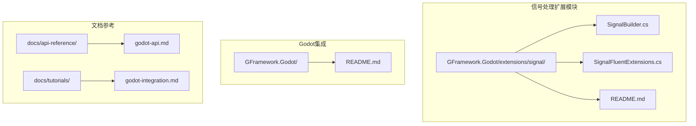
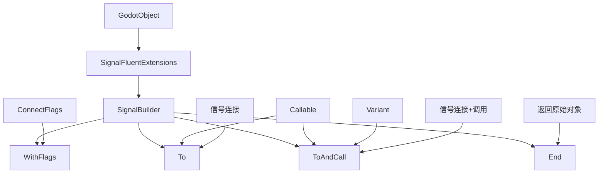
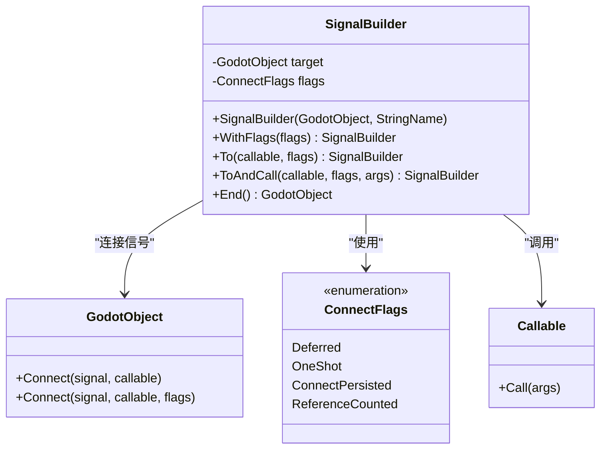
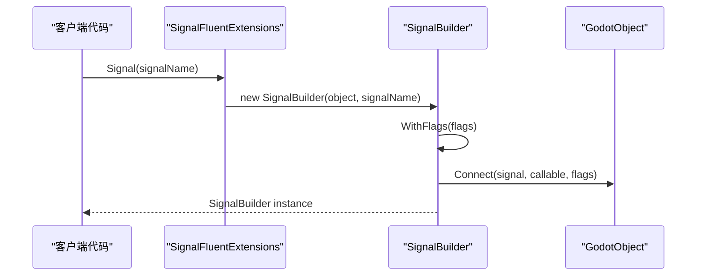
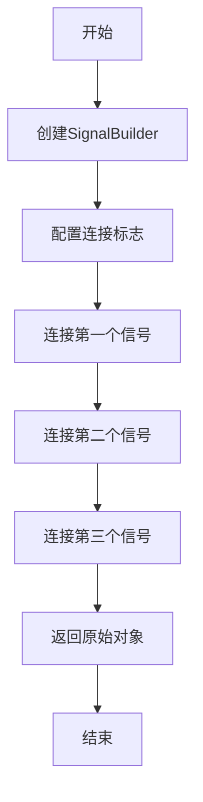

# 信号处理扩展

<cite>
**本文档引用的文件**
- [SignalBuilder.cs](file://GFramework.Godot/extensions/signal/SignalBuilder.cs)
- [SignalFluentExtensions.cs](file://GFramework.Godot/extensions/signal/SignalFluentExtensions.cs)
- [README.md](file://GFramework.Godot/extensions/signal/README.md)
- [README.md](file://GFramework.Godot/README.md)
- [godot-api.md](file://docs/api-reference/godot-api.md)
- [godot-integration.md](file://docs/tutorials/godot-integration.md)
</cite>

## 目录
1. [简介](#简介)
2. [项目结构](#项目结构)
3. [核心组件](#核心组件)
4. [架构概览](#架构概览)
5. [详细组件分析](#详细组件分析)
6. [信号处理高级功能](#信号处理高级功能)
7. [性能考虑](#性能考虑)
8. [最佳实践](#最佳实践)
9. [故障排除指南](#故障排除指南)
10. [结论](#结论)

## 简介

信号处理扩展是GFramework中专门为Godot引擎设计的信号连接系统，提供了流畅式API来简化信号处理逻辑。该系统采用构建器模式和流畅接口设计，大大提高了信号连接代码的可读性和可维护性。

信号处理扩展主要包含两个核心组件：
- **SignalBuilder**：信号连接构建器，负责构建和执行信号连接操作
- **SignalFluentExtensions**：为Godot对象提供流畅的信号API扩展方法

通过这些组件，开发者可以以更加直观和类型安全的方式来处理Godot的信号系统，支持连接标志配置、连接后立即调用、多信号合并等功能。

## 项目结构

信号处理扩展位于GFramework.Godot项目的extensions/signal目录下，采用模块化设计：

**图表来源**
- [SignalBuilder.cs](file://GFramework.Godot/extensions/signal/SignalBuilder.cs#L1-L65)
- [SignalFluentExtensions.cs](file://GFramework.Godot/extensions/signal/SignalFluentExtensions.cs#L1-L22)

**章节来源**
- [SignalBuilder.cs](file://GFramework.Godot/extensions/signal/SignalBuilder.cs#L1-L65)
- [SignalFluentExtensions.cs](file://GFramework.Godot/extensions/signal/SignalFluentExtensions.cs#L1-L22)

## 核心组件

### SignalBuilder 类

SignalBuilder是信号连接系统的核心构建器类，实现了流畅式API的设计模式。它提供了以下主要功能：

- **链式调用支持**：所有配置方法都返回当前构建器实例，支持连续调用
- **连接标志配置**：支持Godot的多种连接标志，如延迟调用、一次性连接等
- **连接后立即调用**：提供ToAndCall方法，可以在连接信号的同时立即调用一次
- **原始对象返回**：End方法显式返回目标Godot对象，便于继续其他操作

### SignalFluentExtensions 类

SignalFluentExtensions为GodotObject提供了扩展方法，创建SignalBuilder实例。这个类实现了扩展方法模式，为现有类型添加了新的功能而不修改原始类。

**章节来源**
- [SignalBuilder.cs](file://GFramework.Godot/extensions/signal/SignalBuilder.cs#L10-L65)
- [SignalFluentExtensions.cs](file://GFramework.Godot/extensions/signal/SignalFluentExtensions.cs#L8-L22)

## 架构概览

信号处理扩展采用了经典的三层架构设计：

**图表来源**
- [SignalBuilder.cs](file://GFramework.Godot/extensions/signal/SignalBuilder.cs#L10-L65)
- [SignalFluentExtensions.cs](file://GFramework.Godot/extensions/signal/SignalFluentExtensions.cs#L8-L22)

### 设计模式应用

信号处理扩展实现了多种设计模式：

1. **构建器模式（Builder Pattern）**：SignalBuilder实现了分步构建复杂的信号连接
2. **流畅接口模式（Fluent Interface）**：支持链式调用，提高代码可读性
3. **扩展方法模式（Extension Method Pattern）**：为现有类型添加新功能

**章节来源**
- [README.md](file://GFramework.Godot/extensions/signal/README.md#L302-L327)

## 详细组件分析

### SignalBuilder 类详细分析

SignalBuilder类的设计体现了良好的面向对象原则：

**图表来源**
- [SignalBuilder.cs](file://GFramework.Godot/extensions/signal/SignalBuilder.cs#L10-L65)

#### 核心方法详解

1. **WithFlags方法**：设置连接标志，支持延迟调用、一次性连接等
2. **To方法**：连接信号到指定的可调用对象
3. **ToAndCall方法**：连接信号并立即调用一次，支持参数传递
4. **End方法**：显式结束构建，返回原始Godot对象

**章节来源**
- [SignalBuilder.cs](file://GFramework.Godot/extensions/signal/SignalBuilder.cs#L19-L64)

### SignalFluentExtensions 类分析

SignalFluentExtensions类提供了简洁的扩展方法接口：

**图表来源**
- [SignalFluentExtensions.cs](file://GFramework.Godot/extensions/signal/SignalFluentExtensions.cs#L16-L21)

**章节来源**
- [SignalFluentExtensions.cs](file://GFramework.Godot/extensions/signal/SignalFluentExtensions.cs#L16-L21)

## 信号处理高级功能

### 连接标志配置

信号处理扩展支持Godot的所有标准连接标志：

| 连接标志 | 描述 | 使用场景 |
|---------|------|----------|
| Deferred | 延迟调用 | 避免在信号触发时修改正在处理的对象状态 |
| OneShot | 一次性连接 | 只需要触发一次的事件处理 |
| ConnectPersisted | 连接持久化 | 保持连接直到显式断开 |
| ReferenceCounted | 引用计数 | 管理多个连接的引用关系 |

### 多信号处理

虽然当前版本的SignalBuilder专注于单信号处理，但通过链式调用可以轻松处理多个信号：

### 条件触发和信号定时

信号处理扩展支持复杂的信号处理场景：

1. **条件触发**：通过在回调函数中实现条件判断
2. **信号定时**：结合Godot的时间系统实现定时信号处理
3. **信号缓存**：通过引用计数管理信号连接的生命周期

**章节来源**
- [README.md](file://GFramework.Godot/extensions/signal/README.md#L115-L121)

## 性能考虑

### 内存分配优化

信号处理扩展在设计时充分考虑了性能因素：

- **轻量级对象**：SignalBuilder是轻量级对象，创建开销很小
- **垃圾回收友好**：使用后可被垃圾回收，不会造成内存泄漏
- **避免重复分配**：通过链式调用减少临时对象的创建

### 调用开销分析

- **与原生API性能相当**：流畅式API与直接调用Godot原生API性能基本相同
- **主要开销在方法链**：链式调用的主要开销在于方法调用本身
- **运行时性能无差异**：实际信号触发时的性能与原生API完全一致

### 推荐使用场景

- **UI事件处理**：按钮点击、菜单选择等交互事件
- **游戏逻辑事件**：角色状态变化、游戏进度更新等
- **音频管理**：音效播放完成、背景音乐循环等

**章节来源**
- [README.md](file://GFramework.Godot/extensions/signal/README.md#L361-L380)

## 最佳实践

### 连接标志选择指南

1. **UI事件**：通常使用`Deferred`标志避免嵌套调用问题
2. **一次性事件**：使用`OneShot`标志确保事件只触发一次
3. **持久化连接**：使用`ConnectPersisted`标志保持连接直到显式断开

### 代码组织建议

1. **链式调用可读性**：保持链式调用的清晰性，避免过度嵌套
2. **参数传递**：合理使用ToAndCall方法传递初始参数
3. **生命周期管理**：结合节点生命周期管理信号连接的注册和注销

### 错误处理策略

1. **空引用检查**：在连接前检查目标对象和可调用对象
2. **异常捕获**：在回调函数中适当捕获和处理异常
3. **资源清理**：确保在节点销毁时正确断开所有信号连接

**章节来源**
- [README.md](file://GFramework.Godot/extensions/signal/README.md#L381-L421)

## 故障排除指南

### 常见问题及解决方案

1. **信号未触发**
   - 检查信号名称是否正确
   - 确认目标对象存在且处于活跃状态
   - 验证连接标志配置是否正确

2. **内存泄漏**
   - 确保在节点退出树时断开信号连接
   - 检查是否有循环引用导致对象无法释放

3. **性能问题**
   - 避免在热循环中频繁创建SignalBuilder实例
   - 考虑使用一次性连接减少不必要的处理

### 调试技巧

1. **日志记录**：在信号回调中添加适当的日志输出
2. **断点调试**：在关键信号处理点设置断点
3. **性能分析**：使用Godot的性能分析工具监控信号处理性能

**章节来源**
- [README.md](file://GFramework.Godot/extensions/signal/README.md#L361-L380)

## 结论

信号处理扩展为GFramework提供了强大而灵活的信号处理能力。通过采用构建器模式和流畅接口设计，它不仅简化了信号连接代码，还保持了与Godot原生API的高性能特性。

该扩展系统的主要优势包括：

- **易用性**：流畅的API设计大大简化了信号处理逻辑
- **类型安全**：编译时检查确保信号名称和参数的正确性
- **性能优秀**：与原生API性能相当，适合各种应用场景
- **可维护性**：清晰的代码结构和良好的文档支持

随着GFramework的发展，信号处理扩展将继续演进，为开发者提供更加完善和强大的信号处理能力。