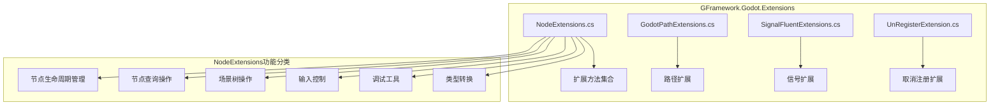
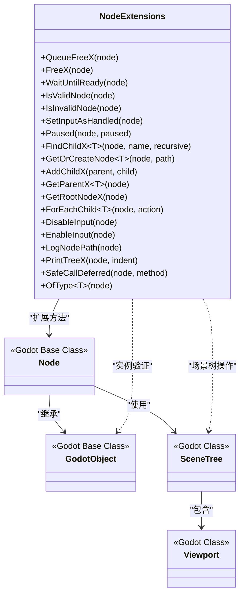
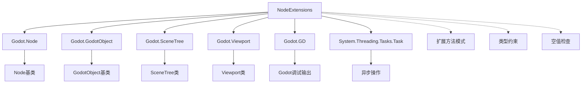

# 节点扩展方法

<cite>
**本文档引用的文件**
- [NodeExtensions.cs](file://GFramework.Godot/extensions/NodeExtensions.cs)
- [README.md](file://GFramework.Godot/README.md)
- [README.md](file://GFramework.Godot/extensions/README.md)
- [README.md](file://GFramework.Godot/extensions/signal/README.md)
</cite>

## 目录
1. [简介](#简介)
2. [项目结构](#项目结构)
3. [核心组件](#核心组件)
4. [架构概览](#架构概览)
5. [详细组件分析](#详细组件分析)
6. [依赖关系分析](#依赖关系分析)
7. [性能考虑](#性能考虑)
8. [故障排除指南](#故障排除指南)
9. [结论](#结论)

## 简介

NodeExtensions类是GFramework.Godot框架中的核心扩展方法集合，为Godot引擎的节点系统提供了丰富而安全的扩展功能。该类包含50多个实用的扩展方法，涵盖了节点生命周期管理、场景树操作、输入处理、调试工具等多个方面，大大简化了Godot开发中的常见操作。

该扩展方法集成为开发者提供了类型安全、线程安全的节点操作能力，通过内置的空值检查和实例有效性验证，避免了常见的空引用异常和节点状态错误。所有方法都遵循流畅接口设计原则，支持链式调用，提高了代码的可读性和开发效率。

## 项目结构

NodeExtensions类位于GFramework.Godot模块的extensions目录下，是Godot扩展方法系统的重要组成部分。

**图表来源**
- [NodeExtensions.cs](file://GFramework.Godot/extensions/NodeExtensions.cs#L1-L259)
- [README.md](file://GFramework.Godot/extensions/README.md#L1-L335)

**章节来源**
- [NodeExtensions.cs](file://GFramework.Godot/extensions/NodeExtensions.cs#L1-L259)
- [README.md](file://GFramework.Godot/extensions/README.md#L1-L335)

## 核心组件

NodeExtensions类提供了以下核心功能模块：

### 节点生命周期管理
- 安全节点释放：QueueFreeX()和FreeX()方法
- 节点就绪等待：WaitUntilReady()异步方法
- 节点有效性检查：IsValidNode()和IsInvalidNode()方法

### 节点查询与转换
- 子节点查找：FindChildX<T>()泛型方法
- 父节点获取：GetParentX<T>()泛型方法
- 节点创建：GetOrCreateNode<T>()方法
- 类型转换：OfType<T>()安全转换

### 场景树操作
- 异步添加子节点：AddChildX()方法
- 根节点获取：GetRootNodeX()方法
- 批量操作：ForEachChild<T>()方法
- 场景树暂停：Paused()方法

### 输入控制
- 输入事件处理：SetInputAsHandled()方法
- 输入状态控制：DisableInput()和EnableInput()方法

### 调试辅助
- 节点路径打印：LogNodePath()方法
- 树形结构打印：PrintTreeX()方法
- 安全延迟调用：SafeCallDeferred()方法

**章节来源**
- [NodeExtensions.cs](file://GFramework.Godot/extensions/NodeExtensions.cs#L10-L259)
- [README.md](file://GFramework.Godot/extensions/README.md#L53-L132)

## 架构概览

NodeExtensions类采用静态扩展方法的设计模式，为Godot的Node类提供了丰富的功能增强。该架构遵循以下设计原则：

**图表来源**
- [NodeExtensions.cs](file://GFramework.Godot/extensions/NodeExtensions.cs#L8-L259)

### 设计模式分析

NodeExtensions类采用了多种设计模式：

1. **扩展方法模式**：为现有类型添加功能而不修改原始类
2. **建造者模式**：通过链式调用构建复杂操作
3. **策略模式**：提供多种节点操作策略
4. **装饰器模式**：为标准方法添加额外功能

**章节来源**
- [NodeExtensions.cs](file://GFramework.Godot/extensions/NodeExtensions.cs#L1-L259)

## 详细组件分析

### 节点释放扩展方法

#### QueueFreeX方法
QueueFreeX()方法提供了安全的节点延迟释放功能，避免了直接调用QueueFree()可能引发的问题。

**方法签名**：`public static void QueueFreeX(this Node? node)`

**参数**：
- `node`：要释放的节点实例（可为空）

**返回值**：无

**使用场景**：
- 安全地移除不再使用的节点
- 避免在当前帧中直接删除节点导致的状态冲突
- 场景切换时的节点清理

**注意事项**：
- 方法内部包含空值检查和实例有效性验证
- 避免重复调用导致的资源浪费
- 适用于大多数节点清理场景

#### FreeX方法
FreeX()方法提供了立即节点释放功能，适用于需要立即释放资源的场景。

**方法签名**：`public static void FreeX(this Node? node)`

**参数**：
- `node`：要立即释放的节点实例（可为空）

**返回值**：无

**使用场景**：
- 紧急清理场景
- 内存压力较大的情况
- 确保资源立即释放的场景

**注意事项**：
- 直接调用Free()可能引发状态冲突
- 仅在确定安全的情况下使用
- 需要谨慎使用，避免破坏场景树状态

**章节来源**
- [NodeExtensions.cs](file://GFramework.Godot/extensions/NodeExtensions.cs#L14-L46)

### 节点有效性检查

#### IsValidNode方法
IsValidNode()方法提供了全面的节点有效性检查功能。

**方法签名**：`public static bool IsValidNode(this Node? node)`

**参数**：
- `node`：要检查的节点实例（可为空）

**返回值**：布尔值，表示节点是否有效

**检查条件**：
1. 节点不为null
2. Godot实例仍然存在（未被释放）
3. 节点已经加入SceneTree

**使用场景**：
- 节点操作前的安全检查
- 条件执行的前置验证
- 调试和日志记录

#### IsInvalidNode方法
IsInvalidNode()方法提供了节点无效性的检查功能。

**方法签名**：`public static bool IsInvalidNode(this Node? node)`

**参数**：
- `node`：要检查的节点实例（可为空）

**返回值**：布尔值，表示节点是否无效

**检查条件**：
1. 节点为null
2. Godot实例已被释放
3. 节点尚未加入SceneTree

**使用场景**：
- 错误处理和异常情况
- 节点状态监控
- 调试和诊断

**章节来源**
- [NodeExtensions.cs](file://GFramework.Godot/extensions/NodeExtensions.cs#L63-L82)

### 异步节点就绪等待

#### WaitUntilReady方法
WaitUntilReady()方法提供了节点就绪状态的异步等待功能。

**方法签名**：`public static async Task WaitUntilReady(this Node node)`

**参数**：
- `node`：要等待的节点实例

**返回值**：Task异步任务

**工作原理**：
- 如果节点已在场景树中，立即返回
- 如果节点不在场景树中，等待Ready信号
- 使用ToSignal()方法监听节点就绪事件

**使用场景**：
- 异步场景加载
- 节点初始化等待
- 资源加载完成确认

**注意事项**：
- 避免在热循环中频繁调用
- 注意异步操作的性能影响
- 合理使用以避免阻塞主线程

**章节来源**
- [NodeExtensions.cs](file://GFramework.Godot/extensions/NodeExtensions.cs#L52-L55)

### 输入事件处理

#### SetInputAsHandled方法
SetInputAsHandled()方法提供了输入事件处理的便捷功能。

**方法签名**：`public static void SetInputAsHandled(this Node node)`

**参数**：
- `node`：要处理输入事件的节点实例

**返回值**：无

**工作原理**：
- 获取节点的视口实例
- 调用SetInputAsHandled()方法标记输入事件已处理

**使用场景**：
- UI控件的输入事件处理
- 防止事件向父节点传播
- 输入拦截和处理

**注意事项**：
- 确保在正确的时机调用
- 避免过度拦截导致的用户体验问题
- 与其他输入处理逻辑协调

**章节来源**
- [NodeExtensions.cs](file://GFramework.Godot/extensions/NodeExtensions.cs#L88-L92)

### 场景树暂停控制

#### Paused方法
Paused()方法提供了场景树暂停状态的控制功能。

**方法签名**：`public static void Paused(this Node node, bool paused = true)`

**参数**：
- `node`：要操作的节点实例
- `paused`：暂停状态标识，默认为true

**返回值**：无

**工作原理**：
- 获取节点的场景树实例
- 设置场景树的Paused属性
- 支持暂停和恢复两种状态

**使用场景**：
- 游戏暂停功能
- 暂停菜单的实现
- 暂停状态的统一管理

**注意事项**：
- 影响整个场景树的更新
- 需要谨慎使用以避免意外暂停
- 与游戏逻辑的暂停状态保持一致

**章节来源**
- [NodeExtensions.cs](file://GFramework.Godot/extensions/NodeExtensions.cs#L99-L103)

### 节点查找和转换

#### FindChildX方法
FindChildX<T>()方法提供了类型安全的子节点查找功能。

**方法签名**：`public static T? FindChildX<T>(this Node node, string name, bool recursive = true)`

**泛型参数**：
- `T`：目标节点类型（必须继承自Node）

**参数**：
- `node`：父节点实例
- `name`：要查找的子节点名称
- `recursive`：是否递归查找所有层级的子节点

**返回值**：找到的子节点转换为指定类型的结果，如果未找到则返回null

**使用场景**：
- 类型安全的节点查找
- 递归搜索子节点
- 泛型节点操作

**注意事项**：
- 使用as操作符进行类型转换
- 支持递归和非递归查找
- 返回null时需要进行空值检查

#### GetParentX方法
GetParentX<T>()方法提供了类型安全的父节点获取功能。

**方法签名**：`public static T? GetParentX<T>(this Node node) where T : Node`

**泛型参数**：
- `T`：目标父节点类型（必须继承自Node）

**参数**：
- `node`：当前节点实例

**返回值**：父节点转换为指定类型的结果，如果转换失败则返回null

**使用场景**：
- 父节点类型检查
- 父节点操作的安全访问
- 层级关系验证

**注意事项**：
- 使用as操作符进行类型转换
- 可能返回null，需要进行空值检查
- 确保父节点类型匹配

**章节来源**
- [NodeExtensions.cs](file://GFramework.Godot/extensions/NodeExtensions.cs#L113-L162)

### 节点创建和管理

#### GetOrCreateNode方法
GetOrCreateNode<T>()方法提供了节点的获取或创建功能。

**方法签名**：`public static T GetOrCreateNode<T>(this Node node, string path) where T : Node, new()`

**泛型参数**：
- `T`：节点类型（必须继承自Node且具有无参构造函数）

**参数**：
- `node`：父节点实例
- `path`：节点路径

**返回值**：找到的现有节点或新创建的节点

**工作流程**：
1. 尝试获取现有节点
2. 如果存在则直接返回
3. 如果不存在则创建新节点
4. 添加到父节点并设置名称

**使用场景**：
- 动态节点创建
- 节点懒加载
- 配置驱动的节点管理

**注意事项**：
- 要求节点类型具有无参构造函数
- 新创建的节点会自动添加到父节点
- 节点名称设置为路径名称

#### AddChildX方法
AddChildX()方法提供了异步添加子节点的功能。

**方法签名**：`public static async Task AddChildX(this Node parent, Node child)`

**参数**：
- `parent`：父节点实例
- `child`：要添加的子节点

**返回值**：Task异步任务

**工作流程**：
1. 添加子节点到父节点
2. 等待子节点就绪
3. 返回异步任务完成

**使用场景**：
- 异步场景加载
- 节点初始化等待
- 资源加载完成确认

**注意事项**：
- 等待子节点的Ready信号
- 避免在热循环中频繁调用
- 注意异步操作的性能影响

**章节来源**
- [NodeExtensions.cs](file://GFramework.Godot/extensions/NodeExtensions.cs#L127-L151)

### 父子关系操作

#### GetRootNodeX方法
GetRootNodeX()方法提供了根节点获取功能。

**方法签名**：`public static Node GetRootNodeX(this Node node)`

**参数**：
- `node`：扩展方法的目标节点

**返回值**：场景树的根节点

**工作原理**：
- 获取节点的场景树实例
- 返回场景树的根节点
- 获取根节点的第一个子节点

**使用场景**：
- 场景树根节点访问
- 全局节点管理
- 场景结构分析

**注意事项**：
- 根节点通常是场景的顶级容器
- 需要谨慎操作根节点
- 避免破坏场景树结构

**章节来源**
- [NodeExtensions.cs](file://GFramework.Godot/extensions/NodeExtensions.cs#L169-L172)

### 批量操作

#### ForEachChild方法
ForEachChild<T>()方法提供了批量子节点操作功能。

**方法签名**：`public static void ForEachChild<T>(this Node node, Action<T> action) where T : Node`

**泛型参数**：
- `T`：要筛选的节点类型（必须继承自Node）

**参数**：
- `node`：扩展方法的目标节点
- `action`：对符合条件的子节点执行的操作

**返回值**：无

**工作流程**：
1. 获取所有子节点
2. 遍历子节点列表
3. 检查节点类型
4. 对匹配类型的节点执行操作

**使用场景**：
- 批量节点操作
- 类型筛选处理
- 统一节点管理

**注意事项**：
- 使用is操作符进行类型检查
- 避免在遍历过程中修改节点列表
- 注意性能影响

**章节来源**
- [NodeExtensions.cs](file://GFramework.Godot/extensions/NodeExtensions.cs#L180-L185)

### 输入控制

#### DisableInput和EnableInput方法
DisableInput()和EnableInput()方法提供了场景树输入控制功能。

**方法签名**：
- `public static void DisableInput(this Node node)`
- `public static void EnableInput(this Node node)`

**参数**：
- `node`：扩展方法的目标节点

**返回值**：无

**工作原理**：
- 检查根节点是否为Viewport类型
- 设置GuiDisableInput属性控制输入处理
- 支持禁用和启用两种状态

**使用场景**：
- 暂停界面的输入处理
- 对话框的输入拦截
- 游戏状态的输入控制

**注意事项**：
- 仅在根节点为Viewport时生效
- 影响整个场景树的输入处理
- 需要与游戏逻辑状态保持一致

**章节来源**
- [NodeExtensions.cs](file://GFramework.Godot/extensions/NodeExtensions.cs#L191-L207)

### 调试辅助

#### LogNodePath方法
LogNodePath()方法提供了节点路径打印功能。

**方法签名**：`public static void LogNodePath(this Node node)`

**参数**：
- `node`：扩展方法的目标节点

**返回值**：无

**工作原理**：
- 获取节点的完整路径
- 使用GD.Print()输出到控制台
- 格式化输出节点路径信息

**使用场景**：
- 调试和诊断
- 节点定位
- 场景结构分析

**注意事项**：
- 输出到Godot控制台
- 适合开发和调试阶段使用
- 避免在生产环境中频繁调用

#### PrintTreeX方法
PrintTreeX()方法提供了树形结构递归打印功能。

**方法签名**：`public static void PrintTreeX(this Node node, string indent = "")`

**参数**：
- `node`：扩展方法的目标节点
- `indent`：缩进字符串，用于显示层级关系

**返回值**：无

**工作原理**：
- 递归遍历节点树
- 使用缩进显示层级关系
- 打印每个节点的名称

**使用场景**：
- 场景树可视化
- 调试和分析
- 教学和演示

**注意事项**：
- 递归调用可能影响性能
- 适合小型到中型场景树
- 避免在大型场景树上频繁调用

**章节来源**
- [NodeExtensions.cs](file://GFramework.Godot/extensions/NodeExtensions.cs#L213-L230)

### 安全延迟调用

#### SafeCallDeferred方法
SafeCallDeferred()方法提供了安全的延迟调用功能。

**方法签名**：`public static void SafeCallDeferred(this Node? node, string method)`

**参数**：
- `node`：扩展方法的目标节点
- `method`：要延迟调用的方法名

**返回值**：无

**工作原理**：
- 检查节点的有效性
- 如果节点有效则执行延迟调用
- 使用CallDeferred()方法确保安全调用

**使用场景**：
- 延迟方法调用
- 安全的异步操作
- 节点状态检查后的操作

**注意事项**：
- 仅在节点有效时执行
- 使用CallDeferred()确保线程安全
- 避免传递不存在的方法名

**章节来源**
- [NodeExtensions.cs](file://GFramework.Godot/extensions/NodeExtensions.cs#L237-L242)

### 类型转换

#### OfType方法
OfType<T>()方法提供了安全的类型转换功能。

**方法签名**：`public static T OfType<T>(this Node? node) where T : Node`

**泛型参数**：
- `T`：目标节点类型（必须继承自Node）

**参数**：
- `node`：要转换的节点对象（可为空）

**返回值**：转换后的目标类型节点

**异常**：
- `InvalidCastException`：当节点无效或类型不匹配时抛出

**工作原理**：
- 检查节点的有效性和类型匹配
- 如果有效且类型匹配则返回节点
- 否则抛出InvalidCastException异常

**使用场景**：
- 类型安全的节点转换
- 强制类型转换
- 类型验证和转换

**注意事项**：
- 可能抛出异常，需要适当的异常处理
- 比as操作符更严格
- 适合需要明确类型转换的场景

**章节来源**
- [NodeExtensions.cs](file://GFramework.Godot/extensions/NodeExtensions.cs#L252-L259)

## 依赖关系分析

NodeExtensions类的依赖关系相对简单，主要依赖于Godot引擎的核心类：

**图表来源**
- [NodeExtensions.cs](file://GFramework.Godot/extensions/NodeExtensions.cs#L1-L259)

### 外部依赖分析

NodeExtensions类的主要外部依赖包括：

1. **Godot.Node**：所有扩展方法的基础类
2. **Godot.GodotObject**：实例有效性检查
3. **Godot.SceneTree**：场景树操作
4. **Godot.Viewport**：输入控制
5. **Godot.GD**：调试输出
6. **System.Threading.Tasks**：异步操作支持

### 内部依赖关系

扩展方法之间的依赖关系主要体现在功能组合上：

- 节点有效性检查：IsValidNode()和IsInvalidNode()互为补充
- 节点查找：FindChildX()和GetParentX()配合使用
- 节点创建：GetOrCreateNode()依赖其他节点操作
- 调试功能：LogNodePath()和PrintTreeX()相互补充

**章节来源**
- [NodeExtensions.cs](file://GFramework.Godot/extensions/NodeExtensions.cs#L1-L259)

## 性能考虑

### 时间复杂度分析

NodeExtensions类中各方法的时间复杂度如下：

1. **QueueFreeX()和FreeX()**：O(1) - 直接调用Godot方法
2. **IsValidNode()和IsInvalidNode()**：O(1) - 简单的布尔检查
3. **WaitUntilReady()**：O(n) - n为等待信号的时间
4. **FindChildX<T>()**：O(m) - m为子节点数量
5. **GetParentX<T>()**：O(1) - 直接获取父节点
6. **GetOrCreateNode<T>()**：O(1) - 查找或创建操作
7. **AddChildX()**：O(k) - k为子节点就绪时间
8. **ForEachChild<T>()**：O(n) - n为子节点数量
9. **DisableInput()和EnableInput()**：O(1) - 状态设置
10. **LogNodePath()和PrintTreeX()**：O(n) - n为节点数量
11. **SafeCallDeferred()**：O(1) - 延迟调用
12. **OfType<T>()**：O(1) - 类型检查

### 空间复杂度分析

- 大多数方法的空间复杂度为O(1)
- PrintTreeX()方法由于递归调用，空间复杂度为O(h)，其中h为树的高度
- GetOrCreateNode<T>()方法创建新节点时增加内存占用

### 性能优化建议

1. **避免频繁调用**：
   - 调试方法如PrintTreeX()仅在开发阶段使用
   - 大量节点操作时考虑批量处理

2. **合理使用异步操作**：
   - WaitUntilReady()避免在热循环中频繁调用
   - AddChildX()仅在需要等待就绪时使用

3. **类型安全的优先选择**：
   - 优先使用FindChildX<T>()而非FindChild() + as转换
   - 使用OfType<T>()替代强制类型转换

4. **输入控制的谨慎使用**：
   - DisableInput()和EnableInput()影响整个场景树
   - 需要与游戏状态保持同步

5. **节点释放的最佳实践**：
   - 优先使用QueueFreeX()而非FreeX()
   - 避免重复释放节点

**章节来源**
- [NodeExtensions.cs](file://GFramework.Godot/extensions/NodeExtensions.cs#L1-L259)
- [README.md](file://GFramework.Godot/extensions/README.md#L281-L335)

## 故障排除指南

### 常见问题和解决方案

#### 节点释放问题
**问题**：节点无法正确释放或出现异常
**解决方案**：
- 使用QueueFreeX()而非FreeX()进行安全释放
- 确保节点已加入场景树后再释放
- 避免重复释放同一节点

#### 节点查找失败
**问题**：FindChildX<T>()返回null
**解决方案**：
- 检查节点名称是否正确
- 确认recursive参数设置
- 验证节点是否已加入场景树

#### 类型转换异常
**问题**：OfType<T>()抛出InvalidCastException
**解决方案**：
- 使用IsValidNode()先验证节点有效性
- 检查目标类型是否正确
- 考虑使用as操作符进行安全转换

#### 异步操作超时
**问题**：WaitUntilReady()长时间等待
**解决方案**：
- 检查节点是否正确加入场景树
- 验证节点的Ready信号是否正常触发
- 考虑添加超时机制

#### 输入处理问题
**问题**：SetInputAsHandled()无效
**解决方案**：
- 确认节点的视口设置
- 检查输入事件的传播路径
- 验证输入处理的时机

### 调试技巧

1. **使用LogNodePath()**：快速定位节点位置
2. **使用PrintTreeX()**：查看完整的场景树结构
3. **使用IsValidNode()**：验证节点状态
4. **使用SafeCallDeferred()**：确保安全的异步调用

### 最佳实践清单

- 始终使用安全的节点操作方法
- 在关键操作前进行节点有效性检查
- 合理使用异步操作避免阻塞
- 选择合适的方法进行类型转换
- 谨慎使用输入控制功能
- 定期清理不需要的节点引用

**章节来源**
- [NodeExtensions.cs](file://GFramework.Godot/extensions/NodeExtensions.cs#L1-L259)
- [README.md](file://GFramework.Godot/extensions/README.md#L287-L335)

## 结论

NodeExtensions类为GFramework.Godot框架提供了全面而强大的节点扩展功能。通过50多个精心设计的扩展方法，开发者可以更加安全、高效地进行Godot节点操作。

该类的主要优势包括：

1. **安全性**：内置的空值检查和实例有效性验证
2. **便利性**：流畅的API设计和链式调用支持
3. **类型安全**：泛型方法确保编译时类型检查
4. **性能优化**：最小化内存分配和优化常见操作
5. **一致性**：统一的命名约定和行为模式

通过合理使用这些扩展方法，开发者可以显著提高Godot开发的效率和质量，减少常见的节点操作错误，构建更加健壮的游戏应用。

建议在实际项目中：
- 优先使用NodeExtensions提供的安全方法
- 结合GFramework的整体架构模式使用
- 根据具体需求选择合适的方法组合
- 定期审查和优化节点操作逻辑