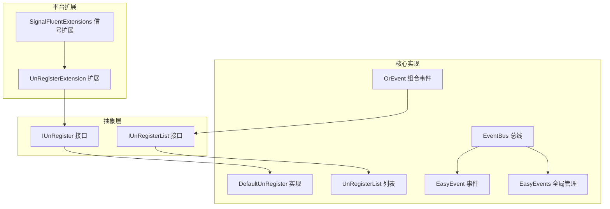
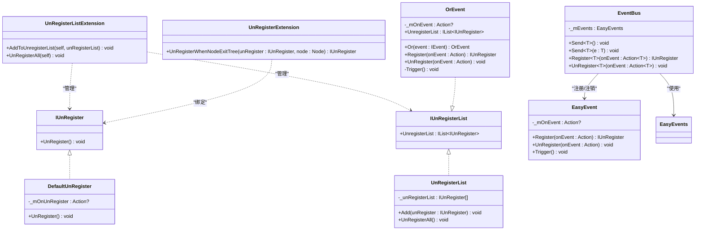
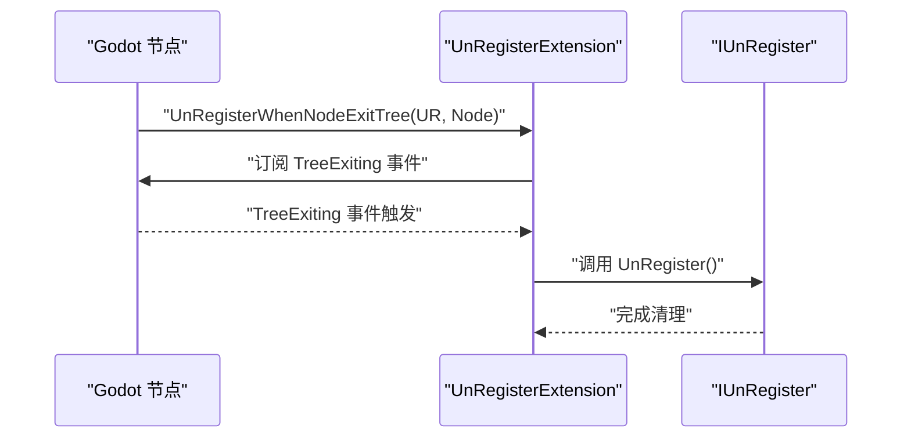
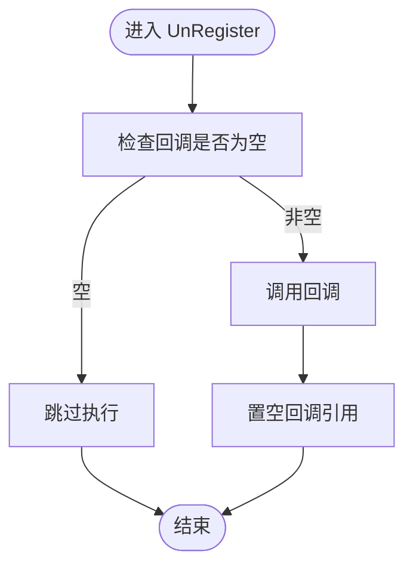
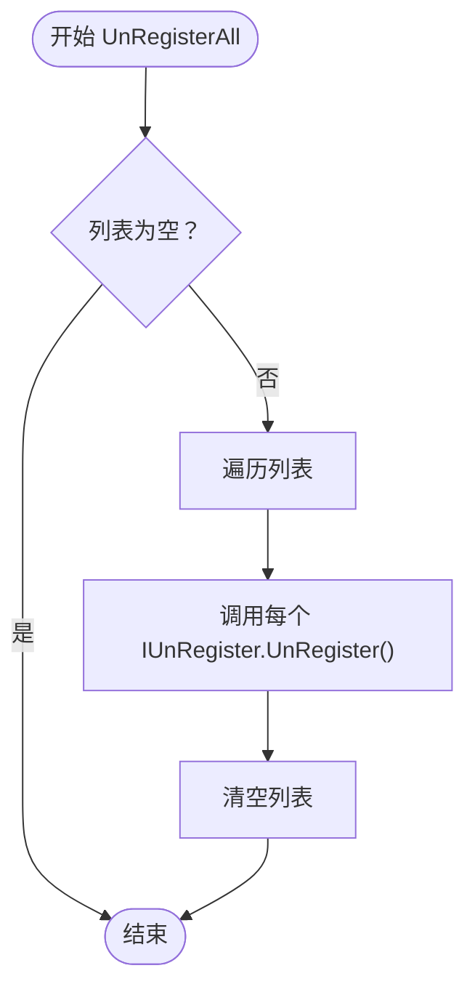
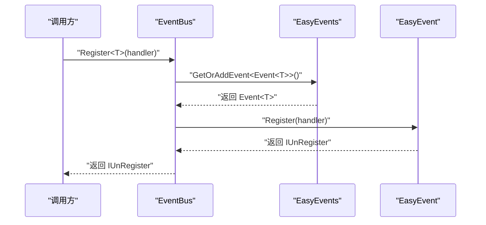
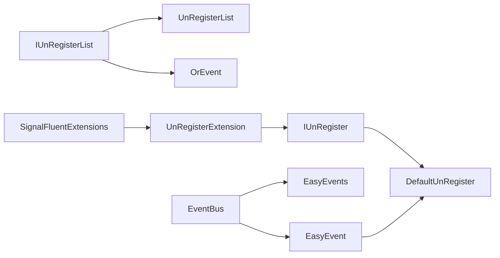

# 资源管理扩展

<cite>
**本文档引用的文件**
- [UnRegisterExtension.cs](file://GFramework.Godot/extensions/UnRegisterExtension.cs)
- [IUnRegister.cs](file://GFramework.Core.Abstractions/events/IUnRegister.cs)
- [IUnRegisterList.cs](file://GFramework.Core.Abstractions/events/IUnRegisterList.cs)
- [DefaultUnRegister.cs](file://GFramework.Core/events/DefaultUnRegister.cs)
- [UnRegisterList.cs](file://GFramework.Core/events/UnRegisterList.cs)
- [UnRegisterListExtension.cs](file://GFramework.Core/extensions/UnRegisterListExtension.cs)
- [EasyEvent.cs](file://GFramework.Core/events/EasyEvent.cs)
- [EventBus.cs](file://GFramework.Core/events/EventBus.cs)
- [EasyEvents.cs](file://GFramework.Core/events/EasyEvents.cs)
- [OrEvent.cs](file://GFramework.Core/events/OrEvent.cs)
- [SignalFluentExtensions.cs](file://GFramework.Godot/extensions/signal/SignalFluentExtensions.cs)
- [UnRegisterListExtensionTests.cs](file://GFramework.Core.Tests/extensions/UnRegisterListExtensionTests.cs)
</cite>

## 目录
1. [简介](#简介)
2. [项目结构](#项目结构)
3. [核心组件](#核心组件)
4. [架构总览](#架构总览)
5. [详细组件分析](#详细组件分析)
6. [依赖分析](#依赖分析)
7. [性能考虑](#性能考虑)
8. [故障排除指南](#故障排除指南)
9. [结论](#结论)
10. [附录](#附录)

## 简介
本文件围绕资源管理扩展展开，重点阐述 UnRegisterExtension 提供的资源清理与生命周期管理能力，包括自动资源释放、事件监听器注销、订阅关系清理以及内存泄漏防护等核心功能。文档将结合具体代码文件，说明各类资源清理方法的使用场景与调用时机，并给出最佳实践指导，帮助开发者在游戏开发中实现稳定、高性能、低泄漏的资源管理。

## 项目结构
资源管理扩展主要分布在以下模块：
- 抽象层：定义统一的注销接口与列表接口，确保跨平台一致性
- 核心实现：提供默认注销器、注销列表、事件系统与组合事件等
- 平台扩展：Godot 平台下的节点生命周期绑定扩展
- 测试：验证扩展方法的行为与边界条件

**图表来源**
- [IUnRegister.cs](file://GFramework.Core.Abstractions/events/IUnRegister.cs#L1-L12)
- [IUnRegisterList.cs](file://GFramework.Core.Abstractions/events/IUnRegisterList.cs#L1-L14)
- [DefaultUnRegister.cs](file://GFramework.Core/events/DefaultUnRegister.cs#L1-L22)
- [UnRegisterList.cs](file://GFramework.Core/events/UnRegisterList.cs#L1-L37)
- [EasyEvent.cs](file://GFramework.Core/events/EasyEvent.cs#L1-L39)
- [EventBus.cs](file://GFramework.Core/events/EventBus.cs#L1-L55)
- [EasyEvents.cs](file://GFramework.Core/events/EasyEvents.cs#L1-L85)
- [OrEvent.cs](file://GFramework.Core/events/OrEvent.cs#L1-L57)
- [UnRegisterExtension.cs](file://GFramework.Godot/extensions/UnRegisterExtension.cs#L1-L23)
- [SignalFluentExtensions.cs](file://GFramework.Godot/extensions/signal/SignalFluentExtensions.cs#L1-L22)

**章节来源**
- [IUnRegister.cs](file://GFramework.Core.Abstractions/events/IUnRegister.cs#L1-L12)
- [IUnRegisterList.cs](file://GFramework.Core.Abstractions/events/IUnRegisterList.cs#L1-L14)
- [DefaultUnRegister.cs](file://GFramework.Core/events/DefaultUnRegister.cs#L1-L22)
- [UnRegisterList.cs](file://GFramework.Core/events/UnRegisterList.cs#L1-L37)
- [EasyEvent.cs](file://GFramework.Core/events/EasyEvent.cs#L1-L39)
- [EventBus.cs](file://GFramework.Core/events/EventBus.cs#L1-L55)
- [EasyEvents.cs](file://GFramework.Core/events/EasyEvents.cs#L1-L85)
- [OrEvent.cs](file://GFramework.Core/events/OrEvent.cs#L1-L57)
- [UnRegisterExtension.cs](file://GFramework.Godot/extensions/UnRegisterExtension.cs#L1-L23)
- [SignalFluentExtensions.cs](file://GFramework.Godot/extensions/signal/SignalFluentExtensions.cs#L1-L22)

## 核心组件
- IUnRegister：定义统一的注销接口，要求实现 UnRegister() 方法以执行清理动作
- DefaultUnRegister：默认注销器实现，保存回调并在注销时调用并清理引用
- IUnRegisterList：统一注销列表接口，暴露可变的 IUnRegister 集合
- UnRegisterList：注销列表实现，提供批量注销与清空能力
- UnRegisterListExtension：扩展方法，提供 AddToUnregisterList 与 UnRegisterAll 的便捷调用
- EasyEvent：简单事件系统，注册回调返回 IUnRegister，支持触发与注销
- EventBus：类型化事件总线，封装 EasyEvents，提供 Send/Register/UnRegister
- OrEvent：组合事件，支持多事件“或”逻辑，内部维护注销列表
- UnRegisterExtension（Godot）：将 IUnRegister 与 Godot 节点生命周期绑定，节点退出场景树时自动注销
- SignalFluentExtensions（Godot）：为 Node 提供信号流畅 API，便于与注销机制配合

**章节来源**
- [IUnRegister.cs](file://GFramework.Core.Abstractions/events/IUnRegister.cs#L1-L12)
- [DefaultUnRegister.cs](file://GFramework.Core/events/DefaultUnRegister.cs#L1-L22)
- [IUnRegisterList.cs](file://GFramework.Core.Abstractions/events/IUnRegisterList.cs#L1-L14)
- [UnRegisterList.cs](file://GFramework.Core/events/UnRegisterList.cs#L1-L37)
- [UnRegisterListExtension.cs](file://GFramework.Core/extensions/UnRegisterListExtension.cs#L1-L32)
- [EasyEvent.cs](file://GFramework.Core/events/EasyEvent.cs#L1-L39)
- [EventBus.cs](file://GFramework.Core/events/EventBus.cs#L1-L55)
- [OrEvent.cs](file://GFramework.Core/events/OrEvent.cs#L1-L57)
- [UnRegisterExtension.cs](file://GFramework.Godot/extensions/UnRegisterExtension.cs#L1-L23)
- [SignalFluentExtensions.cs](file://GFramework.Godot/extensions/signal/SignalFluentExtensions.cs#L1-L22)

## 架构总览
资源管理扩展通过“接口抽象 + 默认实现 + 扩展方法 + 平台绑定”的方式，形成清晰的层次化架构：
- 抽象层定义最小可用契约，保证跨平台一致性
- 核心实现提供通用能力（事件、注销、列表）
- 扩展方法提升易用性与可组合性
- 平台扩展将生命周期与平台事件对接，实现自动清理

**图表来源**
- [IUnRegister.cs](file://GFramework.Core.Abstractions/events/IUnRegister.cs#L1-L12)
- [DefaultUnRegister.cs](file://GFramework.Core/events/DefaultUnRegister.cs#L1-L22)
- [IUnRegisterList.cs](file://GFramework.Core.Abstractions/events/IUnRegisterList.cs#L1-L14)
- [UnRegisterList.cs](file://GFramework.Core/events/UnRegisterList.cs#L1-L37)
- [UnRegisterListExtension.cs](file://GFramework.Core/extensions/UnRegisterListExtension.cs#L1-L32)
- [EasyEvent.cs](file://GFramework.Core/events/EasyEvent.cs#L1-L39)
- [EventBus.cs](file://GFramework.Core/events/EventBus.cs#L1-L55)
- [OrEvent.cs](file://GFramework.Core/events/OrEvent.cs#L1-L57)
- [UnRegisterExtension.cs](file://GFramework.Godot/extensions/UnRegisterExtension.cs#L1-L23)

## 详细组件分析

### UnRegisterExtension（Godot 平台扩展）
- 功能概述：提供扩展方法，将 IUnRegister 与 Godot 节点生命周期绑定，节点退出场景树时自动执行注销
- 关键行为：
  - 监听节点 TreeExiting 事件
  - 在事件触发时调用 IUnRegister.UnRegister()
  - 返回原始 IUnRegister 实例，支持链式调用
- 使用场景：
  - UI 页面、场景切换、临时监听器等需要随节点销毁而自动清理的资源
- 调用时机：在注册监听器后立即调用，确保节点生命周期内始终受控

**图表来源**
- [UnRegisterExtension.cs](file://GFramework.Godot/extensions/UnRegisterExtension.cs#L17-L22)

**章节来源**
- [UnRegisterExtension.cs](file://GFramework.Godot/extensions/UnRegisterExtension.cs#L1-L23)

### DefaultUnRegister（默认注销器）
- 功能概述：保存注册的回调，在 UnRegister() 中调用并清理引用，防止重复调用
- 关键行为：
  - 保存 Action 回调
  - 执行回调并置空引用
  - 避免重复注销导致的异常
- 使用场景：事件注册返回的 IUnRegister 实例，通常由 EasyEvent/EasyEvents/EasyEventGeneric 等事件系统生成

**图表来源**
- [DefaultUnRegister.cs](file://GFramework.Core/events/DefaultUnRegister.cs#L16-L21)

**章节来源**
- [DefaultUnRegister.cs](file://GFramework.Core/events/DefaultUnRegister.cs#L1-L22)

### UnRegisterList 与 UnRegisterListExtension（批量注销）
- UnRegisterList：维护 IUnRegister 列表，提供 Add 与 UnRegisterAll
- UnRegisterListExtension：扩展方法，将 IUnRegister 添加到 IUnRegisterList，并提供 UnRegisterAll 批量清理
- 关键行为：
  - AddToUnregisterList：将单个注销项加入列表
  - UnRegisterAll：遍历列表逐一调用 UnRegister 并清空集合
- 使用场景：组件或页面集中管理多个监听器、订阅关系、定时器等资源

**图表来源**
- [UnRegisterList.cs](file://GFramework.Core/events/UnRegisterList.cs#L29-L36)
- [UnRegisterListExtension.cs](file://GFramework.Core/extensions/UnRegisterListExtension.cs#L24-L31)

**章节来源**
- [UnRegisterList.cs](file://GFramework.Core/events/UnRegisterList.cs#L1-L37)
- [UnRegisterListExtension.cs](file://GFramework.Core/extensions/UnRegisterListExtension.cs#L1-L32)
- [UnRegisterListExtensionTests.cs](file://GFramework.Core.Tests/extensions/UnRegisterListExtensionTests.cs#L1-L132)

### EasyEvent 与 EventBus（事件系统）
- EasyEvent：无参事件系统，Register 返回 IUnRegister，支持 Trigger 与 UnRegister
- EventBus：类型化事件总线，封装 EasyEvents，提供 Send/Register/UnRegister
- 关键行为：
  - Register 返回 IUnRegister，便于后续注销
  - EventBus 基于类型管理事件，避免重复创建
- 使用场景：模块间解耦通信、状态变更通知、UI 交互响应等

**图表来源**
- [EventBus.cs](file://GFramework.Core/events/EventBus.cs#L41-L44)
- [EasyEvents.cs](file://GFramework.Core/events/EasyEvents.cs#L74-L84)
- [EasyEvent.cs](file://GFramework.Core/events/EasyEvent.cs#L17-L21)

**章节来源**
- [EasyEvent.cs](file://GFramework.Core/events/EasyEvent.cs#L1-L39)
- [EventBus.cs](file://GFramework.Core/events/EventBus.cs#L1-L55)
- [EasyEvents.cs](file://GFramework.Core/events/EasyEvents.cs#L1-L85)

### OrEvent（组合事件）
- 功能概述：将多个事件通过“或”逻辑组合，任一事件触发即触发 OrEvent，并维护内部注销列表
- 关键行为：
  - Or：将其他事件注册到当前 OrEvent，并自动加入注销列表
  - UnRegister：取消指定处理函数并触发 UnRegisterAll
- 使用场景：多来源触发聚合、条件组合、复杂 UI 交互

**章节来源**
- [OrEvent.cs](file://GFramework.Core/events/OrEvent.cs#L1-L57)

### SignalFluentExtensions（Godot 信号扩展）
- 功能概述：为 Godot 对象提供 Signal() 流畅 API，便于与注销机制配合使用
- 使用场景：节点信号订阅与注销的链式调用

**章节来源**
- [SignalFluentExtensions.cs](file://GFramework.Godot/extensions/signal/SignalFluentExtensions.cs#L1-L22)

## 依赖分析
- 抽象接口依赖：IUnRegister 与 IUnRegisterList 是核心契约，被 DefaultUnRegister、UnRegisterList、OrEvent 等实现
- 事件系统依赖：EventBus 依赖 EasyEvents 进行事件实例管理；EasyEvent 依赖 DefaultUnRegister 生成注销令牌
- 平台扩展依赖：UnRegisterExtension 依赖 Godot 节点生命周期事件，实现自动注销
- 扩展方法依赖：UnRegisterListExtension 依赖 IUnRegister 与 IUnRegisterList，提供批量管理能力

**图表来源**
- [IUnRegister.cs](file://GFramework.Core.Abstractions/events/IUnRegister.cs#L1-L12)
- [IUnRegisterList.cs](file://GFramework.Core.Abstractions/events/IUnRegisterList.cs#L1-L14)
- [DefaultUnRegister.cs](file://GFramework.Core/events/DefaultUnRegister.cs#L1-L22)
- [UnRegisterList.cs](file://GFramework.Core/events/UnRegisterList.cs#L1-L37)
- [OrEvent.cs](file://GFramework.Core/events/OrEvent.cs#L1-L57)
- [EventBus.cs](file://GFramework.Core/events/EventBus.cs#L1-L55)
- [EasyEvents.cs](file://GFramework.Core/events/EasyEvents.cs#L1-L85)
- [EasyEvent.cs](file://GFramework.Core/events/EasyEvent.cs#L1-L39)
- [UnRegisterExtension.cs](file://GFramework.Godot/extensions/UnRegisterExtension.cs#L1-L23)
- [SignalFluentExtensions.cs](file://GFramework.Godot/extensions/signal/SignalFluentExtensions.cs#L1-L22)

**章节来源**
- [IUnRegister.cs](file://GFramework.Core.Abstractions/events/IUnRegister.cs#L1-L12)
- [IUnRegisterList.cs](file://GFramework.Core.Abstractions/events/IUnRegisterList.cs#L1-L14)
- [DefaultUnRegister.cs](file://GFramework.Core/events/DefaultUnRegister.cs#L1-L22)
- [UnRegisterList.cs](file://GFramework.Core/events/UnRegisterList.cs#L1-L37)
- [OrEvent.cs](file://GFramework.Core/events/OrEvent.cs#L1-L57)
- [EventBus.cs](file://GFramework.Core/events/EventBus.cs#L1-L55)
- [EasyEvents.cs](file://GFramework.Core/events/EasyEvents.cs#L1-L85)
- [EasyEvent.cs](file://GFramework.Core/events/EasyEvent.cs#L1-L39)
- [UnRegisterExtension.cs](file://GFramework.Godot/extensions/UnRegisterExtension.cs#L1-L23)
- [SignalFluentExtensions.cs](file://GFramework.Godot/extensions/signal/SignalFluentExtensions.cs#L1-L22)

## 性能考虑
- 事件注册与注销成本：每次注册返回 IUnRegister，建议在不需要时及时注销，避免回调链过长
- 批量注销：使用 UnRegisterAll 一次性清理，减少循环开销
- 自动清理：通过 UnRegisterWhenNodeExitTree 将清理与节点生命周期绑定，避免手动遗漏
- 内存泄漏防护：DefaultUnRegister 在注销后置空回调，防止闭包持有导致的泄漏
- 平台集成：Godot 信号与节点生命周期结合，确保场景切换时资源自动回收

[本节为通用性能指导，无需特定文件分析]

## 故障排除指南
- 注销多次导致异常：确认 DefaultUnRegister 只会调用一次回调并清理引用
- 批量注销无效：检查 UnRegisterList 是否正确添加 IUnRegister，UnRegisterAll 是否被调用
- 节点退出未清理：确认 UnRegisterWhenNodeExitTree 已在注册监听器后调用
- 组合事件未完全清理：OrEvent 的 UnRegister 会触发 UnRegisterAll，确保内部事件正确注册

**章节来源**
- [DefaultUnRegister.cs](file://GFramework.Core/events/DefaultUnRegister.cs#L16-L21)
- [UnRegisterListExtensionTests.cs](file://GFramework.Core.Tests/extensions/UnRegisterListExtensionTests.cs#L56-L120)
- [UnRegisterExtension.cs](file://GFramework.Godot/extensions/UnRegisterExtension.cs#L17-L22)
- [OrEvent.cs](file://GFramework.Core/events/OrEvent.cs#L44-L48)

## 结论
资源管理扩展通过统一的注销接口与平台绑定，实现了事件监听器、订阅关系与节点生命周期的自动化清理，有效降低内存泄漏风险并提升性能稳定性。结合批量注销与组合事件机制，开发者可以更高效地管理复杂场景下的资源生命周期。

[本节为总结性内容，无需特定文件分析]

## 附录

### 最佳实践清单
- 事件注册后立即获取 IUnRegister，并在合适时机调用 UnRegister 或 UnRegisterAll
- 使用 UnRegisterWhenNodeExitTree 将节点相关资源与场景树生命周期绑定
- 通过 UnRegisterList 集中管理组件内的多项注销项，避免遗漏
- 组合事件 OrEvent 适合多来源聚合触发，注意内部事件的正确注册与注销
- 与 SignalFluentExtensions 配合，实现信号订阅的流畅与可维护

### 调用时机参考
- 事件注册：在组件初始化阶段完成
- 自动清理：在注册监听器后立即调用 UnRegisterWhenNodeExitTree
- 批量清理：在组件销毁或页面切换时调用 UnRegisterAll
- 组合事件：在 OrEvent 上注册处理函数后，确保内部事件已加入注销列表

[本节为概念性内容，无需特定文件分析]