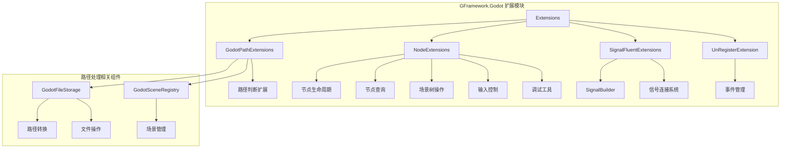
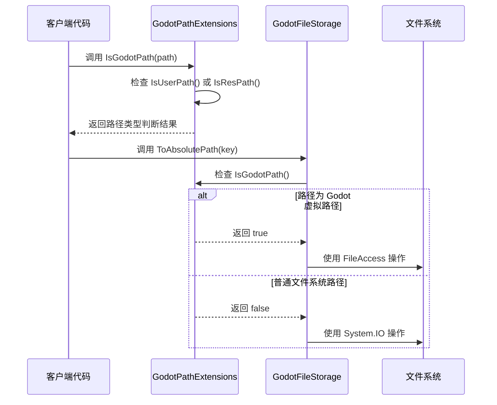
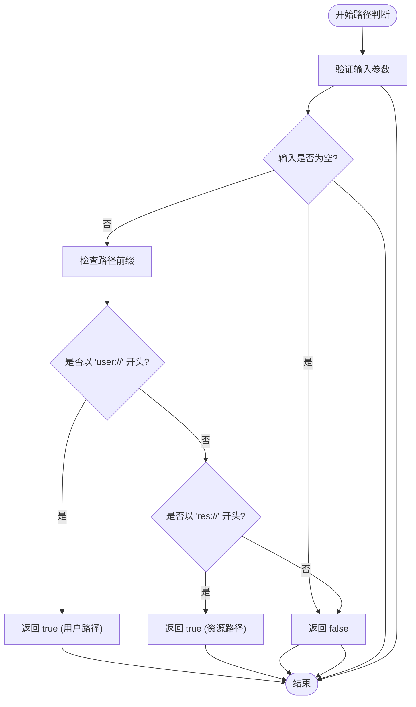
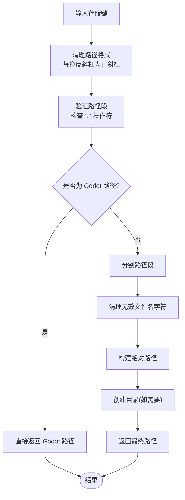
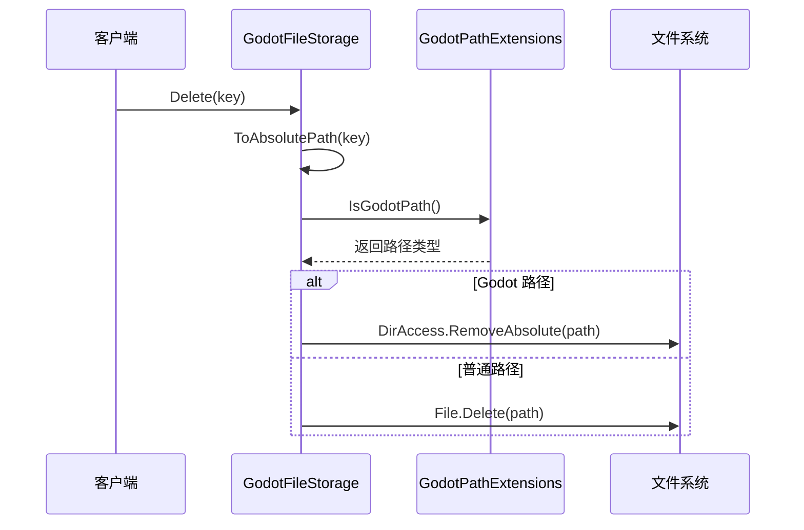
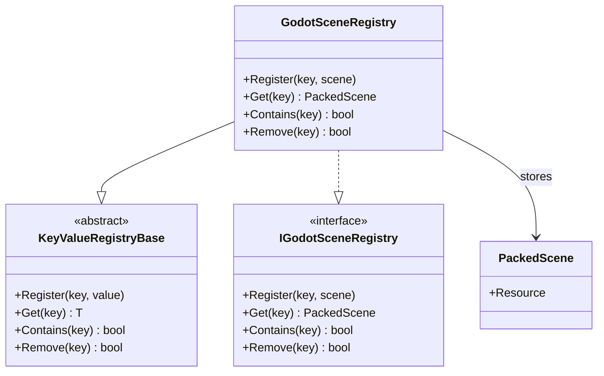
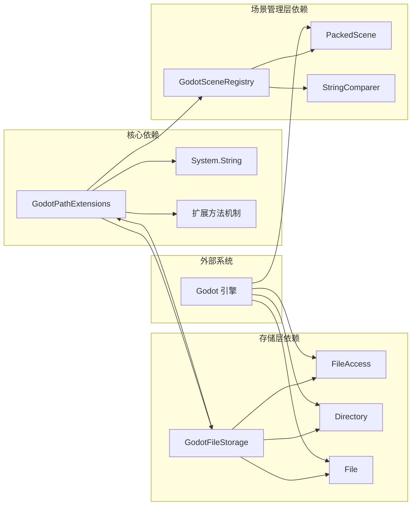

# 路径扩展功能

<cite>
**本文档引用的文件**
- [GodotPathExtensions.cs](file://GFramework.Godot/extensions/GodotPathExtensions.cs)
- [README.md](file://GFramework.Godot/extensions/README.md)
- [GodotFileStorage.cs](file://GFramework.Godot/storage/GodotFileStorage.cs)
- [GodotSceneRegistry.cs](file://GFramework.Godot/scene/GodotSceneRegistry.cs)
- [IGodotSceneRegistry.cs](file://GFramework.Godot/scene/IGodotSceneRegistry.cs)
- [README.md](file://GFramework.Godot/README.md)
</cite>

## 目录
1. [简介](#简介)
2. [项目结构](#项目结构)
3. [核心组件](#核心组件)
4. [架构概览](#架构概览)
5. [详细组件分析](#详细组件分析)
6. [依赖关系分析](#依赖关系分析)
7. [性能考虑](#性能考虑)
8. [故障排除指南](#故障排除指南)
9. [结论](#结论)

## 简介

GodotPathExtensions 类是 GFramework.Godot 框架中的一个轻量级路径处理扩展，专门用于识别和验证 Godot 引擎的虚拟路径格式。该类提供了三个核心方法来判断路径类型：`IsUserPath()` 用于识别用户数据路径（user://），`IsResPath()` 用于识别资源路径（res://），以及 `IsGodotPath()` 用于判断是否为 Godot 虚拟路径。

在 Godot 引擎中，路径系统分为三类：
- **res://** - 资源路径：指向游戏包内的资源文件
- **user://** - 用户数据路径：指向用户特定的数据存储位置
- **绝对/相对文件系统路径**：指向操作系统文件系统中的文件

## 项目结构



**图表来源**
- [README.md](file://GFramework.Godot/extensions/README.md#L10-L26)
- [GodotPathExtensions.cs](file://GFramework.Godot/extensions/GodotPathExtensions.cs#L3-L22)

**章节来源**
- [README.md](file://GFramework.Godot/extensions/README.md#L1-L335)
- [GodotPathExtensions.cs](file://GFramework.Godot/extensions/GodotPathExtensions.cs#L1-L22)

## 核心组件

### GodotPathExtensions 类

GodotPathExtensions 是一个静态类，提供了三个核心的路径判断方法：

#### 方法概览

| 方法名 | 功能描述 | 参数 | 返回值 | 使用场景 |
|--------|----------|------|--------|----------|
| IsUserPath | 判断是否为 Godot 用户数据路径 | `string path` | `bool` | 用户数据文件验证 |
| IsResPath | 判断是否为 Godot 资源路径 | `string path` | `bool` | 资源文件验证 |
| IsGodotPath | 判断是否为 Godot 虚拟路径 | `string path` | `bool` | 通用路径类型判断 |

#### 实现特点

- **空值安全**：所有方法都检查输入字符串是否为 null 或空
- **前缀匹配**：使用字符串前缀匹配来识别路径类型
- **性能优化**：采用简单的字符串操作，时间复杂度为 O(1)
- **类型安全**：作为扩展方法使用，提供流畅的 API 体验

**章节来源**
- [GodotPathExtensions.cs](file://GFramework.Godot/extensions/GodotPathExtensions.cs#L3-L22)

## 架构概览



**图表来源**
- [GodotPathExtensions.cs](file://GFramework.Godot/extensions/GodotPathExtensions.cs#L8-L21)
- [GodotFileStorage.cs](file://GFramework.Godot/storage/GodotFileStorage.cs#L85-L114)

## 详细组件分析

### 路径类型判断机制



**图表来源**
- [GodotPathExtensions.cs](file://GFramework.Godot/extensions/GodotPathExtensions.cs#L8-L21)

### 路径转换流程

GodotFileStorage 类展示了如何在实际应用中使用路径扩展功能：



**图表来源**
- [GodotFileStorage.cs](file://GFramework.Godot/storage/GodotFileStorage.cs#L85-L114)

**章节来源**
- [GodotFileStorage.cs](file://GFramework.Godot/storage/GodotFileStorage.cs#L85-L114)

### 文件存储操作集成

GodotFileStorage 类展示了路径扩展在实际文件操作中的应用：

#### 删除操作流程



**图表来源**
- [GodotFileStorage.cs](file://GFramework.Godot/storage/GodotFileStorage.cs#L39-L66)
- [GodotPathExtensions.cs](file://GFramework.Godot/extensions/GodotPathExtensions.cs#L20-L21)

**章节来源**
- [GodotFileStorage.cs](file://GFramework.Godot/storage/GodotFileStorage.cs#L39-L66)

### 场景路径管理

虽然 GodotPathExtensions 本身不直接处理场景路径，但它与场景管理系统协同工作：

#### 场景注册表架构



**图表来源**
- [GodotSceneRegistry.cs](file://GFramework.Godot/scene/GodotSceneRegistry.cs#L11-L12)
- [IGodotSceneRegistry.cs](file://GFramework.Godot/scene/IGodotSceneRegistry.cs#L9)

**章节来源**
- [GodotSceneRegistry.cs](file://GFramework.Godot/scene/GodotSceneRegistry.cs#L11-L12)
- [IGodotSceneRegistry.cs](file://GFramework.Godot/scene/IGodotSceneRegistry.cs#L9)

## 依赖关系分析



**图表来源**
- [GodotPathExtensions.cs](file://GFramework.Godot/extensions/GodotPathExtensions.cs#L1-L22)
- [GodotFileStorage.cs](file://GFramework.Godot/storage/GodotFileStorage.cs#L1-L31)
- [GodotSceneRegistry.cs](file://GFramework.Godot/scene/GodotSceneRegistry.cs#L1-L12)

**章节来源**
- [GodotFileStorage.cs](file://GFramework.Godot/storage/GodotFileStorage.cs#L1-L31)
- [GodotSceneRegistry.cs](file://GFramework.Godot/scene/GodotSceneRegistry.cs#L1-L12)

## 性能考虑

### 时间复杂度分析

- **IsUserPath()**: O(1) - 字符串前缀比较
- **IsResPath()**: O(1) - 字符串前缀比较  
- **IsGodotPath()**: O(1) - 两次前缀比较的逻辑或运算

### 内存使用

- 所有方法都是纯函数，不创建额外的内存分配
- 字符串操作在栈上完成，无堆分配
- 扩展方法调用开销最小

### 最佳实践建议

1. **批量路径判断**：对于大量路径的判断，优先使用 `IsGodotPath()` 统一处理
2. **缓存结果**：对于重复使用的路径判断结果，考虑在业务层缓存
3. **避免不必要的转换**：直接使用 Godot 路径格式，避免不必要的路径转换

## 故障排除指南

### 常见问题及解决方案

#### 问题1：路径判断总是返回 false
**可能原因**：
- 输入路径为 null 或空字符串
- 路径格式不正确（缺少协议前缀）

**解决方案**：
```csharp
// 确保输入验证
if (!string.IsNullOrEmpty(path) && path.StartsWith("res://"))
{
    // 处理资源路径
}
```

#### 问题2：路径转换异常
**可能原因**：
- 路径包含非法字符 '..'
- 路径格式不符合要求

**解决方案**：
```csharp
// 使用框架提供的安全转换
try
{
    var absolutePath = ToAbsolutePath(key);
}
catch (ArgumentException ex)
{
    // 处理非法路径
    Logger.Error($"非法存储键: {ex.Message}");
}
```

#### 问题3：文件操作权限错误
**可能原因**：
- 用户数据路径权限不足
- 文件已被其他进程占用

**解决方案**：
```csharp
// 检查路径类型并采取相应措施
if (path.IsUserPath())
{
    // 处理用户数据路径权限
}
else if (path.IsResPath())
{
    // 处理资源路径访问
}
```

**章节来源**
- [GodotFileStorage.cs](file://GFramework.Godot/storage/GodotFileStorage.cs#L87-L93)
- [GodotPathExtensions.cs](file://GFramework.Godot/extensions/GodotPathExtensions.cs#L8-L15)

## 结论

GodotPathExtensions 类虽然功能简单，但在 GFramework.Godot 框架中扮演着重要的角色。它提供了轻量级、高效的路径类型识别功能，为整个框架的路径处理提供了基础支撑。

### 主要优势

1. **简洁高效**：三个方法覆盖了所有主要的路径类型判断需求
2. **零依赖**：仅依赖标准库，无外部依赖
3. **易于使用**：扩展方法语法提供流畅的 API 体验
4. **性能优异**：O(1) 时间复杂度，适合高频调用场景

### 应用场景

- **文件存储系统**：区分 Godot 虚拟路径和普通文件系统路径
- **资源管理**：识别和处理不同类型的游戏资源
- **场景加载**：验证场景文件路径的有效性
- **配置管理**：判断配置文件的存储位置类型

通过与其他组件（如 GodotFileStorage、GodotSceneRegistry）的协作，GodotPathExtensions 为整个 GFramework.Godot 框架提供了可靠的路径处理基础设施，确保了路径操作的一致性和安全性。