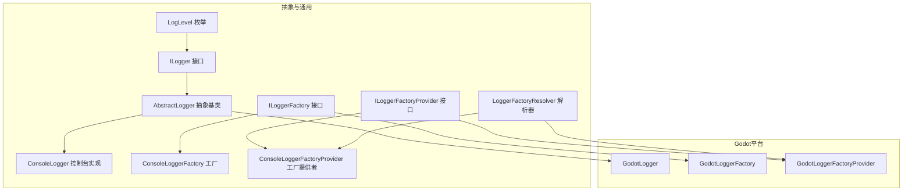
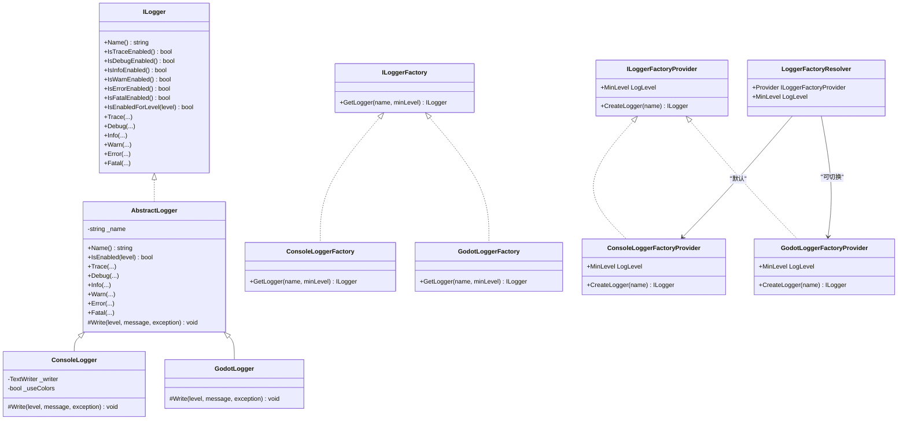
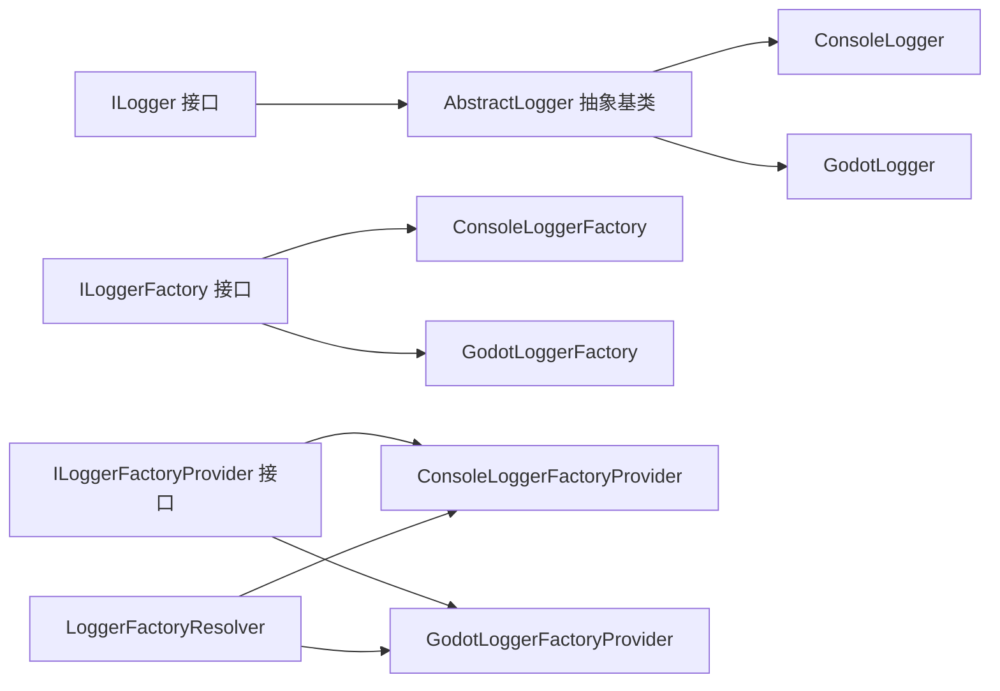

# Godot日志系统

<cite>
**本文引用的文件**
- [GodotLogger.cs](file://GFramework.Godot/logging/GodotLogger.cs)
- [GodotLoggerFactory.cs](file://GFramework.Godot/logging/GodotLoggerFactory.cs)
- [GodotLoggerFactoryProvider.cs](file://GFramework.Godot/logging/GodotLoggerFactoryProvider.cs)
- [AbstractLogger.cs](file://GFramework.Core/logging/AbstractLogger.cs)
- [ConsoleLogger.cs](file://GFramework.Core/logging/ConsoleLogger.cs)
- [ConsoleLoggerFactory.cs](file://GFramework.Core/logging/ConsoleLoggerFactory.cs)
- [ConsoleLoggerFactoryProvider.cs](file://GFramework.Core/logging/ConsoleLoggerFactoryProvider.cs)
- [LoggerFactoryResolver.cs](file://GFramework.Core/logging/LoggerFactoryResolver.cs)
- [ILogger.cs](file://GFramework.Core.Abstractions/logging/ILogger.cs)
- [ILoggerFactory.cs](file://GFramework.Core.Abstractions/logging/ILoggerFactory.cs)
- [ILoggerFactoryProvider.cs](file://GFramework.Core.Abstractions/logging/ILoggerFactoryProvider.cs)
- [LogLevel.cs](file://GFramework.Core.Abstractions/logging/LogLevel.cs)
- [README.md](file://GFramework.Core/logging/README.md)
- [LoggerTests.cs](file://GFramework.Core.Tests/logging/LoggerTests.cs)
- [ConsoleLoggerTests.cs](file://GFramework.Core.Tests/logging/ConsoleLoggerTests.cs)
- [LoggerFactoryTests.cs](file://GFramework.Core.Tests/logging/LoggerFactoryTests.cs)
</cite>

## 目录
1. [简介](#简介)
2. [项目结构](#项目结构)
3. [核心组件](#核心组件)
4. [架构总览](#架构总览)
5. [组件详解](#组件详解)
6. [依赖关系分析](#依赖关系分析)
7. [性能与线程安全](#性能与线程安全)
8. [配置最佳实践](#配置最佳实践)
9. [使用示例](#使用示例)
10. [故障排除指南](#故障排除指南)
11. [结论](#结论)

## 简介
本文件为Godot日志系统提供完整实现文档，聚焦于GodotLogger及其工厂体系（GodotLoggerFactory、GodotLoggerFactoryProvider），阐述日志格式化、输出目标、级别过滤等能力；同时结合抽象基类与通用日志实现，说明在Godot环境下的特殊考虑（如线程安全、性能影响、调试支持）。文档还提供配置最佳实践与常见问题排查建议。

## 项目结构
日志系统主要分布在以下模块：
- 抽象层与通用实现：位于GFramework.Core与GFramework.Core.Abstractions，定义接口、抽象基类与通用ConsoleLogger等。
- Godot平台适配：位于GFramework.Godot，提供GodotLogger与对应的工厂与工厂提供程序。
- 测试与文档：GFramework.Core.Tests与GFramework.Core/logging/README.md提供行为验证与使用说明。



**图表来源**
- [ILogger.cs](file://GFramework.Core.Abstractions/logging/ILogger.cs#L8-L314)
- [ILoggerFactory.cs](file://GFramework.Core.Abstractions/logging/ILoggerFactory.cs#L6-L15)
- [ILoggerFactoryProvider.cs](file://GFramework.Core.Abstractions/logging/ILoggerFactoryProvider.cs#L6-L19)
- [LogLevel.cs](file://GFramework.Core.Abstractions/logging/LogLevel.cs#L6-L37)
- [AbstractLogger.cs](file://GFramework.Core/logging/AbstractLogger.cs#L10-L493)
- [ConsoleLogger.cs](file://GFramework.Core/logging/ConsoleLogger.cs#L10-L81)
- [ConsoleLoggerFactory.cs](file://GFramework.Core/logging/ConsoleLoggerFactory.cs#L8-L20)
- [ConsoleLoggerFactoryProvider.cs](file://GFramework.Core/logging/ConsoleLoggerFactoryProvider.cs#L8-L24)
- [LoggerFactoryResolver.cs](file://GFramework.Core/logging/LoggerFactoryResolver.cs#L8-L26)
- [GodotLogger.cs](file://GFramework.Godot/logging/GodotLogger.cs#L10-L42)
- [GodotLoggerFactory.cs](file://GFramework.Godot/logging/GodotLoggerFactory.cs#L8-L19)
- [GodotLoggerFactoryProvider.cs](file://GFramework.Godot/logging/GodotLoggerFactoryProvider.cs#L8-L24)

**章节来源**
- [README.md](file://GFramework.Core/logging/README.md#L1-L364)

## 核心组件
- GodotLogger：Godot平台专用日志记录器，负责将日志消息格式化并输出到Godot控制台（GD.Print/GD.PrintErr/GD.PushWarning/GD.PushError）。
- GodotLoggerFactory：创建GodotLogger实例，支持按名称与最小日志级别创建。
- GodotLoggerFactoryProvider：Godot平台的工厂提供者，持有MinLevel并创建GodotLogger。
- 抽象基类AbstractLogger：统一实现级别检查、格式化与异常处理，子类仅需实现Write。
- 通用ConsoleLogger：跨平台控制台实现，便于对比与测试。
- 工厂与解析器：ILoggerFactory/Provider接口与LoggerFactoryResolver，统一管理日志工厂与最小级别。

**章节来源**
- [GodotLogger.cs](file://GFramework.Godot/logging/GodotLogger.cs#L10-L42)
- [GodotLoggerFactory.cs](file://GFramework.Godot/logging/GodotLoggerFactory.cs#L8-L19)
- [GodotLoggerFactoryProvider.cs](file://GFramework.Godot/logging/GodotLoggerFactoryProvider.cs#L8-L24)
- [AbstractLogger.cs](file://GFramework.Core/logging/AbstractLogger.cs#L10-L493)
- [ConsoleLogger.cs](file://GFramework.Core/logging/ConsoleLogger.cs#L10-L81)
- [ConsoleLoggerFactory.cs](file://GFramework.Core/logging/ConsoleLoggerFactory.cs#L8-L20)
- [ConsoleLoggerFactoryProvider.cs](file://GFramework.Core/logging/ConsoleLoggerFactoryProvider.cs#L8-L24)
- [LoggerFactoryResolver.cs](file://GFramework.Core/logging/LoggerFactoryResolver.cs#L8-L26)

## 架构总览
Godot日志系统采用“抽象基类 + 平台实现 + 工厂 + 工厂提供者”的分层设计：
- 抽象层：定义ILogger/ILoggerFactory/ILoggerFactoryProvider与LogLevel，统一日志语义与创建流程。
- 平台层：GodotLogger基于GD.* API输出；ConsoleLogger基于TextWriter输出。
- 工厂层：工厂负责创建具体日志记录器；工厂提供者负责注入最小日志级别并创建工厂。
- 解析层：LoggerFactoryResolver集中管理Provider与MinLevel，简化上层调用。



**图表来源**
- [ILogger.cs](file://GFramework.Core.Abstractions/logging/ILogger.cs#L8-L314)
- [ILoggerFactory.cs](file://GFramework.Core.Abstractions/logging/ILoggerFactory.cs#L6-L15)
- [ILoggerFactoryProvider.cs](file://GFramework.Core.Abstractions/logging/ILoggerFactoryProvider.cs#L6-L19)
- [AbstractLogger.cs](file://GFramework.Core/logging/AbstractLogger.cs#L10-L493)
- [ConsoleLogger.cs](file://GFramework.Core/logging/ConsoleLogger.cs#L10-L81)
- [GodotLogger.cs](file://GFramework.Godot/logging/GodotLogger.cs#L10-L42)
- [ConsoleLoggerFactory.cs](file://GFramework.Core/logging/ConsoleLoggerFactory.cs#L8-L20)
- [GodotLoggerFactory.cs](file://GFramework.Godot/logging/GodotLoggerFactory.cs#L8-L19)
- [ConsoleLoggerFactoryProvider.cs](file://GFramework.Core/logging/ConsoleLoggerFactoryProvider.cs#L8-L24)
- [GodotLoggerFactoryProvider.cs](file://GFramework.Godot/logging/GodotLoggerFactoryProvider.cs#L8-L24)
- [LoggerFactoryResolver.cs](file://GFramework.Core/logging/LoggerFactoryResolver.cs#L8-L26)

## 组件详解

### GodotLogger：Godot平台日志记录器
- 功能要点
  - 继承自AbstractLogger，复用级别检查与格式化逻辑。
  - Write方法实现：添加时间戳、级别、记录器名称；附加异常；根据级别调用GD.Print/GD.PrintErr/GD.PushWarning/GD.PushError。
- 输出特性
  - 时间戳格式：年-月-日 时:分:秒.毫秒。
  - 级别对齐：大写并右对齐至固定宽度，便于控制台阅读。
  - 异常拼接：异常信息追加到消息末尾。
  - 平台映射：Fatal/Error/Warn/Info分别映射到GD.PushError/GD.PrintErr/GD.PushWarning/GD.Print。
- 性能与线程安全
  - 基于GD.* API输出，符合Godot主线程输出规范；避免在非主线程直接访问引擎API。
  - 格式化与字符串拼接为轻量级操作，开销可控。

```mermaid
flowchart TD
Start(["进入 Write(level, message, exception)"]) --> BuildTS["生成时间戳<br/>\"yyyy-MM-dd HH:mm:ss.fff\""]
BuildTS --> BuildLevel["转大写并右对齐级别"]
BuildLevel --> Prefix["组装前缀<br/>\"[时间戳] [级别] [名称]\""]
Prefix --> AppendEx{"是否存在异常？"}
AppendEx --> |是| AddEx["将异常文本追加到消息末尾"]
AppendEx --> |否| KeepMsg["保持消息不变"]
AddEx --> Compose["拼接完整日志消息"]
KeepMsg --> Compose
Compose --> Switch["按级别选择输出方法"]
Switch --> Fatal["GD.PushError"]
Switch --> Error["GD.PrintErr"]
Switch --> Warn["GD.PushWarning"]
Switch --> Other["GD.Print"]
Fatal --> End(["结束"])
Error --> End
Warn --> End
Other --> End
```

**图表来源**
- [GodotLogger.cs](file://GFramework.Godot/logging/GodotLogger.cs#L14-L41)

**章节来源**
- [GodotLogger.cs](file://GFramework.Godot/logging/GodotLogger.cs#L10-L42)

### GodotLoggerFactory：Godot日志工厂
- 功能要点
  - 实现ILoggerFactory接口，按名称与最小日志级别创建GodotLogger实例。
- 使用场景
  - 通过LoggerFactoryResolver.Provider间接使用，或直接注入到需要的地方。

**章节来源**
- [GodotLoggerFactory.cs](file://GFramework.Godot/logging/GodotLoggerFactory.cs#L8-L19)

### GodotLoggerFactoryProvider：Godot工厂提供者
- 功能要点
  - 实现ILoggerFactoryProvider接口，持有MinLevel属性。
  - CreateLogger委托GodotLoggerFactory创建GodotLogger，并应用Provider的MinLevel。
- 与LoggerFactoryResolver协作
  - 可替换为GodotLoggerFactoryProvider，使全局日志最小级别由Provider控制。

**章节来源**
- [GodotLoggerFactoryProvider.cs](file://GFramework.Godot/logging/GodotLoggerFactoryProvider.cs#L8-L24)
- [LoggerFactoryResolver.cs](file://GFramework.Core/logging/LoggerFactoryResolver.cs#L8-L26)

### 抽象基类AbstractLogger：统一日志管道
- 功能要点
  - 名称管理：默认根名称“ROOT”。
  - 级别检查：IsEnabled与各级别IsXxxEnabled，支持isEnabledForLevel。
  - 格式化：支持无参、格式化、异常三种重载的Log核心方法。
  - 平台写入：抽象Write方法，子类实现具体输出。
- 优势
  - 将“级别过滤 + 格式化 + 异常处理”集中在基类，子类专注输出细节。

**章节来源**
- [AbstractLogger.cs](file://GFramework.Core/logging/AbstractLogger.cs#L10-L493)

### ConsoleLogger：通用控制台实现（对比参考）
- 功能要点
  - 支持自定义TextWriter与颜色输出（仅控制台）。
  - 输出格式与GodotLogger一致，便于对比与迁移。
- 用途
  - 单元测试与非Godot环境下验证日志行为。

**章节来源**
- [ConsoleLogger.cs](file://GFramework.Core/logging/ConsoleLogger.cs#L10-L81)

### 工厂与工厂提供者（通用）
- ConsoleLoggerFactory/Provider：创建ConsoleLogger，支持MinLevel注入。
- LoggerFactoryResolver：集中管理Provider与MinLevel，提供默认ConsoleLoggerFactoryProvider。

**章节来源**
- [ConsoleLoggerFactory.cs](file://GFramework.Core/logging/ConsoleLoggerFactory.cs#L8-L20)
- [ConsoleLoggerFactoryProvider.cs](file://GFramework.Core/logging/ConsoleLoggerFactoryProvider.cs#L8-L24)
- [LoggerFactoryResolver.cs](file://GFramework.Core/logging/LoggerFactoryResolver.cs#L8-L26)

## 依赖关系分析
- 接口与抽象
  - ILogger/ILoggerFactory/ILoggerFactoryProvider定义清晰的职责边界。
  - AbstractLogger统一实现日志核心逻辑，降低重复代码。
- 平台适配
  - GodotLogger仅覆盖Write，其余逻辑复用AbstractLogger。
- 工厂与解析
  - 工厂提供者负责注入MinLevel；LoggerFactoryResolver集中配置，便于全局切换。



**图表来源**
- [ILogger.cs](file://GFramework.Core.Abstractions/logging/ILogger.cs#L8-L314)
- [ILoggerFactory.cs](file://GFramework.Core.Abstractions/logging/ILoggerFactory.cs#L6-L15)
- [ILoggerFactoryProvider.cs](file://GFramework.Core.Abstractions/logging/ILoggerFactoryProvider.cs#L6-L19)
- [AbstractLogger.cs](file://GFramework.Core/logging/AbstractLogger.cs#L10-L493)
- [ConsoleLogger.cs](file://GFramework.Core/logging/ConsoleLogger.cs#L10-L81)
- [GodotLogger.cs](file://GFramework.Godot/logging/GodotLogger.cs#L10-L42)
- [ConsoleLoggerFactory.cs](file://GFramework.Core/logging/ConsoleLoggerFactory.cs#L8-L20)
- [GodotLoggerFactory.cs](file://GFramework.Godot/logging/GodotLoggerFactory.cs#L8-L19)
- [ConsoleLoggerFactoryProvider.cs](file://GFramework.Core/logging/ConsoleLoggerFactoryProvider.cs#L8-L24)
- [GodotLoggerFactoryProvider.cs](file://GFramework.Godot/logging/GodotLoggerFactoryProvider.cs#L8-L24)
- [LoggerFactoryResolver.cs](file://GFramework.Core/logging/LoggerFactoryResolver.cs#L8-L26)

## 性能与线程安全
- 性能特征
  - 级别检查在进入Write前完成，避免无效格式化与输出。
  - 字符串拼接与格式化为轻量操作；异常拼接仅在存在异常时发生。
  - 控制台输出在非Godot环境中成本较低；Godot GD.* API在编辑器/运行时有其性能与线程约束。
- 线程安全
  - 日志记录器本身无共享可变状态，级别检查与格式化均为纯函数式逻辑。
  - 在Godot中，建议在主线程调用日志API，避免跨线程访问引擎API带来的未定义行为。
- 调试支持
  - 丰富的日志级别便于分层次定位问题；异常链路可完整记录。
  - 控制台输出便于快速定位；Godot输出窗口可按级别筛选。

[本节为通用指导，无需列出章节来源]

## 配置最佳实践
- 日志级别设置
  - 开发阶段：将最小级别设为Debug或Trace，以便捕获详细流程。
  - 发布阶段：提升至Info或Warning，减少输出冗余。
  - 通过LoggerFactoryResolver或GodotLoggerFactoryProvider的MinLevel统一配置。
- 输出格式定制
  - GodotLogger格式固定为“时间戳 + 级别 + 名称 + 消息 + 异常”，便于Godot控制台阅读。
  - 如需自定义格式，可在GodotLogger基础上派生子类，重写Write以调整前缀与分隔符。
- 性能优化
  - 合理设置最小级别，避免在高频路径中产生低价值日志。
  - 对昂贵的格式化字符串，优先在级别检查后进行，或使用IsXxxEnabled预判。
- 分类与命名
  - 为不同模块（网络、数据库、UI等）创建独立日志记录器，便于隔离与检索。
  - 使用有意义的名称，便于在Godot输出中快速定位来源。

**章节来源**
- [LoggerFactoryResolver.cs](file://GFramework.Core/logging/LoggerFactoryResolver.cs#L8-L26)
- [GodotLoggerFactoryProvider.cs](file://GFramework.Godot/logging/GodotLoggerFactoryProvider.cs#L8-L24)
- [README.md](file://GFramework.Core/logging/README.md#L300-L341)

## 使用示例
- 通过LoggerFactoryResolver创建GodotLogger
  - 设置Provider为GodotLoggerFactoryProvider，或直接使用GodotLoggerFactory。
  - 调用CreateLogger(name)获取GodotLogger实例，按需设置最小级别。
- 在系统/模块中记录日志
  - 在初始化、销毁、关键流程节点记录Info/Debug/Warn/Error/Fatal。
- 单元测试参考
  - LoggerTests：验证级别检查、格式化、异常记录等行为。
  - ConsoleLoggerTests：验证输出格式、级别过滤、异常链路等。
  - LoggerFactoryTests：验证工厂与Provider的组合行为。

**章节来源**
- [LoggerTests.cs](file://GFramework.Core.Tests/logging/LoggerTests.cs#L1-L460)
- [ConsoleLoggerTests.cs](file://GFramework.Core.Tests/logging/ConsoleLoggerTests.cs#L1-L278)
- [LoggerFactoryTests.cs](file://GFramework.Core.Tests/logging/LoggerFactoryTests.cs#L1-L257)
- [README.md](file://GFramework.Core/logging/README.md#L215-L287)

## 故障排除指南
- 问题：日志未输出
  - 检查最小级别是否高于当前日志级别。
  - 确认LoggerFactoryResolver.Provider是否为GodotLoggerFactoryProvider。
- 问题：异常未显示
  - 确保调用带异常参数的重载，或异常对象非空。
- 问题：输出格式不符合预期
  - GodotLogger格式固定，若需自定义，请派生子类重写Write。
- 问题：在非主线程调用日志
  - 在Godot中，尽量在主线程调用日志API，避免跨线程访问引擎API的风险。

**章节来源**
- [GodotLogger.cs](file://GFramework.Godot/logging/GodotLogger.cs#L14-L41)
- [LoggerFactoryResolver.cs](file://GFramework.Core/logging/LoggerFactoryResolver.cs#L8-L26)

## 结论
Godot日志系统以抽象基类为核心，通过GodotLogger实现Godot平台特有输出，配合工厂与工厂提供者实现灵活配置与统一管理。该设计在保证跨平台一致性的同时，充分利用Godot引擎的输出能力，满足开发与调试需求。建议在开发阶段采用较低最小级别，在发布阶段提升级别以优化性能与可读性。