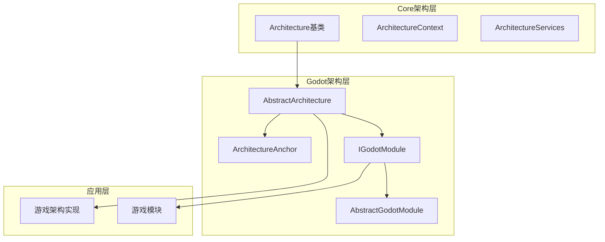
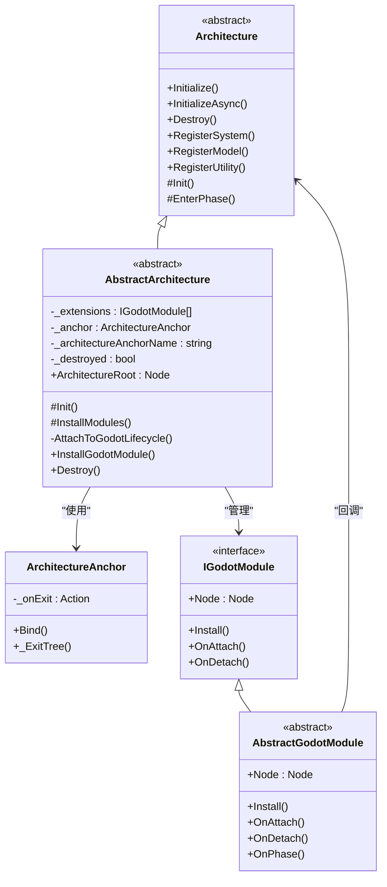
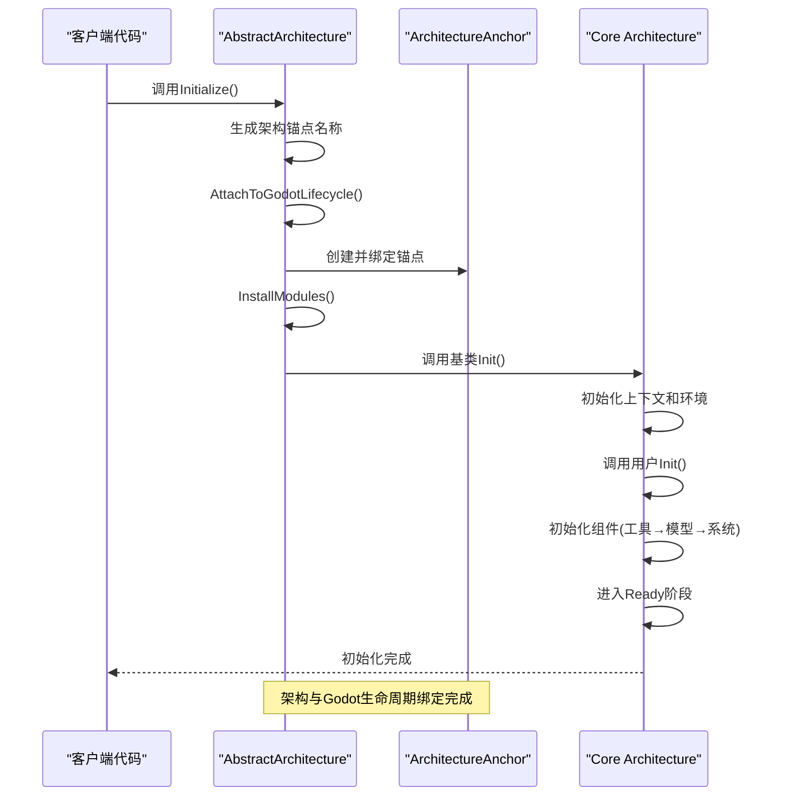
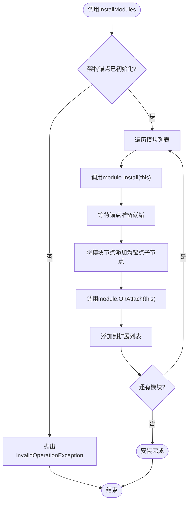
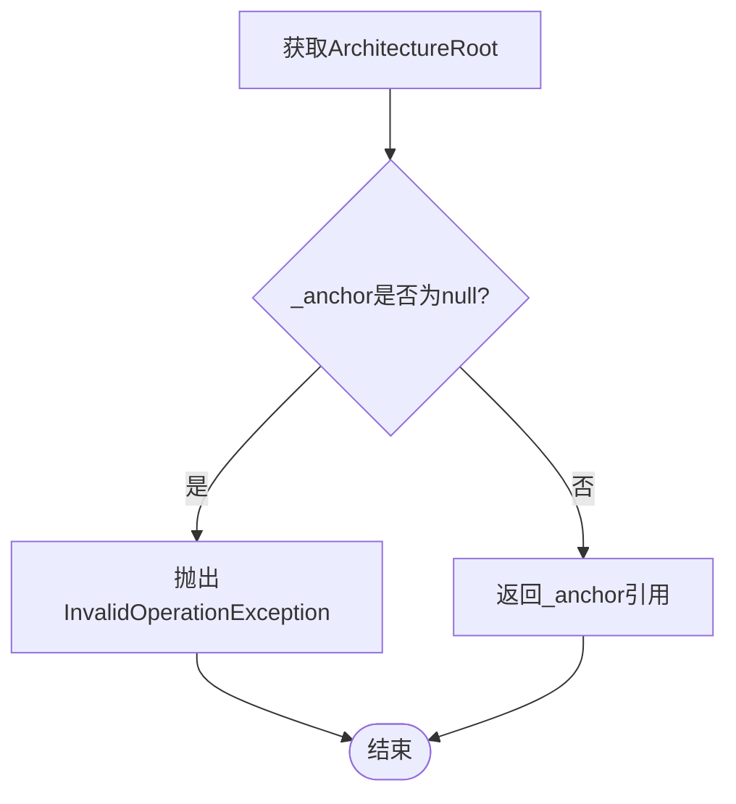
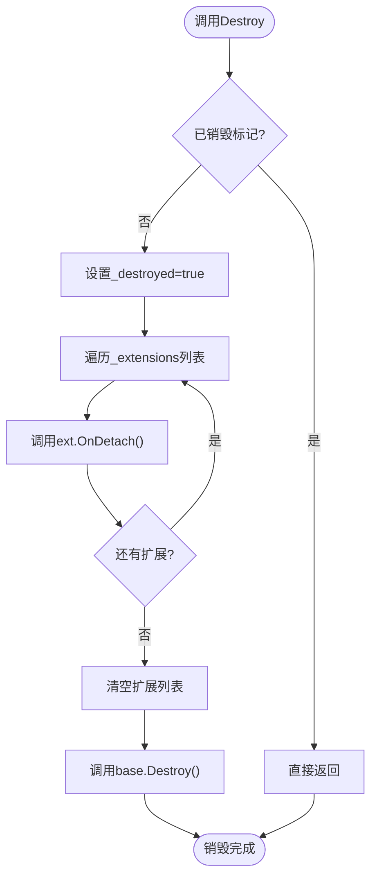
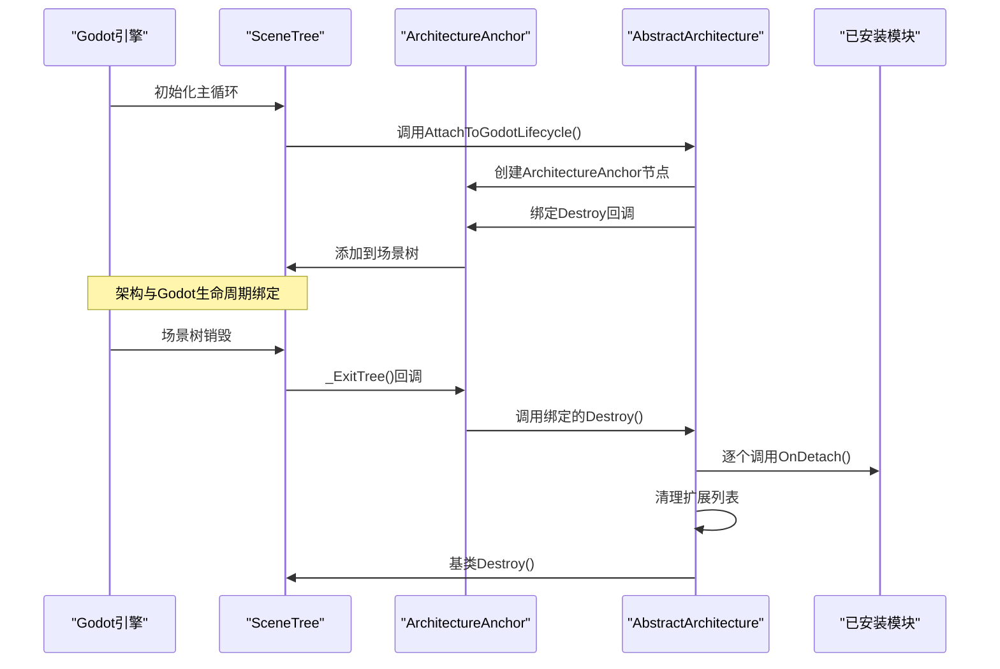
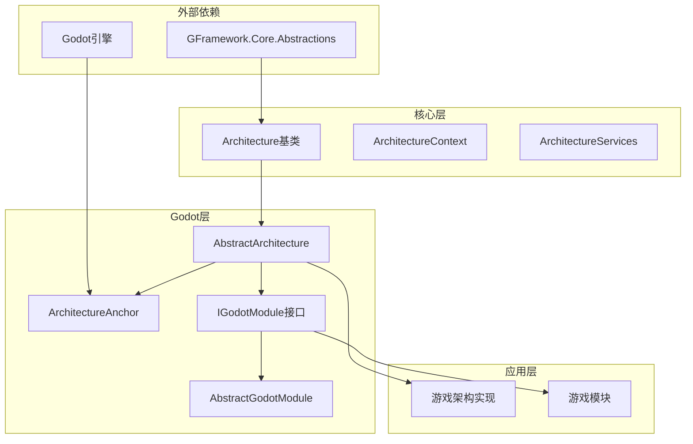

# AbstractArchitecture基类

<cite>
**本文档引用的文件**
- [AbstractArchitecture.cs](file://GFramework.Godot/architecture/AbstractArchitecture.cs)
- [Architecture.cs](file://GFramework.Core/architecture/Architecture.cs)
- [ArchitectureAnchor.cs](file://GFramework.Godot/architecture/ArchitectureAnchor.cs)
- [AbstractGodotModule.cs](file://GFramework.Godot/architecture/AbstractGodotModule.cs)
- [IGodotModule.cs](file://GFramework.Godot/architecture/IGodotModule.cs)
- [godot-integration.md](file://docs/tutorials/godot-integration.md)
- [architecture-patterns.md](file://docs/best-practices/architecture-patterns.md)
</cite>

## 目录
1. [简介](#简介)
2. [项目结构](#项目结构)
3. [核心组件](#核心组件)
4. [架构概览](#架构概览)
5. [详细组件分析](#详细组件分析)
6. [依赖关系分析](#依赖关系分析)
7. [性能考虑](#性能考虑)
8. [故障排除指南](#故障排除指南)
9. [结论](#结论)
10. [附录](#附录)

## 简介

AbstractArchitecture是GFramework中Godot平台特定的架构基类，它继承自Core模块的Architecture基类，专门为Godot引擎提供了生命周期管理和模块化架构支持。该类通过与Godot场景树的深度集成，实现了架构组件的自动生命周期管理和资源清理。

该基类的核心价值在于：
- **Godot生命周期绑定**：通过ArchitectureAnchor节点将架构与Godot场景树生命周期紧密绑定
- **模块化架构系统**：支持IGodotModule接口的模块化扩展机制
- **自动资源管理**：确保架构销毁时所有相关资源得到正确清理
- **类型安全的模块安装**：提供强类型约束的模块安装和管理机制

## 项目结构

GFramework采用分层架构设计，AbstractArchitecture位于Godot特定层：



**图表来源**
- [AbstractArchitecture.cs](file://GFramework.Godot/architecture/AbstractArchitecture.cs#L14-L19)
- [Architecture.cs](file://GFramework.Core/architecture/Architecture.cs#L23-L29)
- [ArchitectureAnchor.cs](file://GFramework.Godot/architecture/ArchitectureAnchor.cs#L9-L35)

**章节来源**
- [AbstractArchitecture.cs](file://GFramework.Godot/architecture/AbstractArchitecture.cs#L1-L140)
- [Architecture.cs](file://GFramework.Core/architecture/Architecture.cs#L1-L569)

## 核心组件

### 主要特性概述

AbstractArchitecture继承了Core架构的所有核心功能，并增加了Godot特定的扩展能力：

| 特性 | 描述 | 实现位置 |
|------|------|----------|
| 架构初始化 | 完整的架构初始化流程，包括模块安装 | [Init方法](file://GFramework.Godot/architecture/AbstractArchitecture.cs#L56-L62) |
| Godot生命周期绑定 | 通过ArchitectureAnchor节点绑定场景树生命周期 | [AttachToGodotLifecycle方法](file://GFramework.Godot/architecture/AbstractArchitecture.cs#L74-L91) |
| 模块安装系统 | 支持IGodotModule接口的模块安装和管理 | [InstallGodotModule方法](file://GFramework.Godot/architecture/AbstractArchitecture.cs#L100-L119) |
| 资源清理机制 | 架构销毁时自动清理所有已安装模块 | [Destroy方法](file://GFramework.Godot/architecture/AbstractArchitecture.cs#L127-L139) |
| 根节点访问 | 提供受保护的ArchitectureRoot属性访问 | [ArchitectureRoot属性](file://GFramework.Godot/architecture/AbstractArchitecture.cs#L49) |

**章节来源**
- [AbstractArchitecture.cs](file://GFramework.Godot/architecture/AbstractArchitecture.cs#L14-L139)

## 架构概览

AbstractArchitecture的架构设计体现了良好的分层原则和依赖倒置：



**图表来源**
- [Architecture.cs](file://GFramework.Core/architecture/Architecture.cs#L23-L569)
- [AbstractArchitecture.cs](file://GFramework.Godot/architecture/AbstractArchitecture.cs#L14-L139)
- [ArchitectureAnchor.cs](file://GFramework.Godot/architecture/ArchitectureAnchor.cs#L9-L35)
- [IGodotModule.cs](file://GFramework.Godot/architecture/IGodotModule.cs#L10-L27)

## 详细组件分析

### 架构初始化流程

AbstractArchitecture的初始化流程是一个精心设计的多阶段过程：



**图表来源**
- [AbstractArchitecture.cs](file://GFramework.Godot/architecture/AbstractArchitecture.cs#L56-L62)
- [Architecture.cs](file://GFramework.Core/architecture/Architecture.cs#L531-L566)

#### 初始化阶段详解

1. **锚点创建阶段**：生成唯一的架构锚点名称，确保在场景树中不会冲突
2. **生命周期绑定阶段**：通过ArchitectureAnchor节点监听场景树销毁事件
3. **模块安装阶段**：调用子类实现的InstallModules方法
4. **核心初始化阶段**：委托给基类Architecture执行完整的初始化流程

**章节来源**
- [AbstractArchitecture.cs](file://GFramework.Godot/architecture/AbstractArchitecture.cs#L56-L62)
- [Architecture.cs](file://GFramework.Core/architecture/Architecture.cs#L531-L566)

### InstallModules抽象方法

InstallModules是AbstractArchitecture的核心扩展点，设计目的是：



**图表来源**
- [AbstractArchitecture.cs](file://GFramework.Godot/architecture/AbstractArchitecture.cs#L100-L119)

#### 设计要求和约束

- **必须在Init方法中调用**：确保架构锚点已正确初始化
- **类型安全**：只能安装实现IGodotModule接口的模块
- **异步等待**：必须等待锚点准备就绪后再添加节点
- **生命周期管理**：模块必须正确实现OnAttach和OnDetach方法

**章节来源**
- [AbstractArchitecture.cs](file://GFramework.Godot/architecture/AbstractArchitecture.cs#L68-L119)

### 架构根节点获取机制

AbstractArchitecture提供了受保护的ArchitectureRoot属性：



**图表来源**
- [AbstractArchitecture.cs](file://GFramework.Godot/architecture/AbstractArchitecture.cs#L49)

#### 异常处理策略

- **未初始化异常**：当架构尚未完成初始化时访问根节点会抛出异常
- **设计意图**：强制开发者在正确的时机访问架构根节点
- **调试友好**：异常信息明确指示架构未准备就绪

**章节来源**
- [AbstractArchitecture.cs](file://GFramework.Godot/architecture/AbstractArchitecture.cs#L49)

### 架构销毁过程

AbstractArchitecture的销毁过程确保了资源的完整清理：



**图表来源**
- [AbstractArchitecture.cs](file://GFramework.Godot/architecture/AbstractArchitecture.cs#L127-L139)

#### 资源清理策略

1. **模块级清理**：逐个调用已安装模块的OnDetach方法
2. **列表清理**：清空模块列表，防止重复销毁
3. **基类清理**：委托给基类Architecture执行核心组件清理
4. **防重复销毁**：通过_destroyed标志防止重复销毁操作

**章节来源**
- [AbstractArchitecture.cs](file://GFramework.Godot/architecture/AbstractArchitecture.cs#L127-L139)

### Godot生命周期绑定机制

AbstractArchitecture通过ArchitectureAnchor实现了与Godot场景树的深度集成：



**图表来源**
- [AbstractArchitecture.cs](file://GFramework.Godot/architecture/AbstractArchitecture.cs#L74-L91)
- [ArchitectureAnchor.cs](file://GFramework.Godot/architecture/ArchitectureAnchor.cs#L29-L34)

#### 绑定机制特点

- **延迟绑定**：使用CallDeferred确保在下一帧绑定，避免线程安全问题
- **防重复绑定**：检查场景树中是否已存在同名节点
- **自动清理**：通过_exitTree回调自动触发架构销毁
- **类型安全**：通过泛型约束确保模块实现正确的接口

**章节来源**
- [AbstractArchitecture.cs](file://GFramework.Godot/architecture/AbstractArchitecture.cs#L74-L91)
- [ArchitectureAnchor.cs](file://GFramework.Godot/architecture/ArchitectureAnchor.cs#L9-L35)

## 依赖关系分析

AbstractArchitecture的依赖关系体现了清晰的分层架构：



**图表来源**
- [AbstractArchitecture.cs](file://GFramework.Godot/architecture/AbstractArchitecture.cs#L1-L6)
- [Architecture.cs](file://GFramework.Core/architecture/Architecture.cs#L1-L16)

### 关键依赖关系

1. **继承关系**：AbstractArchitecture → Architecture，获得完整的架构管理能力
2. **组合关系**：AbstractArchitecture组合了ArchitectureAnchor和模块列表
3. **接口实现**：IGodotModule定义了Godot模块的标准接口
4. **Godot集成**：直接依赖Godot引擎的节点系统和场景树管理

**章节来源**
- [AbstractArchitecture.cs](file://GFramework.Godot/architecture/AbstractArchitecture.cs#L1-L6)
- [IGodotModule.cs](file://GFramework.Godot/architecture/IGodotModule.cs#L10-L27)

## 性能考虑

### 初始化性能优化

AbstractArchitecture在初始化过程中采用了多项性能优化策略：

1. **延迟绑定**：使用CallDeferred避免阻塞主线程
2. **去重机制**：通过HashSet确保组件注册的原子性和唯一性
3. **阶段化初始化**：按工具→模型→系统的顺序初始化，减少依赖问题
4. **异步支持**：支持异步组件初始化，提高响应性

### 内存管理

1. **弱引用模式**：模块列表使用List而非Dictionary，减少内存开销
2. **及时清理**：销毁时立即清空模块列表，避免内存泄漏
3. **生命周期感知**：所有组件都实现了IDisposable接口，确保资源正确释放

### 最佳实践建议

- **模块大小**：每个Godot模块应该职责单一，避免过度复杂的节点树
- **节点层级**：合理控制节点层级深度，避免过深的场景树结构
- **资源管理**：模块内部应该妥善管理自己的资源，避免内存泄漏

## 故障排除指南

### 常见问题和解决方案

#### 1. "架构根节点未就绪"异常

**症状**：访问ArchitectureRoot属性时抛出InvalidOperationException

**原因**：
- 在架构初始化完成前访问根节点
- 架构已被销毁后再次尝试访问

**解决方案**：
- 确保在Initialize()或InitializeAsync()完成后访问根节点
- 避免在Destroy()后重新使用架构实例

#### 2. 模块安装失败

**症状**：InstallGodotModule抛出InvalidOperationException

**原因**：
- 在模块安装前没有正确初始化架构
- 模块节点添加到场景树失败

**解决方案**：
- 确保在InstallModules中调用InstallGodotModule
- 检查模块的Node属性是否正确实现

#### 3. 资源清理不完全

**症状**：游戏退出后仍有资源未释放

**原因**：
- 模块未正确实现OnDetach方法
- 模块内部持有静态引用

**解决方案**：
- 确保每个模块都正确实现OnDetach
- 检查模块内部是否有静态引用或事件订阅

**章节来源**
- [AbstractArchitecture.cs](file://GFramework.Godot/architecture/AbstractArchitecture.cs#L49)
- [AbstractArchitecture.cs](file://GFramework.Godot/architecture/AbstractArchitecture.cs#L105)

## 结论

AbstractArchitecture基类成功地将Core架构的通用功能与Godot引擎的特定需求相结合，提供了一个强大而灵活的架构框架。其主要优势包括：

1. **完整的生命周期管理**：通过ArchitectureAnchor实现了与Godot场景树的深度集成
2. **模块化设计**：支持IGodotModule接口的模块化扩展机制
3. **类型安全**：提供强类型约束，减少运行时错误
4. **资源管理**：自动化的资源清理机制确保内存安全
5. **易于使用**：简洁的API设计降低了使用复杂度

该基类为Godot游戏开发提供了一个坚实的基础，开发者可以基于此构建复杂的游戏架构，同时享受GFramework带来的开发效率和可靠性提升。

## 附录

### 使用示例

以下是一个完整的AbstractArchitecture使用示例：

```csharp
// 1. 创建游戏架构类
public class MyGameArchitecture : AbstractArchitecture
{
    protected override void Init()
    {
        // 注册核心组件
        RegisterModel(new PlayerModel());
        RegisterSystem(new PlayerControllerSystem());
        RegisterUtility(new AudioManager());
        
        // 调用基类Init完成核心初始化
        base.Init();
    }
    
    protected override void InstallModules()
    {
        // 安装Godot特定模块
        InstallGodotModule(new UIManager());
        InstallGodotModule(new InputManager());
        InstallGodotModule(new AudioManager());
    }
}

// 2. 创建Godot模块
[GlobalClass]
public partial class UIManager : AbstractGodotModule
{
    private Control _uiRoot;
    
    public override Node Node => this;
    
    public override void Install(IArchitecture architecture)
    {
        architecture.RegisterSystem(new UIMessageSystem());
        architecture.RegisterUtility(new UIAnimationUtility());
    }
    
    public override void OnAttach(Architecture architecture)
    {
        // 创建UI根节点
        _uiRoot = new Control();
        AddChild(_uiRoot);
        
        // 初始化UI系统
        GetSystem<UIMessageSystem>().Initialize(_uiRoot);
    }
    
    public override void OnDetach()
    {
        // 清理UI资源
        _uiRoot?.QueueFree();
        _uiRoot = null;
    }
}
```

### 最佳实践清单

1. **模块设计**
   - 每个模块职责单一
   - 模块间通过事件通信
   - 避免模块间的直接依赖

2. **资源管理**
   - 模块内部妥善管理资源
   - 在OnDetach中清理所有资源
   - 避免静态引用导致的内存泄漏

3. **错误处理**
   - 在模块中适当处理异常
   - 提供有意义的错误信息
   - 确保模块的健壮性

4. **性能优化**
   - 合理控制模块数量
   - 优化节点层级结构
   - 使用异步加载大型资源

**章节来源**
- [godot-integration.md](file://docs/tutorials/godot-integration.md#L24-L40)
- [architecture-patterns.md](file://docs/best-practices/architecture-patterns.md#L695-L744)