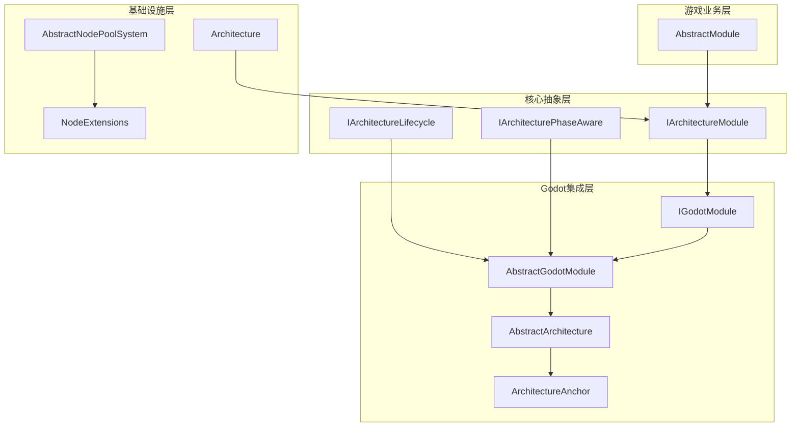
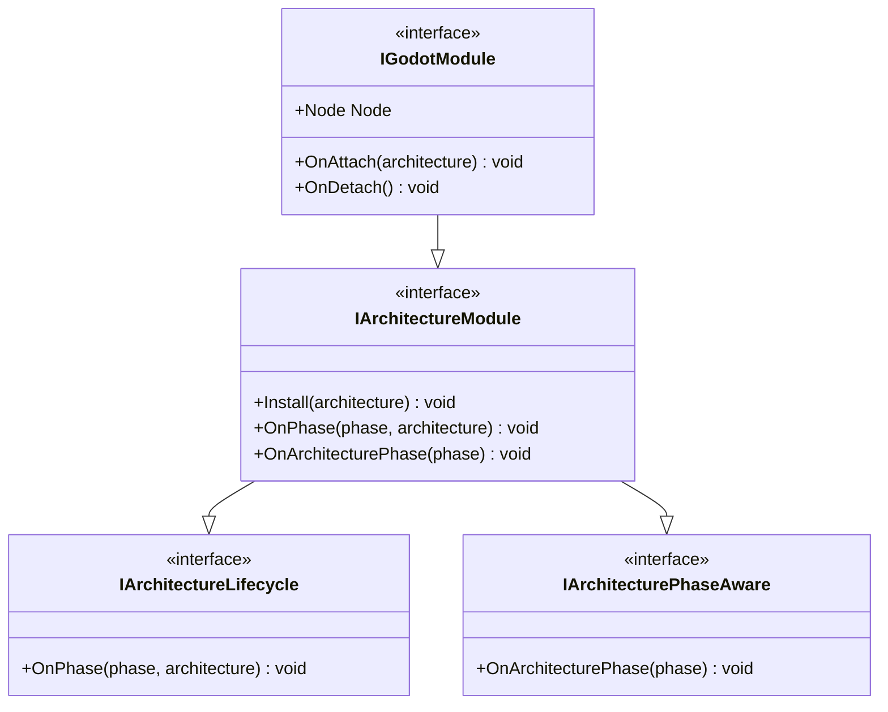
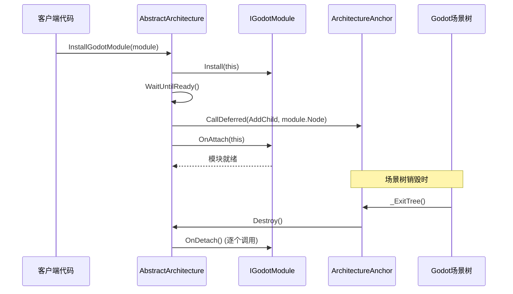
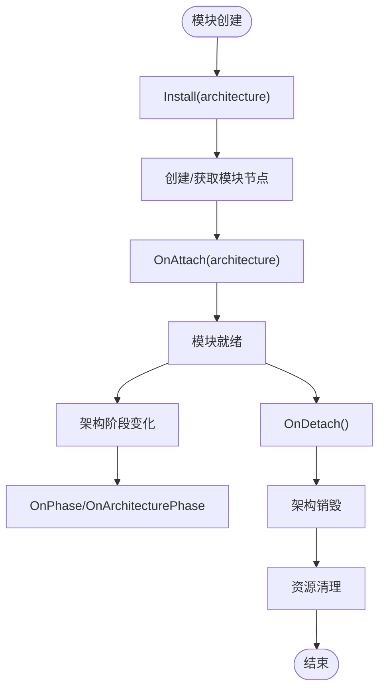
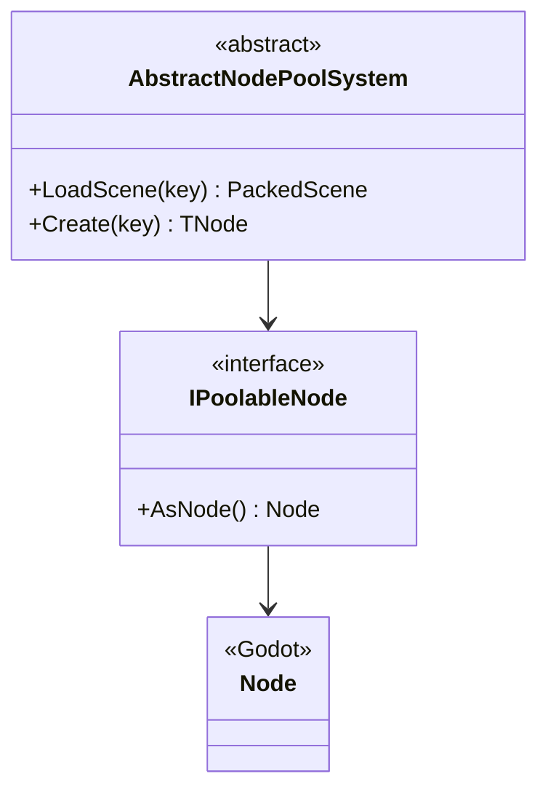
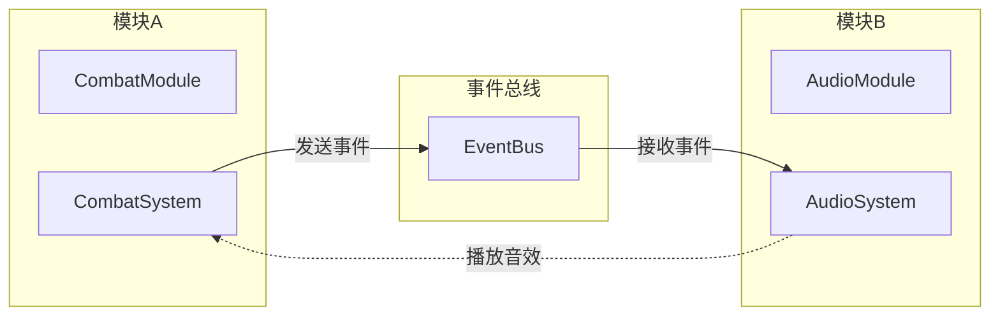

# AbstractGodotModule模块系统

<cite>
**本文档引用的文件**
- [AbstractGodotModule.cs](file://GFramework.Godot/architecture/AbstractGodotModule.cs)
- [IGodotModule.cs](file://GFramework.Godot/architecture/IGodotModule.cs)
- [AbstractArchitecture.cs](file://GFramework.Godot/architecture/AbstractArchitecture.cs)
- [ArchitectureAnchor.cs](file://GFramework.Godot/architecture/ArchitectureAnchor.cs)
- [AbstractModule.cs](file://GFramework.Game/architecture/AbstractModule.cs)
- [IArchitectureModule.cs](file://GFramework.Core.Abstractions/architecture/IArchitectureModule.cs)
- [IArchitectureLifecycle.cs](file://GFramework.Core.Abstractions/architecture/IArchitectureLifecycle.cs)
- [IArchitecturePhaseAware.cs](file://GFramework.Core.Abstractions/architecture/IArchitecturePhaseAware.cs)
- [Architecture.cs](file://GFramework.Core/architecture/Architecture.cs)
- [AbstractNodePoolSystem.cs](file://GFramework.Godot/pool/AbstractNodePoolSystem.cs)
- [IPoolableNode.cs](file://GFramework.Godot/pool/IPoolableNode.cs)
- [NodeExtensions.cs](file://GFramework.Godot/extensions/NodeExtensions.cs)
- [godot-api.md](file://docs/api-reference/godot-api.md)
- [godot-integration.md](file://docs/tutorials/godot-integration.md)
- [architecture-patterns.md](file://docs/best-practices/architecture-patterns.md)
</cite>

## 目录
1. [简介](#简介)
2. [项目结构](#项目结构)
3. [核心组件](#核心组件)
4. [架构概览](#架构概览)
5. [详细组件分析](#详细组件分析)
6. [依赖关系分析](#依赖关系分析)
7. [性能考虑](#性能考虑)
8. [故障排除指南](#故障排除指南)
9. [结论](#结论)
10. [附录](#附录)

## 简介

AbstractGodotModule模块系统是GFramework在Godot引擎环境下实现的模块化架构解决方案。该系统通过抽象基类和接口定义，为Godot游戏开发提供了强大的模块化支持，实现了架构与具体Godot节点的深度集成。

该模块系统的核心设计理念是将传统的架构模块概念与Godot的节点树结构相结合，通过IGodotModule接口定义模块与Godot节点的关系，通过AbstractGodotModule抽象基类提供模块生命周期管理的基础实现。

## 项目结构

GFramework模块系统采用分层架构设计，主要包含以下核心层次：



**图表来源**
- [IGodotModule.cs](file://GFramework.Godot/architecture/IGodotModule.cs#L1-L27)
- [AbstractGodotModule.cs](file://GFramework.Godot/architecture/AbstractGodotModule.cs#L1-L55)
- [AbstractArchitecture.cs](file://GFramework.Godot/architecture/AbstractArchitecture.cs#L1-L140)
- [ArchitectureAnchor.cs](file://GFramework.Godot/architecture/ArchitectureAnchor.cs#L1-L35)

**章节来源**
- [AbstractGodotModule.cs](file://GFramework.Godot/architecture/AbstractGodotModule.cs#L1-L55)
- [IGodotModule.cs](file://GFramework.Godot/architecture/IGodotModule.cs#L1-L27)
- [AbstractArchitecture.cs](file://GFramework.Godot/architecture/AbstractArchitecture.cs#L1-L140)

## 核心组件

### 模块接口体系

模块系统的核心接口定义了模块与架构之间的契约关系：



**图表来源**
- [IArchitectureModule.cs](file://GFramework.Core.Abstractions/architecture/IArchitectureModule.cs#L1-L14)
- [IGodotModule.cs](file://GFramework.Godot/architecture/IGodotModule.cs#L1-L27)
- [IArchitectureLifecycle.cs](file://GFramework.Core.Abstractions/architecture/IArchitectureLifecycle.cs#L1-L16)
- [IArchitecturePhaseAware.cs](file://GFramework.Core.Abstractions/architecture/IArchitecturePhaseAware.cs#L1-L15)

### 模块基类实现

AbstractGodotModule作为Godot模块的抽象基类，提供了模块生命周期管理的核心功能：

**章节来源**
- [AbstractGodotModule.cs](file://GFramework.Godot/architecture/AbstractGodotModule.cs#L8-L55)

## 架构概览

AbstractArchitecture作为Godot架构的抽象实现，负责模块的安装、管理和生命周期控制：



**图表来源**
- [AbstractArchitecture.cs](file://GFramework.Godot/architecture/AbstractArchitecture.cs#L100-L119)
- [ArchitectureAnchor.cs](file://GFramework.Godot/architecture/ArchitectureAnchor.cs#L29-L34)

**章节来源**
- [AbstractArchitecture.cs](file://GFramework.Godot/architecture/AbstractArchitecture.cs#L56-L139)

## 详细组件分析

### AbstractGodotModule模块基类

AbstractGodotModule定义了Godot模块的核心行为规范：

#### 关键特性

1. **节点关联性**: 通过Node属性明确模块与Godot节点的绑定关系
2. **生命周期回调**: 提供OnAttach和OnDetach方法处理模块的附加和分离
3. **阶段感知**: 支持架构阶段变化的通知机制

#### 实现模式



**图表来源**
- [AbstractGodotModule.cs](file://GFramework.Godot/architecture/AbstractGodotModule.cs#L11-L55)

**章节来源**
- [AbstractGodotModule.cs](file://GFramework.Godot/architecture/AbstractGodotModule.cs#L11-L55)

### AbstractArchitecture架构管理

AbstractArchitecture负责Godot模块的完整生命周期管理：

#### 核心功能

1. **架构锚点管理**: 通过ArchitectureAnchor确保模块节点正确绑定到Godot生命周期
2. **异步模块安装**: 提供InstallGodotModule方法实现模块的异步安装机制
3. **资源清理**: 在架构销毁时自动调用所有模块的OnDetach方法

#### 安装流程

```mermaid
flowchart TD
A[调用InstallGodotModule] --> B[module.Install(this)]
B --> C{_anchor是否初始化?}
C --> |否| D[抛出InvalidOperationException]
C --> |是| E[await _anchor.WaitUntilReady()]
E --> F[CallDeferred(AddChild, module.Node)]
F --> G[module.OnAttach(this)]
G --> H[_extensions.Add(module)]
H --> I[安装完成]
```

**图表来源**
- [AbstractArchitecture.cs](file://GFramework.Godot/architecture/AbstractArchitecture.cs#L100-L119)

**章节来源**
- [AbstractArchitecture.cs](file://GFramework.Godot/architecture/AbstractArchitecture.cs#L74-L119)

### ArchitectureAnchor锚点机制

ArchitectureAnchor作为Godot场景树的生命周期锚点：

#### 设计原理

1. **回调绑定**: 通过Bind方法注册场景树销毁时的回调
2. **安全释放**: 在_exit_tree信号触发时执行清理操作
3. **警告机制**: 防止重复绑定导致的回调覆盖

**章节来源**
- [ArchitectureAnchor.cs](file://GFramework.Godot/architecture/ArchitectureAnchor.cs#L9-L35)

### 模块节点管理策略

#### 节点创建与管理

模块节点的创建遵循以下策略：

1. **延迟添加**: 使用CallDeferred确保节点在下一帧添加到场景树
2. **父子关系**: 模块节点作为架构锚点的子节点管理
3. **资源清理**: 通过QueueFree方法安全释放节点资源

#### 对象池集成



**图表来源**
- [AbstractNodePoolSystem.cs](file://GFramework.Godot/pool/AbstractNodePoolSystem.cs#L11-L32)
- [IPoolableNode.cs](file://GFramework.Godot/pool/IPoolableNode.cs#L10-L17)

**章节来源**
- [AbstractNodePoolSystem.cs](file://GFramework.Godot/pool/AbstractNodePoolSystem.cs#L1-L32)
- [NodeExtensions.cs](file://GFramework.Godot/extensions/NodeExtensions.cs#L127-L139)

## 依赖关系分析

### 模块间通信机制

模块系统采用事件驱动的松耦合通信方式：



**图表来源**
- [architecture-patterns.md](file://docs/best-practices/architecture-patterns.md#L747-L831)

### 依赖注入与解耦

模块系统通过依赖注入实现组件间的解耦：

**章节来源**
- [architecture-patterns.md](file://docs/best-practices/architecture-patterns.md#L466-L527)

## 性能考虑

### 异步安装优化

1. **延迟执行**: 使用CallDeferred避免阻塞当前帧
2. **等待机制**: WaitUntilReady确保节点完全初始化后再进行操作
3. **批量处理**: 支持多个模块的并发安装

### 内存管理

1. **对象池**: 通过AbstractNodePoolSystem减少节点创建开销
2. **资源清理**: 自动调用OnDetach确保资源及时释放
3. **垃圾回收**: 使用QueueFree替代直接删除

### 最佳实践

1. **模块职责单一**: 每个模块专注于特定功能领域
2. **事件驱动通信**: 避免模块间直接依赖
3. **异步处理**: 大量计算或IO操作使用异步模式

## 故障排除指南

### 常见问题与解决方案

#### 模块安装失败

**问题**: 模块安装时报"Anchor not initialized"错误
**原因**: 架构锚点未正确初始化
**解决**: 确保在架构初始化完成后调用InstallGodotModule

#### 资源泄漏问题

**问题**: 模块分离后资源未正确释放
**原因**: 未正确实现OnDetach方法
**解决**: 在OnDetach中调用QueueFree清理节点

#### 生命周期冲突

**问题**: 模块在错误时机访问资源
**解决**: 使用WaitUntilReady确保节点准备就绪

**章节来源**
- [AbstractArchitecture.cs](file://GFramework.Godot/architecture/AbstractArchitecture.cs#L104-L106)
- [AbstractGodotModule.cs](file://GFramework.Godot/architecture/AbstractGodotModule.cs#L44-L46)

## 结论

AbstractGodotModule模块系统通过精心设计的架构，成功地将传统架构模块概念与Godot引擎的节点树结构相结合。该系统提供了：

1. **清晰的模块边界**: 通过IGodotModule接口明确定义模块与Godot节点的关系
2. **完善的生命周期管理**: 支持模块的安装、附加、分离和销毁
3. **异步安装机制**: 通过ArchitectureAnchor确保模块节点的正确初始化
4. **事件驱动通信**: 通过事件总线实现模块间的松耦合通信
5. **资源安全管理**: 自动化的资源清理和内存管理

该系统为Godot游戏开发提供了强大而灵活的模块化基础，开发者可以基于此架构快速构建复杂的游戏系统。

## 附录

### 开发示例

#### 创建自定义Godot模块

```csharp
[ContextAware]
[Log]
public partial class CustomModule : AbstractGodotModule
{
    private AudioStreamPlayer _audioPlayer;
    
    public override Node Node => this;
    
    public override void Install(IArchitecture architecture)
    {
        // 注册系统和工具
        architecture.RegisterSystem(new CustomSystem());
        architecture.RegisterUtility(new CustomUtility());
    }
    
    public override void OnAttach(Architecture architecture)
    {
        // 创建模块节点
        _audioPlayer = new AudioStreamPlayer();
        AddChild(_audioPlayer);
    }
    
    public override void OnDetach(Architecture architecture)
    {
        // 清理资源
        _audioPlayer?.QueueFree();
    }
    
    public override void OnPhase(ArchitecturePhase phase, IArchitecture architecture)
    {
        switch (phase)
        {
            case ArchitecturePhase.Ready:
                PlayStartupSound();
                break;
        }
    }
}
```

**章节来源**
- [godot-integration.md](file://docs/tutorials/godot-integration.md#L48-L114)
- [godot-api.md](file://docs/api-reference/godot-api.md#L70-L121)

### 模块开发最佳实践

1. **单一职责原则**: 每个模块专注于特定功能
2. **事件驱动设计**: 通过事件与其他模块通信
3. **异步处理**: 大量操作使用异步模式
4. **资源管理**: 确保OnDetach中正确清理资源
5. **错误处理**: 实现健壮的错误恢复机制