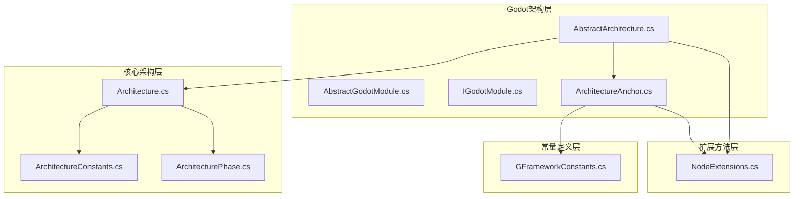
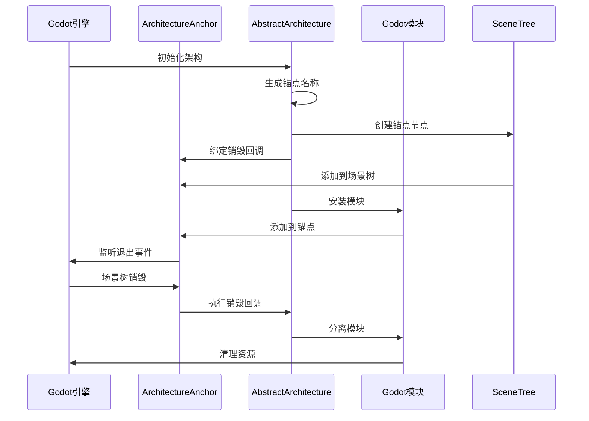
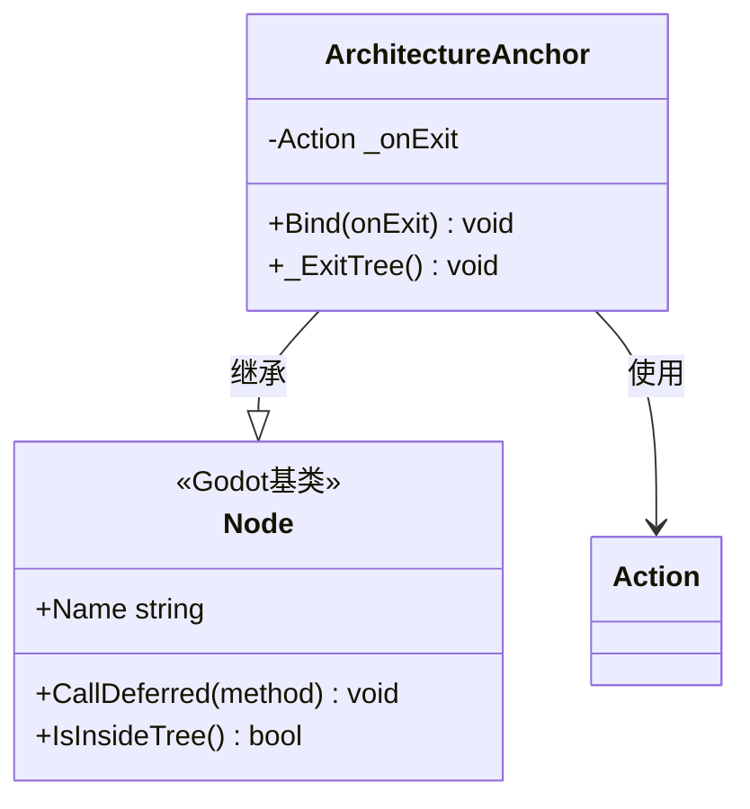
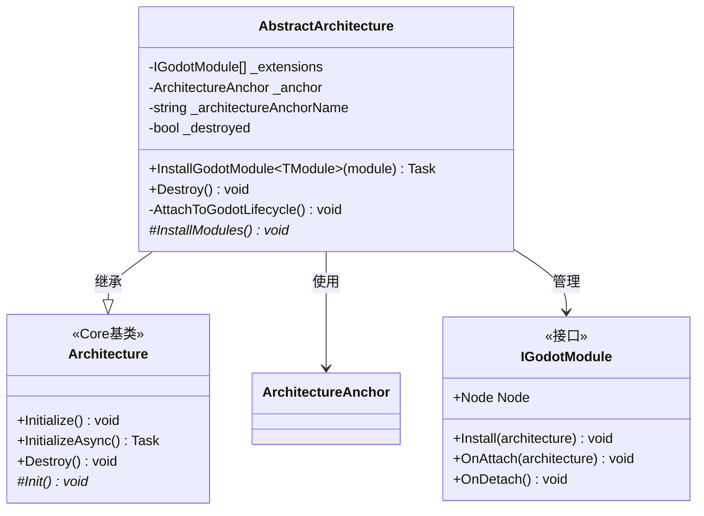
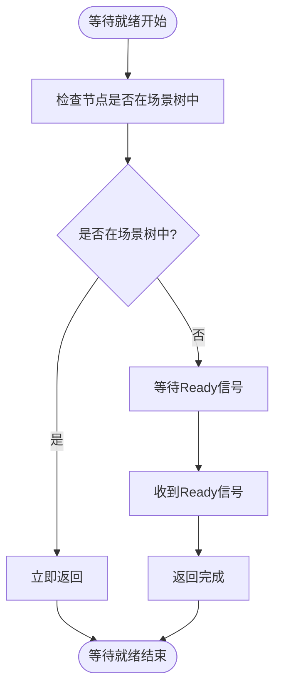
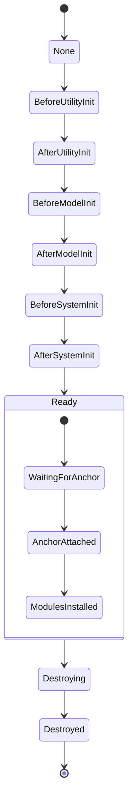
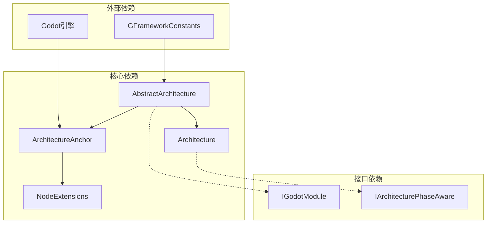

# ArchitectureAnchor锚点机制

<cite>
**本文档引用的文件**
- [ArchitectureAnchor.cs](file://GFramework.Godot/architecture/ArchitectureAnchor.cs)
- [AbstractArchitecture.cs](file://GFramework.Godot/architecture/AbstractArchitecture.cs)
- [AbstractGodotModule.cs](file://GFramework.Godot/architecture/AbstractGodotModule.cs)
- [IGodotModule.cs](file://GFramework.Godot/architecture/IGodotModule.cs)
- [NodeExtensions.cs](file://GFramework.Godot/extensions/NodeExtensions.cs)
- [Architecture.cs](file://GFramework.Core/architecture/Architecture.cs)
- [ArchitectureConstants.cs](file://GFramework.Core/architecture/ArchitectureConstants.cs)
- [ArchitecturePhase.cs](file://GFramework.Core.Abstractions/enums/ArchitecturePhase.cs)
- [GFrameworkConstants.cs](file://GFramework.Core/constants/GFrameworkConstants.cs)
- [README.md](file://GFramework.Godot/README.md)
</cite>

## 目录
1. [引言](#引言)
2. [项目结构](#项目结构)
3. [核心组件](#核心组件)
4. [架构概览](#架构概览)
5. [详细组件分析](#详细组件分析)
6. [依赖关系分析](#依赖关系分析)
7. [性能考虑](#性能考虑)
8. [故障排除指南](#故障排除指南)
9. [结论](#结论)

## 引言

ArchitectureAnchor是GFramework.Godot模块中实现架构与Godot生命周期绑定的核心机制。该机制通过在Godot场景树中创建一个专门的锚点节点，实现了架构组件与Godot引擎生命周期的无缝集成，确保了资源的正确管理和生命周期的完整性。

本文档深入解析ArchitectureAnchor的设计原理、实现细节和最佳实践，帮助开发者理解和正确使用这一关键机制。

## 项目结构

GFramework.Godot架构锚点机制涉及以下关键文件：



**图表来源**
- [AbstractArchitecture.cs](file://GFramework.Godot/architecture/AbstractArchitecture.cs#L1-L140)
- [ArchitectureAnchor.cs](file://GFramework.Godot/architecture/ArchitectureAnchor.cs#L1-L35)
- [Architecture.cs](file://GFramework.Core/architecture/Architecture.cs#L1-L569)

**章节来源**
- [AbstractArchitecture.cs](file://GFramework.Godot/architecture/AbstractArchitecture.cs#L1-L140)
- [ArchitectureAnchor.cs](file://GFramework.Godot/architecture/ArchitectureAnchor.cs#L1-L35)

## 核心组件

ArchitectureAnchor机制由四个核心组件构成：

### 1. ArchitectureAnchor锚点节点
- **职责**: 作为Godot场景树中的根节点，绑定架构生命周期
- **功能**: 提供退出回调绑定和自动清理机制
- **特点**: 轻量级设计，专注于生命周期管理

### 2. AbstractArchitecture架构基类
- **职责**: 管理架构初始化、生命周期绑定和模块安装
- **功能**: 创建锚点节点、绑定Godot生命周期、管理模块扩展
- **特点**: 支持异步初始化和模块化架构设计

### 3. AbstractGodotModule模块基类
- **职责**: 定义Godot模块的标准行为和接口
- **功能**: 提供模块安装、附加、分离的生命周期方法
- **特点**: 强类型设计，支持架构阶段感知

### 4. NodeExtensions节点扩展
- **职责**: 提供节点操作的扩展方法
- **功能**: 等待就绪、安全操作、延迟调用等
- **特点**: 类型安全，错误处理完善

**章节来源**
- [ArchitectureAnchor.cs](file://GFramework.Godot/architecture/ArchitectureAnchor.cs#L1-L35)
- [AbstractArchitecture.cs](file://GFramework.Godot/architecture/AbstractArchitecture.cs#L1-L140)
- [AbstractGodotModule.cs](file://GFramework.Godot/architecture/AbstractGodotModule.cs#L1-L55)
- [NodeExtensions.cs](file://GFramework.Godot/extensions/NodeExtensions.cs#L1-L259)

## 架构概览

ArchitectureAnchor机制实现了架构与Godot生命周期的深度绑定：



**图表来源**
- [AbstractArchitecture.cs](file://GFramework.Godot/architecture/AbstractArchitecture.cs#L74-L91)
- [ArchitectureAnchor.cs](file://GFramework.Godot/architecture/ArchitectureAnchor.cs#L29-L34)

该机制的关键优势包括：

1. **自动生命周期管理**: 锚点节点自动处理架构销毁时的清理工作
2. **类型安全**: 强类型接口确保编译时错误检测
3. **模块化设计**: 支持动态安装和卸载Godot模块
4. **异步支持**: 完整的异步初始化和等待机制

## 详细组件分析

### ArchitectureAnchor锚点节点分析

ArchitectureAnchor是最核心的组件，实现了架构与Godot生命周期的绑定：



**图表来源**
- [ArchitectureAnchor.cs](file://GFramework.Godot/architecture/ArchitectureAnchor.cs#L9-L35)

#### 核心功能实现

1. **回调绑定机制**
   - `Bind(Action onExit)`方法提供退出回调绑定
   - 支持重复绑定警告，防止意外覆盖
   - 确保资源清理的完整性

2. **生命周期管理**
   - `_ExitTree()`方法在节点移除时自动调用
   - 原子性执行回调，避免竞态条件
   - 清理引用，防止内存泄漏

**章节来源**
- [ArchitectureAnchor.cs](file://GFramework.Godot/architecture/ArchitectureAnchor.cs#L11-L34)

### AbstractArchitecture架构基类分析

AbstractArchitecture负责整体架构的生命周期管理：



**图表来源**
- [AbstractArchitecture.cs](file://GFramework.Godot/architecture/AbstractArchitecture.cs#L14-L140)

#### 关键实现细节

1. **锚点命名策略**
   - 使用框架名称、架构类型和哈希码生成唯一标识
   - 格式：`__{FrameworkName}__{ArchitectureType}__{HashCode}__ArchitectureAnchor__`
   - 确保在场景树中的唯一性和可识别性

2. **Godot生命周期绑定**
   - 检查主循环是否存在SceneTree
   - 防止重复挂载，支持热重载场景
   - 使用`CallDeferred`确保线程安全

3. **模块管理机制**
   - 维护已安装模块列表
   - 支持异步模块安装
   - 完整的模块生命周期管理

**章节来源**
- [AbstractArchitecture.cs](file://GFramework.Godot/architecture/AbstractArchitecture.cs#L58-L91)
- [AbstractArchitecture.cs](file://GFramework.Godot/architecture/AbstractArchitecture.cs#L100-L119)

### NodeExtensions等待机制分析

NodeExtensions提供了关键的等待和异步操作支持：



**图表来源**
- [NodeExtensions.cs](file://GFramework.Godot/extensions/NodeExtensions.cs#L52-L55)

#### WaitUntilReady实现原理

1. **智能等待逻辑**
   - 如果节点已在场景树中，立即返回
   - 如果节点尚未就绪，等待Ready信号
   - 使用Godot的信号系统实现非阻塞等待

2. **异步模块安装流程**
   ```mermaid
sequenceDiagram
participant Arch as AbstractArchitecture
participant Anchor as ArchitectureAnchor
participant Module as Godot模块
Arch->>Module : Install(this)
Arch->>Anchor : WaitUntilReady()
Anchor-->>Arch : 就绪信号
Arch->>Anchor : CallDeferred(AddChild)
Arch->>Module : OnAttach(this)
Arch->>Arch : 添加到扩展列表
```

**图表来源**
- [AbstractArchitecture.cs](file://GFramework.Godot/architecture/AbstractArchitecture.cs#L108-L112)
- [NodeExtensions.cs](file://GFramework.Godot/extensions/NodeExtensions.cs#L52-L55)

**章节来源**
- [NodeExtensions.cs](file://GFramework.Godot/extensions/NodeExtensions.cs#L48-L55)
- [AbstractArchitecture.cs](file://GFramework.Godot/architecture/AbstractArchitecture.cs#L108-L112)

### 架构阶段管理分析

ArchitectureAnchor机制与架构阶段系统紧密集成：



**图表来源**
- [ArchitectureConstants.cs](file://GFramework.Core/architecture/ArchitectureConstants.cs#L17-L29)
- [ArchitecturePhase.cs](file://GFramework.Core.Abstractions/enums/ArchitecturePhase.cs#L10-L66)

**章节来源**
- [ArchitectureConstants.cs](file://GFramework.Core/architecture/ArchitectureConstants.cs#L38-L54)
- [ArchitecturePhase.cs](file://GFramework.Core.Abstractions/enums/ArchitecturePhase.cs#L10-L66)

## 依赖关系分析

ArchitectureAnchor机制的依赖关系如下：



**图表来源**
- [AbstractArchitecture.cs](file://GFramework.Godot/architecture/AbstractArchitecture.cs#L1-L20)
- [ArchitectureAnchor.cs](file://GFramework.Godot/architecture/ArchitectureAnchor.cs#L1-L10)
- [GFrameworkConstants.cs](file://GFramework.Core/constants/GFrameworkConstants.cs#L6-L12)

### 关键依赖关系

1. **Godot引擎集成**
   - 依赖SceneTree进行场景树操作
   - 使用CallDeferred确保线程安全
   - 通过Ready信号实现异步等待

2. **框架常量依赖**
   - 使用GFrameworkConstants确保命名一致性
   - 支持框架标识和版本管理

3. **接口契约依赖**
   - IGodotModule定义模块标准
   - IArchitecturePhaseAware支持阶段感知
   - 强类型设计确保编译时安全

**章节来源**
- [AbstractArchitecture.cs](file://GFramework.Godot/architecture/AbstractArchitecture.cs#L76-L90)
- [GFrameworkConstants.cs](file://GFramework.Core/constants/GFrameworkConstants.cs#L6-L12)

## 性能考虑

ArchitectureAnchor机制在设计时充分考虑了性能优化：

### 1. 内存管理优化
- 使用弱引用避免循环引用
- 原子性操作防止竞态条件
- 及时清理回调引用防止内存泄漏

### 2. 线程安全保证
- 所有场景树操作使用CallDeferred
- 避免在渲染线程中进行阻塞操作
- 支持多线程环境下的安全访问

### 3. 初始化性能优化
- 延迟创建锚点节点
- 智能等待机制避免不必要的阻塞
- 模块安装支持异步处理

## 故障排除指南

### 常见问题及解决方案

#### 1. 锚点重复创建问题
**症状**: 场景切换后出现多个锚点节点
**原因**: 重复调用Initialize或热重载场景
**解决方案**: 
- 检查场景树中是否已存在同名锚点
- 确保正确销毁旧架构实例
- 使用唯一命名策略避免冲突

#### 2. 模块安装失败问题
**症状**: 模块无法正常安装或就绪
**原因**: 锚点未正确初始化或等待超时
**解决方案**:
- 验证锚点名称生成逻辑
- 检查WaitUntilReady调用时机
- 确保模块安装在正确的架构阶段

#### 3. 资源清理不完整问题
**症状**: 场景切换后资源未正确释放
**原因**: 退出回调未执行或异常中断
**解决方案**:
- 检查Bind方法调用是否成功
- 验证_destroyed标志位状态
- 确保模块OnDetach实现正确

#### 4. 异步操作死锁问题
**症状**: 等待操作无法正常完成
**原因**: 错误的异步调用模式
**解决方案**:
- 使用WaitUntilReady而非阻塞等待
- 确保CallDeferred的正确使用
- 验证Godot信号系统的完整性

**章节来源**
- [AbstractArchitecture.cs](file://GFramework.Godot/architecture/AbstractArchitecture.cs#L104-L106)
- [ArchitectureAnchor.cs](file://GFramework.Godot/architecture/ArchitectureAnchor.cs#L19-L22)

## 结论

ArchitectureAnchor锚点机制是GFramework.Godot架构设计的核心创新，它成功解决了架构组件与Godot引擎生命周期绑定的技术难题。通过精心设计的锚点节点、智能的等待机制和完善的生命周期管理，该机制为开发者提供了强大而可靠的架构基础。

### 主要优势总结

1. **无缝集成**: 架构生命周期与Godot生命周期完全同步
2. **类型安全**: 强类型设计确保编译时错误检测
3. **模块化**: 支持动态模块安装和卸载
4. **异步支持**: 完整的异步初始化和等待机制
5. **性能优化**: 线程安全和内存管理优化

### 最佳实践建议

1. **正确使用锚点命名**: 确保唯一性和可识别性
2. **及时清理资源**: 遵循架构销毁流程
3. **合理使用异步**: 利用WaitUntilReady避免阻塞
4. **模块化设计**: 按功能分组组织Godot模块
5. **错误处理**: 实现完善的异常处理机制

通过深入理解ArchitectureAnchor机制的设计原理和实现细节，开发者可以更好地利用GFramework.Godot框架的优势，构建高质量的Godot游戏应用。