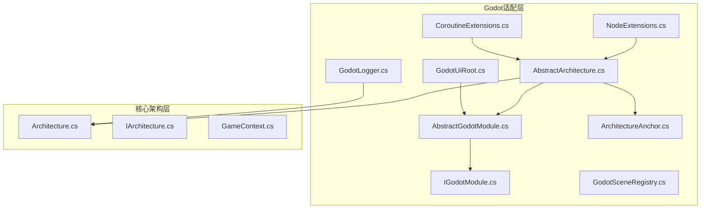
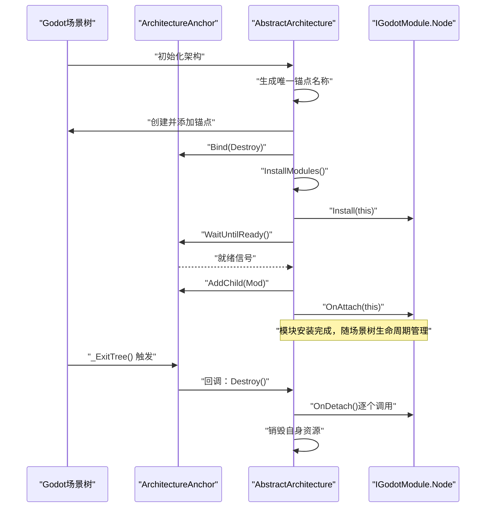
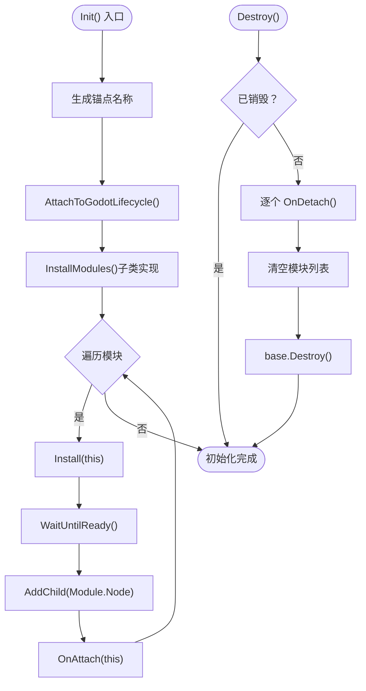
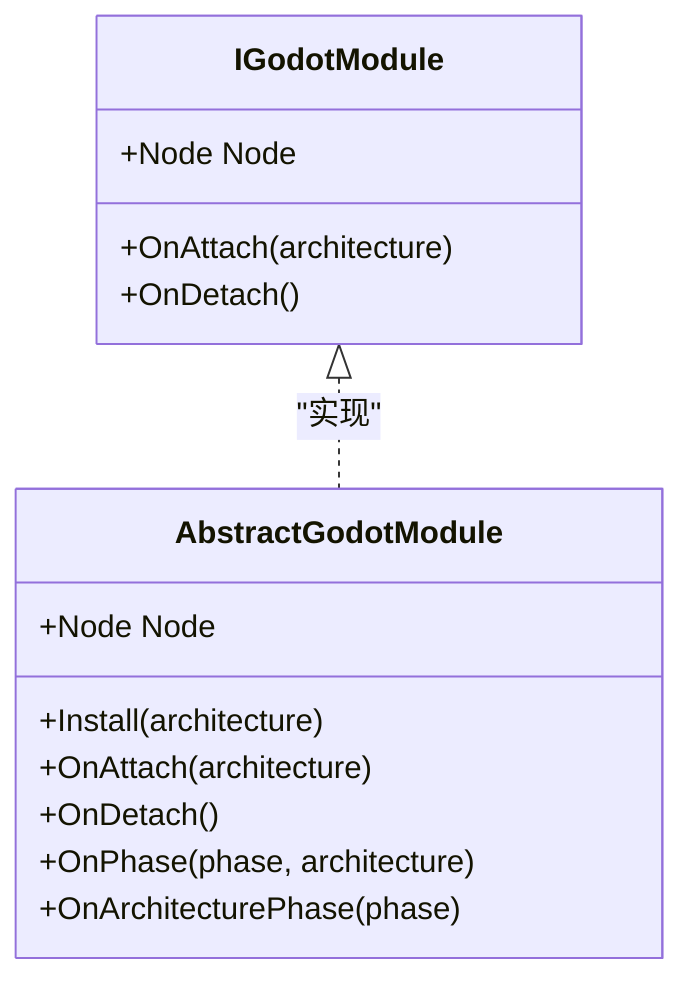
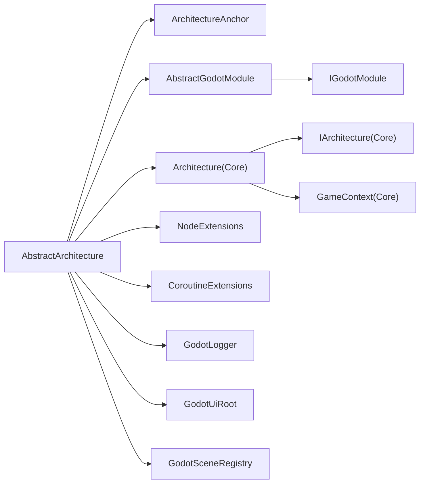

# Godot架构集成

<cite>
**本文引用的文件**
- [AbstractArchitecture.cs](file://GFramework.Godot/architecture/AbstractArchitecture.cs)
- [AbstractGodotModule.cs](file://GFramework.Godot/architecture/AbstractGodotModule.cs)
- [ArchitectureAnchor.cs](file://GFramework.Godot/architecture/ArchitectureAnchor.cs)
- [IGodotModule.cs](file://GFramework.Godot/architecture/IGodotModule.cs)
- [GFramework.Godot.csproj](file://GFramework.Godot/GFramework.Godot.csproj)
- [NodeExtensions.cs](file://GFramework.Godot/extensions/NodeExtensions.cs)
- [CoroutineExtensions.cs](file://GFramework.Godot/coroutine/CoroutineExtensions.cs)
- [GodotLogger.cs](file://GFramework.Godot/logging/GodotLogger.cs)
- [GodotSceneRegistry.cs](file://GFramework.Godot/scene/GodotSceneRegistry.cs)
- [GodotUiRoot.cs](file://GFramework.Godot/ui/GodotUiRoot.cs)
- [Architecture.cs](file://GFramework.Core/architecture/Architecture.cs)
- [IArchitecture.cs](file://GFramework.Core.Abstractions/architecture/IArchitecture.cs)
- [GameContext.cs](file://GFramework.Core/architecture/GameContext.cs)
- [godot-integration.md](file://docs/tutorials/godot-integration.md)
- [architecture-patterns.md](file://docs/best-practices/architecture-patterns.md)
</cite>

## 目录
1. [简介](#简介)
2. [项目结构](#项目结构)
3. [核心组件](#核心组件)
4. [架构总览](#架构总览)
5. [组件详解](#组件详解)
6. [依赖关系分析](#依赖关系分析)
7. [性能考量](#性能考量)
8. [故障排查指南](#故障排查指南)
9. [结论](#结论)
10. [附录](#附录)

## 简介
本文件面向希望在Godot引擎中集成GFramework的开发者，系统性阐述Godot架构集成的实现细节与最佳实践。重点包括：
- AbstractArchitecture在Godot中的具体实现与Godot生命周期绑定机制
- AbstractGodotModule的设计模式与模块化架构在Godot环境下的工作原理
- ArchitectureAnchor的作用与配置，以及在Godot场景中的挂载与初始化流程
- IGodotModule接口的设计理念与实现要求
- 完整的Godot项目集成流程，涵盖项目设置、脚本挂载、生命周期绑定等关键步骤
- 结合实际代码示例与最佳实践建议，帮助快速落地

## 项目结构
GFramework.Godot模块围绕Godot引擎特性，提供与节点生命周期、信号系统、协程调度、日志输出、UI根节点、场景注册表等能力的适配层。核心文件组织如下：
- architecture：Godot架构核心（AbstractArchitecture、AbstractGodotModule、ArchitectureAnchor、IGodotModule）
- extensions：Godot节点扩展（如节点生命周期、安全操作、信号桥接等）
- coroutine：协程扩展（与Timing配合，支持节点生存期取消）
- logging：Godot日志适配（GD.Print/PrintErr/PushWarning/PushError）
- scene：Godot场景注册表
- ui：Godot UI根节点与页面管理
- GFramework.Godot.csproj：Godot目标框架与依赖引用

图表来源
- [AbstractArchitecture.cs](file://GFramework.Godot/architecture/AbstractArchitecture.cs#L1-L140)
- [AbstractGodotModule.cs](file://GFramework.Godot/architecture/AbstractGodotModule.cs#L1-L55)
- [ArchitectureAnchor.cs](file://GFramework.Godot/architecture/ArchitectureAnchor.cs#L1-L35)
- [IGodotModule.cs](file://GFramework.Godot/architecture/IGodotModule.cs#L1-L27)
- [NodeExtensions.cs](file://GFramework.Godot/extensions/NodeExtensions.cs#L1-L259)
- [CoroutineExtensions.cs](file://GFramework.Godot/coroutine/CoroutineExtensions.cs#L1-L66)
- [GodotLogger.cs](file://GFramework.Godot/logging/GodotLogger.cs#L1-L42)
- [GodotSceneRegistry.cs](file://GFramework.Godot/scene/GodotSceneRegistry.cs#L1-L12)
- [GodotUiRoot.cs](file://GFramework.Godot/ui/GodotUiRoot.cs#L1-L142)
- [Architecture.cs](file://GFramework.Core/architecture/Architecture.cs#L1-L569)
- [IArchitecture.cs](file://GFramework.Core.Abstractions/architecture/IArchitecture.cs#L1-L68)
- [GameContext.cs](file://GFramework.Core/architecture/GameContext.cs#L1-L111)

章节来源
- [GFramework.Godot.csproj](file://GFramework.Godot/GFramework.Godot.csproj#L1-L22)

## 核心组件
本节聚焦Godot集成的关键构件，解释其职责、交互与实现要点。

- AbstractArchitecture（Godot架构基类）
  - 负责将架构初始化与Godot场景树生命周期绑定，创建ArchitectureAnchor作为根节点，并在场景树销毁时触发架构销毁
  - 提供InstallGodotModule<T>方法，将IGodotModule安装到架构中，自动等待锚点就绪并将其Node作为子节点挂载
  - 维护已安装模块列表，在Destroy时逐一调用OnDetach并清空

- AbstractGodotModule（Godot模块抽象基类）
  - 定义模块的Node、Install、OnAttach、OnDetach、OnPhase等生命周期钩子
  - 作为IGodotModule的默认实现，便于子类按需覆写

- ArchitectureAnchor（架构锚点节点）
  - 作为Godot节点，提供Bind(Action)绑定退出回调，_ExitTree时执行并清理
  - 用于确保架构在场景树移除时能正确触发Destroy流程

- IGodotModule（Godot模块接口）
  - 扩展IArchitectureModule，增加Node属性与OnAttach/OnDetach回调
  - 用于声明式地将Godot节点作为模块接入架构

- NodeExtensions（节点扩展）
  - 提供安全的节点释放、Ready等待、父子节点查找、输入处理、场景树遍历、延迟调用等扩展
  - 为模块与节点生命周期管理提供便利

- CoroutineExtensions（协程扩展）
  - 提供RunCoroutine与CancelWith（基于节点生存期）的协程启动与取消能力
  - 与Timing协作，保证协程在节点销毁时自动取消

- GodotLogger（Godot日志适配）
  - 将日志输出映射到GD.Print/PrintErr/PushWarning/PushError，按级别区分输出渠道

- GodotSceneRegistry（场景注册表）
  - 基于KeyValueRegistryBase，以字符串键、PackedScene值的方式管理场景资源

- GodotUiRoot（UI根节点）
  - 管理UI页面节点的添加、移除与Z序（层级）排序，支持UiLayer映射

章节来源
- [AbstractArchitecture.cs](file://GFramework.Godot/architecture/AbstractArchitecture.cs#L1-L140)
- [AbstractGodotModule.cs](file://GFramework.Godot/architecture/AbstractGodotModule.cs#L1-L55)
- [ArchitectureAnchor.cs](file://GFramework.Godot/architecture/ArchitectureAnchor.cs#L1-L35)
- [IGodotModule.cs](file://GFramework.Godot/architecture/IGodotModule.cs#L1-L27)
- [NodeExtensions.cs](file://GFramework.Godot/extensions/NodeExtensions.cs#L1-L259)
- [CoroutineExtensions.cs](file://GFramework.Godot/coroutine/CoroutineExtensions.cs#L1-L66)
- [GodotLogger.cs](file://GFramework.Godot/logging/GodotLogger.cs#L1-L42)
- [GodotSceneRegistry.cs](file://GFramework.Godot/scene/GodotSceneRegistry.cs#L1-L12)
- [GodotUiRoot.cs](file://GFramework.Godot/ui/GodotUiRoot.cs#L1-L142)

## 架构总览
下图展示AbstractArchitecture如何在Godot场景树中建立“架构锚点”，并将模块节点挂载到该锚点之下，同时在场景树退出时触发架构销毁：

图表来源
- [AbstractArchitecture.cs](file://GFramework.Godot/architecture/AbstractArchitecture.cs#L56-L139)
- [ArchitectureAnchor.cs](file://GFramework.Godot/architecture/ArchitectureAnchor.cs#L29-L34)

## 组件详解

### AbstractArchitecture（Godot架构基类）
- 初始化流程
  - 生成唯一锚点名称，避免重复挂载
  - 通过AttachToGodotLifecycle将锚点添加到场景根节点，并绑定Destroy回调
  - 调用InstallModules（抽象方法，子类实现）注册模块
- 模块安装
  - InstallGodotModule<T>：调用module.Install(this)，等待锚点就绪后将module.Node作为子节点挂载，并触发OnAttach(this)
  - 维护模块列表，Destroy时逐一调用OnDetach并清空
- 销毁流程
  - 标记_destroyed，避免重复销毁
  - 依次调用模块OnDetach，清空列表，再调用基类Destroy

图表来源
- [AbstractArchitecture.cs](file://GFramework.Godot/architecture/AbstractArchitecture.cs#L56-L139)

章节来源
- [AbstractArchitecture.cs](file://GFramework.Godot/architecture/AbstractArchitecture.cs#L1-L140)

### AbstractGodotModule（Godot模块抽象基类）
- 关键点
  - Node：模块关联的Godot节点
  - Install(IArchitecture)：在架构中注册系统/工具等组件
  - OnAttach/OnDetach：模块附加/分离时的回调
  - OnPhase：架构阶段变化时的回调（可选覆写）

图表来源
- [IGodotModule.cs](file://GFramework.Godot/architecture/IGodotModule.cs#L1-L27)
- [AbstractGodotModule.cs](file://GFramework.Godot/architecture/AbstractGodotModule.cs#L1-L55)

章节来源
- [AbstractGodotModule.cs](file://GFramework.Godot/architecture/AbstractGodotModule.cs#L1-L55)
- [IGodotModule.cs](file://GFramework.Godot/architecture/IGodotModule.cs#L1-L27)

### ArchitectureAnchor（架构锚点节点）
- 职责
  - Bind(Action)：绑定场景树退出时的回调
  - _ExitTree()：执行回调并清理引用
- 作用
  - 作为架构根节点，确保场景树移除时能触发架构销毁流程

章节来源
- [ArchitectureAnchor.cs](file://GFramework.Godot/architecture/ArchitectureAnchor.cs#L1-L35)

### IGodotModule（Godot模块接口）
- 设计理念
  - 以Node为中心，模块即节点，天然融入Godot场景树
  - 通过OnAttach/OnDetach实现与架构生命周期的解耦绑定
- 实现要求
  - 必须提供Node属性
  - 在Install中完成架构组件注册
  - 在OnAttach中执行模块初始化逻辑
  - 在OnDetach中执行清理逻辑

章节来源
- [IGodotModule.cs](file://GFramework.Godot/architecture/IGodotModule.cs#L1-L27)

### NodeExtensions（节点扩展）
- 能力概览
  - 安全释放（QueueFreeX/Freex）、Ready等待（WaitUntilReady）
  - 有效性检查（IsValidNode/IsInvalidNode）
  - 输入处理（SetInputAsHandled）、场景树暂停（Paused）
  - 子节点查找（FindChildX）、路径获取（GetOrCreateNode）
  - 异步添加（AddChildX）、父节点转换（GetParentX）
  - 输入禁用/启用（DisableInput/EnableInput）
  - 路径打印（LogNodePath）、树形打印（PrintTreeX）
  - 安全延迟调用（SafeCallDeferred）
  - 类型转换（OfType）

章节来源
- [NodeExtensions.cs](file://GFramework.Godot/extensions/NodeExtensions.cs#L1-L259)

### CoroutineExtensions（协程扩展）
- 能力概览
  - RunCoroutine：启动协程（支持Segment与tag）
  - CancelWith：在节点销毁时自动取消协程（支持单节点或多节点）

章节来源
- [CoroutineExtensions.cs](file://GFramework.Godot/coroutine/CoroutineExtensions.cs#L1-L66)

### GodotLogger（Godot日志适配）
- 能力概览
  - 将日志级别映射到GD.Print/PrintErr/PushWarning/PushError
  - 支持异常信息拼接到消息末尾

章节来源
- [GodotLogger.cs](file://GFramework.Godot/logging/GodotLogger.cs#L1-L42)

### GodotSceneRegistry（场景注册表）
- 能力概览
  - 基于KeyValueRegistryBase，以字符串键、PackedScene值进行场景注册与管理

章节来源
- [GodotSceneRegistry.cs](file://GFramework.Godot/scene/GodotSceneRegistry.cs#L1-L12)

### GodotUiRoot（UI根节点）
- 能力概览
  - _Ready时创建UiContainer
  - AddUiPage/RemoveUiPage管理页面节点
  - SetZOrder设置Z序（层级）
  - 支持UiLayer到Z序映射

章节来源
- [GodotUiRoot.cs](file://GFramework.Godot/ui/GodotUiRoot.cs#L1-L142)

## 依赖关系分析
- AbstractArchitecture依赖Godot场景树（SceneTree）与节点（Node），并通过ArchitectureAnchor绑定生命周期
- AbstractGodotModule实现IGodotModule，作为模块化的Godot节点载体
- NodeExtensions与CoroutineExtensions为模块与协程提供Godot原生能力的封装
- GodotLogger对接核心日志体系，GodotSceneRegistry与GodotUiRoot分别对接场景与UI管理
- 核心架构层（Architecture.cs、IArchitecture.cs、GameContext.cs）为Godot适配层提供通用的架构生命周期与上下文管理

图表来源
- [AbstractArchitecture.cs](file://GFramework.Godot/architecture/AbstractArchitecture.cs#L1-L140)
- [AbstractGodotModule.cs](file://GFramework.Godot/architecture/AbstractGodotModule.cs#L1-L55)
- [IGodotModule.cs](file://GFramework.Godot/architecture/IGodotModule.cs#L1-L27)
- [Architecture.cs](file://GFramework.Core/architecture/Architecture.cs#L1-L569)
- [IArchitecture.cs](file://GFramework.Core.Abstractions/architecture/IArchitecture.cs#L1-L68)
- [GameContext.cs](file://GFramework.Core/architecture/GameContext.cs#L1-L111)
- [NodeExtensions.cs](file://GFramework.Godot/extensions/NodeExtensions.cs#L1-L259)
- [CoroutineExtensions.cs](file://GFramework.Godot/coroutine/CoroutineExtensions.cs#L1-L66)
- [GodotLogger.cs](file://GFramework.Godot/logging/GodotLogger.cs#L1-L42)
- [GodotUiRoot.cs](file://GFramework.Godot/ui/GodotUiRoot.cs#L1-L142)
- [GodotSceneRegistry.cs](file://GFramework.Godot/scene/GodotSceneRegistry.cs#L1-L12)

章节来源
- [Architecture.cs](file://GFramework.Core/architecture/Architecture.cs#L1-L569)
- [IArchitecture.cs](file://GFramework.Core.Abstractions/architecture/IArchitecture.cs#L1-L68)
- [GameContext.cs](file://GFramework.Core/architecture/GameContext.cs#L1-L111)

## 性能考量
- 节点生命周期与延迟调用
  - 使用CallDeferred与WaitUntilReady避免在当前帧直接释放或访问未就绪节点
  - 通过NodeExtensions提供的QueueFreeX/Freex与IsValidNode/IsInvalidNode减少无效操作
- 协程与节点生存期
  - 使用CoroutineExtensions.CancelWith在节点销毁时自动取消协程，避免悬挂任务
- UI层级与Z序
  - 通过GodotUiRoot的层级映射与SetZOrder控制渲染顺序，避免过度重排
- 日志输出
  - GodotLogger按级别选择输出渠道，避免在高频日志中造成性能开销

[本节为通用指导，无需列出章节来源]

## 故障排查指南
- 架构未初始化或重复初始化
  - 症状：InstallGodotModule时报“锚点未初始化”
  - 排查：确认AbstractArchitecture.Init()已执行，且AttachToGodotLifecycle未因重复挂载而提前返回
- 模块未正确挂载
  - 症状：模块节点未出现在场景树中
  - 排查：确认InstallGodotModule调用顺序、模块Node非空、WaitUntilReady后AddChild已执行
- 场景树退出未触发销毁
  - 症状：场景切换后资源未释放
  - 排查：确认ArchitectureAnchor._ExitTree被调用，且Bind(Destroy)已设置
- 协程泄漏
  - 症状：节点销毁后协程仍在运行
  - 排查：使用CancelWith绑定节点生存期，或在OnDetach中显式停止协程
- UI层级错乱
  - 症状：UI遮挡或渲染顺序异常
  - 排查：检查GodotUiRoot的层级映射与SetZOrder调用

章节来源
- [AbstractArchitecture.cs](file://GFramework.Godot/architecture/AbstractArchitecture.cs#L74-L119)
- [ArchitectureAnchor.cs](file://GFramework.Godot/architecture/ArchitectureAnchor.cs#L29-L34)
- [NodeExtensions.cs](file://GFramework.Godot/extensions/NodeExtensions.cs#L1-L259)
- [CoroutineExtensions.cs](file://GFramework.Godot/coroutine/CoroutineExtensions.cs#L1-L66)
- [GodotUiRoot.cs](file://GFramework.Godot/ui/GodotUiRoot.cs#L1-L142)

## 结论
通过AbstractArchitecture与ArchitectureAnchor，GFramework在Godot中实现了与场景树生命周期的无缝绑定；AbstractGodotModule与IGodotModule则提供了模块化的节点级扩展能力。结合NodeExtensions、CoroutineExtensions、GodotLogger、GodotSceneRegistry与GodotUiRoot，开发者可以在Godot场景中高效地构建可维护、可扩展的架构系统。建议在项目中遵循模块边界清晰、事件驱动通信与延迟初始化等最佳实践，以获得更佳的开发体验与运行性能。

[本节为总结性内容，无需列出章节来源]

## 附录

### 完整集成流程（步骤说明）
- 项目设置
  - 确保目标框架包含net8.0及以上，引用Godot.SourceGenerators与GodotSharp
  - 引用GFramework.Core.Abstractions、GFramework.Game与GFramework.Game.Abstractions
- 创建架构类
  - 继承AbstractArchitecture，重写InstallModules注册Godot模块
  - 在Init中注册模型、系统、工具
- 创建Godot模块
  - 继承AbstractGodotModule，实现Node、Install、OnAttach、OnDetach
  - 在Install中向架构注册系统/工具
- 场景挂载与初始化
  - 在场景中放置一个节点作为架构入口（例如主控制器），在该节点中初始化架构并调用Initialize/InitializeAsync
  - 架构会自动创建ArchitectureAnchor并绑定生命周期
- 模块安装
  - 在InstallModules中调用InstallGodotModule<T>(module)，模块节点将被挂载到架构锚点下
- 生命周期绑定
  - 使用NodeExtensions的Ready等待、安全释放与输入处理
  - 使用CoroutineExtensions在节点销毁时自动取消协程
- UI与场景管理
  - 使用GodotUiRoot管理UI页面层级
  - 使用GodotSceneRegistry管理场景资源

章节来源
- [GFramework.Godot.csproj](file://GFramework.Godot/GFramework.Godot.csproj#L1-L22)
- [godot-integration.md](file://docs/tutorials/godot-integration.md#L1-L800)
- [architecture-patterns.md](file://docs/best-practices/architecture-patterns.md#L1-L800)