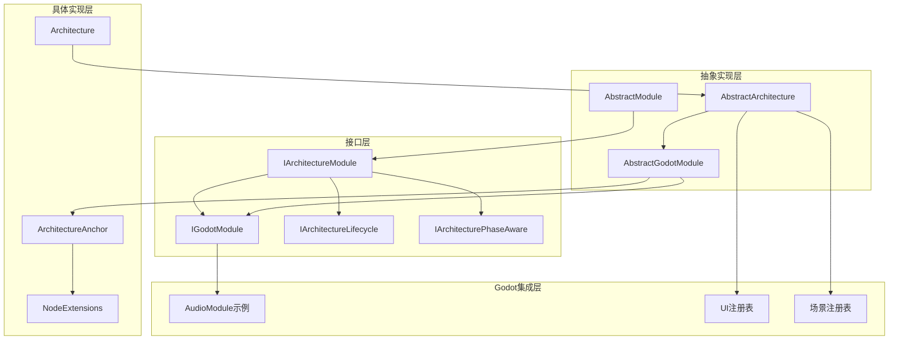
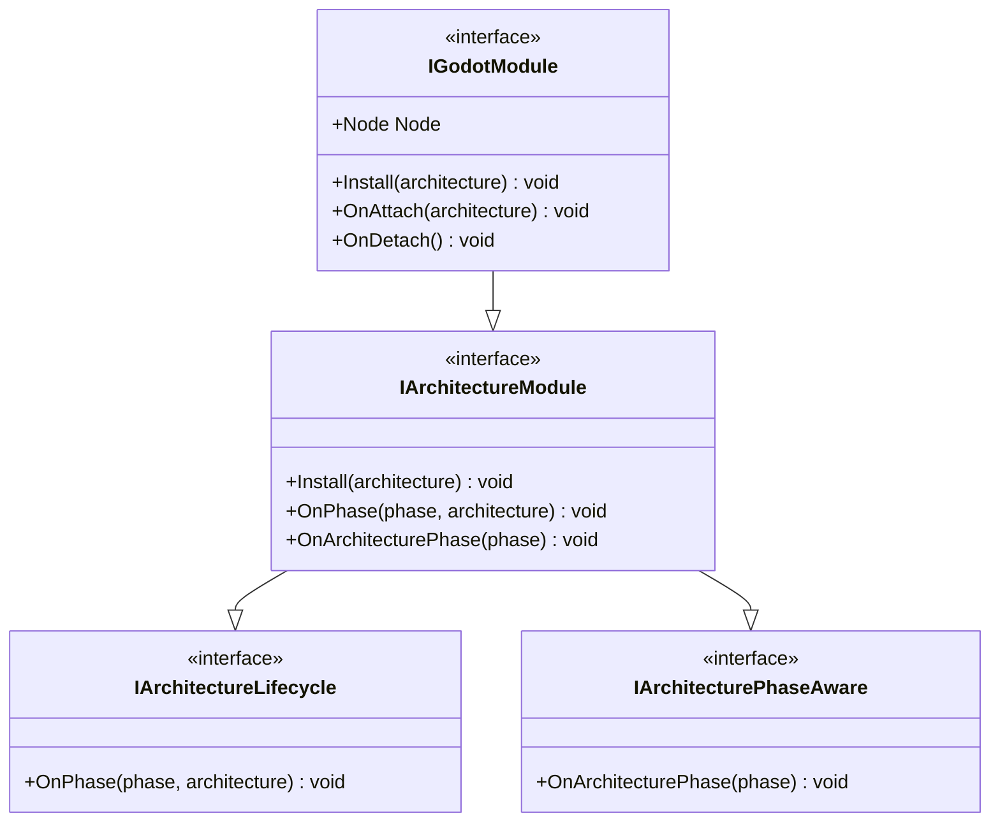
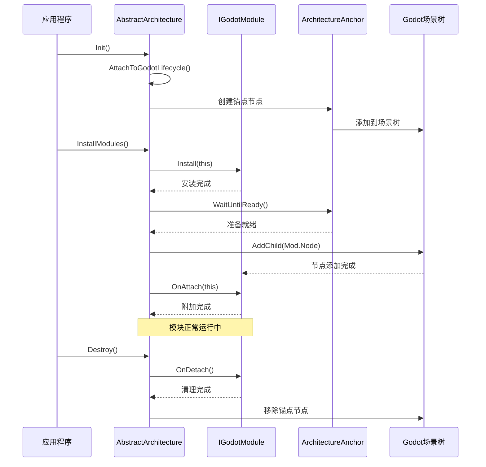
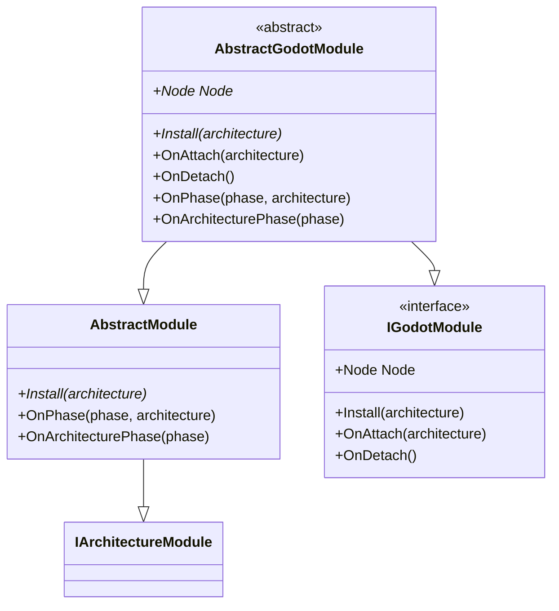
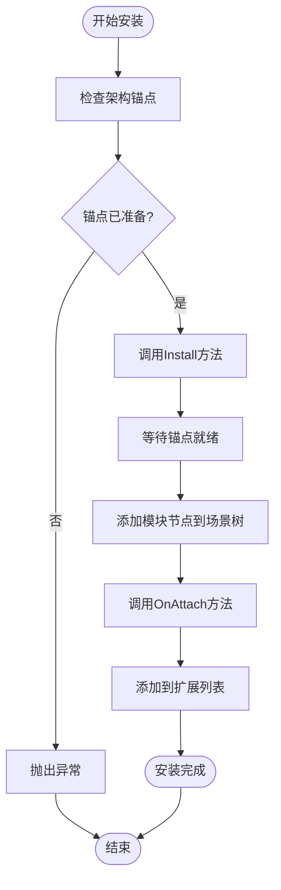
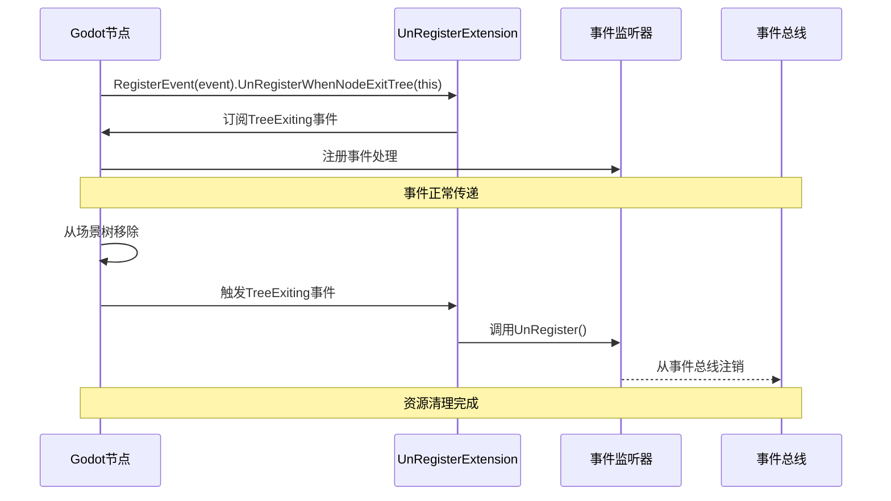
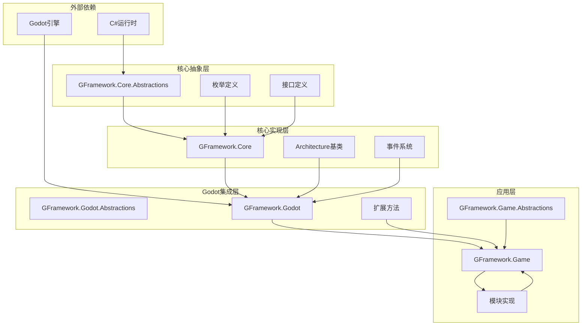

# IGodotModule接口规范

<cite>
**本文档引用的文件**
- [IGodotModule.cs](file://GFramework.Godot/architecture/IGodotModule.cs)
- [AbstractGodotModule.cs](file://GFramework.Godot/architecture/AbstractGodotModule.cs)
- [AbstractArchitecture.cs](file://GFramework.Godot/architecture/AbstractArchitecture.cs)
- [ArchitectureAnchor.cs](file://GFramework.Godot/architecture/ArchitectureAnchor.cs)
- [IArchitectureModule.cs](file://GFramework.Core.Abstractions/architecture/IArchitectureModule.cs)
- [IArchitectureLifecycle.cs](file://GFramework.Core.Abstractions/architecture/IArchitectureLifecycle.cs)
- [IArchitecturePhaseAware.cs](file://GFramework.Core.Abstractions/architecture/IArchitecturePhaseAware.cs)
- [Architecture.cs](file://GFramework.Core/architecture/Architecture.cs)
- [ArchitecturePhase.cs](file://GFramework.Core.Abstractions/enums/ArchitecturePhase.cs)
- [NodeExtensions.cs](file://GFramework.Godot/extensions/NodeExtensions.cs)
- [UnRegisterExtension.cs](file://GFramework.Godot/extensions/UnRegisterExtension.cs)
- [godot-integration.md](file://docs/tutorials/godot-integration.md)
- [godot-api.md](file://docs/api-reference/godot-api.md)
- [AbstractModule.cs](file://GFramework.Game/architecture/AbstractModule.cs)
</cite>

## 目录
1. [简介](#简介)
2. [项目结构](#项目结构)
3. [核心组件](#核心组件)
4. [架构概览](#架构概览)
5. [详细组件分析](#详细组件分析)
6. [依赖关系分析](#依赖关系分析)
7. [性能考虑](#性能考虑)
8. [故障排除指南](#故障排除指南)
9. [结论](#结论)
10. [附录](#附录)

## 简介

IGodotModule接口是GFramework中Godot引擎模块化架构的核心接口，它定义了Godot引擎中模块的基本行为和属性。该接口继承自IArchitectureModule接口，专门为Godot引擎的节点系统设计，提供了模块与Godot场景树的深度集成能力。

IGodotModule接口的设计理念基于以下原则：
- **节点优先**：模块通过Node属性直接暴露Godot节点，实现与场景树的无缝集成
- **生命周期管理**：通过Install、OnAttach、OnDetach方法提供完整的模块生命周期控制
- **架构解耦**：模块通过IArchitecture接口与架构交互，保持松耦合设计
- **异步支持**：支持异步模块安装和节点管理

## 项目结构

GFramework的Godot模块系统采用分层架构设计，主要包含以下核心层次：

**图表来源**
- [IGodotModule.cs](file://GFramework.Godot/architecture/IGodotModule.cs#L10-L27)
- [AbstractGodotModule.cs](file://GFramework.Godot/architecture/AbstractGodotModule.cs#L11-L55)
- [AbstractArchitecture.cs](file://GFramework.Godot/architecture/AbstractArchitecture.cs#L14-L140)

**章节来源**
- [IGodotModule.cs](file://GFramework.Godot/architecture/IGodotModule.cs#L1-L27)
- [AbstractGodotModule.cs](file://GFramework.Godot/architecture/AbstractGodotModule.cs#L1-L55)
- [AbstractArchitecture.cs](file://GFramework.Godot/architecture/AbstractArchitecture.cs#L1-L140)

## 核心组件

### IGodotModule接口定义

IGodotModule接口是Godot模块系统的核心，定义了模块与Godot引擎交互的标准契约：

**图表来源**
- [IGodotModule.cs](file://GFramework.Godot/architecture/IGodotModule.cs#L10-L27)
- [IArchitectureModule.cs](file://GFramework.Core.Abstractions/architecture/IArchitectureModule.cs#L7-L14)
- [IArchitectureLifecycle.cs](file://GFramework.Core.Abstractions/architecture/IArchitectureLifecycle.cs#L8-L16)
- [IArchitecturePhaseAware.cs](file://GFramework.Core.Abstractions/architecture/IArchitecturePhaseAware.cs#L8-L15)

### 关键方法职责说明

#### Node属性
- **职责**：返回模块关联的Godot节点实例
- **实现要求**：必须返回有效的Godot Node对象
- **使用场景**：作为模块在场景树中的可视化表现

#### Install方法
- **职责**：将模块安装到指定的架构中
- **调用时机**：在架构初始化过程中自动调用
- **实现要求**：注册系统、工具等架构组件

#### OnAttach方法
- **职责**：当模块被附加到架构时调用
- **调用时机**：模块节点添加到场景树后调用
- **实现要求**：执行模块的初始化逻辑

#### OnDetach方法
- **职责**：当模块从架构分离时调用
- **调用时机**：架构销毁或模块卸载时调用
- **实现要求**：执行清理和资源释放

**章节来源**
- [IGodotModule.cs](file://GFramework.Godot/architecture/IGodotModule.cs#L10-L27)
- [AbstractGodotModule.cs](file://GFramework.Godot/architecture/AbstractGodotModule.cs#L11-L55)

## 架构概览

GFramework的Godot模块架构采用分层设计，通过AbstractArchitecture类管理模块的生命周期和节点管理：

**图表来源**
- [AbstractArchitecture.cs](file://GFramework.Godot/architecture/AbstractArchitecture.cs#L56-L139)
- [ArchitectureAnchor.cs](file://GFramework.Godot/architecture/ArchitectureAnchor.cs#L9-L35)

### 架构锚点机制

ArchitectureAnchor类是Godot模块系统的关键组件，它提供了以下功能：

1. **生命周期绑定**：通过_bind方法绑定节点退出时的回调
2. **资源清理**：在节点从场景树移除时执行清理操作
3. **异步支持**：提供WaitUntilReady方法支持异步节点管理

**章节来源**
- [AbstractArchitecture.cs](file://GFramework.Godot/architecture/AbstractArchitecture.cs#L74-L139)
- [ArchitectureAnchor.cs](file://GFramework.Godot/architecture/ArchitectureAnchor.cs#L9-L35)

## 详细组件分析

### AbstractGodotModule抽象基类

AbstractGodotModule提供了IGodotModule接口的完整实现，包含以下特性：

**图表来源**
- [AbstractGodotModule.cs](file://GFramework.Godot/architecture/AbstractGodotModule.cs#L11-L55)
- [AbstractModule.cs](file://GFramework.Game/architecture/AbstractModule.cs#L9-L33)

### 模块安装流程

模块的安装过程遵循严格的生命周期管理：

**图表来源**
- [AbstractArchitecture.cs](file://GFramework.Godot/architecture/AbstractArchitecture.cs#L100-L119)

### 节点管理机制

GFramework提供了完善的节点管理机制，包括：

#### 节点生命周期管理
- **QueueFreeX**：安全的节点释放方法，避免在当前帧中直接删除
- **WaitUntilReady**：异步等待节点进入场景树
- **IsValidNode**：检查节点的有效性状态

#### 节点操作扩展
- **AddChildX**：异步添加子节点并等待准备就绪
- **FindChildX**：类型安全的子节点查找
- **GetOrCreateNode**：智能的节点获取或创建

**章节来源**
- [NodeExtensions.cs](file://GFramework.Godot/extensions/NodeExtensions.cs#L8-L259)

### 事件清理机制

GFramework提供了自动化的事件清理机制，确保节点退出时的资源正确释放：

**图表来源**
- [UnRegisterExtension.cs](file://GFramework.Godot/extensions/UnRegisterExtension.cs#L9-L23)

**章节来源**
- [UnRegisterExtension.cs](file://GFramework.Godot/extensions/UnRegisterExtension.cs#L1-L23)

## 依赖关系分析

GFramework的Godot模块系统具有清晰的依赖层次结构：

**图表来源**
- [IGodotModule.cs](file://GFramework.Godot/architecture/IGodotModule.cs#L1-L3)
- [Architecture.cs](file://GFramework.Core/architecture/Architecture.cs#L1-L200)

### 关键依赖关系

1. **Godot引擎依赖**：所有Godot模块都直接依赖Godot引擎的Node类
2. **架构抽象依赖**：模块通过IArchitecture接口与架构交互
3. **生命周期管理依赖**：模块依赖IArchitectureLifecycle接口进行阶段管理
4. **事件系统依赖**：模块通过事件系统与其他组件通信

**章节来源**
- [IGodotModule.cs](file://GFramework.Godot/architecture/IGodotModule.cs#L1-L3)
- [IArchitectureModule.cs](file://GFramework.Core.Abstractions/architecture/IArchitectureModule.cs#L1-L14)
- [IArchitectureLifecycle.cs](file://GFramework.Core.Abstractions/architecture/IArchitectureLifecycle.cs#L1-L16)

## 性能考虑

### 异步节点管理

GFramework通过异步机制优化节点管理性能：

1. **延迟执行**：使用CallDeferred方法避免阻塞主线程
2. **异步等待**：WaitUntilReady方法提供非阻塞的节点就绪检测
3. **批量操作**：支持多个模块的并发安装

### 内存管理优化

1. **智能释放**：QueueFreeX方法确保节点安全释放
2. **引用清理**：自动清理事件监听器和信号连接
3. **缓存策略**：合理使用对象池减少GC压力

### 架构阶段优化

通过ArchitecturePhase枚举实现模块的有序初始化，避免不必要的资源竞争。

## 故障排除指南

### 常见问题及解决方案

#### 模块安装失败
**问题描述**：模块无法正确安装到架构中
**可能原因**：
- 架构锚点未正确初始化
- 模块节点无效
- 架构已销毁

**解决方法**：
1. 检查AbstractArchitecture的初始化过程
2. 验证模块Node属性的有效性
3. 确认架构状态

#### 节点生命周期问题
**问题描述**：模块节点无法正确响应生命周期事件
**可能原因**：
- 事件监听器未正确注销
- 节点引用丢失
- 场景树状态异常

**解决方法**：
1. 使用UnRegisterExtension确保事件正确清理
2. 检查节点有效性检查
3. 验证场景树状态

#### 内存泄漏问题
**问题描述**：模块卸载后仍有内存占用
**可能原因**：
- 资源未正确释放
- 事件监听器未注销
- 对象循环引用

**解决方法**：
1. 在OnDetach中执行完整清理
2. 使用QueueFreeX安全释放节点
3. 检查所有事件订阅的注销

**章节来源**
- [AbstractArchitecture.cs](file://GFramework.Godot/architecture/AbstractArchitecture.cs#L127-L139)
- [NodeExtensions.cs](file://GFramework.Godot/extensions/NodeExtensions.cs#L14-L46)

## 结论

IGodotModule接口规范为Godot引擎的模块化开发提供了清晰的架构指导。通过节点优先的设计理念、完整的生命周期管理和异步支持机制，该接口实现了模块与Godot场景树的深度集成。

关键设计要点包括：
- **明确的职责分离**：接口定义清晰的方法职责
- **完善的生命周期管理**：从安装到销毁的完整流程
- **异步编程支持**：适应Godot的异步特性
- **资源安全保证**：自动化的资源清理机制

该接口规范为开发者提供了可靠的模块化开发框架，有助于构建可维护、高性能的Godot游戏项目。

## 附录

### 接口实现最佳实践

#### 设计模式推荐
1. **模板方法模式**：使用AbstractGodotModule提供默认实现
2. **策略模式**：通过不同的模块实现特定功能
3. **观察者模式**：利用事件系统实现松耦合通信

#### 实现示例参考
完整的AudioModule实现示例可在以下文档中找到：
- [godot-integration.md](file://docs/tutorials/godot-integration.md#L48-L114)
- [godot-api.md](file://docs/api-reference/godot-api.md#L70-L121)

#### 常见实现陷阱
1. **过度耦合**：避免直接依赖具体实现而非接口
2. **资源泄漏**：确保所有资源在OnDetach中正确释放
3. **同步阻塞**：避免在主线程中执行长时间操作
4. **状态管理**：不要在模块中存储全局状态