# Godot源代码生成器

<cite>
**本文档引用的文件**
- [GodotModuleMarker.cs](file://GFramework.Godot.SourceGenerators.Abstractions/GodotModuleMarker.cs)
- [GFramework.Godot.SourceGenerators.csproj](file://GFramework.Godot.SourceGenerators/GFramework.Godot.SourceGenerators.csproj)
- [GeWuYou.GFramework.Godot.SourceGenerators.targets](file://GFramework.Godot.SourceGenerators/GeWuYou.GFramework.Godot.SourceGenerators.targets)
- [GFramework.Godot.SourceGenerators.Abstractions.csproj](file://GFramework.Godot.SourceGenerators.Abstractions/GFramework.Godot.SourceGenerators.Abstractions.csproj)
- [AttributeClassGeneratorBase.cs](file://GFramework.SourceGenerators.Common/generator/AttributeClassGeneratorBase.cs)
- [AttributeEnumGeneratorBase.cs](file://GFramework.SourceGenerators.Common/generator/AttributeEnumGeneratorBase.cs)
- [CommonDiagnostics.cs](file://GFramework.SourceGenerators.Common/diagnostics/CommonDiagnostics.cs)
- [IGodotModule.cs](file://GFramework.Godot/architecture/IGodotModule.cs)
- [AbstractGodotModule.cs](file://GFramework.Godot/architecture/AbstractGodotModule.cs)
- [AbstractArchitecture.cs](file://GFramework.Godot/architecture/AbstractArchitecture.cs)
- [README.md](file://GFramework.SourceGenerators/README.md)
- [GeneratorTest.cs](file://GFramework.SourceGenerators.Tests/core/GeneratorTest.cs)
- [GeneratorSnapshotTest.cs](file://GFramework.SourceGenerators.Tests/core/GeneratorSnapshotTest.cs)
</cite>

## 目录
1. [简介](#简介)
2. [项目结构](#项目结构)
3. [核心组件](#核心组件)
4. [架构概览](#架构概览)
5. [详细组件分析](#详细组件分析)
6. [依赖关系分析](#依赖关系分析)
7. [性能考虑](#性能考虑)
8. [故障排除指南](#故障排除指南)
9. [结论](#结论)
10. [附录](#附录)

## 简介

Godot源代码生成器是GFramework框架中用于自动化生成Godot模块相关代码的工具集。该生成器基于Roslyn源代码生成技术，在编译时自动识别和处理带有特定特性的类，生成相应的Godot模块配置代码。

该生成器的主要目标是：
- **自动化模块标记**：通过特性标记自动识别Godot模块
- **编译时代码生成**：在编译阶段生成所需的模块配置代码
- **反射优化**：减少运行时反射调用，提升性能
- **类型安全**：确保生成代码的类型安全性
- **开发效率**：简化Godot模块的开发和配置过程

## 项目结构

GFramework源代码生成器采用分层架构设计，主要包含以下核心模块：

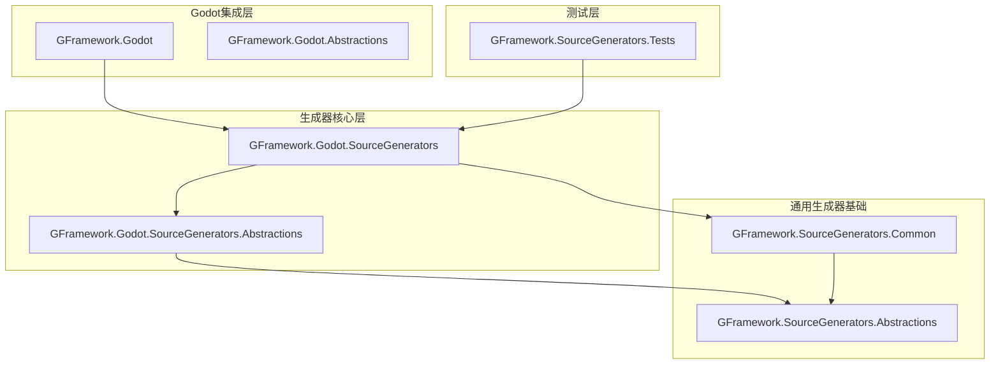

**图表来源**
- [GFramework.Godot.SourceGenerators.csproj](file://GFramework.Godot.SourceGenerators/GFramework.Godot.SourceGenerators.csproj#L1-L71)
- [GFramework.Godot.SourceGenerators.Abstractions.csproj](file://GFramework.Godot.SourceGenerators.Abstractions/GFramework.Godot.SourceGenerators.Abstractions.csproj#L1-L32)

**章节来源**
- [GFramework.Godot.SourceGenerators.csproj](file://GFramework.Godot.SourceGenerators/GFramework.Godot.SourceGenerators.csproj#L1-L71)
- [GFramework.Godot.SourceGenerators.Abstractions.csproj](file://GFramework.Godot.SourceGenerators.Abstractions/GFramework.Godot.SourceGenerators.Abstractions.csproj#L1-L32)

## 核心组件

### GodotModuleMarker标记器

GodotModuleMarker是Godot模块命名空间的占位类型，用于标识和标记Godot模块相关的代码区域。

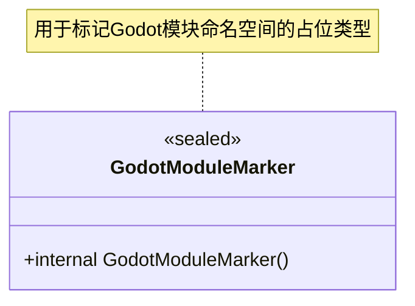

**图表来源**
- [GodotModuleMarker.cs](file://GFramework.Godot.SourceGenerators.Abstractions/GodotModuleMarker.cs#L1-L6)

### 基础生成器架构

所有生成器都基于AttributeClassGeneratorBase抽象基类构建，该基类提供了统一的生成器模式：

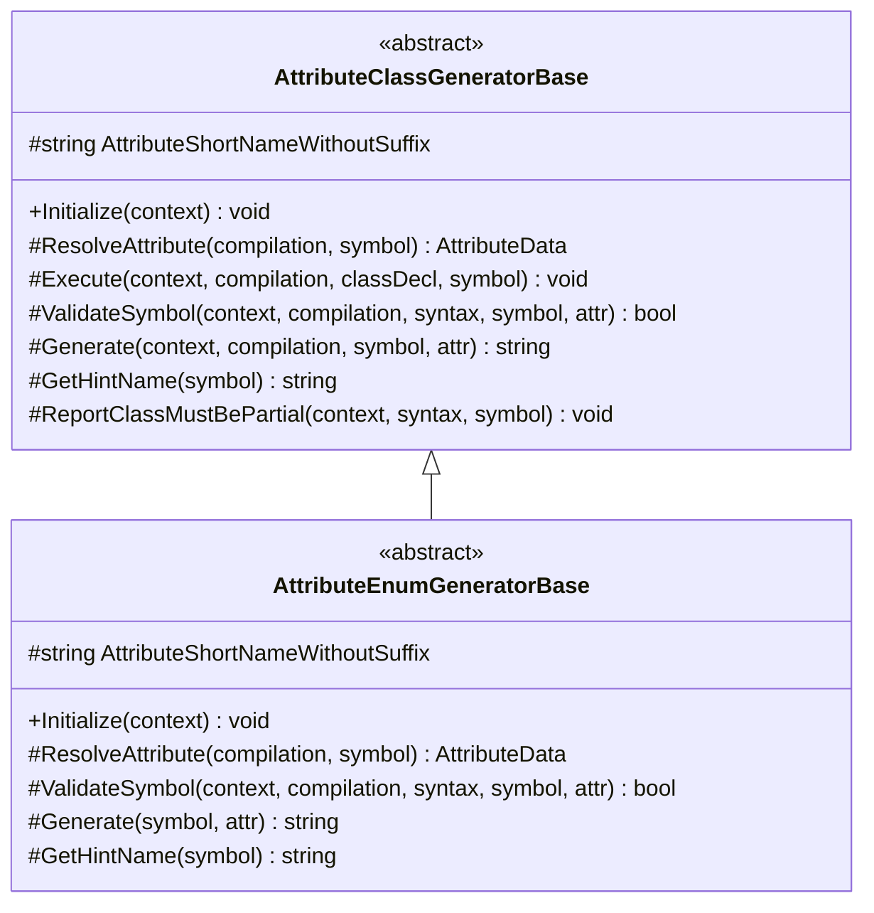

**图表来源**
- [AttributeClassGeneratorBase.cs](file://GFramework.SourceGenerators.Common/generator/AttributeClassGeneratorBase.cs#L1-L175)
- [AttributeEnumGeneratorBase.cs](file://GFramework.SourceGenerators.Common/generator/AttributeEnumGeneratorBase.cs#L1-L104)

**章节来源**
- [GodotModuleMarker.cs](file://GFramework.Godot.SourceGenerators.Abstractions/GodotModuleMarker.cs#L1-L6)
- [AttributeClassGeneratorBase.cs](file://GFramework.SourceGenerators.Common/generator/AttributeClassGeneratorBase.cs#L1-L175)
- [AttributeEnumGeneratorBase.cs](file://GFramework.SourceGenerators.Common/generator/AttributeEnumGeneratorBase.cs#L1-L104)

## 架构概览

### 编译时代码生成流程

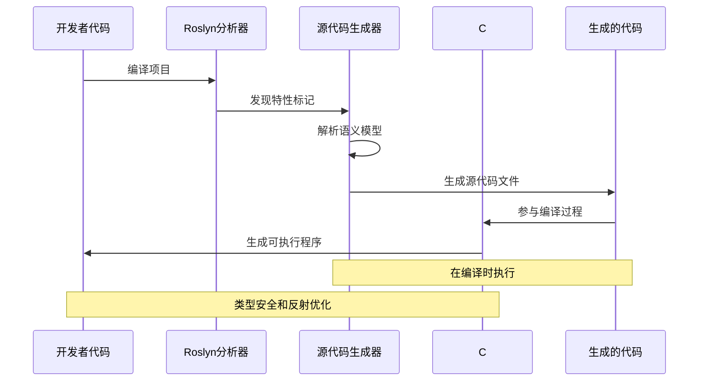

**图表来源**
- [AttributeClassGeneratorBase.cs](file://GFramework.SourceGenerators.Common/generator/AttributeClassGeneratorBase.cs#L23-L47)
- [GFramework.Godot.SourceGenerators.targets](file://GFramework.Godot.SourceGenerators/GeWuYou.GFramework.Godot.SourceGenerators.targets#L6-L10)

### Godot模块集成架构

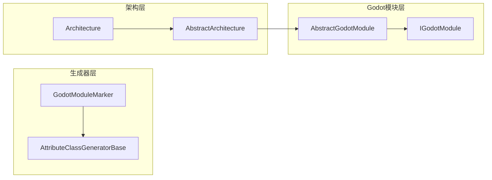

**图表来源**
- [AbstractGodotModule.cs](file://GFramework.Godot/architecture/AbstractGodotModule.cs#L1-L55)
- [IGodotModule.cs](file://GFramework.Godot/architecture/IGodotModule.cs#L1-L27)
- [AbstractArchitecture.cs](file://GFramework.Godot/architecture/AbstractArchitecture.cs#L94-L105)

**章节来源**
- [AbstractGodotModule.cs](file://GFramework.Godot/architecture/AbstractGodotModule.cs#L1-L55)
- [IGodotModule.cs](file://GFramework.Godot/architecture/IGodotModule.cs#L1-L27)
- [AbstractArchitecture.cs](file://GFramework.Godot/architecture/AbstractArchitecture.cs#L94-L105)

## 详细组件分析

### 生成器初始化流程

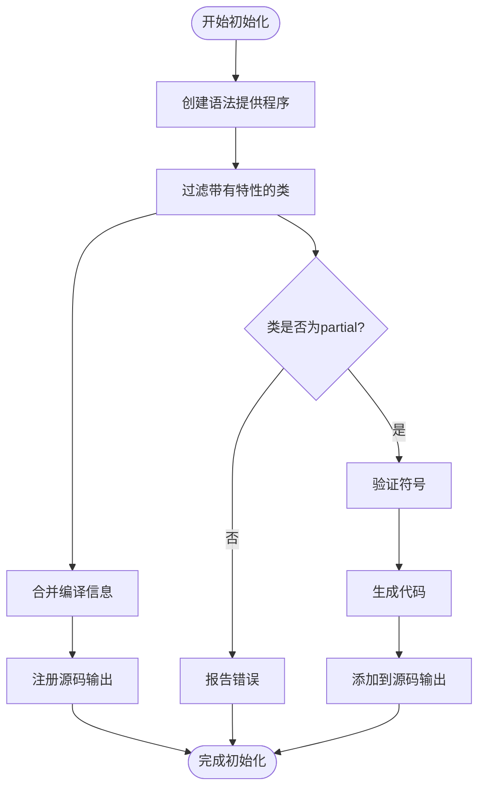

**图表来源**
- [AttributeClassGeneratorBase.cs](file://GFramework.SourceGenerators.Common/generator/AttributeClassGeneratorBase.cs#L23-L47)
- [AttributeClassGeneratorBase.cs](file://GFramework.SourceGenerators.Common/generator/AttributeClassGeneratorBase.cs#L67-L113)

### 诊断和错误处理机制

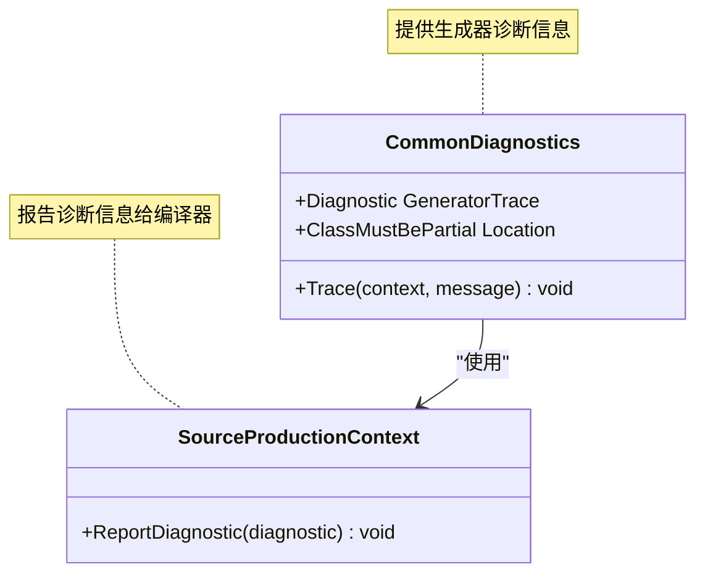

**图表来源**
- [CommonDiagnostics.cs](file://GFramework.SourceGenerators.Common/diagnostics/CommonDiagnostics.cs#L41-L60)

**章节来源**
- [AttributeClassGeneratorBase.cs](file://GFramework.SourceGenerators.Common/generator/AttributeClassGeneratorBase.cs#L67-L113)
- [CommonDiagnostics.cs](file://GFramework.SourceGenerators.Common/diagnostics/CommonDiagnostics.cs#L41-L60)

### 项目配置和构建流程

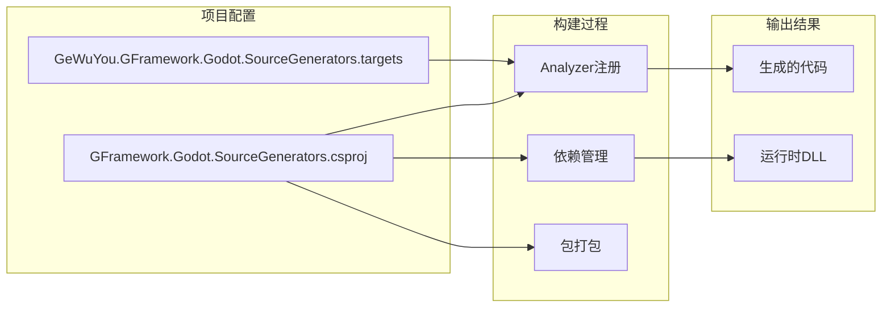

**图表来源**
- [GFramework.Godot.SourceGenerators.csproj](file://GFramework.Godot.SourceGenerators/GFramework.Godot.SourceGenerators.csproj#L35-L53)
- [GeWuYou.GFramework.Godot.SourceGenerators.targets](file://GFramework.Godot.SourceGenerators/GeWuYou.GFramework.Godot.SourceGenerators.targets#L6-L10)

**章节来源**
- [GFramework.Godot.SourceGenerators.csproj](file://GFramework.Godot.SourceGenerators/GFramework.Godot.SourceGenerators.csproj#L1-L71)
- [GeWuYou.GFramework.Godot.SourceGenerators.targets](file://GFramework.Godot.SourceGenerators/GeWuYou.GFramework.Godot.SourceGenerators.targets#L1-L16)

## 依赖关系分析

### 组件耦合度分析

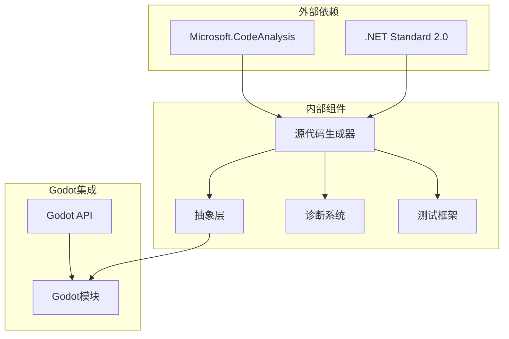

**图表来源**
- [GFramework.Godot.SourceGenerators.csproj](file://GFramework.Godot.SourceGenerators/GFramework.Godot.SourceGenerators.csproj#L21-L33)
- [GFramework.SourceGenerators.Common.csproj](file://GFramework.SourceGenerators.Common/GFramework.SourceGenerators.Common.csproj)

### 循环依赖检测

经过分析，项目结构避免了循环依赖：
- 生成器项目仅依赖抽象层，不反向依赖具体实现
- 诊断系统独立于业务逻辑
- 测试框架独立于核心功能

**章节来源**
- [GFramework.Godot.SourceGenerators.csproj](file://GFramework.Godot.SourceGenerators/GFramework.Godot.SourceGenerators.csproj#L29-L33)
- [GFramework.Godot.SourceGenerators.Abstractions.csproj](file://GFramework.Godot.SourceGenerators.Abstractions/GFramework.Godot.SourceGenerators.Abstractions.csproj#L1-L32)

## 性能考虑

### 编译时vs运行时性能对比

| 维度 | 源代码生成器 | 手写代码 |
|------|-------------|----------|
| **编译时** | 增加编译时间（几秒） | 无需编译 |
| **运行时** | 与手写代码性能相同 | 标准性能 |
| **内存使用** | 与手写代码相同 | 标准内存使用 |
| **反射调用** | 减少或消除 | 可能较多 |

### 反射优化策略

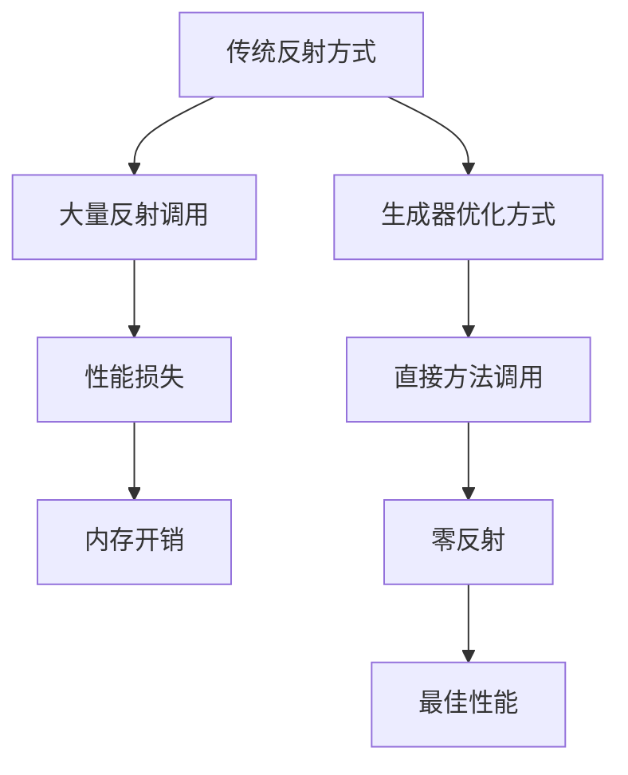

## 故障排除指南

### 常见问题和解决方案

#### 1. 生成器未生效

**症状**：编译时没有生成预期的代码文件

**排查步骤**：
1. 检查项目文件中的NuGet包引用
2. 验证特性标记是否正确应用
3. 查看生成的诊断信息

**解决方案**：
- 确保在项目文件中正确配置生成器引用
- 验证类必须标记为partial
- 检查特性名称是否匹配

#### 2. 生成代码位置问题

**默认输出位置**：`obj/Debug/net6.0/generated/`

**自定义配置**：
```xml
<PropertyGroup>
  <CompilerGeneratedFilesOutputPath>Generated</CompilerGeneratedFilesOutputPath>
</PropertyGroup>
```

#### 3. 调试生成器问题

**调试方法**：
1. 启用详细日志输出
2. 检查IDE错误列表
3. 查看生成的中间代码文件

**章节来源**
- [README.md](file://GFramework.SourceGenerators/README.md#L914-L971)

### 测试和验证

#### 快照测试机制

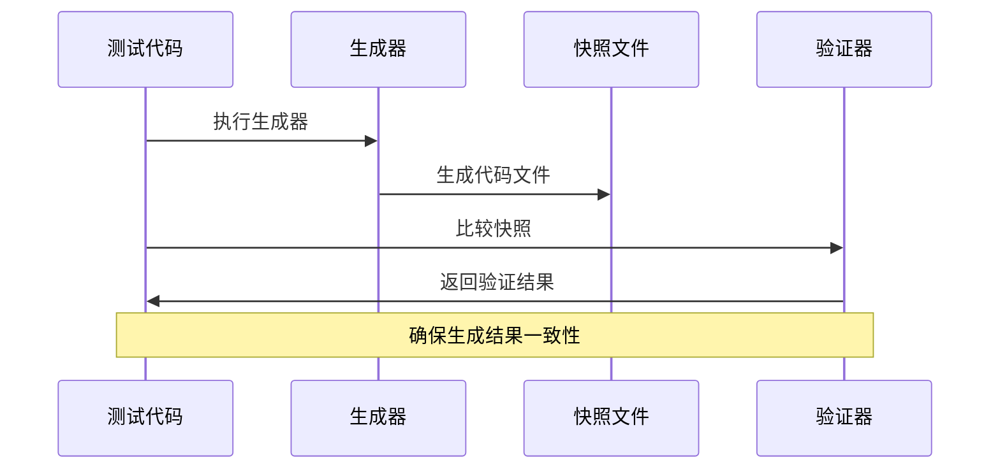

**图表来源**
- [GeneratorSnapshotTest.cs](file://GFramework.SourceGenerators.Tests/core/GeneratorSnapshotTest.cs#L1-L43)

**章节来源**
- [GeneratorTest.cs](file://GFramework.SourceGenerators.Tests/core/GeneratorTest.cs#L1-L39)
- [GeneratorSnapshotTest.cs](file://GFramework.SourceGenerators.Tests/core/GeneratorSnapshotTest.cs#L1-L43)

## 结论

Godot源代码生成器为GFramework框架提供了强大的自动化代码生成功能。通过特性标记驱动的方式，该生成器实现了：

1. **类型安全的模块识别**：通过GodotModuleMarker占位类型确保模块的类型安全性
2. **编译时优化**：在编译阶段生成代码，消除运行时反射开销
3. **灵活的扩展性**：基于抽象基类的设计允许轻松扩展新的生成器
4. **完善的诊断系统**：提供详细的错误报告和调试信息

该生成器显著提升了Godot项目的开发效率，同时保持了代码质量和性能表现。

## 附录

### 最佳实践建议

1. **特性标记规范**：确保所有需要生成代码的类都正确应用特性标记
2. **partial类要求**：生成器要求目标类必须标记为partial
3. **命名约定**：遵循一致的命名约定，便于代码维护
4. **测试覆盖**：为生成器功能编写充分的单元测试和快照测试

### 扩展开发指南

当需要创建自定义生成器时：

1. 继承相应的基类（AttributeClassGeneratorBase或AttributeEnumGeneratorBase）
2. 实现必需的抽象方法
3. 在Initialize方法中配置语法提供程序
4. 实现Generate方法生成具体的源代码
5. 添加适当的诊断信息和错误处理