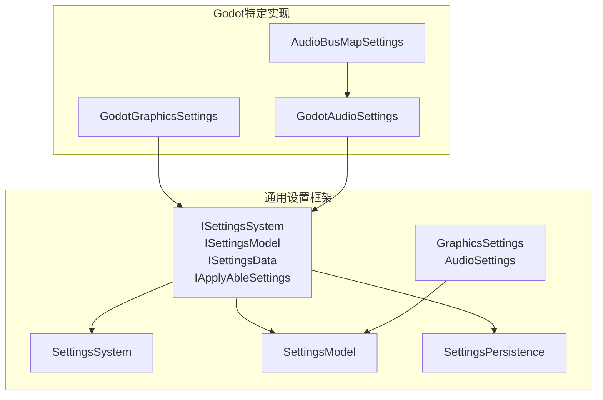
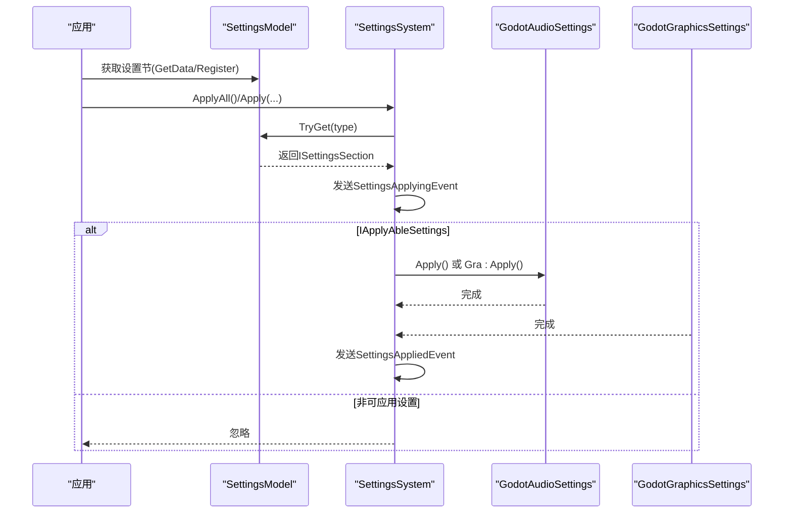
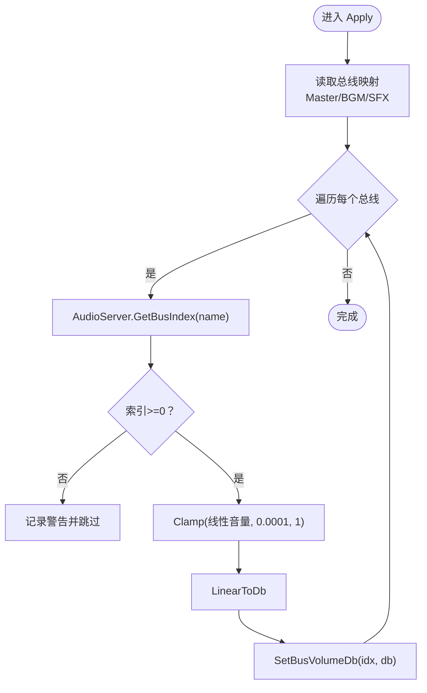
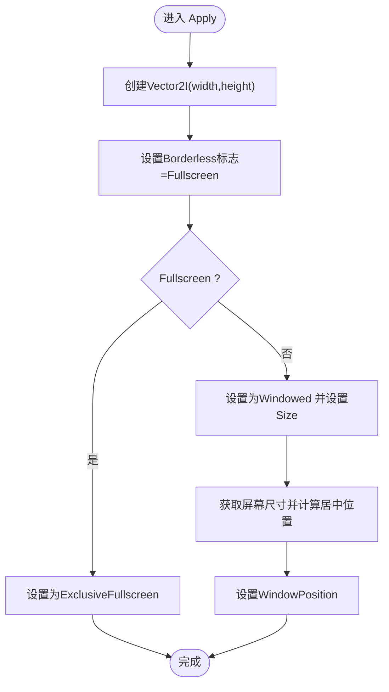
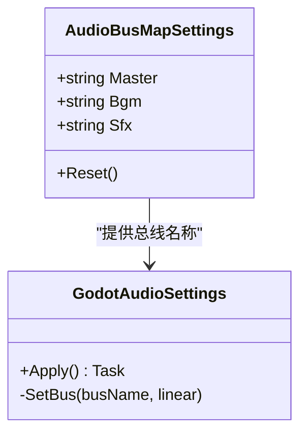
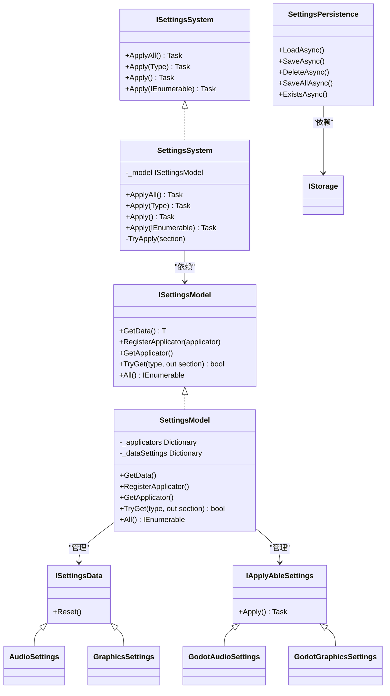
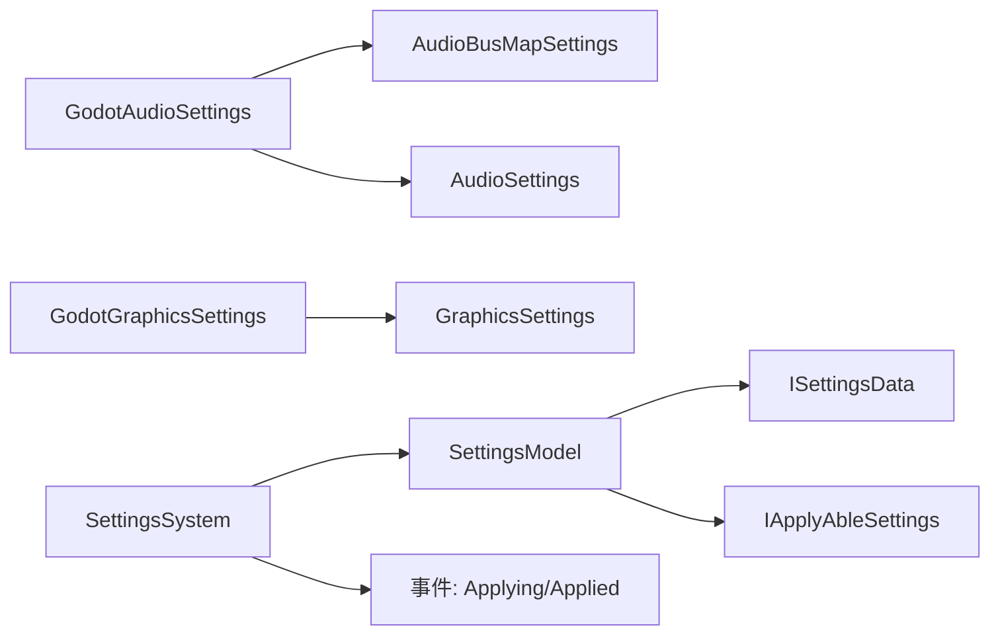

# Godot设置系统

<cite>
**本文引用的文件**
- [GodotAudioSettings.cs](file://GFramework.Godot/setting/GodotAudioSettings.cs)
- [GodotGraphicsSettings.cs](file://GFramework.Godot/setting/GodotGraphicsSettings.cs)
- [AudioBusMapSettings.cs](file://GFramework.Godot/setting/AudioBusMapSettings.cs)
- [SettingsSystem.cs](file://GFramework.Game/setting/SettingsSystem.cs)
- [SettingsModel.cs](file://GFramework.Game/setting/SettingsModel.cs)
- [SettingsPersistence.cs](file://GFramework.Game/setting/SettingsPersistence.cs)
- [ISettingsSystem.cs](file://GFramework.Game.Abstractions/setting/ISettingsSystem.cs)
- [ISettingsData.cs](file://GFramework.Game.Abstractions/setting/ISettingsData.cs)
- [IApplyAbleSettings.cs](file://GFramework.Game.Abstractions/setting/IApplyAbleSettings.cs)
- [GraphicsSettings.cs](file://GFramework.Game.Abstractions/setting/GraphicsSettings.cs)
- [AudioSettings.cs](file://GFramework.Game.Abstractions/setting/AudioSettings.cs)
- [SettingsApplyingEvent.cs](file://GFramework.Game/setting/events/SettingsApplyingEvent.cs)
- [SettingsAppliedEvent.cs](file://GFramework.Game/setting/events/SettingsAppliedEvent.cs)
- [README.md（Godot设置模块）](file://GFramework.Godot/setting/README.md)
- [README.md（设置系统）](file://GFramework.Game/setting/README.md)
- [AbstractGodotModule.cs](file://GFramework.Godot/architecture/AbstractGodotModule.cs)
</cite>

## 目录
1. [简介](#简介)
2. [项目结构](#项目结构)
3. [核心组件](#核心组件)
4. [架构总览](#架构总览)
5. [详细组件分析](#详细组件分析)
6. [依赖分析](#依赖分析)
7. [性能考量](#性能考量)
8. [故障排除指南](#故障排除指南)
9. [结论](#结论)
10. [附录](#附录)

## 简介
本文件面向Godot引擎的游戏设置系统，围绕GodotAudioSettings、GodotGraphicsSettings与AudioBusMapSettings三大核心组件，系统阐述音频设置管理（音量控制、音频总线映射、设备选择）、图形设置实现（分辨率、帧率、渲染质量）、以及设置系统在Godot中的集成方式与最佳实践。文档同时提供完整的使用示例与配置指南，帮助开发者快速落地并维护高质量的设置系统。

## 项目结构
Godot设置系统由“通用设置框架”与“Godot特定实现”两层构成：
- 通用层：定义设置接口、模型、系统与持久化能力，位于GFramework.Game与GFramework.Game.Abstractions。
- Godot层：针对Godot引擎的音频与图形设置实现，位于GFramework.Godot。

图表来源
- [ISettingsSystem.cs](file://GFramework.Game.Abstractions/setting/ISettingsSystem.cs#L1-L32)
- [ISettingsData.cs](file://GFramework.Game.Abstractions/setting/ISettingsData.cs#L1-L12)
- [IApplyAbleSettings.cs](file://GFramework.Game.Abstractions/setting/IApplyAbleSettings.cs#L1-L14)
- [GraphicsSettings.cs](file://GFramework.Game.Abstractions/setting/GraphicsSettings.cs#L1-L32)
- [AudioSettings.cs](file://GFramework.Game.Abstractions/setting/AudioSettings.cs#L1-L32)
- [SettingsSystem.cs](file://GFramework.Game/setting/SettingsSystem.cs#L1-L99)
- [SettingsModel.cs](file://GFramework.Game/setting/SettingsModel.cs#L1-L103)
- [SettingsPersistence.cs](file://GFramework.Game/setting/SettingsPersistence.cs#L1-L141)
- [GodotGraphicsSettings.cs](file://GFramework.Godot/setting/GodotGraphicsSettings.cs#L1-L43)
- [GodotAudioSettings.cs](file://GFramework.Godot/setting/GodotAudioSettings.cs#L1-L47)
- [AudioBusMapSettings.cs](file://GFramework.Godot/setting/AudioBusMapSettings.cs#L1-L38)

章节来源
- [README.md（设置系统）](file://GFramework.Game/setting/README.md#L1-L204)
- [README.md（Godot设置模块）](file://GFramework.Godot/setting/README.md#L1-L581)

## 核心组件
- 音频设置（GodotAudioSettings）
  - 负责将AudioSettings中的主音量、BGM音量、SFX音量应用到Godot音频总线。
  - 通过AudioBusMapSettings映射到具体的总线名称，并进行线性音量到分贝的转换。
- 图形设置（GodotGraphicsSettings）
  - 负责将GraphicsSettings中的分辨率、全屏状态应用到DisplayServer。
  - 在非全屏模式下自动居中窗口。
- 音频总线映射（AudioBusMapSettings）
  - 定义Master、BGM、SFX三类音频总线的名称，默认值分别为"Master"、"BGM"、"SFX"。
  - 支持自定义映射，便于多语言或多项目复用。

章节来源
- [GodotAudioSettings.cs](file://GFramework.Godot/setting/GodotAudioSettings.cs#L1-L47)
- [GodotGraphicsSettings.cs](file://GFramework.Godot/setting/GodotGraphicsSettings.cs#L1-L43)
- [AudioBusMapSettings.cs](file://GFramework.Godot/setting/AudioBusMapSettings.cs#L1-L38)
- [AudioSettings.cs](file://GFramework.Game.Abstractions/setting/AudioSettings.cs#L1-L32)
- [GraphicsSettings.cs](file://GFramework.Game.Abstractions/setting/GraphicsSettings.cs#L1-L32)

## 架构总览
设置系统采用“模型-系统-应用器”的分层架构：
- SettingsModel：集中管理ISettingsData与IApplyAbleSettings两类设置节。
- SettingsSystem：统一调度ApplyAll/Apply等方法，触发事件并捕获异常。
- SettingsPersistence：提供设置的加载、保存、删除与批量操作。
- Godot实现：GodotAudioSettings与GodotGraphicsSettings分别对接Godot引擎API。

图表来源
- [SettingsSystem.cs](file://GFramework.Game/setting/SettingsSystem.cs#L1-L99)
- [SettingsModel.cs](file://GFramework.Game/setting/SettingsModel.cs#L1-L103)
- [SettingsApplyingEvent.cs](file://GFramework.Game/setting/events/SettingsApplyingEvent.cs#L1-L31)
- [SettingsAppliedEvent.cs](file://GFramework.Game/setting/events/SettingsAppliedEvent.cs#L1-L41)
- [GodotAudioSettings.cs](file://GFramework.Godot/setting/GodotAudioSettings.cs#L1-L47)
- [GodotGraphicsSettings.cs](file://GFramework.Godot/setting/GodotGraphicsSettings.cs#L1-L43)

## 详细组件分析

### 音频设置管理（GodotAudioSettings）
- 功能要点
  - 将AudioSettings中的音量值应用到Godot音频总线。
  - 通过AudioBusMapSettings映射到具体总线名称。
  - 将线性音量转换为分贝并设置到对应总线索引。
  - 若总线不存在，记录警告并跳过设置。
- 数据流
  - 输入：AudioSettings（主音量、BGM音量、SFX音量）+ AudioBusMapSettings（总线名称）。
  - 处理：根据总线名称查询索引，线性值转分贝，调用AudioServer.SetBusVolumeDb。
  - 输出：音频总线音量生效。
- 错误处理
  - 总线不存在时发出警告，不抛出异常，保证设置流程继续。

图表来源
- [GodotAudioSettings.cs](file://GFramework.Godot/setting/GodotAudioSettings.cs#L18-L46)

章节来源
- [GodotAudioSettings.cs](file://GFramework.Godot/setting/GodotAudioSettings.cs#L1-L47)
- [AudioSettings.cs](file://GFramework.Game.Abstractions/setting/AudioSettings.cs#L1-L32)
- [AudioBusMapSettings.cs](file://GFramework.Godot/setting/AudioBusMapSettings.cs#L1-L38)

### 图形设置实现（GodotGraphicsSettings）
- 功能要点
  - 设置窗口边框（全屏时无边框）。
  - 切换窗口模式（全屏ExclusiveFullscreen或窗口化Windowed）。
  - 非全屏时设置窗口尺寸并自动居中。
- 数据流
  - 输入：GraphicsSettings（分辨率宽高、全屏开关）。
  - 处理：构建Vector2I，设置WindowFlags与WindowMode；若非全屏则设置Size与Position。
  - 输出：窗口尺寸与模式生效。
- 注意事项
  - 全屏切换涉及系统调用，建议避免频繁切换。
  - 分辨率应不超过显示器支持范围。

图表来源
- [GodotGraphicsSettings.cs](file://GFramework.Godot/setting/GodotGraphicsSettings.cs#L16-L42)

章节来源
- [GodotGraphicsSettings.cs](file://GFramework.Godot/setting/GodotGraphicsSettings.cs#L1-L43)
- [GraphicsSettings.cs](file://GFramework.Game.Abstractions/setting/GraphicsSettings.cs#L1-L32)

### 音频总线映射机制（AudioBusMapSettings）
- 功能要点
  - 定义三类音频总线名称：Master、BGM、SFX。
  - 提供Reset方法恢复默认值。
  - 可自定义映射以适配不同项目命名规范。
- 与Godot集成
  - 与GodotAudioSettings配合，将配置音量映射到实际总线。
  - 建议在项目中预先创建对应总线，避免运行时报错。

图表来源
- [AudioBusMapSettings.cs](file://GFramework.Godot/setting/AudioBusMapSettings.cs#L1-L38)
- [GodotAudioSettings.cs](file://GFramework.Godot/setting/GodotAudioSettings.cs#L1-L47)

章节来源
- [AudioBusMapSettings.cs](file://GFramework.Godot/setting/AudioBusMapSettings.cs#L1-L38)

### 设置系统集成与事件机制
- SettingsModel
  - 统一管理ISettingsData与IApplyAbleSettings两类设置节。
  - 支持GetData<T>()自动创建与RegisterApplicator<T>()注册。
- SettingsSystem
  - ApplyAll/Apply<T>()按类型获取并应用设置。
  - 发送SettingsApplyingEvent与SettingsAppliedEvent，便于监听与调试。
  - 捕获异常并回传错误信息。
- SettingsPersistence
  - 提供LoadAsync/SaveAsync/DeleteAsync/SaveAllAsync等异步持久化能力。
  - 事件驱动：加载/保存/批量保存均触发相应事件。

图表来源
- [ISettingsSystem.cs](file://GFramework.Game.Abstractions/setting/ISettingsSystem.cs#L1-L32)
- [SettingsSystem.cs](file://GFramework.Game/setting/SettingsSystem.cs#L1-L99)
- [ISettingsData.cs](file://GFramework.Game.Abstractions/setting/ISettingsData.cs#L1-L12)
- [IApplyAbleSettings.cs](file://GFramework.Game.Abstractions/setting/IApplyAbleSettings.cs#L1-L14)
- [SettingsModel.cs](file://GFramework.Game/setting/SettingsModel.cs#L1-L103)
- [SettingsPersistence.cs](file://GFramework.Game/setting/SettingsPersistence.cs#L1-L141)
- [GodotAudioSettings.cs](file://GFramework.Godot/setting/GodotAudioSettings.cs#L1-L47)
- [GodotGraphicsSettings.cs](file://GFramework.Godot/setting/GodotGraphicsSettings.cs#L1-L43)
- [AudioSettings.cs](file://GFramework.Game.Abstractions/setting/AudioSettings.cs#L1-L32)
- [GraphicsSettings.cs](file://GFramework.Game.Abstractions/setting/GraphicsSettings.cs#L1-L32)

章节来源
- [SettingsSystem.cs](file://GFramework.Game/setting/SettingsSystem.cs#L1-L99)
- [SettingsModel.cs](file://GFramework.Game/setting/SettingsModel.cs#L1-L103)
- [SettingsPersistence.cs](file://GFramework.Game/setting/SettingsPersistence.cs#L1-L141)
- [SettingsApplyingEvent.cs](file://GFramework.Game/setting/events/SettingsApplyingEvent.cs#L1-L31)
- [SettingsAppliedEvent.cs](file://GFramework.Game/setting/events/SettingsAppliedEvent.cs#L1-L41)

## 依赖分析
- 组件耦合
  - GodotAudioSettings与AudioBusMapSettings强耦合（组合关系），弱耦合于AudioSettings。
  - GodotGraphicsSettings直接依赖Godot DisplayServer API。
  - SettingsSystem仅依赖ISettingsModel与事件接口，保持低耦合。
- 外部依赖
  - Godot引擎：AudioServer、DisplayServer。
  - 存储：ISettingsPersistence依赖IStorage接口，具体实现可替换。

图表来源
- [GodotAudioSettings.cs](file://GFramework.Godot/setting/GodotAudioSettings.cs#L1-L47)
- [GodotGraphicsSettings.cs](file://GFramework.Godot/setting/GodotGraphicsSettings.cs#L1-L43)
- [SettingsSystem.cs](file://GFramework.Game/setting/SettingsSystem.cs#L1-L99)
- [SettingsModel.cs](file://GFramework.Game/setting/SettingsModel.cs#L1-L103)

## 性能考量
- 音频设置
  - 总线查找为O(1)，音量转换开销极小；建议批量应用多个音量设置以减少重复调用。
- 图形设置
  - 窗口操作涉及系统调用，相对较慢；分辨率变更可能触发窗口重建；避免频繁切换显示模式。
- 持久化
  - 使用异步文件I/O；可考虑设置变更防抖与压缩以降低I/O开销。

章节来源
- [README.md（Godot设置模块）](file://GFramework.Godot/setting/README.md#L501-L520)

## 故障排除指南
- 音频总线未找到
  - 现象：日志出现“Audio bus not found: ...”警告。
  - 解决：在Godot项目中创建对应总线，确保名称与AudioBusMapSettings一致。
- 分辨率设置无效
  - 现象：分辨率无法设置到指定值。
  - 解决：检查分辨率是否超出显示器支持范围；使用DisplayValidator进行安全检查。
- 全屏模式问题
  - 现象：全屏切换失败。
  - 解决：检查是否在调试器中运行，某些全屏模式在调试时不可用。

章节来源
- [README.md（Godot设置模块）](file://GFramework.Godot/setting/README.md#L521-L574)

## 结论
Godot设置系统通过清晰的分层设计与事件驱动机制，实现了音频与图形设置的可配置、可应用与可持久化。GodotAudioSettings与GodotGraphicsSettings分别对接Godot引擎API，结合AudioBusMapSettings与SettingsSystem，形成稳定高效的设置管理闭环。遵循本文最佳实践与故障排除建议，可显著提升设置系统的可靠性与可维护性。

## 附录

### 设置系统在Godot中的集成方式
- 模块化接入
  - 通过AbstractGodotModule定义Godot节点与生命周期钩子，将设置系统作为模块安装到架构中。
- 设置注册与应用
  - 在SettingsModel中注册GodotAudioSettings与GodotGraphicsSettings实例。
  - 通过SettingsSystem.ApplyAll()统一应用所有可应用设置。
- 事件监听
  - 订阅SettingsApplyingEvent与SettingsAppliedEvent，实现UI反馈与日志记录。

章节来源
- [AbstractGodotModule.cs](file://GFramework.Godot/architecture/AbstractGodotModule.cs#L1-L55)
- [SettingsSystem.cs](file://GFramework.Game/setting/SettingsSystem.cs#L1-L99)
- [SettingsApplyingEvent.cs](file://GFramework.Game/setting/events/SettingsApplyingEvent.cs#L1-L31)
- [SettingsAppliedEvent.cs](file://GFramework.Game/setting/events/SettingsAppliedEvent.cs#L1-L41)

### 配置文件格式与持久化策略
- 存储键命名
  - 采用“Settings_类型名称”的键规则，便于区分与检索。
- 异步I/O
  - LoadAsync/SaveAsync/DeleteAsync/SaveAllAsync均使用异步操作，避免阻塞主线程。
- 批量操作
  - SaveAllAsync支持批量保存，减少多次I/O调用。
- 兼容性处理
  - 不存在键时自动创建新实例；支持Reset方法恢复默认值。

章节来源
- [SettingsPersistence.cs](file://GFramework.Game/setting/SettingsPersistence.cs#L1-L141)

### 设置使用示例与配置指南
- 音频设置
  - 基本配置：设置主音量、BGM音量、SFX音量，创建GodotAudioSettings并调用Apply。
  - 自定义总线映射：通过AudioBusMapSettings自定义总线名称，再应用设置。
  - 通过设置系统使用：在SettingsModel中获取AudioSettings，创建GodotAudioSettings并应用。
- 图形设置
  - 基本配置：设置分辨率与全屏状态，调用Apply。
  - 窗口模式切换：切换Fullscreen属性并重新应用。
  - 预设分辨率：使用常见分辨率数组，封装ApplyResolution方法。

章节来源
- [README.md（Godot设置模块）](file://GFramework.Godot/setting/README.md#L83-L211)
- [README.md（设置系统）](file://GFramework.Game/setting/README.md#L63-L96)