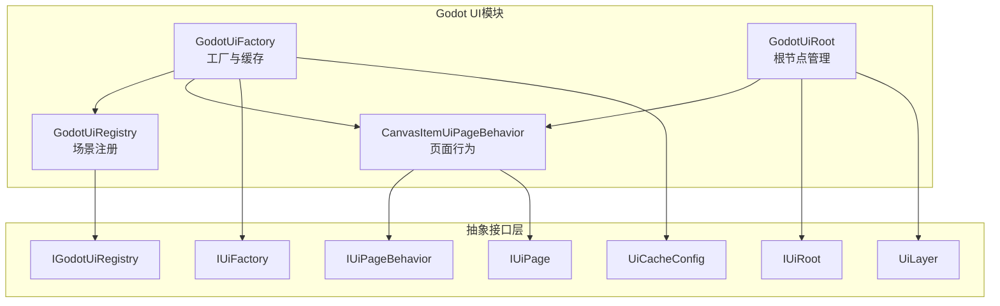
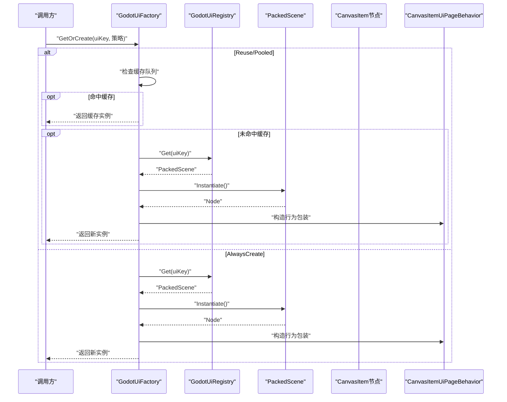
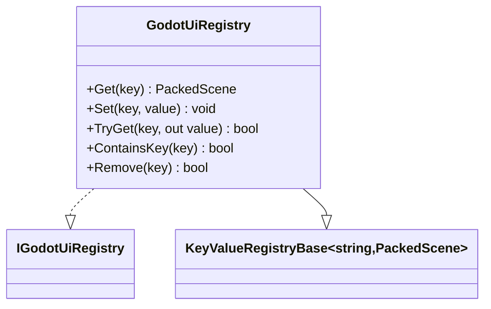
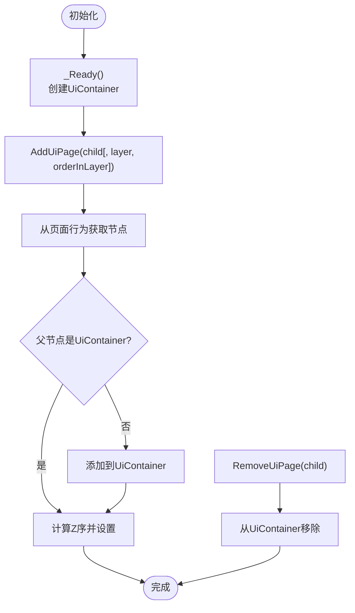
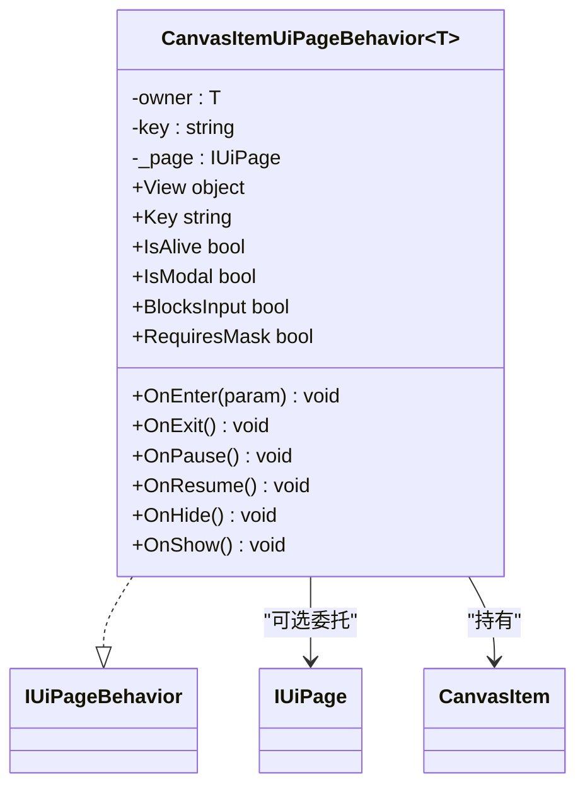
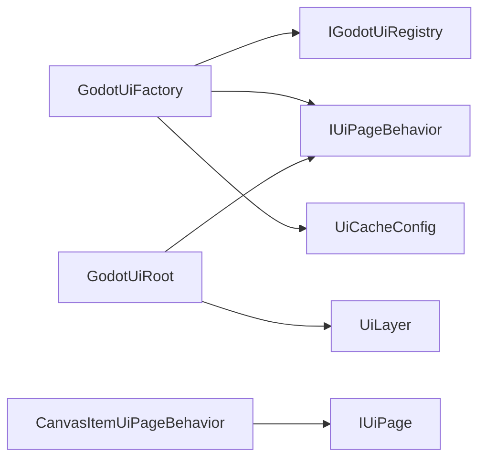

# Godot UI系统

<cite>
**本文引用的文件**
- [GodotUiFactory.cs](file://GFramework.Godot/ui/GodotUiFactory.cs)
- [GodotUiRegistry.cs](file://GFramework.Godot/ui/GodotUiRegistry.cs)
- [IGodotUiRegistry.cs](file://GFramework.Godot/ui/IGodotUiRegistry.cs)
- [GodotUiRoot.cs](file://GFramework.Godot/ui/GodotUiRoot.cs)
- [CanvasItemUiPageBehavior.cs](file://GFramework.Godot/ui/CanvasItemUiPageBehavior.cs)
- [IUiFactory.cs](file://GFramework.Game.Abstractions/ui/IUiFactory.cs)
- [IUiRoot.cs](file://GFramework.Game.Abstractions/ui/IUiRoot.cs)
- [IUiPageBehavior.cs](file://GFramework.Game.Abstractions/ui/IUiPageBehavior.cs)
- [IUiPage.cs](file://GFramework.Game.Abstractions/ui/IUiPage.cs)
- [UiLayer.cs](file://GFramework.Game.Abstractions/enums/UiLayer.cs)
- [UiCacheConfig.cs](file://GFramework.Game.Abstractions/ui/UiCacheConfig.cs)
</cite>

## 目录
1. [简介](#简介)
2. [项目结构](#项目结构)
3. [核心组件](#核心组件)
4. [架构总览](#架构总览)
5. [详细组件分析](#详细组件分析)
6. [依赖分析](#依赖分析)
7. [性能考虑](#性能考虑)
8. [故障排查指南](#故障排查指南)
9. [结论](#结论)
10. [附录](#附录)

## 简介
本指南面向希望在Godot引擎中构建高性能、可维护UI系统的开发者。文档围绕以下目标展开：
- 全面解析Godot UI系统的整体架构：UI工厂模式、注册机制、根节点管理。
- 深入讲解GodotUiFactory的UI对象创建流程：CanvasItem实例化、属性配置、生命周期管理与缓存策略。
- 说明GodotUiRegistry的UI注册与管理：UI页面注册、查找、缓存配置。
- 详解GodotUiRoot的根节点控制：场景树管理、层级控制、事件传递。
- 解释CanvasItemUiPageBehavior的页面行为管理：进入/退出、状态管理、动画与可见性控制。
- 提供最佳实践：性能优化、内存管理、事件处理与集成步骤。

## 项目结构
Godot UI系统位于GFramework.Godot模块中，采用分层与职责分离设计：
- UI工厂：负责UI页面实例的创建、缓存与回收。
- UI注册表：负责UI场景资源的注册与检索。
- UI根节点：负责场景树组织、层级与可见性管理。
- 页面行为：封装CanvasItem页面的生命周期与状态控制。



图表来源
- [GodotUiFactory.cs](file://GFramework.Godot/ui/GodotUiFactory.cs#L16-L463)
- [GodotUiRegistry.cs](file://GFramework.Godot/ui/GodotUiRegistry.cs#L11-L12)
- [IGodotUiRegistry.cs](file://GFramework.Godot/ui/IGodotUiRegistry.cs#L1-L10)
- [GodotUiRoot.cs](file://GFramework.Godot/ui/GodotUiRoot.cs#L11-L142)
- [CanvasItemUiPageBehavior.cs](file://GFramework.Godot/ui/CanvasItemUiPageBehavior.cs#L12-L113)
- [IUiFactory.cs](file://GFramework.Game.Abstractions/ui/IUiFactory.cs#L10-L87)
- [IUiRoot.cs](file://GFramework.Game.Abstractions/ui/IUiRoot.cs#L9-L43)
- [IUiPageBehavior.cs](file://GFramework.Game.Abstractions/ui/IUiPageBehavior.cs#L6-L72)
- [IUiPage.cs](file://GFramework.Game.Abstractions/ui/IUiPage.cs#L7-L39)
- [UiLayer.cs](file://GFramework.Game.Abstractions/enums/UiLayer.cs#L7-L34)
- [UiCacheConfig.cs](file://GFramework.Game.Abstractions/ui/UiCacheConfig.cs#L10-L62)

章节来源
- [GodotUiFactory.cs](file://GFramework.Godot/ui/GodotUiFactory.cs#L16-L463)
- [GodotUiRegistry.cs](file://GFramework.Godot/ui/GodotUiRegistry.cs#L11-L12)
- [IGodotUiRegistry.cs](file://GFramework.Godot/ui/IGodotUiRegistry.cs#L1-L10)
- [GodotUiRoot.cs](file://GFramework.Godot/ui/GodotUiRoot.cs#L11-L142)
- [CanvasItemUiPageBehavior.cs](file://GFramework.Godot/ui/CanvasItemUiPageBehavior.cs#L12-L113)
- [IUiFactory.cs](file://GFramework.Game.Abstractions/ui/IUiFactory.cs#L10-L87)
- [IUiRoot.cs](file://GFramework.Game.Abstractions/ui/IUiRoot.cs#L9-L43)
- [IUiPageBehavior.cs](file://GFramework.Game.Abstractions/ui/IUiPageBehavior.cs#L6-L72)
- [IUiPage.cs](file://GFramework.Game.Abstractions/ui/IUiPage.cs#L7-L39)
- [UiLayer.cs](file://GFramework.Game.Abstractions/enums/UiLayer.cs#L7-L34)
- [UiCacheConfig.cs](file://GFramework.Game.Abstractions/ui/UiCacheConfig.cs#L10-L62)

## 核心组件
- GodotUiFactory：实现IUiFactory，负责UI页面实例的创建、缓存、预加载、回收与统计；支持多种实例策略（AlwaysCreate、Reuse、Pooled）与缓存淘汰策略（LRU/LFU）。
- GodotUiRegistry：实现IGodotUiRegistry，基于键值对注册与管理PackedScene资源。
- GodotUiRoot：实现IUiRoot，负责UI场景树的容器节点创建、页面添加/移除、层级Z序设置与可见页面查询。
- CanvasItemUiPageBehavior：实现IUiPageBehavior，封装CanvasItem页面的生命周期（进入、退出、暂停、恢复、显示、隐藏）、状态标志（模态、遮罩、阻断输入）与Godot节点处理（进程开关、可见性）。

章节来源
- [GodotUiFactory.cs](file://GFramework.Godot/ui/GodotUiFactory.cs#L16-L463)
- [GodotUiRegistry.cs](file://GFramework.Godot/ui/GodotUiRegistry.cs#L11-L12)
- [IGodotUiRegistry.cs](file://GFramework.Godot/ui/IGodotUiRegistry.cs#L1-L10)
- [GodotUiRoot.cs](file://GFramework.Godot/ui/GodotUiRoot.cs#L11-L142)
- [CanvasItemUiPageBehavior.cs](file://GFramework.Godot/ui/CanvasItemUiPageBehavior.cs#L12-L113)
- [IUiFactory.cs](file://GFramework.Game.Abstractions/ui/IUiFactory.cs#L10-L87)
- [IUiRoot.cs](file://GFramework.Game.Abstractions/ui/IUiRoot.cs#L9-L43)
- [IUiPageBehavior.cs](file://GFramework.Game.Abstractions/ui/IUiPageBehavior.cs#L6-L72)
- [IUiPage.cs](file://GFramework.Game.Abstractions/ui/IUiPage.cs#L7-L39)
- [UiLayer.cs](file://GFramework.Game.Abstractions/enums/UiLayer.cs#L7-L34)
- [UiCacheConfig.cs](file://GFramework.Game.Abstractions/ui/UiCacheConfig.cs#L10-L62)

## 架构总览
系统采用“工厂+注册表+根节点+行为”的分层架构：
- 工厂通过注册表获取场景资源，实例化CanvasItem节点，并包装为页面行为。
- 根节点统一管理场景树与层级，确保渲染顺序与交互顺序正确。
- 页面行为负责生命周期与状态，协调Godot节点的显示、暂停、输入处理等。



图表来源
- [GodotUiFactory.cs](file://GFramework.Godot/ui/GodotUiFactory.cs#L67-L97)
- [GodotUiRegistry.cs](file://GFramework.Godot/ui/GodotUiRegistry.cs#L11-L12)
- [CanvasItemUiPageBehavior.cs](file://GFramework.Godot/ui/CanvasItemUiPageBehavior.cs#L12-L28)

## 详细组件分析

### GodotUiFactory：UI工厂与缓存
- 职责
  - 实例创建：根据uiKey从注册表获取场景并实例化，包装为IUiPageBehavior。
  - 缓存策略：支持Reuse（复用缓存）、Pooled（池化预加载）、AlwaysCreate（每次都新建）。
  - 预加载与回收：批量预热缓存，回收时隐藏并更新统计与访问追踪。
  - 淘汰策略：LRU按最后访问时间淘汰，LFU按访问频次淘汰。
  - 统计与配置：缓存大小、命中率、最后访问时间；最大缓存数、淘汰策略、访问后过期。
- 关键数据结构
  - 缓存队列：按uiKey分组的实例队列。
  - 访问追踪：LRU时间队列与LFU访问计数。
  - 实例追踪：用于统一清理。
- 生命周期
  - OnEnter：触发页面生命周期回调（若存在）。
  - OnExit：触发页面生命周期回调并释放节点。
  - OnPause/OnResume：控制节点的处理、物理与输入处理开关。
  - OnHide/OnShow：隐藏/显示节点并恢复处理。

```mermaid
classDiagram
class GodotUiFactory {
-_registry : IGodotUiRegistry
-_cachedInstances : Dictionary<string, Queue<IUiPageBehavior>>
-_allInstances : Dictionary<string, HashSet<IUiPageBehavior>>
-_cacheConfigs : Dictionary<string, UiCacheConfig>
-_cacheStatistics : Dictionary<string, CacheStatisticsInfo>
-_accessTimeQueue : Dictionary<string, List<(IUiPageBehavior, DateTime)>>
-_accessCount : Dictionary<IUiPageBehavior, int>
+GetOrCreate(uiKey, policy) IUiPageBehavior
+Create(uiKey) IUiPageBehavior
+Preload(uiKey, count) void
+PreloadBatch(uiKeys) void
+Recycle(page) void
+ClearCache(uiKey) void
+ClearAllCache() void
+HasCached(uiKey) bool
+GetCacheConfig(uiKey) UiCacheConfig
+SetCacheConfig(uiKey, config) void
+RemoveCacheConfig(uiKey) void
+GetCacheStatistics() IDictionary<string, IUiCacheStatistics>
-GetCachedOrCreate(uiKey) IUiPageBehavior
-GetFromPoolOrCreate(uiKey) IUiPageBehavior
-DestroyInstance(page) void
-UpdateStatisticsOnRecycle(uiKey) void
-UpdateStatisticsOnHit(uiKey) void
-UpdateStatisticsOnMiss(uiKey) void
-UpdateAccessTracking(uiKey, instance) void
-CheckAndEvict(uiKey) void
-EvictLru(uiKey) void
-EvictLfu(uiKey) void
}
class IUiFactory
class IGodotUiRegistry
class UiCacheConfig
class IUiPageBehavior
GodotUiFactory ..|> IUiFactory
GodotUiFactory --> IGodotUiRegistry : "依赖"
GodotUiFactory --> UiCacheConfig : "配置"
GodotUiFactory --> IUiPageBehavior : "创建/回收"
```

图表来源
- [GodotUiFactory.cs](file://GFramework.Godot/ui/GodotUiFactory.cs#L16-L463)
- [IUiFactory.cs](file://GFramework.Game.Abstractions/ui/IUiFactory.cs#L10-L87)
- [IGodotUiRegistry.cs](file://GFramework.Godot/ui/IGodotUiRegistry.cs#L1-L10)
- [UiCacheConfig.cs](file://GFramework.Game.Abstractions/ui/UiCacheConfig.cs#L10-L62)
- [IUiPageBehavior.cs](file://GFramework.Game.Abstractions/ui/IUiPageBehavior.cs#L6-L72)

章节来源
- [GodotUiFactory.cs](file://GFramework.Godot/ui/GodotUiFactory.cs#L67-L463)
- [IUiFactory.cs](file://GFramework.Game.Abstractions/ui/IUiFactory.cs#L10-L87)
- [UiCacheConfig.cs](file://GFramework.Game.Abstractions/ui/UiCacheConfig.cs#L10-L62)

### GodotUiRegistry：UI注册与管理
- 职责
  - 基于键值对注册与管理PackedScene资源，提供Get(uiKey)获取场景。
- 设计
  - 继承KeyValueRegistryBase<string, PackedScene>，使用字符串键与PackedScene值。
  - 实现IGodotUiRegistry接口，作为GodotUiFactory的依赖。



图表来源
- [GodotUiRegistry.cs](file://GFramework.Godot/ui/GodotUiRegistry.cs#L11-L12)
- [IGodotUiRegistry.cs](file://GFramework.Godot/ui/IGodotUiRegistry.cs#L1-L10)

章节来源
- [GodotUiRegistry.cs](file://GFramework.Godot/ui/GodotUiRegistry.cs#L11-L12)
- [IGodotUiRegistry.cs](file://GFramework.Godot/ui/IGodotUiRegistry.cs#L1-L10)

### GodotUiRoot：UI根节点控制
- 职责
  - 创建UiContainer作为UI根节点的子节点。
  - 添加/移除UI页面，设置Z序以控制渲染层级。
  - 查询当前可见页面。
- 层级映射
  - 默认UiLayer到Z序映射：Page=0、Overlay=100、Modal=200、Toast=300、Topmost=400。
- 交互
  - 通过IUiPageBehavior.View获取CanvasItem节点并设置ZIndex。



图表来源
- [GodotUiRoot.cs](file://GFramework.Godot/ui/GodotUiRoot.cs#L45-L141)
- [IUiRoot.cs](file://GFramework.Game.Abstractions/ui/IUiRoot.cs#L9-L43)
- [UiLayer.cs](file://GFramework.Game.Abstractions/enums/UiLayer.cs#L7-L34)

章节来源
- [GodotUiRoot.cs](file://GFramework.Godot/ui/GodotUiRoot.cs#L11-L142)
- [IUiRoot.cs](file://GFramework.Game.Abstractions/ui/IUiRoot.cs#L9-L43)
- [UiLayer.cs](file://GFramework.Game.Abstractions/enums/UiLayer.cs#L7-L34)

### CanvasItemUiPageBehavior：页面行为管理
- 职责
  - 封装CanvasItem节点的生命周期与状态：进入、退出、暂停、恢复、显示、隐藏。
  - 控制节点的处理开关（process/physics_process/input）。
  - 管理模态、遮罩与输入阻断标志。
- 关键点
  - OnExit：调用页面生命周期回调并释放节点。
  - OnShow：显示节点并恢复处理。
  - OnHide：隐藏节点并调用页面生命周期回调。



图表来源
- [CanvasItemUiPageBehavior.cs](file://GFramework.Godot/ui/CanvasItemUiPageBehavior.cs#L12-L113)
- [IUiPageBehavior.cs](file://GFramework.Game.Abstractions/ui/IUiPageBehavior.cs#L6-L72)
- [IUiPage.cs](file://GFramework.Game.Abstractions/ui/IUiPage.cs#L7-L39)

章节来源
- [CanvasItemUiPageBehavior.cs](file://GFramework.Godot/ui/CanvasItemUiPageBehavior.cs#L12-L113)
- [IUiPageBehavior.cs](file://GFramework.Game.Abstractions/ui/IUiPageBehavior.cs#L6-L72)
- [IUiPage.cs](file://GFramework.Game.Abstractions/ui/IUiPage.cs#L7-L39)

## 依赖分析
- 组件耦合
  - GodotUiFactory依赖IGodotUiRegistry与IUiPageBehavior，通过场景键管理实例生命周期。
  - GodotUiRoot依赖IUiPageBehavior.View（CanvasItem）进行层级控制。
  - CanvasItemUiPageBehavior依赖IUiPage（可选）以转发生命周期事件。
- 外部依赖
  - Godot引擎的PackedScene与CanvasItem节点模型。
  - GFramework核心扩展（如节点释放辅助）。



图表来源
- [GodotUiFactory.cs](file://GFramework.Godot/ui/GodotUiFactory.cs#L32-L96)
- [GodotUiRoot.cs](file://GFramework.Godot/ui/GodotUiRoot.cs#L16-L118)
- [CanvasItemUiPageBehavior.cs](file://GFramework.Godot/ui/CanvasItemUiPageBehavior.cs#L15-L96)
- [UiLayer.cs](file://GFramework.Game.Abstractions/enums/UiLayer.cs#L7-L34)
- [UiCacheConfig.cs](file://GFramework.Game.Abstractions/ui/UiCacheConfig.cs#L10-L62)

章节来源
- [GodotUiFactory.cs](file://GFramework.Godot/ui/GodotUiFactory.cs#L32-L96)
- [GodotUiRoot.cs](file://GFramework.Godot/ui/GodotUiRoot.cs#L16-L118)
- [CanvasItemUiPageBehavior.cs](file://GFramework.Godot/ui/CanvasItemUiPageBehavior.cs#L15-L96)
- [UiLayer.cs](file://GFramework.Game.Abstractions/enums/UiLayer.cs#L7-L34)
- [UiCacheConfig.cs](file://GFramework.Game.Abstractions/ui/UiCacheConfig.cs#L10-L62)

## 性能考虑
- 实例策略选择
  - Reuse：适合频繁切换的页面，降低GC压力。
  - Pooled：池化预热，避免首帧卡顿。
  - AlwaysCreate：适合一次性页面或状态复杂需隔离的页面。
- 缓存配置
  - 合理设置MaxCacheSize与EvictionPolicy（LRU/LFU），结合ExpireAfterAccess减少常驻内存。
  - 使用GetCacheStatistics监控命中率，指导容量调整。
- 节点生命周期
  - OnPause/OnResume精准控制process/physics_process/input，避免无用更新。
  - OnExit及时释放节点，防止内存泄漏。
- 场景树管理
  - 通过Z序控制渲染顺序，避免不必要的重绘。
  - 批量预加载与延迟回收，平衡内存与CPU。

## 故障排查指南
- 常见问题与定位
  - “页面节点为空”：确认IUiPageBehavior.View为CanvasItem且已正确实例化。
  - “层级无效”：检查UiLayer映射与Z序计算，确保未越界。
  - “缓存未命中”：检查UiInstancePolicy与缓存配置，查看统计信息。
  - “内存泄漏”：确认OnExit路径是否调用节点释放，以及实例追踪集合是否清理。
- 日志与统计
  - 工厂日志记录创建、回收、预加载与淘汰过程，便于定位异常。
  - 缓存统计包含命中/未命中计数、命中率与最后访问时间。

章节来源
- [GodotUiFactory.cs](file://GFramework.Godot/ui/GodotUiFactory.cs#L95-L157)
- [GodotUiRoot.cs](file://GFramework.Godot/ui/GodotUiRoot.cs#L61-L118)
- [CanvasItemUiPageBehavior.cs](file://GFramework.Godot/ui/CanvasItemUiPageBehavior.cs#L50-L96)

## 结论
Godot UI系统通过清晰的职责划分与可配置的缓存策略，实现了高效、可控的UI生命周期管理。结合根节点的层级控制与页面行为的状态机式管理，能够满足从简单页面到复杂模态交互的多样化需求。建议在实际项目中：
- 明确页面类型与实例策略，合理配置缓存。
- 严格遵循生命周期回调，避免资源泄漏。
- 利用Z序与遮罩策略保证交互一致性与视觉层次。

## 附录

### 集成步骤（概览）
- 注册场景资源
  - 使用GodotUiRegistry注册PackedScene，键为uiKey。
- 创建UI工厂
  - 在架构上下文中注入GodotUiFactory与GodotUiRegistry。
- 构建根节点
  - 在场景中挂载GodotUiRoot，确保其作为UI容器的根。
- 使用页面行为
  - 通过GodotUiFactory.GetOrCreate(uiKey, 策略)获取页面行为，再由GodotUiRoot.AddUiPage(child, layer, orderInLayer)加入场景树。
- 生命周期管理
  - 在页面逻辑中实现IUiPage接口（可选），以便CanvasItemUiPageBehavior转发生命周期事件。

章节来源
- [GodotUiRegistry.cs](file://GFramework.Godot/ui/GodotUiRegistry.cs#L11-L12)
- [GodotUiFactory.cs](file://GFramework.Godot/ui/GodotUiFactory.cs#L67-L97)
- [GodotUiRoot.cs](file://GFramework.Godot/ui/GodotUiRoot.cs#L59-L89)
- [CanvasItemUiPageBehavior.cs](file://GFramework.Godot/ui/CanvasItemUiPageBehavior.cs#L39-L96)