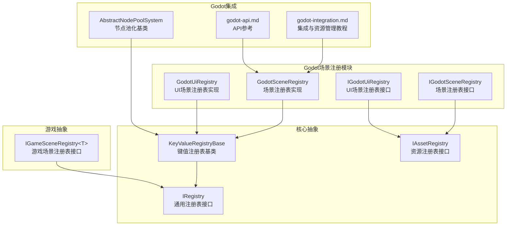
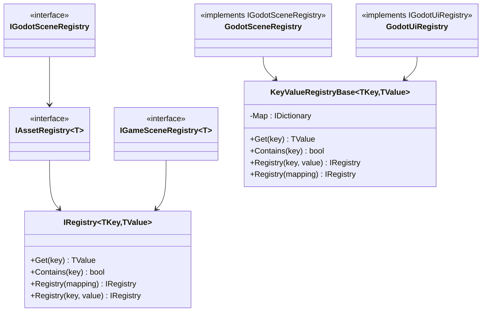
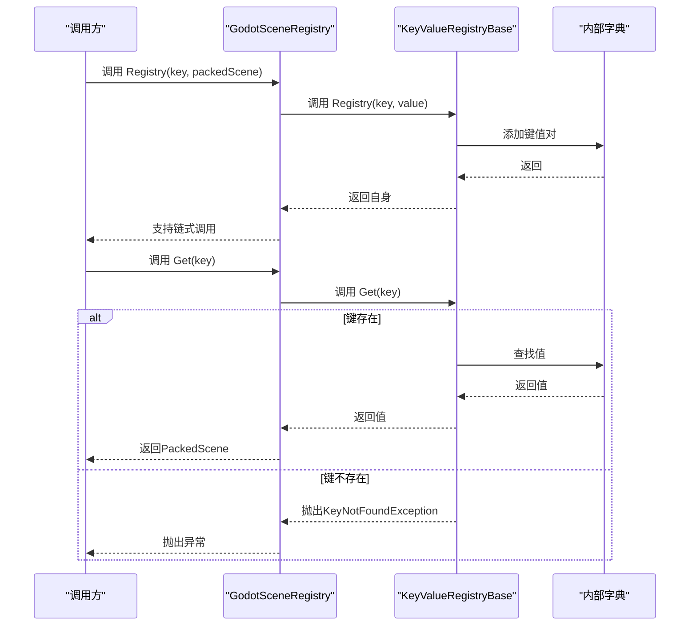
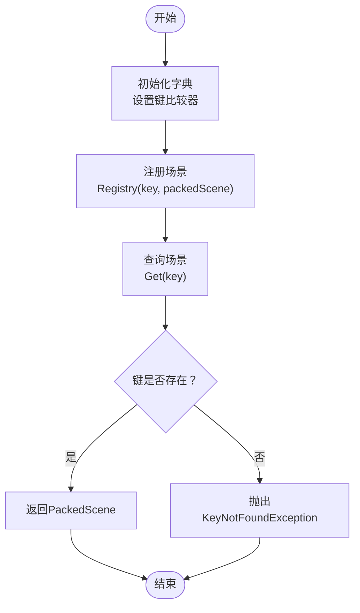
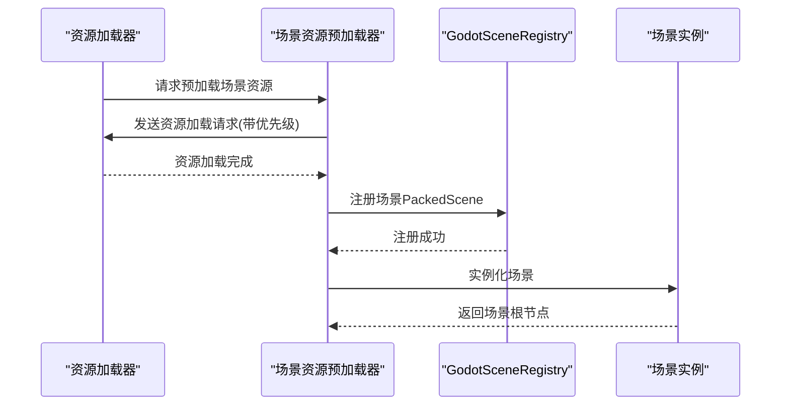
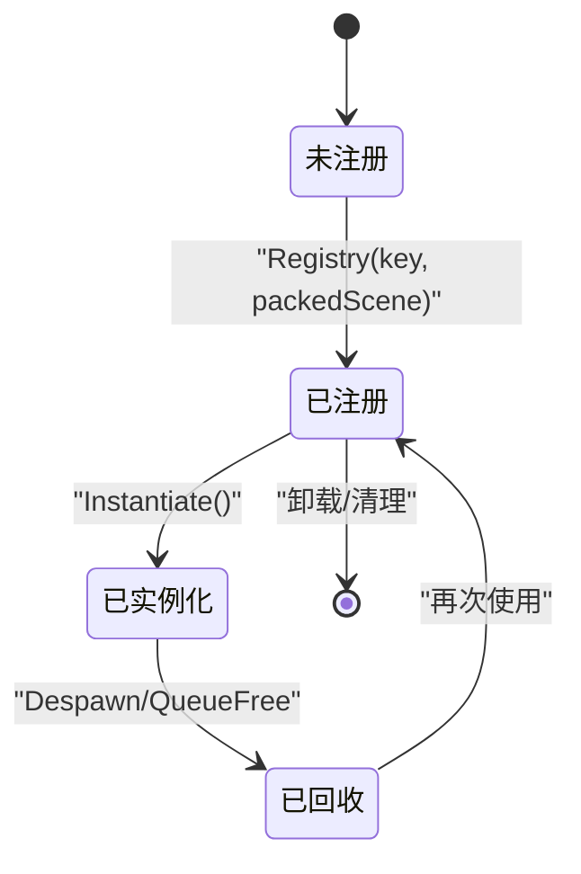
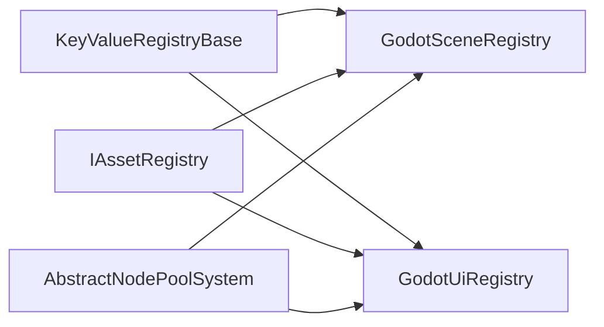

# Godot场景注册

<cite>
**本文档引用的文件**
- [GodotSceneRegistry.cs](file://GFramework.Godot/scene/GodotSceneRegistry.cs)
- [IGodotSceneRegistry.cs](file://GFramework.Godot/scene/IGodotSceneRegistry.cs)
- [IGameSceneRegistry.cs](file://GFramework.Game.Abstractions/scene/IGameSceneRegistry.cs)
- [KeyValueRegistryBase.cs](file://GFramework.Core.Abstractions/registries/KeyValueRegistryBase.cs)
- [IRegistry.cs](file://GFramework.Core.Abstractions/registries/IRegistry.cs)
- [IAssetRegistry.cs](file://GFramework.Game.Abstractions/ui/IAssetRegistry.cs)
- [GodotUiRegistry.cs](file://GFramework.Godot/ui/GodotUiRegistry.cs)
- [IGodotUiRegistry.cs](file://GFramework.Godot/ui/IGodotUiRegistry.cs)
- [AbstractNodePoolSystem.cs](file://GFramework.Godot/pool/AbstractNodePoolSystem.cs)
- [godot-integration.md](file://docs/tutorials/godot-integration.md)
- [godot-api.md](file://docs/api-reference/godot-api.md)
</cite>

## 目录
1. [简介](#简介)
2. [项目结构](#项目结构)
3. [核心组件](#核心组件)
4. [架构总览](#架构总览)
5. [详细组件分析](#详细组件分析)
6. [依赖关系分析](#依赖关系分析)
7. [性能考量](#性能考量)
8. [故障排查指南](#故障排查指南)
9. [结论](#结论)
10. [附录](#附录)

## 简介
本指南围绕Godot场景注册系统展开，目标是帮助开发者理解GodotSceneRegistry的设计目的、核心功能与最佳实践。文档将从系统架构、数据结构、加载与卸载流程、异步处理机制、生命周期管理、性能优化、使用示例与集成方式等方面进行全面阐述，使读者能够在Godot游戏架构中正确、高效地使用场景注册系统。

## 项目结构
Godot场景注册系统位于GFramework.Godot模块中，采用接口-实现分层设计，并通过核心抽象注册表基类提供通用的键值注册能力。同时，文档提供了Godot集成与资源管理相关的参考内容，便于在实际项目中落地。

**图表来源**
- [GodotSceneRegistry.cs](file://GFramework.Godot/scene/GodotSceneRegistry.cs#L1-L12)
- [IGodotSceneRegistry.cs](file://GFramework.Godot/scene/IGodotSceneRegistry.cs#L1-L9)
- [GodotUiRegistry.cs](file://GFramework.Godot/ui/GodotUiRegistry.cs#L1-L12)
- [IGodotUiRegistry.cs](file://GFramework.Godot/ui/IGodotUiRegistry.cs#L1-L10)
- [KeyValueRegistryBase.cs](file://GFramework.Core.Abstractions/registries/KeyValueRegistryBase.cs#L1-L69)
- [IRegistry.cs](file://GFramework.Core.Abstractions/registries/IRegistry.cs#L1-L38)
- [IAssetRegistry.cs](file://GFramework.Game.Abstractions/ui/IAssetRegistry.cs#L1-L10)
- [IGameSceneRegistry.cs](file://GFramework.Game.Abstractions/scene/IGameSceneRegistry.cs#L1-L9)
- [AbstractNodePoolSystem.cs](file://GFramework.Godot/pool/AbstractNodePoolSystem.cs#L1-L32)
- [godot-integration.md](file://docs/tutorials/godot-integration.md#L1-L800)
- [godot-api.md](file://docs/api-reference/godot-api.md#L1-L800)

**章节来源**
- [GodotSceneRegistry.cs](file://GFramework.Godot/scene/GodotSceneRegistry.cs#L1-L12)
- [KeyValueRegistryBase.cs](file://GFramework.Core.Abstractions/registries/KeyValueRegistryBase.cs#L1-L69)
- [IAssetRegistry.cs](file://GFramework.Game.Abstractions/ui/IAssetRegistry.cs#L1-L10)
- [godot-integration.md](file://docs/tutorials/godot-integration.md#L1-L800)

## 核心组件
- GodotSceneRegistry：面向Godot场景的注册表实现，以字符串为键、PackedScene为值，继承通用键值注册表基类，实现场景资源的注册与访问。
- IGodotSceneRegistry：Godot场景注册表接口，基于资源注册表接口，约束场景资源类型为PackedScene。
- KeyValueRegistryBase：通用键值注册表基类，提供Get、Contains、Registry等通用能力，内部使用字典存储键值映射。
- IRegistry：通用注册表接口，定义键值注册表的基本契约。
- IAssetRegistry：资源注册表接口，扩展通用注册表，强调资源类型T的注册与查找。
- IGameSceneRegistry<T>：游戏场景注册表接口，泛型约束场景类型T，用于更广泛的场景管理抽象。
- GodotUiRegistry与IGodotUiRegistry：UI场景注册表的Godot实现与接口，与场景注册表保持一致的架构思路。
- AbstractNodePoolSystem：节点池化基类，展示如何通过PackedScene进行实例化，体现场景注册与实例化的结合。

**章节来源**
- [GodotSceneRegistry.cs](file://GFramework.Godot/scene/GodotSceneRegistry.cs#L1-L12)
- [IGodotSceneRegistry.cs](file://GFramework.Godot/scene/IGodotSceneRegistry.cs#L1-L9)
- [KeyValueRegistryBase.cs](file://GFramework.Core.Abstractions/registries/KeyValueRegistryBase.cs#L1-L69)
- [IRegistry.cs](file://GFramework.Core.Abstractions/registries/IRegistry.cs#L1-L38)
- [IAssetRegistry.cs](file://GFramework.Game.Abstractions/ui/IAssetRegistry.cs#L1-L10)
- [IGameSceneRegistry.cs](file://GFramework.Game.Abstractions/scene/IGameSceneRegistry.cs#L1-L9)
- [GodotUiRegistry.cs](file://GFramework.Godot/ui/GodotUiRegistry.cs#L1-L12)
- [IGodotUiRegistry.cs](file://GFramework.Godot/ui/IGodotUiRegistry.cs#L1-L10)
- [AbstractNodePoolSystem.cs](file://GFramework.Godot/pool/AbstractNodePoolSystem.cs#L1-L32)

## 架构总览
Godot场景注册系统采用“接口约束 + 抽象基类 + 具体实现”的分层设计：
- 接口层：定义场景注册表与资源注册表的契约，确保跨模块的一致性。
- 抽象层：提供通用的键值注册能力，统一注册、查询与存在性判断。
- 实现层：针对Godot的PackedScene类型提供具体注册表实现，并与UI场景注册表形成互补。
- 集成层：结合Godot集成教程与API参考，指导资源预加载、异步加载与池化等实践。

**图表来源**
- [IRegistry.cs](file://GFramework.Core.Abstractions/registries/IRegistry.cs#L1-L38)
- [IAssetRegistry.cs](file://GFramework.Game.Abstractions/ui/IAssetRegistry.cs#L1-L10)
- [IGodotSceneRegistry.cs](file://GFramework.Godot/scene/IGodotSceneRegistry.cs#L1-L9)
- [IGameSceneRegistry.cs](file://GFramework.Game.Abstractions/scene/IGameSceneRegistry.cs#L1-L9)
- [KeyValueRegistryBase.cs](file://GFramework.Core.Abstractions/registries/KeyValueRegistryBase.cs#L1-L69)
- [GodotSceneRegistry.cs](file://GFramework.Godot/scene/GodotSceneRegistry.cs#L1-L12)
- [GodotUiRegistry.cs](file://GFramework.Godot/ui/GodotUiRegistry.cs#L1-L12)

## 详细组件分析

### GodotSceneRegistry组件分析
GodotSceneRegistry是场景注册表的具体实现，继承自KeyValueRegistryBase，键为字符串，值为PackedScene，实现IGodotSceneRegistry接口。其核心职责包括：
- 场景资源注册：通过Registry方法将场景路径映射到PackedScene实例。
- 场景资源查询：通过Get方法按键获取对应场景，若键不存在则抛出异常。
- 存在性检查：通过Contains方法判断场景是否已注册。
- 与UI场景注册表的协同：GodotUiRegistry提供UI场景的注册能力，两者共享相同的键值注册模式。

**图表来源**
- [GodotSceneRegistry.cs](file://GFramework.Godot/scene/GodotSceneRegistry.cs#L1-L12)
- [KeyValueRegistryBase.cs](file://GFramework.Core.Abstractions/registries/KeyValueRegistryBase.cs#L31-L69)

**章节来源**
- [GodotSceneRegistry.cs](file://GFramework.Godot/scene/GodotSceneRegistry.cs#L1-L12)
- [KeyValueRegistryBase.cs](file://GFramework.Core.Abstractions/registries/KeyValueRegistryBase.cs#L1-L69)

### 场景注册表的数据结构与存储机制
- 数据结构：内部使用字典存储键值映射，键为字符串（通常为场景路径），值为PackedScene。
- 存储策略：注册时直接添加到字典；查询时通过TryGetValue获取；不存在时抛出KeyNotFoundException。
- 比较器：构造时传入字符串比较器，保证键的比较行为符合预期。
- 与UI注册表的关系：GodotUiRegistry采用相同的数据结构与存储策略，便于统一管理UI与场景资源。

**图表来源**
- [KeyValueRegistryBase.cs](file://GFramework.Core.Abstractions/registries/KeyValueRegistryBase.cs#L16-L69)
- [GodotUiRegistry.cs](file://GFramework.Godot/ui/GodotUiRegistry.cs#L1-L12)

**章节来源**
- [KeyValueRegistryBase.cs](file://GFramework.Core.Abstractions/registries/KeyValueRegistryBase.cs#L1-L69)
- [GodotUiRegistry.cs](file://GFramework.Godot/ui/GodotUiRegistry.cs#L1-L12)

### 场景加载的异步处理机制
虽然GodotSceneRegistry本身仅负责注册与查询，但Godot集成教程与API参考提供了资源预加载与异步加载的实践建议：
- 资源预加载策略：在切换场景前，预先加载场景所需的关键资源，减少首帧卡顿。
- 基于优先级的资源加载：区分必需、高、普通、低、后台等优先级，合理安排加载顺序。
- 异步加载：利用Godot的异步加载能力，在后台线程加载资源，完成后通知注册表或系统进行实例化。
- 与场景注册表的配合：先将PackedScene注册到GodotSceneRegistry，再进行实例化，确保后续快速获取。

**图表来源**
- [godot-integration.md](file://docs/tutorials/godot-integration.md#L697-L794)
- [godot-api.md](file://docs/api-reference/godot-api.md#L636-L714)
- [GodotSceneRegistry.cs](file://GFramework.Godot/scene/GodotSceneRegistry.cs#L1-L12)

**章节来源**
- [godot-integration.md](file://docs/tutorials/godot-integration.md#L697-L794)
- [godot-api.md](file://docs/api-reference/godot-api.md#L636-L714)

### 生命周期管理与实例缓存策略
- 注册阶段：在架构初始化或模块安装时，将常用场景注册到GodotSceneRegistry。
- 查询阶段：运行时通过Get(key)获取PackedScene，避免重复加载。
- 实例化阶段：通过PackedScene.Instantiate创建场景实例，结合节点池化系统进行复用。
- 卸载阶段：场景不再使用时，通过节点池回收或手动释放，减少内存占用。

**图表来源**
- [AbstractNodePoolSystem.cs](file://GFramework.Godot/pool/AbstractNodePoolSystem.cs#L1-L32)
- [GodotSceneRegistry.cs](file://GFramework.Godot/scene/GodotSceneRegistry.cs#L1-L12)

**章节来源**
- [AbstractNodePoolSystem.cs](file://GFramework.Godot/pool/AbstractNodePoolSystem.cs#L1-L32)

## 依赖关系分析
Godot场景注册系统与其他模块的耦合度较低，主要通过接口与抽象基类进行解耦：
- 与核心注册表基类：GodotSceneRegistry继承KeyValueRegistryBase，获得通用的注册与查询能力。
- 与资源注册表接口：IGodotSceneRegistry继承IAssetRegistry<PackedScene>，统一资源注册表契约。
- 与UI注册表：GodotUiRegistry与GodotSceneRegistry共享相同的数据结构与存储策略，便于统一管理。
- 与池化系统：AbstractNodePoolSystem通过PackedScene进行实例化，体现注册与实例化的结合。

**图表来源**
- [KeyValueRegistryBase.cs](file://GFramework.Core.Abstractions/registries/KeyValueRegistryBase.cs#L1-L69)
- [GodotSceneRegistry.cs](file://GFramework.Godot/scene/GodotSceneRegistry.cs#L1-L12)
- [GodotUiRegistry.cs](file://GFramework.Godot/ui/GodotUiRegistry.cs#L1-L12)
- [IAssetRegistry.cs](file://GFramework.Game.Abstractions/ui/IAssetRegistry.cs#L1-L10)
- [AbstractNodePoolSystem.cs](file://GFramework.Godot/pool/AbstractNodePoolSystem.cs#L1-L32)

**章节来源**
- [KeyValueRegistryBase.cs](file://GFramework.Core.Abstractions/registries/KeyValueRegistryBase.cs#L1-L69)
- [IAssetRegistry.cs](file://GFramework.Game.Abstractions/ui/IAssetRegistry.cs#L1-L10)
- [AbstractNodePoolSystem.cs](file://GFramework.Godot/pool/AbstractNodePoolSystem.cs#L1-L32)

## 性能考量
- 字典查找复杂度：O(1)平均情况，适合高频查询场景。
- 内存占用：PackedScene实例化后会占用内存，应结合池化与及时回收降低峰值内存。
- 预加载策略：提前加载关键资源，减少运行时阻塞。
- 异步加载：利用异步能力在后台加载资源，提升用户体验。
- 路径与命名：统一的场景路径与命名规范有助于减少拼写错误与查找失败。

[本节为通用性能建议，无需特定文件来源]

## 故障排查指南
- 键不存在异常：当调用Get(key)时若键未注册，将抛出KeyNotFoundException。排查要点：确认注册流程是否执行、键是否拼写正确、注册时机是否早于查询。
- 场景实例化问题：若场景无法实例化，检查PackedScene是否有效、场景内依赖资源是否已加载。
- 资源加载失败：结合资源加载教程，检查资源路径、优先级配置与异步加载回调。
- 池化回收异常：若节点未正确回收，检查池化系统中的回收条件与父节点移除逻辑。

**章节来源**
- [KeyValueRegistryBase.cs](file://GFramework.Core.Abstractions/registries/KeyValueRegistryBase.cs#L31-L69)
- [godot-integration.md](file://docs/tutorials/godot-integration.md#L520-L794)

## 结论
Godot场景注册系统通过接口约束与抽象基类，提供了简洁而强大的场景资源注册与查询能力。结合资源预加载、异步加载与节点池化实践，可在Godot游戏中实现高性能、可维护的场景管理方案。建议在项目中统一场景路径与命名规范，建立完善的注册与回收机制，以获得稳定的运行表现。

[本节为总结性内容，无需特定文件来源]

## 附录

### 最佳实践
- 命名规范：使用清晰、稳定的场景键（如“GameLevel_Main”），避免硬编码路径。
- 路径组织：将场景文件按功能模块组织，便于维护与查找。
- 性能考虑：优先使用预加载与异步加载，结合池化减少实例化开销。
- 生命周期：明确注册、实例化、回收与卸载的生命周期节点，避免内存泄漏。

**章节来源**
- [godot-integration.md](file://docs/tutorials/godot-integration.md#L1-L800)

### 使用示例与集成指南
- 场景注册：在模块安装或架构初始化时，将场景注册到GodotSceneRegistry。
- 场景加载：通过Get(key)获取PackedScene，再进行实例化。
- 资源预加载：参考集成教程中的资源预加载策略，提前加载场景所需资源。
- 池化复用：结合节点池化系统，对频繁使用的场景节点进行池化管理。

**章节来源**
- [GodotSceneRegistry.cs](file://GFramework.Godot/scene/GodotSceneRegistry.cs#L1-L12)
- [godot-integration.md](file://docs/tutorials/godot-integration.md#L697-L794)
- [godot-api.md](file://docs/api-reference/godot-api.md#L636-L714)