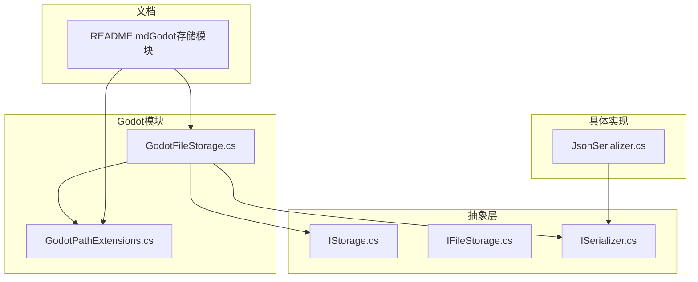
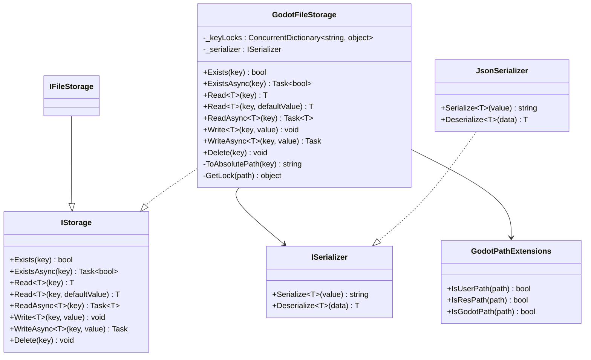
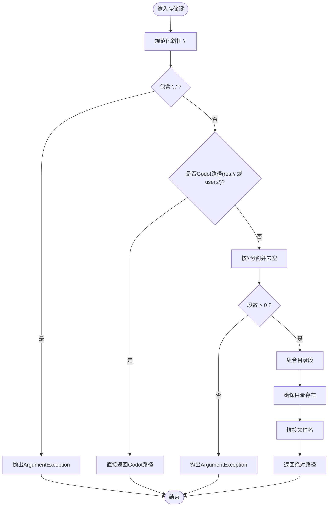
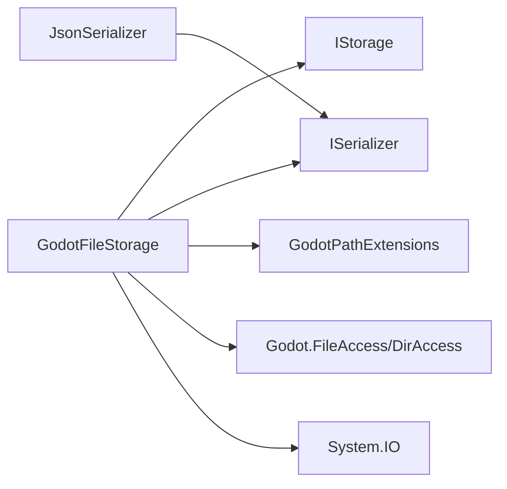

# Godot文件存储

<cite>
**本文引用的文件**
- [GodotFileStorage.cs](file://GFramework.Godot/storage/GodotFileStorage.cs)
- [GodotPathExtensions.cs](file://GFramework.Godot/extensions/GodotPathExtensions.cs)
- [IStorage.cs](file://GFramework.Core.Abstractions/storage/IStorage.cs)
- [IFileStorage.cs](file://GFramework.Game.Abstractions/storage/IFileStorage.cs)
- [ISerializer.cs](file://GFramework.Game.Abstractions/serializer/ISerializer.cs)
- [JsonSerializer.cs](file://GFramework.Game/serializer/JsonSerializer.cs)
- [README.md（Godot存储模块）](file://GFramework.Godot/storage/README.md)
</cite>

## 目录
1. [简介](#简介)
2. [项目结构](#项目结构)
3. [核心组件](#核心组件)
4. [架构总览](#架构总览)
5. [详细组件分析](#详细组件分析)
6. [依赖关系分析](#依赖关系分析)
7. [性能考量](#性能考量)
8. [故障排查指南](#故障排查指南)
9. [结论](#结论)
10. [附录](#附录)

## 简介
本指南围绕Godot引擎的文件存储系统，聚焦GodotFileStorage类的设计与实现，系统阐述其对res://、user://虚拟路径与普通文件系统路径的支持机制；详解基于key的细粒度锁与ConcurrentDictionary的线程安全策略；深入解析Delete、Exists、Read、Write等核心方法的实现逻辑及异步版本的适用场景；说明路径处理的安全机制（路径验证、非法字符清理、相对路径限制）；并提供完整的API使用示例、错误处理、性能优化建议与最佳实践，以及与ISerializer接口的集成方式与序列化策略。

## 项目结构
Godot文件存储位于GFramework.Godot模块中，核心实现为GodotFileStorage，配合路径扩展工具与序列化器接口完成跨平台与Godot生态的适配。

图表来源
- [GodotFileStorage.cs](file://GFramework.Godot/storage/GodotFileStorage.cs#L1-L31)
- [GodotPathExtensions.cs](file://GFramework.Godot/extensions/GodotPathExtensions.cs#L1-L22)
- [IStorage.cs](file://GFramework.Core.Abstractions/storage/IStorage.cs#L1-L72)
- [IFileStorage.cs](file://GFramework.Game.Abstractions/storage/IFileStorage.cs#L1-L9)
- [ISerializer.cs](file://GFramework.Game.Abstractions/serializer/ISerializer.cs#L1-L25)
- [JsonSerializer.cs](file://GFramework.Game/serializer/JsonSerializer.cs#L1-L29)
- [README.md（Godot存储模块）](file://GFramework.Godot/storage/README.md#L1-L281)

章节来源
- [GodotFileStorage.cs](file://GFramework.Godot/storage/GodotFileStorage.cs#L1-L31)
- [GodotPathExtensions.cs](file://GFramework.Godot/extensions/GodotPathExtensions.cs#L1-L22)
- [README.md（Godot存储模块）](file://GFramework.Godot/storage/README.md#L1-L281)

## 核心组件
- GodotFileStorage：实现IStorage接口，提供线程安全的文件读写、存在性检查与删除能力，支持res://、user://与普通文件系统路径。
- GodotPathExtensions：提供IsGodotPath、IsUserPath、IsResPath等扩展方法，用于识别Godot虚拟路径。
- IStorage/ISerializer：定义统一的存储接口与序列化契约，便于替换不同序列化器（如JSON）。
- JsonSerializer：具体序列化实现，负责对象与字符串之间的双向转换。

章节来源
- [GodotFileStorage.cs](file://GFramework.Godot/storage/GodotFileStorage.cs#L15-L31)
- [GodotPathExtensions.cs](file://GFramework.Godot/extensions/GodotPathExtensions.cs#L3-L22)
- [IStorage.cs](file://GFramework.Core.Abstractions/storage/IStorage.cs#L9-L72)
- [ISerializer.cs](file://GFramework.Game.Abstractions/serializer/ISerializer.cs#L8-L25)
- [JsonSerializer.cs](file://GFramework.Game/serializer/JsonSerializer.cs#L9-L29)

## 架构总览
GodotFileStorage通过以下层次协作：
- 接口层：IStorage定义统一API；IFileStorage继承IStorage，形成Godot专用的文件存储接口。
- 实现层：GodotFileStorage实现IStorage，内部组合ISerializer进行序列化；使用GodotPathExtensions判断路径类型。
- 平台适配：Godot虚拟路径使用FileAccess/DirAccess；普通路径使用标准.NET文件API。
- 线程安全：以路径为key的细粒度锁，结合ConcurrentDictionary管理锁对象，避免全局锁竞争。

图表来源
- [IStorage.cs](file://GFramework.Core.Abstractions/storage/IStorage.cs#L9-L72)
- [IFileStorage.cs](file://GFramework.Game.Abstractions/storage/IFileStorage.cs#L1-L9)
- [GodotFileStorage.cs](file://GFramework.Godot/storage/GodotFileStorage.cs#L15-L31)
- [GodotPathExtensions.cs](file://GFramework.Godot/extensions/GodotPathExtensions.cs#L3-L22)
- [ISerializer.cs](file://GFramework.Game.Abstractions/serializer/ISerializer.cs#L8-L25)
- [JsonSerializer.cs](file://GFramework.Game/serializer/JsonSerializer.cs#L9-L29)

## 详细组件分析

### GodotFileStorage类设计与实现
- 设计理念
  - 针对Godot生态定制：原生支持res://（只读资源）、user://（可读写用户数据）与普通文件系统路径。
  - 线程安全：以“路径”为key的细粒度锁，避免全局锁竞争，提升并发吞吐。
  - 序列化解耦：通过ISerializer抽象，允许切换JSON、二进制等序列化策略。
- 关键字段与构造
  - _keyLocks：ConcurrentDictionary<string, object>，按路径维护独立锁对象。
  - _serializer：ISerializer实例，负责对象与字符串的序列化/反序列化。
  - 构造函数：注入ISerializer，若为空则抛出异常。
- 路径处理与安全
  - ToAbsolutePath：规范化斜杠、禁止“..”、区分Godot路径与普通路径；对普通路径进行段级非法字符清理与目录自动创建。
  - SanitizeSegment：将无效文件名字符替换为下划线，降低跨平台兼容性问题。
  - GetLock：按路径获取或新增锁对象，避免锁字典无限增长后及时清理。
- 核心方法实现
  - Exists/ExistsAsync：根据路径类型选择FileAccess.FileExists或File.Exists；异步版本采用Task.FromResult包装。
  - Read/Read<T defaultValue>/ReadAsync：先打开文件，再调用_serializer.Deserialize；普通路径使用UTF-8编码读取文本。
  - Write/WriteAsync：先序列化，再写入；Godot路径使用FileAccess，普通路径使用File.WriteAllText。
  - Delete：支持Godot路径（DirAccess.RemoveAbsolute）与普通路径（File.Delete），完成后尝试移除锁。
- 异步版本使用场景
  - ReadAsync：适合长时间IO或需要避免阻塞UI线程的场景；内部仍使用lock保护，避免竞态。
  - WriteAsync：适合批量写入或后台持久化；内部仍使用lock，保证原子性。
- 错误处理
  - ArgumentException：空路径、包含“..”、无效键。
  - FileNotFoundException：读取不存在文件时抛出。
  - IOException：Godot路径删除失败时抛出。

章节来源
- [GodotFileStorage.cs](file://GFramework.Godot/storage/GodotFileStorage.cs#L15-L31)
- [GodotFileStorage.cs](file://GFramework.Godot/storage/GodotFileStorage.cs#L39-L66)
- [GodotFileStorage.cs](file://GFramework.Godot/storage/GodotFileStorage.cs#L132-L143)
- [GodotFileStorage.cs](file://GFramework.Godot/storage/GodotFileStorage.cs#L164-L188)
- [GodotFileStorage.cs](file://GFramework.Godot/storage/GodotFileStorage.cs#L217-L244)
- [GodotFileStorage.cs](file://GFramework.Godot/storage/GodotFileStorage.cs#L256-L276)
- [GodotFileStorage.cs](file://GFramework.Godot/storage/GodotFileStorage.cs#L85-L114)

### 路径处理与安全机制
- 路径类型
  - res://：只读资源路径，随游戏打包；使用FileAccess.Open/Exists。
  - user://：可读写用户数据路径，Godot用户目录；使用FileAccess.Open/Exists/RemoveAbsolute。
  - 普通路径：完整文件系统访问；使用File.Exists/ReadAllText/WriteAllText/Delete。
- 安全控制
  - 非法字符清理：SanitizeSegment将无效文件名字符替换为下划线。
  - 相对路径限制：禁止“..”，防止路径逃逸。
  - 目录自动创建：普通路径写入前确保父目录存在。
- 路径验证流程图

图表来源
- [GodotFileStorage.cs](file://GFramework.Godot/storage/GodotFileStorage.cs#L85-L114)

章节来源
- [GodotFileStorage.cs](file://GFramework.Godot/storage/GodotFileStorage.cs#L77-L114)
- [GodotPathExtensions.cs](file://GFramework.Godot/extensions/GodotPathExtensions.cs#L3-L22)

### 线程安全与并发模型
- 细粒度锁
  - _keyLocks：以“绝对路径”为key的锁字典，每个文件路径拥有独立锁对象。
  - GetLock：按路径获取或新增锁对象；Delete完成后TryRemove移除无用锁，避免内存膨胀。
- 并发策略
  - 读写操作均在对应路径锁内执行，避免同一文件的并发冲突。
  - 不同文件路径可并发访问，显著降低锁竞争。
- 锁生命周期
  - 仅在必要时持有锁，尽量缩短临界区；读取阶段可共享读取，写入阶段独占。

章节来源
- [GodotFileStorage.cs](file://GFramework.Godot/storage/GodotFileStorage.cs#L20-L31)
- [GodotFileStorage.cs](file://GFramework.Godot/storage/GodotFileStorage.cs#L121-L122)
- [GodotFileStorage.cs](file://GFramework.Godot/storage/GodotFileStorage.cs#L39-L66)

### 与ISerializer接口的集成
- ISerializer契约
  - Serialize<T>：将对象序列化为字符串。
  - Deserialize<T>：将字符串反序列化为对象。
- JsonSerializer实现
  - 使用Newtonsoft.Json进行序列化/反序列化，默认UTF-8编码。
  - 反序列化失败时抛出ArgumentException。
- 集成方式
  - GodotFileStorage在Read/Write中调用ISerializer，实现与具体序列化策略解耦。
  - 可替换为二进制序列化器以获得更高性能与更小体积。

章节来源
- [ISerializer.cs](file://GFramework.Game.Abstractions/serializer/ISerializer.cs#L8-L25)
- [JsonSerializer.cs](file://GFramework.Game/serializer/JsonSerializer.cs#L9-L29)
- [GodotFileStorage.cs](file://GFramework.Godot/storage/GodotFileStorage.cs#L22-L31)
- [GodotFileStorage.cs](file://GFramework.Godot/storage/GodotFileStorage.cs#L186-L187)
- [GodotFileStorage.cs](file://GFramework.Godot/storage/GodotFileStorage.cs#L263-L275)

### API使用示例与最佳实践
- 基本使用
  - 写入用户数据：Write("user://player.dat", userData)
  - 读取用户数据：Read<UserData>("user://player.dat")
- 异步操作
  - 异步写入配置：WriteAsync("user://config.json", config)
  - 异步读取配置：ReadAsync<GameConfig>("user://config.json")
- 不同路径类型
  - 读取资源：Read<LevelData>("res://levels/level_001.json")
  - 存储用户存档：Write("user://saves/slot_001.dat", saveData)
  - 存储调试信息：Write("logs/debug_...json", debugLog)
- 存在性检查与默认值
  - Exists("user://settings.json") + Read(key, default)
- 错误处理
  - 捕获FileNotFoundException：文件不存在时回退默认值或初始化新数据。
  - 捕获ArgumentException：路径不合法（空、包含“..”、无效键）。
  - 捕获IOException：Godot路径删除失败或写入权限不足。
- 性能优化建议
  - 批量读写时优先使用异步方法，避免阻塞主线程。
  - 避免频繁的小文件操作，合并写入或使用缓存。
  - 选择合适的序列化器：JSON便于调试，二进制更高效。
- 最佳实践
  - 资源文件使用res://，用户数据使用user://，临时调试使用普通路径。
  - 总是处理FileNotFoundException，使用带默认值的Read重载。
  - 在高并发场景下，尽量减少锁持有时间，避免长耗时操作在锁内执行。

章节来源
- [README.md（Godot存储模块）](file://GFramework.Godot/storage/README.md#L96-L177)
- [GodotFileStorage.cs](file://GFramework.Godot/storage/GodotFileStorage.cs#L132-L143)
- [GodotFileStorage.cs](file://GFramework.Godot/storage/GodotFileStorage.cs#L164-L188)
- [GodotFileStorage.cs](file://GFramework.Godot/storage/GodotFileStorage.cs#L217-L244)
- [GodotFileStorage.cs](file://GFramework.Godot/storage/GodotFileStorage.cs#L256-L276)

## 依赖关系分析
- 组件耦合
  - GodotFileStorage依赖IStorage接口与ISerializer接口，耦合度低，便于替换实现。
  - 通过GodotPathExtensions识别Godot路径，保持路径处理逻辑与业务解耦。
- 外部依赖
  - Godot.FileAccess/DirAccess：用于Godot虚拟路径的文件操作。
  - System.IO：用于普通文件系统路径的文件操作。
  - Newtonsoft.Json：JsonSerializer的具体实现依赖。
- 循环依赖
  - 未发现循环依赖；接口与实现分离清晰。

图表来源
- [GodotFileStorage.cs](file://GFramework.Godot/storage/GodotFileStorage.cs#L1-L7)
- [GodotFileStorage.cs](file://GFramework.Godot/storage/GodotFileStorage.cs#L15-L31)
- [JsonSerializer.cs](file://GFramework.Game/serializer/JsonSerializer.cs#L1-L2)
- [IStorage.cs](file://GFramework.Core.Abstractions/storage/IStorage.cs#L1-L2)
- [ISerializer.cs](file://GFramework.Game.Abstractions/serializer/ISerializer.cs#L1-L2)

章节来源
- [GodotFileStorage.cs](file://GFramework.Godot/storage/GodotFileStorage.cs#L1-L7)
- [JsonSerializer.cs](file://GFramework.Game/serializer/JsonSerializer.cs#L1-L2)
- [IStorage.cs](file://GFramework.Core.Abstractions/storage/IStorage.cs#L1-L2)
- [ISerializer.cs](file://GFramework.Game.Abstractions/serializer/ISerializer.cs#L1-L2)

## 性能考量
- 锁机制
  - 每个文件路径独立锁，减少锁竞争，提高并发性能。
  - 读写操作串行化，避免数据损坏。
- 文件访问
  - Godot虚拟路径使用FileAccess/DirAccess，适合资源与用户数据场景。
  - 普通路径使用标准.NET文件API，支持完整文件系统访问。
- 内存使用
  - 锁对象使用ConcurrentDictionary管理，按需创建，避免内存泄漏。
  - Delete完成后TryRemove移除锁，防止字典无限增长。
- 异步策略
  - ReadAsync/WriteAsync在锁范围内执行，避免竞态；异步主要用于避免阻塞UI线程。
- 序列化开销
  - JSON可读性好，调试友好；二进制序列化器可显著降低体积与提升性能。

章节来源
- [GodotFileStorage.cs](file://GFramework.Godot/storage/GodotFileStorage.cs#L20-L31)
- [GodotFileStorage.cs](file://GFramework.Godot/storage/GodotFileStorage.cs#L44-L66)
- [README.md（Godot存储模块）](file://GFramework.Godot/storage/README.md#L205-L222)

## 故障排查指南
- 常见异常
  - ArgumentException：路径为空、包含“..”、无效键。
  - FileNotFoundException：读取不存在的文件。
  - IOException：Godot路径删除失败或写入权限不足。
- 排查步骤
  - 路径合法性：确认键不包含“..”，且符合目标路径类型（res://、user://或普通路径）。
  - 权限问题：user://路径需确保Godot用户目录可写；普通路径需检查磁盘权限。
  - 文件状态：使用Exists检查文件是否存在；不存在时使用默认值或初始化数据。
  - 锁竞争：避免在锁内执行长耗时操作；必要时拆分逻辑。
- 示例场景
  - 读取存档失败：捕获FileNotFoundException，创建默认存档并写入。
  - 删除失败：捕获IOException，检查Godot错误码并记录日志。

章节来源
- [README.md（Godot存储模块）](file://GFramework.Godot/storage/README.md#L223-L256)
- [GodotFileStorage.cs](file://GFramework.Godot/storage/GodotFileStorage.cs#L87-L94)
- [GodotFileStorage.cs](file://GFramework.Godot/storage/GodotFileStorage.cs#L175-L177)
- [GodotFileStorage.cs](file://GFramework.Godot/storage/GodotFileStorage.cs#L267-L268)

## 结论
GodotFileStorage通过明确的路径类型识别、严格的路径安全控制、细粒度的锁机制与ISerializer解耦，为Godot应用提供了可靠、高性能的文件存储方案。其对res://、user://与普通路径的统一支持，使开发者能够在不同场景下灵活选择存储位置；异步API与序列化策略的可替换性进一步提升了系统的可维护性与性能潜力。遵循本文的最佳实践与故障排查建议，可在复杂多线程环境下稳定地使用该存储系统。

## 附录
- API参考（来自接口定义）
  - Exists/ExistsAsync：检查键是否存在。
  - Read/Read<T defaultValue>/ReadAsync：读取并反序列化对象。
  - Write/WriteAsync：序列化并写入对象。
  - Delete：删除文件（GodotFileStorage已实现）。
- 路径扩展
  - IsGodotPath/IsUserPath/IsResPath：辅助判断路径类型。

章节来源
- [IStorage.cs](file://GFramework.Core.Abstractions/storage/IStorage.cs#L9-L72)
- [GodotPathExtensions.cs](file://GFramework.Godot/extensions/GodotPathExtensions.cs#L3-L22)