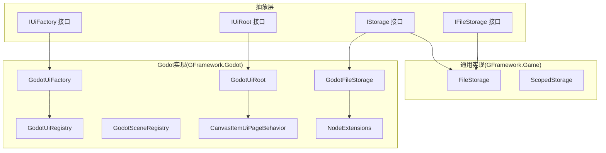
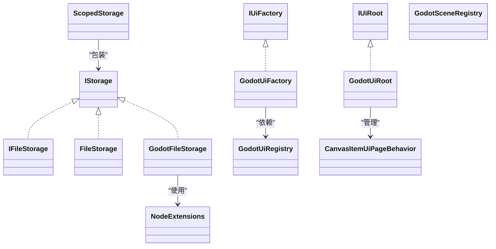
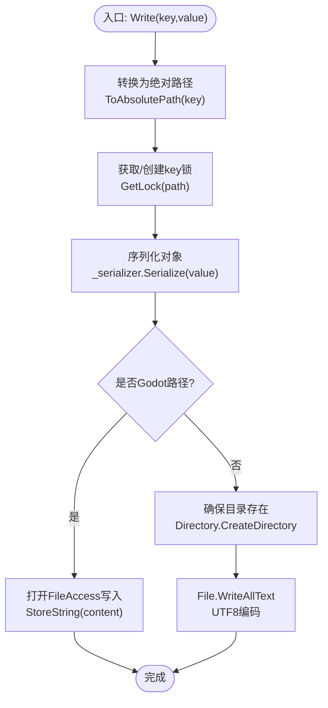
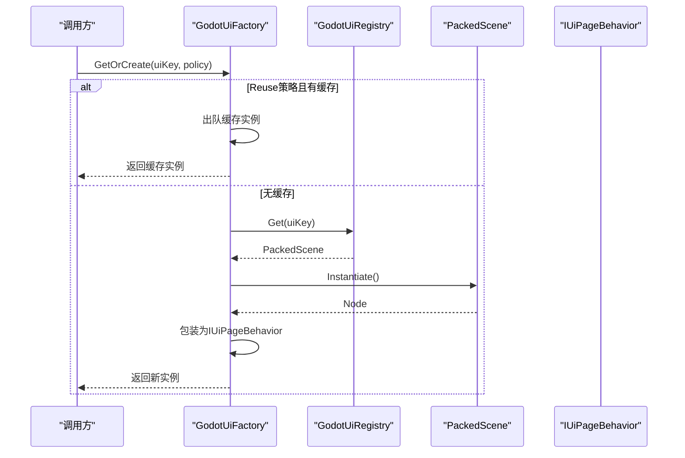
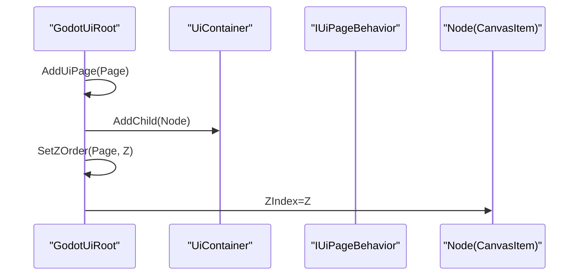
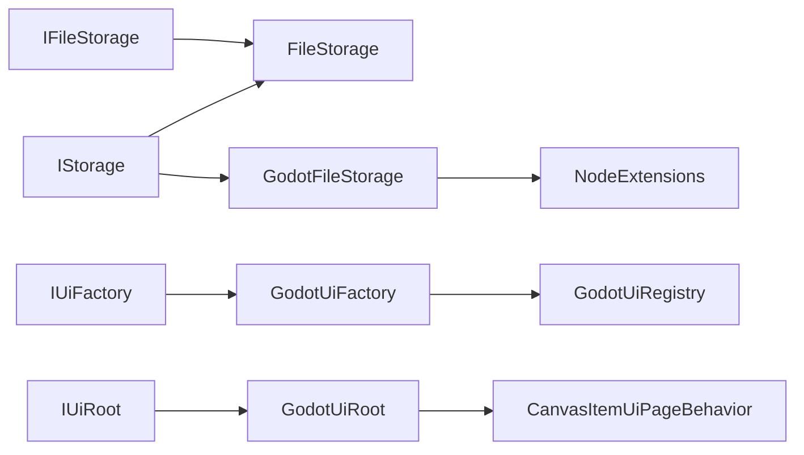

# Godot资源管理

<cite>
**本文引用的文件**
- [GodotFileStorage.cs](file://GFramework.Godot/storage/GodotFileStorage.cs)
- [GodotSceneRegistry.cs](file://GFramework.Godot/scene/GodotSceneRegistry.cs)
- [GodotUiFactory.cs](file://GFramework.Godot/ui/GodotUiFactory.cs)
- [GodotUiRegistry.cs](file://GFramework.Godot/ui/GodotUiRegistry.cs)
- [GodotUiRoot.cs](file://GFramework.Godot/ui/GodotUiRoot.cs)
- [CanvasItemUiPageBehavior.cs](file://GFramework.Godot/ui/CanvasItemUiPageBehavior.cs)
- [NodeExtensions.cs](file://GFramework.Godot/extensions/NodeExtensions.cs)
- [AbstractGodotModule.cs](file://GFramework.Godot/architecture/AbstractGodotModule.cs)
- [FileStorage.cs](file://GFramework.Game/storage/FileStorage.cs)
- [ScopedStorage.cs](file://GFramework.Game/storage/ScopedStorage.cs)
- [IStorage.cs](file://GFramework.Core.Abstractions/storage/IStorage.cs)
- [IFileStorage.cs](file://GFramework.Game.Abstractions/storage/IFileStorage.cs)
- [IUiFactory.cs](file://GFramework.Game.Abstractions/ui/IUiFactory.cs)
- [IUiRoot.cs](file://GFramework.Game.Abstractions/ui/IUiRoot.cs)
- [CacheEvictionPolicy.cs](file://GFramework.Game.Abstractions/enums/CacheEvictionPolicy.cs)
</cite>

## 目录
1. [简介](#简介)
2. [项目结构](#项目结构)
3. [核心组件](#核心组件)
4. [架构总览](#架构总览)
5. [组件详解](#组件详解)
6. [依赖关系分析](#依赖关系分析)
7. [性能与最佳实践](#性能与最佳实践)
8. [故障排查指南](#故障排查指南)
9. [结论](#结论)
10. [附录：集成与使用示例](#附录集成与使用示例)

## 简介
本指南围绕Godot平台下的资源管理实现，系统讲解以下能力：
- 文件存储：GodotFileStorage的文件读写、路径管理、线程安全与Godot虚拟路径支持
- 场景注册：GodotSceneRegistry的场景资源注册与管理
- UI系统：GodotUiFactory的UI对象创建与缓存回收、GodotUiRegistry的UI注册管理、GodotUiRoot的UI根节点控制
- 工厂模式与CanvasItem：UI页面行为管理与CanvasItem的页面行为封装
- 资源管理最佳实践：内存优化、资源缓存、异步加载策略

## 项目结构
本仓库采用分层与平台适配的组织方式：
- GFramework.Core.Abstractions：跨平台抽象接口与通用能力
- GFramework.Game.Abstractions：游戏层抽象接口
- GFramework.Godot：Godot平台实现
- GFramework.Game：通用游戏层实现（非Godot）

图表来源
- [IStorage.cs](file://GFramework.Core.Abstractions/storage/IStorage.cs#L1-L72)
- [IFileStorage.cs](file://GFramework.Game.Abstractions/storage/IFileStorage.cs#L1-L9)
- [FileStorage.cs](file://GFramework.Game/storage/FileStorage.cs#L1-L258)
- [ScopedStorage.cs](file://GFramework.Game/storage/ScopedStorage.cs#L1-L99)
- [GodotFileStorage.cs](file://GFramework.Godot/storage/GodotFileStorage.cs#L1-L291)
- [GodotUiFactory.cs](file://GFramework.Godot/ui/GodotUiFactory.cs#L1-L463)
- [GodotUiRegistry.cs](file://GFramework.Godot/ui/GodotUiRegistry.cs#L1-L12)
- [GodotUiRoot.cs](file://GFramework.Godot/ui/GodotUiRoot.cs#L1-L142)
- [GodotSceneRegistry.cs](file://GFramework.Godot/scene/GodotSceneRegistry.cs#L1-L12)
- [CanvasItemUiPageBehavior.cs](file://GFramework.Godot/ui/CanvasItemUiPageBehavior.cs#L1-L113)
- [NodeExtensions.cs](file://GFramework.Godot/extensions/NodeExtensions.cs#L1-L259)

章节来源
- [GodotFileStorage.cs](file://GFramework.Godot/storage/GodotFileStorage.cs#L1-L291)
- [GodotUiFactory.cs](file://GFramework.Godot/ui/GodotUiFactory.cs#L1-L463)
- [GodotUiRegistry.cs](file://GFramework.Godot/ui/GodotUiRegistry.cs#L1-L12)
- [GodotUiRoot.cs](file://GFramework.Godot/ui/GodotUiRoot.cs#L1-L142)
- [GodotSceneRegistry.cs](file://GFramework.Godot/scene/GodotSceneRegistry.cs#L1-L12)
- [CanvasItemUiPageBehavior.cs](file://GFramework.Godot/ui/CanvasItemUiPageBehavior.cs#L1-L113)
- [NodeExtensions.cs](file://GFramework.Godot/extensions/NodeExtensions.cs#L1-L259)
- [FileStorage.cs](file://GFramework.Game/storage/FileStorage.cs#L1-L258)
- [ScopedStorage.cs](file://GFramework.Game/storage/ScopedStorage.cs#L1-L99)
- [IStorage.cs](file://GFramework.Core.Abstractions/storage/IStorage.cs#L1-L72)
- [IFileStorage.cs](file://GFramework.Game.Abstractions/storage/IFileStorage.cs#L1-L9)
- [IUiFactory.cs](file://GFramework.Game.Abstractions/ui/IUiFactory.cs#L1-L87)
- [IUiRoot.cs](file://GFramework.Game.Abstractions/ui/IUiRoot.cs#L1-L43)
- [CacheEvictionPolicy.cs](file://GFramework.Game.Abstractions/enums/CacheEvictionPolicy.cs#L1-L18)

## 核心组件
- GodotFileStorage：Godot平台专用文件存储，支持res://、user://与普通文件路径，提供线程安全的读写与存在性检查
- GodotUiFactory：UI页面工厂，支持创建、缓存、预加载、回收与LRU/LFU淘汰策略
- GodotUiRegistry：UI场景注册表，基于键值对管理PackedScene
- GodotUiRoot：UI根节点，负责页面容器、层级Z序与可见页面管理
- GodotSceneRegistry：场景注册表，管理场景资源
- CanvasItemUiPageBehavior：CanvasItem页面行为封装，统一处理显示/隐藏、暂停/恢复、模态与遮罩
- NodeExtensions：Godot节点扩展，提供安全释放、等待ready、输入处理等工具

章节来源
- [GodotFileStorage.cs](file://GFramework.Godot/storage/GodotFileStorage.cs#L11-L31)
- [GodotUiFactory.cs](file://GFramework.Godot/ui/GodotUiFactory.cs#L12-L31)
- [GodotUiRegistry.cs](file://GFramework.Godot/ui/GodotUiRegistry.cs#L6-L11)
- [GodotUiRoot.cs](file://GFramework.Godot/ui/GodotUiRoot.cs#L7-L11)
- [GodotSceneRegistry.cs](file://GFramework.Godot/scene/GodotSceneRegistry.cs#L6-L11)
- [CanvasItemUiPageBehavior.cs](file://GFramework.Godot/ui/CanvasItemUiPageBehavior.cs#L7-L13)
- [NodeExtensions.cs](file://GFramework.Godot/extensions/NodeExtensions.cs#L5-L27)

## 架构总览
Godot资源管理由“抽象接口—通用实现—平台实现”三层构成：
- 抽象接口定义跨平台契约（如IStorage、IUiFactory、IUiRoot）
- 通用实现提供通用逻辑（如FileStorage、ScopedStorage）
- 平台实现对接Godot（如GodotFileStorage、GodotUiFactory、GodotUiRoot等）

图表来源
- [IStorage.cs](file://GFramework.Core.Abstractions/storage/IStorage.cs#L1-L72)
- [IFileStorage.cs](file://GFramework.Game.Abstractions/storage/IFileStorage.cs#L1-L9)
- [FileStorage.cs](file://GFramework.Game/storage/FileStorage.cs#L1-L258)
- [ScopedStorage.cs](file://GFramework.Game/storage/ScopedStorage.cs#L1-L99)
- [GodotFileStorage.cs](file://GFramework.Godot/storage/GodotFileStorage.cs#L1-L291)
- [GodotUiFactory.cs](file://GFramework.Godot/ui/GodotUiFactory.cs#L1-L463)
- [GodotUiRegistry.cs](file://GFramework.Godot/ui/GodotUiRegistry.cs#L1-L12)
- [GodotUiRoot.cs](file://GFramework.Godot/ui/GodotUiRoot.cs#L1-L142)
- [GodotSceneRegistry.cs](file://GFramework.Godot/scene/GodotSceneRegistry.cs#L1-L12)
- [CanvasItemUiPageBehavior.cs](file://GFramework.Godot/ui/CanvasItemUiPageBehavior.cs#L1-L113)
- [NodeExtensions.cs](file://GFramework.Godot/extensions/NodeExtensions.cs#L1-L259)

## 组件详解

### GodotFileStorage 文件存储实现
- 功能要点
  - 支持Godot虚拟路径（res://、user://）与普通文件系统路径
  - 按key细粒度锁保证线程安全；读写后尝试移除锁，避免内存泄漏
  - 提供Exists/Read/Write/Delete及异步版本
  - 路径清理：非法字符替换、相对路径防御（禁止..）、自动创建目录
- 关键流程
  - 路径转换：ToAbsolutePath将键转为绝对路径，Godot路径直接返回，普通路径拼接并创建目录
  - 读取：根据路径类型选择FileAccess或File读取文本，再交由ISerializer反序列化
  - 写入：序列化后写入，Godot路径使用FileAccess，普通路径使用File.WriteAllText
  - 删除：根据路径类型调用DirAccess.RemoveAbsolute或File.Delete

图表来源
- [GodotFileStorage.cs](file://GFramework.Godot/storage/GodotFileStorage.cs#L256-L276)

章节来源
- [GodotFileStorage.cs](file://GFramework.Godot/storage/GodotFileStorage.cs#L11-L31)
- [GodotFileStorage.cs](file://GFramework.Godot/storage/GodotFileStorage.cs#L85-L114)
- [GodotFileStorage.cs](file://GFramework.Godot/storage/GodotFileStorage.cs#L164-L188)
- [GodotFileStorage.cs](file://GFramework.Godot/storage/GodotFileStorage.cs#L256-L276)
- [GodotFileStorage.cs](file://GFramework.Godot/storage/GodotFileStorage.cs#L39-L66)
- [GodotFileStorage.cs](file://GFramework.Godot/storage/GodotFileStorage.cs#L132-L143)

### GodotSceneRegistry 场景注册机制
- 角色定位：继承KeyValueRegistryBase，以字符串为键、PackedScene为值，实现IGodotSceneRegistry
- 使用方式：通过键注册场景，供UI或其他系统按需实例化
- 注意事项：键区分大小写，建议统一命名规范

章节来源
- [GodotSceneRegistry.cs](file://GFramework.Godot/scene/GodotSceneRegistry.cs#L6-L11)

### GodotUiFactory UI工厂与缓存策略
- 工厂职责
  - GetOrCreate/Create：按策略创建UI页面
  - Preload/PreloadBatch：批量预加载隐藏实例，降低首次出现卡顿
  - Recycle：回收到缓存池，更新统计与访问追踪
  - 缓存配置：最大容量、淘汰策略（LRU/LFU），按UIKey独立配置
  - 统计查询：命中率、访问次数、最后访问时间
- 访问追踪与淘汰
  - LRU：按最近访问时间队列淘汰
  - LFU：按访问频次淘汰
- 生命周期管理
  - 进入/显示：OnShow，恢复处理与输入
  - 退出/隐藏：OnHide，隐藏节点
  - 退出时自动释放节点（QueueFreeX）

图表来源
- [GodotUiFactory.cs](file://GFramework.Godot/ui/GodotUiFactory.cs#L67-L97)
- [GodotUiRegistry.cs](file://GFramework.Godot/ui/GodotUiRegistry.cs#L1-L12)

章节来源
- [GodotUiFactory.cs](file://GFramework.Godot/ui/GodotUiFactory.cs#L67-L97)
- [GodotUiFactory.cs](file://GFramework.Godot/ui/GodotUiFactory.cs#L102-L131)
- [GodotUiFactory.cs](file://GFramework.Godot/ui/GodotUiFactory.cs#L136-L157)
- [GodotUiFactory.cs](file://GFramework.Godot/ui/GodotUiFactory.cs#L253-L274)
- [GodotUiFactory.cs](file://GFramework.Godot/ui/GodotUiFactory.cs#L280-L288)
- [GodotUiFactory.cs](file://GFramework.Godot/ui/GodotUiFactory.cs#L380-L397)
- [GodotUiFactory.cs](file://GFramework.Godot/ui/GodotUiFactory.cs#L402-L433)
- [GodotUiFactory.cs](file://GFramework.Godot/ui/GodotUiFactory.cs#L438-L460)

### GodotUiRegistry UI注册管理
- 角色定位：继承KeyValueRegistryBase，以字符串为键、PackedScene为值，实现IGodotUiRegistry
- 用途：集中管理UI场景资源，供GodotUiFactory按键获取

章节来源
- [GodotUiRegistry.cs](file://GFramework.Godot/ui/GodotUiRegistry.cs#L6-L11)

### GodotUiRoot UI根节点控制
- 责任边界：管理UI容器节点、页面添加/移除、层级Z序设置
- 层级映射：Page/Overlay/Modal/Toast/Topmost默认Z序，可自定义映射
- 节点操作：AddChild/RemoveChild，CanvasItem.ZIndex控制渲染顺序

图表来源
- [GodotUiRoot.cs](file://GFramework.Godot/ui/GodotUiRoot.cs#L59-L89)
- [GodotUiRoot.cs](file://GFramework.Godot/ui/GodotUiRoot.cs#L109-L118)

章节来源
- [GodotUiRoot.cs](file://GFramework.Godot/ui/GodotUiRoot.cs#L11-L142)

### CanvasItem的UI页面行为管理
- 封装对象：CanvasItemUiPageBehavior<T>，约束T为CanvasItem
- 行为接口：View(Key)/IsAlive/OnEnter/OnExit/OnPause/OnResume/OnHide/OnShow/IsModal/BlocksInput/RequiresMask
- 生命周期：OnShow自动恢复处理；OnExit自动释放节点

章节来源
- [CanvasItemUiPageBehavior.cs](file://GFramework.Godot/ui/CanvasItemUiPageBehavior.cs#L12-L113)

### Node扩展与安全释放
- 安全释放：QueueFreeX在下一帧释放，避免当前帧删除导致崩溃
- 输入处理：SetInputAsHandled阻止事件冒泡
- Ready等待：WaitUntilReady等待节点进入场景树
- 其他：IsValidNode/IsInvalidNode、Paused、FindChildX、GetOrCreateNode、ForEachChild、DisableInput/EnableInput、LogNodePath/PrintTreeX、SafeCallDeferred、OfType

章节来源
- [NodeExtensions.cs](file://GFramework.Godot/extensions/NodeExtensions.cs#L14-L46)
- [NodeExtensions.cs](file://GFramework.Godot/extensions/NodeExtensions.cs#L52-L55)
- [NodeExtensions.cs](file://GFramework.Godot/extensions/NodeExtensions.cs#L88-L92)
- [NodeExtensions.cs](file://GFramework.Godot/extensions/NodeExtensions.cs#L127-L139)
- [NodeExtensions.cs](file://GFramework.Godot/extensions/NodeExtensions.cs#L147-L151)
- [NodeExtensions.cs](file://GFramework.Godot/extensions/NodeExtensions.cs#L191-L207)
- [NodeExtensions.cs](file://GFramework.Godot/extensions/NodeExtensions.cs#L213-L230)
- [NodeExtensions.cs](file://GFramework.Godot/extensions/NodeExtensions.cs#L237-L242)
- [NodeExtensions.cs](file://GFramework.Godot/extensions/NodeExtensions.cs#L252-L259)

### 通用存储与作用域包装
- FileStorage：基于文件系统的存储，提供线程安全的读写与存在性检查
- ScopedStorage：为键添加前缀的作用域包装，便于模块化隔离与多租户

章节来源
- [FileStorage.cs](file://GFramework.Game/storage/FileStorage.cs#L11-L33)
- [FileStorage.cs](file://GFramework.Game/storage/FileStorage.cs#L72-L103)
- [FileStorage.cs](file://GFramework.Game/storage/FileStorage.cs#L144-L209)
- [FileStorage.cs](file://GFramework.Game/storage/FileStorage.cs#L221-L255)
- [ScopedStorage.cs](file://GFramework.Game/storage/ScopedStorage.cs#L11-L99)

## 依赖关系分析
- 抽象接口与实现解耦：IStorage/IUiFactory/IUiRoot定义契约，Godot实现与通用实现分别满足
- GodotFileStorage依赖NodeExtensions进行路径判定与文件操作
- GodotUiFactory依赖GodotUiRegistry获取场景，CanvasItemUiPageBehavior封装页面行为
- GodotUiRoot管理CanvasItem的Z序，统一渲染顺序

图表来源
- [IStorage.cs](file://GFramework.Core.Abstractions/storage/IStorage.cs#L1-L72)
- [IFileStorage.cs](file://GFramework.Game.Abstractions/storage/IFileStorage.cs#L1-L9)
- [FileStorage.cs](file://GFramework.Game/storage/FileStorage.cs#L1-L258)
- [GodotFileStorage.cs](file://GFramework.Godot/storage/GodotFileStorage.cs#L1-L291)
- [IUiFactory.cs](file://GFramework.Game.Abstractions/ui/IUiFactory.cs#L1-L87)
- [GodotUiFactory.cs](file://GFramework.Godot/ui/GodotUiFactory.cs#L1-L463)
- [IUiRoot.cs](file://GFramework.Game.Abstractions/ui/IUiRoot.cs#L1-L43)
- [GodotUiRoot.cs](file://GFramework.Godot/ui/GodotUiRoot.cs#L1-L142)
- [GodotUiRegistry.cs](file://GFramework.Godot/ui/GodotUiRegistry.cs#L1-L12)
- [CanvasItemUiPageBehavior.cs](file://GFramework.Godot/ui/CanvasItemUiPageBehavior.cs#L1-L113)
- [NodeExtensions.cs](file://GFramework.Godot/extensions/NodeExtensions.cs#L1-L259)

## 性能与最佳实践
- 文件存储
  - 使用GodotFileStorage的线程安全特性，避免并发读写冲突
  - 大文件读写建议结合异步接口，减少主线程阻塞
  - res://路径优先用于打包资源，user://用于用户数据持久化
- UI缓存
  - 预加载高频页面，隐藏状态进入池中，降低首帧延迟
  - 合理设置最大缓存与淘汰策略（LRU/LFU），平衡内存与命中率
  - 使用CanvasItemUiPageBehavior统一生命周期，避免重复处理与输入
- 节点管理
  - 使用QueueFreeX延迟释放，避免当前帧删除导致崩溃
  - 通过GodotUiRoot统一Z序，避免复杂层级导致的渲染问题
- 作用域与隔离
  - 使用ScopedStorage为不同模块或玩家数据添加前缀，避免键冲突

[本节为通用指导，无需列出章节来源]

## 故障排查指南
- 文件读取异常
  - 检查路径合法性：键中不得包含“..”，非法字符会被清理
  - res://路径需确保资源已打包，user://路径需确认写入权限
- UI页面无法显示
  - 确认页面节点已添加到GodotUiRoot容器，且Z序正确
  - 检查CanvasItemUiPageBehavior的显示/隐藏状态与模态设置
- 节点释放问题
  - 使用QueueFreeX而非Immediate Free，避免帧内删除
- 缓存命中率低
  - 调整缓存配置（最大容量、淘汰策略），观察统计信息

章节来源
- [GodotFileStorage.cs](file://GFramework.Godot/storage/GodotFileStorage.cs#L85-L114)
- [GodotUiRoot.cs](file://GFramework.Godot/ui/GodotUiRoot.cs#L59-L89)
- [CanvasItemUiPageBehavior.cs](file://GFramework.Godot/ui/CanvasItemUiPageBehavior.cs#L82-L96)
- [NodeExtensions.cs](file://GFramework.Godot/extensions/NodeExtensions.cs#L14-L27)
- [GodotUiFactory.cs](file://GFramework.Godot/ui/GodotUiFactory.cs#L162-L177)

## 结论
本指南梳理了Godot平台下的资源管理体系：文件存储、场景注册、UI工厂与根节点控制，并给出了缓存策略与节点管理的最佳实践。通过抽象接口与平台实现的分层设计，既保证了跨平台一致性，又充分利用了Godot的特性（如PackedScene、CanvasItem、FileAccess）。建议在实际项目中结合预加载、缓存与异步策略，持续监控缓存命中率与内存占用，以获得更稳定的用户体验。

[本节为总结性内容，无需列出章节来源]

## 附录：集成与使用示例
- 注册Godot模块（挂载UI根节点）
  - 参考：AbstractGodotModule的Install/OnAttach钩子，将GodotUiRoot挂载到场景树
  - 参考文件：[AbstractGodotModule.cs](file://GFramework.Godot/architecture/AbstractGodotModule.cs#L39-L54)
- 使用GodotFileStorage
  - 读取：Read<T>(key) 或 Read<T>(key, defaultValue)
  - 写入：Write<T>(key, value)
  - 删除：Delete(key)
  - 参考文件：[GodotFileStorage.cs](file://GFramework.Godot/storage/GodotFileStorage.cs#L164-L188)
- 使用GodotUiFactory
  - 创建：Create(uiKey) 或 GetOrCreate(uiKey, UiInstancePolicy)
  - 预加载：Preload(uiKey, count)
  - 回收：Recycle(page)
  - 配置：SetCacheConfig(uiKey, UiCacheConfig)，查看统计：GetCacheStatistics()
  - 参考文件：[GodotUiFactory.cs](file://GFramework.Godot/ui/GodotUiFactory.cs#L67-L97)
- 使用GodotUiRoot
  - 添加页面：AddUiPage(child) 或 AddUiPage(child, layer, orderInLayer)
  - 设置Z序：SetZOrder(page, zOrder)
  - 参考文件：[GodotUiRoot.cs](file://GFramework.Godot/ui/GodotUiRoot.cs#L59-L89)
- 使用CanvasItemUiPageBehavior
  - 显示/隐藏：OnShow/OnHide
  - 暂停/恢复：OnPause/OnResume
  - 参考文件：[CanvasItemUiPageBehavior.cs](file://GFramework.Godot/ui/CanvasItemUiPageBehavior.cs#L82-L96)
- 使用NodeExtensions
  - 安全释放：QueueFreeX(node)
  - 等待ready：WaitUntilReady(node)
  - 参考文件：[NodeExtensions.cs](file://GFramework.Godot/extensions/NodeExtensions.cs#L14-L27)