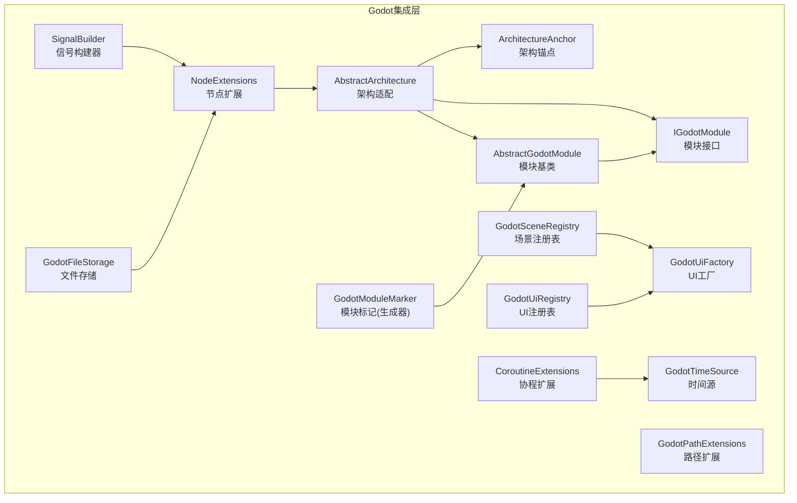
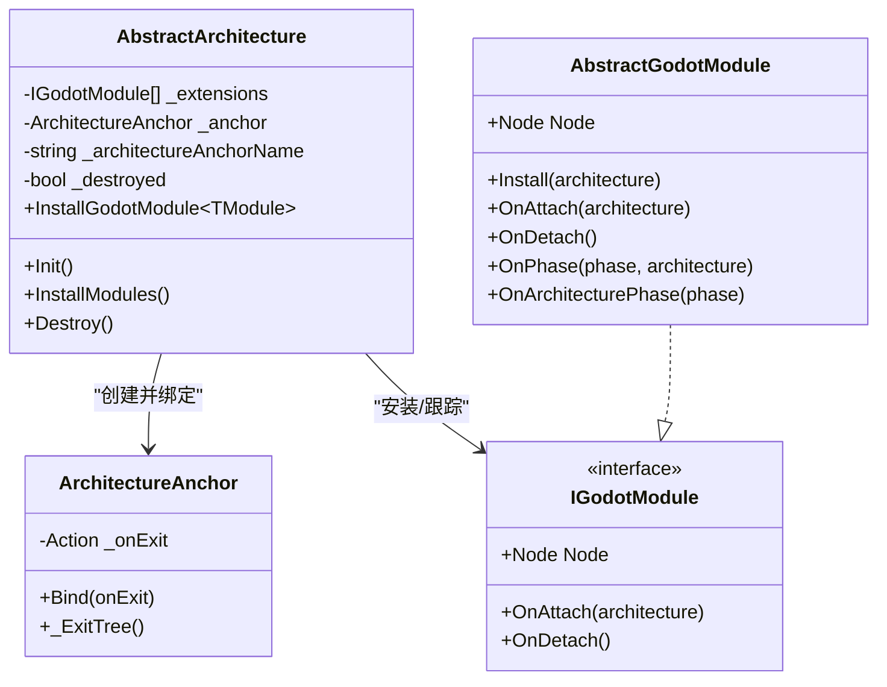
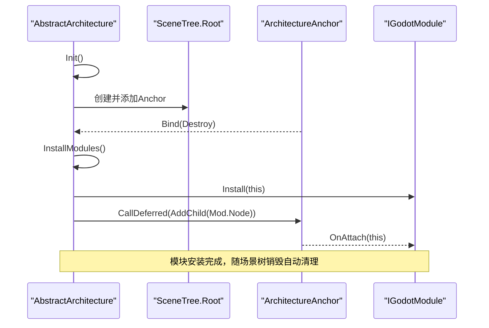
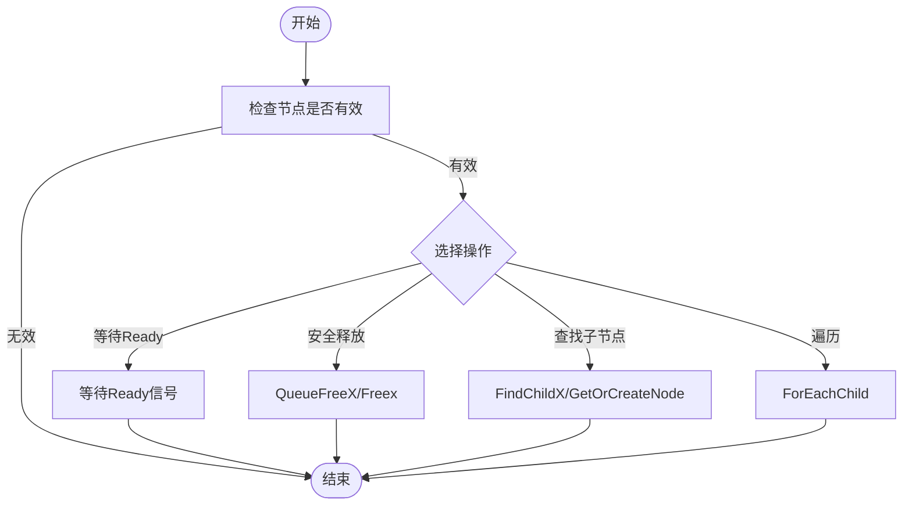
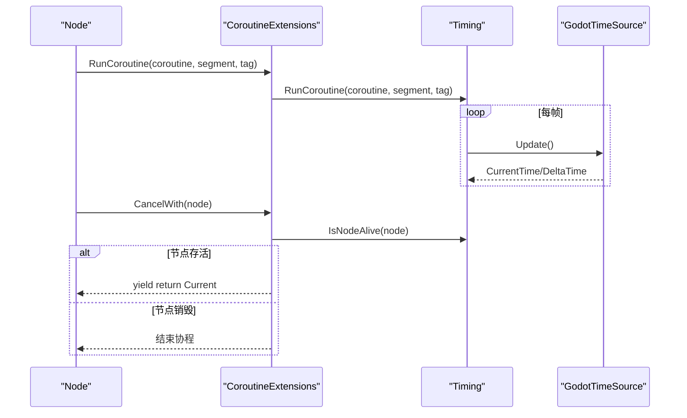
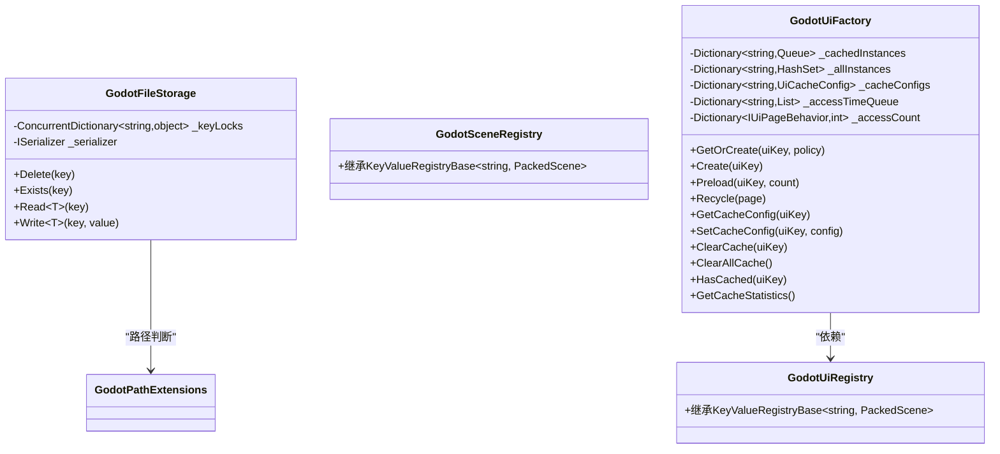
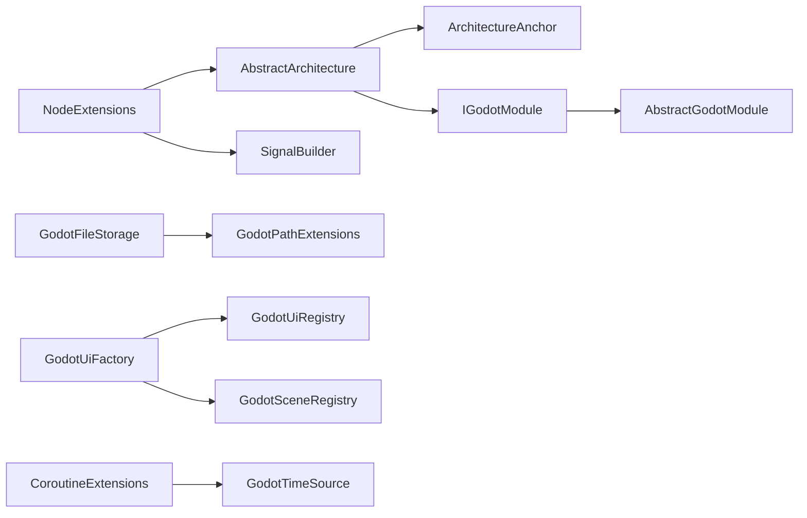

# 平台集成模块

<cite>
**本文引用的文件**
- [GFramework.Godot/architecture/AbstractArchitecture.cs](file://GFramework.Godot/architecture/AbstractArchitecture.cs)
- [GFramework.Godot/architecture/AbstractGodotModule.cs](file://GFramework.Godot/architecture/AbstractGodotModule.cs)
- [GFramework.Godot/architecture/ArchitectureAnchor.cs](file://GFramework.Godot/architecture/ArchitectureAnchor.cs)
- [GFramework.Godot/architecture/IGodotModule.cs](file://GFramework.Godot/architecture/IGodotModule.cs)
- [GFramework.Godot/coroutine/CoroutineExtensions.cs](file://GFramework.Godot/coroutine/CoroutineExtensions.cs)
- [GFramework.Godot/coroutine/GodotTimeSource.cs](file://GFramework.Godot/coroutine/GodotTimeSource.cs)
- [GFramework.Godot/extensions/NodeExtensions.cs](file://GFramework.Godot/extensions/NodeExtensions.cs)
- [GFramework.Godot/extensions/signal/SignalBuilder.cs](file://GFramework.Godot/extensions/signal/SignalBuilder.cs)
- [GFramework.Godot/extensions/GodotPathExtensions.cs](file://GFramework.Godot/extensions/GodotPathExtensions.cs)
- [GFramework.Godot/storage/GodotFileStorage.cs](file://GFramework.Godot/storage/GodotFileStorage.cs)
- [GFramework.Godot/scene/GodotSceneRegistry.cs](file://GFramework.Godot/scene/GodotSceneRegistry.cs)
- [GFramework.Godot/ui/GodotUiFactory.cs](file://GFramework.Godot/ui/GodotUiFactory.cs)
- [GFramework.Godot/ui/GodotUiRegistry.cs](file://GFramework.Godot/ui/GodotUiRegistry.cs)
- [GFramework.Godot.SourceGenerators.Abstractions/GodotModuleMarker.cs](file://GFramework.Godot.SourceGenerators.Abstractions/GodotModuleMarker.cs)
- [GFramework.Godot/README.md](file://GFramework.Godot/README.md)
</cite>

## 目录
1. [引言](#引言)
2. [项目结构](#项目结构)
3. [核心组件](#核心组件)
4. [架构总览](#架构总览)
5. [组件详解](#组件详解)
6. [依赖关系分析](#依赖关系分析)
7. [性能考量](#性能考量)
8. [故障排查指南](#故障排查指南)
9. [结论](#结论)
10. [附录](#附录)

## 引言
本文件面向希望在Godot引擎中集成GFramework平台的开发者，系统性阐述GFramework.Godot模块的设计与实现，覆盖架构适配、模块系统、节点扩展、信号处理、路径扩展、生命周期绑定、协程集成、资源与UI注册体系，以及源码生成器的使用与配置。同时提供从其他平台迁移到Godot的实践建议与注意事项。

## 项目结构
GFramework.Godot位于仓库的GFramework.Godot目录，围绕“架构适配 + 扩展能力 + 资源与UI管理 + 协程与时间源”的主题组织代码，采用按功能域分层的结构：
- architecture：Godot架构适配与模块系统
- extensions：节点扩展、信号构建器、路径扩展等
- storage：Godot文件存储实现
- scene/ui：场景与UI注册表、UI工厂
- coroutine：协程扩展与时间源
- SourceGenerators.Abstractions：Godot模块标记类型（用于生成器识别）

图表来源
- [GFramework.Godot/architecture/AbstractArchitecture.cs](file://GFramework.Godot/architecture/AbstractArchitecture.cs#L14-L140)
- [GFramework.Godot/architecture/AbstractGodotModule.cs](file://GFramework.Godot/architecture/AbstractGodotModule.cs#L11-L55)
- [GFramework.Godot/architecture/ArchitectureAnchor.cs](file://GFramework.Godot/architecture/ArchitectureAnchor.cs#L9-L35)
- [GFramework.Godot/architecture/IGodotModule.cs](file://GFramework.Godot/architecture/IGodotModule.cs#L10-L27)
- [GFramework.Godot/extensions/NodeExtensions.cs](file://GFramework.Godot/extensions/NodeExtensions.cs#L8-L259)
- [GFramework.Godot/extensions/signal/SignalBuilder.cs](file://GFramework.Godot/extensions/signal/SignalBuilder.cs#L10-L65)
- [GFramework.Godot/extensions/GodotPathExtensions.cs](file://GFramework.Godot/extensions/GodotPathExtensions.cs#L3-L22)
- [GFramework.Godot/storage/GodotFileStorage.cs](file://GFramework.Godot/storage/GodotFileStorage.cs#L15-L291)
- [GFramework.Godot/scene/GodotSceneRegistry.cs](file://GFramework.Godot/scene/GodotSceneRegistry.cs#L11-L12)
- [GFramework.Godot/ui/GodotUiRegistry.cs](file://GFramework.Godot/ui/GodotUiRegistry.cs#L11-L12)
- [GFramework.Godot/ui/GodotUiFactory.cs](file://GFramework.Godot/ui/GodotUiFactory.cs#L16-L463)
- [GFramework.Godot/coroutine/CoroutineExtensions.cs](file://GFramework.Godot/coroutine/CoroutineExtensions.cs#L7-L66)
- [GFramework.Godot/coroutine/GodotTimeSource.cs](file://GFramework.Godot/coroutine/GodotTimeSource.cs#L9-L44)
- [GFramework.Godot.SourceGenerators.Abstractions/GodotModuleMarker.cs](file://GFramework.Godot.SourceGenerators.Abstractions/GodotModuleMarker.cs#L1-L6)

章节来源
- [GFramework.Godot/README.md](file://GFramework.Godot/README.md#L1-L200)

## 核心组件
- AbstractArchitecture：在Godot场景树中创建并绑定架构锚点，统一管理模块安装、生命周期与销毁；提供InstallGodotModule以异步挂载模块节点。
- AbstractGodotModule：模块基类，定义模块节点、安装与附加/分离回调，以及架构阶段变更通知。
- ArchitectureAnchor：轻量节点，提供Bind与_exit_tree回调，确保节点从场景树移除时触发清理。
- IGodotModule：Godot模块接口，暴露Node、OnAttach、OnDetach。
- NodeExtensions：提供节点安全操作、Ready等待、父子节点查找、输入处理、树遍历、延迟调用等扩展。
- SignalBuilder：流畅式信号连接API，支持一次性连接、立即调用、生命周期绑定。
- GodotPathExtensions：Godot路径判断工具（user://、res://）。
- GodotFileStorage：支持res://、user://与普通文件路径的存储实现，提供线程安全的读写与存在性检查。
- GodotSceneRegistry/GodotUiRegistry：基于键值注册表的场景与UI资源管理。
- GodotUiFactory：UI页面实例的创建、缓存、预加载、回收与淘汰策略（LRU/LFU）。
- CoroutineExtensions/GodotTimeSource：协程扩展与时间源，提供与Godot生命周期一致的时间推进与协程取消。
- GodotModuleMarker：生成器标记类型，用于识别Godot模块命名空间。

章节来源
- [GFramework.Godot/architecture/AbstractArchitecture.cs](file://GFramework.Godot/architecture/AbstractArchitecture.cs#L14-L140)
- [GFramework.Godot/architecture/AbstractGodotModule.cs](file://GFramework.Godot/architecture/AbstractGodotModule.cs#L11-L55)
- [GFramework.Godot/architecture/ArchitectureAnchor.cs](file://GFramework.Godot/architecture/ArchitectureAnchor.cs#L9-L35)
- [GFramework.Godot/architecture/IGodotModule.cs](file://GFramework.Godot/architecture/IGodotModule.cs#L10-L27)
- [GFramework.Godot/extensions/NodeExtensions.cs](file://GFramework.Godot/extensions/NodeExtensions.cs#L8-L259)
- [GFramework.Godot/extensions/signal/SignalBuilder.cs](file://GFramework.Godot/extensions/signal/SignalBuilder.cs#L10-L65)
- [GFramework.Godot/extensions/GodotPathExtensions.cs](file://GFramework.Godot/extensions/GodotPathExtensions.cs#L3-L22)
- [GFramework.Godot/storage/GodotFileStorage.cs](file://GFramework.Godot/storage/GodotFileStorage.cs#L15-L291)
- [GFramework.Godot/scene/GodotSceneRegistry.cs](file://GFramework.Godot/scene/GodotSceneRegistry.cs#L11-L12)
- [GFramework.Godot/ui/GodotUiRegistry.cs](file://GFramework.Godot/ui/GodotUiRegistry.cs#L11-L12)
- [GFramework.Godot/ui/GodotUiFactory.cs](file://GFramework.Godot/ui/GodotUiFactory.cs#L16-L463)
- [GFramework.Godot/coroutine/CoroutineExtensions.cs](file://GFramework.Godot/coroutine/CoroutineExtensions.cs#L7-L66)
- [GFramework.Godot/coroutine/GodotTimeSource.cs](file://GFramework.Godot/coroutine/GodotTimeSource.cs#L9-L44)
- [GFramework.Godot.SourceGenerators.Abstractions/GodotModuleMarker.cs](file://GFramework.Godot.SourceGenerators.Abstractions/GodotModuleMarker.cs#L1-L6)

## 架构总览
GFramework.Godot通过AbstractArchitecture将框架生命周期与Godot场景树绑定，使用ArchitectureAnchor作为根节点承载模块节点，确保节点退出场景树时自动清理。模块通过AbstractGodotModule实现安装、附加与分离回调，并在架构阶段变更时响应。

图表来源
- [GFramework.Godot/architecture/AbstractArchitecture.cs](file://GFramework.Godot/architecture/AbstractArchitecture.cs#L14-L140)
- [GFramework.Godot/architecture/ArchitectureAnchor.cs](file://GFramework.Godot/architecture/ArchitectureAnchor.cs#L9-L35)
- [GFramework.Godot/architecture/IGodotModule.cs](file://GFramework.Godot/architecture/IGodotModule.cs#L10-L27)
- [GFramework.Godot/architecture/AbstractGodotModule.cs](file://GFramework.Godot/architecture/AbstractGodotModule.cs#L11-L55)

## 组件详解

### 架构适配与模块系统
- AbstractArchitecture
  - 生成唯一锚点名称，避免重复挂载
  - 通过AttachToGodotLifecycle在场景树根节点下创建ArchitectureAnchor并绑定Destroy回调
  - InstallGodotModule负责安装模块、等待锚点就绪、将模块节点作为子节点添加，并调用OnAttach
  - Destroy遍历已安装模块调用OnDetach并清空列表
- AbstractGodotModule
  - Node暴露模块关联的Godot节点
  - Install定义模块安装逻辑
  - OnAttach/OnDetach分别在模块附加/分离时回调
  - OnPhase/OnArchitecturePhase响应架构阶段变化
- IGodotModule
  - 继承IArchitectureModule，要求Node、OnAttach、OnDetach
- ArchitectureAnchor
  - Bind记录退出回调，_ExitTree触发并清理

图表来源
- [GFramework.Godot/architecture/AbstractArchitecture.cs](file://GFramework.Godot/architecture/AbstractArchitecture.cs#L56-L119)
- [GFramework.Godot/architecture/ArchitectureAnchor.cs](file://GFramework.Godot/architecture/ArchitectureAnchor.cs#L17-L34)
- [GFramework.Godot/architecture/IGodotModule.cs](file://GFramework.Godot/architecture/IGodotModule.cs#L10-L27)

章节来源
- [GFramework.Godot/architecture/AbstractArchitecture.cs](file://GFramework.Godot/architecture/AbstractArchitecture.cs#L14-L140)
- [GFramework.Godot/architecture/AbstractGodotModule.cs](file://GFramework.Godot/architecture/AbstractGodotModule.cs#L11-L55)
- [GFramework.Godot/architecture/ArchitectureAnchor.cs](file://GFramework.Godot/architecture/ArchitectureAnchor.cs#L9-L35)
- [GFramework.Godot/architecture/IGodotModule.cs](file://GFramework.Godot/architecture/IGodotModule.cs#L10-L27)

### 节点扩展与信号处理
- NodeExtensions
  - 安全释放：QueueFreeX/Freex，带空值与有效性检查
  - Ready等待：WaitUntilReady，若不在树内则等待Ready信号
  - 节点验证：IsValidNode/IsInvalidNode
  - 输入处理：SetInputAsHandled、Paused、DisableInput/EnableInput
  - 路径与树遍历：FindChildX、GetOrCreateNode、AddChildX、GetParentX、GetRootNodeX、ForEachChild
  - 树打印与延迟调用：LogNodePath、PrintTreeX、SafeCallDeferred、OfType
- SignalBuilder
  - WithFlags设置连接标志
  - To连接到Callable，ToAndCall连接后立即调用
  - End返回目标对象
- GodotPathExtensions
  - IsUserPath/IsResPath/IsGodotPath

图表来源
- [GFramework.Godot/extensions/NodeExtensions.cs](file://GFramework.Godot/extensions/NodeExtensions.cs#L14-L259)
- [GFramework.Godot/extensions/signal/SignalBuilder.cs](file://GFramework.Godot/extensions/signal/SignalBuilder.cs#L10-L65)
- [GFramework.Godot/extensions/GodotPathExtensions.cs](file://GFramework.Godot/extensions/GodotPathExtensions.cs#L3-L22)

章节来源
- [GFramework.Godot/extensions/NodeExtensions.cs](file://GFramework.Godot/extensions/NodeExtensions.cs#L8-L259)
- [GFramework.Godot/extensions/signal/SignalBuilder.cs](file://GFramework.Godot/extensions/signal/SignalBuilder.cs#L10-L65)
- [GFramework.Godot/extensions/GodotPathExtensions.cs](file://GFramework.Godot/extensions/GodotPathExtensions.cs#L3-L22)

### 协程集成与时间源
- CoroutineExtensions
  - RunCoroutine：启动协程，支持Segment与tag
  - CancelWith：在节点销毁时自动取消协程（单节点、双节点、多节点）
- GodotTimeSource
  - ITimeSource实现，提供CurrentTime/DeltaTime
  - Update根据传入的增量时间函数推进时间，Reset重置

图表来源
- [GFramework.Godot/coroutine/CoroutineExtensions.cs](file://GFramework.Godot/coroutine/CoroutineExtensions.cs#L12-L66)
- [GFramework.Godot/coroutine/GodotTimeSource.cs](file://GFramework.Godot/coroutine/GodotTimeSource.cs#L28-L44)

章节来源
- [GFramework.Godot/coroutine/CoroutineExtensions.cs](file://GFramework.Godot/coroutine/CoroutineExtensions.cs#L7-L66)
- [GFramework.Godot/coroutine/GodotTimeSource.cs](file://GFramework.Godot/coroutine/GodotTimeSource.cs#L9-L44)

### 资源管理与UI注册
- GodotFileStorage
  - Delete/Exists/Read/Write支持res://、user://与普通路径
  - 使用key级锁保证线程安全
  - ToAbsolutePath处理路径规范化与校验
- GodotSceneRegistry/GodotUiRegistry
  - 基于键值注册表，以字符串为键、PackedScene为值
- GodotUiFactory
  - 支持三种实例策略：AlwaysCreate、Reuse、Pooled
  - 预加载、回收、统计与淘汰（LRU/LFU），并维护实例追踪与访问时间/计数

图表来源
- [GFramework.Godot/storage/GodotFileStorage.cs](file://GFramework.Godot/storage/GodotFileStorage.cs#L15-L291)
- [GFramework.Godot/scene/GodotSceneRegistry.cs](file://GFramework.Godot/scene/GodotSceneRegistry.cs#L11-L12)
- [GFramework.Godot/ui/GodotUiRegistry.cs](file://GFramework.Godot/ui/GodotUiRegistry.cs#L11-L12)
- [GFramework.Godot/ui/GodotUiFactory.cs](file://GFramework.Godot/ui/GodotUiFactory.cs#L16-L463)
- [GFramework.Godot/extensions/GodotPathExtensions.cs](file://GFramework.Godot/extensions/GodotPathExtensions.cs#L3-L22)

章节来源
- [GFramework.Godot/storage/GodotFileStorage.cs](file://GFramework.Godot/storage/GodotFileStorage.cs#L15-L291)
- [GFramework.Godot/scene/GodotSceneRegistry.cs](file://GFramework.Godot/scene/GodotSceneRegistry.cs#L11-L12)
- [GFramework.Godot/ui/GodotUiRegistry.cs](file://GFramework.Godot/ui/GodotUiRegistry.cs#L11-L12)
- [GFramework.Godot/ui/GodotUiFactory.cs](file://GFramework.Godot/ui/GodotUiFactory.cs#L16-L463)

### 源码生成器与模块标记
- GodotModuleMarker
  - 作为Godot模块命名空间的占位类型，便于生成器识别与扫描
- 使用建议
  - 在Godot模块所在命名空间引入该类型，确保生成器扫描到模块类型
  - 与AbstractGodotModule配合，实现模块的自动发现与装配（如通过生成器扩展）

章节来源
- [GFramework.Godot.SourceGenerators.Abstractions/GodotModuleMarker.cs](file://GFramework.Godot.SourceGenerators.Abstractions/GodotModuleMarker.cs#L1-L6)

## 依赖关系分析
- 架构层
  - AbstractArchitecture依赖ArchitectureAnchor进行生命周期绑定
  - 通过IGodotModule约束模块行为，模块通过AbstractGodotModule实现
- 扩展层
  - NodeExtensions广泛被模块与控制器使用，提供安全的节点操作
  - SignalBuilder依赖NodeExtensions的Ready等待与生命周期绑定能力
- 资源与UI
  - GodotUiFactory依赖GodotUiRegistry/GodotSceneRegistry进行场景实例化
  - GodotFileStorage依赖GodotPathExtensions进行路径判断
- 协程与时间
  - CoroutineExtensions依赖GodotTimeSource推进时间，Timing用于节点存活检测与协程调度

图表来源
- [GFramework.Godot/architecture/AbstractArchitecture.cs](file://GFramework.Godot/architecture/AbstractArchitecture.cs#L14-L140)
- [GFramework.Godot/architecture/AbstractGodotModule.cs](file://GFramework.Godot/architecture/AbstractGodotModule.cs#L11-L55)
- [GFramework.Godot/architecture/IGodotModule.cs](file://GFramework.Godot/architecture/IGodotModule.cs#L10-L27)
- [GFramework.Godot/extensions/NodeExtensions.cs](file://GFramework.Godot/extensions/NodeExtensions.cs#L8-L259)
- [GFramework.Godot/extensions/signal/SignalBuilder.cs](file://GFramework.Godot/extensions/signal/SignalBuilder.cs#L10-L65)
- [GFramework.Godot/storage/GodotFileStorage.cs](file://GFramework.Godot/storage/GodotFileStorage.cs#L15-L291)
- [GFramework.Godot/extensions/GodotPathExtensions.cs](file://GFramework.Godot/extensions/GodotPathExtensions.cs#L3-L22)
- [GFramework.Godot/ui/GodotUiRegistry.cs](file://GFramework.Godot/ui/GodotUiRegistry.cs#L11-L12)
- [GFramework.Godot/scene/GodotSceneRegistry.cs](file://GFramework.Godot/scene/GodotSceneRegistry.cs#L11-L12)
- [GFramework.Godot/ui/GodotUiFactory.cs](file://GFramework.Godot/ui/GodotUiFactory.cs#L16-L463)
- [GFramework.Godot/coroutine/CoroutineExtensions.cs](file://GFramework.Godot/coroutine/CoroutineExtensions.cs#L7-L66)
- [GFramework.Godot/coroutine/GodotTimeSource.cs](file://GFramework.Godot/coroutine/GodotTimeSource.cs#L9-L44)

## 性能考量
- 节点安全与延迟调用
  - 使用QueueFreeX/Freex避免在当前帧直接释放导致的不稳定
  - AddChildX/WaitUntilReady确保子节点就绪再继续逻辑
- 协程与时间源
  - GodotTimeSource按帧推进，避免额外时间轮询开销
  - CancelWith在节点销毁时自动取消协程，减少无效执行
- 资源与UI
  - GodotFileStorage使用key级锁，降低并发冲突
  - GodotUiFactory的预加载与缓存策略（LRU/LFU）减少频繁实例化成本
- 路径处理
  - GodotPathExtensions快速判断路径类型，避免不必要的IO开销

## 故障排查指南
- 模块未安装或节点未就绪
  - 症状：模块节点未出现在场景树或未触发OnAttach
  - 排查：确认InstallGodotModule调用顺序与锚点Ready状态
- 节点释放异常
  - 症状：QueueFree后仍访问节点引发异常
  - 排查：使用QueueFreeX/Freex，避免重复释放
- 信号泄漏
  - 症状：节点销毁后仍收到信号回调
  - 排查：使用SignalBuilder链路或UnRegisterWhenNodeExitTree确保自动解绑
- 协程未停止
  - 症状：节点销毁后协程仍在运行
  - 排查：在协程中使用CancelWith(node)，或在模块OnDetach中显式取消
- 资源路径错误
  - 症状：读写失败或找不到文件
  - 排查：使用GodotPathExtensions判断路径类型，确保res://或user://格式正确

章节来源
- [GFramework.Godot/architecture/AbstractArchitecture.cs](file://GFramework.Godot/architecture/AbstractArchitecture.cs#L100-L119)
- [GFramework.Godot/extensions/NodeExtensions.cs](file://GFramework.Godot/extensions/NodeExtensions.cs#L14-L46)
- [GFramework.Godot/extensions/signal/SignalBuilder.cs](file://GFramework.Godot/extensions/signal/SignalBuilder.cs#L31-L55)
- [GFramework.Godot/coroutine/CoroutineExtensions.cs](file://GFramework.Godot/coroutine/CoroutineExtensions.cs#L23-L54)
- [GFramework.Godot/storage/GodotFileStorage.cs](file://GFramework.Godot/storage/GodotFileStorage.cs#L40-L66)

## 结论
GFramework.Godot通过AbstractArchitecture与ArchitectureAnchor实现了与Godot生命周期的无缝绑定，模块系统以IGodotModule/AbstractGodotModule为核心，提供清晰的安装、附加与分离流程。配套的NodeExtensions、SignalBuilder、GodotFileStorage、GodotUiFactory与协程时间源共同构成完整的平台适配能力，既保持了GFramework的强类型与架构一致性，又充分发挥Godot在节点系统、信号与场景管理方面的优势。

## 附录

### 项目集成流程与最佳实践
- 架构集成
  - 继承AbstractArchitecture，重写Init与InstallModules
  - 在InstallModules中调用InstallGodotModule安装Godot模块
- 模块开发
  - 继承AbstractGodotModule，实现Node与Install
  - 在OnAttach中初始化模块逻辑，在OnDetach中清理
- 节点与信号
  - 使用NodeExtensions进行安全节点操作
  - 使用SignalBuilder进行流畅信号连接与生命周期绑定
- 资源与UI
  - 使用GodotFileStorage进行跨路径读写
  - 使用GodotUiFactory的缓存与预加载策略提升UI切换性能
- 协程与时间
  - 使用RunCoroutine启动协程，使用CancelWith在节点销毁时自动取消
  - 使用GodotTimeSource与框架时间源保持一致

章节来源
- [GFramework.Godot/README.md](file://GFramework.Godot/README.md#L66-L200)

### 从其他平台移植到Godot的迁移指南
- 架构层
  - 将平台无关的模型、系统、工具注册逻辑迁移至AbstractArchitecture.Init
  - 将平台特定的模块封装为AbstractGodotModule并使用InstallGodotModule安装
- 资源与存储
  - 将文件读写抽象映射到GodotFileStorage，注意res://与user://路径差异
- UI与场景
  - 将UI页面注册到GodotUiRegistry/GodotSceneRegistry，使用GodotUiFactory进行实例化与缓存
- 事件与信号
  - 将事件系统与Godot信号桥接，使用SignalBuilder进行连接与自动解绑
- 协程与时间
  - 将异步等待与延时替换为Godot协程与GodotTimeSource推进

章节来源
- [GFramework.Godot/README.md](file://GFramework.Godot/README.md#L200-L893)