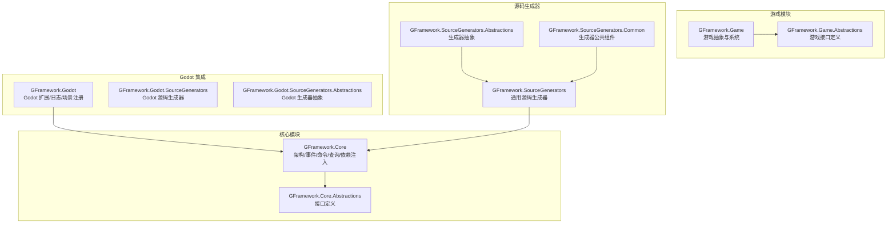
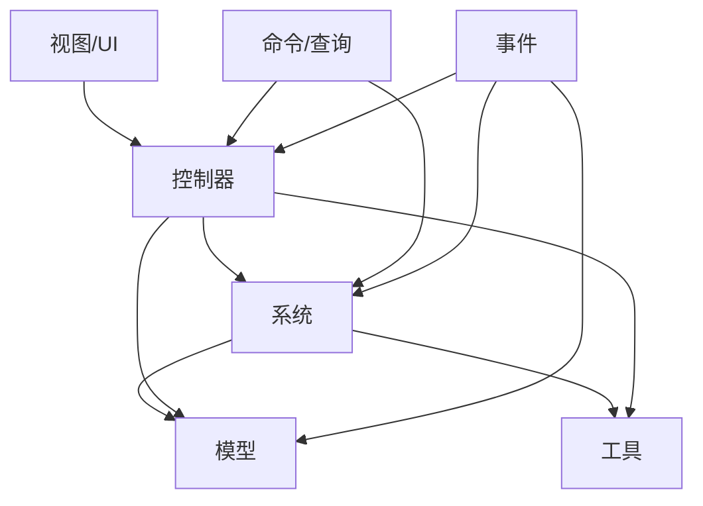
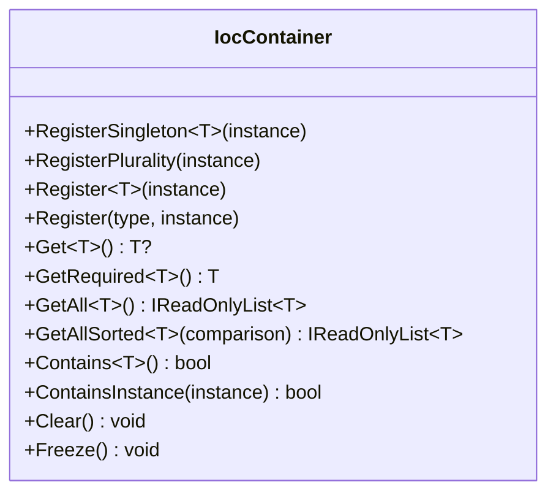
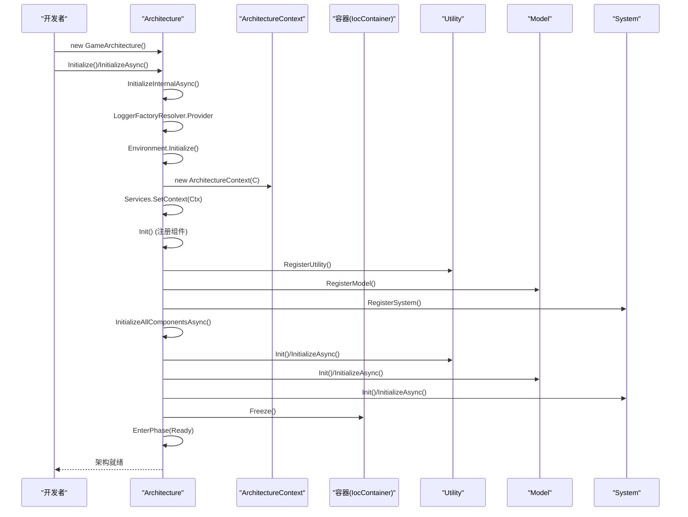
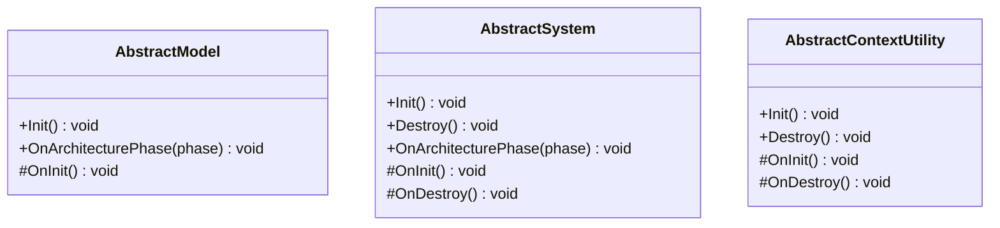
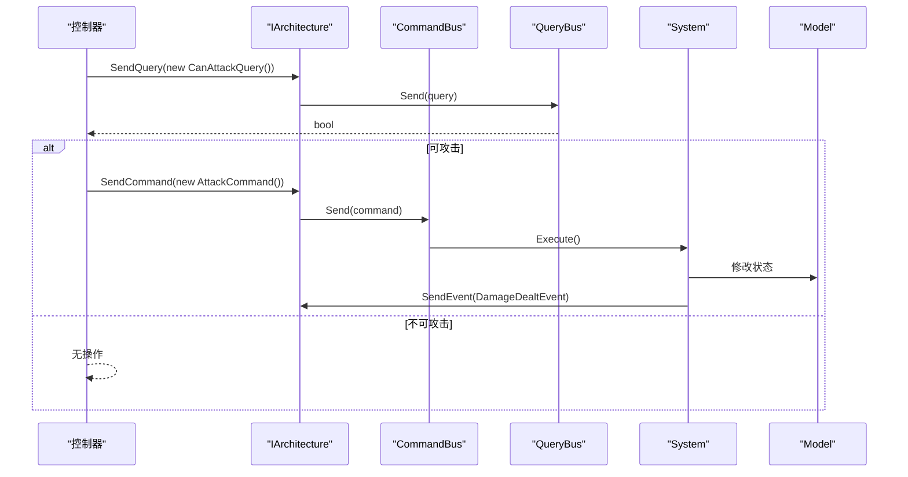
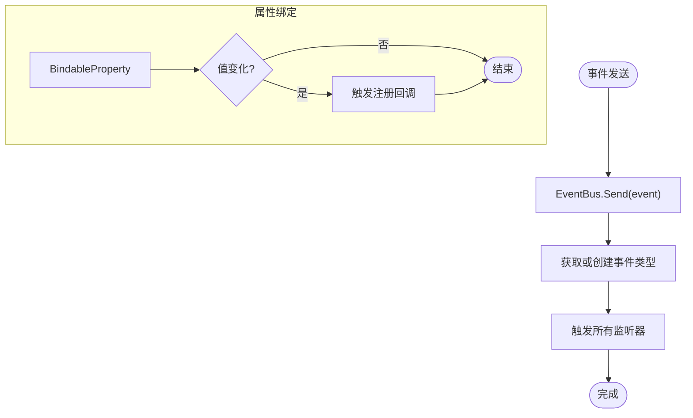
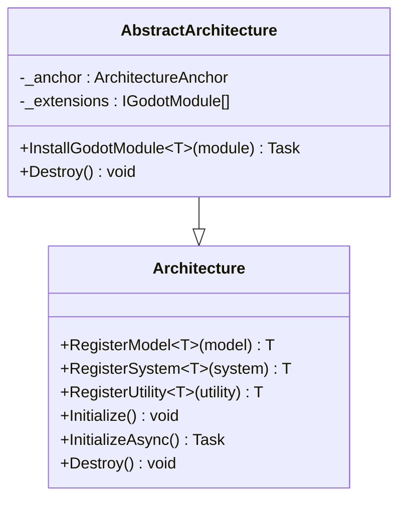
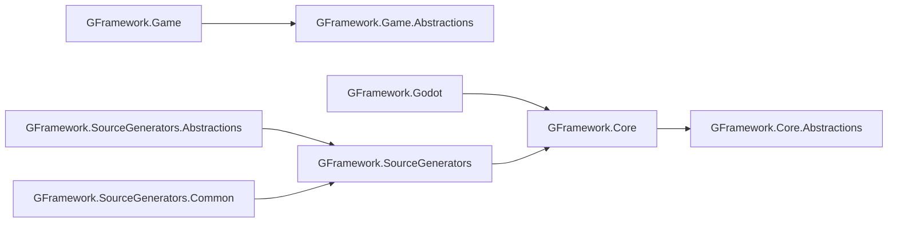

# 快速开始

<cite>
**本文引用的文件**
- [README.md](file://README.md)
- [getting-started.md](file://docs/tutorials/getting-started.md)
- [Architecture.cs](file://GFramework.Core/architecture/Architecture.cs)
- [AbstractArchitecture.cs](file://GFramework.Godot/architecture/AbstractArchitecture.cs)
- [IocContainer.cs](file://GFramework.Core/ioc/IocContainer.cs)
- [CommandBus.cs](file://GFramework.Core/command/CommandBus.cs)
- [QueryBus.cs](file://GFramework.Core/query/QueryBus.cs)
- [EventBus.cs](file://GFramework.Core/events/EventBus.cs)
- [AbstractModel.cs](file://GFramework.Core/model/AbstractModel.cs)
- [AbstractSystem.cs](file://GFramework.Core/system/AbstractSystem.cs)
- [AbstractContextUtility.cs](file://GFramework.Core/utility/AbstractContextUtility.cs)
- [BindableProperty.cs](file://GFramework.Core/property/BindableProperty.cs)
- [CommandBusTests.cs](file://GFramework.Core.Tests/command/CommandBusTests.cs)
- [EventBusTests.cs](file://GFramework.Core.Tests/events/EventBusTests.cs)
</cite>

## 目录
1. [简介](#简介)
2. [项目结构](#项目结构)
3. [核心组件](#核心组件)
4. [架构概览](#架构概览)
5. [详细组件分析](#详细组件分析)
6. [依赖分析](#依赖分析)
7. [性能考虑](#性能考虑)
8. [故障排除指南](#故障排除指南)
9. [结论](#结论)
10. [附录](#附录)

## 简介
本指南面向希望快速上手 GFramework 的开发者，提供从零到一的完整开发流程。您将学习到：
- 环境要求与依赖安装（.NET 6.0+ SDK、Godot 4.5+）
- NuGet 包安装命令与配置选项
- 如何创建第一个游戏架构（继承 Architecture 基类、注册 Model/System/Utility 组件、初始化架构）
- 依赖注入的使用方法（在 Controller 中通过构造函数注入依赖）
- 命令与查询（CQRS）的实际示例（AttackCommand 和 CanAttackQuery）
- 事件系统的使用（事件定义、发送与监听）
- 常见问题解决方案与调试技巧

## 项目结构
GFramework 采用模块化设计，核心功能与平台无关，Godot 特定功能位于独立模块中。主要模块包括：
- GFramework.Core：核心架构、事件、命令、查询、依赖注入等
- GFramework.Game：游戏特定抽象与系统
- GFramework.Godot：Godot 平台集成（Node 扩展、GodotLogger 等）
- GFramework.SourceGenerators：源代码生成器（日志、上下文感知、枚举扩展）

**图表来源**
- [Architecture.cs](file://GFramework.Core/architecture/Architecture.cs#L1-L569)
- [AbstractArchitecture.cs](file://GFramework.Godot/architecture/AbstractArchitecture.cs#L1-L140)

**章节来源**
- [README.md](file://README.md#L31-L85)

## 核心组件
本节概述 GFramework 的核心能力，帮助您快速建立整体认知。

- 依赖注入（IoC 容器）：内置 IoC 容器管理对象生命周期，支持单例与多实现注册
- 事件系统：类型安全的事件系统，实现松耦合通信
- 属性绑定：可绑定属性，支持响应式编程
- 日志框架：结构化日志，支持多个日志级别
- 生命周期管理：阶段化的架构生命周期管理
- 命令查询分离（CQRS）：命令与查询的职责分离

**章节来源**
- [README.md](file://README.md#L61-L85)

## 架构概览
GFramework 遵循清洁架构原则，层次清晰：
- View/UI：用户界面
- Controller：处理用户输入
- System：业务逻辑
- Model：游戏状态
- Utility：无状态工具
- Command/Query：横切关注点

**图表来源**
- [README.md](file://README.md#L235-L253)

## 详细组件分析

### 环境准备与依赖安装
- 系统要求
  - 操作系统：Windows 10+、macOS 10.15+、Linux
  - .NET SDK：6.0 或更高版本
  - Godot 引擎：4.5.1 或更高版本
  - IDE：Visual Studio 2022+、JetBrains Rider、VS Code

- 安装 .NET SDK
  - 访问 [.NET 官网](https://dotnet.microsoft.com/download)
  - 下载并安装 .NET 6.0 SDK
  - 验证安装：dotnet --version

- 安装 Godot
  - 访问 [Godot 官网](https://godotengine.org/download)
  - 下载 Godot 4.5.1
  - 解压到合适位置并启动
  - 在编辑器设置中确认 .NET 支持

- 验证环境
  - 创建测试项目验证环境
  - dotnet new console -n TestProject
  - cd TestProject
  - dotnet add package GeWuYou.GFramework.Core
  - dotnet add package GeWuYou.GFramework.Godot
  - dotnet build

- NuGet 包安装命令
  - 核心包（平台无关）
    - dotnet add package GeWuYou.GFramework.Core
    - dotnet add package GeWuYou.GFramework.Core.Abstractions
  - 游戏包
    - dotnet add package GeWuYou.GFramework.Game
    - dotnet add package GeWuYou.GFramework.Game.Abstractions
  - 源码生成器（推荐）
    - dotnet add package GeWuYou.GFramework.SourceGenerators
    - dotnet add package GeWuYou.GFramework.SourceGenerators.Abstractions
  - Godot 包（仅 Godot 项目需要）
    - dotnet add package GeWuYou.GFramework.Godot

**章节来源**
- [getting-started.md](file://docs/tutorials/getting-started.md#L15-L58)
- [README.md](file://README.md#L86-L105)

### 创建第一个游戏架构
- 定义架构（继承 Architecture 基类）
  - 在 GameArchitecture 中重写 Init 方法，注册 Model、System、Utility 组件
  - 初始化架构：new GameArchitecture(); architecture.Initialize()

- 依赖注入使用
  - 在 Controller 中通过构造函数注入 IArchitecture
  - 通过 architecture.GetModel<T>() 获取模型实例
  - 示例路径：[架构初始化示例](file://README.md#L113-L134)

**章节来源**
- [README.md](file://README.md#L107-L159)

### 依赖注入容器（IoC）
- 容器功能
  - 注册单例 RegisterSingleton<T>(T instance)
  - 注册多个实例 RegisterPlurality(object instance)
  - 获取实例 Get<T>() / GetRequired<T>()
  - 冻结容器 Freeze()，防止后续修改
  - 包含实例 Contains<T>() / ContainsInstance(object instance)
  - 清空容器 Clear()

**图表来源**
- [IocContainer.cs](file://GFramework.Core/ioc/IocContainer.cs#L1-L373)

**章节来源**
- [IocContainer.cs](file://GFramework.Core/ioc/IocContainer.cs#L69-L179)
- [IocContainer.cs](file://GFramework.Core/ioc/IocContainer.cs#L211-L279)
- [IocContainer.cs](file://GFramework.Core/ioc/IocContainer.cs#L357-L370)

### 架构生命周期管理
- 初始化流程
  - Initialize()/InitializeAsync()：初始化日志、环境、上下文
  - 调用子类 Init() 注册组件
  - 按阶段初始化 Utility → Model → System
  - 冻结容器，进入 Ready 阶段，发送生命周期事件

- 阶段转换
  - ArchitecturePhase：BeforeUtilityInit → AfterUtilityInit → BeforeModelInit → AfterModelInit → BeforeSystemInit → AfterSystemInit → Ready → Destroying → Destroyed
  - EnterPhase() 验证阶段转换合法性，通知阶段感知对象

**图表来源**
- [Architecture.cs](file://GFramework.Core/architecture/Architecture.cs#L531-L566)
- [Architecture.cs](file://GFramework.Core/architecture/Architecture.cs#L264-L330)

**章节来源**
- [Architecture.cs](file://GFramework.Core/architecture/Architecture.cs#L492-L566)

### 模型、系统与工具
- 模型（AbstractModel）
  - 实现 IModel，提供 OnInit() 抽象方法
  - 支持架构阶段事件 OnArchitecturePhase()

- 系统（AbstractSystem）
  - 实现 ISystem，提供 Init()/Destroy() 生命周期
  - 支持架构阶段事件 OnArchitecturePhase()

- 工具（AbstractContextUtility）
  - 实现 IContextUtility，提供上下文工具的初始化与销毁

**图表来源**
- [AbstractModel.cs](file://GFramework.Core/model/AbstractModel.cs#L1-L34)
- [AbstractSystem.cs](file://GFramework.Core/system/AbstractSystem.cs#L1-L62)
- [AbstractContextUtility.cs](file://GFramework.Core/utility/AbstractContextUtility.cs#L1-L55)

**章节来源**
- [AbstractModel.cs](file://GFramework.Core/model/AbstractModel.cs#L11-L34)
- [AbstractSystem.cs](file://GFramework.Core/system/AbstractSystem.cs#L13-L62)
- [AbstractContextUtility.cs](file://GFramework.Core/utility/AbstractContextUtility.cs#L12-L55)

### 命令与查询（CQRS）
- 命令总线（CommandBus）
  - Send(ICommand)/Send<TResult>(ICommand<TResult>)
  - SendAsync(IAsyncCommand)/SendAsync<TResult>(IAsyncCommand<TResult>)
  - 对空命令抛出 ArgumentNullException

- 查询总线（QueryBus）
  - Send<TResult>(IQuery<TResult>) 直接调用 Do() 返回结果

**图表来源**
- [CommandBus.cs](file://GFramework.Core/command/CommandBus.cs#L16-L61)
- [QueryBus.cs](file://GFramework.Core/query/QueryBus.cs#L16-L22)

**章节来源**
- [README.md](file://README.md#L161-L211)
- [CommandBus.cs](file://GFramework.Core/command/CommandBus.cs#L9-L62)
- [QueryBus.cs](file://GFramework.Core/query/QueryBus.cs#L8-L23)

### 事件系统
- 事件总线（EventBus）
  - Send<T>() / Send<T>(T e) 发送事件
  - Register<T>(Action<T> onEvent) 注册监听
  - UnRegister<T>(Action<T> onEvent) 注销监听

- 可绑定属性（BindableProperty<T>）
  - Value 属性变化时触发回调
  - Register(Action<T>)/RegisterWithInitValue(Action<T>) 注册监听
  - UnRegister(Action<T>) 取消监听

**图表来源**
- [EventBus.cs](file://GFramework.Core/events/EventBus.cs#L16-L54)
- [BindableProperty.cs](file://GFramework.Core/property/BindableProperty.cs#L24-L87)

**章节来源**
- [README.md](file://README.md#L213-L233)
- [EventBus.cs](file://GFramework.Core/events/EventBus.cs#L8-L55)
- [BindableProperty.cs](file://GFramework.Core/property/BindableProperty.cs#L11-L135)

### Godot 集成
- AbstractArchitecture
  - 继承 Core Architecture，绑定 Godot 生命周期
  - InstallGodotModule<T>() 安装 Godot 模块扩展
  - Destroy() 时调用扩展 OnDetach()

**图表来源**
- [AbstractArchitecture.cs](file://GFramework.Godot/architecture/AbstractArchitecture.cs#L14-L140)
- [Architecture.cs](file://GFramework.Core/architecture/Architecture.cs#L423-L483)

**章节来源**
- [README.md](file://README.md#L255-L274)
- [AbstractArchitecture.cs](file://GFramework.Godot/architecture/AbstractArchitecture.cs#L14-L140)

## 依赖分析
- 组件耦合与内聚
  - Architecture 与 IocContainer、EventBus、ILogger 等基础设施强耦合，但通过接口隔离
  - Model/System/Utility 通过 Context 与容器交互，保持良好内聚
- 直接与间接依赖
  - Core 模块不依赖 Godot，Godot 模块依赖 Core
  - 源码生成器模块依赖 Core 以提供编译期优化
- 外部依赖与集成点
  - .NET 6.0+ SDK、Godot 4.5+
  - 通过 PackageReference 引入各模块 NuGet 包

**图表来源**
- [README.md](file://README.md#L33-L51)

**章节来源**
- [README.md](file://README.md#L33-L51)

## 性能考虑
- 容器冻结：Initialize() 后冻结 IoC 容器，防止运行时注册带来的性能损耗
- 组件初始化阶段：按 Utility → Model → System 顺序初始化，减少相互依赖导致的初始化成本
- 事件系统：类型安全的事件总线，避免反射开销
- 协程与时间源：Godot 集成提供时间源与协程扩展，便于异步处理

## 故障排除指南
- 初始化失败
  - 现象：Initialize() 抛出异常，进入 FailedInitialization 阶段
  - 处理：检查 Init() 中注册的组件是否正确，查看日志输出
  - 参考：[架构初始化异常处理](file://GFramework.Core/architecture/Architecture.cs#L494-L504)

- 容器冻结后注册
  - 现象：调用 Register*() 方法抛出 InvalidOperationException
  - 处理：在 Initialize() 之前完成所有注册，或使用 AllowLateRegistration 配置（谨慎使用）
  - 参考：[容器冻结逻辑](file://GFramework.Core/ioc/IocContainer.cs#L357-L370)

- 命令/查询为空
  - 现象：Send() 参数为 null 抛出 ArgumentNullException
  - 处理：确保传入非空命令/查询实例
  - 参考：[命令总线空值检查](file://GFramework.Core/command/CommandBus.cs#L18-L20)

- 事件监听未触发
  - 现象：Register() 后 Send() 未触发回调
  - 处理：确认事件类型一致，监听器未被注销；使用 UnRegisterWhenNodeExitTree() 等扩展确保生命周期正确
  - 参考：[事件总线注册/注销](file://GFramework.Core/events/EventBus.cs#L41-L54)

**章节来源**
- [Architecture.cs](file://GFramework.Core/architecture/Architecture.cs#L494-L504)
- [IocContainer.cs](file://GFramework.Core/ioc/IocContainer.cs#L357-L370)
- [CommandBus.cs](file://GFramework.Core/command/CommandBus.cs#L18-L20)
- [EventBus.cs](file://GFramework.Core/events/EventBus.cs#L41-L54)

## 结论
通过本快速开始指南，您已掌握：
- 环境搭建与依赖安装
- 架构创建与组件注册
- 依赖注入与 CQRS 模式实践
- 事件系统使用
- 常见问题排查

建议在实际项目中结合 Godot 集成与源码生成器进一步提升开发效率与代码质量。

## 附录

### 从零到一的完整示例（步骤化）
1. 环境准备
   - 安装 .NET 6.0+ SDK 与 Godot 4.5.1
   - 验证 dotnet --version 与 Godot 编辑器可用

2. 创建项目结构
   - 新建 Godot 项目，选择 C# 语言
   - 创建 src/Game 与 src/Game.Core 目录
   - 配置项目文件，添加 GFramework 相关 NuGet 包

3. 定义架构
   - 继承 Architecture/AbstractArchitecture
   - 在 Init() 中注册 Model/System/Utility
   - 初始化并获取架构实例

4. 实现控制器
   - 通过构造函数注入 IArchitecture
   - 使用 GetModel<T>() 获取模型
   - 监听可绑定属性变化

5. 命令与查询
   - 定义 AttackCommand 与 CanAttackQuery
   - 先查询再执行命令的 CQRS 流程

6. 事件系统
   - 定义事件结构体
   - 使用 SendEvent() 发送事件
   - 使用 RegisterEvent<T>() 注册监听

7. 调试与验证
   - 查看日志输出定位问题
   - 使用单元测试验证命令/查询与事件总线行为

**章节来源**
- [getting-started.md](file://docs/tutorials/getting-started.md#L59-L164)
- [README.md](file://README.md#L107-L233)