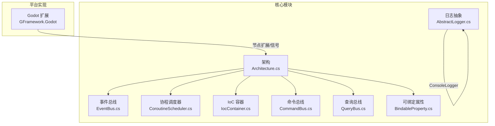
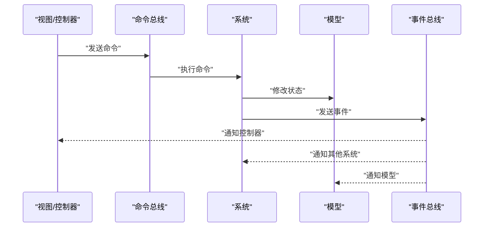
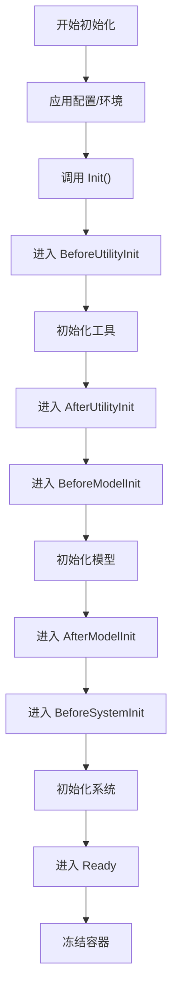
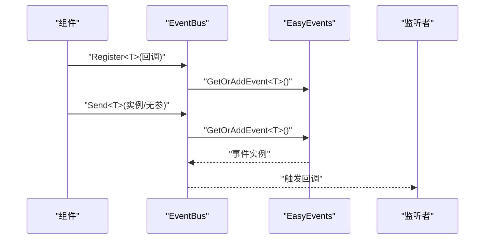
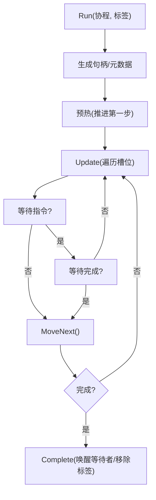
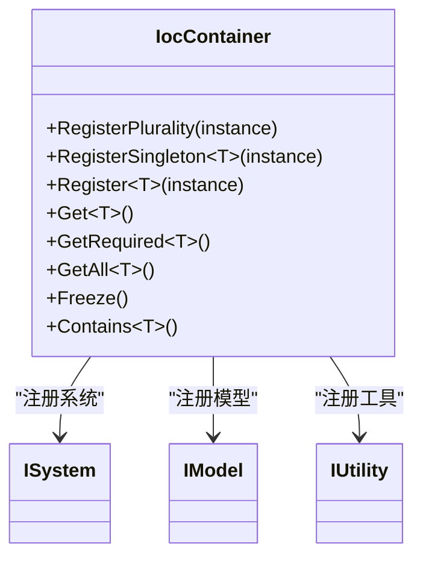
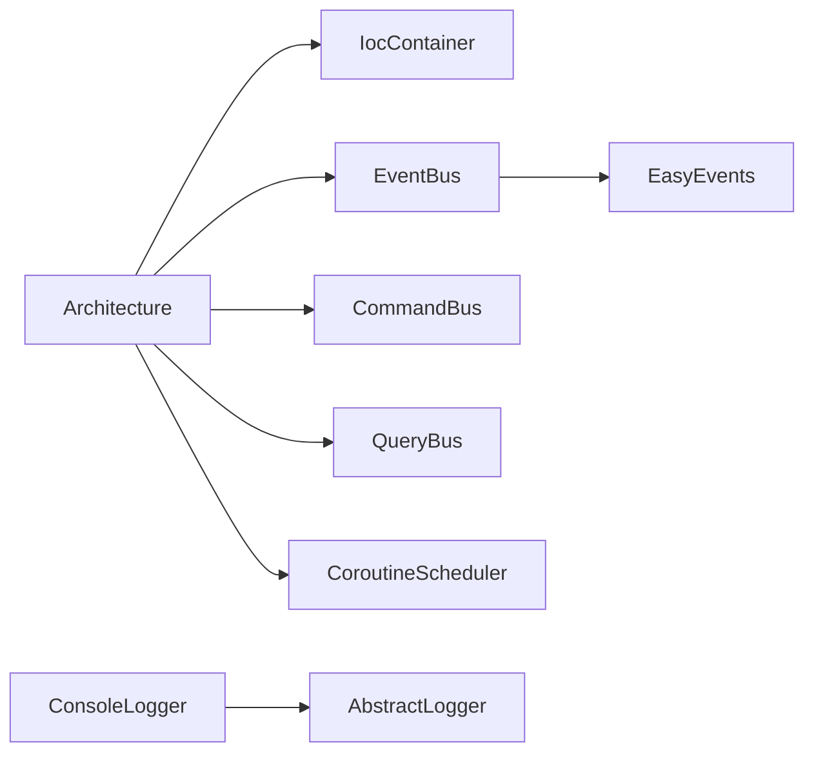

# 故障排除和调试

<cite>
**本文引用的文件**
- [README.md](file://README.md)
- [GFramework.Core/README.md](file://GFramework.Core/README.md)
- [GFramework.Core/architecture/Architecture.cs](file://GFramework.Core/architecture/Architecture.cs)
- [GFramework.Core/events/EventBus.cs](file://GFramework.Core/events/EventBus.cs)
- [GFramework.Core/coroutine/CoroutineScheduler.cs](file://GFramework.Core/coroutine/CoroutineScheduler.cs)
- [GFramework.Core/coroutine/CoroutineHandle.cs](file://GFramework.Core/coroutine/CoroutineHandle.cs)
- [GFramework.Core/ioc/IocContainer.cs](file://GFramework.Core/ioc/IocContainer.cs)
- [GFramework.Core/command/CommandBus.cs](file://GFramework.Core/command/CommandBus.cs)
- [GFramework.Core/query/QueryBus.cs](file://GFramework.Core/query/QueryBus.cs)
- [GFramework.Core/logging/AbstractLogger.cs](file://GFramework.Core/logging/AbstractLogger.cs)
- [GFramework.Core/logging/ConsoleLogger.cs](file://GFramework.Core/logging/ConsoleLogger.cs)
- [GFramework.Core/logging/ConsoleLoggerFactory.cs](file://GFramework.Core/logging/ConsoleLoggerFactory.cs)
- [GFramework.Core/property/BindableProperty.cs](file://GFramework.Core/property/BindableProperty.cs)
</cite>

## 目录
1. [简介](#简介)
2. [项目结构](#项目结构)
3. [核心组件](#核心组件)
4. [架构总览](#架构总览)
5. [详细组件分析](#详细组件分析)
6. [依赖分析](#依赖分析)
7. [性能考虑](#性能考虑)
8. [故障排除指南](#故障排除指南)
9. [结论](#结论)
10. [附录](#附录)

## 简介
本指南面向使用 GFramework 的开发者，聚焦于常见问题的系统性排查与调试，涵盖架构初始化、事件处理、协程执行、依赖注入等模块的故障定位方法；同时提供日志配置、断点调试、性能分析与内存泄漏检测等实用技巧，以及生产环境应急处理流程与错误消息解读。

## 项目结构
GFramework 采用分层与模块化设计，核心模块位于 GFramework.Core，平台特定实现位于 GFramework.Godot，源码生成器位于 GFramework.SourceGenerators。下图展示与故障排除密切相关的关键模块与交互：

图表来源
- [GFramework.Core/architecture/Architecture.cs](file://GFramework.Core/architecture/Architecture.cs#L1-L569)
- [GFramework.Core/events/EventBus.cs](file://GFramework.Core/events/EventBus.cs#L1-L55)
- [GFramework.Core/coroutine/CoroutineScheduler.cs](file://GFramework.Core/coroutine/CoroutineScheduler.cs#L1-L392)
- [GFramework.Core/ioc/IocContainer.cs](file://GFramework.Core/ioc/IocContainer.cs#L1-L373)
- [GFramework.Core/command/CommandBus.cs](file://GFramework.Core/command/CommandBus.cs#L1-L62)
- [GFramework.Core/query/QueryBus.cs](file://GFramework.Core/query/QueryBus.cs#L1-L23)
- [GFramework.Core/property/BindableProperty.cs](file://GFramework.Core/property/BindableProperty.cs#L1-L135)
- [GFramework.Core/logging/AbstractLogger.cs](file://GFramework.Core/logging/AbstractLogger.cs#L1-L493)

章节来源
- [README.md](file://README.md#L235-L283)
- [GFramework.Core/README.md](file://GFramework.Core/README.md#L40-L108)

## 核心组件
- 架构（Architecture）：统一生命周期管理、阶段转换、组件注册与初始化、销毁流程。
- 事件总线（EventBus）：类型安全事件发布/订阅，支持全局事件管理。
- 协程调度器（CoroutineScheduler）：协程运行、暂停、恢复、终止、按标签清理。
- IoC 容器（IocContainer）：注册/获取实例、冻结保护、并发安全。
- 命令/查询总线（CommandBus/QueryBus）：封装写/读操作的执行入口。
- 可绑定属性（BindableProperty）：响应式数据绑定与变更通知。
- 日志系统（AbstractLogger/ConsoleLogger/ConsoleLoggerFactory）：结构化日志、级别过滤、彩色输出。

章节来源
- [GFramework.Core/architecture/Architecture.cs](file://GFramework.Core/architecture/Architecture.cs#L135-L398)
- [GFramework.Core/events/EventBus.cs](file://GFramework.Core/events/EventBus.cs#L1-L55)
- [GFramework.Core/coroutine/CoroutineScheduler.cs](file://GFramework.Core/coroutine/CoroutineScheduler.cs#L1-L392)
- [GFramework.Core/ioc/IocContainer.cs](file://GFramework.Core/ioc/IocContainer.cs#L1-L373)
- [GFramework.Core/command/CommandBus.cs](file://GFramework.Core/command/CommandBus.cs#L1-L62)
- [GFramework.Core/query/QueryBus.cs](file://GFramework.Core/query/QueryBus.cs#L1-L23)
- [GFramework.Core/property/BindableProperty.cs](file://GFramework.Core/property/BindableProperty.cs#L1-L135)
- [GFramework.Core/logging/AbstractLogger.cs](file://GFramework.Core/logging/AbstractLogger.cs#L1-L493)
- [GFramework.Core/logging/ConsoleLogger.cs](file://GFramework.Core/logging/ConsoleLogger.cs#L1-L81)
- [GFramework.Core/logging/ConsoleLoggerFactory.cs](file://GFramework.Core/logging/ConsoleLoggerFactory.cs#L1-L20)

## 架构总览
下图展示典型“命令-事件-系统-模型”的执行链路，便于定位事件未到达、命令未执行、系统未响应等问题：

图表来源
- [GFramework.Core/command/CommandBus.cs](file://GFramework.Core/command/CommandBus.cs#L1-L62)
- [GFramework.Core/events/EventBus.cs](file://GFramework.Core/events/EventBus.cs#L1-L55)
- [GFramework.Core/architecture/Architecture.cs](file://GFramework.Core/architecture/Architecture.cs#L350-L398)

## 详细组件分析

### 架构初始化与生命周期
- 关键点
  - 初始化阶段顺序：工具 → 模型 → 系统 → 就绪；阶段转换受配置与常量约束。
  - 组件注册时机：初始化前可注册，就绪后可配置是否允许晚注册。
  - 销毁流程：按注册逆序销毁，捕获单个组件异常并继续销毁。
- 常见问题
  - 阶段转换非法：检查配置与阶段常量映射。
  - 就绪后注册组件：根据配置抛出异常。
  - 组件未初始化：确认 Init() 是否正确注册并进入相应阶段。
- 调试建议
  - 在 Initialize()/InitializeAsync() 前后设置断点，观察阶段变化与日志。
  - 使用日志级别提升到 Debug/Trace，查看组件注册与初始化明细。

图表来源
- [GFramework.Core/architecture/Architecture.cs](file://GFramework.Core/architecture/Architecture.cs#L526-L566)

章节来源
- [GFramework.Core/architecture/Architecture.cs](file://GFramework.Core/architecture/Architecture.cs#L135-L398)

### 事件系统与事件处理
- 关键点
  - EventBus 提供 Send/Register/UnRegister，支持泛型事件自动创建与检索。
  - EasyEvents 作为全局事件管理器，按类型缓存事件实例。
- 常见问题
  - 事件未触发：检查事件类型是否正确、是否在正确阶段注册、是否被注销。
  - 事件重复：确认 UnRegister 是否与 Register 成对出现。
  - 泛型事件缺失构造函数：Send<T>() 要求 T 具有无参构造。
- 调试建议
  - 在注册与发送处设置断点，核对事件类型与回调。
  - 使用 UnRegisterList 统一管理注销，避免遗漏。

图表来源
- [GFramework.Core/events/EventBus.cs](file://GFramework.Core/events/EventBus.cs#L1-L55)
- [GFramework.Core/events/EasyEvents.cs](file://GFramework.Core/events/EasyEvents.cs#L1-L85)

章节来源
- [GFramework.Core/events/EventBus.cs](file://GFramework.Core/events/EventBus.cs#L1-L55)
- [GFramework.Core/events/EasyEvents.cs](file://GFramework.Core/events/EasyEvents.cs#L1-L85)

### 协程执行与调度
- 关键点
  - 协程句柄唯一标识，支持暂停/恢复/终止/按标签清理。
  - 调度器按时间片推进协程，处理等待指令与异常。
- 常见问题
  - 协程卡住：检查等待指令是否完成、是否被其他协程持有。
  - 句柄无效：确认 Run 返回的句柄是否有效、是否被提前回收。
  - 异常吞没：OnError 会打印异常并完成协程，需检查控制台输出。
- 调试建议
  - 使用 ActiveCoroutineCount 与标签追踪协程生命周期。
  - 对长时间运行的协程设置超时或阶段性日志。

图表来源
- [GFramework.Core/coroutine/CoroutineScheduler.cs](file://GFramework.Core/coroutine/CoroutineScheduler.cs#L37-L121)
- [GFramework.Core/coroutine/CoroutineHandle.cs](file://GFramework.Core/coroutine/CoroutineHandle.cs#L1-L94)

章节来源
- [GFramework.Core/coroutine/CoroutineScheduler.cs](file://GFramework.Core/coroutine/CoroutineScheduler.cs#L1-L392)
- [GFramework.Core/coroutine/CoroutineHandle.cs](file://GFramework.Core/coroutine/CoroutineHandle.cs#L1-L94)

### 依赖注入与容器
- 关键点
  - RegisterPlurality 将实例注册到其实现的所有接口与具体类型。
  - Freeze 后禁止注册，避免运行期变更。
  - Get/GetRequired/GetAll 提供不同粒度的获取策略。
- 常见问题
  - “容器已冻结”：在架构 Ready 后尝试注册。
  - “未注册实例/多个实例”：GetRequired 会在 0 或 >1 时抛出异常。
  - 多次注册导致重复：确认 RegisterPlurality 的调用次数。
- 调试建议
  - 在 Freeze 前后分别记录注册清单，定位异常注册点。
  - 使用 GetAllSorted 按策略排序获取实例，辅助调试。

图表来源
- [GFramework.Core/ioc/IocContainer.cs](file://GFramework.Core/ioc/IocContainer.cs#L1-L373)

章节来源
- [GFramework.Core/ioc/IocContainer.cs](file://GFramework.Core/ioc/IocContainer.cs#L1-L373)

### 命令与查询执行
- 关键点
  - CommandBus 支持同步/异步命令执行，参数校验严格。
  - QueryBus 直接调用查询的 Do() 返回结果。
- 常见问题
  - 命令为空：Send 会抛出空引用异常。
  - 查询未返回预期结果：检查查询实现与输入。
- 调试建议
  - 在命令/查询的 OnExecute/Do 前后设置断点，核对输入与输出。

章节来源
- [GFramework.Core/command/CommandBus.cs](file://GFramework.Core/command/CommandBus.cs#L1-L62)
- [GFramework.Core/query/QueryBus.cs](file://GFramework.Core/query/QueryBus.cs#L1-L23)

### 可绑定属性与数据绑定
- 关键点
  - Value 设置时比较新旧值，相等则跳过；支持自定义比较器。
  - Register/UnRegister 管理变更回调；RegisterWithInitValue 立即触发一次回调。
- 常见问题
  - 回调未触发：确认是否注册、是否被注销、值是否真正改变。
  - 性能问题：大量小值频繁变更可考虑合并更新。
- 调试建议
  - 使用 RegisterWithInitValue 验证初始值与回调链路。

章节来源
- [GFramework.Core/property/BindableProperty.cs](file://GFramework.Core/property/BindableProperty.cs#L1-L135)

### 日志系统与调试
- 关键点
  - AbstractLogger 提供级别判断与格式化；ConsoleLogger 输出到控制台并支持彩色。
  - ConsoleLoggerFactory 创建 ConsoleLogger，可指定最小级别。
- 常见问题
  - 日志级别过低：调整最小级别以显示 Debug/Trace。
  - 输出无颜色：检查 writer 是否为 Console.Out。
- 调试建议
  - 在关键路径调用 Info/Debug/Trace，配合断点逐步验证。
  - 生产环境可切换到更高日志级别以减少开销。

章节来源
- [GFramework.Core/logging/AbstractLogger.cs](file://GFramework.Core/logging/AbstractLogger.cs#L1-L493)
- [GFramework.Core/logging/ConsoleLogger.cs](file://GFramework.Core/logging/ConsoleLogger.cs#L1-L81)
- [GFramework.Core/logging/ConsoleLoggerFactory.cs](file://GFramework.Core/logging/ConsoleLoggerFactory.cs#L1-L20)

## 依赖分析
- 组件耦合
  - Architecture 依赖 IoC 容器、事件总线、环境与服务，形成中心枢纽。
  - CommandBus/QueryBus 依赖具体命令/查询实现，保持解耦。
  - EventBus/EasyEvents 为全局事件通道，降低模块间耦合。
- 外部依赖
  - 平台特定扩展（如 Godot）通过扩展方法接入，不影响 Core 模块。
- 潜在循环依赖
  - 通过接口与总线解耦，避免直接循环引用。

图表来源
- [GFramework.Core/architecture/Architecture.cs](file://GFramework.Core/architecture/Architecture.cs#L1-L569)
- [GFramework.Core/events/EventBus.cs](file://GFramework.Core/events/EventBus.cs#L1-L55)
- [GFramework.Core/coroutine/CoroutineScheduler.cs](file://GFramework.Core/coroutine/CoroutineScheduler.cs#L1-L392)
- [GFramework.Core/ioc/IocContainer.cs](file://GFramework.Core/ioc/IocContainer.cs#L1-L373)
- [GFramework.Core/command/CommandBus.cs](file://GFramework.Core/command/CommandBus.cs#L1-L62)
- [GFramework.Core/query/QueryBus.cs](file://GFramework.Core/query/QueryBus.cs#L1-L23)
- [GFramework.Core/logging/AbstractLogger.cs](file://GFramework.Core/logging/AbstractLogger.cs#L1-L493)
- [GFramework.Core/logging/ConsoleLogger.cs](file://GFramework.Core/logging/ConsoleLogger.cs#L1-L81)

## 性能考虑
- CPU 使用率
  - 协程调度器 Update 需在主循环中调用；避免在 Update 中执行重型任务。
  - 使用日志级别限制与异步化（IAsyncInitializable）降低主线程压力。
- 内存占用
  - 使用 UnRegisterList 统一注销事件与属性回调，防止对象无法回收。
  - 容器冻结后避免动态注册，减少运行期开销。
- 网络延迟
  - 事件与命令为本地调用，网络相关问题不在 Core 范畴；如需网络，建议在应用层封装适配器并通过事件/查询桥接。

[本节为通用指导，无需列出章节来源]

## 故障排除指南

### 架构初始化问题
- 症状
  - 初始化失败、阶段转换异常、组件未注册。
- 排查步骤
  - 检查 Init() 是否正确注册系统/模型/工具。
  - 查看阶段转换日志，确认是否违反阶段约束。
  - 确认 Late Registration 配置是否允许在 Ready 后注册。
  - 如发生异常，查看 FailedInitialization 阶段与事件通知。
- 相关实现
  - 阶段转换与通知、组件注册与生命周期、销毁流程。

章节来源
- [GFramework.Core/architecture/Architecture.cs](file://GFramework.Core/architecture/Architecture.cs#L135-L398)

### 事件处理问题
- 症状
  - 事件未触发、重复触发、回调未注销。
- 排查步骤
  - 核对事件类型与泛型约束，确保 Send<T>() 的 T 具备无参构造。
  - 使用 UnRegisterList 统一管理注销，避免遗漏。
  - 在注册与发送处设置断点，确认回调链路。
- 相关实现
  - EventBus 的 Register/Send/UnRegister 与 EasyEvents 的事件缓存。

章节来源
- [GFramework.Core/events/EventBus.cs](file://GFramework.Core/events/EventBus.cs#L1-L55)
- [GFramework.Core/events/EasyEvents.cs](file://GFramework.Core/events/EasyEvents.cs#L1-L85)

### 协程执行问题
- 症状
  - 协程卡住、句柄无效、异常未被捕获。
- 排查步骤
  - 检查等待指令是否完成，确认 WaitForCoroutine 的等待关系。
  - 使用 ActiveCoroutineCount 与 Kill/KillByTag 清理异常协程。
  - 查看控制台错误输出，定位异常协程。
- 相关实现
  - 协程句柄生成、调度器推进、错误处理与唤醒等待者。

章节来源
- [GFramework.Core/coroutine/CoroutineScheduler.cs](file://GFramework.Core/coroutine/CoroutineScheduler.cs#L1-L392)
- [GFramework.Core/coroutine/CoroutineHandle.cs](file://GFramework.Core/coroutine/CoroutineHandle.cs#L1-L94)

### 依赖注入问题
- 症状
  - “容器已冻结”、“未注册实例”、“多个实例”。
- 排查步骤
  - 确认在 Freeze 前完成所有注册。
  - 使用 GetRequired 精确获取单例，避免歧义。
  - 使用 GetAllSorted 按策略排序获取实例。
- 相关实现
  - RegisterPlurality、Get/GetRequired/GetAll、Freeze。

章节来源
- [GFramework.Core/ioc/IocContainer.cs](file://GFramework.Core/ioc/IocContainer.cs#L1-L373)

### 命令与查询问题
- 症状
  - 命令执行异常、查询无返回或返回错误。
- 排查步骤
  - 校验命令/查询参数非空，确认 OnExecute/Do 的实现。
  - 在命令/查询前后设置断点，核对输入与输出。
- 相关实现
  - CommandBus/QueryBus 的 Send/SendAsync 与 Do。

章节来源
- [GFramework.Core/command/CommandBus.cs](file://GFramework.Core/command/CommandBus.cs#L1-L62)
- [GFramework.Core/query/QueryBus.cs](file://GFramework.Core/query/QueryBus.cs#L1-L23)

### 可绑定属性问题
- 症状
  - 回调未触发、初始值未回放、值未变化。
- 排查步骤
  - 使用 RegisterWithInitValue 验证初始值。
  - 检查自定义比较器是否导致相等判断异常。
- 相关实现
  - Value 设置逻辑与回调触发。

章节来源
- [GFramework.Core/property/BindableProperty.cs](file://GFramework.Core/property/BindableProperty.cs#L1-L135)

### 日志配置与调试技巧
- 日志级别
  - 使用 ConsoleLoggerFactory 创建日志器，设置最小级别。
  - 在 Debug/Trace 级别输出详细初始化与组件注册信息。
- 断点调试
  - 在 Initialize/Destroy、事件注册/发送、协程 Run/Update、容器注册/获取等关键点设置断点。
- 性能分析
  - 使用系统性能监视器观察 CPU/内存；在高负载路径增加日志采样。
- 内存泄漏检测
  - 使用 UnRegisterList 统一注销事件与属性回调。
  - 定期调用 CoroutineScheduler.Clear/Kill/KillByTag 清理协程。

章节来源
- [GFramework.Core/logging/AbstractLogger.cs](file://GFramework.Core/logging/AbstractLogger.cs#L1-L493)
- [GFramework.Core/logging/ConsoleLogger.cs](file://GFramework.Core/logging/ConsoleLogger.cs#L1-L81)
- [GFramework.Core/logging/ConsoleLoggerFactory.cs](file://GFramework.Core/logging/ConsoleLoggerFactory.cs#L1-L20)
- [GFramework.Core/coroutine/CoroutineScheduler.cs](file://GFramework.Core/coroutine/CoroutineScheduler.cs#L237-L254)

### 开发环境配置问题
- NuGet 包冲突
  - 确保仅安装官方包：GeWuYou.GFramework.*，避免混用第三方版本。
- 版本兼容性
  - Core 模块要求 .NET 6+；Godot 集成需匹配 Godot 4.5+。
- 构建问题
  - 检查项目 SDK 与 TargetFramework；确保 Source Generators 正确启用。

[本节为通用指导，无需列出章节来源]

### 生产环境排查与应急处理
- 排查流程
  - 快速降级：临时关闭高开销功能（如详细日志、高频事件）。
  - 采集证据：保留日志、快照、堆栈信息。
  - 逐步回滚：按模块回滚最近变更，定位引入问题的提交。
- 应急处理
  - 通过事件总线发送“降级事件”，系统收到后进入降级模式。
  - 使用协程清理队列与缓存，释放资源。

[本节为通用指导，无需列出章节来源]

### 常见错误消息与解决步骤
- “Invalid phase transition”
  - 检查阶段转换是否在允许列表内，必要时放宽 StrictPhaseValidation。
- “Cannot register X after Architecture is Ready”
  - 将注册移动到 Init() 或允许 Late Registration。
- “IocContainer is frozen”
  - 避免在 Ready 后注册；使用 Freeze 前完成所有注册。
- “No instance registered for X”
  - 检查 RegisterPlurality 是否正确调用；确认接口与具体类型均注册。
- “Multiple instances registered for X”
  - 使用 GetRequired 精确获取；或调整注册策略为单例。
- “Coroutine cannot wait for itself.”
  - 检查 WaitForCoroutine 的参数，避免自等待。
- “Error destroying X”
  - 捕获并记录异常，继续销毁其他组件，避免连锁失败。

章节来源
- [GFramework.Core/architecture/Architecture.cs](file://GFramework.Core/architecture/Architecture.cs#L164-L183)
- [GFramework.Core/architecture/Architecture.cs](file://GFramework.Core/architecture/Architecture.cs#L407-L414)
- [GFramework.Core/ioc/IocContainer.cs](file://GFramework.Core/ioc/IocContainer.cs#L75-L98)
- [GFramework.Core/ioc/IocContainer.cs](file://GFramework.Core/ioc/IocContainer.cs#L240-L259)
- [GFramework.Core/coroutine/CoroutineScheduler.cs](file://GFramework.Core/coroutine/CoroutineScheduler.cs#L192-L196)
- [GFramework.Core/coroutine/CoroutineScheduler.cs](file://GFramework.Core/coroutine/CoroutineScheduler.cs#L341-L345)

## 结论
通过掌握架构生命周期、事件总线、协程调度、IoC 容器与日志系统的工作原理，开发者可以高效定位与修复大多数运行时问题。建议在开发阶段即建立完善的日志与断点策略，在生产环境采用渐进式降级与快速回滚机制，确保稳定性与可维护性。

[本节为总结性内容，无需列出章节来源]

## 附录
- 社区支持与问题报告
  - 通过仓库 Issues 提交问题，附带最小可复现工程、日志与环境信息。
  - 参考文档与教程以确保版本与用法一致。
- 快速检查清单
  - 初始化：阶段顺序、Late Registration、冻结时机。
  - 事件：类型一致性、注册/注销成对、全局事件缓存。
  - 协程：等待链路、句柄有效性、异常处理。
  - 容器：注册时机、GetRequired 精准获取、冻结保护。
  - 日志：级别设置、输出目标、异常附加信息。

[本节为通用指导，无需列出章节来源]