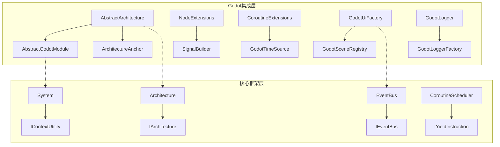
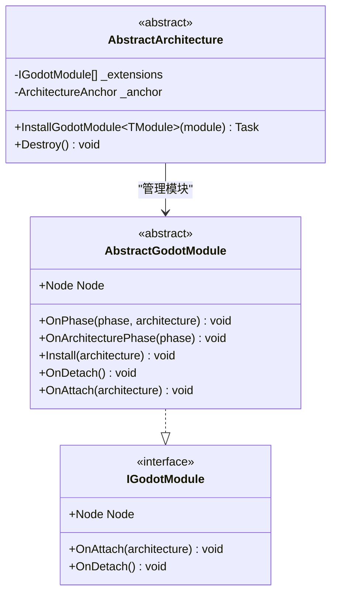
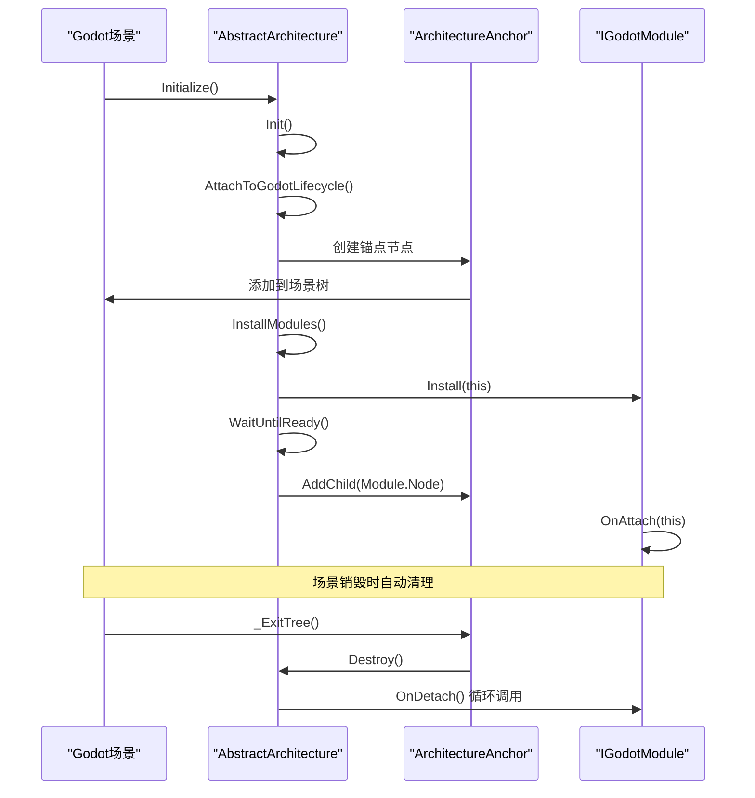
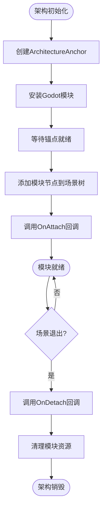
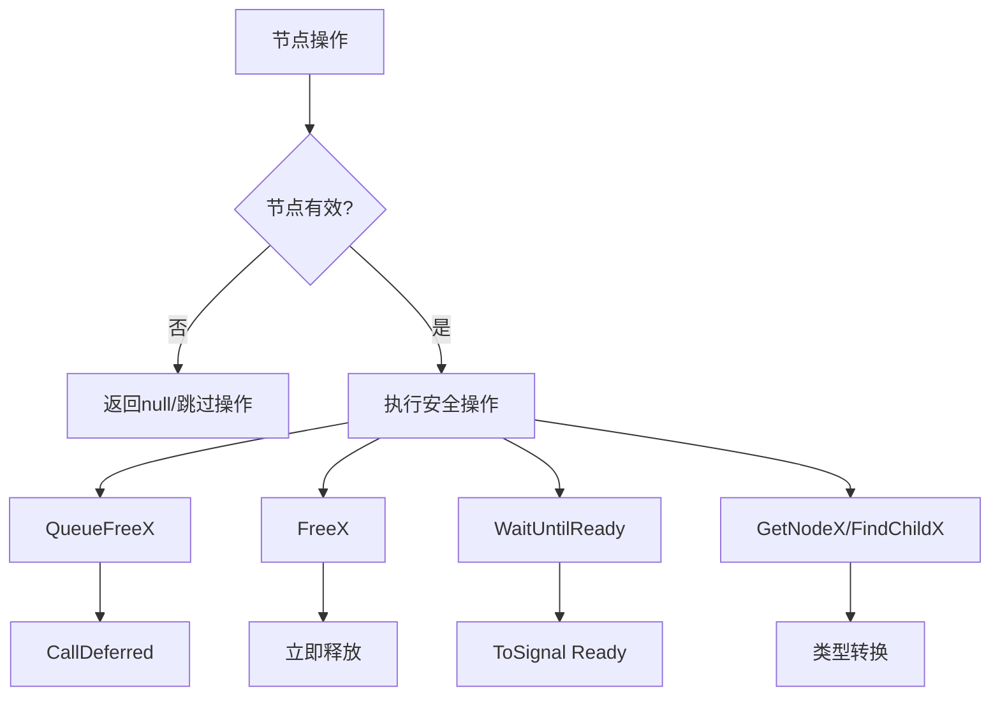
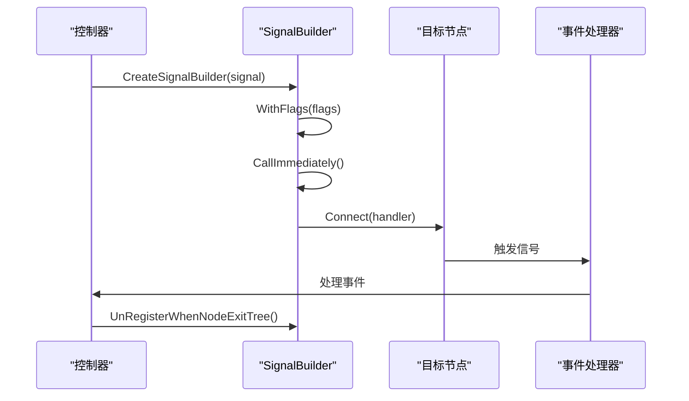
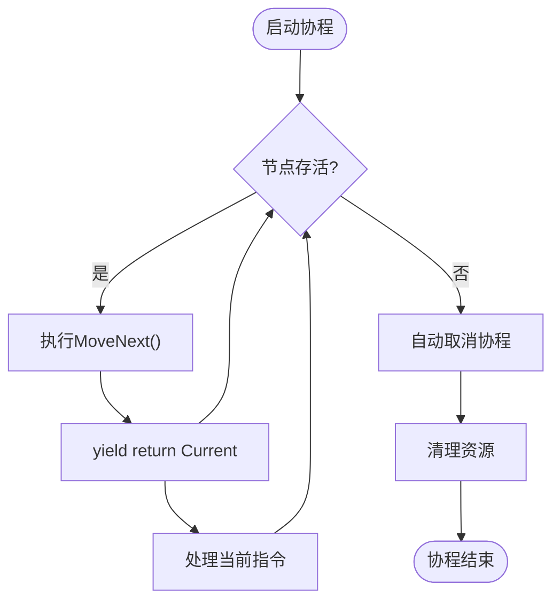
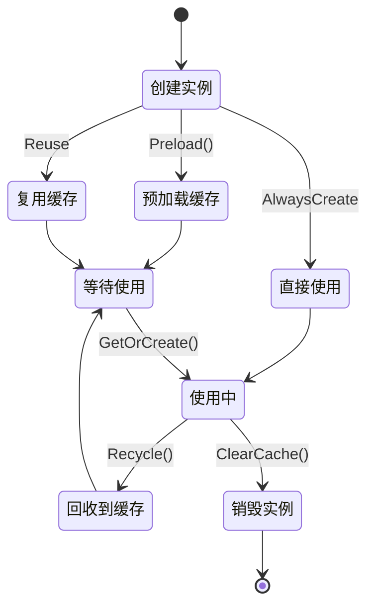
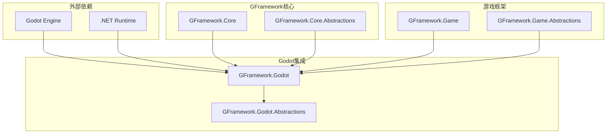

# Godot集成教程

<cite>
**本文档引用的文件**
- [GFramework.Godot/README.md](file://GFramework.Godot/README.md)
- [GFramework.Godot/architecture/AbstractGodotModule.cs](file://GFramework.Godot/architecture/AbstractGodotModule.cs)
- [GFramework.Godot/architecture/AbstractArchitecture.cs](file://GFramework.Godot/architecture/AbstractArchitecture.cs)
- [GFramework.Godot/architecture/IGodotModule.cs](file://GFramework.Godot/architecture/IGodotModule.cs)
- [GFramework.Godot/architecture/ArchitectureAnchor.cs](file://GFramework.Godot/architecture/ArchitectureAnchor.cs)
- [GFramework.Godot/extensions/NodeExtensions.cs](file://GFramework.Godot/extensions/NodeExtensions.cs)
- [GFramework.Godot/extensions/signal/SignalBuilder.cs](file://GFramework.Godot/extensions/signal/SignalBuilder.cs)
- [GFramework.Godot/coroutine/CoroutineExtensions.cs](file://GFramework.Godot/coroutine/CoroutineExtensions.cs)
- [GFramework.Godot/pool/AbstractNodePoolSystem.cs](file://GFramework.Godot/pool/AbstractNodePoolSystem.cs)
- [GFramework.Godot/ui/GodotUiFactory.cs](file://GFramework.Godot/ui/GodotUiFactory.cs)
- [GFramework.Godot/scene/GodotSceneRegistry.cs](file://GFramework.Godot/scene/GodotSceneRegistry.cs)
- [GFramework.Godot/logging/GodotLogger.cs](file://GFramework.Godot/logging/GodotLogger.cs)
- [docs/tutorials/godot-integration.md](file://docs/tutorials/godot-integration.md)
- [docs/tutorials/getting-started.md](file://docs/tutorials/getting-started.md)
</cite>

## 目录
1. [简介](#简介)
2. [项目结构](#项目结构)
3. [核心组件](#核心组件)
4. [架构概览](#架构概览)
5. [详细组件分析](#详细组件分析)
6. [依赖关系分析](#依赖关系分析)
7. [性能考虑](#性能考虑)
8. [故障排除指南](#故障排除指南)
9. [结论](#结论)
10. [附录](#附录)

## 简介
本教程面向希望在Godot引擎中集成GFramework的开发者，提供从项目设置到高级特性的完整指导。GFramework.Godot将框架的架构优势与Godot引擎的节点系统、信号机制和场景管理能力深度融合，为开发者提供类型安全、性能优化且开发高效的解决方案。

## 项目结构
GFramework.Godot采用模块化架构设计，主要包含以下核心模块：



**图表来源**
- [GFramework.Godot/architecture/AbstractArchitecture.cs](file://GFramework.Godot/architecture/AbstractArchitecture.cs#L14-L19)
- [GFramework.Godot/architecture/AbstractGodotModule.cs](file://GFramework.Godot/architecture/AbstractGodotModule.cs#L11-L16)

**章节来源**
- [GFramework.Godot/README.md](file://GFramework.Godot/README.md#L66-L97)
- [docs/tutorials/getting-started.md](file://docs/tutorials/getting-started.md#L68-L163)

## 核心组件

### AbstractGodotModule - Godot模块基类
AbstractGodotModule是Godot模块系统的核心抽象基类，定义了模块与Godot节点的集成接口：



**图表来源**
- [GFramework.Godot/architecture/AbstractGodotModule.cs](file://GFramework.Godot/architecture/AbstractGodotModule.cs#L11-L55)
- [GFramework.Godot/architecture/IGodotModule.cs](file://GFramework.Godot/architecture/IGodotModule.cs#L10-L27)

**章节来源**
- [GFramework.Godot/architecture/AbstractGodotModule.cs](file://GFramework.Godot/architecture/AbstractGodotModule.cs#L8-L55)
- [GFramework.Godot/architecture/IGodotModule.cs](file://GFramework.Godot/architecture/IGodotModule.cs#L7-L27)

### AbstractArchitecture - 架构生命周期管理
AbstractArchitecture负责将GFramework架构与Godot生命周期无缝集成：



**图表来源**
- [GFramework.Godot/architecture/AbstractArchitecture.cs](file://GFramework.Godot/architecture/AbstractArchitecture.cs#L56-L139)
- [GFramework.Godot/architecture/ArchitectureAnchor.cs](file://GFramework.Godot/architecture/ArchitectureAnchor.cs#L29-L34)

**章节来源**
- [GFramework.Godot/architecture/AbstractArchitecture.cs](file://GFramework.Godot/architecture/AbstractArchitecture.cs#L14-L140)

## 架构概览

### Godot模块系统集成流程
GFramework.Godot提供完整的模块化架构系统，支持Godot特有的节点生命周期管理：



**图表来源**
- [GFramework.Godot/architecture/AbstractArchitecture.cs](file://GFramework.Godot/architecture/AbstractArchitecture.cs#L100-L119)
- [GFramework.Godot/architecture/AbstractGodotModule.cs](file://GFramework.Godot/architecture/AbstractGodotModule.cs#L44-L54)

**章节来源**
- [GFramework.Godot/README.md](file://GFramework.Godot/README.md#L99-L142)

## 详细组件分析

### 节点扩展系统
GFramework.Godot提供50+个实用的Node扩展方法，大幅简化Godot开发中的常见操作：

#### 安全节点操作扩展


**图表来源**
- [GFramework.Godot/extensions/NodeExtensions.cs](file://GFramework.Godot/extensions/NodeExtensions.cs#L14-L82)

**章节来源**
- [GFramework.Godot/extensions/NodeExtensions.cs](file://GFramework.Godot/extensions/NodeExtensions.cs#L8-L259)

### 信号系统集成
SignalBuilder提供流畅的信号连接API，支持类型安全的信号管理：

#### SignalBuilder使用流程


**图表来源**
- [GFramework.Godot/extensions/signal/SignalBuilder.cs](file://GFramework.Godot/extensions/signal/SignalBuilder.cs#L10-L65)

**章节来源**
- [GFramework.Godot/extensions/signal/SignalBuilder.cs](file://GFramework.Godot/extensions/signal/SignalBuilder.cs#L8-L65)

### 协程调度系统
GFramework.Godot的协程系统与Godot的生命周期深度集成：

#### 协程取消机制


**图表来源**
- [GFramework.Godot/coroutine/CoroutineExtensions.cs](file://GFramework.Godot/coroutine/CoroutineExtensions.cs#L23-L54)

**章节来源**
- [GFramework.Godot/coroutine/CoroutineExtensions.cs](file://GFramework.Godot/coroutine/CoroutineExtensions.cs#L7-L66)

### UI系统架构
GodotUiFactory提供完整的UI页面管理功能，支持多种缓存策略：

#### UI实例管理流程


**图表来源**
- [GFramework.Godot/ui/GodotUiFactory.cs](file://GFramework.Godot/ui/GodotUiFactory.cs#L67-L97)
- [GFramework.Godot/ui/GodotUiFactory.cs](file://GFramework.Godot/ui/GodotUiFactory.cs#L136-L157)

**章节来源**
- [GFramework.Godot/ui/GodotUiFactory.cs](file://GFramework.Godot/ui/GodotUiFactory.cs#L16-L463)

### 资源管理系统
Godot场景注册表提供类型安全的场景管理功能：

**章节来源**
- [GFramework.Godot/scene/GodotSceneRegistry.cs](file://GFramework.Godot/scene/GodotSceneRegistry.cs#L11-L12)

## 依赖关系分析

### 模块间依赖关系


**图表来源**
- [GFramework.Godot/architecture/AbstractArchitecture.cs](file://GFramework.Godot/architecture/AbstractArchitecture.cs#L1-L6)
- [GFramework.Godot/architecture/AbstractGodotModule.cs](file://GFramework.Godot/architecture/AbstractGodotModule.cs#L1-L4)

**章节来源**
- [GFramework.Godot/architecture/AbstractArchitecture.cs](file://GFramework.Godot/architecture/AbstractArchitecture.cs#L1-L19)

## 性能考虑

### 节点池化策略
推荐使用AbstractNodePoolSystem管理高频创建的对象：

1. **预加载场景**：在初始化时预加载所有需要的场景
2. **批量创建**：使用Preload方法批量创建实例
3. **智能回收**：实现CanDespawn方法确保只有空闲实例被回收
4. **缓存配置**：根据UI类型设置合适的缓存大小和淘汰策略

### 资源管理优化
- 使用Godot的异步加载机制避免主线程阻塞
- 实现资源优先级队列，确保关键资源优先加载
- 定期清理未使用的资源，避免内存泄漏

## 故障排除指南

### 常见问题及解决方案

#### 模块未正确初始化
**问题**：模块的OnAttach方法没有被调用
**解决方案**：
1. 确保InstallGodotModule方法在InstallModules中正确调用
2. 检查模块的Node属性返回有效的Godot节点
3. 验证架构锚点已正确创建和添加到场景树

#### 信号连接泄漏
**问题**：节点销毁后信号处理器仍在执行
**解决方案**：
1. 使用UnRegisterWhenNodeExitTree方法自动清理
2. 避免使用传统的+=事件订阅方式
3. 确保所有信号连接都在节点生命周期内管理

#### 协程取消问题
**问题**：协程在节点销毁后仍在运行
**解决方案**：
1. 使用CancelWith扩展方法绑定节点生命周期
2. 在协程中定期检查节点存活状态
3. 实现适当的异常处理机制

**章节来源**
- [GFramework.Godot/README.md](file://GFramework.Godot/README.md#L723-L800)

## 结论
GFramework.Godot为Godot引擎提供了深度集成的架构解决方案，通过模块化设计、类型安全的API和完善的生命周期管理，帮助开发者构建高性能、可维护的游戏应用。建议在实际项目中遵循模块化设计原则，合理使用节点池化和资源管理策略，并充分利用SignalBuilder等工具提升开发效率。

## 附录

### 快速开始模板
```csharp
// 架构定义
public class MyGameArchitecture : AbstractArchitecture
{
    protected override void InstallModules()
    {
        InstallGodotModule(new InputModule());
        InstallGodotModule(new AudioManager());
    }
}

// 模块实现
public partial class InputModule : AbstractGodotModule
{
    public override Node Node => this;
    
    public override void Install(IArchitecture architecture)
    {
        architecture.RegisterSystem(new InputSystem());
    }
}
```

### 最佳实践清单
1. **模块化设计**：每个模块专注于单一功能领域
2. **生命周期管理**：始终使用自动清理机制
3. **类型安全**：利用GFramework的强类型特性
4. **性能优化**：合理使用池化和缓存策略
5. **错误处理**：实现完善的异常处理和日志记录