# 从零开始教程

<cite>
**本文档引用的文件**
- [README.md](file://README.md)
- [GFramework.Core/README.md](file://GFramework.Core/README.md)
- [GFramework.Core/GFramework.Core.csproj](file://GFramework.Core/GFramework.Core.csproj)
- [GFramework.Core.Abstractions/GFramework.Core.Abstractions.csproj](file://GFramework.Core.Abstractions/GFramework.Core.Abstractions.csproj)
- [GFramework.Game/README.md](file://GFramework.Game/README.md)
- [GFramework.Godot/README.md](file://GFramework.Godot/README.md)
- [GFramework.Core/architecture/Architecture.cs](file://GFramework.Core/architecture/Architecture.cs)
- [GFramework.Core/model/AbstractModel.cs](file://GFramework.Core/model/AbstractModel.cs)
- [GFramework.Core/system/AbstractSystem.cs](file://GFramework.Core/system/AbstractSystem.cs)
- [GFramework.Core/command/AbstractCommand.cs](file://GFramework.Core/command/AbstractCommand.cs)
- [GFramework.Core/query/AbstractQuery.cs](file://GFramework.Core/query/AbstractQuery.cs)
- [GFramework.Core/property/BindableProperty.cs](file://GFramework.Core/property/BindableProperty.cs)
- [GFramework.Core.Tests/system/TestSystem.cs](file://GFramework.Core.Tests/system/TestSystem.cs)
- [GFramework.Core.Tests/model/TestModel.cs](file://GFramework.Core.Tests/model/TestModel.cs)
</cite>

## 目录
1. [简介](#简介)
2. [项目结构](#项目结构)
3. [核心组件](#核心组件)
4. [架构概览](#架构概览)
5. [详细组件分析](#详细组件分析)
6. [依赖关系分析](#依赖关系分析)
7. [性能考虑](#性能考虑)
8. [故障排除指南](#故障排除指南)
9. [结论](#结论)
10. [附录](#附录)

## 简介
本教程面向希望使用GFramework从零开始创建游戏项目的开发者。GFramework是一个基于CQRS、MVC和事件驱动的轻量级游戏开发架构框架，提供与平台无关的核心模块以及针对Godot引擎的深度集成。本教程将涵盖环境准备、项目创建、架构设计、功能实现、测试验证和项目打包的完整流程。

## 项目结构
GFramework采用模块化设计，主要包含以下核心模块：

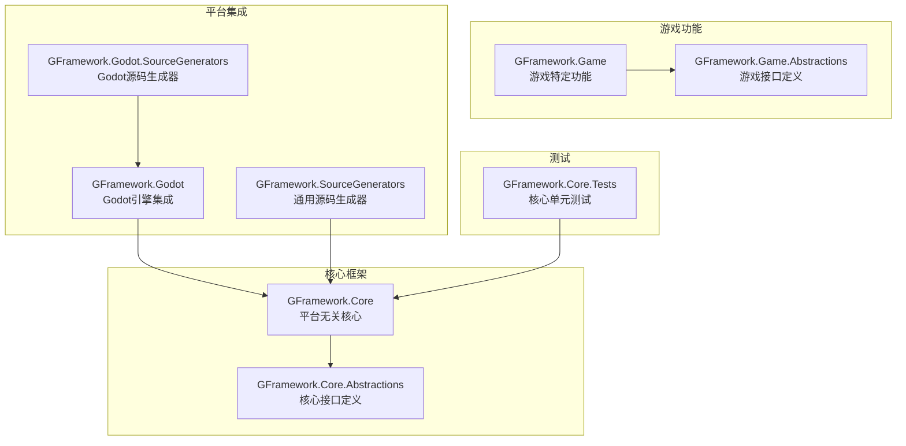

**图表来源**
- [GFramework.Core/GFramework.Core.csproj](file://GFramework.Core/GFramework.Core.csproj#L1-L13)
- [GFramework.Core.Abstractions/GFramework.Core.Abstractions.csproj](file://GFramework.Core.Abstractions/GFramework.Core.Abstractions.csproj#L1-L29)

**章节来源**
- [README.md](file://README.md#L1-L320)
- [GFramework.Core/README.md](file://GFramework.Core/README.md#L1-L508)

## 核心组件
GFramework的核心架构遵循清洁架构原则，包含五个主要层次：

### 五层架构设计
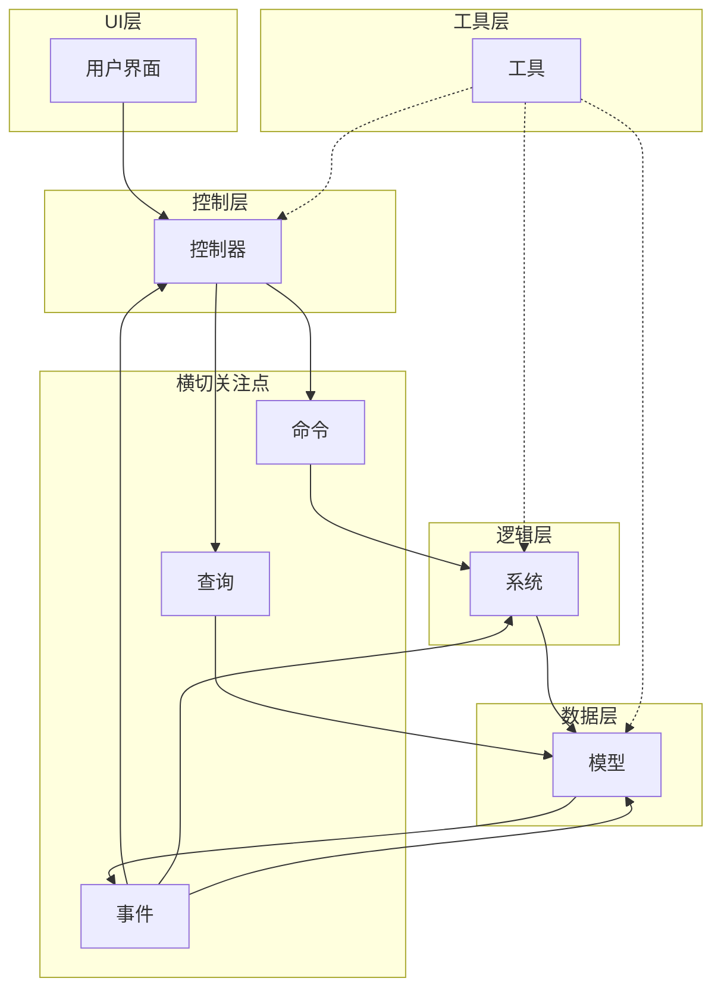

**图表来源**
- [GFramework.Core/README.md](file://GFramework.Core/README.md#L42-L108)

### 架构阶段管理
GFramework采用阶段化的生命周期管理模式：

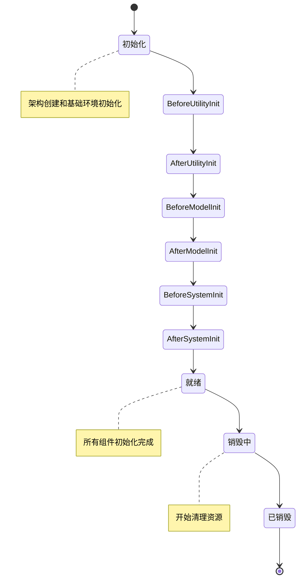

**图表来源**
- [GFramework.Core/README.md](file://GFramework.Core/README.md#L66-L71)

**章节来源**
- [GFramework.Core/README.md](file://GFramework.Core/README.md#L40-L108)

## 架构概览
GFramework的核心架构由Architecture基类提供统一的组件管理能力，支持模块化扩展和生命周期管理。

### 架构初始化流程
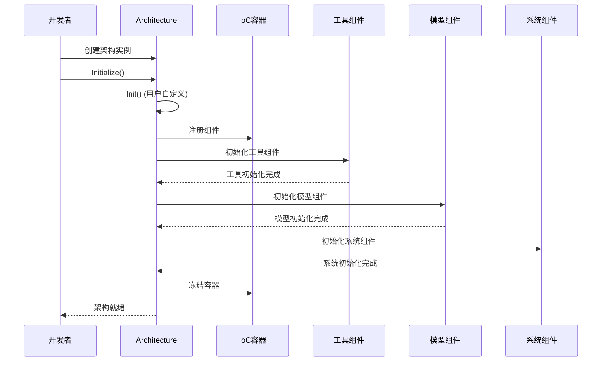

**图表来源**
- [GFramework.Core/architecture/Architecture.cs](file://GFramework.Core/architecture/Architecture.cs#L526-L566)

### 组件注册机制
架构提供统一的组件注册接口，支持系统、模型和工具的注册管理：

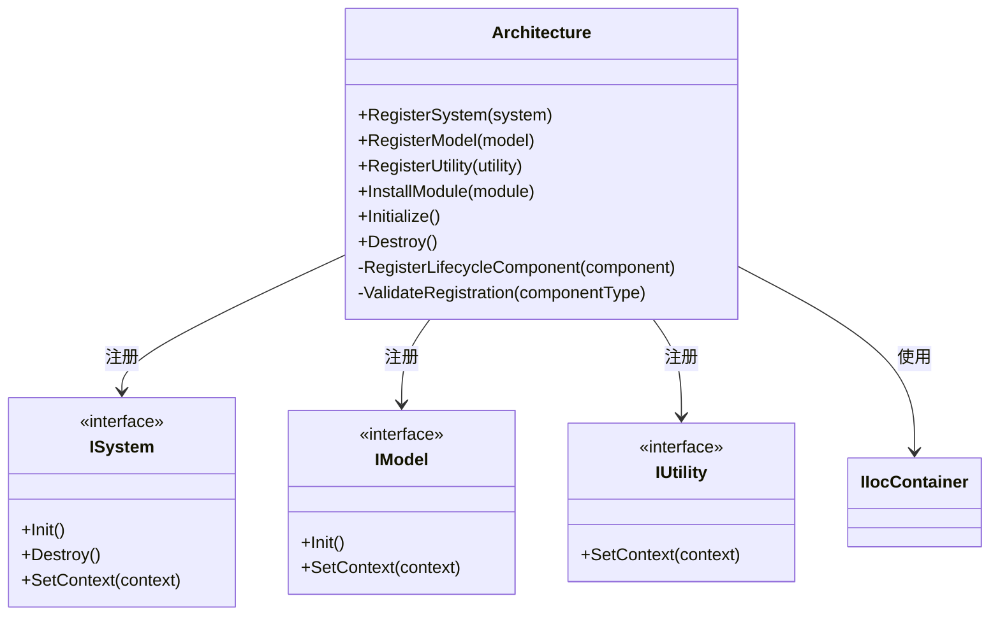

**图表来源**
- [GFramework.Core/architecture/Architecture.cs](file://GFramework.Core/architecture/Architecture.cs#L416-L483)

**章节来源**
- [GFramework.Core/architecture/Architecture.cs](file://GFramework.Core/architecture/Architecture.cs#L1-L569)

## 详细组件分析

### 模型层 (Model)
模型层负责存储和管理游戏状态，采用响应式编程设计。

#### 模型基类设计
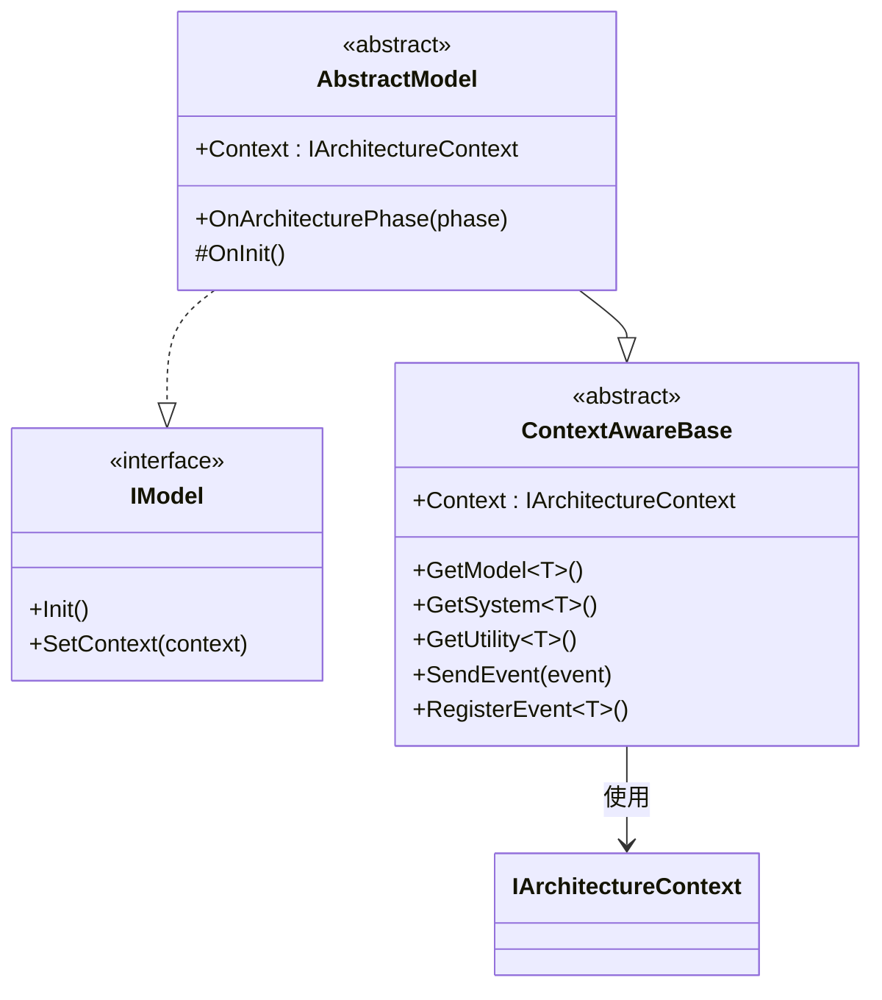

**图表来源**
- [GFramework.Core/model/AbstractModel.cs](file://GFramework.Core/model/AbstractModel.cs#L11-L34)

#### 响应式属性系统
可绑定属性提供自动化的数据变化通知机制：

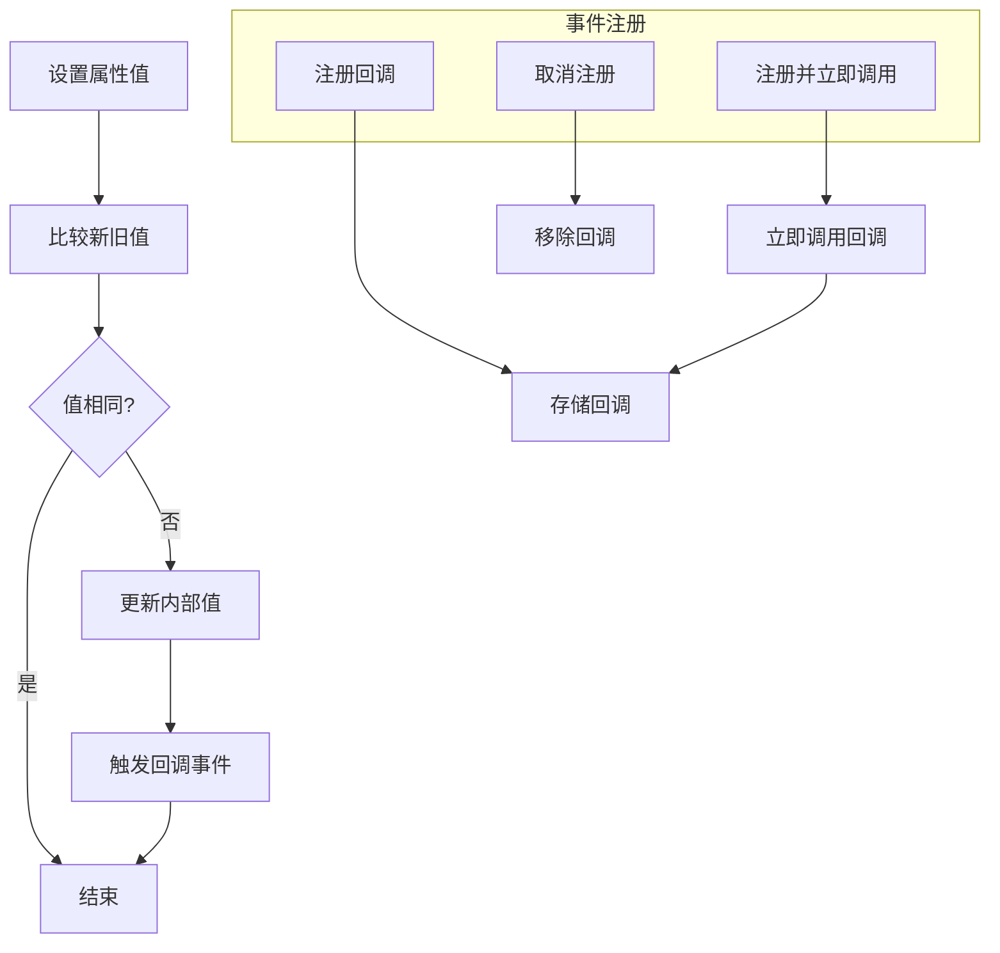

**图表来源**
- [GFramework.Core/property/BindableProperty.cs](file://GFramework.Core/property/BindableProperty.cs#L24-L87)

**章节来源**
- [GFramework.Core/model/AbstractModel.cs](file://GFramework.Core/model/AbstractModel.cs#L1-L34)
- [GFramework.Core/property/BindableProperty.cs](file://GFramework.Core/property/BindableProperty.cs#L1-L135)

### 系统层 (System)
系统层处理业务逻辑，通过事件驱动实现组件间的松耦合通信。

#### 系统生命周期管理
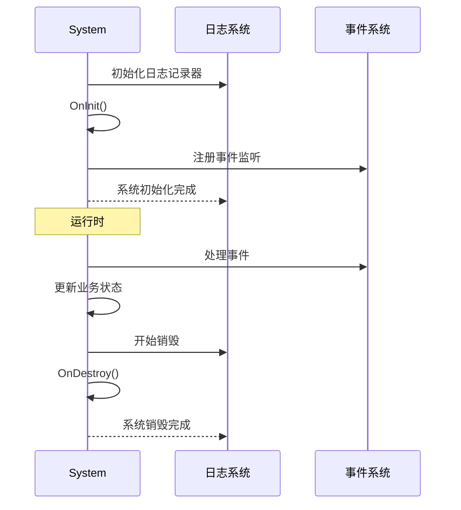

**图表来源**
- [GFramework.Core/system/AbstractSystem.cs](file://GFramework.Core/system/AbstractSystem.cs#L20-L41)

**章节来源**
- [GFramework.Core/system/AbstractSystem.cs](file://GFramework.Core/system/AbstractSystem.cs#L1-L62)

### 命令查询模式 (Command & Query)
GFramework采用CQRS模式分离读写操作，提供类型安全的命令和查询机制。

#### 命令执行流程
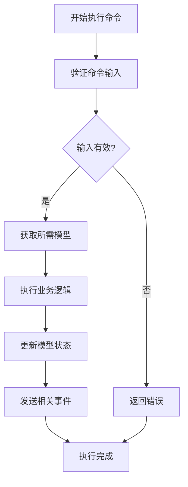

**图表来源**
- [GFramework.Core/command/AbstractCommand.cs](file://GFramework.Core/command/AbstractCommand.cs#L17-L26)

#### 查询执行流程
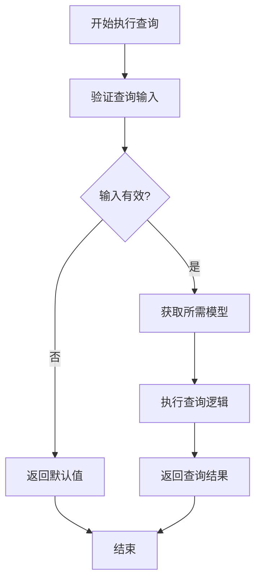

**图表来源**
- [GFramework.Core/query/AbstractQuery.cs](file://GFramework.Core/query/AbstractQuery.cs#L18-L28)

**章节来源**
- [GFramework.Core/command/AbstractCommand.cs](file://GFramework.Core/command/AbstractCommand.cs#L1-L53)
- [GFramework.Core/query/AbstractQuery.cs](file://GFramework.Core/query/AbstractQuery.cs#L1-L29)

### 控制器层 (Controller)
控制器作为UI和业务逻辑之间的桥梁，负责处理用户输入和协调组件交互。

#### 控制器设计模式
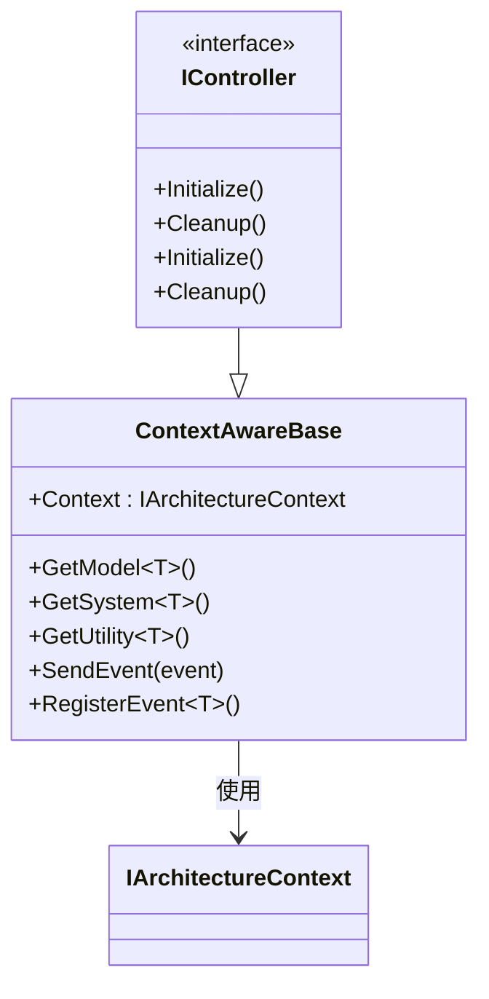

**图表来源**
- [GFramework.Core/architecture/Architecture.cs](file://GFramework.Core/architecture/Architecture.cs#L23-L28)

## 依赖关系分析
GFramework采用清晰的依赖层次结构，确保模块间的松耦合和高内聚。

### 项目依赖图
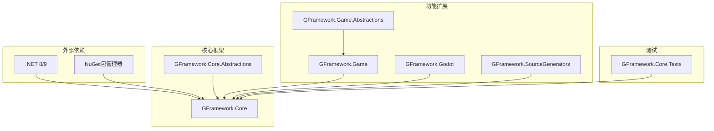

**图表来源**
- [GFramework.Core/GFramework.Core.csproj](file://GFramework.Core/GFramework.Core.csproj#L1-L13)
- [GFramework.Core.Abstractions/GFramework.Core.Abstractions.csproj](file://GFramework.Core.Abstractions/GFramework.Core.Abstractions.csproj#L1-L29)

### 组件间通信机制
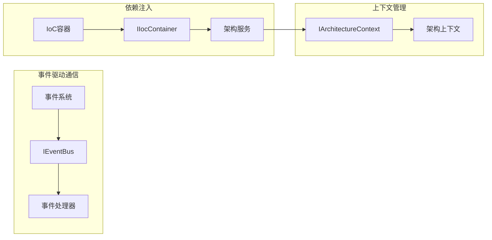

**图表来源**
- [GFramework.Core/architecture/Architecture.cs](file://GFramework.Core/architecture/Architecture.cs#L72-L87)

**章节来源**
- [GFramework.Core/GFramework.Core.csproj](file://GFramework.Core/GFramework.Core.csproj#L1-L13)
- [GFramework.Core.Abstractions/GFramework.Core.Abstractions.csproj](file://GFramework.Core.Abstractions/GFramework.Core.Abstractions.csproj#L1-L29)

## 性能考虑
GFramework在设计时充分考虑了性能优化，提供多种性能提升策略：

### 内存管理优化
- **对象池化**: 通过AbstractNodePoolSystem实现Godot节点的高效复用
- **延迟初始化**: 组件采用延迟初始化策略，减少启动时间
- **生命周期管理**: 自动化的资源清理，防止内存泄漏

### 并发处理
- **异步初始化**: 支持异步组件初始化，提高响应性
- **事件队列**: 事件处理采用队列机制，避免阻塞主线程
- **批量操作**: 支持批量注册和初始化操作

### 编译时优化
- **源码生成器**: 通过源码生成器减少运行时开销
- **接口隔离**: 小而专注的接口设计，减少不必要的依赖
- **泛型优化**: 广泛使用泛型，提供类型安全的同时保持性能

## 故障排除指南

### 常见环境配置问题

#### .NET SDK安装问题
**问题**: dotnet命令不可用
**解决方案**:
1. 确认已安装.NET 8.0或更高版本
2. 重启开发环境使PATH生效
3. 运行`dotnet --info`验证安装

#### NuGet包引用问题
**问题**: 包安装失败或版本冲突
**解决方案**:
1. 清理NuGet缓存: `dotnet nuget locals all --clear`
2. 删除bin和obj文件夹
3. 重新还原包: `dotnet restore`

### 编译错误排查

#### 类型不匹配错误
**常见症状**: 编译时报错提示类型不匹配
**解决方法**:
1. 检查接口实现是否完整
2. 确认泛型参数类型正确
3. 验证依赖项版本兼容性

#### 依赖注入错误
**常见症状**: 运行时抛出依赖解析异常
**解决方法**:
1. 检查组件注册顺序
2. 确认构造函数参数正确
3. 验证模块安装时机

### 运行时问题诊断

#### 事件未触发
**排查步骤**:
1. 检查事件注册是否在正确的生命周期阶段
2. 验证事件处理器是否正确实现
3. 确认事件类型匹配

#### 组件初始化失败
**排查步骤**:
1. 查看架构初始化日志
2. 检查组件依赖关系
3. 验证上下文绑定状态

**章节来源**
- [GFramework.Core/architecture/Architecture.cs](file://GFramework.Core/architecture/Architecture.cs#L164-L183)
- [GFramework.Core/architecture/Architecture.cs](file://GFramework.Core/architecture/Architecture.cs#L357-L396)

## 结论
GFramework为游戏开发提供了一个完整、可扩展且高性能的架构解决方案。通过模块化设计和清晰的分层架构，开发者可以专注于游戏逻辑的实现，而无需担心底层基础设施的复杂性。

### 主要优势
- **平台无关**: 核心模块可在任何.NET环境中运行
- **模块化设计**: 支持按需组合和扩展功能模块
- **类型安全**: 基于泛型的组件获取和事件系统
- **事件驱动**: 松耦合的组件通信机制
- **生命周期管理**: 自动化的组件初始化和清理

### 下一步建议
1. 从简单的游戏原型开始实践
2. 参考测试用例理解最佳实践
3. 根据项目需求选择合适的模块组合
4. 利用源码生成器提升开发效率

## 附录

### 快速开始模板
以下是一个最小化的GFramework项目模板：

```csharp
// 1. 定义架构
public class MyGameArchitecture : Architecture
{
    protected override void Init()
    {
        RegisterModel(new GameStateModel());
        RegisterSystem(new GameStateSystem());
        RegisterUtility(new GameUtility());
    }
}

// 2. 定义模型
public class GameStateModel : AbstractModel
{
    public BindableProperty<int> Score { get; } = new(0);
    
    protected override void OnInit()
    {
        // 初始化逻辑
    }
}

// 3. 定义系统
public class GameStateSystem : AbstractSystem
{
    protected override void OnInit()
    {
        this.RegisterEvent<GameEvent>(OnGameEvent);
    }
    
    private void OnGameEvent(GameEvent e)
    {
        // 业务逻辑
    }
}

// 4. 初始化和运行
var architecture = new MyGameArchitecture();
architecture.Initialize();
```

### 测试验证清单
- [ ] 架构成功初始化
- [ ] 所有组件正确注册
- [ ] 事件系统正常工作
- [ ] 数据绑定功能正常
- [ ] 生命周期管理正确执行

### 项目打包建议
1. 配置适当的版本号和发布设置
2. 确保所有依赖项正确打包
3. 测试不同.NET版本的兼容性
4. 准备部署脚本和自动化流程