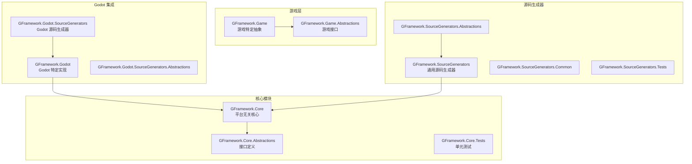
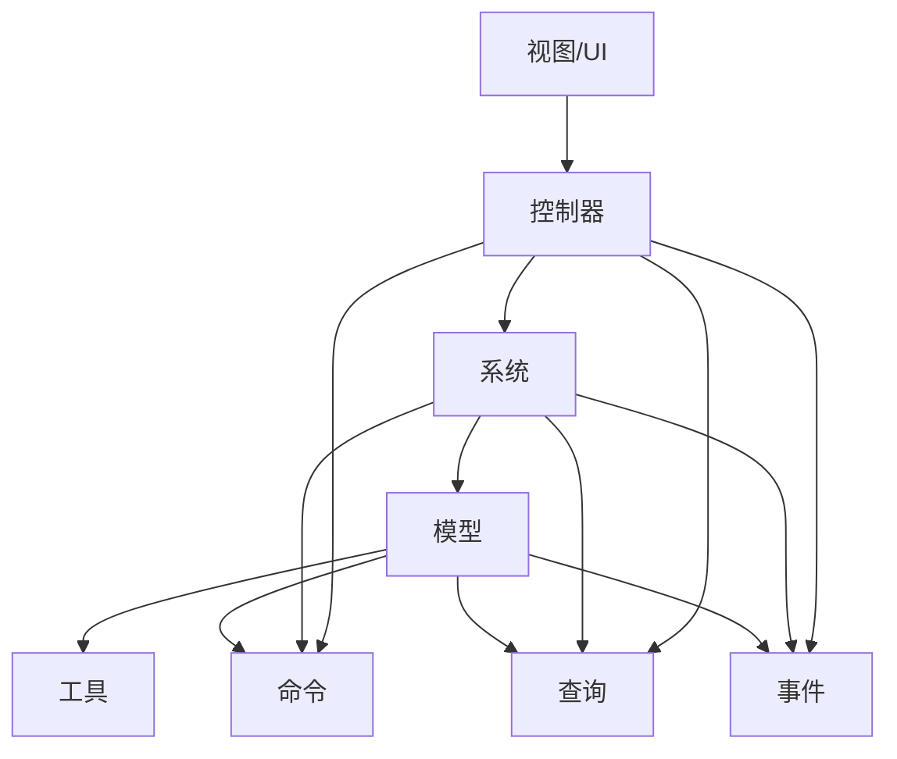
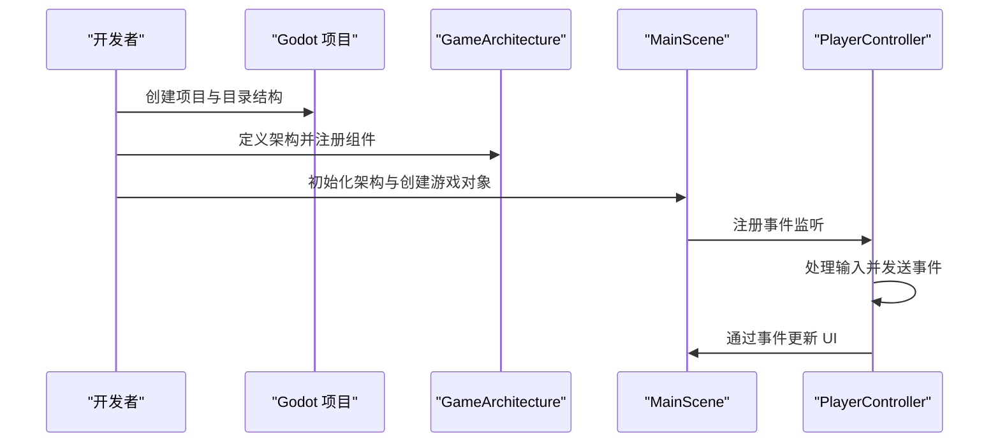
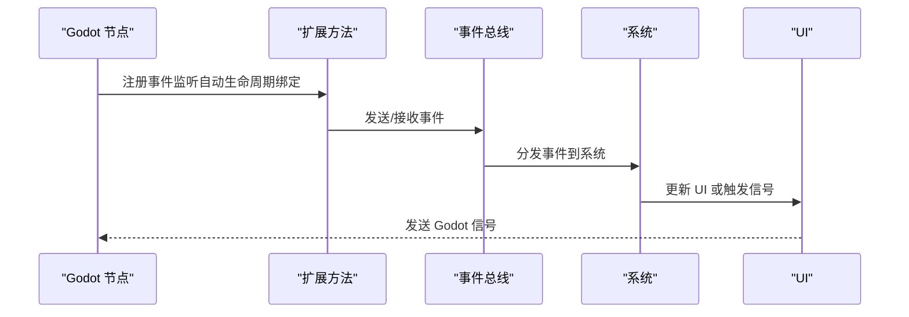
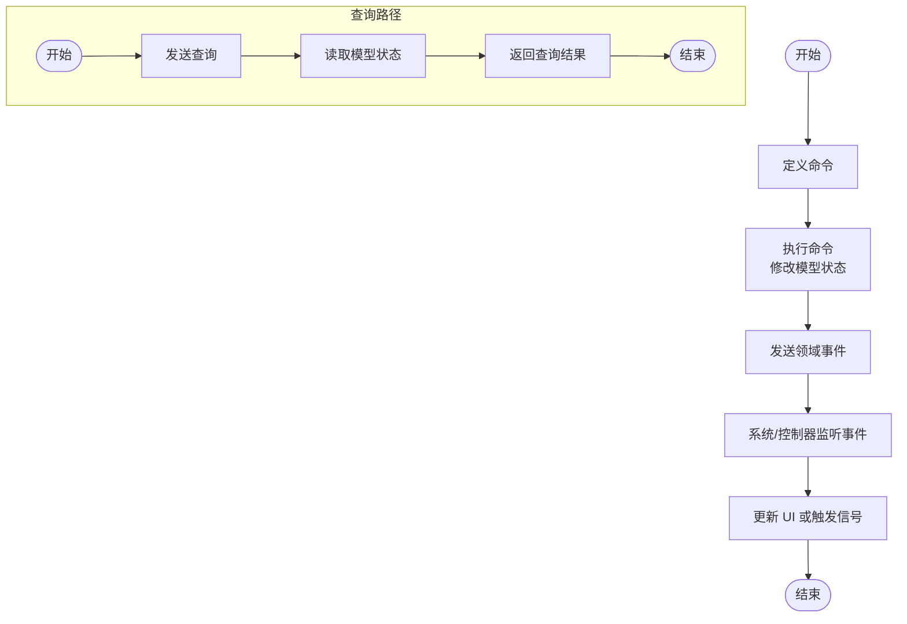
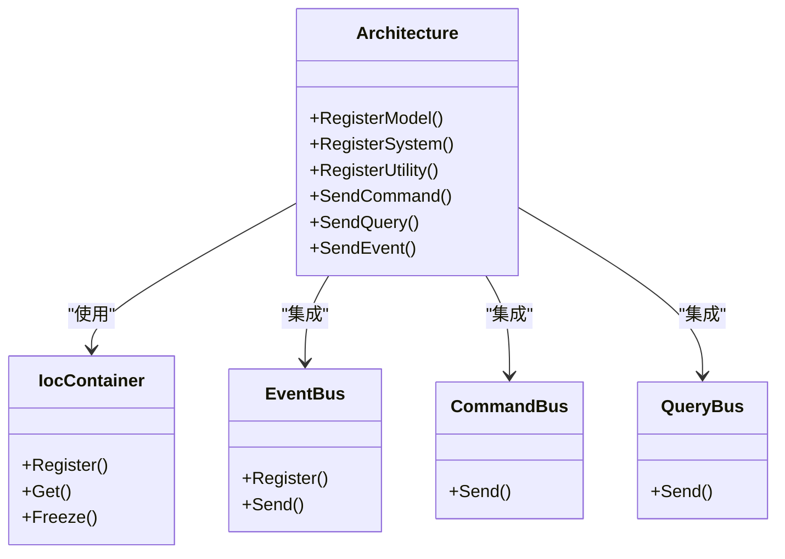
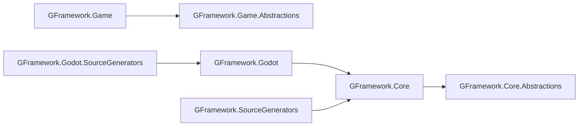

# 教程和指南

<cite>
**本文引用的文件**
- [README.md](file://README.md)
- [Getting Started 教程](file://docs/tutorials/getting-started.md)
- [Godot 集成教程](file://docs/tutorials/godot-integration.md)
- [高级模式教程](file://docs/tutorials/advanced-patterns.md)
- [架构模式最佳实践](file://docs/best-practices/architecture-patterns.md)
- [GFramework.Core 概览](file://GFramework.Core/README.md)
- [Architecture 包使用说明](file://GFramework.Core/architecture/README.md)
- [Events 包使用说明](file://GFramework.Core/events/README.md)
- [Command 包使用说明](file://GFramework.Core/command/README.md)
- [Query 包使用说明](file://GFramework.Core/query/README.md)
- [Property 包使用说明](file://GFramework.Core/property/README.md)
- [IoC 包使用说明](file://GFramework.Core/ioc/README.md)
- [GFramework.Godot 概览](file://GFramework.Godot/README.md)
- [GFramework.SourceGenerators 概览](file://GFramework.SourceGenerators/README.md)
</cite>

## 目录
1. [引言](#引言)
2. [项目结构](#项目结构)
3. [核心组件](#核心组件)
4. [架构总览](#架构总览)
5. [详细组件分析](#详细组件分析)
6. [依赖分析](#依赖分析)
7. [性能考虑](#性能考虑)
8. [故障排除指南](#故障排除指南)
9. [结论](#结论)
10. [附录](#附录)

## 引言
本教程面向希望使用 GFramework 从零开始开发游戏的开发者，提供从项目创建、架构设计、组件开发到部署发布的全流程指导。教程涵盖：
- 从零开始创建项目并配置工程结构
- 深入理解 GFramework 的核心架构与分层设计
- 使用 CQRS、事件驱动、模块化与状态机等高级模式
- 在 Godot 引擎中进行集成，包含节点生命周期绑定、信号系统、资源管理与性能优化
- 依赖注入、Clean Architecture、模块化开发策略
- 协程优化、事件系统调优、资源加载优化等性能技巧
- 常见问题与调试技巧

## 项目结构
GFramework 采用模块化设计，核心与平台解耦，Godot 集成在独立模块中，源码生成器提供编译时增强。

图表来源
- [README.md](file://README.md#L31-L51)
- [GFramework.Core 概览](file://GFramework.Core/README.md#L285-L304)

章节来源
- [README.md](file://README.md#L31-L51)
- [GFramework.Core 概览](file://GFramework.Core/README.md#L285-L304)

## 核心组件
- 架构与生命周期：通过 Architecture 管理组件注册、初始化与销毁，支持阶段式生命周期与模块化扩展。
- 事件系统：类型安全的事件总线，支持注册/注销、组合事件与架构生命周期事件。
- 命令与查询：CQRS 分离，命令用于写操作，查询用于读操作，二者通过事件解耦。
- 可绑定属性：响应式数据绑定，支持 UI 自动更新与属性监听。
- IoC 容器：轻量依赖注入容器，管理组件注册与获取。
- 源码生成器：零运行时开销的编译时代码生成，提供日志、上下文感知与枚举扩展。

章节来源
- [Architecture 包使用说明](file://GFramework.Core/architecture/README.md#L80-L143)
- [Events 包使用说明](file://GFramework.Core/events/README.md#L52-L163)
- [Command 包使用说明](file://GFramework.Core/command/README.md#L29-L84)
- [Query 包使用说明](file://GFramework.Core/query/README.md#L20-L66)
- [Property 包使用说明](file://GFramework.Core/property/README.md#L43-L99)
- [IoC 包使用说明](file://GFramework.Core/ioc/README.md#L10-L47)
- [GFramework.SourceGenerators 概览](file://GFramework.SourceGenerators/README.md#L32-L46)

## 架构总览
GFramework 采用 Clean Architecture 风格的五层架构：View/UI、Controller、System、Model、Utility；横切关注点包括 Command/Query/Event。架构阶段包括初始化、Ready、Destroying、Destroyed 等阶段，支持模块安装与生命周期钩子。

图表来源
- [GFramework.Core 概览](file://GFramework.Core/README.md#L42-L64)
- [Architecture 包使用说明](file://GFramework.Core/architecture/README.md#L107-L124)

章节来源
- [GFramework.Core 概览](file://GFramework.Core/README.md#L42-L64)
- [Architecture 包使用说明](file://GFramework.Core/architecture/README.md#L107-L124)

## 详细组件分析

### 从零开始教程（含项目创建、架构设计、功能实现）
- 环境准备：.NET 6+、Godot 4.5.1+、IDE（Visual Studio、Rider、VS Code）
- 项目创建：Godot 项目 + C# 工程 + 模块化目录结构
- 架构设计：定义 GameArchitecture，注册 Model/System/Utility，安装模块
- 功能实现：主场景、玩家控制器、事件监听与数据绑定
- 测试验证：单元测试与集成测试
- 项目打包：发布与打包流程
- 进阶功能：UI 路由、过渡管线、设置系统

图表来源
- [Getting Started 教程](file://docs/tutorials/getting-started.md#L59-L137)
- [Getting Started 教程](file://docs/tutorials/getting-started.md#L165-L207)
- [Getting Started 教程](file://docs/tutorials/getting-started.md#L480-L642)

章节来源
- [Getting Started 教程](file://docs/tutorials/getting-started.md#L15-L16)
- [Getting Started 教程](file://docs/tutorials/getting-started.md#L59-L137)
- [Getting Started 教程](file://docs/tutorials/getting-started.md#L165-L207)
- [Getting Started 教程](file://docs/tutorials/getting-started.md#L480-L642)

### Godot 集成教程（节点生命周期、信号系统、资源管理、性能优化）
- 节点生命周期绑定：架构与 Godot 场景树同步，自动清理
- 模块系统：AudioModule、InputModule 等模块安装与生命周期
- 节点池化：BulletPoolSystem 的创建、回收与重用
- 信号系统：SignalBuilder 流畅 API、Godot 信号与框架事件桥接
- 资源管理：智能加载、预加载与卸载策略
- 性能优化：节点安全操作、异步加载、池化与事件优化

图表来源
- [Godot 集成教程](file://docs/tutorials/godot-integration.md#L15-L114)
- [Godot 集成教程](file://docs/tutorials/godot-integration.md#L173-L290)
- [Godot 集成教程](file://docs/tutorials/godot-integration.md#L336-L421)
- [Godot 集成教程](file://docs/tutorials/godot-integration.md#L520-L695)
- [GFramework.Godot 概览](file://GFramework.Godot/README.md#L66-L142)
- [GFramework.Godot 概览](file://GFramework.Godot/README.md#L199-L331)
- [GFramework.Godot 概览](file://GFramework.Godot/README.md#L332-L416)
- [GFramework.Godot 概览](file://GFramework.Godot/README.md#L418-L490)

章节来源
- [Godot 集成教程](file://docs/tutorials/godot-integration.md#L15-L114)
- [Godot 集成教程](file://docs/tutorials/godot-integration.md#L173-L290)
- [Godot 集成教程](file://docs/tutorials/godot-integration.md#L336-L421)
- [Godot 集成教程](file://docs/tutorials/godot-integration.md#L520-L695)
- [GFramework.Godot 概览](file://GFramework.Godot/README.md#L66-L142)
- [GFramework.Godot 概览](file://GFramework.Godot/README.md#L199-L331)
- [GFramework.Godot 概览](file://GFramework.Godot/README.md#L332-L416)
- [GFramework.Godot 概览](file://GFramework.Godot/README.md#L418-L490)

### 高级模式教程（CQRS、事件驱动、插件系统、状态机）
- CQRS：命令写操作、查询读操作、事件通知
- 事件溯源：事件存储、快照、聚合重建
- 事件总线：订阅/发布、异步处理、错误隔离
- 插件系统：模块化架构、模块安装与卸载
- 状态机：状态定义、状态转换、状态事件

图表来源
- [高级模式教程](file://docs/tutorials/advanced-patterns.md#L17-L206)
- [高级模式教程](file://docs/tutorials/advanced-patterns.md#L515-L690)
- [高级模式教程](file://docs/tutorials/advanced-patterns.md#L692-L800)
- [Command 包使用说明](file://GFramework.Core/command/README.md#L150-L174)
- [Query 包使用说明](file://GFramework.Core/query/README.md#L50-L66)

章节来源
- [高级模式教程](file://docs/tutorials/advanced-patterns.md#L15-L14)
- [高级模式教程](file://docs/tutorials/advanced-patterns.md#L17-L206)
- [高级模式教程](file://docs/tutorials/advanced-patterns.md#L515-L690)
- [高级模式教程](file://docs/tutorials/advanced-patterns.md#L692-L800)
- [Command 包使用说明](file://GFramework.Core/command/README.md#L150-L174)
- [Query 包使用说明](file://GFramework.Core/query/README.md#L50-L66)

### 架构模式最佳实践（Clean Architecture、依赖注入、模块化）
- 设计原则：SRP、OCP、DIP
- 分层架构：清晰的层次边界与职责
- 依赖管理：构造函数注入、接口隔离
- 事件系统设计：事件命名、职责单一
- 模块化架构：模块边界、模块间通信

图表来源
- [Architecture 包使用说明](file://GFramework.Core/architecture/README.md#L80-L143)
- [IoC 包使用说明](file://GFramework.Core/ioc/README.md#L10-L47)
- [Events 包使用说明](file://GFramework.Core/events/README.md#L138-L163)
- [Command 包使用说明](file://GFramework.Core/command/README.md#L150-L174)
- [Query 包使用说明](file://GFramework.Core/query/README.md#L50-L66)

章节来源
- [架构模式最佳实践](file://docs/best-practices/architecture-patterns.md#L16-L88)
- [架构模式最佳实践](file://docs/best-practices/architecture-patterns.md#L284-L464)
- [架构模式最佳实践](file://docs/best-practices/architecture-patterns.md#L466-L576)
- [架构模式最佳实践](file://docs/best-practices/architecture-patterns.md#L578-L688)
- [架构模式最佳实践](file://docs/best-practices/architecture-patterns.md#L689-L745)
- [架构模式最佳实践](file://docs/best-practices/architecture-patterns.md#L747-L800)
- [Architecture 包使用说明](file://GFramework.Core/architecture/README.md#L80-L143)
- [IoC 包使用说明](file://GFramework.Core/ioc/README.md#L10-L47)
- [Events 包使用说明](file://GFramework.Core/events/README.md#L138-L163)
- [Command 包使用说明](file://GFramework.Core/command/README.md#L150-L174)
- [Query 包使用说明](file://GFramework.Core/query/README.md#L50-L66)

### 源码生成器（零运行时开销的代码增强）
- Log 属性生成器：自动生成 ILogger 字段与日志方法
- ContextAware 属性生成器：自动实现 IContextAware 接口
- GenerateEnumExtensions 属性生成器：为枚举生成扩展方法
- 诊断信息：编译时错误提示与修复建议
- 性能优势：零运行时开销、类型安全、内存分配优化

章节来源
- [GFramework.SourceGenerators 概览](file://GFramework.SourceGenerators/README.md#L80-L177)
- [GFramework.SourceGenerators 概览](file://GFramework.SourceGenerators/README.md#L178-L282)
- [GFramework.SourceGenerators 概览](file://GFramework.SourceGenerators/README.md#L283-L422)
- [GFramework.SourceGenerators 概览](file://GFramework.SourceGenerators/README.md#L434-L564)
- [GFramework.SourceGenerators 概览](file://GFramework.SourceGenerators/README.md#L566-L717)

## 依赖分析
- 核心依赖：GFramework.Core 与 GFramework.Core.Abstractions 提供架构、事件、命令、查询、属性、IoC 等基础能力
- 平台集成：GFramework.Godot 提供与 Godot 的深度集成，包括节点扩展、信号系统、模块系统、资源管理与日志
- 源码生成：GFramework.SourceGenerators 与 GFramework.Godot.SourceGenerators 提供编译时代码生成能力

图表来源
- [README.md](file://README.md#L33-L51)
- [GFramework.Core 概览](file://GFramework.Core/README.md#L285-L304)

章节来源
- [README.md](file://README.md#L33-L51)
- [GFramework.Core 概览](file://GFramework.Core/README.md#L285-L304)

## 性能考虑
- 协程优化：使用 WaitUntil、WaitForFrames、WaitOneFrame 等 YieldInstruction 减少每帧开销
- 事件系统调优：避免每帧触发高频事件，使用结构体事件减少 GC 压力
- 资源加载优化：预加载、异步加载、资源缓存与按需卸载
- 节点池化：高频创建/销毁对象使用池化，降低内存碎片与 GC 压力
- 数据绑定：使用 BindableProperty 的 SetValueWithoutEvent 批量更新，最后统一触发事件

章节来源
- [Property 包使用说明](file://GFramework.Core/property/README.md#L278-L302)
- [Events 包使用说明](file://GFramework.Core/events/README.md#L507-L515)
- [Godot 集成教程](file://docs/tutorials/godot-integration.md#L796-L800)
- [GFramework.Godot 概览](file://GFramework.Godot/README.md#L51-L55)

## 故障排除指南
- 事件未注销导致内存泄漏：使用 UnRegisterList 或 UnRegisterWhenNodeExitTree 自动清理
- 架构初始化失败：检查 Init() 中组件注册顺序与依赖关系，关注 FailedInitialization 阶段
- 源码生成器冲突：根据诊断信息（如 GF_Logging_001、GF_Rule_001、GF_Enum_001）修正属性使用与枚举命名
- Godot 节点访问异常：使用安全扩展方法（GetNodeX、FindChildX、AddChildX）避免空引用
- 性能问题排查：启用日志、使用生命周期钩子监控阶段耗时，定位瓶颈

章节来源
- [Events 包使用说明](file://GFramework.Core/events/README.md#L437-L475)
- [Architecture 包使用说明](file://GFramework.Core/architecture/README.md#L227-L230)
- [GFramework.SourceGenerators 概览](file://GFramework.SourceGenerators/README.md#L434-L513)
- [GFramework.Godot 概览](file://GFramework.Godot/README.md#L203-L238)

## 结论
本教程系统性地介绍了 GFramework 的从零开始开发流程、架构设计、高级模式与 Godot 集成实践，并提供了性能优化与故障排除指南。通过模块化与平台解耦的设计，开发者可以快速搭建高质量的游戏架构，同时在 Godot 引擎中发挥框架优势，实现高性能与可维护性的平衡。

## 附录
- API 参考：Core API、Godot API、Source Generators API、Game API
- 最佳实践：架构模式、性能优化技巧
- 常见问题：错误处理策略、调试技巧

章节来源
- [README.md](file://README.md#L47-L59)
- [架构模式最佳实践](file://docs/best-practices/architecture-patterns.md#L1-L14)