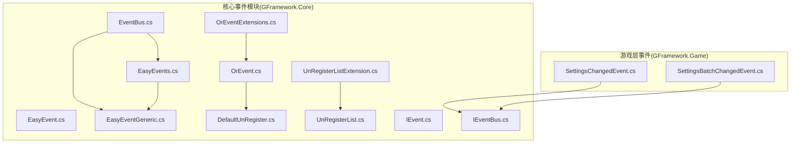
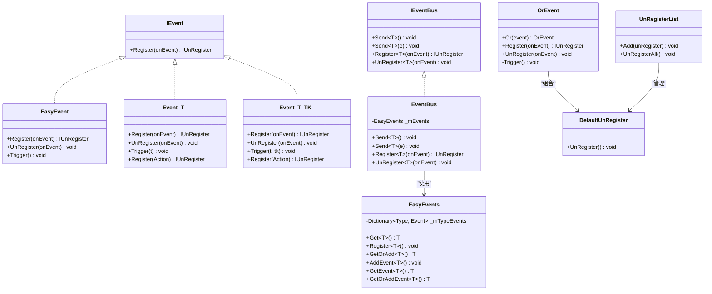
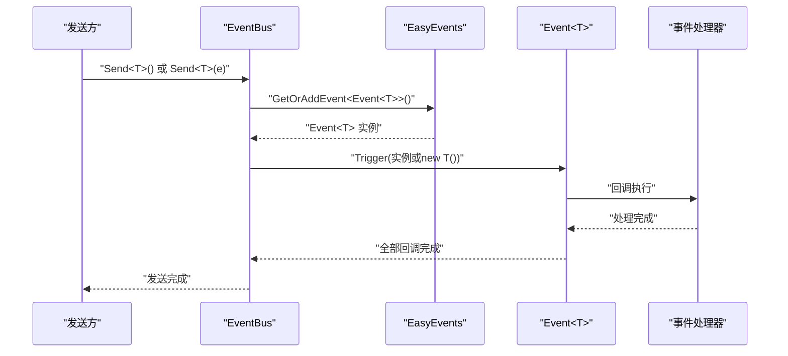
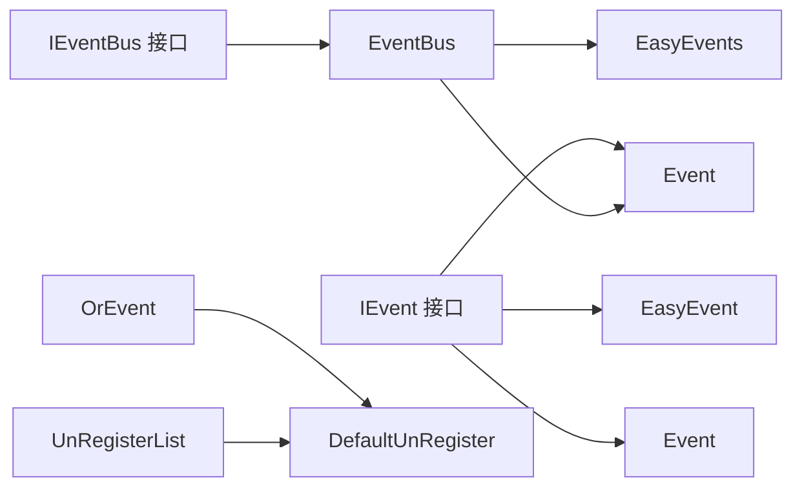

# 事件系统设计

<cite>
**本文引用的文件**
- [EasyEvent.cs](file://GFramework.Core/events/EasyEvent.cs)
- [EasyEventGeneric.cs](file://GFramework.Core/events/EasyEventGeneric.cs)
- [EventBus.cs](file://GFramework.Core/events/EventBus.cs)
- [EasyEvents.cs](file://GFramework.Core/events/EasyEvents.cs)
- [ArchitectureEvents.cs](file://GFramework.Core/events/ArchitectureEvents.cs)
- [OrEvent.cs](file://GFramework.Core/events/OrEvent.cs)
- [DefaultUnRegister.cs](file://GFramework.Core/events/DefaultUnRegister.cs)
- [UnRegisterList.cs](file://GFramework.Core/events/UnRegisterList.cs)
- [IEvent.cs](file://GFramework.Core.Abstractions/events/IEvent.cs)
- [IEventBus.cs](file://GFramework.Core.Abstractions/events/IEventBus.cs)
- [OrEventExtensions.cs](file://GFramework.Core/extensions/OrEventExtensions.cs)
- [UnRegisterListExtension.cs](file://GFramework.Core/extensions/UnRegisterListExtension.cs)
- [SettingsChangedEvent.cs](file://GFramework.Game/setting/events/SettingsChangedEvent.cs)
- [SettingsBatchChangedEvent.cs](file://GFramework.Game/setting/events/SettingsBatchChangedEvent.cs)
- [EventTests.cs](file://GFramework.Core.Tests/events/EventTests.cs)
</cite>

## 目录
1. [引言](#引言)
2. [项目结构](#项目结构)
3. [核心组件](#核心组件)
4. [架构总览](#架构总览)
5. [详细组件分析](#详细组件分析)
6. [依赖分析](#依赖分析)
7. [性能考虑](#性能考虑)
8. [故障排查指南](#故障排查指南)
9. [结论](#结论)
10. [附录：事件命名与结构最佳实践](#附录事件命名与结构最佳实践)

## 引言
本文件面向GFramework的事件系统，系统性阐述事件命名规范、事件结构设计以及事件处理职责分配的最佳实践；并结合仓库中的具体实现，给出类型安全的事件结构、单一职责的事件处理器设计、性能优化建议与测试与调试策略。读者无需深入源码即可理解并应用这些实践。

## 项目结构
事件系统位于GFramework.Core/events目录，围绕“事件类型 + 事件总线 + 注销机制”构建，同时提供组合事件与全局事件管理能力。游戏层在GFramework.Game/setting/events中提供了领域事件示例（设置变更事件），体现事件在业务场景中的落地方式。

**图表来源**
- [EventBus.cs](file://GFramework.Core/events/EventBus.cs#L1-L55)
- [EasyEvents.cs](file://GFramework.Core/events/EasyEvents.cs#L1-L85)
- [EasyEventGeneric.cs](file://GFramework.Core/events/EasyEventGeneric.cs#L1-L123)
- [OrEvent.cs](file://GFramework.Core/events/OrEvent.cs#L1-L57)
- [DefaultUnRegister.cs](file://GFramework.Core/events/DefaultUnRegister.cs#L1-L22)
- [UnRegisterList.cs](file://GFramework.Core/events/UnRegisterList.cs#L1-L37)
- [IEvent.cs](file://GFramework.Core.Abstractions/events/IEvent.cs#L1-L16)
- [IEventBus.cs](file://GFramework.Core.Abstractions/events/IEventBus.cs#L1-L37)
- [OrEventExtensions.cs](file://GFramework.Core/extensions/OrEventExtensions.cs#L1-L21)
- [UnRegisterListExtension.cs](file://GFramework.Core/extensions/UnRegisterListExtension.cs#L1-L32)
- [SettingsChangedEvent.cs](file://GFramework.Game/setting/events/SettingsChangedEvent.cs#L1-L32)
- [SettingsBatchChangedEvent.cs](file://GFramework.Game/setting/events/SettingsBatchChangedEvent.cs#L1-L31)

**章节来源**
- [EventBus.cs](file://GFramework.Core/events/EventBus.cs#L1-L55)
- [EasyEvents.cs](file://GFramework.Core/events/EasyEvents.cs#L1-L85)
- [EasyEventGeneric.cs](file://GFramework.Core/events/EasyEventGeneric.cs#L1-L123)
- [OrEvent.cs](file://GFramework.Core/events/OrEvent.cs#L1-L57)
- [DefaultUnRegister.cs](file://GFramework.Core/events/DefaultUnRegister.cs#L1-L22)
- [UnRegisterList.cs](file://GFramework.Core/events/UnRegisterList.cs#L1-L37)
- [IEvent.cs](file://GFramework.Core.Abstractions/events/IEvent.cs#L1-L16)
- [IEventBus.cs](file://GFramework.Core.Abstractions/events/IEventBus.cs#L1-L37)
- [OrEventExtensions.cs](file://GFramework.Core/extensions/OrEventExtensions.cs#L1-L21)
- [UnRegisterListExtension.cs](file://GFramework.Core/extensions/UnRegisterListExtension.cs#L1-L32)
- [SettingsChangedEvent.cs](file://GFramework.Game/setting/events/SettingsChangedEvent.cs#L1-L32)
- [SettingsBatchChangedEvent.cs](file://GFramework.Game/setting/events/SettingsBatchChangedEvent.cs#L1-L31)

## 核心组件
- 事件接口与基础事件
  - IEvent：定义无参事件注册接口，便于统一处理。
  - EasyEvent：无参事件，支持注册/注销/触发。
  - Event<T>、Event<T,TK>：单/双参数泛型事件，显式实现IEvent以支持无参订阅。
- 事件总线与全局事件管理
  - IEventBus：定义Send/Register/UnRegister接口。
  - EventBus：基于类型分发的事件总线，内部使用EasyEvents管理事件实例。
  - EasyEvents：全局事件容器，按类型缓存事件实例，支持Get/GetOrAdd/Add。
- 组合与注销
  - OrEvent：事件“或”组合，任一子事件触发即触发自身。
  - DefaultUnRegister：一次性注销器，执行回调并清理引用。
  - UnRegisterList：批量注销器，集中管理多个注销器。
- 游戏层事件示例
  - SettingsChangedEvent<T>：类型化设置变更事件。
  - SettingsBatchChangedEvent：批量设置变更事件。

**章节来源**
- [IEvent.cs](file://GFramework.Core.Abstractions/events/IEvent.cs#L1-L16)
- [EasyEvent.cs](file://GFramework.Core/events/EasyEvent.cs#L1-L39)
- [EasyEventGeneric.cs](file://GFramework.Core/events/EasyEventGeneric.cs#L1-L123)
- [IEventBus.cs](file://GFramework.Core.Abstractions/events/IEventBus.cs#L1-L37)
- [EventBus.cs](file://GFramework.Core/events/EventBus.cs#L1-L55)
- [EasyEvents.cs](file://GFramework.Core/events/EasyEvents.cs#L1-L85)
- [OrEvent.cs](file://GFramework.Core/events/OrEvent.cs#L1-L57)
- [DefaultUnRegister.cs](file://GFramework.Core/events/DefaultUnRegister.cs#L1-L22)
- [UnRegisterList.cs](file://GFramework.Core/events/UnRegisterList.cs#L1-L37)
- [SettingsChangedEvent.cs](file://GFramework.Game/setting/events/SettingsChangedEvent.cs#L1-L32)
- [SettingsBatchChangedEvent.cs](file://GFramework.Game/setting/events/SettingsBatchChangedEvent.cs#L1-L31)

## 架构总览
事件系统采用“类型驱动 + 全局容器 + 总线分发”的架构。事件通过类型标识，由EventBus统一调度；EasyEvents负责事件实例的缓存与复用；OrEvent支持事件组合；DefaultUnRegister/UnRegisterList保障生命周期管理。

**图表来源**
- [IEvent.cs](file://GFramework.Core.Abstractions/events/IEvent.cs#L1-L16)
- [EasyEvent.cs](file://GFramework.Core/events/EasyEvent.cs#L1-L39)
- [EasyEventGeneric.cs](file://GFramework.Core/events/EasyEventGeneric.cs#L1-L123)
- [IEventBus.cs](file://GFramework.Core.Abstractions/events/IEventBus.cs#L1-L37)
- [EventBus.cs](file://GFramework.Core/events/EventBus.cs#L1-L55)
- [EasyEvents.cs](file://GFramework.Core/events/EasyEvents.cs#L1-L85)
- [OrEvent.cs](file://GFramework.Core/events/OrEvent.cs#L1-L57)
- [DefaultUnRegister.cs](file://GFramework.Core/events/DefaultUnRegister.cs#L1-L22)
- [UnRegisterList.cs](file://GFramework.Core/events/UnRegisterList.cs#L1-L37)

## 详细组件分析

### 事件接口与基础事件
- 设计要点
  - IEvent仅暴露无参注册，便于统一处理与扩展。
  - EasyEvent提供最简事件模型，适合广播型通知。
  - Event<T>/Event<T,TK>显式实现IEvent.Register(Action)，允许“无参订阅”，同时保留强类型参数触发。
- 使用建议
  - 优先使用Event<T>进行领域事件建模，确保参数类型安全。
  - 无参事件仅用于系统级广播，避免承载复杂状态。

**章节来源**
- [IEvent.cs](file://GFramework.Core.Abstractions/events/IEvent.cs#L1-L16)
- [EasyEvent.cs](file://GFramework.Core/events/EasyEvent.cs#L1-L39)
- [EasyEventGeneric.cs](file://GFramework.Core/events/EasyEventGeneric.cs#L1-L123)

### 事件总线与全局事件管理
- 设计要点
  - EventBus基于类型分发，Send<T>()自动构造事件实例，Send<T>(e)直接触发实例。
  - 内部使用EasyEvents缓存事件实例，避免重复创建。
  - Register/UnRegister通过类型键控，保证事件隔离。
- 使用建议
  - 事件类型应具备无参构造函数以便自动构造。
  - 对于频繁触发的事件，优先使用EventBus.Send<T>(e)传入实例，减少构造开销。

**章节来源**
- [EventBus.cs](file://GFramework.Core/events/EventBus.cs#L1-L55)
- [EasyEvents.cs](file://GFramework.Core/events/EasyEvents.cs#L1-L85)

### 组合事件与注销机制
- 设计要点
  - OrEvent将多个事件“或”组合，任一子事件触发即触发自身；通过扩展方法Or(IEvent)链式组合。
  - DefaultUnRegister封装一次性的注销回调，避免重复注销。
  - UnRegisterList集中管理多个注销器，提供批量注销能力。
- 使用建议
  - 使用OrEvent简化多事件聚合场景（如“任意加载完成”）。
  - 在对象生命周期结束时调用UnRegisterAll，确保资源回收。

**章节来源**
- [OrEvent.cs](file://GFramework.Core/events/OrEvent.cs#L1-L57)
- [OrEventExtensions.cs](file://GFramework.Core/extensions/OrEventExtensions.cs#L1-L21)
- [DefaultUnRegister.cs](file://GFramework.Core/events/DefaultUnRegister.cs#L1-L22)
- [UnRegisterList.cs](file://GFramework.Core/events/UnRegisterList.cs#L1-L37)
- [UnRegisterListExtension.cs](file://GFramework.Core/extensions/UnRegisterListExtension.cs#L1-L32)

### 游戏层事件示例
- 设计要点
  - SettingsChangedEvent<T>携带类型化设置实例与变更时间，便于处理器按类型处理。
  - SettingsBatchChangedEvent表示批量变更，适合聚合处理。
- 使用建议
  - 领域事件尽量携带必要上下文（如时间戳、来源），提升可观测性。
  - 批量事件用于降低事件风暴，提高处理效率。

**章节来源**
- [SettingsChangedEvent.cs](file://GFramework.Game/setting/events/SettingsChangedEvent.cs#L1-L32)
- [SettingsBatchChangedEvent.cs](file://GFramework.Game/setting/events/SettingsBatchChangedEvent.cs#L1-L31)

### 事件序列与调用流程
以下序列图展示了EventBus.Send<T>()的典型调用路径。

**图表来源**
- [EventBus.cs](file://GFramework.Core/events/EventBus.cs#L1-L55)
- [EasyEvents.cs](file://GFramework.Core/events/EasyEvents.cs#L1-L85)
- [EasyEventGeneric.cs](file://GFramework.Core/events/EasyEventGeneric.cs#L1-L123)

## 依赖分析
- 组件耦合
  - EventBus依赖EasyEvents与Event<T>族，形成“总线-容器-事件”的分层。
  - OrEvent依赖DefaultUnRegister，UnRegisterList管理多个注销器。
- 外部接口
  - IEvent/IEventBus提供抽象契约，便于替换实现与测试。
- 循环依赖
  - 未发现循环依赖；事件类型通过类型键控，避免运行时耦合。

**图表来源**
- [IEvent.cs](file://GFramework.Core.Abstractions/events/IEvent.cs#L1-L16)
- [EasyEvent.cs](file://GFramework.Core/events/EasyEvent.cs#L1-L39)
- [EasyEventGeneric.cs](file://GFramework.Core/events/EasyEventGeneric.cs#L1-L123)
- [IEventBus.cs](file://GFramework.Core.Abstractions/events/IEventBus.cs#L1-L37)
- [EventBus.cs](file://GFramework.Core/events/EventBus.cs#L1-L55)
- [EasyEvents.cs](file://GFramework.Core/events/EasyEvents.cs#L1-L85)
- [OrEvent.cs](file://GFramework.Core/events/OrEvent.cs#L1-L57)
- [DefaultUnRegister.cs](file://GFramework.Core/events/DefaultUnRegister.cs#L1-L22)
- [UnRegisterList.cs](file://GFramework.Core/events/UnRegisterList.cs#L1-L37)

**章节来源**
- [IEvent.cs](file://GFramework.Core.Abstractions/events/IEvent.cs#L1-L16)
- [IEventBus.cs](file://GFramework.Core.Abstractions/events/IEventBus.cs#L1-L37)
- [EventBus.cs](file://GFramework.Core/events/EventBus.cs#L1-L55)
- [EasyEvents.cs](file://GFramework.Core/events/EasyEvents.cs#L1-L85)
- [OrEvent.cs](file://GFramework.Core/events/OrEvent.cs#L1-L57)
- [DefaultUnRegister.cs](file://GFramework.Core/events/DefaultUnRegister.cs#L1-L22)
- [UnRegisterList.cs](file://GFramework.Core/events/UnRegisterList.cs#L1-L37)

## 性能考虑
- 事件过滤
  - 使用EventBus.Send<T>(e)传入实例，避免每次触发都构造新事件对象。
  - 对高频事件，建议复用事件实例并更新字段，减少GC压力。
- 批量处理
  - 使用UnRegisterList集中注销，避免逐个注销带来的遍历成本。
  - 使用OrEvent组合多个事件，减少多次订阅与触发的成本。
- 内存管理
  - 事件处理器应尽快UnRegister，防止闭包捕获导致的长生命周期对象滞留。
  - 对长生命周期对象，避免在事件处理器中持有强引用。
- 并发与线程
  - 事件回调在触发时同步执行，避免跨线程访问共享状态；如需异步处理，请在回调内调度至目标线程。

[本节为通用性能建议，不直接分析具体文件]

## 故障排查指南
- 常见问题
  - 回调未触发：检查是否正确注册、是否被提前UnRegister、事件类型是否匹配。
  - 内存泄漏：确认处理器在对象销毁时调用UnRegisterAll或单独UnRegister。
  - 事件风暴：合并为批量事件或引入节流/去抖策略。
- 调试技巧
  - 在事件处理器中记录上下文（如时间戳、来源），便于定位问题。
  - 使用单元测试验证事件注册/注销/触发的正确性。
- 单元测试参考
  - 测试覆盖了EasyEvent与Event<T>/Event<T,TK>的注册、注销与多处理器调用行为，可作为编写自测的模板。

**章节来源**
- [EventTests.cs](file://GFramework.Core.Tests/events/EventTests.cs#L1-L164)

## 结论
GFramework的事件系统以类型安全为核心，通过EventBus与EasyEvents实现高效分发与复用；OrEvent与注销机制保障了组合与生命周期管理。遵循本文的命名与结构规范、单一职责的处理器设计、以及性能与测试策略，可在复杂游戏中稳定地构建可维护的事件体系。

[本节为总结性内容，不直接分析具体文件]

## 附录：事件命名与结构最佳实践

### 事件命名规范
- 无参事件：使用动词短语，如“系统就绪”、“开始销毁”等，体现广播性质。
  - 示例：ArchitectureLifecycleReadyEvent、ArchitectureDestroyingEvent、ArchitectureDestroyedEvent、ArchitectureFailedInitializationEvent
- 领域事件：使用“名词+动作+对象”的结构，明确事件主体与影响对象。
  - 示例：PlayerHealthChangedEvent、PlayerDiedEvent、LevelCompletedEvent、SettingsChangedEvent<T>
- 批量事件：描述聚合行为，强调“批量”而非单点。
  - 示例：SettingsBatchChangedEvent

**章节来源**
- [ArchitectureEvents.cs](file://GFramework.Core/events/ArchitectureEvents.cs#L1-L31)
- [SettingsChangedEvent.cs](file://GFramework.Game/setting/events/SettingsChangedEvent.cs#L1-L32)
- [SettingsBatchChangedEvent.cs](file://GFramework.Game/setting/events/SettingsBatchChangedEvent.cs#L1-L31)

### 事件结构设计
- 类型安全
  - 使用Event<T>或Event<T,TK>承载参数，避免使用object或动态类型。
  - 领域事件尽量携带必要上下文（如时间戳、来源、类型信息）。
- 不变性与复用
  - 对高频事件，复用事件实例并更新字段，减少GC。
  - 避免在事件中保存长生命周期对象的强引用。
- 可观测性
  - 为事件添加时间戳与来源标识，便于日志与追踪。

**章节来源**
- [EasyEventGeneric.cs](file://GFramework.Core/events/EasyEventGeneric.cs#L1-L123)
- [SettingsChangedEvent.cs](file://GFramework.Game/setting/events/SettingsChangedEvent.cs#L1-L32)
- [SettingsBatchChangedEvent.cs](file://GFramework.Game/setting/events/SettingsBatchChangedEvent.cs#L1-L31)

### 事件处理职责分配
- 单一职责
  - UIHealthBarController：仅处理与健康值显示相关的事件，避免混入音频、逻辑等职责。
  - AudioController：仅处理与音效播放相关的事件，避免混入UI逻辑。
- 分层解耦
  - 事件总线负责分发，处理器负责具体业务逻辑，避免处理器直接依赖其他处理器。
- 生命周期管理
  - 在对象销毁时统一调用UnRegisterAll，确保事件链路完整释放。

**章节来源**
- [EventBus.cs](file://GFramework.Core/events/EventBus.cs#L1-L55)
- [UnRegisterList.cs](file://GFramework.Core/events/UnRegisterList.cs#L1-L37)

### 事件系统测试策略
- 行为验证
  - 验证注册/注销是否生效、多处理器是否均被调用、参数传递是否正确。
- 边界条件
  - 空处理器集合、重复注册/注销、并发触发等。
- 回归测试
  - 使用EventTests类似的断言模式，覆盖关键事件路径。

**章节来源**
- [EventTests.cs](file://GFramework.Core.Tests/events/EventTests.cs#L1-L164)