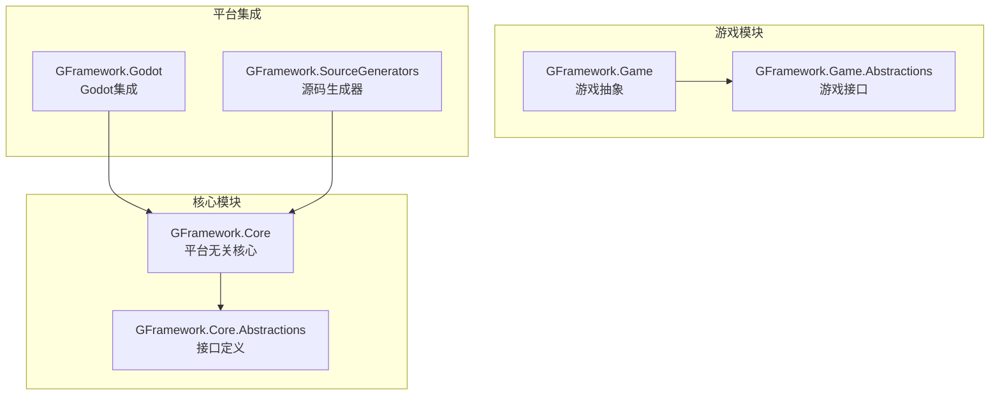
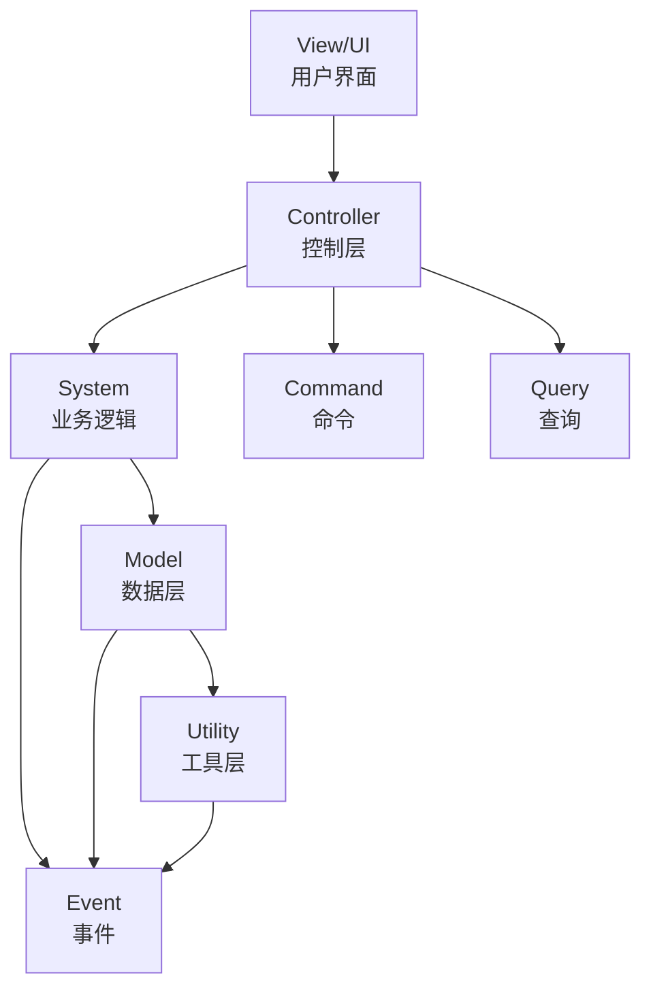
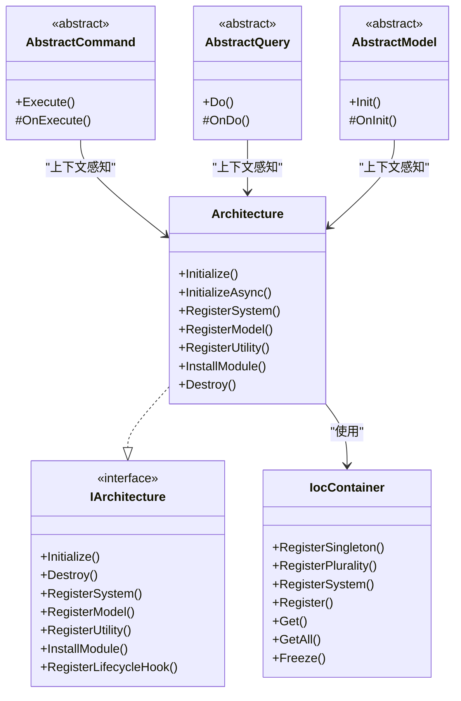
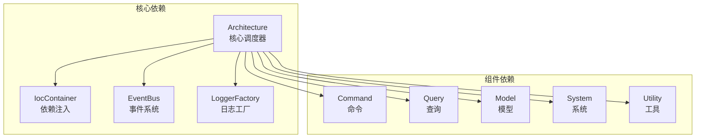

# 代码组织规范

<cite>
**本文档引用的文件**
- [README.md](file://README.md)
- [GFramework.Core/README.md](file://GFramework.Core/README.md)
- [GFramework.Core.Abstractions/README.md](file://GFramework.Core.Abstractions/README.md)
- [GFramework.Game/README.md](file://GFramework.Game/README.md)
- [GFramework.Godot/README.md](file://GFramework.Godot/README.md)
- [GFramework.Core/architecture/Architecture.cs](file://GFramework.Core/architecture/Architecture.cs)
- [GFramework.Core.Abstractions/architecture/IArchitecture.cs](file://GFramework.Core.Abstractions/architecture/IArchitecture.cs)
- [GFramework.Core/command/AbstractCommand.cs](file://GFramework.Core/command/AbstractCommand.cs)
- [GFramework.Core/query/AbstractQuery.cs](file://GFramework.Core/query/AbstractQuery.cs)
- [GFramework.Core/model/AbstractModel.cs](file://GFramework.Core/model/AbstractModel.cs)
- [GFramework.Core/logging/AbstractLogger.cs](file://GFramework.Core/logging/AbstractLogger.cs)
- [GFramework.Core/ioc/IocContainer.cs](file://GFramework.Core/ioc/IocContainer.cs)
- [GFramework.Core/events/EasyEvent.cs](file://GFramework.Core/events/EasyEvent.cs)
- [GFramework.Core/property/BindableProperty.cs](file://GFramework.Core/property/BindableProperty.cs)
</cite>

## 目录
1. [简介](#简介)
2. [项目结构](#项目结构)
3. [核心组件](#核心组件)
4. [架构概览](#架构概览)
5. [详细组件分析](#详细组件分析)
6. [依赖分析](#依赖分析)
7. [性能考虑](#性能考虑)
8. [故障排除指南](#故障排除指南)
9. [结论](#结论)
10. [附录](#附录)

## 简介
本文件为 GFramework 代码组织规范最佳实践文档，旨在为团队提供统一的文件结构、命名约定、注释标准、代码格式化和代码审查检查清单，确保代码质量、可维护性和一致性。

## 项目结构
GFramework 采用模块化架构，按功能域和层次结构组织代码，核心模块包括：
- GFramework.Core：平台无关的核心框架，包含架构、事件、命令、查询、日志、IoC 等基础设施
- GFramework.Core.Abstractions：核心接口定义，确保抽象与实现分离
- GFramework.Game：游戏特定功能抽象，如资产管理、存储系统、序列化
- GFramework.Godot：Godot 引擎集成模块，提供节点扩展、信号系统、日志桥接等
- GFramework.SourceGenerators：源代码生成器，提升开发效率和类型安全



**图表来源**
- [README.md](file://README.md#L235-L253)
- [GFramework.Core/README.md](file://GFramework.Core/README.md#L42-L56)

**章节来源**
- [README.md](file://README.md#L1-L320)
- [GFramework.Core/README.md](file://GFramework.Core/README.md#L1-L508)

## 核心组件
GFramework 的核心组件遵循分层架构，各层职责明确：
- View/UI：用户界面层
- Controller：控制层，处理用户输入
- System：业务逻辑层
- Model：数据层，存储游戏状态
- Utility：工具层，提供无状态工具
- Command/Query/Event：横切关注点，跨层操作



**图表来源**
- [GFramework.Core/README.md](file://GFramework.Core/README.md#L42-L108)

**章节来源**
- [GFramework.Core/README.md](file://GFramework.Core/README.md#L40-L108)

## 架构概览
GFramework 采用 CQRS（命令查询职责分离）和事件驱动架构，通过依赖注入容器管理组件生命周期，实现松耦合和高内聚。



**图表来源**
- [GFramework.Core/architecture/Architecture.cs](file://GFramework.Core/architecture/Architecture.cs#L23-L569)
- [GFramework.Core.Abstractions/architecture/IArchitecture.cs](file://GFramework.Core.Abstractions/architecture/IArchitecture.cs#L11-L68)
- [GFramework.Core/ioc/IocContainer.cs](file://GFramework.Core/ioc/IocContainer.cs#L12-L373)
- [GFramework.Core/command/AbstractCommand.cs](file://GFramework.Core/command/AbstractCommand.cs#L11-L53)
- [GFramework.Core/query/AbstractQuery.cs](file://GFramework.Core/query/AbstractQuery.cs#L11-L29)
- [GFramework.Core/model/AbstractModel.cs](file://GFramework.Core/model/AbstractModel.cs#L11-L34)

**章节来源**
- [GFramework.Core/architecture/Architecture.cs](file://GFramework.Core/architecture/Architecture.cs#L1-L569)
- [GFramework.Core.Abstractions/architecture/IArchitecture.cs](file://GFramework.Core.Abstractions/architecture/IArchitecture.cs#L1-L68)

## 详细组件分析

### 文件结构建议
基于现有代码组织，建议采用以下文件夹结构：

#### 按功能域组织
```
GFramework.Core/
├── architecture/     # 架构核心
├── command/         # 命令模式
├── query/           # 查询模式
├── events/          # 事件系统
├── model/           # 数据模型
├── system/          # 业务系统
├── utility/         # 工具类
├── property/        # 可绑定属性
├── ioc/             # 依赖注入
├── logging/         # 日志系统
├── environment/     # 环境配置
└── extensions/      # 扩展方法
```

#### 按层次结构组织
```
GFramework.Core/
├── infrastructure/  # 基础设施层
├── application/     # 应用服务层
├── domain/        # 领域模型层
└── presentation/  # 表现层
```

### 命名约定规范

#### 类名规范
- 抽象基类使用 `Abstract` 前缀：`AbstractCommand`, `AbstractModel`
- 具体实现类使用功能描述：`PlayerModel`, `CombatSystem`
- 接口使用 `I` 前缀：`IModel`, `ISystem`, `ICommand`

#### 方法名规范
- 公共方法使用动词或动词短语：`Initialize()`, `RegisterSystem()`
- 私有方法使用动词过去分词：`OnInitialize()`, `ValidateInput()`
- 事件处理器使用 `On` 前缀：`OnPlayerDamaged`, `OnSystemReady`

#### 变量名规范
- 局部变量使用驼峰命名：`playerModel`, `systemCount`
- 字段使用下划线前缀：`_logger`, `_context`
- 常量使用帕斯卡命名：`MaxHealth`, `DefaultDelay`

#### 命名空间规范
- 使用项目根命名空间：`GFramework.Core.architecture`
- 按模块分层：`GFramework.Core.Abstractions`, `GFramework.Game`

**章节来源**
- [GFramework.Core/command/AbstractCommand.cs](file://GFramework.Core/command/AbstractCommand.cs#L11-L53)
- [GFramework.Core/query/AbstractQuery.cs](file://GFramework.Core/query/AbstractQuery.cs#L11-L29)
- [GFramework.Core/model/AbstractModel.cs](file://GFramework.Core/model/AbstractModel.cs#L11-L34)

### 代码注释标准

#### XML 文档注释规范
- 类和接口：使用三斜杠注释，包含摘要、参数、返回值说明
- 方法：包含功能描述、参数说明、异常说明
- 属性：包含描述和使用注意事项
- 泛型：说明类型参数含义

#### 注释最佳实践
- 保持注释简洁明了，避免冗余
- 重点说明设计决策和业务逻辑
- 使用代码示例说明复杂用法
- 定期更新过时注释

### 代码格式化建议

#### 缩进和空行
- 使用 4 个空格进行缩进
- 方法之间保留一个空行
- 逻辑块之间保留空行
- 条件语句和循环体保持一致缩进

#### 代码布局
- 属性和字段按访问修饰符分组
- 构造函数和析构函数放在类的顶部
- 私有方法按功能分组放置
- 常量定义在类的最顶部

#### 命名一致性
- 保持命名约定在整个项目中一致
- 避免使用缩写，除非是广泛接受的缩写
- 接口和实现类使用相同的前缀约定

**章节来源**
- [GFramework.Core/logging/AbstractLogger.cs](file://GFramework.Core/logging/AbstractLogger.cs#L6-L493)

### 代码审查检查清单

#### 架构层面
- [ ] 是否遵循分层架构原则
- [ ] 是否正确使用依赖注入
- [ ] 是否实现松耦合设计
- [ ] 是否有清晰的职责分离

#### 代码质量
- [ ] 是否有适当的单元测试覆盖
- [ ] 是否遵循单一职责原则
- [ ] 是否避免重复代码
- [ ] 是否使用适当的异常处理

#### 性能考虑
- [ ] 是否有内存泄漏风险
- [ ] 是否有性能瓶颈
- [ ] 是否正确使用异步编程
- [ ] 是否有不必要的对象创建

#### 安全性
- [ ] 是否处理了空引用
- [ ] 是否验证了输入参数
- [ ] 是否有安全漏洞
- [ ] 是否正确处理了敏感数据

**章节来源**
- [GFramework.Core/README.md](file://GFramework.Core/README.md#L347-L444)

## 依赖分析



**图表来源**
- [GFramework.Core/architecture/Architecture.cs](file://GFramework.Core/architecture/Architecture.cs#L52-L88)
- [GFramework.Core/ioc/IocContainer.cs](file://GFramework.Core/ioc/IocContainer.cs#L12-L373)

**章节来源**
- [GFramework.Core/architecture/Architecture.cs](file://GFramework.Core/architecture/Architecture.cs#L1-L569)

## 性能考虑
- 使用对象池减少垃圾回收压力
- 合理使用异步编程避免阻塞主线程
- 优化事件订阅和取消订阅时机
- 避免在热路径中进行昂贵的操作

## 故障排除指南
- 阶段转换异常：检查架构阶段验证配置
- 组件注册失败：确认组件生命周期状态
- 事件未触发：验证事件订阅和注销逻辑
- 内存泄漏：检查组件销毁和资源清理

**章节来源**
- [GFramework.Core/architecture/Architecture.cs](file://GFramework.Core/architecture/Architecture.cs#L164-L183)
- [GFramework.Core/logging/AbstractLogger.cs](file://GFramework.Core/logging/AbstractLogger.cs#L455-L493)

## 结论
通过实施本代码组织规范，团队可以建立一致的开发标准，提高代码质量和可维护性。建议定期回顾和更新规范，确保适应项目发展需求。

## 附录

### 快速参考表

#### 命名约定速查
- 抽象类：`Abstract*`
- 接口：`I*`
- 命令：`*Command`
- 查询：`*Query`
- 模型：`*Model`
- 系统：`*System`
- 工具：`*Utility`

#### 代码审查要点
- 架构一致性
- 代码可读性
- 性能影响
- 安全性考虑
- 测试覆盖率