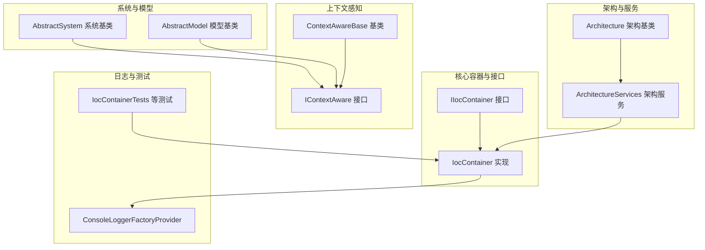
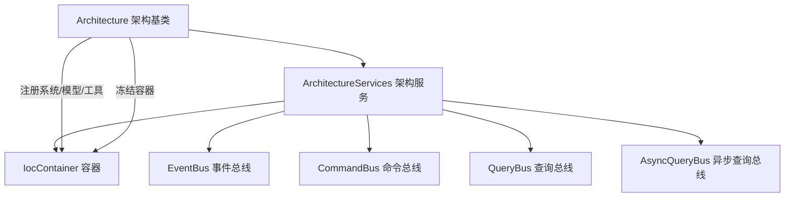
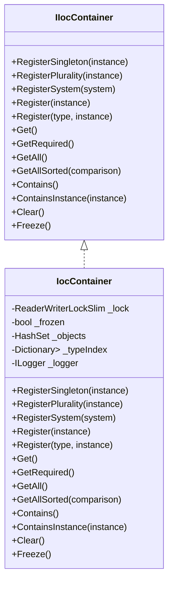
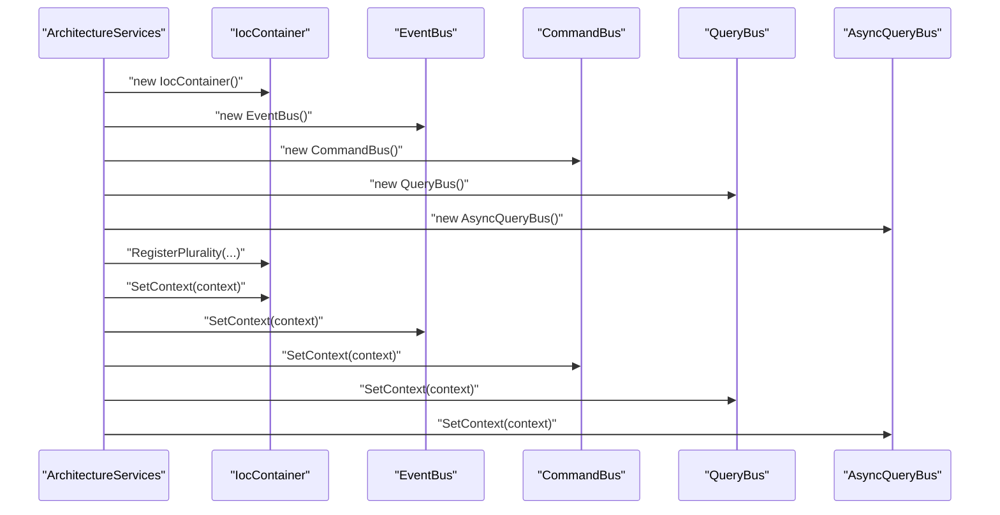
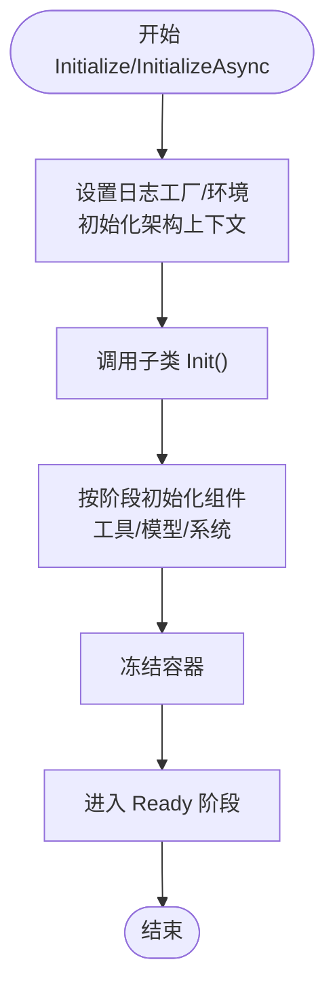
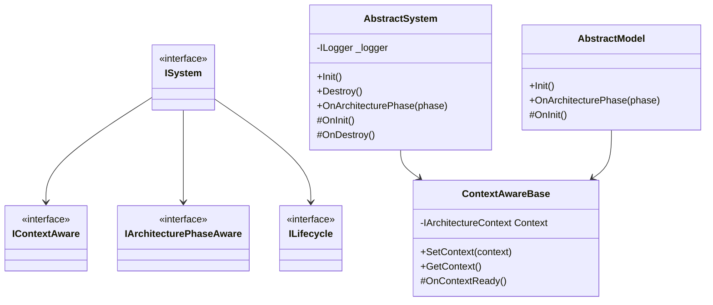
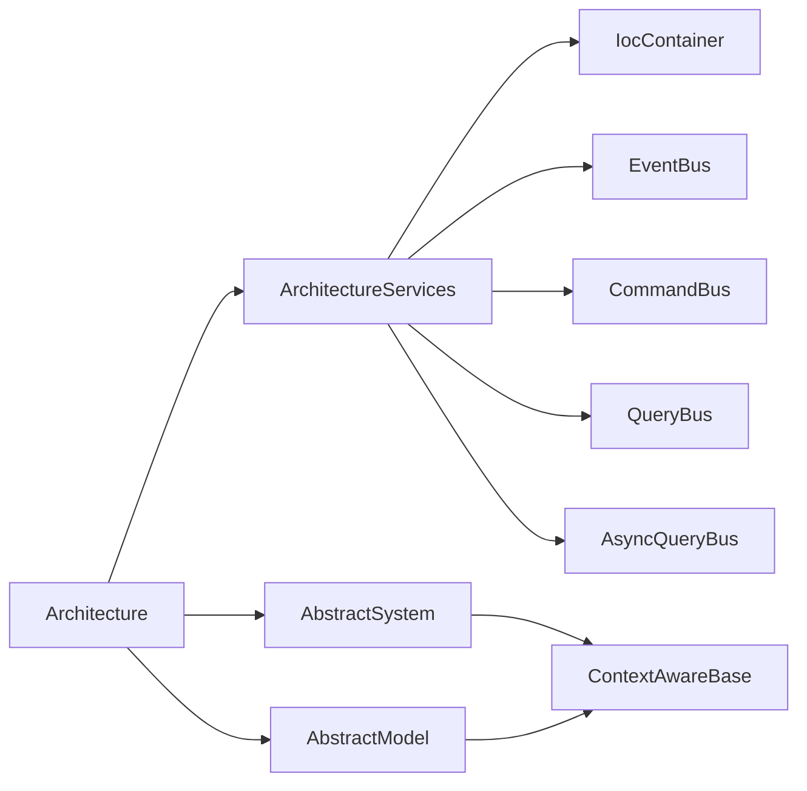
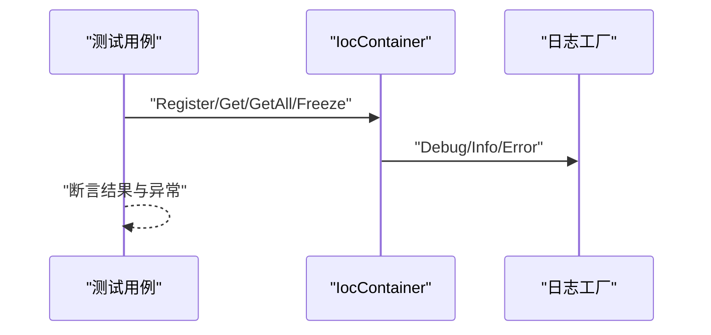

# 依赖管理

<cite>
**本文引用的文件**
- [IocContainer.cs](file://GFramework.Core/ioc/IocContainer.cs)
- [IIocContainer.cs](file://GFramework.Core.Abstractions/ioc/IIocContainer.cs)
- [Architecture.cs](file://GFramework.Core/architecture/Architecture.cs)
- [ArchitectureServices.cs](file://GFramework.Core/architecture/ArchitectureServices.cs)
- [AbstractSystem.cs](file://GFramework.Core/system/AbstractSystem.cs)
- [ContextAwareBase.cs](file://GFramework.Core/rule/ContextAwareBase.cs)
- [IContextAware.cs](file://GFramework.Core.Abstractions/rule/IContextAware.cs)
- [ISystem.cs](file://GFramework.Core.Abstractions/system/ISystem.cs)
- [AbstractModel.cs](file://GFramework.Core/model/AbstractModel.cs)
- [ConsoleLoggerFactoryProvider.cs](file://GFramework.Core/logging/ConsoleLoggerFactoryProvider.cs)
- [IocContainerTests.cs](file://GFramework.Core.Tests/ioc/IocContainerTests.cs)
- [TestSystem.cs](file://GFramework.Core.Tests/system/TestSystem.cs)
- [architecture-patterns.md](file://docs/best-practices/architecture-patterns.md)
- [rule README.md](file://GFramework.Core/rule/README.md)
- [system README.md](file://GFramework.Core/system/README.md)
</cite>

## 目录
1. [简介](#简介)
2. [项目结构](#项目结构)
3. [核心组件](#核心组件)
4. [架构总览](#架构总览)
5. [详细组件分析](#详细组件分析)
6. [依赖分析](#依赖分析)
7. [性能考量](#性能考量)
8. [故障排查指南](#故障排查指南)
9. [结论](#结论)
10. [附录](#附录)

## 简介
本文件面向GFramework的依赖管理最佳实践，围绕“构造函数注入”“接口隔离”“依赖倒置”三大原则，结合框架中的IoC容器、架构服务、系统与模型基类、上下文感知机制，给出可落地的实现范式与测试策略。文档同时覆盖常见陷阱与规避方案，帮助团队在复杂游戏架构中建立稳定、可测试、可演进的依赖体系。

## 项目结构
GFramework采用分层与职责分离的组织方式，核心依赖管理相关模块分布如下：
- 核心容器与接口：GFramework.Core/ioc 与 GFramework.Core.Abstractions/ioc
- 架构与服务：GFramework.Core/architecture
- 系统与模型基类：GFramework.Core/system、GFramework.Core/model
- 上下文感知与规则：GFramework.Core/rule
- 日志与测试：GFramework.Core/logging、GFramework.Core.Tests

图表来源
- [IIocContainer.cs](file://GFramework.Core.Abstractions/ioc/IIocContainer.cs#L1-L116)
- [IocContainer.cs](file://GFramework.Core/ioc/IocContainer.cs#L1-L373)
- [ArchitectureServices.cs](file://GFramework.Core/architecture/ArchitectureServices.cs#L1-L106)
- [Architecture.cs](file://GFramework.Core/architecture/Architecture.cs#L1-L569)
- [AbstractSystem.cs](file://GFramework.Core/system/AbstractSystem.cs#L1-L62)
- [AbstractModel.cs](file://GFramework.Core/model/AbstractModel.cs#L1-L34)
- [ContextAwareBase.cs](file://GFramework.Core/rule/ContextAwareBase.cs#L1-L43)
- [IContextAware.cs](file://GFramework.Core.Abstractions/rule/IContextAware.cs#L1-L21)
- [ConsoleLoggerFactoryProvider.cs](file://GFramework.Core/logging/ConsoleLoggerFactoryProvider.cs#L1-L24)
- [IocContainerTests.cs](file://GFramework.Core.Tests/ioc/IocContainerTests.cs#L1-L346)

章节来源
- [IIocContainer.cs](file://GFramework.Core.Abstractions/ioc/IIocContainer.cs#L1-L116)
- [IocContainer.cs](file://GFramework.Core/ioc/IocContainer.cs#L1-L373)
- [ArchitectureServices.cs](file://GFramework.Core/architecture/ArchitectureServices.cs#L1-L106)
- [Architecture.cs](file://GFramework.Core/architecture/Architecture.cs#L1-L569)
- [AbstractSystem.cs](file://GFramework.Core/system/AbstractSystem.cs#L1-L62)
- [AbstractModel.cs](file://GFramework.Core/model/AbstractModel.cs#L1-L34)
- [ContextAwareBase.cs](file://GFramework.Core/rule/ContextAwareBase.cs#L1-L43)
- [IContextAware.cs](file://GFramework.Core.Abstractions/rule/IContextAware.cs#L1-L21)
- [ConsoleLoggerFactoryProvider.cs](file://GFramework.Core/logging/ConsoleLoggerFactoryProvider.cs#L1-L24)
- [IocContainerTests.cs](file://GFramework.Core.Tests/ioc/IocContainerTests.cs#L1-L346)

## 核心组件
- 依赖注入容器（IIocContainer/IocContainer）
  - 提供注册（单例、多样性、系统）、解析（Get/GetRequired/GetAll/GetAllSorted）、冻结保护、包含性检查与清空等能力。
  - 支持线程安全的读写锁与冻结状态，防止初始化后误注册。
- 架构服务（ArchitectureServices）
  - 聚合容器、事件总线、命令/查询总线，统一对外暴露。
  - 在SetContext时同步传递上下文给容器与各总线。
- 架构基类（Architecture）
  - 通过Services.Container访问IocContainer，统一注册系统/模型/工具，维护生命周期队列与阶段流转。
  - 初始化完成后冻结容器，保证运行期依赖解析的确定性。
- 系统与模型基类（AbstractSystem/AbstractModel）
  - 均继承ContextAwareBase，具备上下文感知能力，便于在OnInit/Init中按需获取依赖。
- 上下文感知（ContextAwareBase/IContextAware）
  - 为组件提供SetContext/GetContext能力，支持延迟绑定与默认回退。

章节来源
- [IIocContainer.cs](file://GFramework.Core.Abstractions/ioc/IIocContainer.cs#L1-L116)
- [IocContainer.cs](file://GFramework.Core/ioc/IocContainer.cs#L1-L373)
- [ArchitectureServices.cs](file://GFramework.Core/architecture/ArchitectureServices.cs#L1-L106)
- [Architecture.cs](file://GFramework.Core/architecture/Architecture.cs#L1-L569)
- [AbstractSystem.cs](file://GFramework.Core/system/AbstractSystem.cs#L1-L62)
- [AbstractModel.cs](file://GFramework.Core/model/AbstractModel.cs#L1-L34)
- [ContextAwareBase.cs](file://GFramework.Core/rule/ContextAwareBase.cs#L1-L43)
- [IContextAware.cs](file://GFramework.Core.Abstractions/rule/IContextAware.cs#L1-L21)

## 架构总览
下图展示了依赖注入在架构中的位置与交互路径：架构服务聚合容器与总线；架构基类在初始化阶段注册组件并冻结容器；系统/模型通过上下文感知获取依赖；日志工厂提供统一日志能力。

图表来源
- [Architecture.cs](file://GFramework.Core/architecture/Architecture.cs#L1-L569)
- [ArchitectureServices.cs](file://GFramework.Core/architecture/ArchitectureServices.cs#L1-L106)
- [IocContainer.cs](file://GFramework.Core/ioc/IocContainer.cs#L1-L373)

章节来源
- [Architecture.cs](file://GFramework.Core/architecture/Architecture.cs#L1-L569)
- [ArchitectureServices.cs](file://GFramework.Core/architecture/ArchitectureServices.cs#L1-L106)
- [IocContainer.cs](file://GFramework.Core/ioc/IocContainer.cs#L1-L373)

## 详细组件分析

### 依赖注入容器（IocContainer）
- 注册策略
  - RegisterSingleton：单例注册，防重复与冻结保护。
  - RegisterPlurality/Register：按具体类型与实现接口同时注册，便于接口解析。
  - RegisterSystem：专门注册系统实例，等价于RegisterPlurality。
- 解析策略
  - Get：返回首个匹配实例，适合具体类型。
  - GetRequired：要求唯一实例，否则抛出异常。
  - GetAll/GetAllSorted：返回全部实例，支持排序（系统调度场景）。
- 容器治理
  - Freeze：初始化完成后冻结，禁止后续注册。
  - Clear/Contains/ContainsInstance：容器清理与存在性检查。
- 线程安全
  - 使用ReaderWriterLockSlim实现读写锁，避免并发问题。

图表来源
- [IIocContainer.cs](file://GFramework.Core.Abstractions/ioc/IIocContainer.cs#L1-L116)
- [IocContainer.cs](file://GFramework.Core/ioc/IocContainer.cs#L1-L373)

章节来源
- [IIocContainer.cs](file://GFramework.Core.Abstractions/ioc/IIocContainer.cs#L1-L116)
- [IocContainer.cs](file://GFramework.Core/ioc/IocContainer.cs#L1-L373)

### 架构服务（ArchitectureServices）
- 职责
  - 组合并持有容器、事件总线、命令/查询总线。
  - 在构造时将核心服务注册到容器，供架构基类统一获取。
- 上下文传播
  - SetContext时将上下文传递给容器与各总线，确保解析与事件路由一致。

图表来源
- [ArchitectureServices.cs](file://GFramework.Core/architecture/ArchitectureServices.cs#L1-L106)

章节来源
- [ArchitectureServices.cs](file://GFramework.Core/architecture/ArchitectureServices.cs#L1-L106)

### 架构基类（Architecture）与生命周期
- 模块/组件注册
  - InstallModule：注册模块并安装。
  - RegisterSystem/RegisterModel/RegisterUtility：注册系统/模型/工具，注入上下文并登记生命周期。
- 初始化流程
  - Initialize/InitializeAsync：设置日志工厂、环境、上下文，调用子类Init，随后按阶段初始化工具/模型/系统，最后冻结容器。
- 阶段与钩子
  - EnterPhase/NotifyPhase/NotifyPhaseAwareObjects：阶段转换与通知。
  - RegisterLifecycleHook：允许在Ready前注册生命周期钩子。

图表来源
- [Architecture.cs](file://GFramework.Core/architecture/Architecture.cs#L1-L569)

章节来源
- [Architecture.cs](file://GFramework.Core/architecture/Architecture.cs#L1-L569)

### 系统与模型基类（AbstractSystem/AbstractModel）
- AbstractSystem
  - 提供Init/Destroy与架构阶段回调，内部通过ContextAwareBase获取日志工厂。
- AbstractModel
  - 实现IInitializable.Init，委托子类OnInit；支持架构阶段回调。

图表来源
- [ISystem.cs](file://GFramework.Core.Abstractions/system/ISystem.cs#L1-L11)
- [ContextAwareBase.cs](file://GFramework.Core/rule/ContextAwareBase.cs#L1-L43)
- [AbstractSystem.cs](file://GFramework.Core/system/AbstractSystem.cs#L1-L62)
- [AbstractModel.cs](file://GFramework.Core/model/AbstractModel.cs#L1-L34)

章节来源
- [ISystem.cs](file://GFramework.Core.Abstractions/system/ISystem.cs#L1-L11)
- [ContextAwareBase.cs](file://GFramework.Core/rule/ContextAwareBase.cs#L1-L43)
- [AbstractSystem.cs](file://GFramework.Core/system/AbstractSystem.cs#L1-L62)
- [AbstractModel.cs](file://GFramework.Core/model/AbstractModel.cs#L1-L34)

### 构造函数注入与接口隔离的实际应用
- 构造函数注入
  - 在系统类中通过构造函数接收依赖，避免在OnInit中动态解析，提升可测试性与明确性。
  - 示例参考：[architecture-patterns.md](file://docs/best-practices/architecture-patterns.md#L468-L527)
- 接口隔离
  - 将职责拆分为小而专注的接口，通过接口组合实现能力拼装，降低耦合度。
  - 示例参考：[architecture-patterns.md](file://docs/best-practices/architecture-patterns.md#L529-L576)
- 依赖倒置
  - 高层模块（如系统）依赖抽象（接口），通过IoC容器注入具体实现，便于替换与测试。
  - 示例参考：[architecture-patterns.md](file://docs/best-practices/architecture-patterns.md#L186-L282)

章节来源
- [architecture-patterns.md](file://docs/best-practices/architecture-patterns.md#L186-L282)
- [architecture-patterns.md](file://docs/best-practices/architecture-patterns.md#L468-L527)
- [architecture-patterns.md](file://docs/best-practices/architecture-patterns.md#L529-L576)

### 在PlayerCombatSystem等组件中的依赖注入实践
- 依赖注入实现范式
  - 通过构造函数注入模型与服务接口，系统内仅持有抽象，不直接依赖具体实现。
  - 在系统OnInit中注册事件监听，处理业务逻辑。
- 与架构集成
  - 系统通过ContextAwareBase获取日志工厂；通过架构上下文解析模型/系统/事件总线等。
- 参考示例
  - 系统职责划分与事件驱动：[system README.md](file://GFramework.Core/system/README.md#L434-L490)
  - 控制器与系统协作示例（含上下文获取与事件发送）：[rule README.md](file://GFramework.Core/rule/README.md#L166-L267)

章节来源
- [system README.md](file://GFramework.Core/system/README.md#L434-L490)
- [rule README.md](file://GFramework.Core/rule/README.md#L166-L267)

## 依赖分析
- 组件耦合与内聚
  - IocContainer与ArchitectureServices高内聚，共同支撑架构生命周期与依赖解析。
  - Architecture通过Services间接依赖容器，降低外部直接耦合。
- 直接与间接依赖
  - AbstractSystem/AbstractModel依赖ContextAwareBase，间接获得上下文能力。
  - ArchitectureServices向容器注册核心总线，形成间接依赖链。
- 循环依赖规避
  - 通过冻结容器与阶段化初始化，避免运行期循环依赖导致的解析死锁。
  - 通过接口隔离与依赖倒置，减少实现间的直接耦合。

图表来源
- [Architecture.cs](file://GFramework.Core/architecture/Architecture.cs#L1-L569)
- [ArchitectureServices.cs](file://GFramework.Core/architecture/ArchitectureServices.cs#L1-L106)
- [IocContainer.cs](file://GFramework.Core/ioc/IocContainer.cs#L1-L373)
- [AbstractSystem.cs](file://GFramework.Core/system/AbstractSystem.cs#L1-L62)
- [AbstractModel.cs](file://GFramework.Core/model/AbstractModel.cs#L1-L34)
- [ContextAwareBase.cs](file://GFramework.Core/rule/ContextAwareBase.cs#L1-L43)

章节来源
- [Architecture.cs](file://GFramework.Core/architecture/Architecture.cs#L1-L569)
- [ArchitectureServices.cs](file://GFramework.Core/architecture/ArchitectureServices.cs#L1-L106)
- [IocContainer.cs](file://GFramework.Core/ioc/IocContainer.cs#L1-L373)
- [AbstractSystem.cs](file://GFramework.Core/system/AbstractSystem.cs#L1-L62)
- [AbstractModel.cs](file://GFramework.Core/model/AbstractModel.cs#L1-L34)
- [ContextAwareBase.cs](file://GFramework.Core/rule/ContextAwareBase.cs#L1-L43)

## 性能考量
- 解析成本
  - Get/GetAll基于类型索引与快照，读取为O(1)查找+拷贝，建议在初始化阶段缓存常用依赖引用，避免每帧重复解析。
- 线程安全
  - 读写锁保障并发安全，但频繁写入（注册）会带来开销；尽量在初始化阶段完成注册，运行期避免动态注册。
- 冻结容器
  - 初始化完成后冻结容器，避免运行期变更带来的额外校验与潜在竞争。

章节来源
- [IocContainer.cs](file://GFramework.Core/ioc/IocContainer.cs#L1-L373)
- [Architecture.cs](file://GFramework.Core/architecture/Architecture.cs#L1-L569)

## 故障排查指南
- 常见错误与定位
  - 注册单例重复：抛出InvalidOperationException，检查是否重复注册同一类型。
  - 冻结后注册：抛出InvalidOperationException，确认是否在初始化后仍尝试注册。
  - GetRequired无实例或多实例：抛出InvalidOperationException，检查注册数量与类型映射。
  - 容器为空：Get返回null，GetAll返回空列表，确认Register/注册类型映射是否正确。
- 日志与诊断
  - 容器内部使用日志工厂输出调试信息，可通过ConsoleLoggerFactoryProvider设置最小日志级别。
- 测试策略
  - 使用IocContainerTests覆盖注册、解析、冻结、包含性等核心行为。
  - 使用TestSystem验证系统生命周期与上下文传递。

图表来源
- [IocContainerTests.cs](file://GFramework.Core.Tests/ioc/IocContainerTests.cs#L1-L346)
- [ConsoleLoggerFactoryProvider.cs](file://GFramework.Core/logging/ConsoleLoggerFactoryProvider.cs#L1-L24)

章节来源
- [IocContainerTests.cs](file://GFramework.Core.Tests/ioc/IocContainerTests.cs#L1-L346)
- [ConsoleLoggerFactoryProvider.cs](file://GFramework.Core/logging/ConsoleLoggerFactoryProvider.cs#L1-L24)

## 结论
GFramework通过清晰的接口边界、可冻结的IoC容器与阶段化的架构初始化，为依赖管理提供了坚实基础。配合构造函数注入、接口隔离与依赖倒置原则，团队可以在保持系统解耦的同时，显著提升可测试性与可维护性。建议在实际开发中：
- 优先使用构造函数注入与接口解析；
- 严格遵守接口隔离，按职责拆分接口；
- 在初始化阶段完成依赖注册，运行期避免动态变更；
- 通过测试用例覆盖容器行为与系统生命周期。

## 附录
- 术语
  - 构造函数注入：通过构造函数显式传入依赖，提升可测试性与明确性。
  - 接口隔离：将职责拆分为小而专注的接口，避免“胖接口”。
  - 依赖倒置：高层模块依赖抽象而非具体实现，通过容器注入替换。
- 参考示例
  - 构造函数注入与依赖倒置示例：[architecture-patterns.md](file://docs/best-practices/architecture-patterns.md#L186-L282)
  - 接口隔离示例：[architecture-patterns.md](file://docs/best-practices/architecture-patterns.md#L529-L576)
  - 系统职责与事件驱动示例：[system README.md](file://GFramework.Core/system/README.md#L434-L490)