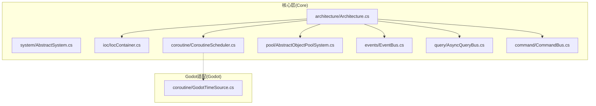
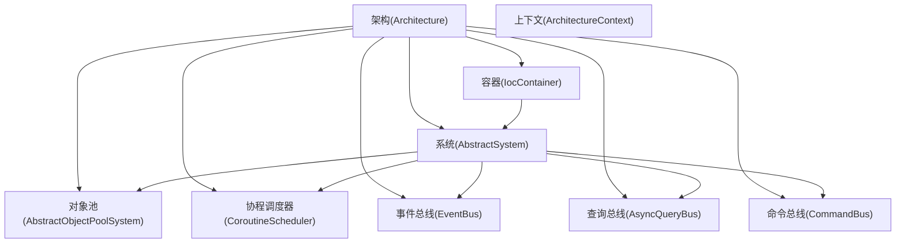
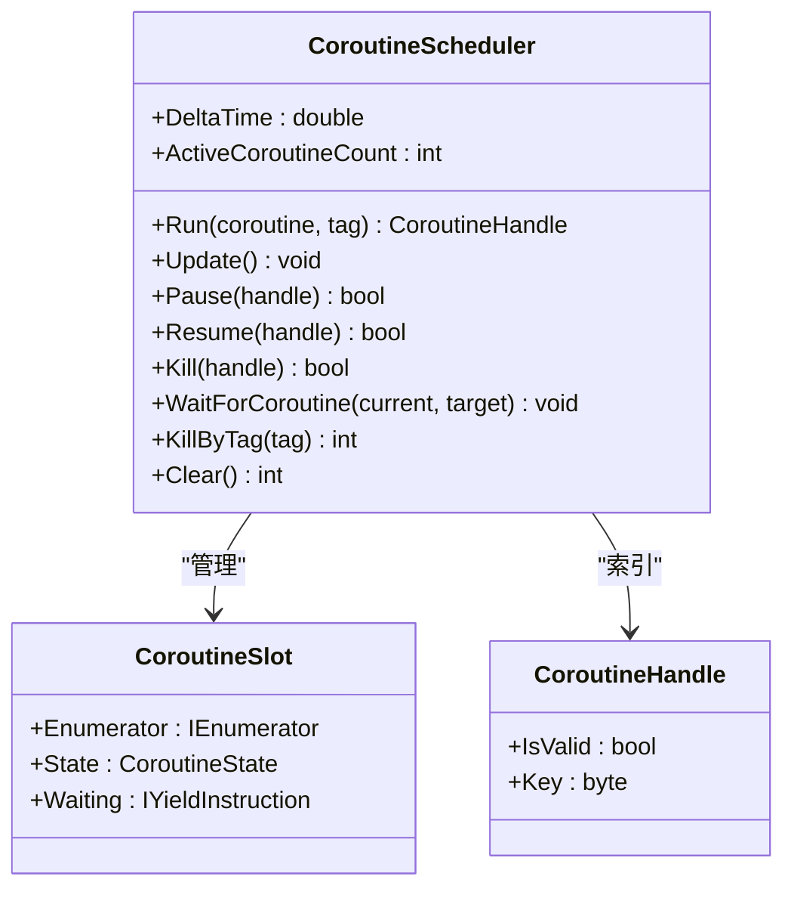
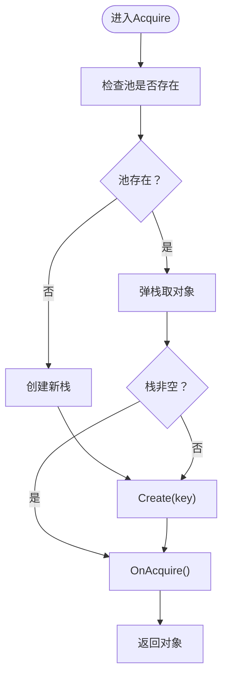
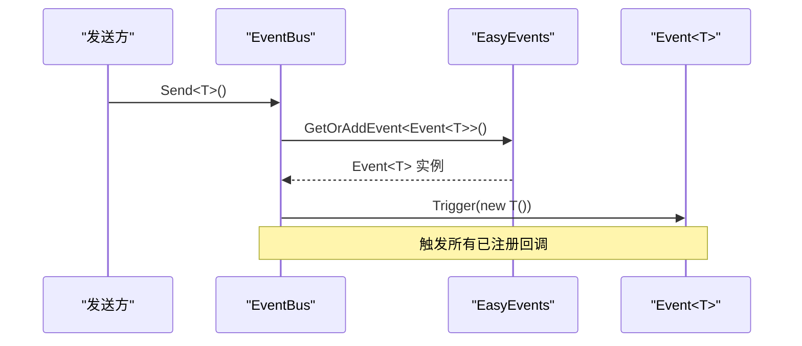
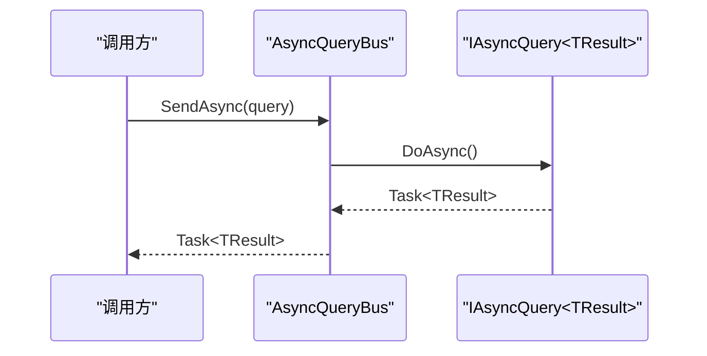
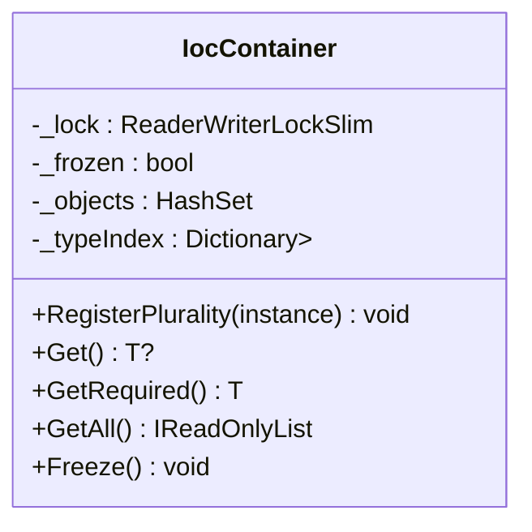
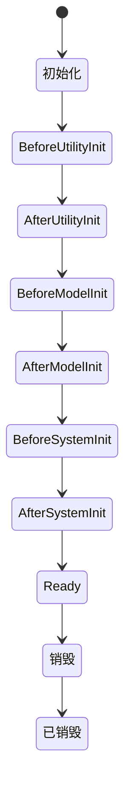
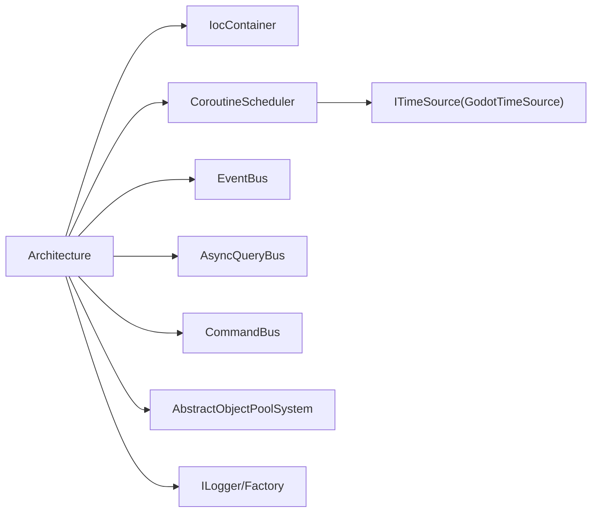

# 性能优化

<cite>
**本文引用的文件**
- [GFramework.Core/coroutine/CoroutineScheduler.cs](file://GFramework.Core/coroutine/CoroutineScheduler.cs)
- [GFramework.Core/coroutine/CoroutineSlot.cs](file://GFramework.Core/coroutine/CoroutineSlot.cs)
- [GFramework.Core/coroutine/CoroutineHandle.cs](file://GFramework.Core/coroutine/CoroutineHandle.cs)
- [GFramework.Core/coroutine/CoroutineHelper.cs](file://GFramework.Core/coroutine/CoroutineHelper.cs)
- [GFramework.Core/pool/AbstractObjectPoolSystem.cs](file://GFramework.Core/pool/AbstractObjectPoolSystem.cs)
- [GFramework.Core/events/EventBus.cs](file://GFramework.Core/events/EventBus.cs)
- [GFramework.Core/events/EasyEvents.cs](file://GFramework.Core/events/EasyEvents.cs)
- [GFramework.Core/events/EasyEvent.cs](file://GFramework.Core/events/EasyEvent.cs)
- [GFramework.Core/query/AsyncQueryBus.cs](file://GFramework.Core/query/AsyncQueryBus.cs)
- [GFramework.Core/command/CommandBus.cs](file://GFramework.Core/command/CommandBus.cs)
- [GFramework.Core/ioc/IocContainer.cs](file://GFramework.Core/ioc/IocContainer.cs)
- [GFramework.Core/architecture/Architecture.cs](file://GFramework.Core/architecture/Architecture.cs)
- [GFramework.Core/system/AbstractSystem.cs](file://GFramework.Core/system/AbstractSystem.cs)
- [GFramework.Core/logging/ConsoleLogger.cs](file://GFramework.Core/logging/ConsoleLogger.cs)
- [GFramework.Core.Abstractions/pool/IPoolableObject.cs](file://GFramework.Core.Abstractions/pool/IPoolableObject.cs)
- [GFramework.Core/pool/README.md](file://GFramework.Core/pool/README.md)
</cite>

## 目录
1. [简介](#简介)
2. [项目结构](#项目结构)
3. [核心组件](#核心组件)
4. [架构总览](#架构总览)
5. [详细组件分析](#详细组件分析)
6. [依赖分析](#依赖分析)
7. [性能考量](#性能考量)
8. [故障排查指南](#故障排查指南)
9. [结论](#结论)
10. [附录](#附录)

## 简介
本文件面向GFramework的性能优化实践，围绕内存管理、协程调度、事件系统、资源加载与性能监控五大主题，结合代码库中的实际实现，给出可落地的最佳实践与优化建议。内容兼顾工程效率与长期维护性，帮助团队在保证稳定性的同时获得更佳的运行时表现。

## 项目结构
GFramework采用分层与模块化组织，核心能力集中在Core层，Godot适配位于GFramework.Godot，游戏业务位于GFramework.Game。与性能优化直接相关的关键目录如下：
- coroutine：协程调度与等待指令
- pool：对象池系统
- events：事件总线与事件管理
- query/command：查询/命令总线
- ioc：依赖注入容器
- architecture/system：架构生命周期与系统基类
- logging：日志基础设施

**图表来源**
- [GFramework.Core/architecture/Architecture.cs](file://GFramework.Core/architecture/Architecture.cs#L23-L88)
- [GFramework.Core/system/AbstractSystem.cs](file://GFramework.Core/system/AbstractSystem.cs#L13-L62)
- [GFramework.Core/ioc/IocContainer.cs](file://GFramework.Core/ioc/IocContainer.cs#L12-L51)
- [GFramework.Core/coroutine/CoroutineScheduler.cs](file://GFramework.Core/coroutine/CoroutineScheduler.cs#L11-L24)
- [GFramework.Core/pool/AbstractObjectPoolSystem.cs](file://GFramework.Core/pool/AbstractObjectPoolSystem.cs#L11-L17)
- [GFramework.Core/events/EventBus.cs](file://GFramework.Core/events/EventBus.cs#L8-L10)
- [GFramework.Core/query/AsyncQueryBus.cs](file://GFramework.Core/query/AsyncQueryBus.cs#L8-L16)
- [GFramework.Core/command/CommandBus.cs](file://GFramework.Core/command/CommandBus.cs#L9-L16)

**章节来源**
- [GFramework.Core/architecture/Architecture.cs](file://GFramework.Core/architecture/Architecture.cs#L23-L88)
- [GFramework.Core/system/AbstractSystem.cs](file://GFramework.Core/system/AbstractSystem.cs#L13-L62)
- [GFramework.Core/ioc/IocContainer.cs](file://GFramework.Core/ioc/IocContainer.cs#L12-L51)

## 核心组件
- 协程调度器：负责协程的创建、推进、暂停/恢复、终止与等待链管理，内置槽位数组与元数据映射，支持按标签批量终止。
- 对象池系统：提供键控对象池，支持Acquire/Release/Clear，与系统生命周期联动，降低GC压力。
- 事件系统：基于类型事件的注册/注销/触发，支持全局事件管理器与泛型事件自动创建。
- 查询/命令总线：同步/异步执行查询与命令，参数校验与异常处理。
- 依赖注入容器：线程安全注册与获取，支持冻结后禁止修改，便于运行期稳定。
- 架构生命周期：统一组件初始化/销毁流程，阶段化通知，便于性能敏感组件的有序启动与回收。

**章节来源**
- [GFramework.Core/coroutine/CoroutineScheduler.cs](file://GFramework.Core/coroutine/CoroutineScheduler.cs#L11-L121)
- [GFramework.Core/pool/AbstractObjectPoolSystem.cs](file://GFramework.Core/pool/AbstractObjectPoolSystem.cs#L24-L70)
- [GFramework.Core/events/EventBus.cs](file://GFramework.Core/events/EventBus.cs#L16-L54)
- [GFramework.Core/query/AsyncQueryBus.cs](file://GFramework.Core/query/AsyncQueryBus.cs#L16-L21)
- [GFramework.Core/command/CommandBus.cs](file://GFramework.Core/command/CommandBus.cs#L16-L61)
- [GFramework.Core/ioc/IocContainer.cs](file://GFramework.Core/ioc/IocContainer.cs#L69-L199)
- [GFramework.Core/architecture/Architecture.cs](file://GFramework.Core/architecture/Architecture.cs#L264-L347)

## 架构总览
下图展示与性能优化强相关的组件交互：架构负责注册与生命周期管理，容器提供线程安全的依赖解析，调度器驱动协程，事件系统承载解耦通信，对象池降低内存分配，查询/命令总线支撑数据与控制流。

**图表来源**
- [GFramework.Core/architecture/Architecture.cs](file://GFramework.Core/architecture/Architecture.cs#L423-L483)
- [GFramework.Core/ioc/IocContainer.cs](file://GFramework.Core/ioc/IocContainer.cs#L155-L158)
- [GFramework.Core/pool/AbstractObjectPoolSystem.cs](file://GFramework.Core/pool/AbstractObjectPoolSystem.cs#L11-L17)
- [GFramework.Core/coroutine/CoroutineScheduler.cs](file://GFramework.Core/coroutine/CoroutineScheduler.cs#L11-L24)
- [GFramework.Core/events/EventBus.cs](file://GFramework.Core/events/EventBus.cs#L8-L10)
- [GFramework.Core/query/AsyncQueryBus.cs](file://GFramework.Core/query/AsyncQueryBus.cs#L8-L16)
- [GFramework.Core/command/CommandBus.cs](file://GFramework.Core/command/CommandBus.cs#L9-L16)

## 详细组件分析

### 协程调度器性能优化
- 设计要点
  - 固定容量槽位数组+元数据字典，O(1)定位与状态管理。
  - 预热机制在Run时推进首个MoveNext，减少首帧等待。
  - 等待指令链式推进，异常捕获后主动Complete，避免悬挂。
  - 支持WaitForCoroutine等待链唤醒，减少轮询成本。
  - 标签索引支持按标签批量终止，便于场景切换时的资源回收。
- 性能建议
  - 合理设置初始容量，避免频繁扩容；扩容为倍增，注意峰值协程数。
  - 使用WaitForFrames/WaitOneFrame替代轮询，降低Update循环开销。
  - 为长耗时协程设置超时/取消路径，配合标签批量终止。
  - 将高频短协程合并为单次Update内的多次MoveNext，减少调度抖动。
- 关键路径
  - Run：创建槽位、元数据、预热、活跃计数+1。
  - Update：遍历槽位，处理Waiting、MoveNext、异常处理。
  - Complete：回收槽位、移除标签、唤醒等待者。
  - Expand：容量翻倍，注意峰值内存占用。

**图表来源**
- [GFramework.Core/coroutine/CoroutineScheduler.cs](file://GFramework.Core/coroutine/CoroutineScheduler.cs#L11-L121)
- [GFramework.Core/coroutine/CoroutineSlot.cs](file://GFramework.Core/coroutine/CoroutineSlot.cs#L8-L24)
- [GFramework.Core/coroutine/CoroutineHandle.cs](file://GFramework.Core/coroutine/CoroutineHandle.cs#L7-L44)

**章节来源**
- [GFramework.Core/coroutine/CoroutineScheduler.cs](file://GFramework.Core/coroutine/CoroutineScheduler.cs#L43-L121)
- [GFramework.Core/coroutine/CoroutineSlot.cs](file://GFramework.Core/coroutine/CoroutineSlot.cs#L8-L24)
- [GFramework.Core/coroutine/CoroutineHandle.cs](file://GFramework.Core/coroutine/CoroutineHandle.cs#L7-L44)

### 对象池系统性能优化
- 设计要点
  - 基于字典+栈的键控池，Acquire优先弹栈，空则Create。
  - 与AbstractSystem生命周期集成，系统销毁时统一调用OnPoolDestroy。
  - 支持Clear一次性销毁所有池内对象，避免碎片化残留。
- 性能建议
  - 明确对象池键域，避免键爆炸导致字典膨胀。
  - 限制池大小或动态调整上限，防止内存占用随时间增长。
  - 在OnAcquire/OnRelease中做最小必要重置，避免昂贵操作。
  - 与协程/事件配合，避免在Update中频繁创建临时对象。
- 关键路径
  - Acquire：取栈顶或Create，调用OnAcquire。
  - Release：调用OnRelease，压栈。
  - Clear：遍历所有对象调用OnPoolDestroy并清空字典。

**图表来源**
- [GFramework.Core/pool/AbstractObjectPoolSystem.cs](file://GFramework.Core/pool/AbstractObjectPoolSystem.cs#L24-L38)

**章节来源**
- [GFramework.Core/pool/AbstractObjectPoolSystem.cs](file://GFramework.Core/pool/AbstractObjectPoolSystem.cs#L24-L70)
- [GFramework.Core.Abstractions/pool/IPoolableObject.cs](file://GFramework.Core.Abstractions/pool/IPoolableObject.cs#L6-L22)
- [GFramework.Core/system/AbstractSystem.cs](file://GFramework.Core/system/AbstractSystem.cs#L54-L61)
- [GFramework.Core/pool/README.md](file://GFramework.Core/pool/README.md#L770-L812)

### 事件系统性能优化
- 设计要点
  - EventBus封装EasyEvents，提供Send/Register/UnRegister。
  - EasyEvents全局单例+类型字典，GetOrAddEvent避免重复创建。
  - EasyEvent简单事件聚合器，支持注册/注销/触发。
- 性能建议
  - 事件粒度拆分：高频事件拆分为细粒度事件，避免一次触发大量回调。
  - 事件批处理：在Update末尾集中触发一批事件，减少多次触发的开销。
  - 反注册及时：不再使用的回调务必UnRegister，避免回调链膨胀。
  - 事件过滤：在注册侧加入谓词过滤，减少无效回调执行。
- 关键路径
  - Send<T>()：GetOrAddEvent<T>() -> Trigger(new T())
  - Register<T>()：GetOrAddEvent<T>() -> Register(onEvent)

**图表来源**
- [GFramework.Core/events/EventBus.cs](file://GFramework.Core/events/EventBus.cs#L16-L33)
- [GFramework.Core/events/EasyEvents.cs](file://GFramework.Core/events/EasyEvents.cs#L74-L84)

**章节来源**
- [GFramework.Core/events/EventBus.cs](file://GFramework.Core/events/EventBus.cs#L16-L54)
- [GFramework.Core/events/EasyEvents.cs](file://GFramework.Core/events/EasyEvents.cs#L26-L84)
- [GFramework.Core/events/EasyEvent.cs](file://GFramework.Core/events/EasyEvent.cs#L17-L38)

### 查询/命令总线性能优化
- 设计要点
  - AsyncQueryBus/Sync CommandBus均进行参数非空校验，避免空引用异常。
  - 异步路径直接返回Task，减少额外包装开销。
- 性能建议
  - 将CPU密集型任务放入后台线程或协程，避免阻塞主线程。
  - 对频繁小查询进行合并或缓存结果，减少重复计算。
  - 命令幂等化设计，避免重试导致的重复开销。
- 关键路径
  - AsyncQueryBus.SendAsync：校验 -> DoAsync()
  - CommandBus.Send/SendAsync：校验 -> Execute/ExecuteAsync()

**图表来源**
- [GFramework.Core/query/AsyncQueryBus.cs](file://GFramework.Core/query/AsyncQueryBus.cs#L16-L21)

**章节来源**
- [GFramework.Core/query/AsyncQueryBus.cs](file://GFramework.Core/query/AsyncQueryBus.cs#L16-L21)
- [GFramework.Core/command/CommandBus.cs](file://GFramework.Core/command/CommandBus.cs#L16-L61)

### 依赖注入容器性能优化
- 设计要点
  - ReaderWriterLockSlim读写锁，读多写少场景高效。
  - Contains/Get/GetAll/Freeze等操作均考虑线程安全与一致性。
  - 冻结后禁止注册，避免运行期不稳定。
- 性能建议
  - 尽量在初始化阶段完成注册，避免运行期频繁注册/注销。
  - 使用GetAllSorted按优先级排序后调度，减少运行时比较成本。
  - 避免过度注册同一实例，减少类型索引冲突与查找成本。
- 关键路径
  - RegisterPlurality：注册具体类型与所有接口。
  - GetAll：快照返回，避免并发修改影响。

**图表来源**
- [GFramework.Core/ioc/IocContainer.cs](file://GFramework.Core/ioc/IocContainer.cs#L12-L51)
- [GFramework.Core/ioc/IocContainer.cs](file://GFramework.Core/ioc/IocContainer.cs#L105-L158)

**章节来源**
- [GFramework.Core/ioc/IocContainer.cs](file://GFramework.Core/ioc/IocContainer.cs#L69-L199)
- [GFramework.Core/ioc/IocContainer.cs](file://GFramework.Core/ioc/IocContainer.cs#L211-L294)
- [GFramework.Core/ioc/IocContainer.cs](file://GFramework.Core/ioc/IocContainer.cs#L357-L370)

### 架构生命周期与系统基类
- 设计要点
  - Architecture统一组件注册、初始化与销毁，阶段化通知。
  - AbstractSystem提供系统级日志与生命周期钩子。
- 性能建议
  - 将重资源初始化放在After*Init阶段，避免阻塞Ready。
  - 系统销毁逆序执行，确保依赖释放顺序正确。
  - 通过RegisterLifecycleHook在特定阶段执行性能敏感操作。
- 关键路径
  - InitializeInternalAsync：设置LoggerFactory、初始化Environment、调用用户Init、分阶段初始化组件、冻结容器、进入Ready。

**图表来源**
- [GFramework.Core/architecture/Architecture.cs](file://GFramework.Core/architecture/Architecture.cs#L264-L330)

**章节来源**
- [GFramework.Core/architecture/Architecture.cs](file://GFramework.Core/architecture/Architecture.cs#L264-L347)
- [GFramework.Core/system/AbstractSystem.cs](file://GFramework.Core/system/AbstractSystem.cs#L20-L41)

## 依赖分析
- 组件耦合
  - Architecture依赖IOC、EventBus、AsyncQueryBus、CommandBus、CoroutineScheduler、AbstractObjectPoolSystem。
  - AbstractSystem作为系统基类，被各业务系统继承，统一日志与生命周期。
  - IocContainer提供线程安全的注册/获取，贯穿系统初始化与运行期。
- 外部依赖
  - 时间源ITimeSource（GodotTimeSource）为协程调度提供DeltaTime。
  - 日志接口ILogger/ILoggerFactory为性能调试与诊断提供基础。

**图表来源**
- [GFramework.Core/architecture/Architecture.cs](file://GFramework.Core/architecture/Architecture.cs#L72-L77)
- [GFramework.Core/coroutine/CoroutineScheduler.cs](file://GFramework.Core/coroutine/CoroutineScheduler.cs#L18-L28)
- [GFramework.Core/logging/ConsoleLogger.cs](file://GFramework.Core/logging/ConsoleLogger.cs#L10-L14)

**章节来源**
- [GFramework.Core/architecture/Architecture.cs](file://GFramework.Core/architecture/Architecture.cs#L72-L77)
- [GFramework.Core/coroutine/CoroutineScheduler.cs](file://GFramework.Core/coroutine/CoroutineScheduler.cs#L18-L28)
- [GFramework.Core/logging/ConsoleLogger.cs](file://GFramework.Core/logging/ConsoleLogger.cs#L10-L14)

## 性能考量
- 内存管理
  - 使用对象池减少GC压力，避免频繁分配；在系统销毁时统一释放。
  - 限制池大小与动态调整，防止内存持续增长。
  - 在OnAcquire/OnRelease中做轻量重置，避免在Update中创建临时对象。
- 协程调度
  - 合理设置初始容量，避免扩容；使用固定帧等待指令替代轮询。
  - 为长协程设置超时/取消路径，配合标签批量终止。
  - 将高频短协程合并，减少调度抖动。
- 事件系统
  - 拆分高频事件，减少单次触发回调数量。
  - 在Update末尾批处理事件，降低多次触发开销。
  - 注册时加入过滤谓词，注销不再使用的回调。
- 查询/命令总线
  - 将CPU密集型任务放入后台线程或协程，避免阻塞主线程。
  - 合并与缓存查询结果，减少重复计算。
- 依赖注入
  - 初始化阶段完成注册，避免运行期频繁注册/注销。
  - 使用GetAllSorted按优先级排序后调度，减少运行时比较成本。
- 日志与监控
  - 使用ILogger输出关键路径耗时与异常，便于定位瓶颈。
  - 在关键节点埋点统计，如协程活跃数、事件触发次数、对象池命中率等。

[本节为通用指导，无需列出章节来源]

## 故障排查指南
- 协程相关
  - 症状：协程卡住或无法结束。排查点：Waiting未完成、MoveNext异常被捕获后Complete、等待链是否正确唤醒。
  - 建议：为协程设置超时/取消，使用标签批量终止。
- 对象池相关
  - 症状：内存持续增长。排查点：池未限制大小、对象未正确Release、系统销毁未调用Clear。
  - 建议：实现池大小上限或动态调整策略，确保OnPoolDestroy被调用。
- 事件相关
  - 症状：回调过多导致卡顿。排查点：事件粒度过粗、未及时UnRegister。
  - 建议：拆分事件、在合适时机注销回调。
- 容器相关
  - 症状：运行期注册失败。排查点：容器被冻结。
  - 建议：在初始化阶段完成注册，避免运行期修改。
- 日志相关
  - 症状：日志过多影响性能。排查点：日志级别与输出设备。
  - 建议：调整最小日志级别，必要时关闭彩色输出。

**章节来源**
- [GFramework.Core/coroutine/CoroutineScheduler.cs](file://GFramework.Core/coroutine/CoroutineScheduler.cs#L94-L120)
- [GFramework.Core/pool/AbstractObjectPoolSystem.cs](file://GFramework.Core/pool/AbstractObjectPoolSystem.cs#L61-L70)
- [GFramework.Core/ioc/IocContainer.cs](file://GFramework.Core/ioc/IocContainer.cs#L357-L370)
- [GFramework.Core/logging/ConsoleLogger.cs](file://GFramework.Core/logging/ConsoleLogger.cs#L16-L17)

## 结论
通过对象池、协程调度、事件系统与依赖注入的协同优化，GFramework能够在保证架构清晰与扩展性的同时显著降低GC压力、提升调度效率与系统稳定性。建议在项目实践中遵循本文的最佳实践，并结合日志与监控持续迭代，逐步形成适合自身业务的性能优化体系。

[本节为总结，无需列出章节来源]

## 附录
- 协程辅助方法
  - 提供WaitForSeconds/WaitForOneFrame/WaitForFrames/WaitUntil/WaitWhile与重复调用工具，便于构建高性能协程流程。
- 性能监控建议
  - 统计ActiveCoroutineCount、事件触发次数、对象池Acquire/Release命中率、容器注册实例数等指标。
  - 在关键路径埋点，输出到ILogger，便于定位热点与瓶颈。

**章节来源**
- [GFramework.Core/coroutine/CoroutineHelper.cs](file://GFramework.Core/coroutine/CoroutineHelper.cs#L15-L100)