# 最佳实践指南

<cite>
**本文档引用的文件**
- [README.md](file://README.md)
- [GFramework.Core/README.md](file://GFramework.Core/README.md)
- [GFramework.Core.Abstractions/README.md](file://GFramework.Core.Abstractions/README.md)
- [GFramework.Game/README.md](file://GFramework.Game/README.md)
- [GFramework.Godot/README.md](file://GFramework.Godot/README.md)
- [docs/best-practices/architecture-patterns.md](file://docs/best-practices/architecture-patterns.md)
- [GFramework.Core/architecture/Architecture.cs](file://GFramework.Core/architecture/Architecture.cs)
- [GFramework.Core/ioc/IocContainer.cs](file://GFramework.Core/ioc/IocContainer.cs)
- [GFramework.Core/events/EventBus.cs](file://GFramework.Core/events/EventBus.cs)
- [GFramework.Core/command/CommandBus.cs](file://GFramework.Core/command/CommandBus.cs)
- [GFramework.Core/query/QueryBus.cs](file://GFramework.Core/query/QueryBus.cs)
- [GFramework.Core/coroutine/CoroutineScheduler.cs](file://GFramework.Core/coroutine/CoroutineScheduler.cs)
- [GFramework.Core/logging/ConsoleLogger.cs](file://GFramework.Core/logging/ConsoleLogger.cs)
- [GFramework.Game/storage/FileStorage.cs](file://GFramework.Game/storage/FileStorage.cs)
- [GFramework.Godot/coroutine/GodotTimeSource.cs](file://GFramework.Godot/coroutine/GodotTimeSource.cs)
</cite>

## 目录
1. [简介](#简介)
2. [项目结构](#项目结构)
3. [核心组件](#核心组件)
4. [架构概览](#架构概览)
5. [详细组件分析](#详细组件分析)
6. [依赖分析](#依赖分析)
7. [性能考虑](#性能考虑)
8. [故障排除指南](#故障排除指南)
9. [结论](#结论)
10. [附录](#附录)

## 简介
本指南面向使用 GFramework 的游戏开发团队，系统阐述 Clean Architecture 在游戏开发中的应用方法，涵盖分层架构设计原则、依赖注入正确使用、模块化开发策略、性能优化技巧、代码组织与命名规范、错误处理与调试方法，以及团队协作与代码审查建议。文档基于仓库中的核心实现与最佳实践文档，提供可操作的指导与可视化说明。

## 项目结构
GFramework 采用多模块分层设计，核心模块与平台集成模块分离，既保证了平台无关性，又为 Godot 等平台提供深度集成能力。

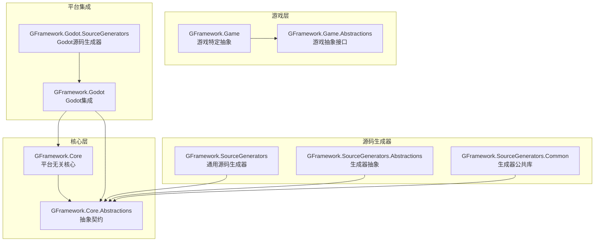

**图表来源**
- [README.md](file://README.md#L235-L254)
- [GFramework.Core/README.md](file://GFramework.Core/README.md#L73-L109)

**章节来源**
- [README.md](file://README.md#L235-L254)
- [GFramework.Core/README.md](file://GFramework.Core/README.md#L73-L109)

## 核心组件
本节聚焦 GFramework 的核心基础设施：架构生命周期管理、依赖注入容器、事件总线、命令/查询总线、协程调度器与日志系统。

- 架构生命周期管理：负责组件注册、初始化阶段推进、销毁流程与阶段感知通知。
- 依赖注入容器：提供注册、解析、冻结与线程安全的实例管理。
- 事件总线：基于类型的事件发布/订阅，支持注册/注销与统一注销列表。
- 命令/查询总线：封装写操作与读操作，支持同步与异步执行。
- 协程调度器：基于时间源的协程执行与等待机制，支持暂停/恢复/终止与标签管理。
- 日志系统：控制台日志记录器，支持级别与彩色输出。

**章节来源**
- [GFramework.Core/architecture/Architecture.cs](file://GFramework.Core/architecture/Architecture.cs#L135-L398)
- [GFramework.Core/ioc/IocContainer.cs](file://GFramework.Core/ioc/IocContainer.cs#L9-L373)
- [GFramework.Core/events/EventBus.cs](file://GFramework.Core/events/EventBus.cs#L1-L55)
- [GFramework.Core/command/CommandBus.cs](file://GFramework.Core/command/CommandBus.cs#L1-L62)
- [GFramework.Core/query/QueryBus.cs](file://GFramework.Core/query/QueryBus.cs#L1-L23)
- [GFramework.Core/coroutine/CoroutineScheduler.cs](file://GFramework.Core/coroutine/CoroutineScheduler.cs#L1-L392)
- [GFramework.Core/logging/ConsoleLogger.cs](file://GFramework.Core/logging/ConsoleLogger.cs#L1-L81)

## 架构概览
GFramework 采用 Clean Architecture 分层，强调关注点分离与依赖倒置：

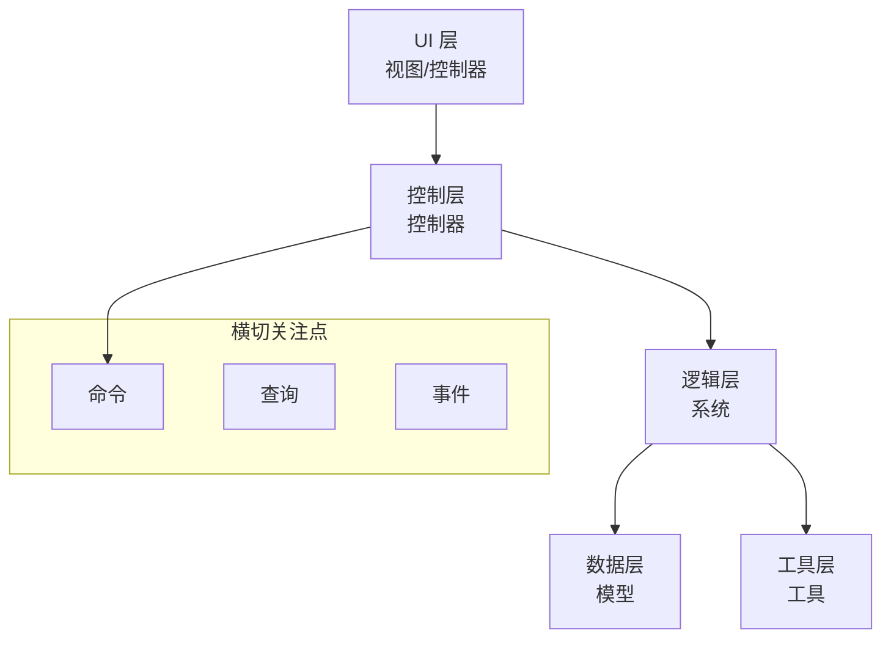

**图表来源**
- [GFramework.Core/README.md](file://GFramework.Core/README.md#L42-L64)

**章节来源**
- [GFramework.Core/README.md](file://GFramework.Core/README.md#L42-L64)

## 详细组件分析

### 架构生命周期与模块化
架构类负责组件注册、初始化阶段推进与销毁流程，支持模块安装与阶段感知。

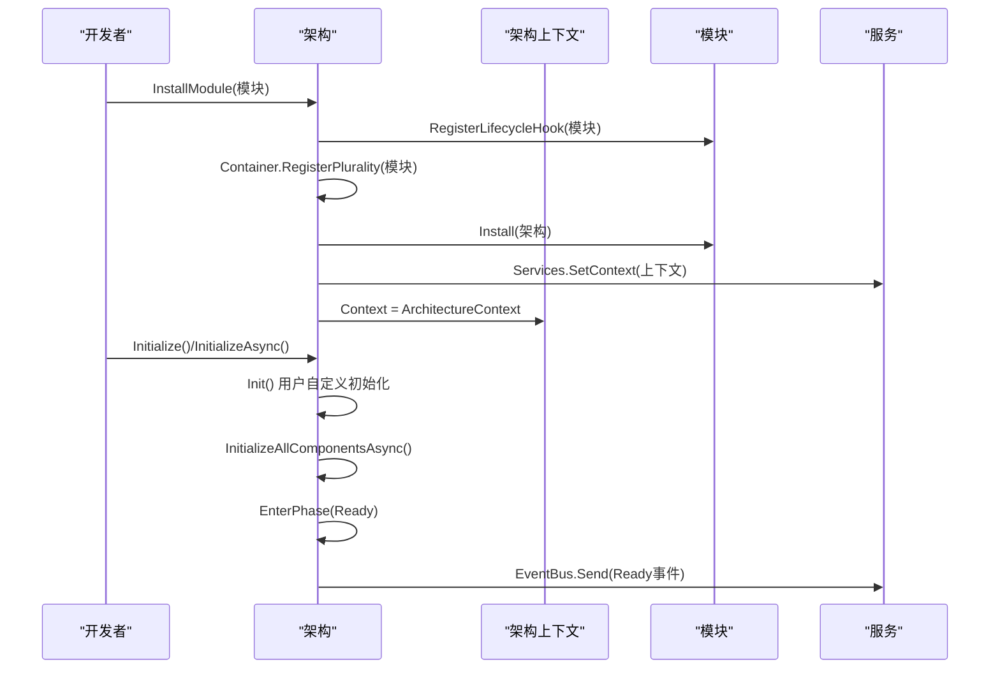

**图表来源**
- [GFramework.Core/architecture/Architecture.cs](file://GFramework.Core/architecture/Architecture.cs#L38-L566)

**章节来源**
- [GFramework.Core/architecture/Architecture.cs](file://GFramework.Core/architecture/Architecture.cs#L135-L398)

### 依赖注入容器
IocContainer 提供注册、解析、冻结与线程安全的实例管理，支持单例与多重注册。

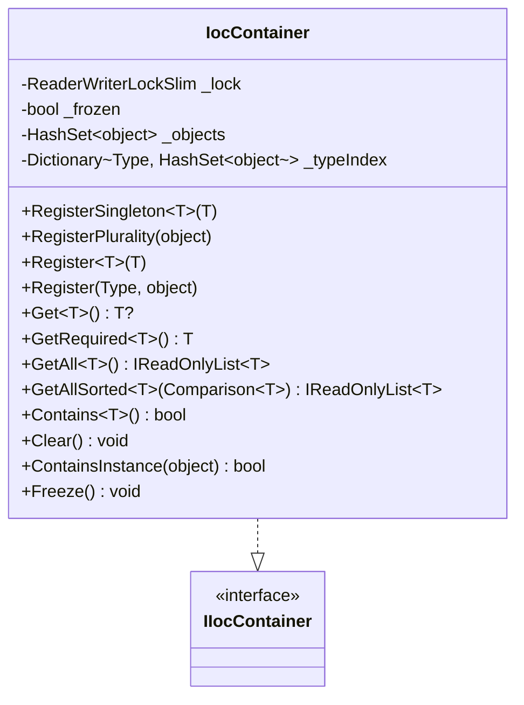

**图表来源**
- [GFramework.Core/ioc/IocContainer.cs](file://GFramework.Core/ioc/IocContainer.cs#L12-L373)

**章节来源**
- [GFramework.Core/ioc/IocContainer.cs](file://GFramework.Core/ioc/IocContainer.cs#L9-L373)

### 事件系统
EventBus 提供基于类型的事件发布/订阅，支持注册/注销与统一注销列表。

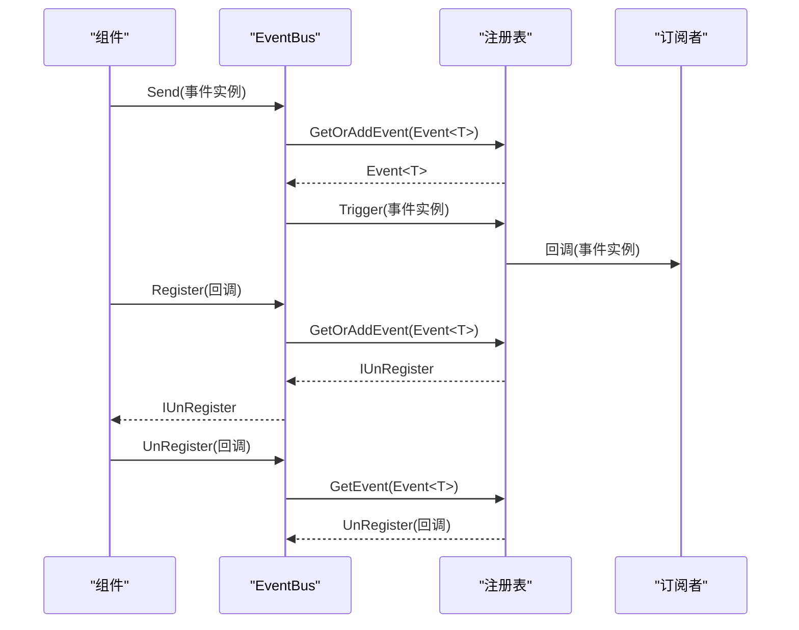

**图表来源**
- [GFramework.Core/events/EventBus.cs](file://GFramework.Core/events/EventBus.cs#L1-L55)

**章节来源**
- [GFramework.Core/events/EventBus.cs](file://GFramework.Core/events/EventBus.cs#L1-L55)

### 命令与查询总线
命令/查询总线封装写操作与读操作，支持同步与异步执行。

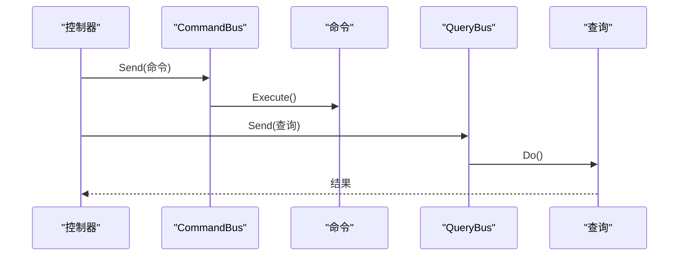

**图表来源**
- [GFramework.Core/command/CommandBus.cs](file://GFramework.Core/command/CommandBus.cs#L1-L62)
- [GFramework.Core/query/QueryBus.cs](file://GFramework.Core/query/QueryBus.cs#L1-L23)

**章节来源**
- [GFramework.Core/command/CommandBus.cs](file://GFramework.Core/command/CommandBus.cs#L1-L62)
- [GFramework.Core/query/QueryBus.cs](file://GFramework.Core/query/QueryBus.cs#L1-L23)

### 协程调度器
协程调度器基于时间源管理协程执行，支持等待、暂停/恢复、终止与标签管理。

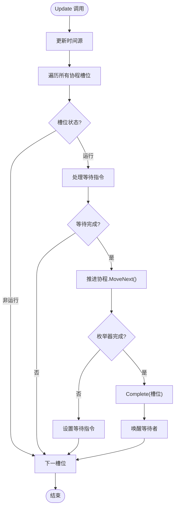

**图表来源**
- [GFramework.Core/coroutine/CoroutineScheduler.cs](file://GFramework.Core/coroutine/CoroutineScheduler.cs#L82-L121)

**章节来源**
- [GFramework.Core/coroutine/CoroutineScheduler.cs](file://GFramework.Core/coroutine/CoroutineScheduler.cs#L1-L392)

### 日志系统
ConsoleLogger 提供控制台日志输出，支持级别与彩色输出。

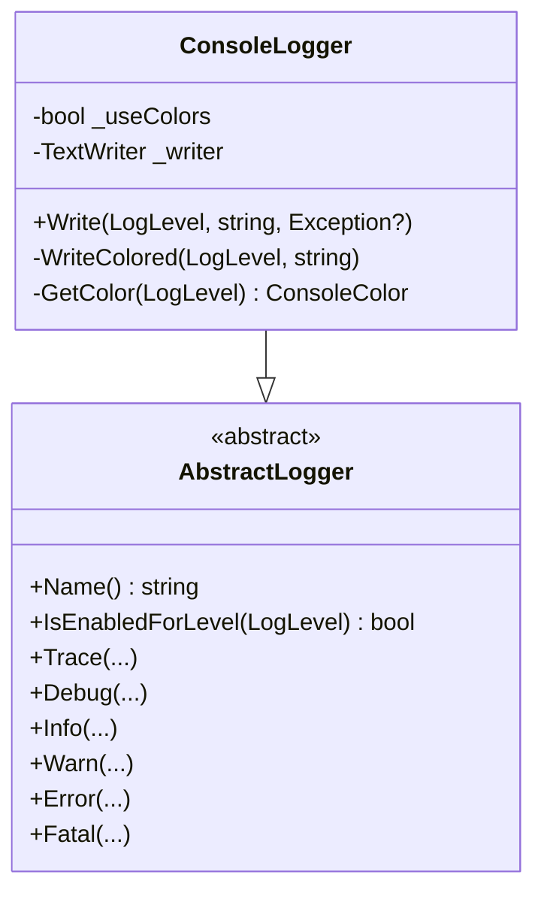

**图表来源**
- [GFramework.Core/logging/ConsoleLogger.cs](file://GFramework.Core/logging/ConsoleLogger.cs#L10-L81)

**章节来源**
- [GFramework.Core/logging/ConsoleLogger.cs](file://GFramework.Core/logging/ConsoleLogger.cs#L1-L81)

### 存储系统
FileStorage 基于文件系统实现存储，支持按 key 细粒度锁保证线程安全。

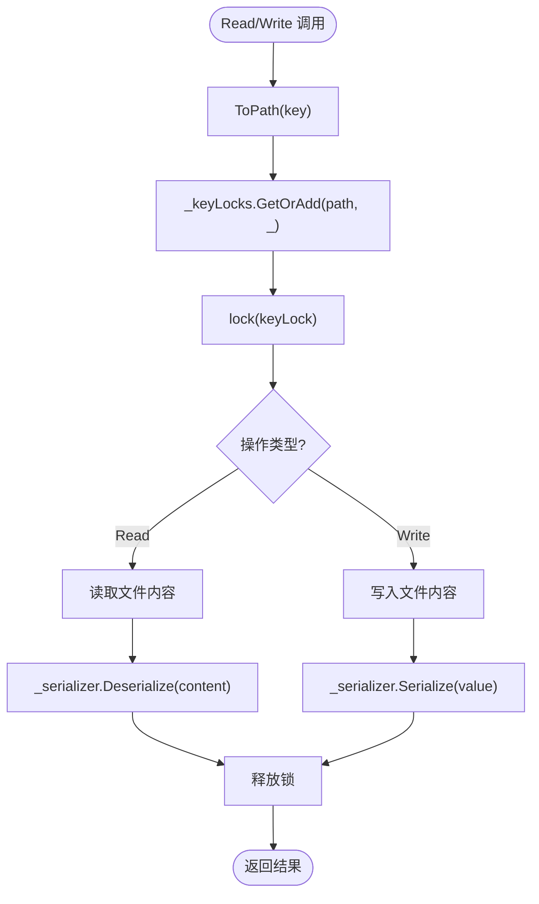

**图表来源**
- [GFramework.Game/storage/FileStorage.cs](file://GFramework.Game/storage/FileStorage.cs#L144-L255)

**章节来源**
- [GFramework.Game/storage/FileStorage.cs](file://GFramework.Game/storage/FileStorage.cs#L1-L258)

### Godot 时间源
GodotTimeSource 提供基于 Godot 引擎的时间信息，用于协程调度器。

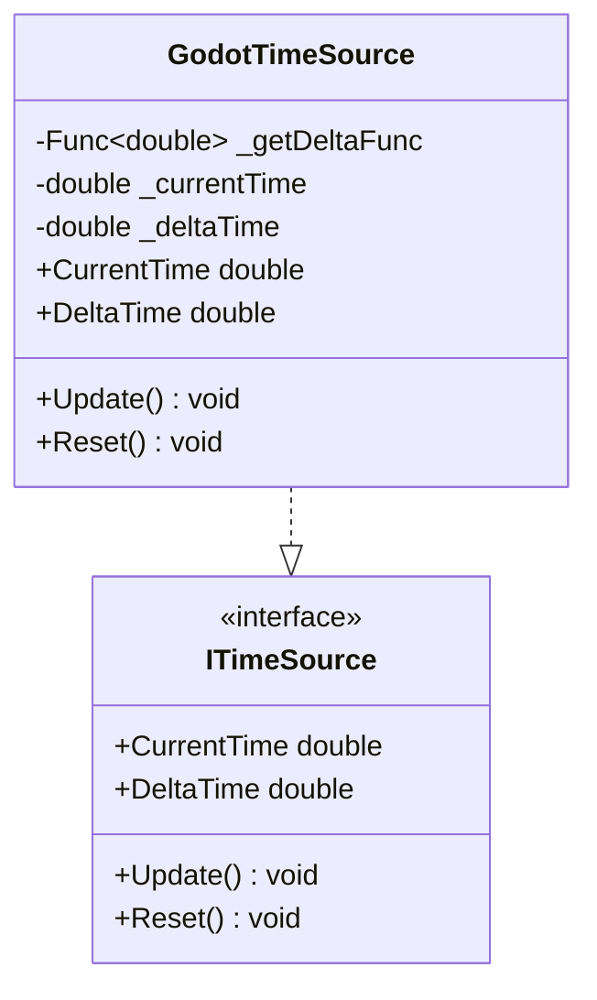

**图表来源**
- [GFramework.Godot/coroutine/GodotTimeSource.cs](file://GFramework.Godot/coroutine/GodotTimeSource.cs#L9-L44)

**章节来源**
- [GFramework.Godot/coroutine/GodotTimeSource.cs](file://GFramework.Godot/coroutine/GodotTimeSource.cs#L1-L44)

## 依赖分析
GFramework 的依赖关系遵循依赖倒置原则，核心模块不依赖具体实现，通过抽象契约与 IoC 容器管理依赖。

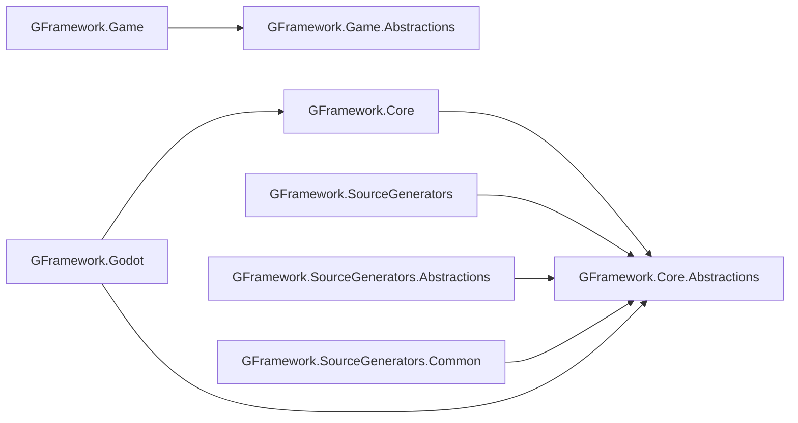

**图表来源**
- [README.md](file://README.md#L33-L51)

**章节来源**
- [README.md](file://README.md#L33-L51)

## 性能考虑
- 协程调度优化
  - 使用标签管理批量终止协程，减少遍历成本。
  - 预热机制一次性推进协程第一步，降低首次启动开销。
  - 等待指令链式更新，避免不必要的 MoveNext 调用。
- 事件系统优化
  - 使用类型事件系统，避免反射与动态派发。
  - 统一注销列表减少内存占用与泄漏风险。
- 依赖注入优化
  - 容器冻结后禁止注册，提升解析性能与安全性。
  - 多重注册支持接口与具体类型，减少解析开销。
- 存储系统优化
  - 按 key 细粒度锁，避免全局锁竞争。
  - 路径清理与防路径逃逸，减少异常开销。
- 日志系统优化
  - 控制台彩色输出仅在标准输出时启用，避免不必要的颜色处理。
  - 级别检查减少日志格式化成本。

**章节来源**
- [GFramework.Core/coroutine/CoroutineScheduler.cs](file://GFramework.Core/coroutine/CoroutineScheduler.cs#L35-L121)
- [GFramework.Core/events/EventBus.cs](file://GFramework.Core/events/EventBus.cs#L1-L55)
- [GFramework.Core/ioc/IocContainer.cs](file://GFramework.Core/ioc/IocContainer.cs#L357-L370)
- [GFramework.Game/storage/FileStorage.cs](file://GFramework.Game/storage/FileStorage.cs#L14-L33)
- [GFramework.Core/logging/ConsoleLogger.cs](file://GFramework.Core/logging/ConsoleLogger.cs#L14-L38)

## 故障排除指南
- 架构初始化失败
  - 检查阶段转换合法性与严格阶段验证配置。
  - 查看日志输出定位失败原因并发送失败事件。
- 组件注册时机错误
  - Ready 阶段后禁止注册组件，除非允许延迟注册。
  - 使用生命周期钩子在合适阶段注册。
- 协程异常处理
  - 协程执行异常会自动完成并清理，避免悬挂。
  - 使用标签批量终止异常协程。
- 事件泄漏排查
  - 使用统一注销列表管理事件注册。
  - 确保节点退出时自动注销事件。
- 存储异常
  - 文件路径非法或路径逃逸会抛出异常。
  - 读取不存在键时抛出文件未找到异常。

**章节来源**
- [GFramework.Core/architecture/Architecture.cs](file://GFramework.Core/architecture/Architecture.cs#L164-L183)
- [GFramework.Core/architecture/Architecture.cs](file://GFramework.Core/architecture/Architecture.cs#L216-L223)
- [GFramework.Core/coroutine/CoroutineScheduler.cs](file://GFramework.Core/coroutine/CoroutineScheduler.cs#L341-L345)
- [GFramework.Game/storage/FileStorage.cs](file://GFramework.Game/storage/FileStorage.cs#L74-L90)
- [GFramework.Game/storage/FileStorage.cs](file://GFramework.Game/storage/FileStorage.cs#L151-L152)

## 结论
GFramework 通过 Clean Architecture 与模块化设计，为游戏开发提供了清晰、可维护、可扩展的基础设施。遵循本文档的分层原则、依赖注入最佳实践、模块化策略与性能优化建议，能够显著提升团队开发效率与代码质量。建议在团队内推广源码生成器与统一日志规范，持续进行代码审查与性能回归测试。

## 附录

### 代码组织与命名规范
- 文件结构建议
  - 按功能域分层：Models、Systems、Controllers、Utilities。
  - 模块化：每个功能模块独立目录，包含接口与实现。
- 命名约定
  - 接口以 I 前缀，如 ISystem、IModel。
  - 抽象类以 Abstract 前缀，如 AbstractSystem、AbstractModel。
  - 控制器以 Controller 结尾，如 PlayerController。
- 注释标准
  - 公共 API 使用 XML 注释，包含参数、返回值与异常说明。
  - 复杂逻辑添加行内注释，解释设计决策与边界条件。

**章节来源**
- [docs/best-practices/architecture-patterns.md](file://docs/best-practices/architecture-patterns.md#L1-L15)

### 错误处理与调试
- 异常处理
  - 架构初始化失败时进入失败阶段并发送失败事件。
  - 组件销毁时捕获异常并继续销毁其他组件。
- 日志记录
  - 使用日志工厂提供程序配置日志级别与输出格式。
  - 控制台日志支持彩色输出与异常堆栈。
- 性能分析
  - 协程调度器提供活跃协程数量与时间差值。
  - 存储系统支持异步读写，注意锁范围与 IO 操作。

**章节来源**
- [GFramework.Core/architecture/Architecture.cs](file://GFramework.Core/architecture/Architecture.cs#L513-L524)
- [GFramework.Core/logging/ConsoleLogger.cs](file://GFramework.Core/logging/ConsoleLogger.cs#L25-L38)
- [GFramework.Core/coroutine/CoroutineScheduler.cs](file://GFramework.Core/coroutine/CoroutineScheduler.cs#L28-L33)

### 团队协作与代码审查
- 代码审查清单
  - 是否遵循分层职责与接口隔离。
  - 是否使用依赖注入与统一生命周期管理。
  - 是否使用事件系统实现松耦合。
  - 是否进行性能与内存优化。
- 团队流程建议
  - 使用源码生成器减少样板代码。
  - 建立模块化开发与集成流水线。
  - 定期进行架构评审与性能回归测试。

**章节来源**
- [docs/best-practices/architecture-patterns.md](file://docs/best-practices/architecture-patterns.md#L1-L15)