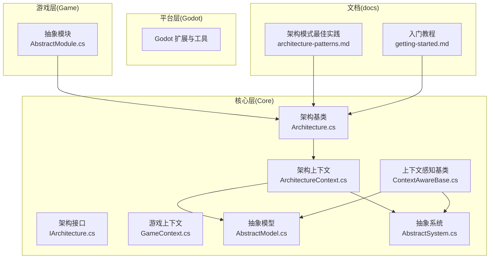
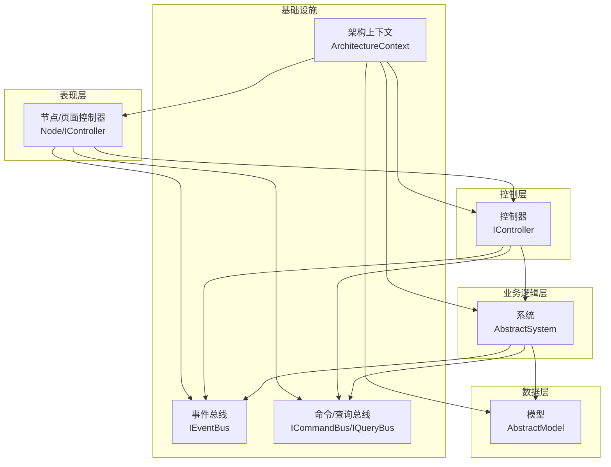
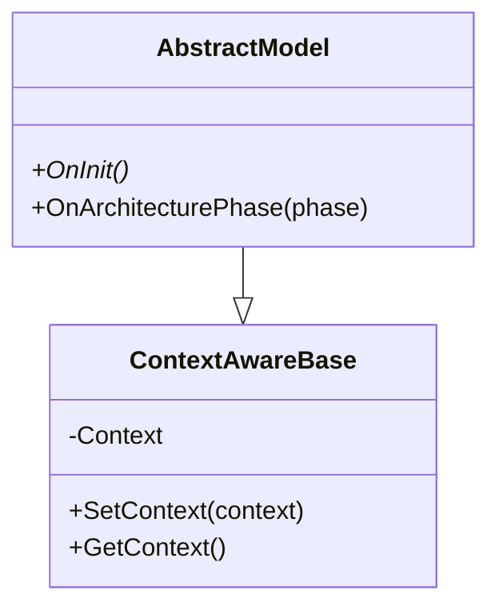
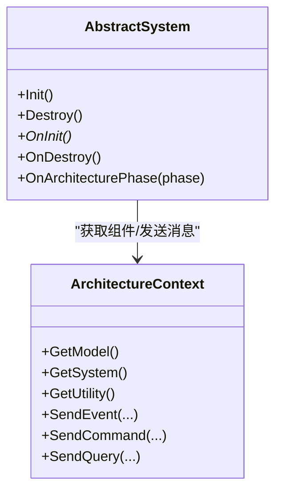
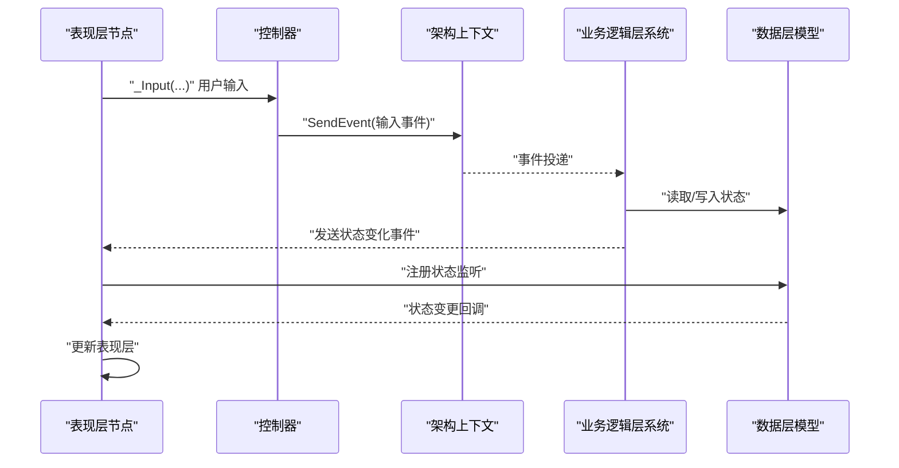
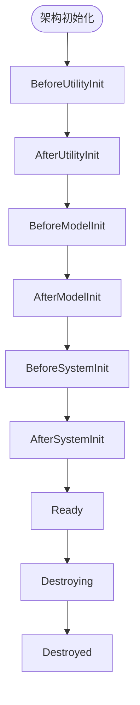
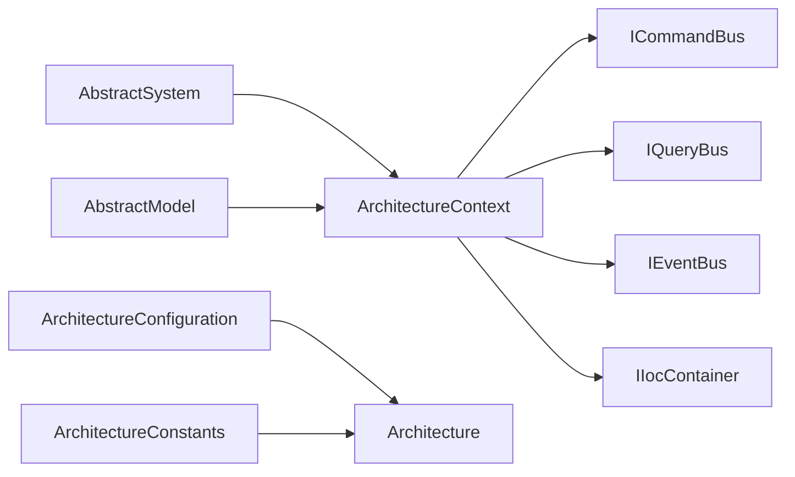

# 架构分层

<cite>
**本文引用的文件**
- [架构基类 Architecture.cs](file://GFramework.Core/architecture/Architecture.cs)
- [架构接口 IArchitecture.cs](file://GFramework.Core.Abstractions/architecture/IArchitecture.cs)
- [架构上下文 ArchitectureContext.cs](file://GFramework.Core/architecture/ArchitectureContext.cs)
- [游戏上下文 GameContext.cs](file://GFramework.Core/architecture/GameContext.cs)
- [上下文感知基类 ContextAwareBase.cs](file://GFramework.Core/rule/ContextAwareBase.cs)
- [架构常量 ArchitectureConstants.cs](file://GFramework.Core/architecture/ArchitectureConstants.cs)
- [架构配置 ArchitectureConfiguration.cs](file://GFramework.Core/architecture/ArchitectureConfiguration.cs)
- [抽象模型 AbstractModel.cs](file://GFramework.Core/model/AbstractModel.cs)
- [抽象系统 AbstractSystem.cs](file://GFramework.Core/system/AbstractSystem.cs)
- [抽象模块 AbstractModule.cs](file://GFramework.Game/architecture/AbstractModule.cs)
- [控制器接口 IController.cs](file://GFramework.Core.Abstractions/controller/IController.cs)
- [架构模式最佳实践 architecture-patterns.md](file://docs/best-practices/architecture-patterns.md)
- [Godot 入门教程 getting-started.md](file://docs/tutorials/getting-started.md)
</cite>

## 目录
1. [简介](#简介)
2. [项目结构](#项目结构)
3. [核心组件](#核心组件)
4. [架构概览](#架构概览)
5. [详细组件分析](#详细组件分析)
6. [依赖分析](#依赖分析)
7. [性能考虑](#性能考虑)
8. [故障排查指南](#故障排查指南)
9. [结论](#结论)
10. [附录](#附录)

## 简介
本文件面向 GFramework 的架构分层最佳实践，系统阐述数据层(AbstractModel)、业务逻辑层(AbstractSystem)、控制层(Node/IController)与表现层的职责划分与协作方式，结合仓库中的核心实现与官方最佳实践文档，给出清晰的分层设计、数据流与交互模式，并提供正反面案例对比、测试策略与维护建议。

## 项目结构
GFramework 采用“核心层(Core) + 平台适配层(Godot) + 游戏层(Game) + 文档(docs)”的分层组织方式：
- Core 层提供跨平台的架构内核、生命周期、事件、命令/查询总线、上下文与 IoC 容器等基础设施
- Godot 层提供与 Godot 平台相关的扩展、节点工具、时间源、UI 注册表等
- Game 层提供游戏域的模块化能力（如设置、状态机、UI 路由管线等）
- 文档层提供最佳实践与教程，指导如何正确分层与组织代码

图表来源
- [架构基类 Architecture.cs](file://GFramework.Core/architecture/Architecture.cs#L1-L569)
- [架构接口 IArchitecture.cs](file://GFramework.Core.Abstractions/architecture/IArchitecture.cs#L1-L68)
- [架构上下文 ArchitectureContext.cs](file://GFramework.Core/architecture/ArchitectureContext.cs#L1-L225)
- [游戏上下文 GameContext.cs](file://GFramework.Core/architecture/GameContext.cs#L1-L111)
- [上下文感知基类 ContextAwareBase.cs](file://GFramework.Core/rule/ContextAwareBase.cs#L1-L43)
- [抽象模型 AbstractModel.cs](file://GFramework.Core/model/AbstractModel.cs#L1-L34)
- [抽象系统 AbstractSystem.cs](file://GFramework.Core/system/AbstractSystem.cs#L1-L62)
- [抽象模块 AbstractModule.cs](file://GFramework.Game/architecture/AbstractModule.cs#L1-L33)
- [架构模式最佳实践 architecture-patterns.md](file://docs/best-practices/architecture-patterns.md#L1-L800)
- [Godot 入门教程 getting-started.md](file://docs/tutorials/getting-started.md#L644-L875)

章节来源
- [架构基类 Architecture.cs](file://GFramework.Core/architecture/Architecture.cs#L1-L569)
- [架构上下文 ArchitectureContext.cs](file://GFramework.Core/architecture/ArchitectureContext.cs#L1-L225)
- [架构模式最佳实践 architecture-patterns.md](file://docs/best-practices/architecture-patterns.md#L284-L464)

## 核心组件
- 架构基类与生命周期
  - Architecture 负责阶段式生命周期管理、组件注册与初始化、销毁流程、事件广播与阶段通知
  - ArchitectureConstants 定义阶段顺序与允许的转换
  - ArchitectureConfiguration 提供日志与架构选项的默认配置
- 上下文与依赖注入
  - ArchitectureContext 提供对系统/模型/工具的获取与命令/查询/事件的执行入口
  - GameContext 管理多架构上下文绑定与获取
  - ContextAwareBase 为组件提供上下文感知能力
- 分层基类
  - AbstractModel：数据层基类，实现 IModel，提供初始化与阶段事件处理
  - AbstractSystem：业务逻辑层基类，实现 ISystem，提供初始化/销毁与阶段事件处理
- 模块化
  - AbstractModule：模块基类，支持 Install 与阶段回调

章节来源
- [架构基类 Architecture.cs](file://GFramework.Core/architecture/Architecture.cs#L135-L398)
- [架构常量 ArchitectureConstants.cs](file://GFramework.Core/architecture/ArchitectureConstants.cs#L1-L54)
- [架构配置 ArchitectureConfiguration.cs](file://GFramework.Core/architecture/ArchitectureConfiguration.cs#L1-L35)
- [架构上下文 ArchitectureContext.cs](file://GFramework.Core/architecture/ArchitectureContext.cs#L16-L225)
- [游戏上下文 GameContext.cs](file://GFramework.Core/architecture/GameContext.cs#L9-L111)
- [上下文感知基类 ContextAwareBase.cs](file://GFramework.Core/rule/ContextAwareBase.cs#L10-L43)
- [抽象模型 AbstractModel.cs](file://GFramework.Core/model/AbstractModel.cs#L11-L34)
- [抽象系统 AbstractSystem.cs](file://GFramework.Core/system/AbstractSystem.cs#L13-L62)
- [抽象模块 AbstractModule.cs](file://GFramework.Game/architecture/AbstractModule.cs#L9-L33)

## 架构概览
GFramework 的分层架构围绕“数据层-业务逻辑层-控制层-表现层”展开，配合事件总线与上下文上下文，形成清晰的职责边界与数据流：

图表来源
- [架构上下文 ArchitectureContext.cs](file://GFramework.Core/architecture/ArchitectureContext.cs#L16-L225)
- [抽象系统 AbstractSystem.cs](file://GFramework.Core/system/AbstractSystem.cs#L13-L62)
- [抽象模型 AbstractModel.cs](file://GFramework.Core/model/AbstractModel.cs#L11-L34)
- [控制器接口 IController.cs](file://GFramework.Core.Abstractions/controller/IController.cs#L1-L10)

章节来源
- [架构上下文 ArchitectureContext.cs](file://GFramework.Core/architecture/ArchitectureContext.cs#L43-L225)
- [架构模式最佳实践 architecture-patterns.md](file://docs/best-practices/architecture-patterns.md#L284-L434)

## 详细组件分析

### 数据层(AbstractModel)
- 职责
  - 仅负责状态存储与状态变更事件的触发
  - 通过 BindableProperty 等可绑定属性对外暴露状态
  - 对外发送领域事件（如死亡事件），不包含业务逻辑
- 生命周期
  - 在 BeforeModelInit → AfterModelInit 阶段初始化
  - 支持 OnArchitecturePhase 阶段事件处理
- 与上下文的关系
  - 通过 ContextAwareBase 获取架构上下文，便于发送事件或访问其他组件

图表来源
- [抽象模型 AbstractModel.cs](file://GFramework.Core/model/AbstractModel.cs#L11-L34)
- [上下文感知基类 ContextAwareBase.cs](file://GFramework.Core/rule/ContextAwareBase.cs#L10-L43)

章节来源
- [抽象模型 AbstractModel.cs](file://GFramework.Core/model/AbstractModel.cs#L11-L34)
- [架构基类 Architecture.cs](file://GFramework.Core/architecture/Architecture.cs#L291-L330)

### 业务逻辑层(AbstractSystem)
- 职责
  - 负责业务规则与流程编排
  - 订阅事件、读取模型状态、向模型写入状态、向外发送事件
- 生命周期
  - 在 BeforeSystemInit → AfterSystemInit 阶段初始化
  - 支持 Init/Destroy 与 OnArchitecturePhase
- 与上下文的关系
  - 通过 ArchitectureContext 获取模型/系统/工具，发送命令/查询/事件

图表来源
- [抽象系统 AbstractSystem.cs](file://GFramework.Core/system/AbstractSystem.cs#L13-L62)
- [架构上下文 ArchitectureContext.cs](file://GFramework.Core/architecture/ArchitectureContext.cs#L16-L225)

章节来源
- [抽象系统 AbstractSystem.cs](file://GFramework.Core/system/AbstractSystem.cs#L13-L62)
- [架构基类 Architecture.cs](file://GFramework.Core/architecture/Architecture.cs#L310-L330)

### 控制层(Node/IController)
- 职责
  - 连接用户输入与业务逻辑
  - 监听模型状态变化并驱动表现层更新
  - 通过 Context 发送事件（如输入事件）
- 与上下文的关系
  - 通过 Context.GetModel 获取数据层引用
  - 通过 Context.SendEvent 触发业务逻辑层处理

图表来源
- [Godot 入门教程 getting-started.md](file://docs/tutorials/getting-started.md#L644-L875)
- [架构上下文 ArchitectureContext.cs](file://GFramework.Core/architecture/ArchitectureContext.cs#L16-L225)
- [控制器接口 IController.cs](file://GFramework.Core.Abstractions/controller/IController.cs#L1-L10)

章节来源
- [Godot 入门教程 getting-started.md](file://docs/tutorials/getting-started.md#L644-L875)
- [控制器接口 IController.cs](file://GFramework.Core.Abstractions/controller/IController.cs#L1-L10)

### 表现层
- 职责
  - 响应模型状态变化与系统事件，渲染 UI、播放动画、播放音效
- 与上下文的关系
  - 通过 Context.GetModel 获取模型引用，注册状态监听
  - 通过 Context.SendEvent 发送输入事件

章节来源
- [Godot 入门教程 getting-started.md](file://docs/tutorials/getting-started.md#L644-L875)

### 模块化与阶段管理
- 模块安装
  - 通过 AbstractModule.Install 将系统/工具注册到架构
  - 模块可接收阶段回调，参与架构生命周期
- 阶段转换
  - ArchitectureConstants 定义线性阶段序列与允许转换
  - Architecture.ValidatePhaseTransition 校验转换合法性

图表来源
- [架构常量 ArchitectureConstants.cs](file://GFramework.Core/architecture/ArchitectureConstants.cs#L17-L54)
- [架构基类 Architecture.cs](file://GFramework.Core/architecture/Architecture.cs#L142-L183)

章节来源
- [抽象模块 AbstractModule.cs](file://GFramework.Game/architecture/AbstractModule.cs#L9-L33)
- [架构基类 Architecture.cs](file://GFramework.Core/architecture/Architecture.cs#L135-L224)

## 依赖分析
- 组件耦合
  - AbstractSystem/AbstractModel 通过 ContextAwareBase 间接依赖架构上下文，降低对具体实现的耦合
  - 控制器通过 IController 接口与表现层解耦
- 直接依赖
  - AbstractSystem 依赖 ArchitectureContext 获取模型/系统/工具
  - ArchitectureContext 依赖 IoC 容器与各总线（命令/查询/事件）
- 外部依赖
  - 日志工厂、环境、模块等通过配置与服务注入

图表来源
- [抽象系统 AbstractSystem.cs](file://GFramework.Core/system/AbstractSystem.cs#L13-L62)
- [抽象模型 AbstractModel.cs](file://GFramework.Core/model/AbstractModel.cs#L11-L34)
- [架构上下文 ArchitectureContext.cs](file://GFramework.Core/architecture/ArchitectureContext.cs#L16-L225)
- [架构基类 Architecture.cs](file://GFramework.Core/architecture/Architecture.cs#L531-L566)
- [架构配置 ArchitectureConfiguration.cs](file://GFramework.Core/architecture/ArchitectureConfiguration.cs#L12-L35)
- [架构常量 ArchitectureConstants.cs](file://GFramework.Core/architecture/ArchitectureConstants.cs#L9-L54)

章节来源
- [架构上下文 ArchitectureContext.cs](file://GFramework.Core/architecture/ArchitectureContext.cs#L16-L225)
- [架构基类 Architecture.cs](file://GFramework.Core/architecture/Architecture.cs#L531-L566)

## 性能考虑
- 初始化阶段化
  - 通过 BeforeUtilityInit/AfterUtilityInit、BeforeModelInit/AfterModelInit、BeforeSystemInit/AfterSystemInit 的分层初始化，减少一次性初始化开销
- 异步初始化
  - 支持 IAsyncInitializable 与 InitializeAsync，适合异步 I/O 或长耗时初始化
- 事件与总线
  - 使用事件总线解耦组件，避免循环依赖与强耦合
- 上下文缓存
  - ArchitectureContext 对服务进行简单缓存，减少重复解析成本

章节来源
- [架构基类 Architecture.cs](file://GFramework.Core/architecture/Architecture.cs#L264-L330)
- [架构上下文 ArchitectureContext.cs](file://GFramework.Core/architecture/ArchitectureContext.cs#L31-L41)

## 故障排查指南
- 阶段转换异常
  - 现象：非法阶段转换导致异常
  - 排查：检查 ArchitectureConstants 的转换表与配置项 ArchitectureConfiguration.ArchitectureProperties.StrictPhaseValidation
- 组件注册时机
  - 现象：在 Ready 阶段后注册组件抛出异常
  - 排查：确认注册时机在 InitializeInternalAsync 完成冻结前；必要时开启 ArchitectureConfiguration.ArchitectureProperties.AllowLateRegistration
- 依赖缺失
  - 现象：SendQuery/SendCommand/SendEvent 抛出“未注册”异常
  - 排查：确认对应总线已在架构中注册；检查模块安装与服务注入
- 销毁异常
  - 现象：Destroy 期间某个组件抛错导致整体销毁中断
  - 排查：查看 Architecture.cs 中的异常捕获与继续销毁逻辑

章节来源
- [架构基类 Architecture.cs](file://GFramework.Core/architecture/Architecture.cs#L164-L183)
- [架构基类 Architecture.cs](file://GFramework.Core/architecture/Architecture.cs#L407-L414)
- [架构基类 Architecture.cs](file://GFramework.Core/architecture/Architecture.cs#L377-L387)
- [架构上下文 ArchitectureContext.cs](file://GFramework.Core/architecture/ArchitectureContext.cs#L51-L71)
- [架构上下文 ArchitectureContext.cs](file://GFramework.Core/architecture/ArchitectureContext.cs#L115-L160)
- [架构上下文 ArchitectureContext.cs](file://GFramework.Core/architecture/ArchitectureContext.cs#L169-L212)

## 结论
GFramework 的分层架构通过“数据层-业务逻辑层-控制层-表现层”的职责分离与事件驱动，实现了高内聚、低耦合与可测试性。依托 Architecture 的阶段化生命周期、ArchitectureContext 的统一访问入口与 ContextAwareBase 的上下文感知能力，开发者可以清晰地组织 PlayerModel、PlayerMovementSystem、PlayerController 等组件，构建稳定且易维护的游戏架构。

## 附录

### 分层设计示例与对比
- 正确分层示例
  - 数据层：PlayerModel 仅持有状态与状态变更事件
  - 业务逻辑层：PlayerMovementSystem 读取输入事件、更新模型状态并发送移动事件
  - 控制层：Node/IController 接收输入、转发事件、监听模型状态并驱动表现层
- 反面案例
  - 控制器同时承担数据层与业务逻辑层职责，导致难以测试与维护

章节来源
- [架构模式最佳实践 architecture-patterns.md](file://docs/best-practices/architecture-patterns.md#L284-L464)

### 测试策略
- 单元测试
  - 使用 ArchitectureConfiguration 与 ArchitectureServices 自定义日志与服务，隔离外部依赖
  - 通过 ArchitectureContext.GetService 获取受测组件，断言事件与状态变更
- 集成测试
  - 使用 Architecture.Initialize/InitializeAsync 完整初始化，验证阶段转换与组件协作
- 模拟与替换
  - 使用接口（如 IModel/ISystem/IEventBus/ICommandBus/IQueryBus）与 IoC 注入，替换真实实现

章节来源
- [架构配置 ArchitectureConfiguration.cs](file://GFramework.Core/architecture/ArchitectureConfiguration.cs#L12-L35)
- [架构上下文 ArchitectureContext.cs](file://GFramework.Core/architecture/ArchitectureContext.cs#L26-L41)
- [架构基类 Architecture.cs](file://GFramework.Core/architecture/Architecture.cs#L531-L566)