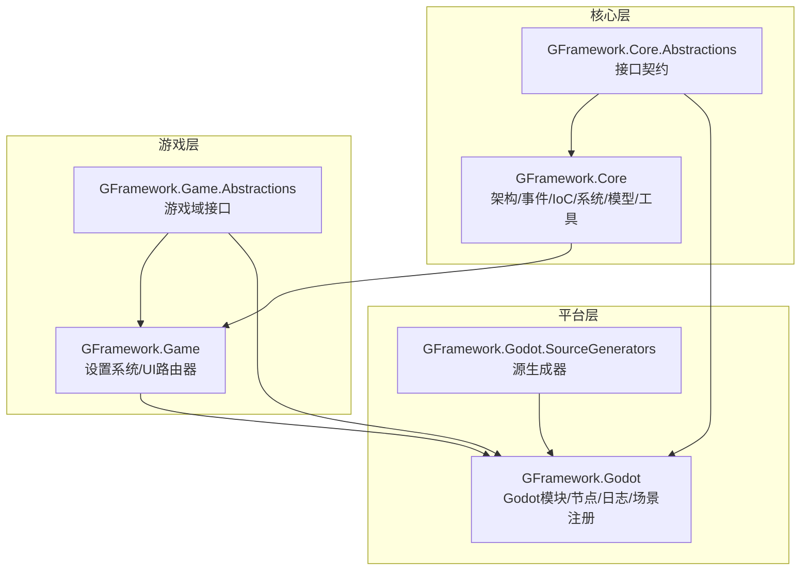
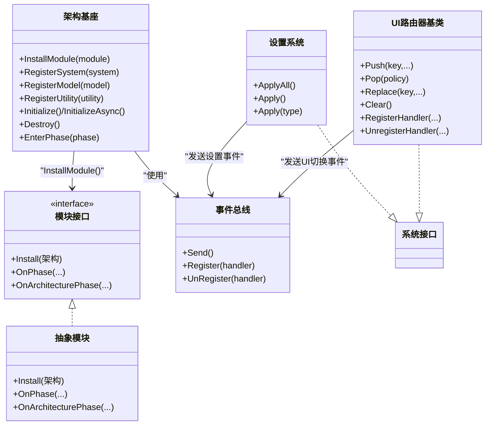
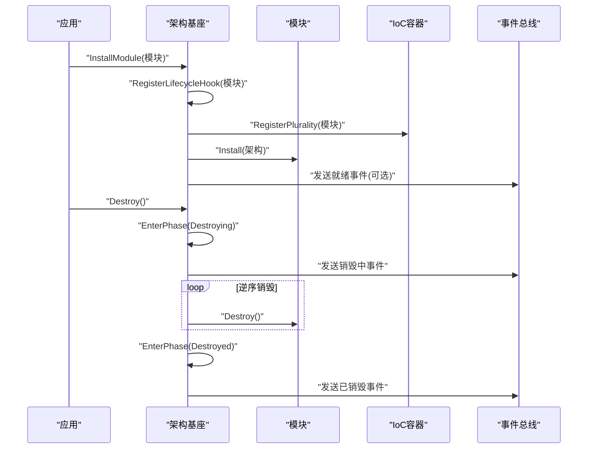
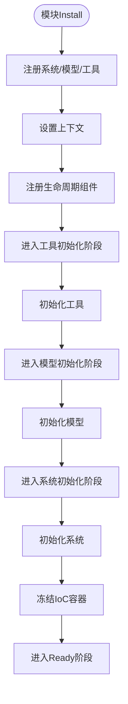
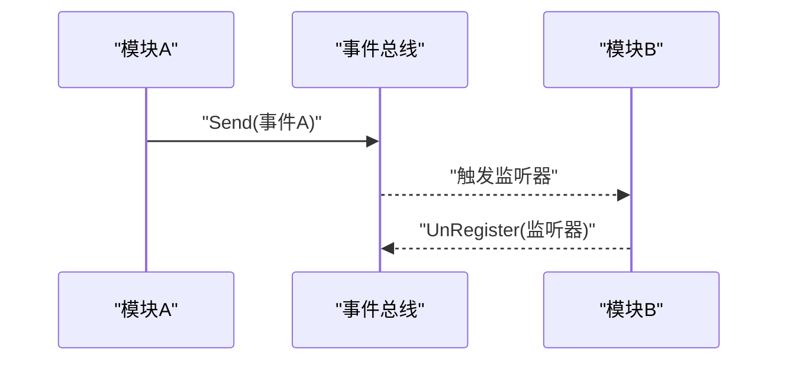
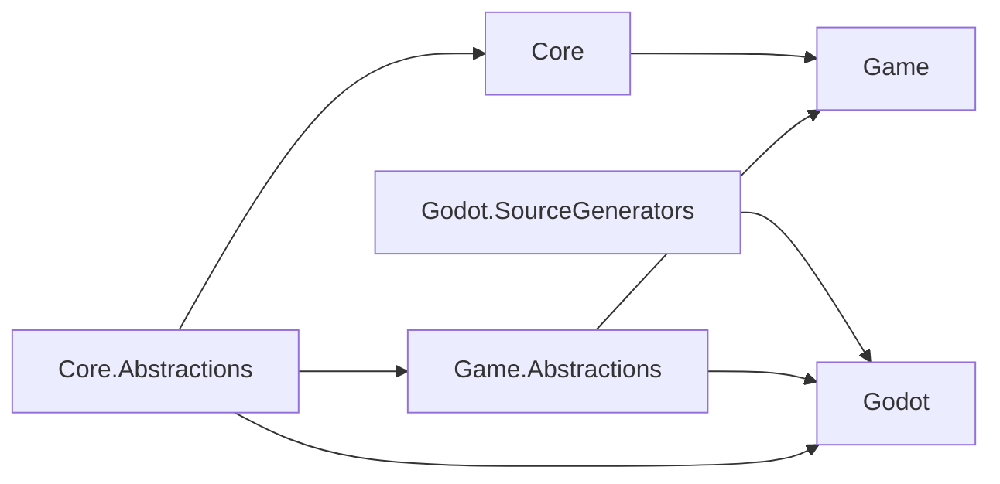

# 模块化架构

<cite>
**本文档引用的文件**
- [GFramework.Core.csproj](file://GFramework.Core/GFramework.Core.csproj)
- [GFramework.Core.Abstractions.csproj](file://GFramework.Core.Abstractions/GFramework.Core.Abstractions.csproj)
- [GFramework.Game.csproj](file://GFramework.Game/GFramework.Game.csproj)
- [GFramework.Game.Abstractions.csproj](file://GFramework.Game.Abstractions/GFramework.Game.Abstractions.csproj)
- [GFramework.Godot.csproj](file://GFramework.Godot/GFramework.Godot.csproj)
- [GFramework.Godot.SourceGenerators.csproj](file://GFramework.Godot.SourceGenerators/GFramework.Godot.SourceGenerators.csproj)
- [架构.cs](file://GFramework.Core/architecture/Architecture.cs)
- [架构配置.cs](file://GFramework.Core/architecture/ArchitectureConfiguration.cs)
- [游戏上下文.cs](file://GFramework.Core/architecture/GameContext.cs)
- [模块接口.cs](file://GFramework.Core.Abstractions/architecture/IArchitectureModule.cs)
- [抽象模块.cs](file://GFramework.Game/architecture/AbstractModule.cs)
- [抽象Godot模块.cs](file://GFramework.Godot/architecture/AbstractGodotModule.cs)
- [IGodot模块.cs](file://GFramework.Godot/architecture/IGodotModule.cs)
- [事件总线.cs](file://GFramework.Core/events/EventBus.cs)
- [简单事件.cs](file://GFramework.Core/events/EasyEvent.cs)
- [设置系统.cs](file://GFramework.Game/setting/SettingsSystem.cs)
- [UI路由器基类.cs](file://GFramework.Game/ui/UiRouterBase.cs)
</cite>

## 目录
1. [引言](#引言)
2. [项目结构](#项目结构)
3. [核心组件](#核心组件)
4. [架构总览](#架构总览)
5. [详细组件分析](#详细组件分析)
6. [依赖关系分析](#依赖关系分析)
7. [性能考量](#性能考量)
8. [故障排查指南](#故障排查指南)
9. [结论](#结论)
10. [附录](#附录)

## 引言
本文件面向GFramework的模块化架构，系统性阐述模块边界设计、安装与卸载流程、模块内系统与工具的组织方式、模块间通过事件的松耦合通信模式，以及模块化架构的测试策略与维护建议。文档旨在帮助开发者在不牺牲可扩展性与可维护性的前提下，快速搭建稳定可靠的模块化系统。

## 项目结构
GFramework采用多项目分层与模块化组合的方式：
- 核心层：提供架构基座、生命周期管理、事件系统、IoC容器等通用能力
- 游戏层：在核心之上提供游戏域的系统与工具（如设置系统、UI路由器）
- 平台适配层：针对Godot平台提供模块与节点绑定能力
- 抽象层：定义跨层接口契约，确保模块边界清晰、可替换

图表来源
- [GFramework.Core.csproj](file://GFramework.Core/GFramework.Core.csproj#L1-L13)
- [GFramework.Core.Abstractions.csproj](file://GFramework.Core.Abstractions/GFramework.Core.Abstractions.csproj#L1-L29)
- [GFramework.Game.csproj](file://GFramework.Game/GFramework.Game.csproj#L1-L17)
- [GFramework.Game.Abstractions.csproj](file://GFramework.Game.Abstractions/GFramework.Game.Abstractions.csproj#L1-L31)
- [GFramework.Godot.csproj](file://GFramework.Godot/GFramework.Godot.csproj#L1-L22)
- [GFramework.Godot.SourceGenerators.csproj](file://GFramework.Godot.SourceGenerators/GFramework.Godot.SourceGenerators.csproj#L1-L71)

章节来源
- [GFramework.Core.csproj](file://GFramework.Core/GFramework.Core.csproj#L1-L13)
- [GFramework.Core.Abstractions.csproj](file://GFramework.Core.Abstractions/GFramework.Core.Abstractions.csproj#L1-L29)
- [GFramework.Game.csproj](file://GFramework.Game/GFramework.Game.csproj#L1-L17)
- [GFramework.Game.Abstractions.csproj](file://GFramework.Game.Abstractions/GFramework.Game.Abstractions.csproj#L1-L31)
- [GFramework.Godot.csproj](file://GFramework.Godot/GFramework.Godot.csproj#L1-L22)
- [GFramework.Godot.SourceGenerators.csproj](file://GFramework.Godot.SourceGenerators/GFramework.Godot.SourceGenerators.csproj#L1-L71)

## 核心组件
- 架构基座：统一管理模块安装、组件注册、生命周期与阶段转换
- 模块接口与抽象：定义模块安装协议与阶段感知能力
- 事件系统：提供类型化事件总线，支持模块间松耦合通信
- 游戏域系统：设置系统、UI路由器等具体业务模块

章节来源
- [架构.cs](file://GFramework.Core/architecture/Architecture.cs#L38-L48)
- [模块接口.cs](file://GFramework.Core.Abstractions/architecture/IArchitectureModule.cs#L1-L14)
- [抽象模块.cs](file://GFramework.Game/architecture/AbstractModule.cs#L9-L33)
- [事件总线.cs](file://GFramework.Core/events/EventBus.cs#L8-L55)
- [设置系统.cs](file://GFramework.Game/setting/SettingsSystem.cs#L11-L99)
- [UI路由器基类.cs](file://GFramework.Game/ui/UiRouterBase.cs#L13-L725)

## 架构总览
模块化架构围绕“架构基座 + 模块 + 系统/工具”的层次展开。模块通过Install接入架构，注册自身系统与工具，参与架构生命周期与阶段转换；模块间通过事件总线进行解耦通信。

图表来源
- [架构.cs](file://GFramework.Core/architecture/Architecture.cs#L38-L48)
- [模块接口.cs](file://GFramework.Core.Abstractions/architecture/IArchitectureModule.cs#L1-L14)
- [抽象模块.cs](file://GFramework.Game/architecture/AbstractModule.cs#L9-L33)
- [事件总线.cs](file://GFramework.Core/events/EventBus.cs#L8-L55)
- [设置系统.cs](file://GFramework.Game/setting/SettingsSystem.cs#L11-L99)
- [UI路由器基类.cs](file://GFramework.Game/ui/UiRouterBase.cs#L13-L725)

## 详细组件分析

### 模块边界与设计原则
- 边界清晰：模块通过IArchitectureModule定义安装入口与阶段感知，避免跨模块直接耦合
- 单一职责：每个模块聚焦于特定领域（如设置、UI、音频等），内部聚合相关系统与工具
- 可替换性：模块依赖接口而非具体实现，便于在不同平台或场景下替换
- 可观测性：模块安装与阶段变化均通过日志记录，便于问题定位

章节来源
- [模块接口.cs](file://GFramework.Core.Abstractions/architecture/IArchitectureModule.cs#L1-L14)
- [抽象模块.cs](file://GFramework.Game/architecture/AbstractModule.cs#L9-L33)
- [抽象Godot模块.cs](file://GFramework.Godot/architecture/AbstractGodotModule.cs#L11-L55)
- [IGodot模块.cs](file://GFramework.Godot/architecture/IGodotModule.cs#L10-L27)

### 模块安装与卸载流程
- 安装流程：架构调用InstallModule注册生命周期钩子、将模块注册到IoC容器并执行模块Install
- 卸载流程：通过架构Destroy触发销毁阶段，按注册逆序调用IDisposable组件的Destroy

图表来源
- [架构.cs](file://GFramework.Core/architecture/Architecture.cs#L38-L48)
- [架构.cs](file://GFramework.Core/architecture/Architecture.cs#L357-L396)

章节来源
- [架构.cs](file://GFramework.Core/architecture/Architecture.cs#L38-L48)
- [架构.cs](file://GFramework.Core/architecture/Architecture.cs#L357-L396)

### 模块内系统与工具组织
- 系统注册：架构提供RegisterSystem/RegisterModel/RegisterUtility，统一设置上下文、注册生命周期并按阶段初始化
- 初始化阶段：工具 → 模型 → 系统，阶段间可插入自定义逻辑
- 上下文绑定：GameContext提供多架构上下文绑定与查询，便于跨模块访问

图表来源
- [架构.cs](file://GFramework.Core/architecture/Architecture.cs#L423-L460)
- [架构.cs](file://GFramework.Core/architecture/Architecture.cs#L264-L330)
- [游戏上下文.cs](file://GFramework.Core/architecture/GameContext.cs#L9-L111)

章节来源
- [架构.cs](file://GFramework.Core/architecture/Architecture.cs#L423-L460)
- [架构.cs](file://GFramework.Core/architecture/Architecture.cs#L264-L330)
- [游戏上下文.cs](file://GFramework.Core/architecture/GameContext.cs#L9-L111)

### 模块间通信：事件驱动的松耦合
- 类型化事件：EventBus提供基于类型的Send/Register/UnRegister，模块通过事件发布/订阅实现解耦
- 典型场景：设置系统在应用设置前后发送事件；UI路由器在页面切换前后发送事件

图表来源
- [事件总线.cs](file://GFramework.Core/events/EventBus.cs#L8-L55)
- [简单事件.cs](file://GFramework.Core/events/EasyEvent.cs#L8-L39)
- [设置系统.cs](file://GFramework.Game/setting/SettingsSystem.cs#L86-L98)
- [UI路由器基类.cs](file://GFramework.Game/ui/UiRouterBase.cs#L339-L364)

章节来源
- [事件总线.cs](file://GFramework.Core/events/EventBus.cs#L8-L55)
- [简单事件.cs](file://GFramework.Core/events/EasyEvent.cs#L8-L39)
- [设置系统.cs](file://GFramework.Game/setting/SettingsSystem.cs#L86-L98)
- [UI路由器基类.cs](file://GFramework.Game/ui/UiRouterBase.cs#L339-L364)

### 具体模块示例：设置模块与UI模块
- 设置模块（SettingsSystem）
  - 负责批量/按类型应用设置，发送应用前/后事件，捕获异常并上报
- UI模块（UiRouterBase）
  - 提供页面栈管理、层级管理、路由守卫、UI切换处理器管道与事件

章节来源
- [设置系统.cs](file://GFramework.Game/setting/SettingsSystem.cs#L11-L99)
- [UI路由器基类.cs](file://GFramework.Game/ui/UiRouterBase.cs#L13-L725)

## 依赖关系分析
- 核心层依赖抽象层，保证接口稳定
- 游戏层依赖核心层与抽象层，提供业务系统
- 平台层依赖核心与游戏抽象层，提供平台适配
- 源生成器作为编译期工具，不引入运行时依赖

图表来源
- [GFramework.Core.csproj](file://GFramework.Core/GFramework.Core.csproj#L9-L12)
- [GFramework.Game.csproj](file://GFramework.Game/GFramework.Game.csproj#L9-L12)
- [GFramework.Godot.csproj](file://GFramework.Godot/GFramework.Godot.csproj#L16-L20)
- [GFramework.Godot.SourceGenerators.csproj](file://GFramework.Godot.SourceGenerators/GFramework.Godot.SourceGenerators.csproj#L30-L33)

章节来源
- [GFramework.Core.csproj](file://GFramework.Core/GFramework.Core.csproj#L9-L12)
- [GFramework.Game.csproj](file://GFramework.Game/GFramework.Game.csproj#L9-L12)
- [GFramework.Godot.csproj](file://GFramework.Godot/GFramework.Godot.csproj#L16-L20)
- [GFramework.Godot.SourceGenerators.csproj](file://GFramework.Godot.SourceGenerators/GFramework.Godot.SourceGenerators.csproj#L30-L33)

## 性能考量
- 初始化阶段分层：工具/模型/系统分阶段初始化，有利于资源占用与启动时间控制
- 生命周期去重：注册去重集合避免重复初始化与销毁
- 事件总线：类型化事件减少反射开销，支持异步处理
- UI切换：前置与后置阶段分离，避免阻塞主线程

章节来源
- [架构.cs](file://GFramework.Core/architecture/Architecture.cs#L264-L330)
- [架构.cs](file://GFramework.Core/architecture/Architecture.cs#L229-L258)
- [UI路由器基类.cs](file://GFramework.Game/ui/UiRouterBase.cs#L339-L364)

## 故障排查指南
- 阶段转换异常：检查架构配置的严格阶段校验与允许的阶段转换表
- 注册时机错误：在Ready之后仍尝试注册组件会抛出异常，需在Install或BeforeReady阶段完成
- 销毁异常：单个组件销毁异常不会影响整体销毁流程，但会记录错误日志
- 事件未触发：确认事件监听器已注册且事件类型一致

章节来源
- [架构.cs](file://GFramework.Core/architecture/Architecture.cs#L164-L183)
- [架构.cs](file://GFramework.Core/architecture/Architecture.cs#L407-L414)
- [架构.cs](file://GFramework.Core/architecture/Architecture.cs#L377-L387)
- [事件总线.cs](file://GFramework.Core/events/EventBus.cs#L41-L54)

## 结论
GFramework的模块化架构通过清晰的模块边界、统一的生命周期管理与事件驱动的通信机制，实现了高内聚、低耦合的系统设计。遵循本文的最佳实践，可在复杂项目中保持模块的独立性与演进速度，同时降低集成风险。

## 附录
- 测试策略建议
  - 模块独立测试：对模块内的系统与工具进行单元测试，模拟Install与Initialize流程
  - 集成测试：通过Mock事件总线与IoC容器，验证模块间事件交互与阶段流转
  - 平台适配测试：在Godot环境下验证模块的节点绑定与生命周期钩子
- 维护建议
  - 严格遵守模块边界，避免跨模块直接依赖
  - 通过事件总线传递消息，减少硬编码耦合
  - 定期重构：拆分过大的模块，提炼公共工具与系统
  - 文档与契约：保持抽象层接口稳定，逐步演进实现层